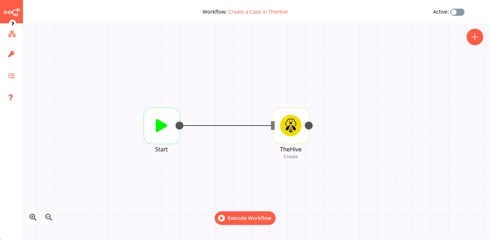

# TheHive

[TheHive](https://thehive-project.org/) is a scalable open-source and free security incident response platform.

::: tip 🔑 Credentials
You can find authentication information for this node [here](../../../credentials/TheHive/README.md).
:::

## Basic Operations

::: details Alert
- Count alerts
- Create an alert
- Execute a responder on a specified alert
- Get an alert
- Get all alerts
- Merge an alert into an existing case
- Promote an alert into a case
- Update an alert
:::

::: details Case
- Count cases
- Create a case
- Execute a responder on a specified case
- Get all cases
- Get a single case
- Update a case
:::

::: details Log
- Create a task log
- Execute a responder on a selected log
- Get all task logs
- Get a single log
:::

::: details Observable
- Count observables
- Create an observable
- Execute an analyzer
- Execute a responder on selected observable
- Get all observables of a specific case
- Get a single observable
- Search observables
- Update an observable
:::

::: details Task
- Count tasks
- Create a task
- Execute a responder on a specified task
- Get a single task
- Search tasks
- Update a task
:::

## Example Usage

This workflow allows you to create, update, and get a case in TheHive. You can also find the [workflow](https://n8n.io/workflows/808) on n8n.io. This example usage workflow uses the following nodes.
- [Start](../../core-nodes/Start/README.md)
- [TheHive]()

The final workflow should look like the following image.

### 1. Start node

The start node exists by default when you create a new workflow.

### 2. TheHive node (create: case)

This node will create a new case in TheHive with the title `n8n` and set its severity to `low`. You can create a case with a different title and severity.

1. First of all, you'll have to enter credentials for the TheHive node. You can find out how to do that [here](../../../credentials/TheHive/README.md).
2. Select 'Case' from the ***Resource*** dropdown list.
3. Select 'Create' from the ***Operation*** dropdown list.
4. Enter a title in the ***Title*** field.
5. Enter a description in the ***Description*** field.
6. Select 'Low' from the ***Severity*** dropdown list.
7. Set the start date in the ***Start Date*** field.
8. Enter a case owner in the ***Owner*** field.
9. Enter tags in the ***Tags*** field. You can enter multiple tags separate by a comma.
10. Click on ***Execute Node*** to run the node.

In the screenshot below, you will notice that the node creates a new case with the title `n8n` and `low` severity .

### 3. TheHive node (update: case)

This node will update the case that we created in the previous node. We will update the severity of the case.
::: v-pre
1. Select the credentials that you entered in the previous node.
2. Select 'Case' from the ***Resource*** dropdown list.
3. Select 'Update' from the ***Operation*** dropdown list.
4. Click on the gears icon next to the ***Case ID*** field and click on ***Add Expression***.
5. Select the following in the ***Variable Selector*** section: Nodes > TheHive > Output Data > JSON > id. You can also add the following expression: `{{$node["TheHive"].json["id"]}}`.
6. Click on ***Add Field*** and select 'Severity' from the dropdown list.
7. Select 'High' from the ***Severity*** dropdown list.
8. Click on ***Execute Node*** to run the node.
:::
In the screenshot below, you will notice that the node updates the severity of the case that we created in the previous node.

### 4. TheHive node (get: case)

This node will return the information of the case that we created in the previous node.
::: v-pre
1. Select the credentials that you entered in the previous node.
2. Select 'Case' from the ***Resource*** dropdown list.
3. Select 'Get' from the ***Operation*** dropdown list.
4. Click on the gears icon next to the ***Case ID*** field and click on ***Add Expression***.
5. Select the following in the ***Variable Selector*** section: Nodes > TheHive > Output Data > JSON > id. You can also add the following expression: `{{$node["TheHive"].json["id"]}}`.
6. Click on ***Execute Node*** to run the node.
:::
In the screenshot below, you will notice that the node returns the information of the case that we created earlier.

