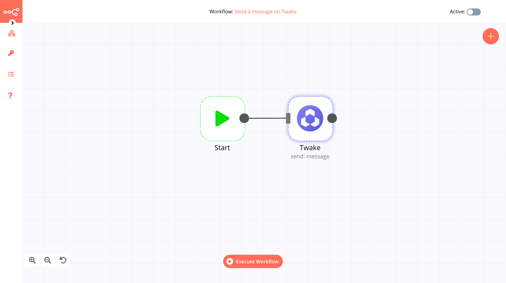

# Twake

[Twake](https://twake.app/) is an open-source collaborative workspace. It can be self-hosted and easily integrated into your teams. Twake offers features for collaboration like team chat, team calendar, video call, todo list, and storage space.

::: tip 🔑 Credentials
You can find authentication information for this node [here](../../../credentials/Twake/README.md).
:::

## Basic Operations

- Send a message

## Example Usage

This workflow allows you to send a message to a channel on Twake. You can also find the [workflow](https://n8n.io/workflows/595) on the website. This example usage workflow would use the following two nodes.
- [Start](../../core-nodes/Start/README.md)
- [Twake]()

The final workflow should look like the following image.

### 1. Start node

The start node exists by default when you create a new workflow.

### 2. Twake node

1. First of all, you'll have to enter credentials for the Twake node. You can find out how to do that [here](../../../credentials/Twake/README.md).
2. Select the channel from the ***Channel ID*** dropdown list.
3. Enter the content in the ***Content*** field.
4. Click on ***Execute Node*** to run the node.

