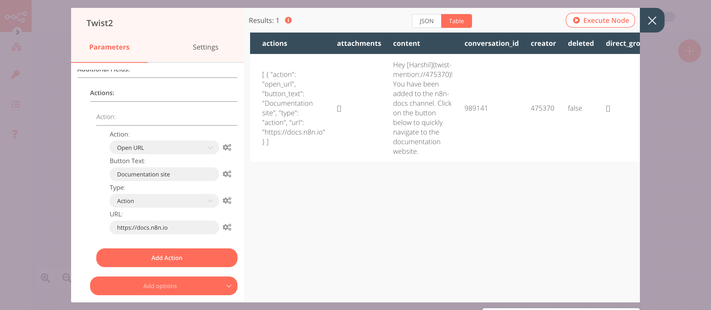

# Twist

[Twist](https://twist.com) is a communication app that helps teams balance focused work with collaborative conversations.

::: tip 🔑 Credentials
You can find authentication information for this node [here](../../../credentials/Twist/README.md).
:::

## Basic Operations

::: details Channel
- Initiate a public or private channel-based conversation
- Get information about a channel
- Get all channels
- Update a channel
:::

::: details Message Conversation
- Create a message in a conversation
:::

## Example Usage

This workflow allows you to create and update a channel as well as send a message on Twist. You can also find the [workflow](https://n8n.io/workflows/826) on n8n.io. This example usage workflow would use the following nodes.
- [Start](../../core-nodes/Start/README.md)
- [Twist]()

The final workflow should look like the following image.


### 1. Start node

The start node exists by default when you create a new workflow.


### 2. Twist node (create: channel)

This node will create a channel `n8n-docs` and add a user to the channel.
1. First of all, you'll have to enter credentials for the Twist node. You can find out how to do that [here](../../../credentials/Twist/README.md).
::: v-pre
2. Select 'Channel' from the ***Resource*** dropdown list.
3. Select a workspace from the ***Workspace ID*** dropdown list.
4. Enter `n8n-docs` in the ***Name*** field. If you want to create a channel with a different name, enter that name instead.
5. Click on ***Add Field*** and select 'User IDs' from the dropdown list.
6. Select the users from the ***User IDs*** dropdown list. The users you select will be added to the channel.
7. Click on ***Execute Node*** to run the node.
:::
In the screenshot below, you will notice that the node creates a new channel named `n8n-docs`, and adds a user to the channel.


### 3. Twist1 node (update: channel)

This node will update the description of the channel that we created in the previous node.
::: v-pre
1. Select the credentials that you entered in the previous node.
2. Select 'Channel' from the ***Resource*** dropdown list.
3. Select 'Update' from the ***Operation*** dropdown list.
4. Click on the gears icon next to the ***Channel ID*** field and click on ***Add Expression***.
5. Select the following in the ***Variable Selector*** section: Nodes > Twist > Output Data > JSON > id. You can also add the following expression: `{{$node["Twist"].json["id"]}}`.
6. Click on ***Add Field*** and select 'Description' from the dropdown list.
7. Enter a description in the ***Description*** field.
8. Click on ***Execute Node*** to run the node.
:::
In the screenshot below, you will notice that the node adds a description to the channel that we created in the previous node.


### 4. Twist2 node (create: messageConversation)

This node will send a message to the General conversation on Twist. The message contains an action button that navigates to `https://docs.n8n.io`.
::: v-pre
1. Select the credentials that you entered in the previous node.
2. Select a workspace from the ***Workspace ID*** dropdown list.
3. Select 'General' from the ***Conversation ID*** dropdown list. If you want to send a message to a different conversation, select that conversation instead.
4. Click on the gears icon next to the ***Channel ID*** field and click on ***Add Expression***.
5. Enter the following text in the ***Content*** field:
```
Hey [Harshil](twist-mention://475370)!
You have been added to the {{$node["Twist"].json["name"]}} channel.
Click on the button below to quickly navigate to the documentation website.
```
The above message mentions the user `Harshil`. To mention a user in your workspace you need to use their User ID. Refer to the [FAQs](#_1-where-can-i-get-the-user-id) to learn how to get a User ID.

6. Click on ***Add options*** and select 'Actions' from the dropdown list.
7. Click on the ***Add Action*** button.
8. Select 'Open URL' from the ***Action*** dropdown list.
9. Enter `Documentation site` in the ***Button Text*** field.
10. Select 'Action' from the ***Type*** dropdown list.
11. Enter `https://docs.n8n.io` in the ***URL*** field.
12. Click on ***Execute Node*** to run the node.
:::
In the screenshot below, you will notice that the node sends a message to the General conversation and mentions the user.



## FAQs

### 1. Where can I get the User ID?

To get the User ID for a user follow the steps mentioned below
1. Click on the ***Team*** tab.
2. Click on a user's avatar.
3. Copy the string of characters located after `/u/` in your Twist URL. This string is the User ID. For example, if the URL is `https://twist.com/a/4qw45/people/u/475370` the User ID will be `475370`.
