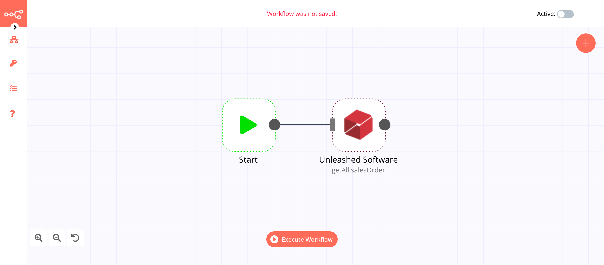

# Unleashed Software

[Unleashed Software](https://www.unleashedsoftware.com) is a cloud app that gives product businesses the freedom to better make, manage and move products by enabling them to achieve complete clarity and control over suppliers, production, warehouses, and sales.

::: tip 🔑 Credentials
You can find authentication information for this node [here](../../../credentials/UnleashedSoftware/README.md).
:::

## Basic Operations

::: details Sales Order
- Get all sales orders
:::

::: details Stock On Hand
- Get a stock on hand
- Get all stocks on hand
:::

## Example Usage

This workflow allows you to get a list of all the orders from Unleashed Software based on the order status. You can also find the [workflow](https://n8n.io/workflows/641) on n8n.io. This example usage workflow would use the following nodes.
- [Start](../../core-nodes/Start/README.md)
- [Unleashed Software]()

The final workflow should look like the following image.

### 1. Start node

The start node exists by default when you create a new workflow.

### 2. Unleashed Software node

1. First of all, you'll have to enter credentials for the Unleashed Software node. You can find out how to do that [here](../../../credentials/UnleashedSoftware/README.md).
2. Toggle ***Return All*** to true.
3. Click on the ***Add Filter*** button and select 'Order Status' from the dropdown list.
4. Select 'Completed' from the ***Order Status*** dropdown list.
5. Click on ***Execute Node*** to run the node.

