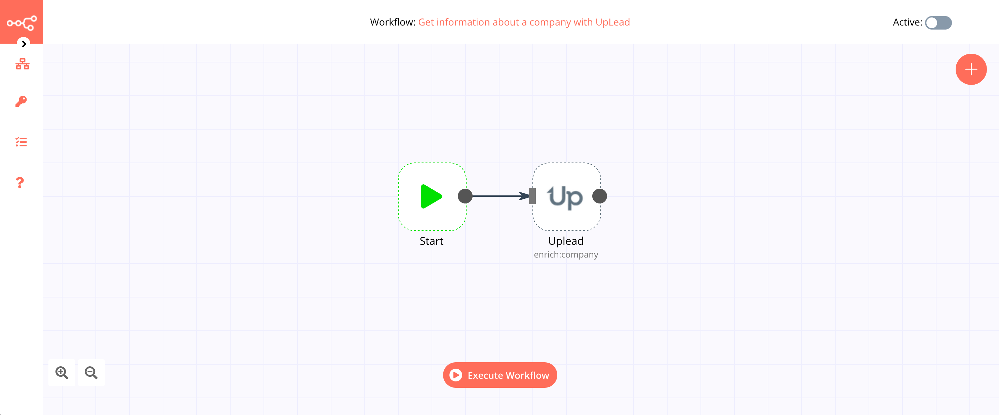

# UpLead

[UpLead](https://www.uplead.com/) helps increase sales by quickly finding, connecting, and engaging with qualified prospects.

::: tip 🔑 Credentials
You can find authentication information for this node [here](../../../credentials/UpLead/README.md).
:::

## Basic Operations

::: details Company
- Get information about a company
:::

::: details Person
- Get information about a person
:::

## Example Usage

This workflow allows you to get information about a company with UpLead. You can also find the [workflow](https://n8n.io/workflows/504) on the website. This example usage workflow would use the following two nodes.
- [Start](../../core-nodes/Start/README.md)
- [UpLead]()

The final workflow should look like the following image.

### 1. Start node

The start node exists by default when you create a new workflow.

### 2. UpLead node

1. First of all, you'll have to enter credentials for the UpLead node. You can find out how to do that [here](../../../credentials/UpLead/README.md).
2. Enter the name of the company in the *Company* field. For example, I entered `Apple`.
3. Click on *Execute Node* to run the workflow.
