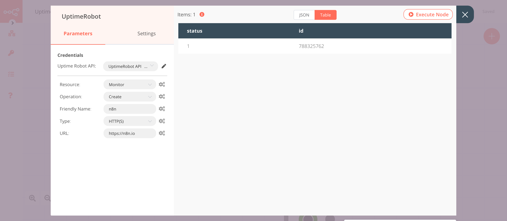

# UptimeRobot

[UptimeRobot](https://uptimerobot.com/) is an uptime monitoring service. It monitors your website every 5 mins. You can set an HTTP/S, ping, port, keyword, or heartbeat monitor and get notifications to your email, phone, Telegram, Slack, Twitter, etc.

::: tip 🔑 Credentials
You can find authentication information for this node [here](../../../credentials/UptimeRobot/README.md).
:::

## Basic Operations

<Resource node="n8n-nodes-base.uptimeRobot" />

## Example Usage

This workflow allows you to create, update, and get a monitor using the UptimeRobot node. You can also find the [workflow](https://n8n.io/workflows/1112) on n8n.io. This example usage workflow uses the following nodes.
- [Start](../../core-nodes/Start/README.md)
- [UptimeRobot]()

The final workflow should look like the following image.

### 1. Start node

The start node exists by default when you create a new workflow.

### 2. UptimeRobot node (create: monitor)

This node will create a new monitor of the type `HTTP(S)`.

1. First of all, you'll have to enter credentials for the OpenWeatherMap node. You can find out how to do that [here](../../../credentials/OpenWeatherMap/README.md).
2. Select 'Monitor' from the ***Resource*** dropdown list.
3. Select 'Create' from the ***Operation*** dropdown list.
4. Enter `n8n` in the ***Friendly Name*** field.
5. Select 'HTTP(S)' from the ***Type*** dropdown list.
6. Enter `https://n8n.io` in the ***URL*** field.
7. Click on ***Execute Node*** to run the node.

In the screenshot below, you will notice that the node returns data about the current weather in Berlin.

### 3. UptimeRobot node (update: monitor)

This node will update the monitor that we created in the previous node.
::: v-pre
1. Select the credentials that you entered in the previous node.
2. Select 'Monitor' from the ***Resource*** dropdown list.
3. Select 'Update' from the ***Operation*** dropdown list.
4. Click on the gears icon next to the ***ID*** field and click on ***Add Expression***.
5. Select the following in the ***Variable Selector*** section: Current Node > Input Data > JSON > id. You can also add the following expression: `{{$json["id"]}}`.
6. Click on ***Add Field*** and select 'Friendly Name' from the dropdown list.
7. Enter `n8n website` in the ***Friendly Name*** field.
8. Click on ***Execute Node*** to run the node.
:::

In the screenshot below, you will notice that the node updates the friendly name of the monitor that we created in the previous node.

### 4. UptimeRobot node (get: monitor)

This node will get the information of the monitor that we created in the previous node.
::: v-pre
1. Select the credentials that you entered in the previous node.
2. Select 'Monitor' from the ***Resource*** dropdown list.
3. Select 'Update' from the ***Operation*** dropdown list.
4. Click on the gears icon next to the ***ID*** field and click on ***Add Expression***.
5. Select the following in the ***Variable Selector*** section: Current Node > Input Data > JSON > id. You can also add the following expression: `{{$json["id"]}}`.
6. Click on ***Execute Node*** to run the node.
:::

In the screenshot below, you will notice that the node returns the information of the monitor that we created earlier.

