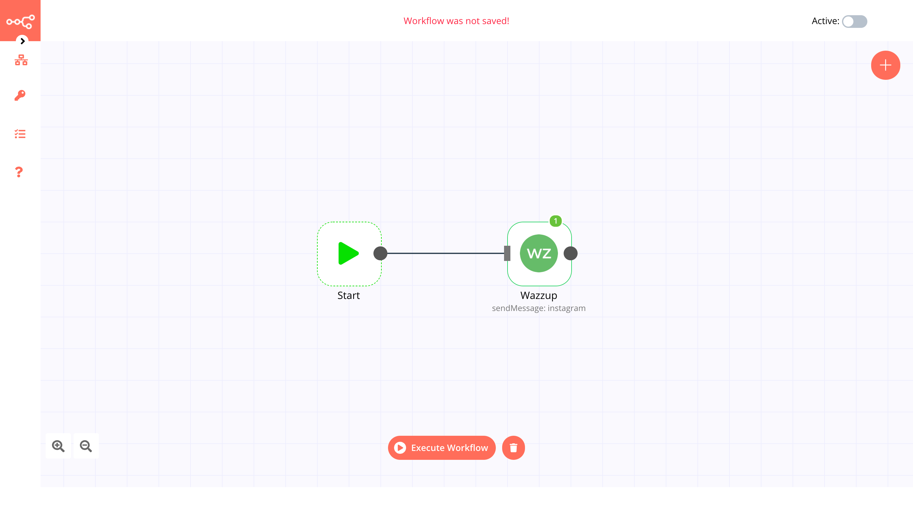

# Wazzup

[Wazzup](https://kutt.it/fb5b6u) is a cloud communications platform as a service company. Wazzup allows software developers to programmatically send text messages via whatsapp, instagram, and perform other communication functions using its web service APIs.

::: tip 🔑 Credentials
You can find authentication information for this node [here](../../../credentials/Wazzup/README.md).
:::

## Basic Operations

::: details Whatsapp
- Send Whatsapp message
- Send Whatsapp file message
:::

::: details Instagram
- Send Instagram message
- Send Instagram file message
:::

::: details Вконтакте
- Send Вконтакте message
- Send Вконтакте file message
:::

::: details Channels
- Get your account available channels
:::

## Example Usage

This workflow allows you to send an Instagram or a Whatsapp message to a specified recepient ID (phone number or instagram ID) from your connected [social channels](https://kutt.it/fb5b6u). This example usage workflow would use the following two nodes.
- [Start](../../core-nodes/Start/README.md)
- [Wazzup]()

The final workflow should look like the following image.

### 1. Start node

The start node exists by default when you create a new workflow.

### 2. Wazzup node

1. First, you'll have to enter credentials for the Wazzup node. You can find out how to do that [here](../../../credentials/Wazzup/README.md).
2. Select *Resource* and *Operation* (do you wanna send file or text message)
3. Enter the [channel id](https://kutt.it/fb5b6u) in the *Channel ID* field. Or you can get it finamically from *Channels* resourse (use another node for it).
4. Enter the phone number (or other) to which you'll be sending the message in the *MessageTo* field.
5. Enter you message in the *Message* field.
6. Click on *Execute Node* to run the workflow.

## Further Reading

- [Making gRPC client via telegram in n8n 🌪](https://pshktrck.ru/n8n-telegram-grpc/?utm_source=n8n.docs)
