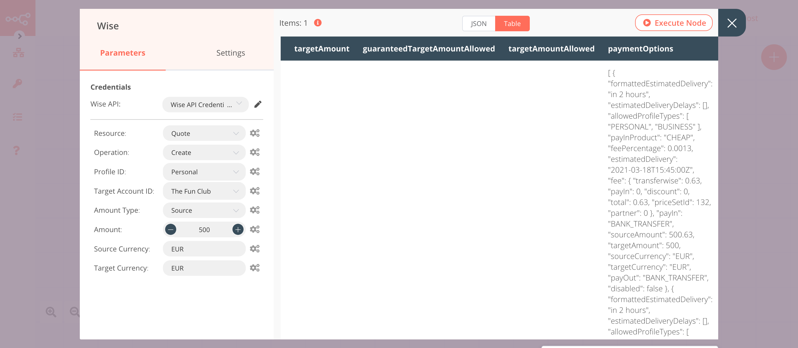
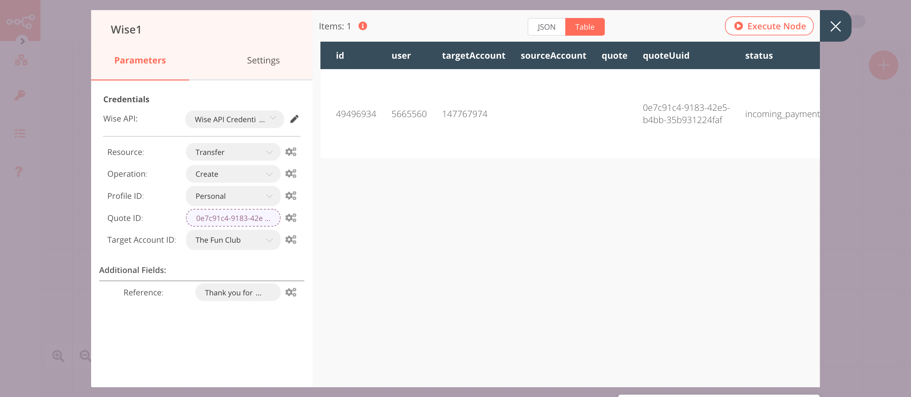
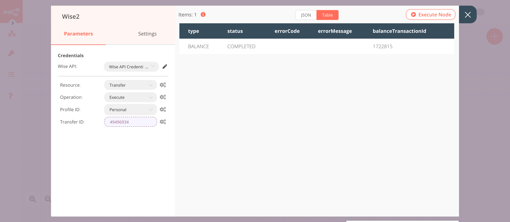

# Wise

[Wise](https://wise.com) allows you to transfer money abroad with low-cost money transfers, receive money with international account details, and track transactions on your phone.

::: tip 🔑 Credentials
You can find authentication information for this node [here](../../../credentials/Wise/README.md).
:::

## Basic Operations

::: details Account
- Retrieve balances for all account currencies of this user
- Retrieve all currencies in the borderless account of this user
- Retrieve the statement for the borderless account of this user
:::

::: details Exchange Rate
- Get
:::

::: details Profile
- Get a profile
- Get all profiles
:::

::: details Recipient
- Get all recipients
:::

::: details Quote
- Create a quote
- Get a quote
:::

::: details Transfer
- Create a transfer
- Delete a transfer
- Execute a transfer
- Get a transfer
- Get all transfers
:::

## Example Usage

This workflow allows you to create a quote and a transfer, execute the transfer, and get the information of the transfer using the Wise node. You can also find the [workflow](https://n8n.io/workflows/992) on n8n.io. This example usage workflow uses the following nodes.
- [Start](../../core-nodes/Start/README.md)
- [Wise]()

The final workflow should look like the following image.

### 1. Start node

The start node exists by default when you create a new workflow.

### 2. Wise node (create: quote)

This node will create a new quote in Wise.

1. First of all, you'll have to enter credentials for the Wise node. You can find out how to do that [here](../../../credentials/Wise/README.md).
2. Select 'Quote' from the ***Resource*** dropdown list.
3. Select 'Create' from the ***Operation*** dropdown list.
4. Select a profile from the ***Profile ID*** dropdown list.
5. Select a target account from the ***Target Account ID*** dropdown list.
6. Enter an amount in the ***Amount*** field.
7. Enter the source currency in the ***Source Currency*** field.
8. Enter the target currency in the ***Target Currency*** field.
9. Click on ***Execute Node*** to run the node.

In the screenshot below, you will notice that the node creates a new quote.

### 3. Wise1 node (create: transfer)

This node will create a new transfer for the quote that we created in the previous node.
::: v-pre
1. Select the credentials that you entered in the previous node.
2. Select 'Transfer' from the ***Resource*** dropdown list.
3. Select a profile from the ***Profile ID*** dropdown list.
4. Click on the gears icon next to the ***Quote ID*** field and click on ***Add Expression***.
5. Select the following in the ***Variable Selector*** section: Current Node > Input Data > JSON > id. You can also add the following expression: `{{$json["id"]}}`.
6. Select the target account from the ***Target Account ID*** dropdown list.
7. Click on the ***Add Field*** button.
8. Enter a description in the ***Reference*** field.
9. Click on ***Execute Node*** to run the node.
:::
In the screenshot below, you will notice that the node creates a new transfer for the quote that we created in the previous node.

### 4. Wise2 node (execute: transfer)

This node will execute the transfer that we created in the previous node.
:::v-pre
1. Select the credentials that you entered in the previous node.
2. Select 'Transfer' from the ***Resource*** dropdown list.
3. Select 'Execute' from the ***Operation*** dropdown list.
4. Select a profile from the ***Profile ID*** dropdown list.
5. Click on the gears icon next to the ***Transfer ID*** field and click on ***Add Expression***.
6. Select the following in the ***Variable Selector*** section: Current Node > Input Data > JSON > id. You can also add the following expression: `{{$json["id"]}}`.
7. Click on ***Execute Node*** to run the node.

In the screenshot below, you will notice that the node returns the executes the transfer that we created in the previous node.

### 5. Wise3 node (get: transfer)

This node will return the information of the transfer that we executed in the previous node.
:::v-pre
1. Select the credentials that you entered in the previous node.
2. Select 'Transfer' from the ***Resource*** dropdown list.
3. Select 'Get' from the ***Operation*** dropdown list.
4. Click on the gears icon next to the ***Transfer ID*** field and click on ***Add Expression***.
5. Select the following in the ***Variable Selector*** section: Nodes > Wise1 > Output Data > JSON > id. You can also add the following expression: `{{$node["Wise1"].json["id"]}}`.
6. Click on ***Execute Node*** to run the node.

In the screenshot below, you will notice that the node returns the information about the transfer that we executed in the previous node.

