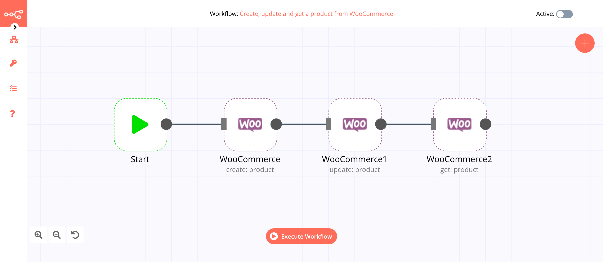
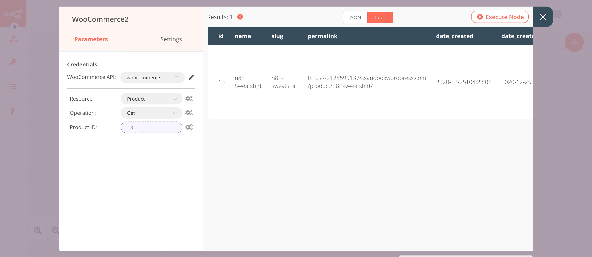

# WooCommerce

[WooCommerce](https://woocommerce.com/) is a customizable, open-source e-commerce plugin for WordPress.

::: tip 🔑 Credentials
You can find authentication information for this node [here](../../../credentials/WooCommerce/README.md).
:::

## Basic Operations

<Resource node="n8n-nodes-base.wooCommerce" />

## Example Usage

This workflow allows you to create, update, and get a product from WooCommerce. You can also find the [workflow](https://n8n.io/workflows/847) on n8n.io. This example usage workflow uses the following nodes.
- [Start](../../core-nodes/Start/README.md)
- [WooCommerce]()

The final workflow should look like the following image.

### 1. Start node

The start node exists by default when you create a new workflow.

### 2. WooCommerce node (create: product)

This node will create a new product in WooCommerce.

1. First of all, you'll have to enter credentials for the WooCommerce node. You can find out how to do that [here](../../../credentials/WooCommerce/README.md).
2. Enter the product name in the ***Name*** field.
3. Click on ***Add Field*** and select 'Description'.
4. Enter a description in the ***Description*** field.
5. Click on ***Add Field*** and select 'Regular Price'.
6. Enter the price in the ***Regular Price*** field.
7. Click on ***Execute Node*** to run the node.

In the screenshot below, you will notice that the node creates a new product.

### 3. WooCommerce1 node (update: product)

This node will update the product that we created in the previous node. We will update the quantity of the product.
::: v-pre
1. Select the credentials that you entered in the previous node.
2. Select 'Update' from the ***Operation*** dropdown list.
3. Click on the gears icon next to the ***Product ID*** field and click on ***Add Expression***.
4. Select the following in the ***Variable Selector*** section: Nodes > WooCommerce > Output Data > JSON > id. You can also add the following expression: `{{$node["WooCommerce"].json["id"]}}`.
5. Click on ***Add Field*** and select 'Stock Quantity'.
6. Set the quantity in the ***Stock Quantity*** field.
7. Click on ***Execute Node*** to run the node.
:::
In the screenshot below, you will notice that the node updates the quantity of the product that we created in the previous node.

### 4. WooCommerce2 node (get: product)

This node will get the information about the product that we created using the WooCommerce node.
:::v-pre
1. Select the credentials that you entered in the previous node.
2. Select 'Update' from the ***Operation*** dropdown list.
3. Click on the gears icon next to the ***Product ID*** field and click on ***Add Expression***.
4. Select the following in the ***Variable Selector*** section: Nodes > WooCommerce > Output Data > JSON > id. You can also add the following expression: `{{$node["WooCommerce"].json["id"]}}`.
5. Click on ***Execute Node*** to run the node.

In the screenshot below, you will notice that the node returns the information about the product that we created using the WooCommerce node.

