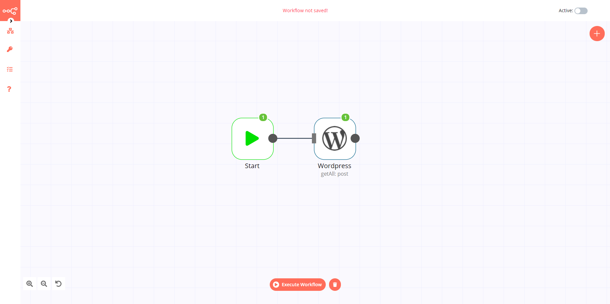

# WordPress

[WordPress](https://wordpress.org/) is a free and open-source content management system written in PHP and paired with a MySQL or MariaDB database.

::: tip 🔑 Credentials
You can find authentication information for this node [here](../../../credentials/WordPress/README.md).
:::

## Basic Operations

- Post
    - Create a post
    - Get a post
    - Get all posts
    - Update a post
- User
	- Create a user
	- Get a user
	- Get all users
	- Update a user

## Example Usage

This workflow allows you to create a post and update the post in WordPress. You can also find the [workflow](https://n8n.io/workflows/668) on the website. This example usage workflow would use the following two nodes.
- [Start](../../core-nodes/Start/README.md)
- [WordPress]()

The final workflow should look like the following image.

### 1. Start node

The start node exists by default when you create a new workflow.

### 2. Wordpress node (create: post)

1. First of all, you'll have to enter credentials for the WordPress node. You can find out how to do that [here](../../../credentials/WordPress/README.md).
2. Enter the title in the ***Title*** field.
3. Click on ***Execute Node*** to run the workflow.

::: v-pre
### 3. Wordpress1 node (update: post)

1. Select the credentials that you entered in the previous node.
2. Select 'Update' from the ***Operation*** dropdown list.
3. Click on the gears icon next to the ***Post ID*** field and click on ***Add Expression***.
4. Select the following in the ***Variable Selector*** section: Nodes > Wordpress > Output Data > JSON > id. You can also add the following expression: `{{$node["Wordpress"].json["id"]}}`.
5. Click on the ***Add Field*** button and select 'Content' from the dropdown list.
6. Enter the content in the ***Content*** filed.
7. Click on ***Execute Node*** to run the workflow.
:::

