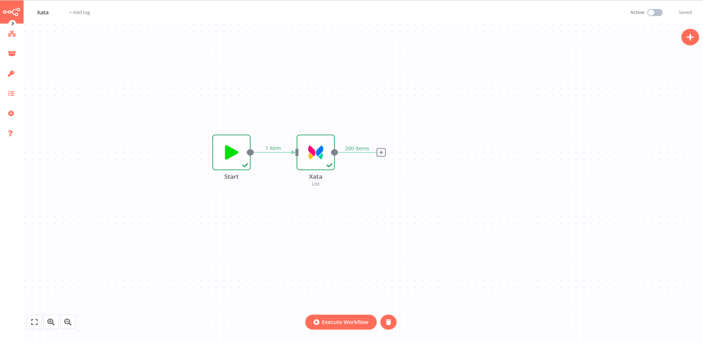

# WordPress

[Xata](https://xata.io/) is a serverless database.

::: tip 🔑 Credentials
You can find authentication information for this node [here](../../../credentials/Xata/README.md).
:::

## Basic Operations

1. Append records to the database
2. Delete records from the database
3. List records from the database
4. Read records from the database
5. Delete records

## Example Usage

This workflow allows you to list records from table in Xata.
- [Start](../../core-nodes/Start/README.md)
- [WordPress]()

The final workflow should look like the following image.

### 1. Start node

The start node exists by default when you create a new workflow.

### 2. Wordpress node (create: post)

1. First of all, you'll have to enter credentials for the Xata node. You can find out how to do that [here](../../../credentials/xata/README.md).
2. Enter the Slug of your workspace in the ***Workspace-Slug*** field.
3. Enter the name of the database you want to access in the ***Database*** field.
4. Enter the name of the table you want to access in the ***Table*** field.
5. Enter the name of the branch you want to access in the ***Branch*** field.
3. Click on ***Execute Node*** to run the workflow.

::: v-pre
### 3. Wordpress1 node (update: post)

1. Select the credentials that you entered in the previous node.
2. Select 'Update' from the ***Operation*** dropdown list.
3. Click on the gears icon next to the ***Post ID*** field and click on ***Add Expression***.
4. Select the following in the ***Variable Selector*** section: Nodes > Wordpress > Output Data > JSON > id. You can also add the following expression: `{{$node["Wordpress"].json["id"]}}`.
5. Click on the ***Add Field*** button and select 'Content' from the dropdown list.
6. Enter the content in the ***Content*** filed.
7. Click on ***Execute Node*** to run the workflow.
:::

