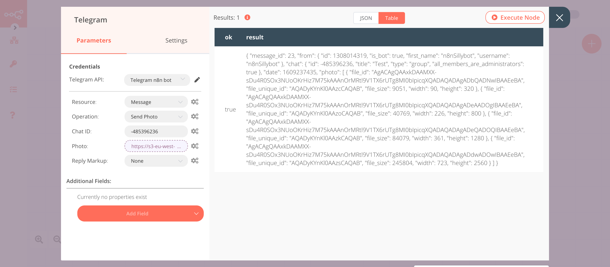

# uProc

[uProc](https://uproc.io/) is a data platform that allows to clean, verify, and enrich any data field.

::: tip 🔑 Credentials
You can find authentication information for this node [here](../../../credentials/uProc/README.md).
:::

## Basic Operations

::: details Audio
- Get advanced human audio file by provided text and language
- Get an audio file by provided text and language
:::

::: details Communication
- Discover if a domain has a social network presence
- Discover if an email is valid, hard bounce, soft bounce, spam-trap, free, temporary, and recipient exists
- Discover if the email recipient exists, returning email status
- Check if an email domain has an SMTP server to receive emails
- Discover if the email has a social network presence
- Check if an email has a valid format
- Check if an email domain belongs to a disposable email service
- Check if email belongs to free service provider like Gmail, Hotmail
- Discover if an email exists in the Robinson list (only Spain)
- Check if email belongs to a system or role-based account
- Check if an email is a spam trap
- Discover if an IMEI number has a valid format
- Check if a LinkedIn profile is a first-degree contact
- Discover if mobile phone number exists in network operator, with worldwide coverage
- Discover if a mobile phone number has a valid format with worldwide coverage
- Discover if a mobile phone number has a valid format (only Spain)
- Discover if a mobile phone number has a valid prefix, with worldwide coverage
- Discover if a Spanish mobile phone number has a valid prefix
- Discover if a mobile number is switched on to call it later, with worldwide coverage
- Discover if a mobile number can receive SMS with worldwide coverage
- Discover if a phone (landline or mobile) exists in a Robinson list (only Spain)
- Discover if a landline or mobile number has a valid prefix
- Discover if a landline phone number is valid, with Spain coverage
- Allows discovering if landline number has a good international format, depending on the country
- Discover if a landline phone number prefix exists, with worldwide coverage
- Clean a phone removing non allowed characters
- Allows getting country code of a mobile phone number with international format
- Allows getting a domain from an email
- Discover an email by company website or domain and prospect's first-name and last-name
- Check if an email is personal or generic
- Get emails list found on the internet by domain or URI
- Get an emails list found on the internet by non-free email
- Get emails list found inside the website by domain or URI
- Get three first web references of an email published on the internet
- Allows you to fix the email domain of those misspelled emails
- Fix the international prefix of a phone based on the ISO code of a country
- Get GDPR compliant emails list by domain for your Email Marketing campaigns in Europe
- Discover if mobile exist via real-time HLR query
- Get portability data about a landline or mobile number, only for Spain
- Extract results from a LinkedIn search (employees in a company)
- Get members in a LinkedIn group
- Extract the last 80 connections from your LinkedIn profile
- Extract the last 80 invitations sent from your LinkedIn
- Get users who comment on a post on LinkedIn
- Get users who like a post on LinkedIn
- Extract a LinkedIn profile
- Extract results from a LinkedIn search (profiles)
- Extract fastly last profiles that have published content on LinkedIn by specific keywords
- Discover if mobile exist via real-time HLR query, as well as portability and roaming data
- Get existence, portability, and roaming of a mobile phone via MNP query
- Discover if mobile or landline prefix exists in Spain
- Allows normalizing email address, removing non allowed characters
- Allows normalizing a mobile phone, removing non-allowed characters
- Parse phone number in multiple fields and verify format and prefix validity
- Allows getting country prefix number by country code
- Discover an email by company website or domain and prospect's first-name and last-name
- This tool parses a social URI address and extracts any available indicators
- Search all social networks by domain, parses all found URLs, and returns social networks KPIs
- Discover if a domain or a website has social activity and returns all social network profiles found
- Discover if an email has social activity, and get all social network profiles found
- Discover if a mobile phone has social activity, and get all social network profiles found
- Get web references for an email published on the internet
- Send a custom message invitation to a non connected LinkedIn profile
- Send a custom email to a recipient
- Send a custom SMS to a recipient with worldwide coverage
- Send a custom invitation message if a profile is connected or a custom message otherwise
- Visits a profile to show interest and get profile views in return from contact, increasing your LinkedIn network
- Send a custom private message to a connected LinkedIn profile
- Get an email by contact's LinkedIn profile URI
- Discover an email by company's name and prospect's full name
- Discover an email by company's website or domain and prospect's full name
:::

::: details Company
- Discover if a CIF card number is valid
- Check if a company is a debtor by TaxID
- Check if the ISIN number is valid
- Check if the SS number is valid, only for Spain
- Identify and classify a prospecting role in detecting the right area and seniority to filter later
- Get a company's contact, social, and technology data by domain
- Get a company's contact, social, and technology data by email
- Get a company's data by CIF
- Get a company's data by DUNS
- Get a company's data by domain
- Get a company's data by email
- Get a company's data by IP address
- Get a company's data by name
- Get a company's data by phone number
- Get a company's data by social networks URI (LinkedIn, Twitter)
- Get a company's name by company domain
- Get professional data of a decision-maker by company name/domain and area
- Discover more suitable decision-maker using search engines (Bing) by company name and area
- Get professional emails of decision-makers by company domain and area
- Discover up to ten decision-makers using search engines (Bing) by company name and area
- Get a company's domain by company name
- Get employees by company name or domain, area, seniority, and country
- Get a company's Facebook profile by name without manually searching on Google or Facebook
- Get geocoded company data by IP address
- Get a company's LinkedIn profile by name without manually searching on Google or LinkedIn
- Allows normalizing a CIF number, removing non-allowed characters
- Get a company's phone by company domain
- Get a company's sales data by a company's DUNS number
- Get a company's sales data by a company's domain name
- Get a company's sales data by a company's name
- Get a company's sales data by a company's tax ID (CIF)
- Get a company's Twitter profile by name without manually searching on Google or Twitter
:::

::: details Finance
- Discover if a BIC number has a valid format
- Discover if an account number has a valid format
- Check if credit card number checksum is valid
- Discover if an IBAN account number has a valid format
- Discover if an ISO currency code is valid
- Check if a TIN exists in Europe
- Convert amount between supported currencies and an exchange date
- Get credit card type
- Get multiple ISO currency codes by a country name
- Get all ISO currency by an IP address
- Get multiple ISO currency codes by a country ISO code
- Get ISO currency code by IP address
- Get ISO currency code by a currency ISO code
- Get ISO currency code by an ISO country code
- Get ISO currency code by a country name
- Get related European TIN in Europe
- Get IBAN by account number of the country
- Get to search data bank information by IBAN account number
- Get country VAT by address
- Get country VAT by coordinates
- Get VAT by IP address
- Get VAT value by country ISO code
- Get VAT by phone number, with worldwide coverage
- Get VAT by zipcode
:::

::: details Geographical
- Check if a country's ISO code exists
- Discover if the distance between two coordinates is equal to another
- Discover if the distance(in kilometers) between two coordinates is greater than the given input
- Discover if the distance(in kilometers) between two coordinates is greater or equal to the given input
- Discover if the distance(in kilometers) between two coordinates is lower than the given input
- Check if an address exists by a partial address search
- Check if a house number exists by a partial address search
- Check if coordinates have a valid format
- Discover if a zipcode number prefix exists (only for Spain)
- Discover if a zipcode number has a valid format (only for Spain)
- Get cartesian coordinates(X, Y, Z/WGS84) by Latitude and Longitude
- Get multiple cities by phone prefix (only for Spain)
- Get multiple cities by partial initial text (only for Spain)
- Get multiple cities by zip code prefix (only for Spain)
- Get a city from IP
- City search by partial name (only for Spain)
- Discover the city name by a local phone number (only for Spain)
- Discover the city name by the zip code (only for Spain)
- Discover the community name from a zipcode (only for Spain)
- Discover latitude and longitude coordinates of an IP address
- Discover latitude and longitude coordinates of a postal address
- Get multiple country names by currency ISO code
- Get multiple countries by ISO code
- Get multiple country names by initial name
- Get country name by currency ISO code
- Get country name by IP address
- Get country name by its ISO code
- Get country by a prefix
- Get country name by phone number, with worldwide coverage
- Get Aplha2 code by a country prefix or a name
- Get decimal coordinates (degrees, minutes, and seconds) by latitude and longitude
- Returns straight-line distance(in kilometers) between two addresses
- Returns straight-line distance(in kilometers) between two GPS coordinates (latitude and longitude)
- Returns straight-line distance(in kilometers) between two IP addresses
- Returns straight-line distance(in kilometers) between two landline phones, using city and province of every phone
- Returns straight-line distance(in kilometers) between two zip codes, using city and province of every zip code
- Get an exact address by a partial address search
- Discover geographical, company, timezone, and reputation data by IPv4 address
- Discover the city name, zip code, province, country, latitude, and longitude from an IPv4 or IPv6 address and geocodes it
- Parse postal address into separated fields, getting an improved resolution
- Discover locale data (currency, language) by IPv4 or IPv6 address
- Discover the city name, zip code, province, or country by latitude and longitude
- Discover the city name, zip code, province, country, latitude, and longitude from an IPv4 or IPv6 address
- Discover the city and the province from a landline phone number (only Spain)
- Discover location data by name
- Discover the city and the province from a zipcode number (only Spain)
- Get the most relevant locations by name
- Get the most relevant locations by name, category, location, and radius
- Get multiple personal names by a prefix
- Discover network data by IPv4 or IPv6 address
- Allow normalizing an address by removing non allowed characters
- Allow normalizing a city by removing non allowed characters
- Allow normalizing a country by removing non allowed characters
- Allow normalizing a province by removing non allowed characters
- Allow normalizing a zipcode by removing non allowed characters
- Parse postal address into separated fields, getting a basic resolution
- Discover the province name from an IP address
- Get the first province by a name prefix (only for Spain)
- Discover the province name from a landline phone number (only for Spain)
- Discover the province name from a zipcode number (only for Spain)
- Get a province list by a name prefix (only for Spain)
- Get a province list by a phone prefix (only for Spain)
- Get a province list by a zipcode prefix (only for Spain)
- Discover reputation by IPv4 or IPv6 address
- Returns driving routing time, distance, fuel consumption, and cost between two addresses
- Returns driving routing time, distance, fuel consumption, and cost between two GPS coordinates
- Returns driving routing time, distance, fuel consumption, and cost between two  IP addresses
- Returns driving routing time, distance, fuel consumption, and cost between two landline phones, using city and province of every phone (only for Spain)
- Returns driving routing time, distance, fuel consumption, and cost between two zip codes, using city and province of every zip code
- Discover date-time data by IPv4 or IPv6 address
- Get USNG coordinates by latitude and longitude
- Get UTM coordinates by latitude and longitude
- Discover the zip code if you have an IP address
- Get the first zipcode by prefix, only for Spain
- Get multiple zip codes by prefix, with worldwide coverage
:::

::: details Image
- Get QR code decoded content by an image URL
- It allows discovering all geographical and technical EXIF metadata present in a photographic JPEG image
- Get an encoded barcode by number and a required standard
- Get QR code encoded by a text
- Generate a new image by URL and text
- Discover logo (favicon) used in a domain
- Generate a screenshot by URL provided using Chrome browser
:::

::: details Internet
- Check if a domain exists
- Check if a domain has a DNS record
- Check if a  domain has the given IP address assigned
- Check if a domain has an MX record
- Check if a domain has a valid SSL certificate
- Check if a domain has a valid format
- Check if a domain accepts all emails, existing or not
- Check if a domain is a free service domain provider
- Check if a domain is temporary or not
- Discover if a computer is switched on
- Discover if service in a port is available
- Check if an URL contains a string or regular expression
- Check if an URL exists
- Check that an URL has a valid format
- Get full SSL certificate data by a domain (or website) and monitor your certificate status
- Get text data from web, pdf or image allowing to filter some elements by regular expressions or field names
- Decode URL to recover original
- Get valid, existing, and default URL when accessing a domain using a web browser
- Discover device features by a user agent
- Get the network name of and IP address
- Get the domain record by its type
- Encode URL to avoid problems
- Copy file from one URL to another URL
- Fix an IP address to the right format
- Get the IPv4 address linked with a domain
- Convert a number to an IP address
- Get ISP known name of email domain name
- Convert an IP address to numeric notation
- Scan a host and returns the most commonly open ports
- Obtains a list with multiple results from a website
- Obtains the content of a website
- Decode URL into multiple fields
- Generate a PDF file by URL (provided using Chrome browser)
- Get the root domain of any web address, removing non needed characters
- Generates shareable URIs to use on social networks and email using a content URI and a text
- Get data from the existing table in an HTML page or a PDF file
- Discover client and server technologies used in a domain
- Discover client and server technologies used in web pages
- Analyze URL's health status about SSL, broken links, conflictive HTTP links with SSL, and more
- Get website visits and rank of any domain
- Get a domain's Whois data by fields
- Get Whois data fields by IP address provided
:::

::: details Personal
- Check if age is between two numbers
- Check if date returns an age between 20 and 29
- Check if date returns an age between 40 and 49
- Check if age is greater than another
- Check if birth date returns an age greater than 64
- Check if birth date belongs to an adult (18 years for Spain)
- Check if age is lower than another
- Check if age is lower or equal than another
- Check if ages are equal
- Discover if a date is between two dates
- Discover if a date is greater
- Discover if a date is greater or equal
- Discover if a date belongs to a leap year
- Discover if a date is lower
- Discover if a date is lower or equal
- Discover if a date has a valid format
- Discover if a gender value is valid
- Discover if an NIE card number is valid
- Discover if a NIF card number is valid
- Check if a personal name exists in the INE data source (only for Spain)
- Check if a name contains accepted characters
- Discover if a NIF exists in the Robison list (only for Spain)
- Check if surname contains accepted characters
- Check if a personal surname appears in INE data source (only for Spain)
- Discover if a DNI card number is valid
- Discover the age of a birt date
- Discover the age range of a person by birth date
- Get the difference between two dates
- Discover the gender of a person by the email
- Discover the gender of a person or company by the name
- Get LinkedIn employee profile URI by business email
- Get LinkedIn employee profile URI by first name, last name, and company
- Discover the letter of a DNI card number
- Get first personal name matching by prefix and gender from INE data source (only for Spain)
- Allow normalizing a DNI number by removing non allowed characters
- Allow normalizing an NIE number by removing non allowed characters
- Normalize name by removing non allowed characters
- Normalize surname
- Get parsed date-time
- Normalize full name, fixing abbreviations, sorting if necessary, and returning first name, last name, and gender
- Get prospect's contact data and the company's location and social data by email
- Get contact, location, and social data by email and company name and location
- Get personal and social data by social profile
- Get personal data by email
- Get personal data by first name, last name, company, and location
- Get personal data by mobile
- Get personal data by social network profile
- Generate random fake data
- Get first personal surname matching by prefix from INE data source (only for Spain)
- Get personal surname matching by prefix from INE data source (only for Spain)
- Get Twitter profile by first name, last name, and company
- Get Xing profile by first name, last name, and company
- Add a contact email to a person list
:::

::: details Product
- Check if an ASIN code exists on the Amazon Marketplace
- Check if an ASIN code has a valid format
- Check if an EAN code exists on Amazon Marketplace
- Check if an EAN barcode has a valid format
- Check if an EAN barcode of 13 digits has a valid format
- Check if an EAN barcode of 14 digits has a valid format
- Check if an EAN barcode of 18 digits has a valid format
- Check if an EAN barcode of 8 digits has a valid format
- Check if a GTIN barcode has a valid format
- Check if a GTIN barcode of 13 digits has a valid format
- Check if a GTIN barcode of 14 digits has a valid format
- Check if a GTIN barcode of 8 digits has a valid format
- Allows checking if an ISBN book exists
- Allows checking if an ISBN10/13 code has a valid format
- Allows checking if an ISBN10 code has a valid format
- Allows checking if an ISBN13 code has a valid format
- Check if a UPC exists
- Check if a UPC has a valid format
- Get ASIN by EAN
- Get a book by author's surname
- Get all publications by category
- Get book data by an editor's name
- Get book or publication data by 10 or 13 digits ISBN code
- Get book data by title
- Get books by author's surname
- Get all books by category
- Get all books by editor
- Get all books by title
- Get EAN code by ASIN code
- Get product data on a UPC on Amazon Marketplace
:::

::: details Security
- Check if a Luhn number is valid
- Check if a password is strong
- Check if a UUID number is valid
- Get blacklists for a domain
- Get blacklists for an IP address
:::

::: details Text
- Check if a string only contains alphabets
- Check if a string is alphanumeric
- Check if a string is boolean
- Check if the largest item in a list matches the provided item
- Check if IPv4 or IPv6 address has a valid format
- Check if IPv4 address has a valid format
- Check if IPv6 address has a valid format
- Check if the length of a list is between two quantities
- Checks if the length of a list equals a specified quantity
- Checks if the length of a list is greater than or equal to a certain amount
- Check if the length of a list is lower than a certain amount
- Check if the list contains a specific item
- Check if the list ends with a specific element
- Check if a list is sorted in ascending order
- Check if the list starts with a specific element
- Checks if the smallest element in a list matches the provided element
- Check if a string contains only numbers
- Check if a string contains a character
- Check if a string ends with a character
- Check if a string has no content
- Check if a string contains random characters
- Check if a string contains a value that matches with a regular expression
- Check if the length of a string is between two numbers
- Check if the length of a string is equal to a number
- Check if the length of a string is greater than a number
- Check if the length of a string is greater or equal to a number
- Check if the length of a string is lower than a number
- Check if the length of a string is lower or equal to a number
- Check if a string starts with a character
- Check if a string contains only lowercase characters
- Check if a string contains only uppercase characters
- Check if a list consists of unique elements
- Check if the supplied values form a valid list of elements
- Check if the number of words in a sentence is between two determined quantities
- Check if the number of words in a sentence equals a certain amount
- Check if the number of words in a sentence is greater than a certain amount
- Check if the number of words in a sentence is greater than
- Check if the word count is lower
- Check if the number of words present in a sentence is less than or equal to a quantity
- Convert a string to Base64 encoded value
- Discover banned English words in an email body or subject
- Get field names by analyzing the field value provided
- Format a string using a format pattern
- Generate random string using a regular expression as a pattern
- Return the largest item in a list
- Return the smallest item in a list
- Convert to lowercase
- Convert a string to MD5 encoded value
- Merge two strings
- Normalize a string depending on the field name
- Analyze string and return all emails, phones, zip codes, and links
- Convert a string to an SHA encoded value
- Analyze an English text with emojis and detect sentiment
- Returns an ascending sorted list
- Split a value into two parts and join them using a separator from the original string
- Split a value into two parts using a separator from the original string
- Get the length of a string
- Lookup string between multiple values by fuzzy logic and regex patterns
- Clean abuse words from a string
- Replace the first value found in a string with another
- Replace all values found in a string with another
- Translate a text into any language
- Return a single list with no repeating elements
- Convert all letters to uppercase
- Count total words in a text
:::

## Example Usage

This workflow allows you to take a screenshot of a website and send it to a Telegram channel. You can also find the [workflow](https://n8n.io/workflows/858) on n8n.io. This example usage workflow uses the following nodes.
- [Start](../../core-nodes/Start/README.md)
- [uProc]()
- [Telegram](../../nodes/Telegram/README.md)

The final workflow should look like the following image.

### 1. Start node

The start node exists by default when you create a new workflow.

### 2. uProc node (getUrlScreenshot)

This node will return the screenshot of the n8n website. If you want to get the screenshot of a different website, enter the domain of that website instead.

1. First of all, you'll have to enter credentials for the uProc node. You can find out how to do that [here](../../../credentials/uProc/README.md).
2. Select 'Image' from the ***Resource*** dropdown list.
3. Select 'Get Screenshot by URL' from the ***Operation*** dropdown list.
4. Enter `https://n8n.io` in the ***URL*** field.
5. Select '1024' from the ***Width*** dropdown list.
6. Select 'Yes' from the ***Fullpage*** dropdown list.
7. Click on ***Execute Node*** to run the node.

In the screenshot below, you will notice that the node returns a URL of the screenshot of the website.

### 3. Telegram node (sendPhoto: message)

This node will send the screenshot that we received from the previous node.

1. First of all, you'll have to enter credentials for the Telegram node. You can find out how to do that [here](../../../credentials/Telegram/README.md).
2. Select 'Send Photo' from the ***Operation*** dropdown list.
3. Enter a chat ID in the ***Chat ID*** field. Refer to the [FAQs](../../nodes/Telegram/README.md#how-do-i-get-the-chat-id) of the Telegram node to learn how to get the chat ID.
4. Click on the gears icon next to the ***Photo*** field and click on ***Add Expression***.
::: v-pre
5. Select the following in the ***Variable Selector*** section: Nodes > uProc > Output Data > JSON > message > result. You can also add the following expression: `{{$node["uProc"].json["message"]["result"]}}`.
6. Click on ***Execute Node*** to run the node.
:::

In the screenshot below, you will notice that the node sends the screenshot image to the channel that we specify.

