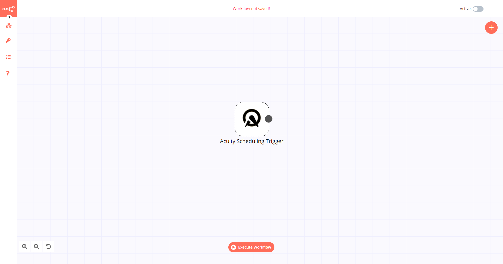

# Acuity Scheduling Trigger

[Acuity Scheduling](https://acuityscheduling.com/) is a cloud-based appointment scheduling software solution that enables business owners to manage their appointments online. It has the capability to automatically sync calendars according to users’ time zones and can send regular alerts and reminders to users regarding their appointment schedules.

::: tip 🔑 Credentials
You can find authentication information for this node [here](../../../credentials/AcuityScheduling/README.md).
:::

## Example Usage

This workflow allows you to receive updates when a new appointment is scheduled on Acuity Scheduling. You can also find the [workflow](https://n8n.io/workflows/533) on the website. This example usage workflow would use the following node.
- [Acuity Scheduling Trigger]()

The final workflow should look like the following image.

### 1. Acuity Scheduling Trigger node

1. First of all, you'll have to enter credentials for the Acuity Scheduling Trigger node. You can find out how to do that [here](../../../credentials/AcuityScheduling/README.md).
2. Select the `appointment.scheduled` option from the *Event* dropdown list.
3. Click on *Execute Node* to run the workflow.
