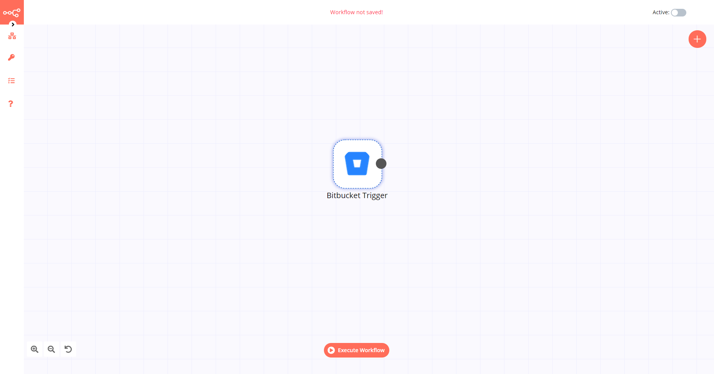

# Bitbucket Trigger

[Bitbucket](https://bitbucket.org/) is a web-based version control repository hosting service owned by Atlassian, for source code and development projects that use either Mercurial or Git revision control systems.

::: tip 🔑 Credentials
You can find authentication information for this node [here](../../../credentials/Bitbucket/README.md).
:::

## Example Usage

This workflow allows you to receive updates when events occur in a Bitbucket repository. You can also find the [workflow](https://n8n.io/workflows/529) on the website. This example usage workflow would use the following node.
- [Bitbucket Trigger]()

The final workflow should look like the following image.

### 1. Bitbucket Trigger node

1. First of all, you'll have to enter credentials for the Bitbucket Trigger node. You can find out how to do that [here](../../../credentials/Bitbucket/README.md).
2. Select 'Repository' from the *Resource* dropdown list.
3. Select the repository you want to receive updates for from the *Repository* dropdown list.
4. Select the events you want to receive updates for from the *Events* dropdown list.
5. Click on *Execute Node* to run the workflow.

::: tip 💡 Activate workflow for production
You'll need to save the workflow and then click on the Activate toggle on the top right of the screen to activate the workflow. Your workflow will then be triggered as specified by the settings in the Bitbucket Trigger node.
:::
