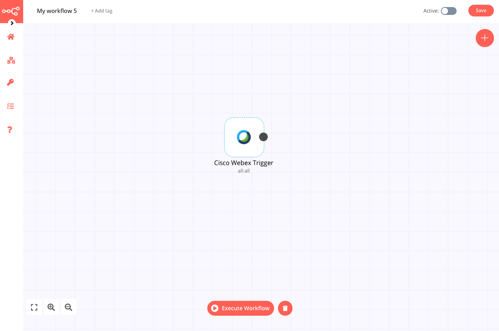

# Cisco Webex Trigger

[Cisco Webex](https://webex.com/) is a web conferencing and videoconferencing application.

::: tip 🔑 Credentials
You can find authentication information for this node [here](../../../credentials/ciscoWebex/README.md).
:::

## Example usage

This workflow allows you to receive updates when meeting events occur in your Webex account. This example usage workflow uses the following node:
- [Cisco Webex Trigger]()

The final workflow should look like the following image.

### 1. Cisco Webex Trigger node

1. First enter your credentials for node. You can find out how to do that [here](../../../credentials/ciscoWebex/README.md).
2. Select 'Meeting' from the *Resource* dropdown list.
3. Select the events you want to receive updates for from the *Events* dropdown list.
4. Click on *Execute Node* to run the workflow.

::: tip 💡 Activate workflow for production
You'll need to save the workflow and then click on the Activate toggle on the top right of the screen to activate the workflow. Your workflow will then be triggered as specified by the settings in the Cisco Webex Trigger node.
:::
