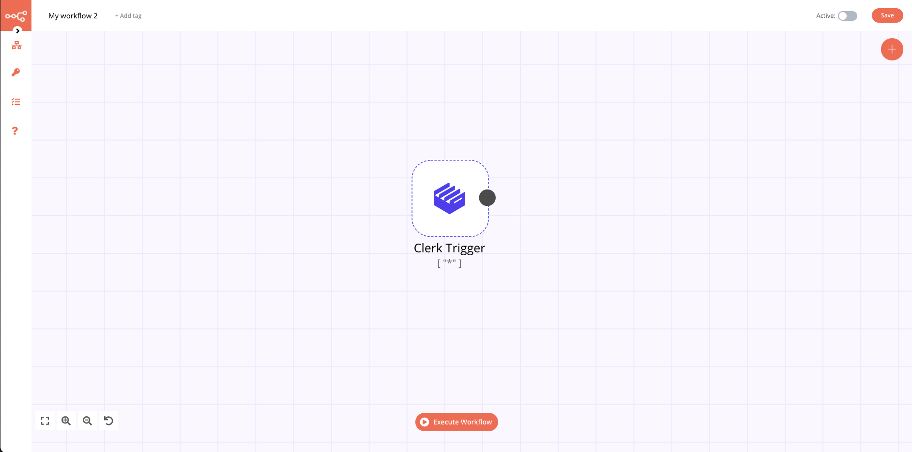

# Clerk Trigger

[Clerk](https://clerk.dev) is a modern authentication and complete user management solution. With Clerk you can add sign up, sign in, and profile management capabilities to your application in minutes. Clerk provides themable prebuilt frontends to match your branding, or the ability customize everything with easy to use APIs.

::: tip 🔑 Credentials
You can find authentication information for this node [here](../../../credentials/Clerk/README.md).
:::

## Example Usage

This workflow allows you to receive updates for events in Clerk.

- [Clerk Trigger]()

The workflow should look like the following image.

### 1. Clerk Trigger node

1. First of all, you'll have to enter credentials for the Clerk Trigger node. You can find out how to do that [here](../../../credentials/Clerk/README.md).
2. Select the `*` option in the _Events_ field to receive updates when any event is triggered or select the ones you want.
3. When you configure the node as you like, get the Production/Test URL for the created node and replace it with the placeholder you created during Step 1.
4. Click on _Execute Node_ to run the workflow.

::: tip 💡 Activate workflow for production
You'll need to save the workflow and then click on the Activate toggle on the top right of the screen to activate the workflow. Your workflow will then be triggered as specified by the settings in the Clerk Trigger node.
:::

## FAQs

### How do I add my webhook URL in Clerk?

1. Open your Clerk application dashboard.
2. Click on "Integrations".
3. Find Svix and click on "Manage webhooks".
4. Click the endpoint instance you have received the "Signing key" from. _Click [here](../../../credentials/Clerk/README.md) if you have not retrieved the signing key yet._
5. Click the _Edit_ button.
6. Enter the Clerk node webhook URL in the _Endpoint URL_ field.
7. Click on the _Save_ button.
