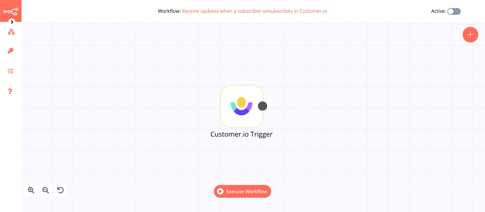

# Customer.io Trigger

[Customer.io](https://customer.io/) enables users to send newsletters to selected segments of customers using their website data. You can send targeted emails, push notifications, and SMS to lower churn, create stronger relationships, and drive subscriptions.

::: tip 🔑 Credentials
You can find authentication information for this node [here](../../../credentials/CustomerIo/README.md).
:::

## Example Usage

This workflow allows you to receive updates when a subscriber unsubscribes in Customer.io. You can also find the [workflow](https://n8n.io/workflows/645) on n8n.io. This example usage workflow would use the following node.
- [Customer.io Trigger]()

The final workflow should look like the following image.

### 1. Customer.io Trigger node

1. First of all, you'll have to enter credentials for the Customer.io Trigger node. You can find out how to do that [here](../../../credentials/CustomerIo/README.md).
2. Select 'Customer Unsubscribe' from the ***Event*** dropdown list.
3. Click on ***Execute Node*** to run the node.