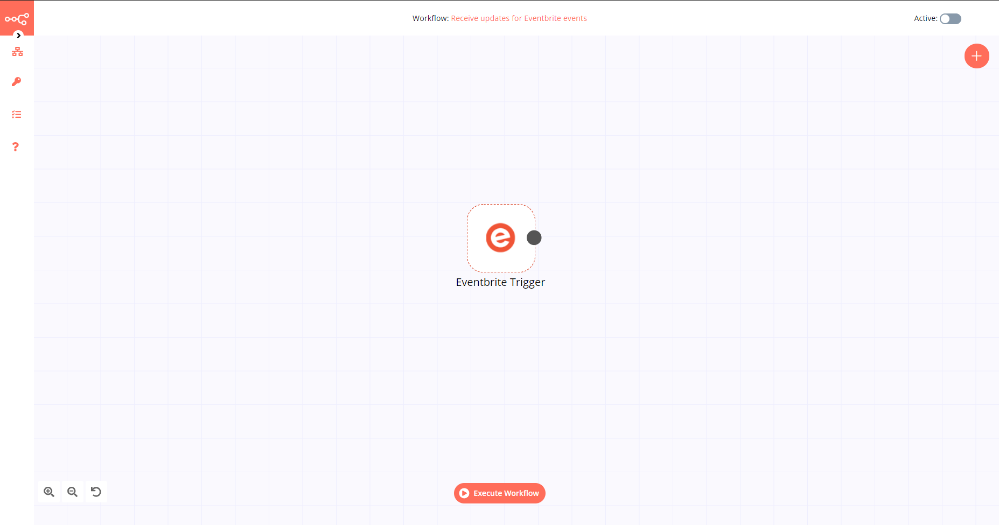

# Eventbrite Trigger

[Eventbrite](https://www.eventbrite.com/) is an event management and ticketing website. The service allows users to browse, create, and promote local events.

::: tip 🔑 Credentials
You can find authentication information for this node [here](../../../credentials/Eventbrite/README.md).
:::

## Example Usage

This workflow allows you to get updates for Eventbrite events. You can also find the [workflow](https://n8n.io/workflows/538) on the website. This example usage workflow would use the following node.
- [Eventbrite Trigger]()

The final workflow should look like the following image.

### 1. Eventbrite Trigger node

1. First of all, you'll have to enter credentials for the Eventbrite Trigger node. You can find out how to do that [here](../../../credentials/Eventbrite/README.md).
2. Select the profile that contains your event from the *Organization* dropdown list.
3. Select the event you want to receive updates for from the *Event* dropdown list.
4. Select the actions that you want to receive updates for from the *Actions* dropdown list.
5. Click on *Execute Node* to run the workflow.
