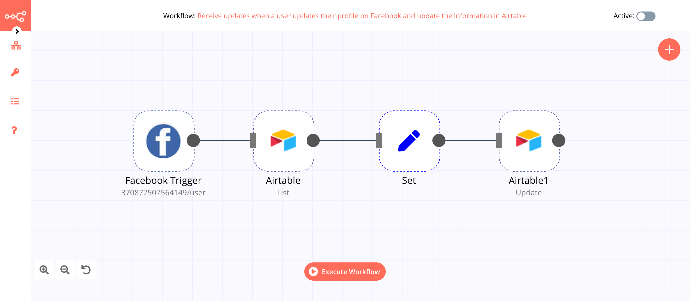
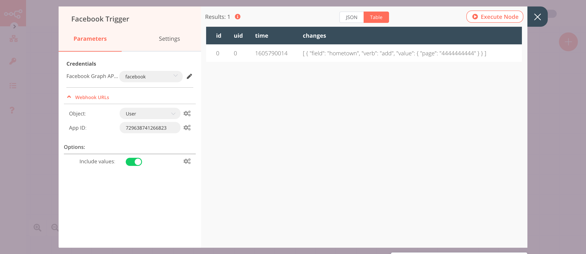

# Facebook Trigger

[Facebook](https://www.facebook.com/) is a social networking site that makes it easy to connect and share with family and friends online.

::: tip 🔑 Credentials
You can find authentication information for this node [here](../../../credentials/FacebookApp/README.md).
:::

## Object

- Get updates about an Ad Account
- Get updates about the app
- Get updates about Certificate Transparency
- Get updates about activity in groups and events in groups of Workplace
- Get updates about the comments on your media
- Get updates about the links for rich previews by an external provider
- Page updates
- Updates regarding granting or revoking permissions
- User profile updates
- Get updates about Whatsapp business account
- Get updates about Workplace security

## Example Usage

This workflow allows you to receive a Mattermost message when a user updates their profile on Facebook. You can also find the [workflow](https://n8n.io/workflows/785) on n8n.io. This example usage workflow would use the following nodes.
- [Facebook Trigger]()
- [Mattermost](../../nodes/Mattermost/README.md)

The final workflow should look like the following image.

### 1. Facebook Trigger node

The Facebook Trigger node will trigger the workflow when a user updates their profile on Facebook.

1. First of all, you'll have to enter credentials for the Facebook Trigger node. You can find out how to do that [here](../../../credentials/FacebookApp/README.md).
2. Select 'User' from the ***Object*** dropdown list.
3. Enter your app ID in the ***App ID*** field.
3. Click on ***Execute Node*** to run the node.

In the screenshot below, you will notice that the node returns the updated information of the user from Facebook. This output is passed on to the next node in the workflow.

### 2. Mattermost node (post: message)

This node will send a message of the updated information in the channel `Information Updated` in Mattermost. If you have a different channel, use that instead.

1. First of all, you'll have to enter credentials for the Mattermost node. You can find out how to do that [here](../../../credentials/Mattermost/README.md).
::: v-pre
2. Select a channel from the ***Channel ID*** dropdown list.
3. Click on the gears icon next to the ***Message*** field and click on ***Add Expression***.
4. Enter the following message in the ***Expression*** field: `The user with uid {{$node["Facebook Trigger"].json["uid"]}} changed their {{$node["Facebook Trigger"].json["changes"][0]["field"]}} to {{$node["Facebook Trigger"].json["changes"][0]["value"]["page"]}}.`.
5. Click on ***Execute Node*** to run the node.
:::
In the screenshot below, you will notice that the node sends a message about the updated information to the `Information Updated` channel in Mattermost.

