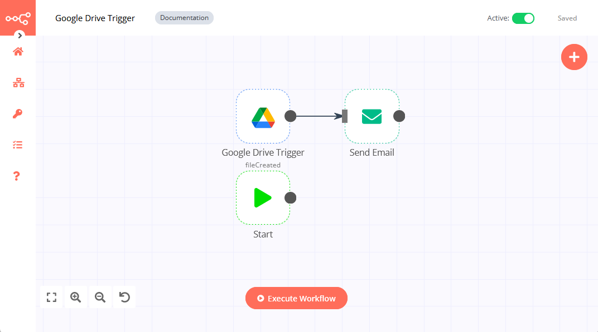

# Google Drive Trigger

[Google Drive](https://drive.google.com) is a file storage and synchronization service developed by Google. It allows users to store files on their servers, synchronize files across devices, and share files.

::: tip 🔑 Credentials
You can find authentication information for this node [here](../../../credentials/Google/README.md).
:::

::: tip 💡 Manual Executions vs. Activation
On manual executions this node will return the last event matching its search criteria. If no event matches the criteria (for example because you are watching for files to be created but no files have been created so far), an error is thrown. Once saved and activated, the node will regularly check for any matching events and will trigger your workflow for each event found.
:::

## Example Usage

This workflow sends out email notifications when a new file has been uploaded to Google Drive. It uses two nodes:
- [Google Drive Trigger]()
- [Send Email](../../core-nodes/SendEmail/README.md)

The final workflow should look like the image below.

### 1. Google Drive Trigger node

1. Enter valid credentials for the Google Drive Trigger node. You can find out how to do so [here](../../../credentials/Google/README.md).
2. Select the `Changes involving a Specific Folder` option in the ***Trigger On*** field.
3. Paste the URL of a Google Drive folder in the ***Folder URL or ID*** field.
4. Select `File Created` in the ***Watch For*** field.
5. Click on *Execute Node* to execute the node.

In the screenshot below you can see the file returned by the node.

### 2. Send Email node
::: v-pre
1. Enter valid credentials for the Send Email node. You can find out how to do so [here](../../../credentials/SendEmail/README.md).
2. Enter valid emails in the ***From Email*** and ***To Email*** fields.
3. Enter `File Created` in the ***Subject*** field.
4. Click on the gear icon next to the ***Text*** field and choose ***Add Expression***.
5. Enter `A file in your Google Drive file folder has been created: {{$json["name"]}}` and close the expression editor.
6. Click on ***Execute Node* to execute the node.
:::
