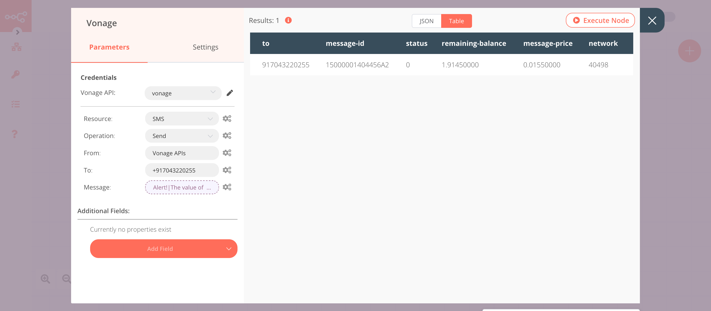

# Kafka Trigger

[Kafka](https://kafka.apache.org/) is an open-source distributed event streaming platform that one can use for high-performance data pipelines, streaming analytics, data integration, and mission-critical applications.

::: tip 🔑 Credentials
You can find authentication information for this node [here](../../../credentials/Kafka/README.md).
:::


## Example Usage

This workflow allows you to receive messages from a topic and send an SMS if the value of the temperature is greater than 50. You can also find the [workflow](https://n8n.io/workflows/814) on n8n.io. This example usage workflow would use the following nodes.
- [Kafka Trigger]()
- [IF](../../core-nodes/If/README.md)
- [Vonage](../../nodes/Vonage/README.md)
- [No Operation, do nothing](../../core-nodes/NoOperationDoNothing/README.md)

The final workflow should look like the following image.


### 1. Kafka Trigger node

This node will trigger the workflow when a new message is sent to the topic `test_topic`. If you're using a different topic, use that instead. We are sending the message `{ "id": 1, "temp": 100 }` to `test_topic`.

1. First of all, you'll have to enter credentials for the Kafka Trigger node. You can find out how to do that [here](../../../credentials/Kafka/README.md).
2. Enter the name of the topic in the ***Topic*** field.
3. Enter the group ID in the ***Group ID*** field.
4. Click on ***Add Option*** and select 'JSON Parse Message'.
5. Toggle ***JSON Parse Message*** to `true`.
6. Click on ***Execute Node*** to run the node.

In the screenshot below, you will notice that the node gets triggered when a new message is sent to the `topic_test` topic in Kafka.


### 2. IF node

This node will compare the value of `temp` that we received in the message from the previous node. If the value is greater than 50, it will return true otherwise false.
::: v-pre
1. Click on ***Add Condition*** and select 'Number' from the dropdown list.
2. Click on the gears icon next to the ***Value 1*** field and click on ***Add Expression***.
3. Select the following in the ***Variable Selector*** section: Nodes > Kafka Trigger > Output Data > JSON > message > temp. You can also add the following expression: `{{$node["Kafka Trigger"].json["message"]["temp"]}}`.
4. Select 'Larger' from the ***Operation*** dropdown list.
5. Set ***Value 2*** to 50.
6. Click on ***Execute Node*** to run the node.
:::

In the screenshot below, you will notice that the node returns output for **true** when the temperature is greater than 50.


### 3. Vonage node (send: sms)

This node sends an SMS to the specified phone number when the value of `temp` is greater than `50`.

1. Create a Vonage node connected to the 'true' output of the IF node.
2. You'll have to enter credentials for the Vonage node. You can find out how to do that [here](../../../credentials/Vonage/README.md).
3. Enter the name of the sender in the ***From*** field. If you're using a number, enter the number instead.
4. Enter the receiver's phone number in the ***To*** field.
5. Click on the gears icon next to the ***Message*** field and click on ***Add Expression***.
::: v-pre
6. Enter the following in the ***Expression*** field.
```
Alert!
The value of temp is {{$node["Kafka Trigger"].json["message"]["temp"]}}.
```
7. Click on ***Execute Node*** to run the node.
:::

In the screenshot below, you will notice that the node sends an SMS with the value of `temp` that we received from the Kafka Trigger node.



### 4. NoOp node
Adding this node here is optional, as the absence of this node won't make a difference to the functioning of the workflow.

1. Create a ***NoOp*** node connected to the 'false' output of the IF node.
2. Click on ***Execute Node*** to run the node.


::: tip 💡 Activate workflow for production
You'll need to save the workflow and then click on the Activate toggle on the top right of the screen to activate the workflow. Your workflow will then be triggered as specified by the settings in the Kafka Trigger node.
:::
