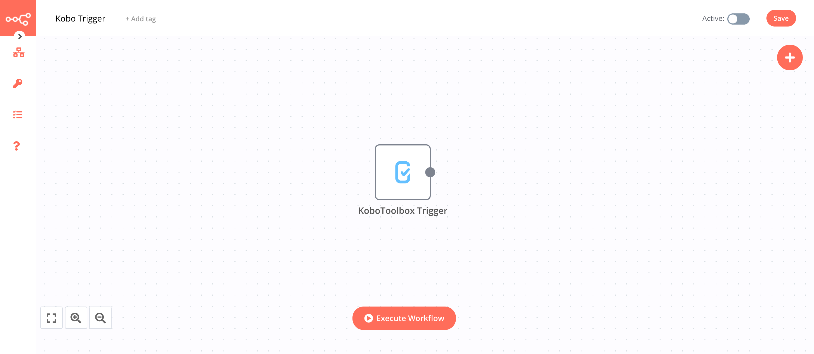

# KoBoToolbox

[KoBoToolbox](https://www.kobotoolbox.org/) is a field survey / data collection tool that makes it easy to design interactive forms to be filled offfline from mobile devices. It is available both as a free cloud solution or as a self-hosted version.

::: tip 🔑 Credentials
You can find authentication information for this node [here](../../../credentials/KoBoToolbox/README.md).
:::

This trigger node will trigger an event upon new submissions of a specific form. The trigger node will take care of the creation / deletion of the hook, so no setup is required on KoBoToolbox side to enable these notifications.

It works the same way as the Get Submission operation in the [KoBoToolbox](../../core-nodes/KoBoToolbox/README.md) node, and in particular supports the same reformatting options.

## Example Usage

This workflow will trigger an execution on every new submission of a form.

### 1. KoBoToolbox Trigger node

In the ***Parameters*** panel, specify the KoBoToolbox ***Form ID*** for which you want to listen to new submissions, or look it up from the dropdown menu. You can specify any formatting options as well if needed. For information on the formatting options, refer to the [KoBoToolbox](../../core-nodes/KoBoToolbox/README.md) node documentation.

Your workflow will now be triggered whenever a new submission is received by the KoBoToolbox server.

Keep in mind that since form submissions can be made offline by the data collectors, the actual reception of the submissions on n8n side may happen long after the real data collection on the device.
