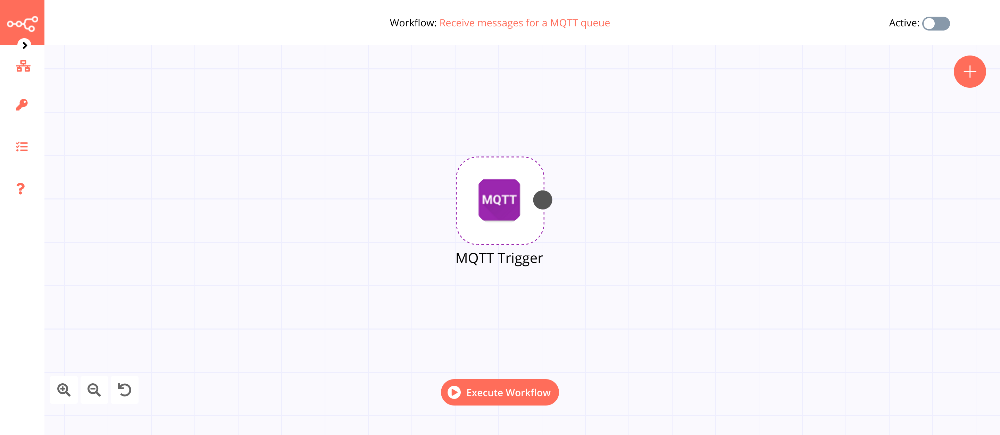

# MQTT Trigger

[MQTT](https://mqtt.org) is an open OASIS and ISO standard lightweight, publish-subscribe network protocol that transports messages between devices.

::: tip 🔑 Credentials
You can find authentication information for this node [here](../../../credentials/MQTTTrigger/README.md).
:::

## Example Usage

This workflow allows you to receive messages for a [MQTT] queue via MQTT Trigger. You can also find the [workflow](https://n8n.io/workflows/657) on the website. This example usage workflow would use the following node.
- [MQTT Trigger]()

The final workflow should look like the following image.

### 1. MQTT Trigger node

1. First of all, you'll have to enter credentials for the MQTT Trigger node. You can find out how to do that [here](../../../credentials/MQTTTrigger/README.md).
2. Enter the name of the topic in the ***Topics*** field.
3. Click on ***Execute Node*** to run the workflow.
