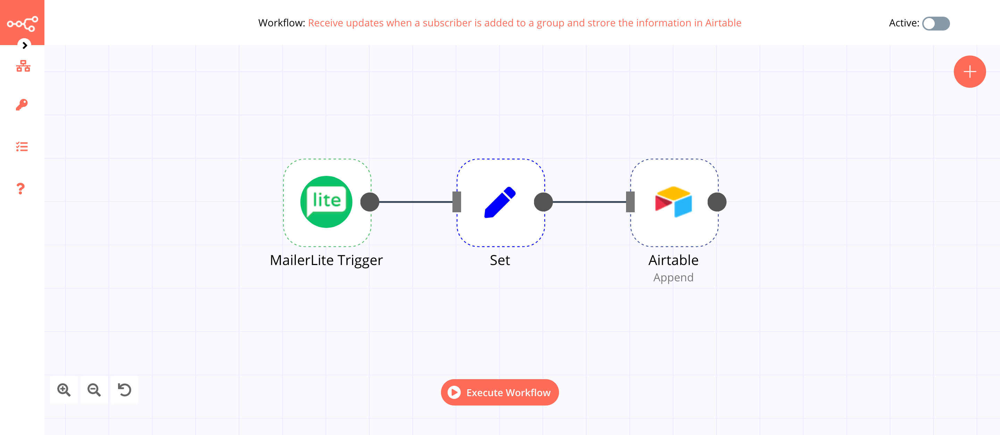

# MailerLite Trigger

[MailerLite](https://www.mailerlite.com/) is an email marketing solution that provides you with a user-friendly content editor, simplified subscriber management, and campaign reports with the most important statistics.

::: tip 🔑 Credentials
You can find authentication information for this node [here](../../../credentials/MailerLite/README.md).
:::

## Events

- Campaign Sent
- Subscriber Added to Group
- Subscriber Added through Webform
- Subscriber Autonomation Completed
- Subscriber Autonomation Triggered
- Subscriber Bounced
- Subscriber Created
- Subscriber Complained
- Subscriber Removed from Group
- Subscriber Unsubscribe
- Subscriber Updated

## Example Usage

This workflow allows you to receive updates when a subscriber is added to a group in MailerLite and add them to a base in Airtable. You can also find the [workflow](https://n8n.io/workflows/759) on n8n.io. This example usage workflow would use the following node.
- [MailerLite Trigger]()
- [Set](../../core-nodes/Set/README.md)
- [Airtable](../../nodes/Airtable/README.md)

The final workflow should look like the following image.

### 1. MailerLite Trigger

 The MailerLite Trigger node will trigger the workflow when a subscriber is added to a group in MailerLite.

1. First of all, you'll have to enter credentials for the MailerLite Trigger node. You can find out how to do that [here](../../../credentials/MailerLite/README.md).
2. Select 'Subscriber Added to Group' from the ***Events*** dropdown list.
3. Click on ***Execute Node*** to run the node.

In the screenshot below, you will notice that the node returns the information of the subscriber that was added to a group in MailerLite. This output is passed on to the next node in the workflow.

### 2. Set node

We will use the Set node to ensure that only the data that we set in this node gets passed on to the next nodes in the workflow.
::: v-pre
1. Click on ***Add Value*** and select 'String' from the dropdown list.
2. Enter `Name` in the ***Name*** field.
3. Click on the gears icon next to the ***Value*** field and click on ***Add Expression***.
4. Select the following in the ***Variable Selector*** section: Nodes > MailerLite Trigger > Output Data > JSON > data > subscriber > name. You can also add the following expression: `{{$node["MailerLite Trigger"].json["data"]["subscriber"]["name"]}}`.
5. Click on ***Add Value*** and select 'String' from the dropdown list.
6. Enter `Email` in the ***Name*** field.
7. Click on the gears icon next to the ***Value*** field and click on ***Add Expression***.
8. Select the following in the ***Variable Selector*** section: Nodes > MailerLite Trigger > Output Data > JSON > data > subscriber > email. You can also add the following expression: `{{$node["MailerLite Trigger"].json["data"]["subscriber"]["email"]}}`.
9. Toggle ***Keep Only Set*** to `true`. We set this option to true to ensure that only the data that we have set in this node get passed on to the next nodes in the workflow.
10. Click on ***Execute Node*** to run the node.
:::
In the screenshot below, you will notice that the node uses the data from the previous node and returns the data that we set for the workflow.

### 3. Airtable node

This node will store the data coming from the previous node in a table in Airtable.

1. First of all, you'll have to enter credentials for the Airtable node. You can find out how to do that [here](../../../credentials/Airtable/README.md).
2. Select 'Append' from the ***Operation*** dropdown list.
3. Enter the base ID in the ***Base ID*** field. For obtaining the Base ID, head over to their [API page](https://airtable.com/api) and select the correct base. You’ll find the Base ID under the Introduction section.
4. In n8n, paste the ID of the base in the ***Base ID*** field.
5. Enter the table name in the ***Table*** name field.
6. Click on ***Execute Node*** to run the node.

In the screenshot below, you will notice that the node adds the information of the subscriber from the previous node in a table in Airtable.

::: tip 💡 Activate workflow for production
You'll need to save the workflow and then click on the Activate toggle on the top right of the screen to activate the workflow. Your workflow will then be triggered as specified by the settings in the MailerLite Trigger node.
:::
