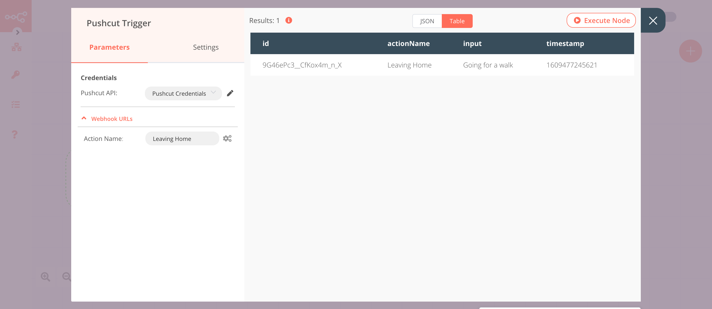
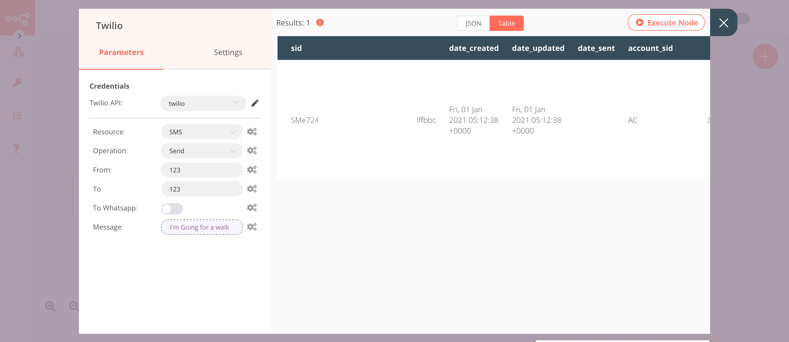

# Pushcut Trigger

[Pushcut](https://pushcut.io) is an app for iOS that lets you create smart notifications to kick off shortcuts, URLs, and online automation.

::: tip 🔑 Credentials
You can find authentication information for this node [here](../../../credentials/Pushcut/README.md).
:::

## Example Usage

This workflow allows you to send an SMS to a number whenever you go out. You can also find the [workflow](https://n8n.io/workflows/870) on n8n.io. This example usage workflow uses the following nodes.
- [Pushcut Trigger]()
- [Twilio](../../../nodes-library/nodes/Twilio/README.md)

The final workflow should look like the following image.

### 1. Pushcut Trigger node

Whenever you leave your house, Pushcut will send you a notification with an action `Leaving Home`. The Pushcut Trigger node will trigger the workflow when this action is selected.

To create an action in the Pushcut app, follow the instructions mentioned in [FAQs](#_1-how-to-configure-a-pushcut-action).

1. First of all, you'll have to enter credentials for the Pushcut Trigger node. You can find out how to do that [here](../../../credentials/Pushcut/README.md).
2. Enter an action name in the ***Action Name*** field.
3. Click on ***Execute Node*** to run the node.

In the screenshot below, you will notice that the node triggers the workflow whenever the `Leaving Home` action is selected.

### 2. Twilio node (send: sms)

This node will send an SMS to a specified phone number notifying the recipient that you are going out.

1. First of all, you'll have to enter credentials for the Twilio node. You can find out how to do that [here](../../../credentials/Twilio/README.md).
2. Enter the Twilio phone number in the ***From*** field.
4. Enter the receiver's phone number in the ***To*** field.
5. Click on the gears icon next to the ***Message*** field and click on ***Add Expression***.
::: v-pre
6. Enter `I'm {{$node["Pushcut Trigger"].json["input"]}}` in the ***Expression*** field.
7. Click on ***Execute Node*** to run the node.
:::

In the screenshot below, you will notice that the node sends an SMS with the input that we received from the Pushcut Trigger node.

## FAQs

### 1. How to configure a Pushcut action?

Follow the steps mentioned below to configure your Pushcut Trigger node with your Pushcut app.

1. In your Puschcut app, select a notification from the ***Notifications*** screen.
2. Click on the ***Add Action*** button.
3. Enter an action name in the ***Label*** field.
4. Select the ***Server*** tab.
5. Select the ***Integration*** tab.
6. Click on ***Integration Trigger***.
7. In n8n, enter a name for the action and click on ***Execute Node***.
8. Select this action under the ***Select Integration Trigger*** screen in your Pushcut app.
9. Click on ***Done*** on the top right to save the action.
