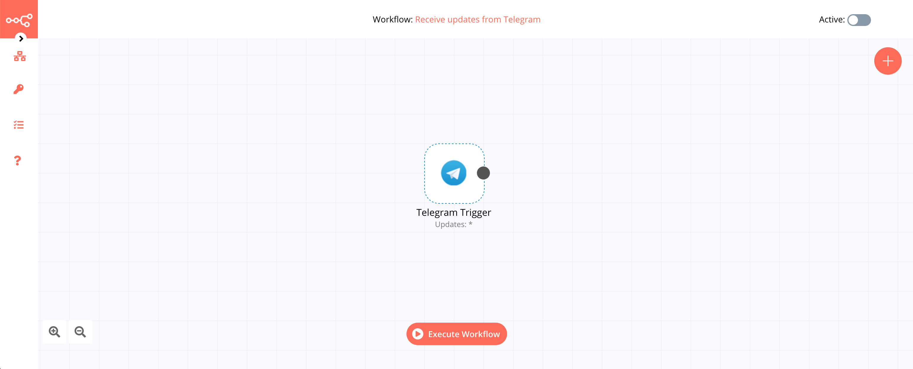

# Telegram Trigger

[Telegram](https://telegram.org/) is a cloud-based instant messaging and voice over IP service. Users can send messages and exchange photos, videos, stickers, audio, and files of any type.

::: tip 🔑 Credentials
You can find authentication information for this node [here](../../../credentials/Telegram/README.md).
:::

## Example Usage

This workflow allows you to receive updates from Telegram. You can also find the [workflow](https://n8n.io/workflows/456) on the website. This example usage workflow would use the following node.
- [Telegram Trigger]()

The final workflow should look like the following image.

### 1. Telegram Trigger node

1. First of all, you'll have to enter credentials for the Telegram Trigger node. You can find out how to do that [here](../../../credentials/Telegram/README.md).
2. Select the `*` option in the *Updates* field to receive all updates.
3. Click on *Execute Node* to run the workflow.

## Further Reading

- [Creating Telegram Bots with n8n, a No-Code Platform](https://medium.com/n8n-io/creating-telegram-bots-with-n8n-a-no-code-platform-fdf1f0928da7)
