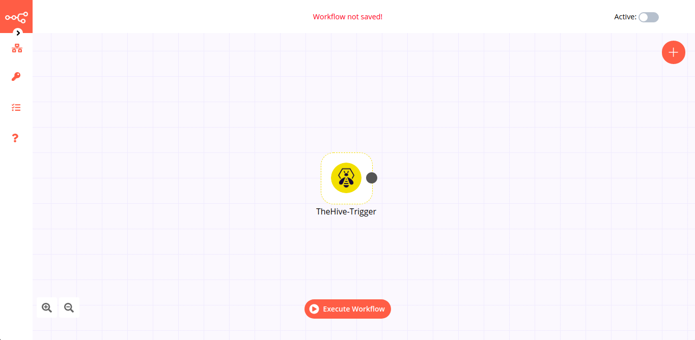

# TheHive Trigger

[TheHive](https://thehive-project.org/) is a scalable open-source and free security incident response platform.

## Example Usage

This workflow allows you to receive updates when an event occurs in TheHive. You can also find the [workflow](https://n8n.io/workflows/810) on the website. This example usage workflow would use the following node.
- [TheHive Trigger](https://n8n.io/workflows/810)

The final workflow should look like the following image.



### 1. TheHive Trigger node

This node will trigger the workflow whenever a new event occurs in TheHive. To trigger the workflow for a specific event, select that event instead.

1. First of all, you'll have to add the webhook URL in TheHive instance configuration. Refer to the [FAQs](#_1-how-to-configure-a-webhook-in-thehive) to learn how to configure a webhook.
2. Select the `*` from the ***Events*** dropdown list. This will trigger the workflow for all the events.
3. Click on ***Execute Node*** to run the node.

## FAQs

### 1. How to configure a Webhook in TheHive?

To configure the webhook for your TheHive instance follow the steps mentioned below.
1. Copy the webhook URL from TheHive Trigger node
2. Add the following lines to the application.conf file. This is TheHive configuration file.
```
notification.webhook.endpoints = [
    {
        name: WEBHOOK_NAME
        url: WEBHOOK_URL
        version: 0
        wsConfig: {}
        includedTheHiveOrganisations: ["ORGANIZATION_NAME"]
        excludedTheHiveOrganisations: []
    }
]
```
3. Replace `WEBHOOK_URL` with the URL you copied in the previous step.
4. Replace `ORGANIZATION_NAME` with your organization name.
5. Execute the following cURL command to enable notifications.
```sh
curl -XPUT -uTHEHIVE_USERNAME:THEHIVE_PASSWORD -H 'Content-type: application/json' THEHIVE_URL/api/config/organisation/notification -d '
{
    "value": [
        {
        "delegate": false,
        "trigger": { "name": "AnyEvent"},
        "notifier": { "name": "webhook", "endpoint": "WEBHOOK_NAME" }
        }
    ]
}'
```
