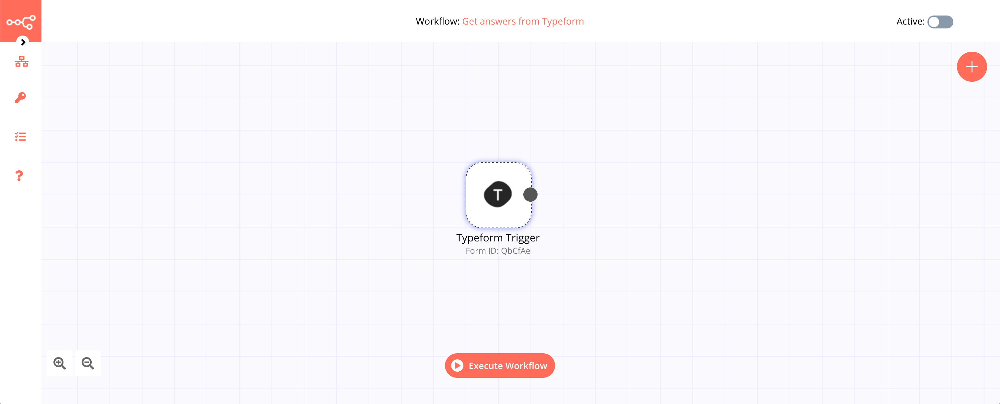

# Typeform Trigger

[Typeform](https://www.typeform.com/) is an online software as a service company that specializes in online form building and online surveys. Its main software creates dynamic forms based on user needs.

::: tip 🔑 Credentials
You can find authentication information for this node [here](../../../credentials/Typeform/README.md).
:::

## Example Usage

This workflow allows you to get the answers from a form submission in Typeform. You can also find the [workflow](https://n8n.io/workflows/457) on the website. This example usage workflow would use the following node.
- [Typeform Trigger]()

The final workflow should look like the following image.

### 1. Typeform Trigger node

1. First of all, you'll have to enter credentials for the Typeform Trigger node. You can find out how to do that [here](../../../credentials/Typeform/README.md).
2. Select the form you want to receive the answers from in the *Form* field.
3. Click on *Execute Node* to run the workflow.

::: tip 💡 Activate workflow for production
You'll need to save the workflow and then click on the Activate toggle on the top right of the screen to activate the workflow. Your workflow will then be triggered as specified by the settings in the Typeform Trigger node.
:::

## Further Reading

- [Automating Conference Organization Processes with n8n](https://medium.com/n8n-io/automating-conference-organization-processes-with-n8n-ab8f64a7a520)
- [Building an expense tracking app in 10 minutes 📱](https://medium.com/n8n-io/building-an-expense-tracking-app-in-10-minutes-74b0cececc90)
- [Supercharging your conference registration process with n8n 🎫](https://medium.com/n8n-io/supercharging-your-conference-registration-process-with-n8n-2831cdff37f9)
