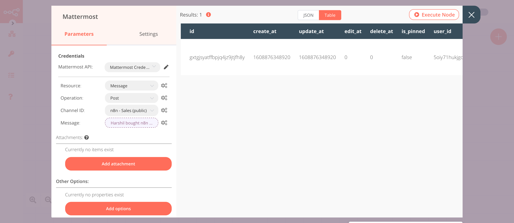

# WooCommerce Trigger

[WooCommerce](https://woocommerce.com/) is a customizable, open-source e-commerce plugin for WordPress.

::: tip 🔑 Credentials
You can find authentication information for this node [here](../../../credentials/WooCommerce/README.md).
:::

## Events

- coupon.created
- coupon.updated
- coupon.deleted
- customer.created
- customer.updated
- customer.deleted
- order.created
- order.updated
- order.deleted
- product.created
- product.updated
- product.deleted

## Example Usage

This workflow allows you to send a message on Mattermost when an order is created in WooCommerce. You can also find the [workflow](https://n8n.io/workflows/848) on n8n.io. This example usage workflow would use the following nodes.
- [WooCommerce Trigger]()
- [Mattermost](../../nodes/Mattermost/README.md)

The final workflow should look like the following image.


### 1. WooCommerce Trigger node

This node will trigger the workflow when an order is created in your WooCommerce store.

1. First of all, you'll have to enter credentials for the WooCommerce Trigger node. You can find out how to do that [here](../../../credentials/WooCommerce/README.md).
2. Select 'order.created' from the ***Event*** dropdown list. This will trigger the workflow when a user sends a message.
3. Click on ***Execute Node*** to run the node.

In the screenshot below, you will notice that the node triggers the workflow when a new order gets created.


### 2. Mattermost (post: message)

This node will send a message to a Mattermost channel sharing the details of the order that was created in WooCommerce.

1. First of all, you'll have to enter credentials for the Mattermost node. You can find out how to do that [here](../../../credentials/Mattermost/README.md).
2. Select the channel from the ***Channel ID*** dropdown list.
3. Click on the gears icon next to ***Message*** field.
4. Enter the following message in the ***Expression*** editor
```
{{$node["WooCommerce Trigger"].json["billing"]["first_name"]}} bought {{$node["WooCommerce Trigger"].json["line_items"][0]["name"]}}!
```
5. Click on ***Execute Node*** to run the node.

In the screenshot below, you will notice that the node sends a message to the `Sales` channel on Mattermost about the order that was created in WooCommerce.



::: tip 💡 Activate workflow for production
You'll need to save the workflow and then click on the Activate toggle on the top right of the screen to activate the workflow. Your workflow will then be triggered as specified by the settings in the WooCommerce Trigger node.
:::
