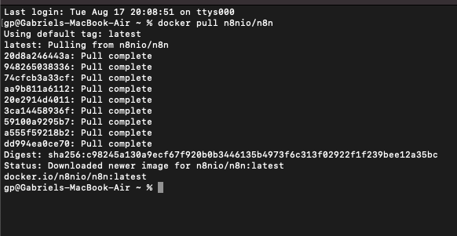
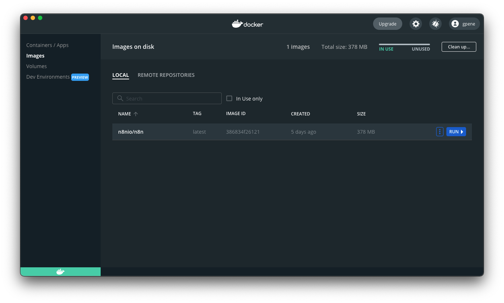
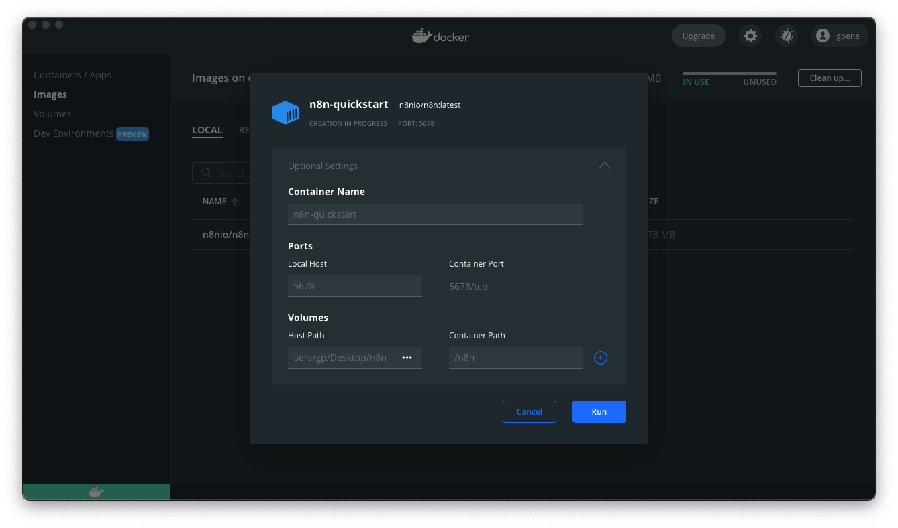

# Quickstart

This page will help you get up and running with n8n, taking you from installation to building and executing your first workflow: introducing yourself on the n8n [Discord](https://discord.com/) server and checking out the recent topics on our [community forum](https://community.n8n.io/).

To ensure you can follow along with the steps below, be sure to first:

* Download and install [Docker Desktop](https://docs.docker.com/get-docker/)
    * Linux users, you'll have to install [Docker Engine](https://docs.docker.com/engine/install/) and [Docker Compose](https://docs.docker.com/compose/install/) individually
* [Register](https://discord.com/register) for a Discord account

## Install n8n

1. Now that your have Docker installed, let's start by pulling the latest n8n image. Open your Terminal window and run:
    ```sh
    docker pull n8nio/n8n
    ```

    

2. Open the Docker Desktop application and select **Images** from the left-hand pane. The n8n image downloaded above should be visible here:



3. Click **Run** and a modal window appears with some **Optional Settings**:
    * **Container Name**: Enter a name for your n8n container. If left blank Docker will generate a random name for you.
    * **Ports**
        * **Local Host**: Enter `5678`. This is the port on your local machine where n8n will be available once running.
        * **Container Port**: The default container port for n8n. Cannot be edited.
    * **Volumes**:
        * **Host Path**: Select a local directory that will be available to your n8n Docker application. Here we use a folder `n8n` located on the `/Desktop`.
        * **Container Path**: Provide the path of that directory where it will be accessible from inside the Docker container. Here we use `/n8n`.




4. Click **Run** to start your n8n container. 

You can now access n8n by navigating your browser to `localhost:5678`.
