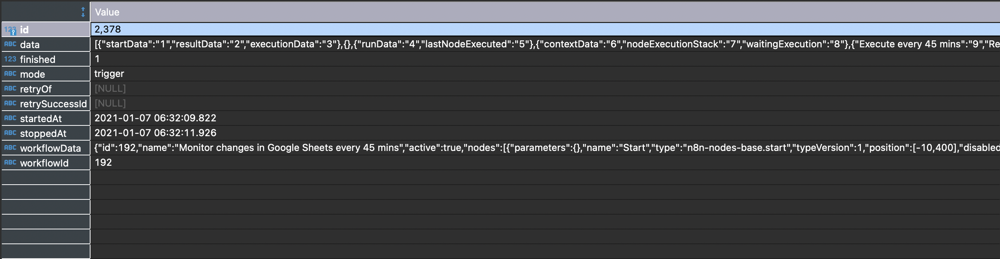
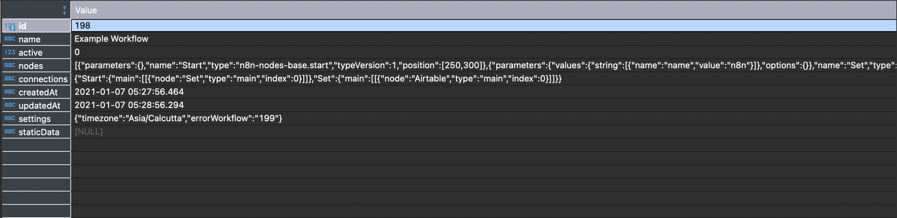

# Understanding n8n Database

By default, n8n uses SQLite as the database. If you are using another database it will be similar, but the data-types will be different depending on the database.

The [credentials](../glossary.md#credentials), [workflows](../glossary.md#workflow), [executions](../glossary.md#execution), and [webhook](../glossary.md#webhook) are decoupled and stored in different tables.

To inspect the n8n database, you can use [DBeaver](https://dbeaver.io), which is an open-source universal database tool.

## Credentials entity

Based on the node you use in a workflow, you may have to use credentials to connect the node with the respective service. These credentials get stored in the `credentials_entity` table with the following fields.

| Column Name | Data Type | Description |
|-------------|-----------|-------|
| id | INTEGER | Auto-incremented and unique for each row |
| name | VARCHAR | Stores the name of the credentials given by the user |
| data | Text | Stores the encrypted data |
| type | VARCHAR | Refers to the credential type used by the node |
| nodeAccess | TEXT | Stores the information of the nodes that have access to these credentials |
| createdAt | DATETIME | Stores the date and time when a credential gets created |
| updatedAt | DATETIME | Stores the date and time when a credential gets updated |

Below is an example of how n8n stores the credentials in the credentials_entity table in the SQLite database. The example below shows the data stored in the table for the *Pipedrive Trial* credentials.

The ***name*** field contains the credentials name, and the ***data*** field stores the credentials by encrypting them.
The [Pipedrive](../../nodes/credentials/Pipedrive/README.md) node has two authentication methods - OAuth and Access Token. The ***type*** field indicates the method the credentials belong to. The ***nodeAccess*** field stores information about the nodes that have access to these credentials. In the example below, both the Pipedrive node and the Pipedrive Trigger node have access to the Pipedrive Trial credentials.

## Execution entity

Depending on the settings, the executions are stored in the `execution_entity` table with the following fields.

| Column Name | Data Type | Description |
|-------------|-----------|-------|
| id | INTEGER | Auto-incremented and unique for each row |
| data | Text | Stores the execution data |
| finished | BOOLEAN | Indicates if the execution was finished successfully or not ( 1 = finished successfully) |
| mode | VARCHAR | Refers to the type of node that [triggered](../glossary.md#Trigger)  the workflow (for example, webhook, trigger, error) |
| retryOf | VARCHAR | Indicates if the execution was a retry of a previous execution |
| retrySuccessId | VARCHAR | Stores the ID of a retry execution if it was a success |
| startedAt | DATETIME | Stores the date and time when execution gets started |
| stoppedAt | DATETIME | Stores the date and time when execution gets stopped |
| workflowData | TEXT | Stores the workflow data with the [static data](../../nodes/nodes-library/core-nodes/Function/README.md#method-getworkflowstaticdata-type) (if any) |
| workflowId | VARCHAR | Stores the ID of the workflow that got executed |

Below is an example of how n8n stores the execution information in the `execution_entity` table in the SQLite database. The example below shows the execution data stored in the table for the [Receive updates of the position of the ISS every minute](https://n8n.io/workflows/880) workflow.

The ***data*** field contains the data returned by the nodes after the execution of the workflow. The ***finished*** field contains the value `1`, indicating that the execution got completed successfully. The example workflow uses a Trigger node to start the workflow. This information gets stored in the ***mode*** field. The ***workflowData*** field stores information about the workflow and static data. The ***workflowId*** field refers to the workflow that got executed.

## Migrations

[Migration](https://github.com/typeorm/typeorm/blob/master/docs/migrations.md) is a file with SQL queries to update a database schema. For example, if a new column gets added to a database, n8n creates a migration. On startup, n8n checks for new migrations. The logs of the migrations that ran get stored in the `migrations` table. n8n uses this table to check for the migrations that got executed earlier. The `migrations` table has the following fields.

| Column Name | Data Type | Description |
|-------------|-----------|-------|
| id | INTEGER | Auto-incremented and unique for each row |
| timestamp | BIGINT | Stores the timestamp when the migration ran |
| name | VARCHAR | Stores the name of the migration that ran |

Below is an example of how n8n logs the migrations that ran in the `migrations` table.

The timestamp when the migration got executed is stored in the ***timestamp*** field. The ***name*** field stores the name of the migration that got executed.

## Webhook entity

You may have to use a Trigger node (for example, Webhook node, Pipedrive Trigger node, ClickUp Trigger node, etc.) to trigger your workflow. The information of active webhooks used by these trigger nodes gets stored in the `webhook_entity` table with the following fields.

| Column Name | Data Type | Description |
|-------------|-----------|-------|
| workflowId | INTEGER | Stores the ID of the workflow |
| webhookPath | VARCHAR | Stores the webhook path |
| method | VARCHAR | Stores the information about the HTTP Method |
| node | VARCHAR | Stores the name of the trigger node |

Below is an example of how n8n stores information about webhook in the `webhook_entity` table in the SQLite database. The example below shows the data stored in the table for an example workflow that uses the Webhook node.

The ***workflowId*** field contains the id of the workflow that contains the Webhook node. The ***webhookPath*** field stores the path used by the Webhook node. Generally, the webhook path gets generated by n8n. If you enter a custom path, the ***webhookPath*** field will store that instead.

Based on your use-case, you can configure the HTTP request method in the Webhook node. The information about the HTTP request method you use with the Webhook node gets stored in the ***method*** field. The ***node*** field stores the name of the node.

## Workflow entity

The saved workflows get stored in the `workflow_entity` table with the following fields.

| Column Name | Data Type | Description |
|-------------|-----------|-------|
| id | INTEGER | Auto-incremented and unique for each row |
| name | VARCHAR | Stores the name of the workflow given by the user |
| active | BOOLEAN | Stores the information about the active state of the workflow (1 = active) |
| nodes | TEXT | Stores the information about nodes and their configurations in a workflow |
| connections | TEXT | Stores the [connection](./glossary.md#connection) information between nodes in a workflow |
| createdAt | DATETIME | Stores the date and time when a workflow gets created |
| updatedAt | DATETIME | Stores the date and time when a workflow gets updated |
| settings | TEXT | Stores the information about additional settings of a workflow. For example, timezone, error workflow etc. |
| staticData | TEXT | Stores the static data of the workflow |

Below is an example of how n8n stores the workflow data in the workflow_entity table in the SQLite database. The example below shows the data stored in the table for the workflow *Example Workflow*.

The ***name*** field contains the workflow name. The ***active*** field has the value `0`, indicating that the workflow is not active. If the workflow was set to active, the ***active*** field would contain the value `1`. The information about the nodes used in the workflow with their configurations gets stored in the ***nodes*** field.

The ***connections*** field stores information about the connection between the nodes. We can notice that the Start node is connected to the Set node. The ***settings*** field stores information about the additional setting of the workflow. In the example, we can notice that the timezone was changed and set to Asia/Calcutta, and an error workflow was also configured for this workflow. This example workflow doesn't store static data. If a workflow stores data, the ***staticData*** field would contain that information.

