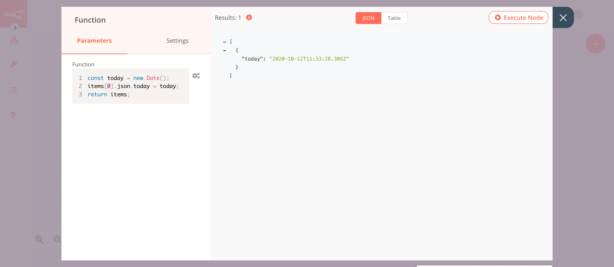
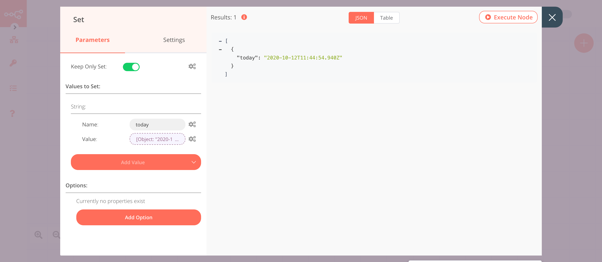
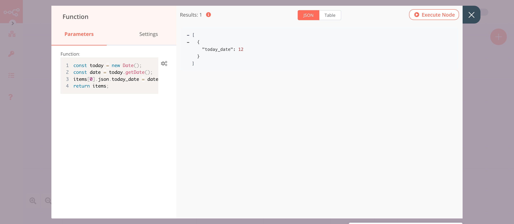
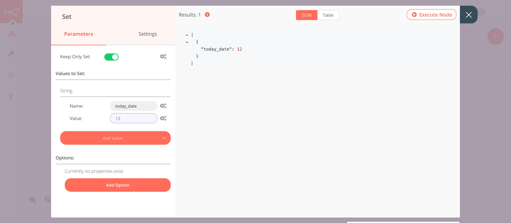
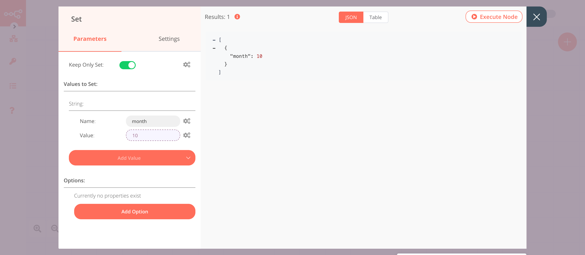
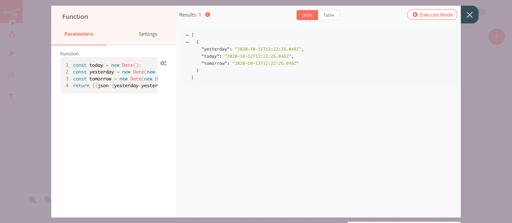
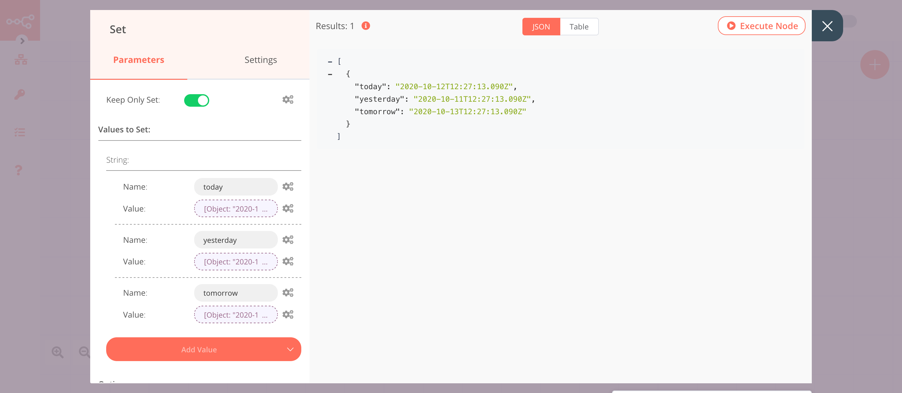

# JavaScript Cheatsheet

In n8n, you can write custom JavaScript code snippets to add, remove, and update the data you receive from a node. You can also use code snippets to modify the data structure of the data returned by a node.

**Note:** If you're using a code snippet in an expression in a node, use curly brackets. For example, to set the current timestamp in the Set node, use the following code snippet in the expression editor.

```js
{{Date.now();}}
```

## Date and Time

The JavaScript [Date](https://developer.mozilla.org/en-US/docs/Web/JavaScript/Reference/Global_Objects/Date) object is a built-in object that stores the date and time. It provides several methods for managing and formatting the date. By default, the date and time are returned in the local (i.e. host system) time zone. If your system and your n8n instance have a different time zone, the time zone specified for your n8n instance will be used by the Date object.

**Note:** The outputs below show the date and time when this documentation was created. The date and time will be different for you.

**Note:** We are using Set node for illustration here. You can use the code snippets as an expression in any node.

### 1. Get current time

To use the built-in methods for managing and formatting date in JavaScript, you have to create a date object.

The `Date()` constructor returns the date and time in the [ISO](https://en.wikipedia.org/wiki/ISO_8601) format. To get today's date use the following snippet

#### Function node

```js
const today = new Date();
items[0].json.today = today;
return items;
```

The output will be similar to the following image.


#### Set node


```js
{{new Date()}}
```

The output will be similar to the following image.


### 2. Get Date

Use the `getDate()` method to get the date.

#### Function node
```js
const today = new Date();
const date = today.getDate();
items[0].json.today_date = date;
return items;
```
The output will be similar to the following image.


#### Set node
```js
{{new Date().getDate()}}
```
The output will be similar to the following image.


### 3. Get Month

In JavaScript, the month is 0-indexed. For example, January has index 0, February has index 1, and so on. Use the `getMonth()` method to get the month.

#### Function node
```js
const today = new Date();
const month = today.getMonth()+1;
items[0].json.month = month;
return items;
```
The output will be similar to the following image.


Use the following code snippet to get the month from the month's array.
```js
const today = new Date();
const month = today.getMonth();
const months = ['Jan', 'Feb', 'March', 'April', 'May', 'June', 'July', 'Aug', 'Sep', 'Oct', 'Nov', 'Dec'];
const current_month = months[month];
items[0].json.current_month = current_month;
return items;
```
The output will be similar to the following image.


#### Set node
```js
{{new Date().getMonth()+1}}
```
The output will be similar to the following image.



### 4. Perform calculations

You can perform calculations on the data object to get the required date or time. JavaScript returns the time in milliseconds. To perform calculations on date and time, we convert the milliseconds to the appropriate unit. For example, in the code snippets below we are converting the unit of time from milliseconds into days.

#### Function node
```js
const today = new Date();
const yesterday = new Date(new Date(today).getTime()-(1*24*60*60*1000));
const tomorrow = new Date(new Date(today).getTime()+(1*24*60*60*1000));
return [{json:{yesterday:yesterday, today:today, tomorrow:tomorrow}}];
```
The output will be similar to the following image.


#### Set node

Today
```js
{{new Date()}}
```

Yesterday
```js
{{new Date(new Date().getTime()-(1*24*60*60*1000));}}
```

Tomorrow
```js
{{new Date(new Date().getTime()+(1*24*60*60*1000));}}
```
The output will be similar to the following image.
