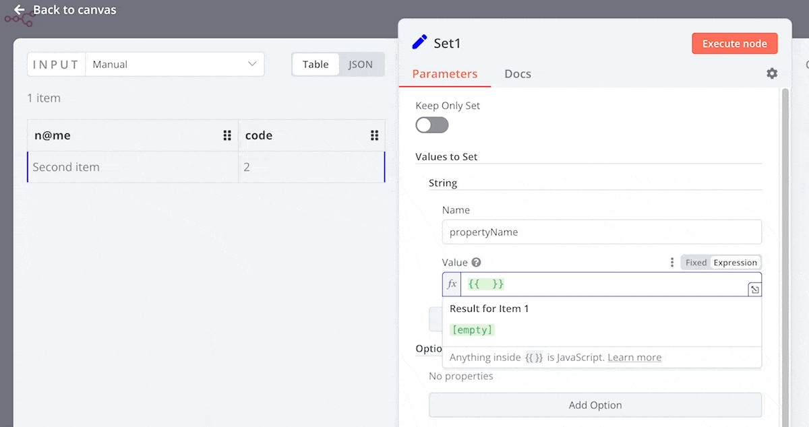
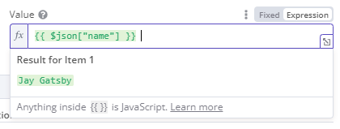

# Release notes pre 1.0 <a href="#release-notes-pre-10" id="release-notes-pre-10"></a>

Features and bug fixes for n8n before the release of 1.0.0.

You can also view the [Releases](https://github.com/n8n-io/n8n/releases) in the GitHub repository.



## How to update n8n



## Semantic versioning in n8n <a href="#semantic-versioning-in-n8n" id="semantic-versioning-in-n8n"></a>

n8n uses [semantic versioning](https://semver.org/). All version numbers are in the format `MAJOR.MINOR.PATCH`. Version numbers increment as follows:

* MAJOR version when making incompatible changes which can require user action.
* MINOR version when adding functionality in a backward-compatible manner.
* PATCH version when making backward-compatible bug fixes.

## n8n@0.237.0 <a href="#n8n02370" id="n8n02370"></a>

View the [commits](https://github.com/n8n-io/n8n/compare/n8n@0.236.3...n8n@0.237.0) for this version.<br />
**Release date:** 2023-08-17

This is a bug fix release.

For full release details, refer to [Releases](https://github.com/n8n-io/n8n/releases) on GitHub.

### Contributors <a href="#contributors" id="contributors"></a>

[Jordan Hall](https://github.com/Jordan-Hall)  
[Xavier Calland](https://github.com/xavier-calland)

## n8n@0.236.3 <a href="#n8n02363" id="n8n02363"></a>

View the [commits](https://github.com/n8n-io/n8n/compare/n8n@0.236.2...n8n@0.236.3) for this version.<br />
**Release date:** 2023-07-18

This is a bug fix release.

For full release details, refer to [Releases](https://github.com/n8n-io/n8n/releases) on GitHub.

### Contributors <a href="#contributors" id="contributors"></a>

[Romain Dunand](https://github.com/airmoi)  
[noctarius aka Christoph Engelbert](https://github.com/noctarius)


## n8n@0.236.2 <a href="#n8n02362" id="n8n02362"></a>

View the [commits](https://github.com/n8n-io/n8n/compare/n8n@0.236.1...n8n@0.236.2) for this version.<br />
**Release date:** 2023-07-14

This is a bug fix release.

For full release details, refer to [Releases](https://github.com/n8n-io/n8n/releases) on GitHub.


## n8n@0.236.1 <a href="#n8n02361" id="n8n02361"></a>

View the [commits](https://github.com/n8n-io/n8n/compare/n8n@0.236.0...n8n@0.236.1) for this version.<br />
**Release date:** 2023-07-12

This is a bug fix release.

For full release details, refer to [Releases](https://github.com/n8n-io/n8n/releases) on GitHub.

## n8n@0.236.0 <a href="#n8n02360" id="n8n02360"></a>

View the [commits](https://github.com/n8n-io/n8n/compare/n8n@0.235.0...n8n@0.236.0) for this version.<br />
**Release date:** 2023-07-05


This release contains new nodes, node enhancements, and bug fixes.

For full release details, refer to [Releases](https://github.com/n8n-io/n8n/releases) on GitHub.

### New nodes <a href="#new-nodes" id="new-nodes"></a>


#### crowd.dev <a href="#crowddev" id="crowddev"></a>

This release includes a [crowd.dev](https://www.crowd.dev/) node and crowd.dev Trigger node. crowd.dev is a tool to help you understand who is engaging with your open source project.

[crowd.dev node documentation](https://app.gitbook.com/s/BKcbOzIWja8NfqKDcqHc/builtin/app-nodes/n8n-nodes-base.crowddev).



### Contributors <a href="#contributors" id="contributors"></a>

[Alberto Pasqualetto](https://github.com/albertopasqualetto)  
[perseus-algol](https://github.com/perseus-algol)  
[Romeo Balta](https://github.com/romeobalta)  
[ZergRael](https://github.com/ZergRael)  

## n8n@0.234.1 <a href="#n8n02341" id="n8n02341"></a>

View the [commits](https://github.com/n8n-io/n8n/compare/n8n@0.234.0...n8n@0.234.1) for this version.<br />
**Release date:** 2023-07-05

This is a bug fix release.

For full release details, refer to [Releases](https://github.com/n8n-io/n8n/releases) on GitHub.

## n8n@0.235.0 <a href="#n8n02350" id="n8n02350"></a>

View the [commits](https://github.com/n8n-io/n8n/compare/n8n@0.234.0...n8n@0.235.0) for this version.<br />
**Release date:** 2023-06-28

This release contains new features, new nodes, node enhancements, and bug fixes.


**Unstable version**

This version is (as of 4th July 2023) considered unstable. n8n recommends against upgrading.

For full release details, refer to [Releases](https://github.com/n8n-io/n8n/releases) on GitHub.

### Contributors <a href="#contributors" id="contributors"></a>

[Marten Steketee](https://github.com/Marten-S)  
[Sandra Ashipala](https://github.com/sandramsc)

## n8n@0.234.0 <a href="#n8n02340" id="n8n02340"></a>

View the [commits](https://github.com/n8n-io/n8n/compare/n8n@0.233.1...n8n@0.234.0) for this version.<br />
**Release date:** 2023-06-22

This release contains new features, new nodes, node enhancements, and bug fixes.	


**Unstable version**

This version is (as of 4th July 2023) considered unstable. n8n recommends upgrading directly to 0.234.1.


**Irreversible database migration**

This version contains a database migration that changes credential and workflow IDs to use nanoId strings, This migration may take a while to complete in some environments. This change doesn't break anything using the older numeric IDs.

If you upgrade to 0.234.0, you can't roll back to an earlier version.



For full release details, refer to [Releases](https://github.com/n8n-io/n8n/releases) on GitHub.

### New nodes <a href="#new-nodes" id="new-nodes"></a>


#### Debug Helper <a href="#debug-helper" id="debug-helper"></a>

The Debug Helper node can be used to trigger different error types or generate random datasets to help test n8n workflows.

[Debug Helper node documentation](https://app.gitbook.com/s/BKcbOzIWja8NfqKDcqHc/builtin/core-nodes/n8n-nodes-base.debughelper).



## n8n@0.233.1 <a href="#n8n02331" id="n8n02331"></a>

View the [commits](https://github.com/n8n-io/n8n/compare/n8n@0.233.0...n8n@0.233.1) for this version.<br />
**Release date:** 2023-06-19

This is a bug fix release.

For full release details, refer to [Releases](https://github.com/n8n-io/n8n/releases) on GitHub.

## n8n@0.233.0 <a href="#n8n02330" id="n8n02330"></a>

View the [commits](https://github.com/n8n-io/n8n/compare/n8n@0.232.0...n8n@0.233.0) for this version.<br />
**Release date:** 2023-06-14


This is a bug fix release.

For full release details, refer to [Releases](https://github.com/n8n-io/n8n/releases) on GitHub.

## n8n@0.232.0 <a href="#n8n02320" id="n8n02320"></a>

View the [commits](https://github.com/n8n-io/n8n/compare/n8n@0.231.1...n8n@0.232.0) for this version.<br />
**Release date:** 2023-06-07

This release contains new features, new nodes, node enhancements, and bug fixes.

For full release details, refer to [Releases](https://github.com/n8n-io/n8n/releases) on GitHub.

### New nodes <a href="#new-nodes" id="new-nodes"></a>

This release includes a new trigger node for Postgres, which allows you to listen to events, as well as listen to custom channels. Refer to [Postgres Trigger](https://app.gitbook.com/s/BKcbOzIWja8NfqKDcqHc/builtin/trigger-nodes/n8n-nodes-base.postgrestrigger) for more information.

## n8n@0.231.3 <a href="#n8n02313" id="n8n02313"></a>

View the [commits](https://github.com/n8n-io/n8n/compare/n8n@0.231.2...n8n@0.231.3) for this version.<br />
**Release date:** 2023-06-17


This is a bug fix release.

For full release details, refer to [Releases](https://github.com/n8n-io/n8n/releases) on GitHub.

## n8n@0.231.2 <a href="#n8n02312" id="n8n02312"></a>

View the [commits](https://github.com/n8n-io/n8n/compare/n8n@0.231.1...n8n@0.231.2) for this version.<br />
**Release date:** 2023-06-14

This is a bug fix release.

For full release details, refer to [Releases](https://github.com/n8n-io/n8n/releases) on GitHub.


## n8n@0.231.1 <a href="#n8n02311" id="n8n02311"></a>

View the [commits](https://github.com/n8n-io/n8n/compare/n8n@0.231.0...n8n@0.231.1) for this version.<br />
**Release date:** 2023-06-06


This is a bug fix release.

For full release details, refer to [Releases](https://github.com/n8n-io/n8n/releases) on GitHub.

## n8n@0.231.0 <a href="#n8n02310" id="n8n02310"></a>

View the [commits](https://github.com/n8n-io/n8n/compare/n8n@0.230.2...n8n@0.231.0) for this version.<br />
**Release date:** 2023-05-31

This release contains bug fixes and new features.

For full release details, refer to [Releases](https://github.com/n8n-io/n8n/releases) on GitHub.

### New features <a href="#new-features" id="new-features"></a>

Notable new features.

#### Resource mapper UI component <a href="#resource-mapper-ui-component" id="resource-mapper-ui-component"></a>

This release includes a new UI component, the resource mapper. This component is useful for node creators. If your node does insert, update, or upsert operations, you need to send data from the node in a format supported by the service you're integrating with. Often it's necessary to use a Set node before a node that sends data, to get the data to match the schema of the service you're connecting to. The resource mapper UI component provides a way to get data into the required format directly within the node.

Refer to [Node user interface elements | Resource mapper](https://app.gitbook.com/s/r7wKI4I1BgdBCuq5Cvcx/create-nodes/build-your-node/reference/node-ui-elements#resource-mapper) for guidance for node builders.

## n8n@0.230.3 <a href="#n8n02303" id="n8n02303"></a>

View the [commits](https://github.com/n8n-io/n8n/compare/n8n@0.230.2...n8n@0.230.3) for this version.<br />
**Release date:** 2023-06-05

This is a bug fix release.

For full release details, refer to [Releases](https://github.com/n8n-io/n8n/releases) on GitHub.

## n8n@0.230.2 <a href="#n8n02302" id="n8n02302"></a>

View the [commits](https://github.com/n8n-io/n8n/compare/n8n@0.230.1...n8n@0.230.2) for this version.<br />
**Release date:** 2023-05-25

This is a bug fix release.

For full release details, refer to [Releases](https://github.com/n8n-io/n8n/releases) on GitHub.

## n8n@0.230.1 <a href="#n8n02301" id="n8n02301"></a>

View the [commits](https://github.com/n8n-io/n8n/compare/n8n@0.230.0...n8n@0.230.1) for this version.<br />
**Release date:** 2023-05-25

This is a bug fix release.

For full release details, refer to [Releases](https://github.com/n8n-io/n8n/releases) on GitHub.

## n8n@0.230.0 <a href="#n8n02300" id="n8n02300"></a>

View the [commits](https://github.com/n8n-io/n8n/compare/n8n@0.229.0...n8n@0.230.0) for this version.<br />
**Release date:** 2023-05-24

This release contains new features, new nodes, node enhancements, and bug fixes.

For full release details, refer to [Releases](https://github.com/n8n-io/n8n/releases) on GitHub.

### New nodes <a href="#new-nodes" id="new-nodes"></a>


#### Execution Data <a href="#execution-data" id="execution-data"></a>

Save metadata for workflow executions. You can then search by this data in the **Executions** list.

[Execution Data node documentation](https://app.gitbook.com/s/BKcbOzIWja8NfqKDcqHc/builtin/core-nodes/n8n-nodes-base.executiondata).




#### LDAP node <a href="#ldap-node" id="ldap-node"></a>

The LDAP node allows you to interact with your LDAP servers from your n8n workflows. 

[LDAP node documentation](https://app.gitbook.com/s/BKcbOzIWja8NfqKDcqHc/builtin/core-nodes/n8n-nodes-base.ldap).




#### LoneScale node <a href="#lonescale-node" id="lonescale-node"></a>

Integrate n8n with [LoneScale](https://www.lonescale.com/), a buying intents data platform.

[LoneScale node documentation](https://app.gitbook.com/s/BKcbOzIWja8NfqKDcqHc/builtin/app-nodes/n8n-nodes-base.lonescale).



### Contributors <a href="#contributors" id="contributors"></a>

[Bram Kn](https://github.com/bramkn)  
[pemontto](https://github.com/pemontto)  
[Yann Aleman](https://github.com/SanYann)

## n8n@0.229.0 <a href="#n8n02290" id="n8n02290"></a>

View the [commits](https://github.com/n8n-io/n8n/compare/n8n@0.228.0...n8n@0.229.0) for this version.<br />
**Release date:** 2023-05-17

This release contains bug fixes, improves UI copy and error messages in some nodes, and other node enhancements.

For full release details, refer to [Releases](https://github.com/n8n-io/n8n/releases) on GitHub.

### Node enhancements <a href="#node-enhancements" id="node-enhancements"></a>

The Google Ads node now supports v13.


## n8n@0.228.2 <a href="#n8n02282" id="n8n02282"></a>

View the [commits](https://github.com/n8n-io/n8n/compare/n8n@0.228.1...n8n@0.228.2) for this version.<br />
**Release date:** 2023-05-15


This is a bug fix release.

For full release details, refer to [Releases](https://github.com/n8n-io/n8n/releases) on GitHub.

## n8n@0.228.1 <a href="#n8n02281" id="n8n02281"></a>

View the [commits](https://github.com/n8n-io/n8n/compare/n8n@0.228.0...n8n@0.228.1) for this version.<br />
**Release date:** 2023-05-11

This is a bug fix release.

For full release details, refer to [Releases](https://github.com/n8n-io/n8n/releases) on GitHub.

## n8n@0.228.0 <a href="#n8n02280" id="n8n02280"></a>

View the [commits](https://github.com/n8n-io/n8n/compare/n8n@0.227.0...n8n@0.228.0) for this version.<br />
**Release date:** 2023-05-11

This release contains new features, node enhancements, and bug fixes.

For full release details, refer to [Releases](https://github.com/n8n-io/n8n/releases) on GitHub.

### New nodes <a href="#new-nodes" id="new-nodes"></a>


#### npm node <a href="#npm-node" id="npm-node"></a>

This release introduces the [npm](https://app.gitbook.com/s/BKcbOzIWja8NfqKDcqHc/builtin/app-nodes/n8n-nodes-base.npm) node. This is a new core node. It provides a way to query an npm registry within your workflow.



### Contributors <a href="#contributors" id="contributors"></a>

[Adam Charnock](https://github.com/adamcharnock)

## n8n@0.227.1 <a href="#n8n02271" id="n8n02271"></a>

View the [commits](https://github.com/n8n-io/n8n/compare/n8n@0.227.0...n8n@0.227.1) for this version.<br />
**Release date:** 2023-05-15

This is a bug fix release.

For full release details, refer to [Releases](https://github.com/n8n-io/n8n/releases) on GitHub.


## n8n@0.227.0 <a href="#n8n02270" id="n8n02270"></a>

View the [commits](https://github.com/n8n-io/n8n/compare/n8n@0.226.2...n8n@0.227.0) for this version.<br />
**Release date:** 2023-05-03

This release contains new features, node enhancements, and bug fixes.

For full release details, refer to [Releases](https://github.com/n8n-io/n8n/releases) on GitHub.

### Node enhancements <a href="#node-enhancements" id="node-enhancements"></a>

* An overhaul of the Microsoft Excel 365 node, improve the UI making it easier to configure, improve error handling, and fix issues.

### Deprecations <a href="#deprecations" id="deprecations"></a>

This release deprecates the following:

* The `EXECUTIONS_PROCESS` environment variable.
* Running n8n in own mode. Main mode is now the default. Use [Queue mode](https://app.gitbook.com/s/jm0ZYRpZIPWge2ZSiDYO/host-n8n/configure-n8n/scaling/enable-queue-mode) if you need full execution isolation.
* The `WEBHOOK_TUNNEL_URL` flag. Replaced by `WEBHOOK_URL`.
* Support for MySQL and MariaDB as n8n backend databases. n8n will remove support completely in version 1.0. n8n recommends using PostgreSQL instead.

## n8n@0.226.2 <a href="#n8n02262" id="n8n02262"></a>

View the [commits](https://github.com/n8n-io/n8n/compare/n8n@0.226.1...n8n@0.226.2) for this version.<br />
**Release date:** 2023-05-03

This is a bug fix release.

For full release details, refer to [Releases](https://github.com/n8n-io/n8n/releases) on GitHub.

## n8n@0.226.1 <a href="#n8n02261" id="n8n02261"></a>

View the [commits](https://github.com/n8n-io/n8n/compare/n8n@0.226.0...n8n@0.226.1) for this version.<br />
**Release date:** 2023-05-02

This is a bug fix release.

For full release details, refer to [Releases](https://github.com/n8n-io/n8n/releases) on GitHub.

## n8n@0.226.0 <a href="#n8n02260" id="n8n02260"></a>

View the [commits](https://github.com/n8n-io/n8n/compare/n8n@0.225.2...n8n@0.226.0) for this version.<br />
**Release date:** 2023-04-26

This release contains new features, node enhancements, and bug fixes.


**Breaking changes**

Please note that this version contains a breaking change to `extractDomain` and `isDomain`. You can read more about it [here](https://github.com/n8n-io/n8n/blob/master/packages/cli/BREAKING-CHANGES.md#02260).

For full release details, refer to [Releases](https://github.com/n8n-io/n8n/releases) on GitHub.

### New features <a href="#new-features" id="new-features"></a>

* A new command to get information about licenses for self-hosted users: 
	```sh
	n8n license:info
	```

### Node enhancements <a href="#node-enhancements" id="node-enhancements"></a>

* Nodes that use SQL, such as the PostgresSQL node, now have a better SQL editor for writing custom queries.
* An overhaul of the Google BigQuery node to support executing queries, improve the UI making it easier to configure, improve error handling, and fix issues.

## n8n@0.225.2 <a href="#n8n02252" id="n8n02252"></a>

View the [commits](https://github.com/n8n-io/n8n/compare/n8n@0.225.1...n8n@0.225.2) for this version.<br />
**Release date:** 2023-04-25

This is a bug fix release.

### Bug fixes <a href="#bug-fixes" id="bug-fixes"></a>

* Core: Upgrade google-timezones-json to use the correct timezone for Sao Paulo.
* Code Node: Update vm2 to address [CVE-2023-30547](https://github.com/advisories/GHSA-ch3r-j5x3-6q2m).

## n8n@0.225.1 <a href="#n8n02251" id="n8n02251"></a>

View the [commits](https://github.com/n8n-io/n8n/compare/n8n@0.225.0...n8n@0.225.1) for this version.<br />
**Release date:** 2023-04-20

This is a bug fix release.

### Bug fixes <a href="#bug-fixes" id="bug-fixes"></a>

* Editor: Clean up demo and template callouts from workflows page.
* Editor: Fix memory leak in Node Detail View by correctly unsubscribing from event buses.
* Editor: Settings sidebar should disconnect from push when navigating away.
* Notion Node: Update credential test to not require user permissions.


## n8n@0.225.0 <a href="#n8n02250" id="n8n02250"></a>

View the [commits](https://github.com/n8n-io/n8n/compare/n8n@0.224.1...n8n@0.225.0) for this version.<br />
**Release date:** 2023-04-19

### New features <a href="#new-features" id="new-features"></a>


This release introduces [Variables](https://app.gitbook.com/s/rPN1zU5jaYNvwH7RzxqA/code-in-n8n/define-custom-variables). You can now create variables that allows you to store and reuse values in n8n workflows. This is the first phase of a larger project to support [Environments](https://app.gitbook.com/s/wMJrGrimpx3PxCJpUswm/use-source-control-and-environments) in n8n.



* Core: Add support for Google Service account authentication in the HTTP Request node.
* GitLab Node: Add **Additional Parameters** for the file list operation.
* MySQL Node: This node has been overhauled.

### Bug fixes <a href="#bug-fixes" id="bug-fixes"></a>

* Core: Fix broken API permissions in public API.
* Core: Fix paired item returning wrong data.
* Core: Improve SAML connection test result views.
* Core: Make getExecutionId available on all nodes types.
* Core: Skip SAML onboarding for users with first- and lastname.
* Editor: Add padding to prepend input.
* Editor: Clean up demo/video experiment.
* Editor: Enterprise features missing with user management.
* Editor: Fix moving canvas on middle click preventing lasso selection.
* Editor: Make sure to redirect to blank canvas after personalisation modal.
* Editor: Fix an issue that was preventing typing certain characters in the UI on devices with touchscreen.
* Editor: Fix n8n-checkbox alignment.
* Code Node: Handle user code returning null and undefined.
* GitHub Trigger Node: Remove content_reference event.
* Google Sheets Trigger Node: Return actual error message.
* HTTP Request Node: Fix `itemIndex` in HTTP Request errors.
* NocoDB Node: Fix for updating or deleting rows with not default primary keys.
* OpenAI Node: Update models to only show those supported.
* OpenAI Node: Update OpenAI Text Moderate input placeholder text.

### Contributors <a href="#contributors" id="contributors"></a>

[Bram Kn](https://github.com/bramkn)  
[Eddy Hernandez](https://github.com/eddywashere)  
[Filipe Dobreira](https://github.com/filp)  
[Jimw383](https://github.com/Jimw383)  

## n8n@0.224.4 <a href="#n8n02244" id="n8n02244"></a>

View the [commits](https://github.com/n8n-io/n8n/compare/n8n@0.224.2...n8n@0.224.4) for this version.<br />
**Release date:** 2023-04-24

This is a bug fix release.

### Bug fixes <a href="#bug-fixes" id="bug-fixes"></a>

* Core: Upgrade google-timezones-json to use the correct timezone for Sao Paulo.
* Code Node: Update vm2 to address [CVE-2023-30547](https://github.com/advisories/GHSA-ch3r-j5x3-6q2m).


## n8n@0.224.2 <a href="#n8n02242" id="n8n02242"></a>

View the [commits](https://github.com/n8n-io/n8n/compare/n8n@0.224.1...n8n@0.224.2) for this version.<br />
**Release date:** 2023-04-20

This is a bug fix release.

### Bug fixes <a href="#bug-fixes" id="bug-fixes"></a>

* Core: Fix paired item returning wrong data.
* Core: Make getExecutionId available on all nodes types.
* Editor: Fix memory leak in Node Detail View by correctly unsubscribing from event buses.
* Editor: Fix moving canvas on middle click preventing lasso selection.
* Editor: Settings sidebar should disconnect from push when navigating away.
* Google Sheets Trigger Node: Return actual error message.
* HTTP Request Node: Fix `itemIndex` in HTTP Request errors.
* Notion Node: Update credential test to not require user permissions.

### Contributors <a href="#contributors" id="contributors"></a>


[Filipe Dobreira](https://github.com/filp)


## n8n@0.224.1 <a href="#n8n02241" id="n8n02241"></a>

View the [commits](https://github.com/n8n-io/n8n/compare/n8n@0.224.0...n8n@0.224.1) for this version.<br />
**Release date:** 2023-04-14

This is a bug fix release.

### Bug fixes <a href="#bug-fixes" id="bug-fixes"></a>

* Core: Fix broken API permissions in public API.
* Editor: Fix an issue that was preventing typing certain characters in the UI on devices with touchscreen.

## n8n@0.224.0 <a href="#n8n02240" id="n8n02240"></a>

View the [commits](https://github.com/n8n-io/n8n/compare/n8n@0.223.0...n8n@0.224.0) for this version.<br />
**Release date:** 2023-04-12

This release contains a new node, updates, and bug fixes.

### New nodes <a href="#new-nodes" id="new-nodes"></a>

This release introduces the [TOTP](https://app.gitbook.com/s/BKcbOzIWja8NfqKDcqHc/builtin/core-nodes/n8n-nodes-base.totp) node. This is a new core node. It provides a way to generate a TOTP (time-based one-time password) within your workflow.

### Bug fixes <a href="#bug-fixes" id="bug-fixes"></a>

* Code Node: Update vm2 to address CVE-2023-29017.
* Core: App shouldn't crash with a custom REST endpoint.
* Core: Do not execute workflowExecuteBefore hook when resuming executions from a waiting state.
* Core: Fix issue where sub workflows would display as running forever after failure to start.
* Core: Update xml2js to address CVE-2023-0842.
* Editor: Drop mergeDeep in favor of lodash merge.
* HTTP Request Node: Restore detailed error message.

### Contributors <a href="#contributors" id="contributors"></a>


[Loganaden Velvindron](https://github.com/loganaden)


## n8n@0.223.0 <a href="#n8n02230" id="n8n02230"></a>

View the [commits](https://github.com/n8n-io/n8n/compare/n8n@0.222.1...n8n@0.223.0) for this version.<br />
**Release date:** 2023-04-05

This release contains new features and bug fixes.


**Breaking changes**

Please note that this version contains a breaking change. The minimum Node.js version is now v16. You can read more about it [here](https://github.com/n8n-io/n8n/blob/master/packages/cli/BREAKING-CHANGES.md#02230).


### New features <a href="#new-features" id="new-features"></a>

* Core: Convert `eventBus` controller to decorator style and improve permissions.
* Core: Prevent non owners password reset when SAML is enabled (this is preparation for an upcoming feature).
* Core: Read ephemeral license from environment and clean up `ee` flags.
* Editor: Allow tab to accept completion.
* Editor: Enable saving workflow when node details view is open.
* Editor: SSO onboarding (this is preparation for an upcoming feature).
* Editor: SSO setup (this is preparation for an upcoming feature).

### Node enhancements <a href="#node-enhancements" id="node-enhancements"></a>

* Filter Node: Show discarded items.
* HTTP Request Node: Follow redirects by default.
* Postgres Node: Overhaul node.
* ServiceNow Node: Add support for work notes when updating an incident.
* SSH Node: Hide the private key within the SSH credential.

### Bug fixes <a href="#bug-fixes" id="bug-fixes"></a>

* Add droppable state for booleans when mapping.
* Compare Datasets Node: Fuzzy comparen't comparing keys missing in one of the inputs.
* Compare Datasets Node: Fix support for dot notation in skip fields.
* Core: Deactivate active workflows during import.
* Core: Stop marking duplicates as circular references in `jsonStringify`.
* Core: Stop using `util.types.isProxy` for tracking of augmented objects.
* Core: Fix curl import error when no data.
* Core: Handle Date and RegExp correctly in `jsonStringify`.
* Core: Handle Date and RegExp objects in `augmentObject`.
* Core: Prevent `augmentObject` from creating infinitely deep proxies.
* Core: Service account private key as a password field.
* Core: Update lock file.
* Core: Waiting workflows not stopping.
* Date & Time Node: Add info box at top of date and time explaining expressions.
* Date & Time Node: Convert Luxon DateTime object to ISO.
* Editor: Add `$if`, `$min`, `$max` to root expression autocomplete.
* Editor: Curb overeager item access linting.
* Editor: Disable Grammarly in expression editors.
* Editor: Disable password reset on desktop with no user management.
* Editor: Fix connection lost hover text not showing.
* Editor: Fix issue preventing execution preview loading when in an Iframe.
* Editor: Fix mapping with special characters.
* Editor: Prevent error from showing-up when duplicating unsaved workflow.
* Editor: Prevent NDV schema view pagination.
* Editor: Support backspacing with modifier key.
* Google Sheets Node: Fix insertOrUpdate cell update with object.
* HTML Extract Node: Support for dot notation in JSON property.
* HTTP Request Node: Fix AWS credentials to stop removing URL parameters for STS.
* HTTP Request Node: Refresh token properly on never fail option.
* HTTP Request Node: Support for dot notation in JSON body.
* LinkedIn Node: Update the version of the API.
* Redis Node: Fix issue with hash set not working as expected.


## n8n@0.222.3 <a href="#n8n02223" id="n8n02223"></a>

View the [commits](https://github.com/n8n-io/n8n/compare/n8n@0.222.2...n8n@0.222.3) for this version.<br />
**Release date:** 2023-04-14

This is a bug fix release.

### Bug fixes <a href="#bug-fixes" id="bug-fixes"></a>

* Core: Fix broken API permissions in public API.
* Editor: Fix an issue that was preventing typing certain characters in the UI on devices with touchscreen.

## n8n@0.222.2 <a href="#n8n02222" id="n8n02222"></a>

View the [commits](https://github.com/n8n-io/n8n/compare/n8n@0.222.1...n8n@0.222.2) for this version.<br />
**Release date:** 2023-04-11

This is a bug fix release.

### Bug fixes <a href="#bug-fixes" id="bug-fixes"></a>

* Code node: Update vm2 to address CVE-2023-29017.
* Core: Update xml2js to address CVE-2023-0842.

### Contributors <a href="#contributors" id="contributors"></a>


[Loganaden Velvindron](https://github.com/loganaden)

## n8n@0.222.1 <a href="#n8n02221" id="n8n02221"></a>

View the [commits](https://github.com/n8n-io/n8n/compare/n8n@0.222.0...n8n@0.222.1) for this version.<br />
**Release date:** 2023-04-04

This is a bug fix release.

### Bug fixes <a href="#bug-fixes" id="bug-fixes"></a>

* AWS SNS Node: Fix an issue with messages failing to send if they contain certain characters.
* Core: `augmentObject` should clone Buffer/Uint8Array instead of wrapping them in a proxy.
* Core: `augmentObject` should use existing property descriptors whenever possible.
* Core: Fix the issue of nodes not loading when run using npx.
* Core: Improve Axios error handling in nodes.
* Core: Password reset should pass in the correct values to external hooks.
* Core: Prevent `augmentObject` from creating infinitely deep proxies.
* Core: Use table-prefixes in queries in import commands.
* Editor: Fix focused state in Code node editor.
* Editor: Fix loading executions in long execution list.
* Editor: Show correct status on canceled executions.
* Gmail Node: Gmail Luxon object support, fix for timestamp.
* HTTP Request Node: Detect mime-type from streaming responses.
* HubSpot Trigger Node: Developer API key is required for webhooks.
* Set Node: Convert string to number.

## n8n@0.222.0 <a href="#n8n02220" id="n8n02220"></a>

View the [commits](https://github.com/n8n-io/n8n/compare/n8n@0.221.2...n8n@0.222.0) for this version.<br />
**Release date:** 2023-03-30

This release contains new features, including custom filters for the executions list, and a new node to filter items in your workflows.


**Upgrade to 0.222.1**

Upgrade directly to 0.222.1.

### New features <a href="#new-features" id="new-features"></a>


This release introduces improvements to the execution lists. You can now save [Custom execution data](https://app.gitbook.com/s/rPN1zU5jaYNvwH7RzxqA/understand-workflows/understand-executions/customize-executions-data), and use it to filter both the [All executions](https://app.gitbook.com/s/rPN1zU5jaYNvwH7RzxqA/understand-workflows/understand-executions/view-all-executions) and [Single workflow executions](https://app.gitbook.com/s/rPN1zU5jaYNvwH7RzxqA/understand-workflows/understand-executions/view-executions-for-a-single-workflow) lists.



* Add test overrides.
* Core: Improve LDAP/SAML toggle and tests.
* Core: Limit user invites when SAML is enabled.
* Core: Make OAuth2 error handling consistent with success handling.
* Editor: Fix ResourceLocator dropdown style.


### New nodes <a href="#new-nodes" id="new-nodes"></a>

This release introduces the [Filter](https://app.gitbook.com/s/BKcbOzIWja8NfqKDcqHc/builtin/core-nodes/n8n-nodes-base.filter) node. The node allows you to filter items based on a condition. If the item meets the condition, the Filter node passes it on to the next node in the Filter node output. If the item doesn't meet the condition, the Filter node omits the item from its output.

### Bug fixes <a href="#bug-fixes" id="bug-fixes"></a>

* Core: Assign `properties.success` earlier to set `executionStatus` correctly.
* Core: Don't mark duplicates as circular references in `jsonStringify`.
* Core: Don't use `util.types.isProxy` for tracking of augmented objects.
* Core: Ensure that all non-lazy-loaded community nodes get post-processed correctly.
* Core: Force-upgrade decode-uri-component to address CVE-2022-38900.
* Core: Force-upgrade http-cache-semantics to address CVE-2022-25881.
* Core: Handle `Date` and `RegExp` correctly in `jsonStringify`.
* Core: Handle `Date` and `RegExp` objects in `augmentObject`.
* Core: Improve Axios error handling in nodes.
* Core: Improve community nodes loading.
* Core: Initialize queue in the webhook server as well.
* Core: Persist `CurrentAuthenticationMethod` setting change.
* Core: Remove circular references from Code and push message.
* Core: Require authentication on icons and nodes/credentials types static files.
* Core: Return SAML service provider URls with configuration.
* Core: Service account private key should display as a password field.
* Core: Upgrade Luxon to address CVE-2023-22467.
* Core: Upgrade simple-git to address CVE-2022-25912.
* Core: Upgrade SQLite3 to address CVE-2022-43441.
* Core: Upgrade Convict to address CVE-2023-0163.
* Core: Waiting workflows not stopping.
* Editor: Fix connection lost hover text not showing.
* Editor: Fix issue preventing execution preview loading when in an iframe.
* Editor: Use credentials when fetching node and credential types.
* Google Sheets Node: Fix `insertOrUpdate` cell update with object.
* HTTP Request Node: Add streaming to binary response.
* HTTP Request Node: Fix AWS credentials to automatically deconstruct the URL.
* HTTP Request Node: Fix AWS credentials to stop removing URL parameters for STS.
* Split In Batches Node: Roll back changes in v1 and create v2.
* Update PostHog no-capture.


### Contributors <a href="#contributors" id="contributors"></a>


[Manish Dhanwal](https://github.com/ManishDhanwal07)


## n8n@0.221.3 <a href="#n8n02213" id="n8n02213"></a>

View the [commits](https://github.com/n8n-io/n8n/compare/n8n@0.221.2...n8n@0.221.3) for this version.<br />
**Release date:** 2023-04-11

This is a bug fix release.

### Bug fixes <a href="#bug-fixes" id="bug-fixes"></a>

* Code node: Update vm2 to address CVE-2023-29017.
* Core: Update xml2js to address CVE-2023-0842.

### Contributors <a href="#contributors" id="contributors"></a>


[Loganaden Velvindron](https://github.com/loganaden)

## n8n@0.221.2 <a href="#n8n02212" id="n8n02212"></a>

View the [commits](https://github.com/n8n-io/n8n/compare/n8n@0.221.1...n8n@0.221.2) for this version.<br />
**Release date:** 2023-03-24

This is a bug fix release. It fixes an issue with `properties.success` that was causing `executionStatus` to sometimes be incorrect.


## n8n@0.221.1 <a href="#n8n02211" id="n8n02211"></a>

View the [commits](https://github.com/n8n-io/n8n/compare/n8n@0.221.0...n8n@0.221.1) for this version.<br />
**Release date:** 2023-03-23

This is a bug fix release. It ensures the job queue is initiated before starting the webhook server.


## n8n@0.221.0 <a href="#n8n02210" id="n8n02210"></a>

View the [commits](https://github.com/n8n-io/n8n/compare/n8n@0.220.1...n8n@0.221.0) for this version.<br />
**Release date:** 2023-03-23

### New features <a href="#new-features" id="new-features"></a>

* Core: n8n now augments data rather than copying it in the Code node. This is a performance improvement.
* Editor: you can now move the canvas by holding `Space` and dragging with the mouse, or by holding the middle mouse button and dragging.
* Editor: add authentication type recommendations in the credentials modal.
* Editor: add the SSO login button.

### New nodes <a href="#new-nodes" id="new-nodes"></a>

This release adds a node for [QuickChart](https://quickchart.io/), an open source chart generation tool.

### Bug fixes <a href="#bug-fixes" id="bug-fixes"></a>

* Core: ensure n8n calls available error workflows in main mode recovery.
* Core: fix telemetry execution status for manual workflows executions.
* Core: return SAML attributes after connection test.
* Editor: disable mapping tooltip for display modes that don't support mapping.
* Editor: fix execution list item selection.
* Editor: fix for large notifications being cut off.
* Editor: fix redo in code and expression editor.
* Editor: fix the canvas node distance when automatically injecting manual trigger.
* HTTP Request Node: fix AWS credentials to automatically deconstruct the URL.
* Split In Batches Node: roll back changes in v1 and create v2.


## n8n@0.220.1 <a href="#n8n02201" id="n8n02201"></a>

View the [commits](https://github.com/n8n-io/n8n/compare/n8n@0.220.0...n8n@0.220.1) for this version.<br />
**Release date:** 2023-03-22

This is a bug fix release. It reverts changes to version 1 of the Split In Batches node, and creates a version 2 containing the updates.


## n8n@0.220.0 <a href="#n8n02200" id="n8n02200"></a>

View the [commits](https://github.com/n8n-io/n8n/compare/n8n@0.219.1...n8n@0.220.0) for this version.<br />
**Release date:** 2023-03-16

This release adds schema view to the node output panel, and includes node enhancements and bug fixes.

### New features <a href="#new-features" id="new-features"></a>

* Core: improve SAML connection test.
* Editor: add basic Datatable and Pagination components.
* Editor: add support for schema view in the NDV output.
* Editor: don't show actions panel for single-action nodes.

### Node enhancements <a href="#node-enhancements" id="node-enhancements"></a>

* Item Lists Node: update actions text.
* OpenAI Node: add support for GPT4 on chat completion.
* Split In Batches Node: make it easier to combine processed data.

### Bug fixes <a href="#bug-fixes" id="bug-fixes"></a>

* Core: initialize license and LDAP in the correct order.
* Editor: display correct error message for `$env` access.
* Editor: fix autocomplete for complex expressions.
* Editor: fix owner set-up checkbox wording.
* Editor: properly handle mapping of dragged expression if it contains hyphen.
* Metabase Node: fix issue with question results not correctly being returned.


## n8n@0.219.1 <a href="#n8n02191" id="n8n02191"></a>

View the [commits](https://github.com/n8n-io/n8n/compare/n8n@0.219.0...n8n@0.219.1) for this version.<br />
**Release date:** 2023-03-10

This is a bug fix release. It resolves an issue with the HTTP Request node by removing the streaming response.


## n8n@0.219.0 <a href="#n8n02190" id="n8n02190"></a>

View the [commits](https://github.com/n8n-io/n8n/compare/n8n@0.218.0...n8n@0.219.0) for this version.<br />
**Release date:** 2023-03-09

### New features <a href="#new-features" id="new-features"></a>

* Core: add `advancedFilters` feature flag.
* Core: add SAML post and test endpoints.
* Core: add SAML XML validation.
* Core: limit user changes when SAML is enabled.
* Core: refactor and add SAML preferences for service provider instance.
* Editor: don't automatically add the manual trigger when the user adds another node.
* Editor: redirect users to canvas if they don't have any workflows.

### Node enhancements <a href="#node-enhancements" id="node-enhancements"></a>

* Cal Trigger Node: update to support v2 webhooks.
* HTTP Request Node: move from binary buffer to binary streaming.
* Mattermost Node: add self signed certificate support.
* Microsoft SQL Node: add support for self signed certificates.
* Mindee Node: add support for v4 API.
* Slack Node: move from binary buffer to binary streaming.

### Bug fixes <a href="#bug-fixes" id="bug-fixes"></a>

* Core: allow serving icons for custom nodes with npm scoped names.
* Core: rename `advancedFilters` to `advancedExecutionFilters`.
* Editor: fix ElButton overrides.
* Editor: only fetch new versions at app launch.
* Fetch credentials on workflows view to include in duplicated workflows.
* Fix color discrepancies for executions list items.
* OpenAI Node: fix issue with expressions not working with chat complete.
* OpenAI Node: simplify code.

### Contributors <a href="#contributors" id="contributors"></a>


[Syed Ali Shahbaz](https://github.com/alishaz-polymath)


## n8n@0.218.0 <a href="#n8n02180" id="n8n02180"></a>

View the [commits](https://github.com/n8n-io/n8n/compare/n8n@0.217.2...n8n@0.218.0) for this version.<br />
**Release date:** 2023-03-02

This release contains node enhancements, bug fixes, and new features that lay groundwork for upcoming releases, along with some UX improvements.

### New features <a href="#new-features" id="new-features"></a>

* Add distribution test tracking.
* Add events to enable onboarding checklist.
* Core: add SAML login setup (for upcoming feature).
* Core: add SAML settings and consolidate LDAP under SSO (for upcoming feature).
* Editor: add missing documentation to autocomplete items for inline code editor.
* Editor: Show parameter hint on multiline inputs.

### Node enhancements <a href="#node-enhancements" id="node-enhancements"></a>

* JIRA node: support binary streaming for very large binary files.
* OpenAI node: add support for ChatGPT.
* Telegram node: add parse mode option to Send Document operation.

### Bug fixes <a href="#bug-fixes" id="bug-fixes"></a>

* Core: fix execution pruning queries.
* Core: fix filtering workflow by tags.
* Core: revert isPending check on the user entity.
* Fix issues with nodes missing in nodes panel.
* Fix mapping paths when appending to empty expression.
* Item Lists Node: tweak item list summarize field naming.
* Prevent executions from displaying as running forever.
* Show Execute Workflow node in the nodes panel.
* Show RabbitMQ node in the nodes panel.
* Stop showing mapping hint after mapping.


## n8n@0.217.2 <a href="#n8n02172" id="n8n02172"></a>

View the [commits](https://github.com/n8n-io/n8n/compare/n8n@0.217.1...n8n@0.217.2) for this version.<br />
**Release date:** 2023-02-27

This is a bug fix release.

### Bug fixes <a href="#bug-fixes" id="bug-fixes"></a>

* Core: fix issue with execution pruning queries.
* Core: fix for workflow filtering by tag.
* Core: revert isPending check on the user entity.


## n8n@0.217.1 <a href="#n8n02171" id="n8n02171"></a>

View the [commits](https://github.com/n8n-io/n8n/compare/n8n@0.217.0...n8n@0.217.1) for this version.<br />
**Release date:** 2023-02-24

This is a bug fix release.

### Bug fixes <a href="#bug-fixes" id="bug-fixes"></a>

Prevent executions appearing to run forever.


## n8n@0.217.0 <a href="#n8n02170" id="n8n02170"></a>

View the [commits](https://github.com/n8n-io/n8n/compare/n8n@0.216.1...n8n@0.217.0) for this version.<br />
**Release date:** 2023-02-23

This release contains new features and bug fixes. It includes improvements to the nodes panel and executions list. It also deprecates the Read Binary File node.


### New features <a href="#new-features" id="new-features"></a>

* Add new event hooks to support telemetry around the new onboarding experience.
* Update nodes to set required path type.
* Core: add configurable execution history limit. Use this to improve performance when self-hosting. Refer to [Execution Data | Enable data pruning ](https://app.gitbook.com/s/jm0ZYRpZIPWge2ZSiDYO/host-n8n/configure-n8n/scaling/manage-execution-data#enable-executions-pruning) for more information.
* Core: add execution runData recovery and status field. This allows us to show execution statuses on the **Executions** list.
* Core: add SAML feature flag. This is preparatory for an upcoming feature.
* Editor: improvements to the nodes panel search. When searching in root view, n8n now displays results from both trigger and regular nodes. When searching in a category view, n8n shows results from the category, and also suggests results from other categories.
* Hide sensitive value in authentication header credentials and authentication query credentials.
* Support feature flag evaluation server side.
* Deprecate the Read Binary File node. Use the [Read Binary Files](https://app.gitbook.com/s/BKcbOzIWja8NfqKDcqHc/builtin/core-nodes/n8n-nodes-base.readwritefile) node instead.


### Bug fixes <a href="#bug-fixes" id="bug-fixes"></a>

* Baserow Node: fix issue with **Get All** not correctly using filters.
* Compare Datasets Node: UI tweaks and fixes.
* Core: don't allow arbitrary path traversal in BinaryDataManager.
* Core: don't allow arbitrary path traversal in the credential-translation endpoint.
* Core: don't explicitly bypass authentication on URLs containing `.svg`.
* Core: don't remove empty output connections arrays in PurgeInvalidWorkflowConnections migration.
* Core: fix execution status filters.
* Core: user update endpoint should only allow updating email, firstName, and lastName.
* Discord Node: fix wrong error message being displayed.
* Discourse Node: fix issue with credential test not working.
* Editor: apply correct IRunExecutionData to finished workflow.
* Editor: fix an issue with zoom and canvas nodes connections.
* Editor: fix unexpected date rendering on front-end.
* Editor: remove `crashed` status from filter.
* Fix typo in error messages when a property doesn't exist.
* Fixes an issue when saving an active workflow without triggers would cause n8n to be stuck.
* Google Calendar Node: fix incorrect labels for start and end times when getting all events.
* Postgres Node: fix for tables containing field named JSON.
* AWS S3 Node: fix issue with get many buckets not outputting data.




## n8n@0.216.3 <a href="#n8n02163" id="n8n02163"></a>

View the [commits](https://github.com/n8n-io/n8n/compare/n8n@0.216.2...n8n@0.216.3) for this version.<br />
**Release date:** 2023-03-09

This is a bug fix release. It reverts the `isPending` check on the user entity, resolving an issue with displaying user options when user management is disabled.


## n8n@0.216.2 <a href="#n8n02162" id="n8n02162"></a>

View the [commits](https://github.com/n8n-io/n8n/compare/n8n@0.216.1...n8n@0.216.2) for this version.<br />
**Release date:** 2023-02-23

This is a bug fix release.

### Bug fixes <a href="#bug-fixes" id="bug-fixes"></a>

Core: don't remove empty output connections arrays in PurgeInvalidWorkflowConnections migration.


## n8n@0.215.4 <a href="#n8n02154" id="n8n02154"></a>

View the [commits](https://github.com/n8n-io/n8n/compare/n8n@0.215.3...n8n@0.215.4) for this version.<br />
**Release date:** 2023-03-14

This is a bug fix release. It reverts the `isPending` check on the user entity, resolving an issue with displaying user options when user management is disabled.




## n8n@0.215.3 <a href="#n8n02153" id="n8n02153"></a>

View the [commits](https://github.com/n8n-io/n8n/compare/n8n@0.215.2...n8n@0.215.3) for this version.<br />
**Release date:** 2023-02-23

This is a bug fix release. It contains an important security fix.

### Bug fixes <a href="#bug-fixes" id="bug-fixes"></a>

* Core: don't allow arbitrary path traversal in BinaryDataManager.
* Core: don't allow arbitrary path traversal in the credential-translation endpoint.
* Core: don't explicitly bypass authentication on URLs containing `.svg`.
* Core: don't remove empty output connections arrays in PurgeInvalidWorkflowConnections migration.
* Core: the user update endpoint should only allow updating email, first name, and last name.


## n8n@0.214.5 <a href="#n8n02145" id="n8n02145"></a>

View the [commits](https://github.com/n8n-io/n8n/compare/n8n@0.214.4...n8n@0.214.5) for this version.<br />
**Release date:** 2023-03-14

This is a bug fix release. It reverts the `isPending` check on the user entity, resolving an issue with displaying user options when user management is disabled.




## n8n@0.214.4 <a href="#n8n02144" id="n8n02144"></a>

View the [commits](https://github.com/n8n-io/n8n/compare/n8n@0.214.3...n8n@0.214.4) for this version.<br />
**Release date:** 2023-02-23

This is a bug fix release. It contains an important security fix.

### Bug fixes <a href="#bug-fixes" id="bug-fixes"></a>

* Core: don't allow arbitrary path traversal in BinaryDataManager.
* Core: don't allow arbitrary path traversal in the credential-translation endpoint.
* Core: don't explicitly bypass authentication on URLs containing `.svg`.
* Core: don't remove empty output connections arrays in PurgeInvalidWorkflowConnections migration.
* Core: the user update endpoint should only allow updating email, first name, and last name.


## n8n@0.216.1 <a href="#n8n02161" id="n8n02161"></a>

View the [commits](https://github.com/n8n-io/n8n/compare/n8n@0.216.0...n8n@0.216.1) for this version.<br />
**Release date:** 2023-02-21

This is a bug fix release.

### Bug fixes <a href="#bug-fixes" id="bug-fixes"></a>

* Core: don't allow arbitrary path traversal in BinaryDataManager.
* Core: don't allow arbitrary path traversal in the credential-translation endpoint.
* Core: don't explicitly bypass auth on URLs containing `.svg`.
* Core: user update endpoint should only allow updating email, firstName, and lastName.


## n8n@0.216.0 <a href="#n8n02160" id="n8n02160"></a>

View the [commits](https://github.com/n8n-io/n8n/compare/n8n@0.215.2...n8n@0.216.0) for this version.<br />
**Release date:** 2023-02-16

This release contains new features, node enhancements, and bug fixes.

### New features <a href="#new-features" id="new-features"></a>

* Add workflow and credential sharing access e2e tests.
* Editor: add correct credential owner contact details for readonly credentials.
* Editor: add most important native properties and methods to autocomplete.
* Editor: update to personalization survey v4.
* Update telemetry API endpoints.

### Node enhancements <a href="#node-enhancements" id="node-enhancements"></a>

* GitHub node: update code to use resource locator component.
* GitHub Trigger node: update code to use resource locator component.
* Notion node: add option to set icons when creating pages or database pages.
* Slack node: add support for manually inputting a channel name for channel operations.

### Bug fixes <a href="#bug-fixes" id="bug-fixes"></a>

* Core: fix data transformation functions.
* Core: remove unnecessary info from GET `/workflows` response.
* Bubble node: fix pagination issue when returning all objects.
* HTTP Request Node: ignore empty body when auto-detecting JSON.

### Contributors <a href="#contributors" id="contributors"></a>


[feelgood-interface](https://github.com/feelgood-interface)


## n8n@0.215.2 <a href="#n8n02152" id="n8n02152"></a>

View the [commits](https://github.com/n8n-io/n8n/compare/n8n@0.215.1...n8n@0.215.2) for this version.<br />
**Release date:** 2023-02-14

This is a bug fix release. It solves an issue that was causing webhooks to be removed when they shouldn't be.


## n8n@0.215.1 <a href="#n8n02151" id="n8n02151"></a>

View the [commits](https://github.com/n8n-io/n8n/compare/n8n@0.215.0...n8n@0.215.1) for this version.<br />
**Release date:** 2023-02-11

This is a bug fix release.

### Bug fixes <a href="#bug-fixes" id="bug-fixes"></a>

* Core: fix issue causing worker and webhook service to close on start.
* Core: handle versioned custom nodes correctly.


## n8n@0.215.0 <a href="#n8n02150" id="n8n02150"></a>

View the [commits](https://github.com/n8n-io/n8n/compare/n8n@0.214.3...n8n@0.215.0) for this version.<br />
**Release date:** 2023-02-10

This release contains new features, node enhancements, and bug fixes.

### New features <a href="#new-features" id="new-features"></a>

* Refactor the n8n Desktop user management experience.
* Core: add support for WebSockets as an alternative to server-sent events. This introduces a new way for n8n's backend to push changes to the UI. The default is still server-sent events. If you're experiencing issues with the UI not updating, try changing to WebSockets by setting the `N8N_PUSH_BACKEND` environment variable to `websocket`. 
* Editor: add autocomplete for objects.
* Editor: add autocomplete for expressions to the HTML editor component.


### Node enhancements <a href="#node-enhancements" id="node-enhancements"></a>

* Edit Image node: add support for WebP image format.
* HubSpot Trigger node: add conversation events.


### Bug fixes <a href="#bug-fixes" id="bug-fixes"></a>

* Core: disable transactions on SQLite migrations that use PRAGMA foreign_keys.
* Core: ensure expression extension doesn't fail with optional chaining.
* Core: fix import command for workflows with old format (affects workflows created before user management was introduced).
* Core: stop copying icons to cache.
* Editor: prevent creation of input connections for nodes without input slot.
* Error workflow now correctly checks for subworkflow permissions.
* ActiveCampaign Node: fix additional fields not being sent when updating account contacts.
* Linear Node: fix issue with Issue States not loading correctly.
* MySQL migration parses database contents if necessary (fix for MariaDB).

### Contributors <a href="#contributors" id="contributors"></a>


[Kirill](https://github.com/chrtkv)


## n8n@0.214.3 <a href="#n8n02143" id="n8n02143"></a>

View the [commits](https://github.com/n8n-io/n8n/compare/n8n@0.214.2...n8n@0.214.3) for this version.<br />
**Release date:** 2023-02-09

This is a bug fix release.

### Bug fixes <a href="#bug-fixes" id="bug-fixes"></a>

Editor: prevent creation of input connections for nodes without input slot.


## n8n@0.214.2 <a href="#n8n02142" id="n8n02142"></a>

View the [commits](https://github.com/n8n-io/n8n/compare/n8n@0.214.1...n8n@0.214.2) for this version.<br />
**Release date:** 2023-02-06

This is a bug fix release.

### Bug fixes <a href="#bug-fixes" id="bug-fixes"></a>

* Editor: correctly show OAuth reconnect button.
* Editor: fix resolvable highlighting for HTML editor.


## n8n@0.214.1 <a href="#n8n02141" id="n8n02141"></a>

View the [commits](https://github.com/n8n-io/n8n/compare/n8n@0.214.0...n8n@0.214.1) for this version.<br />
**Release date:** 2023-02-06

This is a bug fix release. It also contains an overhaul of the Slack node.

### Node enhancements <a href="#node-enhancements" id="node-enhancements"></a>

This release includes an overhaul of the Slack node, adding new operations and a better user interface.

### Bug fixes <a href="#bug-fixes" id="bug-fixes"></a>

* Editor: fix an issue with mapping to empty expression input.
* Editor: fix merge node connectors.
* Editor: fix multiple-output endpoints success style after connection is detached.


## n8n@0.214.0 <a href="#n8n02140" id="n8n02140"></a>

View the [commits](https://github.com/n8n-io/n8n/compare/n8n@0.213.0...n8n@0.214.0) for this version.<br />
**Release date:** 2023-02-03

This release contains new features, node enhancements, and bug fixes. The expressions editor now supports autocomplete for some built in data transformation functions. The new features also include two of interest to node builders: a way to allow users to drag and drop data keys, and the new HTML editor component.


**Breaking changes**

Please note that this version contains a breaking change to Luxon. You can read more about it [here](https://github.com/n8n-io/n8n/blob/master/packages/cli/BREAKING-CHANGES.md#02140).

### New features <a href="#new-features" id="new-features"></a>


#### Autocomplete in the Extension editor <a href="#autocomplete-in-the-extension-editor" id="autocomplete-in-the-extension-editor"></a>

Data transformation functions now have autocomplete support in the Expression editor.



* Core: export OpenAPI spec for external tools.
* Core: set custom Cache-Control headers for static assets.
* Core: simplify pagination in declarative node design.
* Editor: support mapping keys with drag and drop. Any field with the hint **Enter the field name as text** should now support mapping a data key using drag and drop. Node builders can enable this in their own nodes. Refer to [Creating nodes | UI elements](https://app.gitbook.com/s/r7wKI4I1BgdBCuq5Cvcx/create-nodes/build-your-node/reference/node-ui-elements#support-drag-and-drop-for-data-keys) for more information.
* Editor: add the [HTML editor component](https://app.gitbook.com/s/r7wKI4I1BgdBCuq5Cvcx/create-nodes/build-your-node/reference/node-ui-elements#html) for use in parameters. This means node builders can now use the HTML editor that n8n uses in the HTML node as a UI component.
* Editor: append expressions in fixed values when mapping to string and JSON inputs.
* Editor: continue to show mapping tooltip after dismiss.
* Editor: roll out schema view.


### Node enhancements <a href="#node-enhancements" id="node-enhancements"></a>

* FTP Node: stream binary data for uploads and downloads.
* Notion Node: add support for image blocks.
* OpenAI Node: add **Frequency Penalty** and **Presence Penalty** to the node options for the text resource.
* Salesforce Node: add **Has Opted Out Of Email** field to lead resource options.
* SSH Node: stream binary data for uploads and downloads.
* Write Binary File Node: stream binary data for writes.
* YouTube Node: switch upload operation over to streaming and resumable uploads API.

### Bug fixes <a href="#bug-fixes" id="bug-fixes"></a>

* Add paired item to the most used nodes.
* Core: fix OAuth2 client credentials not always working.
* Core: fix populating of node custom API call options.
* Core: fix value resolution in declarative node design.
* Core: prevent shared user details being saved alongside execution data.
* Core: revert custom API option injecting.
* Editor: add SMTP info translation link slot.
* Editor: change executions title to match menu.
* Editor: fix JSON field completions while typing.
* Editor: handling router errors when navigation is canceled by user.
* Editor: set max width for executions list.
* Editor: stop unsaved changes popup display when navigating away from an untouched workflow.
* Editor: fix workflow executions view.
* Invoice Ninja Node: fix line items not being correctly set for quotes and invoices.
* Linear Node: fix pagination issue for get all issues.
* Mailchimp Trigger Node: fix webhook recreation.
* Prevent unnecessarily touching `updatedAt` when n8n starts.
* Schedule Trigger Node: change scheduler behaviour for intervals days and hours.
* Set Node: fix behaviour when selecting `continueOnFail` and `pairedItem`.


## n8n@0.213.0 <a href="#n8n02130" id="n8n02130"></a>

View the [commits](https://github.com/n8n-io/n8n/compare/n8n@0.212.1...n8n@0.213.0) for this version.<br />
**Release date:** 2023-01-27

This release introduces LDAP, and a new node for working with HTML in n8n. It also contains node enhancements and bug fixes.

### New features <a href="#new-features" id="new-features"></a>


#### LDAP <a href="#ldap" id="ldap"></a>

This release introduces support for LDAP on Self-hosted Enterprise and Cloud Enterprise plans. Refer to [LDAP](https://app.gitbook.com/s/wMJrGrimpx3PxCJpUswm/manage-users-and-access/verify-user-identity/connect-ldap) for more information on this feature.



* Simplify the Node Details View by moving authentication details to the Credentials modal.
* Improve workflow list performance.

### New nodes <a href="#new-nodes" id="new-nodes"></a>


#### HTML node <a href="#html-node" id="html-node"></a>

n8n has a new [HTML node](https://app.gitbook.com/s/BKcbOzIWja8NfqKDcqHc/builtin/core-nodes/n8n-nodes-base.html). This replaces the HTML Extract node, and adds new functionality to generate HTML templates.



### Node enhancements <a href="#node-enhancements" id="node-enhancements"></a>

* GitLab node: add file resource and operations.
* JIRA Software node: introduce the resource locator component to improve UX.
* Send Email node: this node has been overhauled.

### Bug fixes <a href="#bug-fixes" id="bug-fixes"></a>

* Core: don't crash express app on unhandled rejected promises.
* Core: handle missing binary metadata in download URLs.
* Core: upsert (update and insert) credentials and workflows in the `import:` commands.
* Core: validate numeric IDs in the public API.
* Editor: don't request workflow data twice when opening a workflow.
* Editor: execution list micro optimization.
* Editor: fix node authentication options ordering and hiding options based on node version.
* Editor: fix save modal appearing after duplicating a workflow.
* Editor: prevent workflow execution list infinite no network error.
* Extension being too eager and making calls when it shouldn't.
* Google Drive Node: use the correct MIME type on converted downloads.
* HelpScout Node: fix tag search not working when getting all conversations.
* Notion (Beta) Node: fix create database page with multiple relation IDs not working.
* Update **Sign in with Google** button to properly match design guidelines.

### Contributors <a href="#contributors" id="contributors"></a>


* [Devin Buhl](https://github.com/onedr0p) 
* [Sven Ziegler](https://github.com/svzi) 


## n8n@0.212.1 <a href="#n8n02121" id="n8n02121"></a>

View the [commits](https://github.com/n8n-io/n8n/compare/n8n@0.212.0...n8n@0.212.1) for this version.<br />
**Release date:** 2023-01-23

This release includes an overhaul of the Google Analytics node, and bug fixes.

### Node enhancements <a href="#node-enhancements" id="node-enhancements"></a>

This release includes an overhaul of the Google Analytics node. This brings the node's code and components in line with n8n's latest node building styles, and adds support for GA4 properties.

### Bug fixes <a href="#bug-fixes" id="bug-fixes"></a>

* Add schema to Postgres migrations.
* Core: fix execute-once incoming data handling.
* Core: fix expression extension miss-detection.
* Core: fix onWorkflowPostExecute not being called.
* Core: fix URL in error handling for the error Trigger.
* Core: make pinned data with webhook responding on last node manual-only.
* Editor: making parameter input components label configurable.
* Editor: remove infinite loading in not found workflow level execution.
* Linear Node: fix issue with single item not being returned.
* Notion (Beta) Node: fix create database page fails if relation parameter is empty/undefined.


## n8n@0.212.0 <a href="#n8n02120" id="n8n02120"></a>

View the [commits](https://github.com/n8n-io/n8n/compare/n8n@0.211.2...n8n@0.212.0) for this version.<br />
**Release date:** 2023-01-19

This release contains enhancements to the Item Lists node, and bug fixes.

### New features <a href="#new-features" id="new-features"></a>

This release adds experimental support for more Prometheus metrics. Self-hosting users can configure Prometheus using [environment variables](https://app.gitbook.com/s/jm0ZYRpZIPWge2ZSiDYO/host-n8n/configure-n8n/basic-configuration/use-environment-variables).

### Node enhancements <a href="#node-enhancements" id="node-enhancements"></a>


The Item Lists node now supports a Summarize operation. This acts similarly to generating pivot tables in Excel, allowing you to aggregate and compare data.



### Bug fixes <a href="#bug-fixes" id="bug-fixes"></a>

* Core: revert a lint rule `@typescript-eslint/prefer-nullish-coalescing`.
* Editor: allow special characters in node selector completion.
* GitLab Node: update the credential test endpoint.
* Gmail Trigger Node: resolve an issue that was preventing filter by labels from working.
* HTTP Request Node: ensure node enforces the requirement for valid JSON input.
* HTTP Request Node: convert responses to text for all formats, including JSON.

### Contributors <a href="#contributors" id="contributors"></a>


[Sven Ziegler](https://github.com/svzi)


## n8n@0.211.2 <a href="#n8n02112" id="n8n02112"></a>

View the [commits](https://github.com/n8n-io/n8n/compare/n8n@0.211.1...n8n@0.211.2) for this version.<br />
**Release date:** 2023-01-17

This release contains a bug fix for community nodes, and a new trigger node.

### New nodes <a href="#new-nodes" id="new-nodes"></a>


#### Google Sheets Trigger node <a href="#google-sheets-trigger-node" id="google-sheets-trigger-node"></a>

This release adds a new [Google Sheets Trigger node](https://app.gitbook.com/s/BKcbOzIWja8NfqKDcqHc/builtin/trigger-nodes/n8n-nodes-base.googlesheetstrigger). You can now start workflows in response to row changes or new rows in a Google Sheet.



### Bug fixes <a href="#bug-fixes" id="bug-fixes"></a>

Fixes an issue that was preventing users from installing community nodes.


## n8n@0.211.1 <a href="#n8n02111" id="n8n02111"></a>

View the [commits](https://github.com/n8n-io/n8n/compare/n8n@0.211.0...n8n@0.211.1) for this version.<br />
**Release date:** 2023-01-16

This is a bug fix release. It resolves major issues with 0.211.0.

### New features <a href="#new-features" id="new-features"></a>

Editor: suppress validation errors for freshly added nodes.

### Node enhancements <a href="#node-enhancements" id="node-enhancements"></a>

* Google Ads node: update the API version to 11.
* Google Drive Trigger node: start using the resource locator component.

### Bug fixes <a href="#bug-fixes" id="bug-fixes"></a>

* Build CLI to fix Postgres and MySQL test runs.
* Extend date functions clobbering plus/minus.
* Extension deep comparen't quite working for some primitives.
* Upgrade jsonwebtoken to address CVE-2022-23540.


## n8n@0.211.0 <a href="#n8n02110" id="n8n02110"></a>

View the [commits](https://github.com/n8n-io/n8n/compare/n8n@0.210.2...n8n@0.211.0) for this version.<br />
**Release date:** 2023-01-13


**Don't use this version**

Upgrade directly to 0.211.1.

### New features <a href="#new-features" id="new-features"></a>

* Add demo experiment to help users activate.
* Editor: Improvements to the **Executions** page.
* Editor: Remove prevent-ndv-auto-open feature flag.
* Editor: Update callout component design.
* Add the expression extension framework.

### Bug fixes <a href="#bug-fixes" id="bug-fixes"></a>

* Core: Fixes event message confirmations if no subscribers present.
* Core: Remove threads package, rewrite log writer worker.
* Core: Throw error in UI on expression referencing missing node but don't fail execution.
* DB revert command shouldn't run full migrations before each revert.
* Editor: Disable data pinning on multiple output node types.
* Editor: Don't overwrite `window.onerror` in production.
* Editor: Execution page bug fixes.
* Editor: Fixes event bus test.
* Editor: Hide data pinning discoverability tooltip in execution view.
* Editor: Mapping tooltip dismiss.
* Editor: Recover from unsaved finished execution.
* Editor: Setting NDV session ID.
* First/last being extended on proxy objects.
* Handle memory issues gracefully.
* PayPal Trigger Node: Omit verification in sandbox environment.
* Report app startup and database migration errors to Sentry.
* Run every database migration inside a transaction.
* Upgrade class-validator to address CVE-2019-18413.
* Zoom Node: Add notice about deprecation of Zoom JWT app support.

### Known issues <a href="#known-issues" id="known-issues"></a>

You may encounter errors when using the [optional chaining operator](https://developer.mozilla.org/en-US/docs/Web/JavaScript/Reference/Operators/Optional_chaining) in expressions. If this happens, avoid using the operator for now.


## n8n@0.210.2 <a href="#n8n02102" id="n8n02102"></a>

View the [commits](https://github.com/n8n-io/n8n/compare/n8n@0.210.1...n8n@0.210.2) for this version.<br />
**Release date:** 2023-01-09

### New features <a href="#new-features" id="new-features"></a>


#### Typeahead for expressions <a href="#typeahead-for-expressions" id="typeahead-for-expressions"></a>

When using [expressions](https://app.gitbook.com/s/rPN1zU5jaYNvwH7RzxqA/work-with-data/expressions-versus-data-nodes), n8n will now offer you suggestions as you type.





### Bug fixes <a href="#bug-fixes" id="bug-fixes"></a>

* Core: fix crash of manual workflow executions for unsaved workflows.
* Editor: omit pairedItem from proxy completions.
* Editor: prevent refresh on submit in credential edit modal.
* Google Sheets Node: fix for auto-range detection.
* Read Binary File Node: don't crash the execution when the source file doesn't exist.
* Remove anonymous ID from tracking calls.
* Stop OOM crashes in Execution Data pruning.
* Update links for user management and SMTP help.


## n8n@0.210.1 <a href="#n8n02101" id="n8n02101"></a>

View the [commits](https://github.com/n8n-io/n8n/compare/n8n@0.210.0...n8n@0.210.1) for this version.<br />
**Release date:** 2023-01-05

This is a bug fix release. It also contains a new feature to support user management without SMTP set up.

### New features <a href="#new-features" id="new-features"></a>

#### Invite link for users on self-hosted n8n <a href="#invite-link-for-users-on-self-hosted-n8n" id="invite-link-for-users-on-self-hosted-n8n"></a>

In earlier versions of self-hosted n8n, you needed SMTP set up on your n8n instance for user management to work. User management required SMTP to sent invitation emails.

0.210.1 introduces an invite link, which you can copy and send to users manually. n8n still recommends setting up SMTP, as this is needed for password resets.

### Bug fixes <a href="#bug-fixes" id="bug-fixes"></a>

* Google Sheets node: fix an issue that was causing append and update operations to fail for numeric values.
* Resolve issues with external hooks.

## n8n@0.210.0 <a href="#n8n02100" id="n8n02100"></a>

View the [commits](https://github.com/n8n-io/n8n/compare/n8n@0.209.4...n8n@0.210.0) for this version.<br />
**Release date:** 2023-01-05

This release introduces two major new features: log streaming and security audits. It also contains node enhancements, bug fixes, and performance improvements.

### New features <a href="#new-features" id="new-features"></a>


#### Log streaming <a href="#log-streaming" id="log-streaming"></a>

This release introduces [log streaming](https://app.gitbook.com/s/wMJrGrimpx3PxCJpUswm/observe-and-log/stream-logs-to-external-systems) for users on Enterprise self-hosted plans and custom Cloud plans. Log streaming allows you to send events from n8n to your own logging tools. This allows you to manage your n8n monitoring in your own alerting and logging processes.




#### Security audit <a href="#security-audit" id="security-audit"></a>

This release adds a [security audit](https://app.gitbook.com/s/jm0ZYRpZIPWge2ZSiDYO/host-n8n/configure-n8n/security/run-security-audits) feature. You can now run a security audit on your n8n instance, to detect common security issues.



* Core: add support for Redis 6+ ACLs system using username in queue mode. Add the `QUEUE_BULL_REDIS_USERNAME` environment variable.

### Node enhancements <a href="#node-enhancements" id="node-enhancements"></a>

* Compare Datasets node: add an option for fuzzy compare.

### Bug fixes <a href="#bug-fixes" id="bug-fixes"></a>

* Apply credential overwrites recursively. This ensures that overwrites defined for a parent credential type also apply to all credentials extending it.
* Core: enable full manual execution of a workflow using the error trigger.
* Core: fix OAuth credential creation using the API.
* Core: fix an issue with workflow lastUpdated field.
* Editor: clear node creator and scrim on workspace reset.
* Editor: fix an infinite loop while loading executions that aren't on the current executions list.
* Editor: make node title non-editable in executions view.
* Editor: prevent scrim on executable triggers.
* Editor: support tabbing away from inline expression editor.
* Fix executions bulk deletion.
* Google Sheets Node: fix exception when no **Values to Send** are set.
* Respond to Webhook Node: fix issue that caused the content-type header to be overwritten.
* Slack Node: add missing channels:read OAuth2 scope.

### Performance improvements <a href="#performance-improvements" id="performance-improvements"></a>

* Lazy-load public API dependencies to reduce baseline memory usage.
* Lazy-load queue mode and analytics dependencies.

### Contributors <a href="#contributors" id="contributors"></a>


[Thomas S.](https://github.com/intel44)

## n8n@0.209.4 <a href="#n8n02094" id="n8n02094"></a>

View the [commits](https://github.com/n8n-io/n8n/compare/n8n@0.209.3...n8n@0.209.4) for this version.<br />
**Release date:** 2022-12-28

This is primarily a bug fix release.

### Bug fixes <a href="#bug-fixes" id="bug-fixes"></a>

* Editor: add sticky note without manual trigger.
* Editor: display default missing value in table view as undefined.
* Editor: fix displaying of some trigger nodes in the creator panel.
* Editor: fix trigger node type identification on add to canvas.
* Editor: add the usage and plans page to Desktop.

### New features <a href="#new-features" id="new-features"></a>

Editor: pressing **=** in an empty parameter input switches to expression mode.

## n8n@0.209.3 <a href="#n8n02093" id="n8n02093"></a>

View the [commits](https://github.com/n8n-io/n8n/compare/n8n@0.209.2...n8n@0.209.3) for this version.<br />
**Release date:** 2022-12-27

This is primarily a bug fix release.

### Bug fixes <a href="#bug-fixes" id="bug-fixes"></a>

* Core: don't send credentials to browser console.
* Core: permit a workflow user who isn't the owner to use their own credentials.
* Editor: fix for loading executions that aren't on the current executions list.
* Editor: make the tertiary button on the **Usage** page transparent.
* Editor: update credential owner warning when sharing.

### New features <a href="#new-features" id="new-features"></a>

Editor: Improve UX for brace completion in the inline expressions editor.

### Node enhancements <a href="#node-enhancements" id="node-enhancements"></a>

Webhook node: when test the node by selecting **Listen For Test Event** then dispatching a call to the webhook, n8n now only runs the Webhook node. Previously, n8n ran the entire workflow. You can still test the full workflow by selecting **Execute Workflow**, then dispatching a test call. 

## n8n@0.209.2 <a href="#n8n02092" id="n8n02092"></a>

View the [commits](https://github.com/n8n-io/n8n/compare/n8n@0.209.1...n8n@0.209.2) for this version.<br />
**Release date:** 2022-12-23

This is a bug fix release.

### Bug fixes <a href="#bug-fixes" id="bug-fixes"></a>

* Editor: ensure full tree on expression editor parse. This resolves an issue with the expressions editor cutting off results.
* Fix automatic credential selection when credentials are shared.

### Performance improvements <a href="#performance-improvements" id="performance-improvements"></a>

Improvements to the workflows list performance.

## n8n@0.209.1 <a href="#n8n02091" id="n8n02091"></a>

View the [commits](https://github.com/n8n-io/n8n/compare/n8n@0.209.0...n8n@0.209.1) for this version.<br />
**Release date:** 2022-12-22

This is a bug fix release.

### Bug fixes <a href="#bug-fixes" id="bug-fixes"></a>

* Editor: fix for executions preview scroll load bug and wrong execution being displayed.
* Editor: force parse on long expressions.
* Editor: restore trigger to the nodes panel.
* Nodes: AWS DynamoDB Node Fix issue pagination and simplify issue.
* Nodes: fix DynamoDB node type issues.
* Resolve an issue with credentials and workflows not being matched correctly due to incorrect typing.
* Restore missing tags when retrieving a workflow.

### Contributors <a href="#contributors" id="contributors"></a>


[Nathan Apter](https://github.com/napter)

## n8n@0.209.0 <a href="#n8n02090" id="n8n02090"></a>

View the [commits](https://github.com/n8n-io/n8n/compare/n8n@0.208.1...n8n@0.209.0) for this version.<br />
**Release date:** 2022-12-21

This release introduces workflow sharing, and changes to licensing and payment plans.

### New features <a href="#new-features" id="new-features"></a>


#### Workflow sharing <a href="#workflow-sharing" id="workflow-sharing"></a>

This release introduces workflow sharing for users on some plans. With workflow sharing, users can invite other users on the same n8n instance to use and edit their workflows. Refer to [Workflow sharing](https://app.gitbook.com/s/rPN1zU5jaYNvwH7RzxqA/manage-workflows/share-with-others) for details.



### Bug fixes <a href="#bug-fixes" id="bug-fixes"></a>

* Editor: Correctly display trigger nodes without actions and with related regular node in the "On App Events" category.
* Fix stickies resize.
* Hide trigger tooltip for nodes with static test output.
* Keep expression when dropping mapped value.
* Prevent keyboard shortcuts in expression editor modal.
* Redirect home to workflows always.
* Update mapping GIFs.
* Upgrade amqplib to address CVE-2022-0686.
* View option for binary-data shouldn't download the file on Chrome/Edge.


## n8n@0.208.1 <a href="#n8n02081" id="n8n02081"></a>

View the [commits](https://github.com/n8n-io/n8n/compare/n8n@0.208.0...n8n@0.208.1) for this version.<br />
**Release date:** 2022-12-19

This is a bug fix release.

### Bug fixes <a href="#bug-fixes" id="bug-fixes"></a>

* Always retain original errors in the error chain on NodeOperationError.
* BinaryDataManager should store metadata when saving from buffer.
* Editor: fix for wrong execution data displayed in executions preview.
* Pick up credential test functions from versioned nodes.

## n8n@0.208.0 <a href="#n8n02080" id="n8n02080"></a>

View the [commits](https://github.com/n8n-io/n8n/compare/n8n@0.207.1...n8n@0.208.0) for this version.<br />
**Release date:** 2022-12-16

This release introduces a new inline expressions editor, and a new node: OpenAI. It also contains updates and bug fixes.

### New features <a href="#new-features" id="new-features"></a>


#### Inline expression editor <a href="#inline-expression-editor" id="inline-expression-editor"></a>

You can now quickly write expressions inline in a node parameter. You can still choose to open the full expressions editor.





* Add workflow sharing telemetry.
* Core: allow for hiding page usage with environment variables (for upcoming feature)
* Editor: update UI copy for user management setup when sharing is disabled.
* Editor: hide credentials password values.
* Editor: set **All workflows** view as default view on the **Workflows** page.
* Editor: update UI copy for workflow overwriting message.

### New nodes <a href="#new-nodes" id="new-nodes"></a>


#### Open AI node <a href="#open-ai-node" id="open-ai-node"></a>

This release adds an integration with OpenAI. Refer to the [OpenAI node documentation](https://app.gitbook.com/s/BKcbOzIWja8NfqKDcqHc/builtin/app-nodes/n8n-nodes-langchain.openai) for details.



### Node enhancements <a href="#node-enhancements" id="node-enhancements"></a>

Send Email node: add support for a "Reply to" email address.

### Bug fixes <a href="#bug-fixes" id="bug-fixes"></a>

* Core: fix for Google and Microsoft generic OAuth2 credentials.
* Core: fix HTTP Digest Auth for responses without an opaque parameter.
* Disqus node: fix thread parameter for "Get All Threads" operation.
* Don't crash the server when Telemetry is blocked using DNS.
* Editor: allow mapping onto expression editor with selection range.
* Editor: don't show actions dialog for actionless triggers when selected using keyboard.
* Editor: fix an issue where some node actions wouldn't select default parameters correctly.
* Editor: fix typo in retry-button option "Retry with original workflow".
* Update permission for showing workflow caller policy.
* Update pnpm-lock to fix build.

### Contributors <a href="#contributors" id="contributors"></a>


[Daemonxiao](https://github.com/Daemonxiao)  
[Kirill](https://github.com/kirill-chertkov)  
[Ricardo Duarte](https://github.com/rduarte)  


## n8n@0.207.1 <a href="#n8n02071" id="n8n02071"></a>

View the [commits](https://github.com/n8n-io/n8n/compare/n8n@0.207.0...n8n@0.207.1) for this version.<br />
**Release date:** 2022-12-13

This is a bug fix release. It resolves an issue with undo.

## n8n@0.207.0 <a href="#n8n02070" id="n8n02070"></a>

View the [commits](https://github.com/n8n-io/n8n/compare/n8n@0.206.1...n8n@0.207.0) for this version.<br />
**Release date:** 2022-12-12

This release adds support for undo/redo actions on the canvas, and includes bug fixes.

### New features <a href="#new-features" id="new-features"></a>


#### Undo/redo <a href="#undoredo" id="undoredo"></a>

You can now undo and redo actions on the canvas.

Use `ctrl`/`cmd` + `z` to undo, `ctrl`/`cmd` + `shift` + `z` to redo.

Currently, n8n supports undo/redo for the following canvas actions:

- Adding nodes
- Deleting nodes
- Adding connections
- Deleting connections
- Moving nodes
- Moving connections
- Import workflow (from file/from URL)
- Copy/paste nodes
- Renaming nodes
- Duplicating nodes
- Disabling/enabling nodes



* App integration actions are now displayed in the nodes pane.
* Add sharing permissions info for workflow sharees.
* Handle sharing features when the user skips instance owner setup.
* Update the credential test error message for credential sharees.

### Bug fixes <a href="#bug-fixes" id="bug-fixes"></a>

* Core: remove nodeGetter.
* Core: Increase workflow reactivation max timeout to one day.
* Core: Resolve an issue listing executions with Postgres.
* Core: Remove foreign credentials when copying nodes or duplicating workflow.
* Core: upgrade sse-channel to mitigate CVE-2019-10744.
* Core: use license-sdk v1.6.1.
* Editor: avoid adding Manual Trigger node when webhook node is added.
* Editor: fix credential sharing issues handler when no matching ID or name.
* Editor: fix for broken tab navigation.
* Editor: schema view shows checkbox in case of empty data.
* Editor: Stop returning UNKNOWN ERROR in the response if an actual error message is available.
* Editor: update duplicate workflow action.
* Move Binary Data Node: stringify objects before encoding them in MoveBinaryData.
* Split In Batches Node: fix issue with pairedItem.


## n8n@0.206.1 <a href="#n8n02061" id="n8n02061"></a>

View the [commits](https://github.com/n8n-io/n8n/compare/n8n@0.206.0...n8n@0.206.1) for this version.<br />
**Release date:** 2022-12-06

This is a bug fix release.

### Bug fixes <a href="#bug-fixes" id="bug-fixes"></a>

* Core: make expression resolution improvements.
* Editor: schema unit test stub for Font Awesome icons.
* Remove unnecessary console message.

## n8n@0.206.0 <a href="#n8n02060" id="n8n02060"></a>

View the [commits](https://github.com/n8n-io/n8n/compare/n8n@0.205.0...n8n@0.206.0) for this version.<br />
**Release date:** 2022-12-06

This release contains bug fixes, node enhancements, and a new node input view: schema view.

### New features <a href="#new-features" id="new-features"></a>


#### Schema view <a href="#schema-view" id="schema-view"></a>

Schema view is a new node input view. It helps you browse the structure of your data, using the first input item.



* Core: add workflow execution statistics.
* Editor: add the alert design system component.
* Editor: fix checkbox line hight and make checkbox label clickable.
* Nodes: add a message for read-only nodes.
* Nodes: add a prompt to overwrite changes when concurrent editing occurs.

### Node enhancements <a href="#node-enhancements" id="node-enhancements"></a>

KoBo Toolbox node: add support for the media file API.

### Bug fixes <a href="#bug-fixes" id="bug-fixes"></a>

* Core: fix linter error.
* Core: fix partial execution with pinned data on child node run.
* Core: OAuth2 scopes now save.
* Enable source-maps on WorkflowRunnerProcess in own mode.
* Handle error when workflow doesn'texist or is inaccessible.
* Make nodes.exclude and nodes.include work with lazy-loaded nodes.
* Code Node: restore `pairedItem` to required n8n item keys.
* Execute Workflow Node: update Execute Workflow node info notice text.
* Gmail Trigger Node: trigger node missing some emails.
* Local File Trigger Node: fix issue that causes a crash if the ignore field is empty.


### Contributors <a href="#contributors" id="contributors"></a>


[Marcel](https://github.com/marzn)  
[Yann Jouanique](https://github.com/Yann-J)  

## n8n@0.205.0 <a href="#n8n02050" id="n8n02050"></a>

View the [commits](https://github.com/n8n-io/n8n/compare/n8n@0.204.0...n8n@0.205.0) for this version.<br />
**Release date:** 2022-12-02

This release contains an overhaul of the expressions editor, node enhancements, and bug fixes.

### New features <a href="#new-features" id="new-features"></a>


#### Expressions editor usability overhaul <a href="#expressions-editor-usability-overhaul" id="expressions-editor-usability-overhaul"></a>

This release contains usability enhancements for the expressions editor. The editor now includes color signals to indicate when syntax is valid or invalid, and better error messages and tips.



### Node enhancements <a href="#node-enhancements" id="node-enhancements"></a>

* Facebook Graph APInode: update to support API version 15.
* Google Calendar node: introduce the resource locator component to help users retrieve calendar parameters.
* Postmark Trigger node: update credentials so they can be used with the HTTP Request node (for custom API calls).
* Todoist node: update to use API version 2.

### Bug fixes <a href="#bug-fixes" id="bug-fixes"></a>

* Core: ensure executions list is properly filtered for all users.
* Core: fix `$items().length` in Execute Once mode.
* Core: mark binary data to be deleted when pruning executions.
* Core: OAuth2 scope saved to database fix.
* Editor: fix slots rendering of NodeCreator's NoResults component.
* Editor: JSON view values can be mapped like keys.
* AWS SNS Node: fix a pagination issue.
* Google Sheets Node: fix exception if no matching rows are found.
* Google Sheets Node: fix for append operation if no empty rows in sheet.
* Microsoft Outlook Node: fix binary attachment upload.
* Pipedrive Node: resolve properties not working.
* Lazy load nodes for credentials testing.
* Credential overwrites should take precedence over credential default values.
* Remove background for resource ownership selector.
* Update padding for resource filters dropdown.
* Update size of select components in filters dropdown.
* Update workflow save button type and design and share button type.


## n8n@0.204.0 <a href="#n8n02040" id="n8n02040"></a>

View the [commits](https://github.com/n8n-io/n8n/compare/n8n@0.203.1...n8n@0.204.0) for this version.<br />
**Release date:** 2022-11-24

This release contains performance enhancements and bug fixes.

### New features <a href="#new-features" id="new-features"></a>

* Core: lazy-load nodes and credentials to reduce baseline memory usage.
* Core: use longer stack traces when error reporting is enabled.
* Dev: add credentials E2E test suite and page object.

### Bug fixes <a href="#bug-fixes" id="bug-fixes"></a>

* Core: fix $items().length behavior in executeOnce mode.
* Core: fix for unused imports.
* Core: use CredentialsOverwrites when testing credentials.
* Core: disable workflow locking due to issues.
* Editor: fix for missing node connections in dev environment.
* Editor: fix missing resource locator component.
* Editor: prevent node-creator tabs from showing when toggled by CanvasAddButton.
* Editor: table view column limit tooltip.
* Editor: fix broken n8n-info-tip slots.
* IF Node: fix "Is Empty" and "Is Not Empty" operation failures for date objects.
* Remove redundant `await` in nodes API request functions without try/catch.
* Schedule Trigger Node: fixes inconsistent behavior with cron and weekly intervals.
* Workflow activation shouldn't crash if one of the credential is invalid.

## n8n@0.203.1 <a href="#n8n02031" id="n8n02031"></a>

View the [commits](https://github.com/n8n-io/n8n/compare/n8n@0.203.0...n8n@0.203.1) for this version.<br />
**Release date:** 2022-11-18

This is a bug fix release. It resolves an issue with the Google Sheets node versioning.

## n8n@0.203.0 <a href="#n8n02030" id="n8n02030"></a>

View the [commits](https://github.com/n8n-io/n8n/compare/n8n@0.202.1...n8n@0.203.0) for this version.<br />
**Release date:** 2022-11-17

This release includes an overhaul of the Google Sheets node, as well as other new features, node enhancements, and bug fixes.

### New features <a href="#new-features" id="new-features"></a>

* Add duplicate workflow error handler.
* Add workflow data reset action.
* Add credential runtime checks and prevent tampering during a manual run.

### Node enhancements <a href="#node-enhancements" id="node-enhancements"></a>

* Compare Datasets: UI copy changes to improve usability.
* Google Sheets: n8n has overhauled this node, including improved lookup for document and sheet selection.
* Notion (beta) node: use the resource locator component for database and page parameters.

### Bug fixes <a href="#bug-fixes" id="bug-fixes"></a>

* Core: deduplicate error handling in nodes.
* Editor: show back mapping hint when parameter is focused.
* Editor: add **Stop execution** button to execution preview.
* Editor: curb direct item access linting.
* Editor: fix expression editor variable selector filter.
* Editor: fix for execution retry dropdown not closing.
* Editor: fix for logging error on user logout.
* Editor: fix zero treated as missing value in resource locator.
* Editor: hide pin data in production executions.
* Editor: skip optional chaining operators in Code Node editor linting.
* Editor: update to **Expression/Fixed** toggle - keep expression when switching to **Fixed**.
* Editor: fix foreign credentials being shown for new nodes.
* Editor: store copy of workflow in `workflowsById` to prevent node data bugs.
* Editor: fix user redirect to signin bug.

## n8n@0.202.1 <a href="#n8n02021" id="n8n02021"></a>

View the [commits](https://github.com/n8n-io/n8n/compare/n8n@0.202.0...n8n@0.202.1) for this version.<br />
**Release date:** 2022-11-10

This is a bug fix release. It removes some error tracking.

## n8n@0.202.0 <a href="#n8n02020" id="n8n02020"></a>

View the [commits](https://github.com/n8n-io/n8n/compare/n8n@0.201.0...n8n@0.202.0) for this version.<br />
**Release date:** 2022-11-10

This release contains core product improvements and bug fixes.

### New features <a href="#new-features" id="new-features"></a>

* API: report unhandled app crashes using Sentry.
* API: set up error tracking using Sentry.
* Core: Add ownership, sharing and credential details to `GET /workflows` in n8n's internal API.
* Editor: when building nodes, you can now add a property with type `notice` to your credentials `properties`.This was previously available in nodes but not credentials. Refer to [Node UI elements](https://app.gitbook.com/s/r7wKI4I1BgdBCuq5Cvcx/create-nodes/build-your-node/reference/node-ui-elements) for more information.

### Bug fixes <a href="#bug-fixes" id="bug-fixes"></a>

* API: Don't use names for type ORM connections.
* Core: Fix manual execution of pinned trigger on main mode.
* Core: Streamline multiple pinned triggers behavior.
* Editor: Curb argument linting for `$input.first()` and `$input.last()`
* Editor: Fix duplicate bug when new workflow is open.
* Editor: Fix for incorrect execution saving indicator in executions view.
* Editor: Fix for OAuth authorization.
* Editor: Fix workflow activation from the Workflows view.
* Editor: Fix workflow back button navigation.
* Editor: Prevent adding of the start node when importing workflow in the demo mode.
* Editor: Show string numbers and null properly in JSON view.
* Editor: Switch CodeNodeEditor linter parser to esprima-next.
* Editor: Tweak dragged mapping state.
* Editor: Update workflow buttons spacings.
* Editor: Use base path in workflow preview component URL.
* HTTP Request Node: Show error cause in the output.
* HTTP Request Node: Use the data in **Put Output in Field** field.
* HubSpot Node: Add notice to HubSpot credentials about API Key Sunset.
* Notion Trigger (Beta) Node: Fix Notion trigger polling strategy.
* Raindrop Node: Update access token URL.
* SendInBlue Trigger Node: Fix typo in credential name.
* Update E2E testing ENV variables.

### Contributors <a href="#contributors" id="contributors"></a>


[feelgood-interface](https://github.com/feelgood-interface)  
[Ugo Bataillard](https://github.com/knshiro)


## n8n@0.201.0 <a href="#n8n02010" id="n8n02010"></a>

View the [commits](https://github.com/n8n-io/n8n/compare/n8n@0.200.1...n8n@0.201.0) for this version.<br />
**Release date:** 2022-11-02

This release contains workflow and node enhancements, and bug fixes.

### New features <a href="#new-features" id="new-features"></a>

* Core: reimplement blocking workflow updates on interim changes.
* Editor: block the UI in node details view when the workflow is listening for an event.
* Performance improvements

### Node enhancements <a href="#node-enhancements" id="node-enhancements"></a>

Venafi TLS Protect Cloud node: make issuing template depend on application.

### Bug fixes <a href="#bug-fixes" id="bug-fixes"></a>

* Core: fix wokflow hashing for MySQL.
* Core: make `deepCopy` backward compatible.
* Editor: ensure `displayOptions` received the value from the resource locator component.
* Editor: disable the settings link in executions view for unsaved workflows.
* Editor: ensure forms reliably save.
* Editor: fix issues with interim updates in executions view.
* Editor: fix for node creator search.
* Editor: limit columns in table view to prevent the UI becoming unresponsive in the node details view.


## n8n@0.200.1 <a href="#n8n02001" id="n8n02001"></a>

View the [commits](https://github.com/n8n-io/n8n/compare/n8n@0.200.0...n8n@0.200.1) for this version.<br />
**Release date:** 2022-10-28

This is a bug fix release.

### Bug fixes <a href="#bug-fixes" id="bug-fixes"></a>

* API: do not reset the auth cookie on every request to GET `/login`.
* AWS SNS Trigger node: add missing jsonParse import.
* Core: avoid callstack with circular dependencies.
* Editor: resolve issues with the executions list auto-refresh, and with saving new workflows.
* Editor: redirect the outdated `/workflow` path.
* Editor: remove a filter that prevented display of running executions.


## n8n@0.200.0 <a href="#n8n02000" id="n8n02000"></a>

View the [commits](https://github.com/n8n-io/n8n/compare/n8n@0.199.0...n8n@0.200.0) for this version.<br />
**Release date:** 2022-10-27

This release contains improvements to the editor, node enhancements and bug fixes.

### New features <a href="#new-features" id="new-features"></a>

* Core, editor: introduce workflow caller policy.
* Core: block workflow update on interim change.
* Editor: add a read-only state for nodes.
* Editor: add execution previews using the new **Executions** tab in the node view.
* Editor: improvements to node panel search.

### Node enhancements <a href="#node-enhancements" id="node-enhancements"></a>

* Airtable Trigger node: add the resource locator component.
* HTTP Request node: add options for raw JSON headers and queries.
* InvoiceNinja node: add support for V5.
* Write Binary File node: add option to append to a file.

### Bug fixes <a href="#bug-fixes" id="bug-fixes"></a>

* API: validate executions and workflow filter parameters.
* Core: amend typing for `jsonParse()` options.
* Core: fix `predefinedCredentialType` in node graph item.
* Core: fix canvas node execution skipping parent nodes.
* Core: fix single node execution failing in `main` mode.
* Core: set JWT authentication token `sameSite` policy to `lax`.
* Core: update to imports in helpers.
* Editor: curb item method linting in single-item mode.
* Editor: stop rendering expressions as HTML.
* Email Trigger node: backport V2 mark-seen-after processing to V1.
* Email Trigger node: improve connection handling and credentials.
* HTTP Request node: fix sending previously selected credentials.
* TheHive node: small fixes.

### Contributors <a href="#contributors" id="contributors"></a>


[Bram Kn](https://github.com/bramkn)  
[Nicholas Penree](https://github.com/drudge)  

## n8n@0.199.0 <a href="#n8n01990" id="n8n01990"></a>

View the [commits](https://github.com/n8n-io/n8n/compare/n8n@0.198.2...n8n@0.199.0) for this version.<br />
**Release date:** 2022-10-21

This release includes new nodes, an improved workflow UI, performance improvements, and bug fixes.

### New features <a href="#new-features" id="new-features"></a>


#### New workflow experience <a href="#new-workflow-experience" id="new-workflow-experience"></a>

This release brings a collection of UI changes, aimed at improving the workflow experience for users. This includes:

* Removing the Start node, and adding help to guide users to find a trigger node.
* Improved node search.
* New nodes: Manual Trigger and Execute Workflow Trigger.



* Core: block workflow updates on interim changes.
* Core: enable sending client credentials in the body of API calls.
* Editor: add automatic credential selection for new nodes.

### New nodes <a href="#new-nodes" id="new-nodes"></a>


#### Compare node <a href="#compare-node" id="compare-node"></a>

The Compare Datasets node helps you compare data from two input streams. You can find documentation for the new node [here](https://app.gitbook.com/s/BKcbOzIWja8NfqKDcqHc/builtin/core-nodes/n8n-nodes-base.comparedatasets).




#### Execute Workflow Trigger node <a href="#execute-workflow-trigger-node" id="execute-workflow-trigger-node"></a>

The Execute Workflow Trigger starts a workflow in response to another workflow. You can find documentation for the new node [here](https://app.gitbook.com/s/BKcbOzIWja8NfqKDcqHc/builtin/core-nodes/n8n-nodes-base.executeworkflowtrigger).




#### Manual Trigger node <a href="#manual-trigger-node" id="manual-trigger-node"></a>

The Manual Trigger allows you to start a workflow by clicking **Execute Workflow**, without any option to run it automatically. You can find documentation for the new node [here](https://app.gitbook.com/s/BKcbOzIWja8NfqKDcqHc/builtin/core-nodes/n8n-nodes-base.manualworkflowtrigger).




#### Schedule Trigger node <a href="#schedule-trigger-node" id="schedule-trigger-node"></a>

This release introduces the Schedule Trigger node, replacing the Cron node. You can find documentation for the new node [here](https://app.gitbook.com/s/BKcbOzIWja8NfqKDcqHc/builtin/core-nodes/n8n-nodes-base.scheduletrigger).



### Node enhancements <a href="#node-enhancements" id="node-enhancements"></a>

* HubSpot node: you can now use your HubSpot credentials in the HTTP Request node to make a [custom API call](https://app.gitbook.com/s/BKcbOzIWja8NfqKDcqHc/builtin/custom-api-actions-for-existing-nodes).
* Rundeck node: you can now use your Rundeck credentials in the HTTP Request node to make a [custom API call](https://app.gitbook.com/s/BKcbOzIWja8NfqKDcqHc/builtin/custom-api-actions-for-existing-nodes).

### Bug fixes <a href="#bug-fixes" id="bug-fixes"></a>

* Editor: fix a hover bug in the bottom menu.
* Editor: resolve performance issues when opening a node, or editing a code node, with a large amount of data.
* Editor: ensure workflows always stop when clicking the stop button.
* Editor: fix a bug that was causing text highlighting when mapping data in Firefox.
* Editor: ensure correct linting in the Code node editor.
* Editor: handle null values in table view.
* Elasticsearch node: fix a pagination issue.
* Google Drive node: fix typo.
* HTTP Request node: avoid errors when a response doesn't provide a content type.
* n8n node: fix a bug that was preventing the resource locator component from returning all items.

### Contributors <a href="#contributors" id="contributors"></a>


[AndLLA](https://github.com/AndLLA)  
[Nicholas Penree](https://github.com/drudge)  
[vcrwr](https://github.com/vcrwr)

## n8n@0.198.2 <a href="#n8n01982" id="n8n01982"></a>

View the [commits](https://github.com/n8n-io/n8n/compare/n8n@0.198.1...n8n@0.198.2) for this version.<br />
**Release date:** 2022-10-14

This release fixes a bug affecting scrolling through parameter lists.

## n8n@0.198.1 <a href="#n8n01981" id="n8n01981"></a>

View the [commits](https://github.com/n8n-io/n8n/compare/n8n@0.198.0...n8n@0.198.1) for this version.<br />
**Release date:** 2022-10-14

This is a bug fix release.

### Bug fixes <a href="#bug-fixes" id="bug-fixes"></a>

* Editor: change the initial position of the Start node.
* Editor: align JSON view properties with their values.
* Editor: fix `BASE_PATH` for Vite dev mode.
* Editor: fix data pinning success source.

### Contributor <a href="#contributor" id="contributor"></a>

[Bram Kn](https://github.com/bramkn)


## n8n@0.198.0 <a href="#n8n01980" id="n8n01980"></a>

View the [commits](https://github.com/n8n-io/n8n/compare/n8n@0.197.1...n8n@0.198.0) for this version.<br />
**Release date:** 2022-10-14


**Breaking changes**

Please note that this version contains breaking changes to the Merge node. You can read more about them [here](https://github.com/n8n-io/n8n/blob/master/packages/cli/BREAKING-CHANGES.md#01980).

### New features <a href="#new-features" id="new-features"></a>

* Editor: update the expressions display.
* Editor: update the n8n-menu component.

### New nodes <a href="#new-nodes" id="new-nodes"></a>


#### Code node <a href="#code-node" id="code-node"></a>

This release introduces the Code node. This node replaces both the Function and Function Item nodes. Refer to the [Code node](https://app.gitbook.com/s/BKcbOzIWja8NfqKDcqHc/builtin/core-nodes/n8n-nodes-base.code) documentation for more information.




#### Venafi TLS Protect Cloud Trigger node <a href="#venafi-tls-protect-cloud-trigger-node" id="venafi-tls-protect-cloud-trigger-node"></a>

Start a workflow in response to events in your Venafi Cloud service.



### Node enhancements <a href="#node-enhancements" id="node-enhancements"></a>

* Citrix ADC node: add Certificate Install operation.
* Kafka node: add a **Use key** option for messages.
* MySQL node: use the resource locator component for table parameters, making it easier for users to browse and select their database fields from within n8n.

### Bug fixes <a href="#bug-fixes" id="bug-fixes"></a>

* Core, Editor: prevent overlap between running and pinning data.
* Core: expression evaluation of processes now respects `N8N_BLOCK_ENV_ACCESS_IN_NODE`.
* Editor: ensure the Axios base URL still works when hosted in a subfolder.
* Editor: fixes for horizontal scrollbar rendering.
* Editor: ensure the menu closes promptly when loading a credentials page.
* Editor: menu UI fixes.
* Box node: fix an issue that was causing the Create Folder operation to show extra items.
* GSuite Admin node: resolve issue that was causing the User Update operation to fail.
* GitLab Trigger node: ensure this node activates reliably.
* HTTP Request node: ensure OAuth credentials work properly with predefined credentials.
* KoboToolbox node: fix the hook logs.
* SeaTable node: ensure link items show in response.
* Zoom node: resolve an issue that was causing missing output items.

### Contributors <a href="#contributors" id="contributors"></a>


[Jakob Backlund](https://github.com/jbacklund)  
[Yan Jouanique](https://github.com/Yann-J)

## n8n@0.197.1 <a href="#n8n01971" id="n8n01971"></a>

View the [commits](https://github.com/n8n-io/n8n/compare/n8n@0.197.0...n8n@0.197.1) for this version.<br />
**Release date:** 2022-10-10

This is a bug fix release. It resolves an issue with display width on the resource locator UI component.

## n8n@0.197.0 <a href="#n8n01970" id="n8n01970"></a>

View the [commits](https://github.com/n8n-io/n8n/compare/n8n@0.196.0...n8n@0.197.0) for this version.<br />
**Release date:** 2022-10-10

This release includes six new nodes, focused around infrastructure management. It also adds support for drag and drop data mapping in the JSON input view, and includes bug fixes.

### New features <a href="#new-features" id="new-features"></a>

* Core: improve light versioning support in declarative node design.
* Editor UI: data mapping for JSON view. You can now map data using drag and drop from JSON view, as well as table view.

### New nodes <a href="#new-nodes" id="new-nodes"></a>


#### AWS Certificate Manager <a href="#aws-certificate-manager" id="aws-certificate-manager"></a>

A new integration with AWS Certificate Manager. You can find the documentation [here](https://app.gitbook.com/s/BKcbOzIWja8NfqKDcqHc/builtin/app-nodes/n8n-nodes-base.awscertificatemanager).




#### AWS Elastic Load Balancing <a href="#aws-elastic-load-balancing" id="aws-elastic-load-balancing"></a>

Manage your AWS load balancers from your workflow using the new AWS Elastic Load Balancing node. You can find the documentation [here](https://app.gitbook.com/s/BKcbOzIWja8NfqKDcqHc/builtin/app-nodes/n8n-nodes-base.awselb).




#### Citrix ADC <a href="#citrix-adc" id="citrix-adc"></a>

Citrix ADC is an application delivery and load balancing solution for monolithic and microservices-based applications. You can find the documentation [here](https://app.gitbook.com/s/BKcbOzIWja8NfqKDcqHc/builtin/app-nodes/n8n-nodes-base.netscaleradc).




#### Cloudflare <a href="#cloudflare" id="cloudflare"></a>

Cloudflare provides a range of services to manage and protect your websites. This new node allows you to manage zone certificates in Cloudflare from your workflows. You can find the documentation [here](https://app.gitbook.com/s/BKcbOzIWja8NfqKDcqHc/builtin/app-nodes/n8n-nodes-base.cloudflare).




#### Venafi nodes <a href="#venafi-nodes" id="venafi-nodes"></a>

This release includes two new Venafi nodes, to integrate with their Protect TLS service.



### Node enhancements <a href="#node-enhancements" id="node-enhancements"></a>

Crypto node: add SHA3 support.

### Bug fixes <a href="#bug-fixes" id="bug-fixes"></a>

* CLI: cache generated assets in a user-writeable directory.
* Core: prevent excess runs when data is pinned in a trigger node.
* Core: ensure hook URLs always added correctly.
* Editor: a fix for an issue affecting linked items in combination with data pinning.
* Editor: resolve a bug with the binary data view.
* GitHub Trigger node: ensure trigger executes reliably.
* Microsoft Excel node: fix pagination issue.
* Microsoft ToDo node: fix pagination issue.

### Contributors <a href="#contributors" id="contributors"></a>


[Stratos Theodorou](https://github.com/eeVoskos)

## n8n@0.196.0 <a href="#n8n01960" id="n8n01960"></a>

View the [commits](https://github.com/n8n-io/n8n/compare/n8n@0.195.5...n8n@0.196.0) for this version.<br />
**Release date:** 2022-09-30

This release includes major new features:

* Better item linking
* New built-in variables and methods
* A redesigned main navigation
* New nodes, as well as an overhaul of the HTTP Request node

It also contains bug fixes and node enhancements.

### New features <a href="#new-features" id="new-features"></a>


#### Improved item linking <a href="#improved-item-linking" id="improved-item-linking"></a>

Introducing improved support for item linking (paired items). Item linking is a key concept in the n8n data flow. Learn more in [Data item linking](https://app.gitbook.com/s/rPN1zU5jaYNvwH7RzxqA/work-with-data/reference-data/link-data-items).




#### Overhauled built-in variables <a href="#overhauled-built-in-variables" id="overhauled-built-in-variables"></a>

n8n's [built-in methods and variables](https://app.gitbook.com/s/rPN1zU5jaYNvwH7RzxqA/code-in-n8n) have been overhauled, introducing new variables, and providing greater consistency in behavior and naming.




#### Redesigned main navigation <a href="#redesigned-main-navigation" id="redesigned-main-navigation"></a>

We've redesigned the main navigation (the left hand menu) to create a simpler user experience.



#### Other new features <a href="#other-new-features" id="other-new-features"></a>

* Improved error text when loading options in a node.
* On reset, share unshared credentials with the instance owner.

### New nodes <a href="#new-nodes" id="new-nodes"></a>


#### n8n node <a href="#n8n-node" id="n8n-node"></a>

The [n8n node](https://app.gitbook.com/s/BKcbOzIWja8NfqKDcqHc/builtin/core-nodes/n8n-nodes-base.n8n) allows you to consume the n8n API in your workflows.




#### WhatsApp Business Platform node <a href="#whatsapp-business-platform-node" id="whatsapp-business-platform-node"></a>

The [WhatsApp Business Platform](https://app.gitbook.com/s/BKcbOzIWja8NfqKDcqHc/builtin/app-nodes/n8n-nodes-base.whatsapp) node allows you to use the WhatsApp Business Platform Cloud API in your workflows.



### Node enhancements <a href="#node-enhancements" id="node-enhancements"></a>

* HTTP Request node: a major overhaul. It's now much simpler to build a custom API request. Refer to the [HTTP Request node documentation](https://app.gitbook.com/s/BKcbOzIWja8NfqKDcqHc/builtin/core-nodes/n8n-nodes-base.httprequest) for more information.
* RabbitMQ Trigger node: now automatically reconnects on disconnect.
* Slack node: add the 'get many' operation for users.

### Bug fixes <a href="#bug-fixes" id="bug-fixes"></a>

* Build: add typing for SSE channel.
* Build: fix lint issue.
* CLI: add git to all Docker images
* CLI: disable X-Powered-By: Express header.
* CLI: disable CORS on SSE connections in production.
* Core: remove commented out lines.
* Core: delete unused dependencies.
* Core: fix and harmonize documentation links for nodes.
* Core: remove the --forceExit flag from CLI tests.
* Editor: add missing event handler to accordion component.
* Editor: fix Storybook setup.
* Editor: ensure BASE_URL replacement works correctly on Windows.
* Editor: fix parameter input field focus.
* Editor: make lodash aliases work on case-sensitive file systems.
* Editor: fix an issue affecting copy-pasting workflows into pinned data in the code editor.
* Editor: ensure the run data pagination selector displays when appropriate.
* Editor: ensure the run selector can open.
* Editor: tidy up leftover i18n references in the node view.
* Editor: correct an i18n string.
* Editor: resolve slow loading times for node types, node creators, and push connections in the settings view.
* Nodes: update descriptions in the Merge node
* Nodes: ensure the card ID property displays for completed checklists in the Trello node.
* Nodes: fix authentication for the new verions of WeKan.
* Nodes: ensure form names list correctly in the Wufoo Trigger node.

### Contributors <a href="#contributors" id="contributors"></a>


[Cristobal Schlaubitz Garcia](https://github.com/CxGarcia)

## n8n@0.195.5 <a href="#n8n01955" id="n8n01955"></a>

View the [commits](https://github.com/n8n-io/n8n/compare/n8n@0.195.4...n8n@0.195.5) for this version.<br />
**Release date:** 2022-09-23

This is a bug fix release. It fixes an issue with extracting values in expressions.

## n8n@0.195.4 <a href="#n8n01954" id="n8n01954"></a>

View the [commits](https://github.com/n8n-io/n8n/compare/n8n@0.195.3...n8n@0.195.4) for this version.<br />
**Release date:** 2022-09-22

This release:

* Adds the ability to resize the main node panel.
* Resolves an issue with resource locator in expressions.

## n8n@0.195.3 <a href="#n8n01953" id="n8n01953"></a>

View the [commits](https://github.com/n8n-io/n8n/compare/n8n@0.195.2...n8n@0.195.3) for this version.<br />
**Release date:** 2022-09-22

This is a bug fix release.

* Editor: fix an expressions bug affecting numbers and booleans.
* Added support for setting the TDS version in Microsoft SQL credentials.

## n8n@0.195.2 <a href="#n8n01952" id="n8n01952"></a>

View the [commits](https://github.com/n8n-io/n8n/compare/n8n@0.195.1...n8n@0.195.2) for this version.<br />
**Release date:** 2022-09-22

This is a bug fix release. It resolves an issue with MySQL migrations.


## n8n@0.195.1 <a href="#n8n01951" id="n8n01951"></a>

View the [commits](https://github.com/n8n-io/n8n/compare/n8n@0.195.0...n8n@0.195.1) for this version.<br />
**Release date:** 2022-09-21

This is a bug fix release. It resolves an issue with Postgres migrations.

## n8n@0.195.0 <a href="#n8n01950" id="n8n01950"></a>

View the [commits](https://github.com/n8n-io/n8n/compare/n8n@0.194.0...n8n@0.195.0) for this version.<br />
**Release date:** 2022-09-21

This release introduces user management and credential sharing for n8n's Cloud platform. It also contains other enhancements and bug fixes.

### New features <a href="#new-features" id="new-features"></a>


#### User management and credential sharing for Cloud <a href="#user-management-and-credential-sharing-for-cloud" id="user-management-and-credential-sharing-for-cloud"></a>

This release adds support for n8n's existing [user management](https://app.gitbook.com/s/wMJrGrimpx3PxCJpUswm/manage-users-and-access) functionality to Cloud, and introduces a new feature: [credential sharing](https://app.gitbook.com/s/wMJrGrimpx3PxCJpUswm/manage-credentials/share-credentials-securely). Credential sharing is currently only available on Cloud.



Also in this release:

* Added a `resourceLocator` parameter type for nodes, and started upgrading n8n's built-in nodes to use it. This new option helps users who need to specify the ID of a record or item in an external service. For example, when using the Trello node, you can now search for a specific card by ID, URL, or do a free text search for card titles. Node builders can learn more about working with this new UI element in n8n's [UI elements](https://app.gitbook.com/s/r7wKI4I1BgdBCuq5Cvcx/create-nodes/build-your-node/reference/node-ui-elements) documentation.
* Cache npm dependencies to improve performance on self-hosted n8n

### Bug fixes <a href="#bug-fixes" id="bug-fixes"></a>

* Box node: fix an issue that sometimes prevented response data from being returned.
* CLI: prevent n8n from crashing when it encounters an error in poll method.
* Core: prevent calls to constructor, to forbid arbitrary code execution.
* Editor: fix the output panel for Wait node executions.
* HTTP node: ensure instance doesn't crash when batching enabled.
* Public API: corrections to the OAuth schema.
* Xero node: fix an issue that was causing line amount types to be ignored when creating new invoices.

### Contributors <a href="#contributors" id="contributors"></a>


[Ikko Ashimine](https://github.com/eltociear)


## n8n@0.194.0 <a href="#n8n01940" id="n8n01940"></a>

View the [commits](https://github.com/n8n-io/n8n/compare/n8n@0.193.5...n8n@0.194.0) for this version.<br />
**Release date:** 2022-09-15

This release includes new nodes: a Gmail trigger, Google Cloud Storage, and Adalo. It also contains major overhauls of the Gmail and Merge nodes.

### New features <a href="#new-features" id="new-features"></a>

* CLI: load all nodes and credentials code in isolation.
* Core, Editor UI: introduce support for node deprecation.
* Editor: implement HTML sanitization for Notification and Message components.
* Editor: display the input number on multi-input nodes.

### New nodes <a href="#new-nodes" id="new-nodes"></a>


#### Adalo <a href="#adalo" id="adalo"></a>

Adalo is a low code app builder. Refer to n8n's [Adalo node documentation](https://app.gitbook.com/s/BKcbOzIWja8NfqKDcqHc/builtin/app-nodes/n8n-nodes-base.adalo) for more information.




#### Google Cloud Storage <a href="#google-cloud-storage" id="google-cloud-storage"></a>

n8n now has a [Google Cloud Storage node](https://app.gitbook.com/s/BKcbOzIWja8NfqKDcqHc/builtin/app-nodes/n8n-nodes-base.googlecloudstorage).




#### Gmail Trigger <a href="#gmail-trigger" id="gmail-trigger"></a>

n8n now has a [Gmail Trigger node](https://app.gitbook.com/s/BKcbOzIWja8NfqKDcqHc/builtin/trigger-nodes/n8n-nodes-base.gmailtrigger). This allows you to trigger workflows in response to a Gmail account receiving an email.



### Node enhancements <a href="#node-enhancements" id="node-enhancements"></a>

* Gmail node: this release includes an overhaul of the [Gmail node](https://app.gitbook.com/s/BKcbOzIWja8NfqKDcqHc/builtin/app-nodes/n8n-nodes-base.gmail), with updated resources and operations.
* Merge node: a major overhaul. Merge mode's have new names, and have been simplified. Refer to the [Merge node documentation](https://app.gitbook.com/s/BKcbOzIWja8NfqKDcqHc/builtin/core-nodes/n8n-nodes-base.merge) to learn more.
* MongoDB node: updated the Mongo driver to 4.9.1.


### Bug fixes <a href="#bug-fixes" id="bug-fixes"></a>

* CLI: core: address Dependabot warnings.
* CLI: avoid scanning unnecessary directories on Windows.
* CLI: load nodes and directories on Windows using the correct file path.
* CLI: ensure password reset triggers internal and external hooks.
* CLI: use absolute paths for loading custom nodes and credentials.
* Core: returnJsonArray helper no longer breaks nodes that return no data.
* Core: fix an issue with node renaming and expressions.
* Core: update OAuth endpoints to use the instance base URL.
* Nodes: resolved an issue that was preventing versioned nodes from loading.
* Public API: better error handling for bad requests.
* AWS nodes: fixed an issue with credentials testing.
* GoogleBigQuery node: fix for empty responses when creating records.
* HubSpot node: correct the node name on the canvas.

### Contributors <a href="#contributors" id="contributors"></a>


[Rhys Williams](https://github.com/rhyswilliamsza)

## n8n@0.193.5 <a href="#n8n01935" id="n8n01935"></a>

View the [commits](https://github.com/n8n-io/n8n/compare/n8n@0.193.4...n8n@0.193.5) for this version.<br />
**Release date:** 2022-09-07

This is a bug fix release.

### Bug fixes <a href="#bug-fixes" id="bug-fixes"></a>

* Editor: prevent editing in the Function nodes in executions view.
* Editor: ensure button widths are correct.
* Editor: fix a popup title.
* Gmail node: fix an issue introduced due to incorrect automatic data formatting.

## n8n@0.193.4 <a href="#n8n01934" id="n8n01934"></a>

View the [commits](https://github.com/n8n-io/n8n/compare/n8n@0.193.3...n8n@0.193.4) for this version.<br />
**Release date:** 2022-09-06

This release contains new features that lay the groundwork for upcoming releases, and bug fixes.

### New features <a href="#new-features" id="new-features"></a>

* It's now possible to configure the stop time for workers.
* CLI: Added external hooks for when members are added or deleted.
* Editor: Use the i18n component for localization (replacing v-html)

### Bug fixes <a href="#bug-fixes" id="bug-fixes"></a>


* CLI: include "auth-excluded" endpoints on the history middleware as well.
* Core: fix MySQL migration issue with table prefix.
* Correct spelling.
* Fix n8n-square-button import.
* AWS nodes: handle query string and body properly for AWS related requests.
* AWS Lambda node: fix JSON data being sent to AWS Lambda as string.
* Beeminder node: fix request ID not being sent when creating a new data point.
* GitHub node: fix binary data not being returned.
* GraphQL node: fix issue with return items.
* Postgres node: fix issue with Postgres insert and paired item.
* Kafka Trigger node: fix Kafka trigger not working with default max requests value.
* MonicaCrm node: fix pagination when using return all.
* Gmail node: fix bug related to paired items.
* Raindrop node: fix issue refreshing OAuth2 credentials.
* Shopify node: fix pagination when empty fields are sent.

### Contributors <a href="#contributors" id="contributors"></a>


[Aaron Delasy](https://github.com/delasy)  
[ruanjiefeng](https://github.com/ruanjf)


## n8n@0.193.3 <a href="#n8n01933" id="n8n01933"></a>

View the [commits](https://github.com/n8n-io/n8n/compare/n8n@0.193.2...n8n@0.193.3) for this version.<br />
**Release date:** 2022-09-01

This release contains bug fixes and node enhancements.

### Node enhancements <a href="#node-enhancements" id="node-enhancements"></a>

MongoDB node: add credential testing and two new operations.

### Bug fixes <a href="#bug-fixes" id="bug-fixes"></a>

* CLI: only initialize the mailer if the connection can be verified.
* Core: fix an issue with disabled parent outputs in partial executions.
* Nodes: remove duplicate wrapping of paired item data.


## n8n@0.193.2 <a href="#n8n01932" id="n8n01932"></a>

View the [commits](https://github.com/n8n-io/n8n/compare/n8n@0.193.1...n8n@0.193.2) for this version.<br />
**Release date:** 2022-09-01

This is a bug fix release. It resolves an issue that was causing errors with OAuth2 credentials.

## n8n@0.193.1 <a href="#n8n01931" id="n8n01931"></a>

View the [commits](https://github.com/n8n-io/n8n/compare/n8n@0.193.0...n8n@0.193.1) for this version.<br />
**Release date:** 2022-08-31

This is a bug fix release. It resolves an issue that was preventing column headings from displaying correctly in the editor.

## n8n@0.193.0 <a href="#n8n01930" id="n8n01930"></a>

View the [commits](https://github.com/n8n-io/n8n/compare/n8n@0.192.2...n8n@0.193.0) for this version.<br />
**Release date:** 2022-08-31

This release contains a new node, feature enhancements, and bug fixes.

### New nodes <a href="#new-nodes" id="new-nodes"></a>

This release adds an integration for [HighLevel](https://app.gitbook.com/s/BKcbOzIWja8NfqKDcqHc/builtin/app-nodes/n8n-nodes-base.highlevel), an all-in-one sales and marketing platform.

### Enhancements <a href="#enhancements" id="enhancements"></a>

* Docker: reduce the size of Alpine Docker images.
* Editor: improve mapping tooltip behavior.

### Bug fixes <a href="#bug-fixes" id="bug-fixes"></a>

* Core: make digest auth work with query parameters.
* Editor: send data as query on DELETE requests.
* Fix credentials_entity table migration for MySQL.
* Improve `.npmignore` to reduce the size of the published packages.

### Contributors <a href="#contributors" id="contributors"></a>


[pemontto](https://github.com/pemontto)  
[Tzachi Shirazi](https://github.com/TzachiSh)

## n8n@0.192.2 <a href="#n8n01922" id="n8n01922"></a>

View the [commits](https://github.com/n8n-io/n8n/compare/n8n@0.192.1...n8n@0.192.2) for this version.<br />
**Release date:** 2022-08-25

This is a bug fix release.

### Bug fixes <a href="#bug-fixes" id="bug-fixes"></a>

* Editor: fix the feature flag check when PostHog is unavailable.
* Editor: fix for a mapping bug that occurred when value is null.

## n8n@0.192.1 <a href="#n8n01921" id="n8n01921"></a>

View the [commits](https://github.com/n8n-io/n8n/compare/n8n@0.192.0...n8n@0.192.1) for this version.<br />
**Release date:** 2022-08-25

This is a bug fix release.

### Bug fixes <a href="#bug-fixes" id="bug-fixes"></a>

Account for non-array types in `pinData` migration.

## n8n@0.192.0 <a href="#n8n01920" id="n8n01920"></a>

View the [commits](https://github.com/n8n-io/n8n/compare/n8n@0.191.1...n8n@0.192.0) for this version.<br />
**Release date:** 2022-08-24

This release contains new features and enhancements, as well as bug fixes.

### New features <a href="#new-features" id="new-features"></a>


#### Map nested fields <a href="#map-nested-fields" id="map-nested-fields"></a>

n8n@0.187.0 saw the first release of [data mapping](https://app.gitbook.com/s/rPN1zU5jaYNvwH7RzxqA/work-with-data/reference-data), allowing you to drag and drop top level data from a node's **INPUT** panel into parameter fields. With this release, you can now drag and drop data from any level.



* Core and editor: support `pairedItem` for pinned data.
* Core and editor: integrate PostHog.
* Core: add a command to scripts making it easier to launch n8n with tunnel.
* CLI: notify external hooks about user profile and password changes.

### Bug fixes <a href="#bug-fixes" id="bug-fixes"></a>

* Core: account for the enabled state in the first pinned trigger in a workflow.
* Core: fix pinned trigger execution.
* CLI: handle unparseable strings during JSON key migration.
* CLI: fix the excessive instantiation type error for flattened executions.
* CLI: initiate the nodes directory to ensure `npm install` succeeds.
* CLI: ensure tsc build errors also cause Turbeorepo builds to fail.
* Nextcloud node: fix an issue with credential verification.
* Freshdesk node: fix an issue where the getAll operation required non-existant options.

## n8n@0.191.1 <a href="#n8n01911" id="n8n01911"></a>

View the [commits](https://github.com/n8n-io/n8n/compare/n8n@0.191.0...n8n@0.191.1) for this version.<br />
**Release date:** 2022-08-19

This is a bug fix release. It resolves an issue that was causing node connectors to disappear after a user renamed them.

## n8n@0.191.0 <a href="#n8n01910" id="n8n01910"></a>

View the [commits](https://github.com/n8n-io/n8n/compare/n8n@0.190.0...n8n@0.191.0) for this version.<br />
**Release date:** 2022-08-17

This release lays the groundwork for wider community nodes support. It also includes some bug fixes.

### New features <a href="#new-features" id="new-features"></a>

* Community nodes are now enabled based on npm availability on the host system. This allows n8n to introduce community nodes to the Desktop edition in a future release.
* Improved in-app guidance on mapping data.

### Bug fixes <a href="#bug-fixes" id="bug-fixes"></a>

* CLI: fix the community node tests on Postgres and MySQL.
* Core: fix an issue preventing child workflow executions from displaying.
* Editor: handle errors when opening settings and executions.
* Editor: improve expression and parameters performance.
* Public API: fix executions pagination for n8n instances using Postgres and MySQL.

## n8n@0.190.0 <a href="#n8n01900" id="n8n01900"></a>

View the [commits](https://github.com/n8n-io/n8n/compare/n8n@0.189.1...n8n@0.190.0) for this version.<br />
**Release date:** 2022-08-10

This is a bug fix release.

### Bug fixes <a href="#bug-fixes" id="bug-fixes"></a>

* Core: fix a crash caused by parallel calls to test webhooks.
* Core: fix an issue preventing static data being saved for poll triggers.
* Public API: fix a pagination issue.
* GitHub Trigger: typo fix.

### Contributors <a href="#contributors" id="contributors"></a>


[Nathan Poirier](https://github.com/nathan818fr)


## n8n@0.189.1 <a href="#n8n01891" id="n8n01891"></a>

View the [commits](https://github.com/n8n-io/n8n/compare/n8n@0.189.0...n8n@0.189.1) for this version.<br />
**Release date:** 2022-08-05

This is a bug fix release.

### Bug fixes <a href="#bug-fixes" id="bug-fixes"></a>

Fixed an issue with MySQL and MariaDB migrations.

## n8n@0.189.0 <a href="#n8n01890" id="n8n01890"></a>

View the [commits](https://github.com/n8n-io/n8n/compare/n8n@0.188.0...n8n@0.189.0) for this version.<br />
**Release date:** 2022-08-03

This release includes a new node, Sendinblue, as well as bug fixes.

### New nodes <a href="#new-nodes" id="new-nodes"></a>

[Sendinblue node](https://app.gitbook.com/s/BKcbOzIWja8NfqKDcqHc/builtin/app-nodes/n8n-nodes-base.brevo) and Sendinblue Trigger node: introducing n8n's [Sendinblue](https://www.sendinblue.com/) integration.

### Node enhancements <a href="#node-enhancements" id="node-enhancements"></a>

[NocoDB node](https://app.gitbook.com/s/BKcbOzIWja8NfqKDcqHc/builtin/app-nodes/n8n-nodes-base.nocodb): add support for v0.90.0+

### Bug fixes <a href="#bug-fixes" id="bug-fixes"></a>

* Editor: fix a label cut off.
* Fix an issue with saving workflows when tags are disabled.
* Ensure support for community nodes on Windows.

### Contributors <a href="#contributors" id="contributors"></a>


[mertmit](https://github.com/mertmit)  
[Nicholas Penree](https://github.com/drudge)

## n8n@0.188.0 <a href="#n8n01880" id="n8n01880"></a>

View the [commits](https://github.com/n8n-io/n8n/compare/n8n@0.187.2...n8n@0.188.0) for this version.<br />
**Release date:** 2022-07-27

This release contains a new node for Metabase, bug fixes, and node and product enhancements.

### New nodes <a href="#new-nodes" id="new-nodes"></a>


#### Metabase <a href="#metabase" id="metabase"></a>

This release includes a new [Metabase node](https://app.gitbook.com/s/BKcbOzIWja8NfqKDcqHc/builtin/app-nodes/n8n-nodes-base.metabase). [Metabase](https://www.metabase.com/) is a business data analysis tool.



### Enhancements <a href="#enhancements" id="enhancements"></a>

This release includes improvements to n8n's core pairedItems functionality.

### Node enhancements <a href="#node-enhancements" id="node-enhancements"></a>

* Item Lists node: add an operation to create arrays from input items.
* [Kafka Trigger node](https://app.gitbook.com/s/BKcbOzIWja8NfqKDcqHc/builtin/trigger-nodes/n8n-nodes-base.kafkatrigger): add more option fields.


### Bug fixes <a href="#bug-fixes" id="bug-fixes"></a>

* Core: add Windows support to `import:credentials --separate`.
* Editor: correct linking buttons color.
* Editor: ensure data pinning works as expected when `pinData` is null.
* Editor: fix a bug with spaces.
* Editor: resolve an issue with sticky note duplication and positioning.
* Editor: restore missing header colors.
* AWS DynamoDB node: fix for errors with expression attribute names.
* Mautic node: fix an authentication issue.
* Rocketchat node: fix an authentication issue.

### Contributors <a href="#contributors" id="contributors"></a>


[Nicholas Penree](https://github.com/drudge)

## n8n@0.187.2 <a href="#n8n01872" id="n8n01872"></a>

View the [commits](https://github.com/n8n-io/n8n/compare/n8n@0.187.1...n8n@0.187.2) for this version.<br />
**Release date:** 2022-07-21

This is a bug fix release.

* Editor: fix for a console issue.
* Editor: fix a login issue for non-admin users.
* Editor: fix problems with the credentials modal that occurred when no node is open.
* NocoDB node: fix for an authentication issue.

## n8n@0.187.1 <a href="#n8n01871" id="n8n01871"></a>

View the [commits](https://github.com/n8n-io/n8n/compare/n8n@0.187.0...n8n@0.187.1) for this version.<br />
**Release date:** 2022-07-20

This release fixes a bug that was preventing new nodes from reliably displaying in all browsers.

## n8n@0.187.0 <a href="#n8n01870" id="n8n01870"></a>

View the [commits](https://github.com/n8n-io/n8n/compare/n8n@0.186.1...n8n@0.187.0) for this version.<br />
**Release date:** 2022-07-20

This release includes several major new features, including:

* The community nodes repository: a new way to build and share nodes.
* Data pinning and data mapping: accelerate workflow development with better data manipulation functionality.

### New features <a href="#new-features" id="new-features"></a>


#### Community nodes repository <a href="#community-nodes-repository" id="community-nodes-repository"></a>

This release introduces the [community node repository](https://app.gitbook.com/s/BKcbOzIWja8NfqKDcqHc/community-nodes/installation-and-management). This allows developers to build and share nodes as npm packages. Users can install community-built nodes directly in n8n.




#### Data pinning <a href="#data-pinning" id="data-pinning"></a>

[Data pinning](https://app.gitbook.com/s/rPN1zU5jaYNvwH7RzxqA/work-with-data/pin-and-mock-data) allows you to freeze and edit data during workflow development. Data pinning means saving the output data of a node, and using the saved data instead of fetching fresh data in future workflow executions. This avoids repeated API calls when developing a workflow, reducing calls to external systems, and speeding up workflow development.




#### Data mapping <a href="#data-mapping" id="data-mapping"></a>

This release introduces a drag and drop interface for [data mapping](https://app.gitbook.com/s/rPN1zU5jaYNvwH7RzxqA/work-with-data/reference-data), as a quick way to map data without using expressions.




#### Simplify authentication setup for node creators <a href="#simplify-authentication-setup-for-node-creators" id="simplify-authentication-setup-for-node-creators"></a>

This release introduces a simpler way of handling authorization when building a node. All credentials should now contain an `authenticate` property that dictates how the credential is used in a request.
n8n has also simplified authentication types: instead of specifying an authentication type and using the correct interface, you can now set the type as `"generic"`, and use the `IAuthenticateGeneric` interface.

You can use this approach for any authentication method where data is sent in the header, body, or query string. This includes methods like bearer and basic auth. You can't use this approach for more complex authentication types that require multiple calls, or for methods that don't pass authentication data. This includes OAuth.

For an example of the new authentication syntax, refer to n8n's [Asana node](https://github.com/n8n-io/n8n/blob/master/packages/nodes-base/credentials/AsanaApi.credentials.ts).

```js
// in AsanaApi.credentials.ts
import {
	IAuthenticateGeneric,
	ICredentialType,
	INodeProperties,
} from 'n8n-workflow';

export class AsanaApi implements ICredentialType {
	name = 'asanaApi';
	displayName = 'Asana API';
	documentationUrl = 'asana';
	properties: INodeProperties[] = [
		{
			displayName: 'Access Token',
			name: 'accessToken',
			type: 'string',
			default: '',
		},
	];

	authenticate: IAuthenticateGeneric = {
		type: 'generic',
		properties: {
			headers: {
				Authorization: '=Bearer {{$credentials.accessToken}}',
			},
		},
	};
}
```



#### Other new features <a href="#other-new-features" id="other-new-features"></a>

* Added a `preAuthentication` method to credentials.
* Added more credentials tests.
* Introduce automatic fixing for paired item information in some scenarios.

### Node enhancements <a href="#node-enhancements" id="node-enhancements"></a>

* [ERPNext node](https://app.gitbook.com/s/BKcbOzIWja8NfqKDcqHc/builtin/app-nodes/n8n-nodes-base.erpnext): add credential tests, and add support for unauthorized certs.
* [Google Drive node](https://app.gitbook.com/s/BKcbOzIWja8NfqKDcqHc/builtin/app-nodes/n8n-nodes-base.googledrive): add support for move to trash.
* [Mindee node](https://app.gitbook.com/s/BKcbOzIWja8NfqKDcqHc/builtin/app-nodes/n8n-nodes-base.mindee): support new version.
* [Notion node](https://app.gitbook.com/s/BKcbOzIWja8NfqKDcqHc/builtin/app-nodes/n8n-nodes-base.notion): support ignoring the Notion URL property if empty.
* [Shopify node](https://app.gitbook.com/s/BKcbOzIWja8NfqKDcqHc/builtin/app-nodes/n8n-nodes-base.shopify): add OAuth support.

### Bug fixes <a href="#bug-fixes" id="bug-fixes"></a>

* API: add missing node settings parameters.
* API: validate static data value for resource workflow.
* Baserow Node: fix an issue preventing table names from loading.
* Editor: hide the **Execute previous node** button when in read-only mode.
* Editor: hide tabs if there's only one branch.
* Roundup of link fixes in nodes.

### Contributors <a href="#contributors" id="contributors"></a>


[Florian Bachmann](https://github.com/baflo)
[Olivier Aygalenq](https://github.com/oaygalenq)


## n8n@0.186.1 <a href="#n8n01861" id="n8n01861"></a>

View the [commits](https://github.com/n8n-io/n8n/compare/n8n@0.186.0...n8n@0.186.1) for this version.<br />
**Release date:** 2022-07-14

This is a bug fix release. It includes a fix for an issue with the Airtable node.

## n8n@0.186.0 <a href="#n8n01860" id="n8n01860"></a>

View the [commits](https://github.com/n8n-io/n8n/compare/n8n@0.185.0...n8n@0.186.0) for this version.<br />
**Release date:** 2022-07-13

This release contains bug fixes and node enhancements.

### New features <a href="#new-features" id="new-features"></a>

* Add item information to more node errors.
* Update multiple credentials with tests, and add support for custom operations.

### Node enhancements <a href="#node-enhancements" id="node-enhancements"></a>


* [AWS DynamoDB node](https://app.gitbook.com/s/BKcbOzIWja8NfqKDcqHc/builtin/app-nodes/n8n-nodes-base.awsdynamodb): improve error handling and add an optional GetAll Scan FilterExpression.
* [Customer.io node](https://app.gitbook.com/s/BKcbOzIWja8NfqKDcqHc/builtin/app-nodes/n8n-nodes-base.customerio): add support for tracking region selection.
* [Elasticsearch node](https://app.gitbook.com/s/BKcbOzIWja8NfqKDcqHc/builtin/app-nodes/n8n-nodes-base.elasticsearch): add 'Source Excludes' and 'Source Includes' options to the Document: getAll operation. Add credential tests, index pipelines, and index refresh.
* [Freshworks CRM node](https://app.gitbook.com/s/BKcbOzIWja8NfqKDcqHc/builtin/app-nodes/n8n-nodes-base.freshworkscrm): add search and lookup functionality.
* [JIRA node](https://app.gitbook.com/s/BKcbOzIWja8NfqKDcqHc/builtin/trigger-nodes/n8n-nodes-base.jiratrigger): add optional query authentication.
* [Postgres node](https://app.gitbook.com/s/BKcbOzIWja8NfqKDcqHc/builtin/app-nodes/n8n-nodes-base.postgres): improve handling of large numbers.
* [Redis node](https://app.gitbook.com/s/BKcbOzIWja8NfqKDcqHc/builtin/app-nodes/n8n-nodes-base.redis): add push and pop operations.
* [Rename node](https://app.gitbook.com/s/BKcbOzIWja8NfqKDcqHc/builtin/core-nodes/n8n-nodes-base.renamekeys): add regex replace.
* [Spreadsheet file node](https://app.gitbook.com/s/BKcbOzIWja8NfqKDcqHc/builtin/core-nodes/n8n-nodes-base.converttofile): allow skipping headers when writing spreadsheets.


### Bug fixes <a href="#bug-fixes" id="bug-fixes"></a>

* Editor: Fix an error that occurred after repeated executions.
* [EmailReadImap node](https://app.gitbook.com/s/BKcbOzIWja8NfqKDcqHc/builtin/core-nodes/n8n-nodes-base.emailimap): improve handling of network problems.
* [Google Drive node](https://app.gitbook.com/s/BKcbOzIWja8NfqKDcqHc/builtin/app-nodes/n8n-nodes-base.googledrive): process input items using the list operation.
* [Telegram node](https://app.gitbook.com/s/BKcbOzIWja8NfqKDcqHc/builtin/app-nodes/n8n-nodes-base.telegram): fix for a bug affecting sending binary data (images, documents and so on).

### Contributors <a href="#contributors" id="contributors"></a>


[Bryce Sheehan](https://github.com/ctrl-freak)
[h4ux](https://github.com/h4ux)
[miguel-mconf](https://github.com/miguel-mconf)
[Nicholas Penree](https://github.com/drudge)
[pemontto](https://github.com/pemontto)
[Yann Jouanique](https://github.com/Yann-J)

## n8n@0.185.0 <a href="#n8n01850" id="n8n01850"></a>

View the [commits](https://github.com/n8n-io/n8n/compare/n8n@0.184.0...n8n@0.185.0) for this version.<br />
**Release date:** 2022-07-05

This release adds a new node, Google Ads. It also contains bug fixes and node enhancements, as well as a small addition to core.

### New features <a href="#new-features" id="new-features"></a>

Core: add the `action` parameter to INodePropertyOptions. This parameter is now available when building nodes.

### New nodes <a href="#new-nodes" id="new-nodes"></a>

[Google Ads node](https://app.gitbook.com/s/BKcbOzIWja8NfqKDcqHc/builtin/app-nodes/n8n-nodes-base.googleads): n8n now provides a Google Ads node, allowing you to get data from Google Ad campaigns.

### Node enhancements <a href="#node-enhancements" id="node-enhancements"></a>

* [DeepL node](https://app.gitbook.com/s/BKcbOzIWja8NfqKDcqHc/builtin/app-nodes/n8n-nodes-base.deepl): Add support for longer text fields, and add credentials tests.
* [Facebook Graph API node](https://app.gitbook.com/s/BKcbOzIWja8NfqKDcqHc/builtin/app-nodes/n8n-nodes-base.facebookgraphapi): Add support for Facebook Graph API 14.
* [JIRA node](https://app.gitbook.com/s/BKcbOzIWja8NfqKDcqHc/builtin/app-nodes/n8n-nodes-base.jira): Add support for the simplified option with rendered fields.
* [Webflow Trigger node](https://app.gitbook.com/s/BKcbOzIWja8NfqKDcqHc/builtin/trigger-nodes/n8n-nodes-base.webflowtrigger): Reduce the chance of webhook duplication. Add a credentials test.
* [WordPress node](https://app.gitbook.com/s/BKcbOzIWja8NfqKDcqHc/builtin/app-nodes/n8n-nodes-base.wordpress): Add a post template option.

### Bug fixes <a href="#bug-fixes" id="bug-fixes"></a>

* [HubSpot node](https://app.gitbook.com/s/BKcbOzIWja8NfqKDcqHc/builtin/app-nodes/n8n-nodes-base.hubspot): Fix for search endpoints.
* [KoboToolbox node](https://app.gitbook.com/s/BKcbOzIWja8NfqKDcqHc/builtin/app-nodes/n8n-nodes-base.kobotoolbox): Improve attachment matching logic and GeoJSON Polygon format.
* [Odoo node](https://app.gitbook.com/s/BKcbOzIWja8NfqKDcqHc/builtin/app-nodes/n8n-nodes-base.odoo): Prevent possible issues with some custom fields.
* Sticky note node: Fix an issue that was causing the main header to hide.
* [Todoist node](https://app.gitbook.com/s/BKcbOzIWja8NfqKDcqHc/builtin/app-nodes/n8n-nodes-base.todoist): Improve multi-item support.

### Contributors <a href="#contributors" id="contributors"></a>


[cgobrech](https://github.com/cgobrech)
[pemontto](https://github.com/pemontto)
[Yann Jouanique](https://github.com/Yann-J)
[Zapfmeister](https://github.com/Zapfmeister)


## n8n@0.184.0 <a href="#n8n01840" id="n8n01840"></a>

View the [commits](https://github.com/n8n-io/n8n/compare/n8n@0.183.0...n8n@0.184.0) for this version.<br />
**Release date:** 2022-06-29

This release includes:

* New core features
* Enhancements to the Clockify node.
* Bug fixes.

### New features <a href="#new-features" id="new-features"></a>

* You can now access `getBinaryDataBuffer` in the pre-send method.
* n8n now exposes the item index being processed by a node.
* Migrated the expressions templating engine to [n8n's fork of riot-tmpl](https://github.com/n8n-io/tmpl).


### Node enhancements <a href="#node-enhancements" id="node-enhancements"></a>

[Clockify node](https://app.gitbook.com/s/BKcbOzIWja8NfqKDcqHc/builtin/app-nodes/n8n-nodes-base.clockify): added three new resources: Client, User, and Workspace. Also added support for custom API calls.


### Bug fixes <a href="#bug-fixes" id="bug-fixes"></a>

* Core: fixed an error with logging circular links in JSON.
* Editor UI: now display the full text of long error messages.
* Editor UI: fix for an issue with credentials rendering when the node has no parameters.
* [Cortex node](https://app.gitbook.com/s/BKcbOzIWja8NfqKDcqHc/builtin/app-nodes/n8n-nodes-base.cortex): fix an issue preventing all analyzers being returned.
* [HTTP Request node](https://app.gitbook.com/s/BKcbOzIWja8NfqKDcqHc/builtin/core-nodes/n8n-nodes-base.httprequest): ensure all OAuth2 credentials work with this node.
* [LinkedIn node](https://app.gitbook.com/s/BKcbOzIWja8NfqKDcqHc/builtin/app-nodes/n8n-nodes-base.linkedin): fix an issue with image preview.
* [Salesforce node](https://app.gitbook.com/s/BKcbOzIWja8NfqKDcqHc/builtin/app-nodes/n8n-nodes-base.salesforce): fix an issue that was causing the lead status to not use the new name when name is updated.
* Fixed an issue with required/optional parameters.

### Contributors <a href="#contributors" id="contributors"></a>


[pemontto](https://github.com/pemontto)

## n8n@0.183.0 <a href="#n8n01830" id="n8n01830"></a>

View the [commits](https://github.com/n8n-io/n8n/compare/n8n@0.182.1...n8n@0.183.0) for this version.<br />
**Release date:** 2022-06-21

This release contains node enhancements and bug fixes, as well as an improved trigger nodes panel.

### New features <a href="#new-features" id="new-features"></a>

Enhancements to the **Trigger** inputs panel: When using a trigger node, you will now see an **INPUT** view that gives guidance on how to load data into your trigger.

### Node enhancements <a href="#node-enhancements" id="node-enhancements"></a>

* [HubSpot node](https://app.gitbook.com/s/BKcbOzIWja8NfqKDcqHc/builtin/app-nodes/n8n-nodes-base.hubspot): you can now assign a stage on ticket update.
* [Todoist node](https://app.gitbook.com/s/BKcbOzIWja8NfqKDcqHc/builtin/app-nodes/n8n-nodes-base.todoist): it's now possible to move tasks between sections.
* [Twake node](https://app.gitbook.com/s/BKcbOzIWja8NfqKDcqHc/builtin/app-nodes/n8n-nodes-base.twake): updated icon, credential test added, and added support for custom operations.

### Bug fixes <a href="#bug-fixes" id="bug-fixes"></a>

* Core: don't allow OPTIONS requests from any source.
* Core: GET `/workflows/:id` now returns tags.
* Core: ensure predefined credentials show up in the HTTP Request node.
* Core: return the correct error message on Axios error.
* Core: updates to the expressions allow-list and deny-list.

### Contributors <a href="#contributors" id="contributors"></a>


[Bryce Sheehan](https://github.com/ctrl-freak)
[Rahimli Rahim](https://github.com/rahimlis)

## n8n@0.182.1 <a href="#n8n01821" id="n8n01821"></a>

View the [commits](https://github.com/n8n-io/n8n/compare/n8n@0.182.0...n8n@0.182.1) for this version.<br />
**Release date:** 2022-06-16

This is a bug fix release. It resolves an issue with restarting waiting executions.

## n8n@0.182.0 <a href="#n8n01820" id="n8n01820"></a>

View the [commits](https://github.com/n8n-io/n8n/compare/n8n@0.181.2...n8n@0.182.0) for this version.<br />
**Release date:** 2022-06-14

This release contains enhancements to the Twilio and Wise integrations, and adds support for a new grant type for OAuth2. It also includes some bug fixes.

### New features <a href="#new-features" id="new-features"></a>

Added support for the client_credentials grant type for OAuth2.

### Node enhancements <a href="#node-enhancements" id="node-enhancements"></a>

* [Twilio node](https://app.gitbook.com/s/BKcbOzIWja8NfqKDcqHc/builtin/app-nodes/n8n-nodes-base.twilio): added the ability to make a voice call using TTS.
* [Wise node](https://app.gitbook.com/s/BKcbOzIWja8NfqKDcqHc/builtin/app-nodes/n8n-nodes-base.wise): added support for downloading statements as JSON, CSV, or PDF.

### Bug fixes <a href="#bug-fixes" id="bug-fixes"></a>

* Core: fixes an issue that was causing parameters to get lost in some edge cases.
* Core: fixes an issue with combined expressions not resolving if one expression was invalid.
* Core: fixed an issue that was causing the public API to fail to build on Windows.
* Editor: ensure errors display correctly.
* [HTTP Request node](https://app.gitbook.com/s/BKcbOzIWja8NfqKDcqHc/builtin/core-nodes/n8n-nodes-base.httprequest): better handling for requests that return null.
* [Pipedrive node](https://app.gitbook.com/s/BKcbOzIWja8NfqKDcqHc/builtin/app-nodes/n8n-nodes-base.pipedrive): fixes a limits issue with the GetAll operation on the Lead resource.
* [Postbin node](https://app.gitbook.com/s/BKcbOzIWja8NfqKDcqHc/builtin/app-nodes/n8n-nodes-base.postbin): remove a false error.

### Contributors <a href="#contributors" id="contributors"></a>


[Albrecht Schmidt](https://github.com/IamDrowsy)
[Erick Friis](https://github.com/efriis)
[JoLo](https://github.com/jolo-dev)
[Shaun](https://github.com/simshaun)
Valentin Mocanu

## n8n@0.181.2 <a href="#n8n01812" id="n8n01812"></a>

View the [commits](https://github.com/n8n-io/n8n/compare/n8n@0.181.1...n8n@0.181.2) for this version.<br />
**Release date:** 2022-06-09

This is a bug fix release. It resolves an issue that was sometimes causing nodes to error when they didn't return data.

## n8n@0.181.1 <a href="#n8n01811" id="n8n01811"></a>

View the [commits](https://github.com/n8n-io/n8n/compare/n8n@0.181.0...n8n@0.181.1) for this version.<br />
**Release date:** 2022-06-09

This is a bug fix release. It fixes two issues with multi-input nodes.

## n8n@0.181.0 <a href="#n8n01810" id="n8n01810"></a>

View the [commits](https://github.com/n8n-io/n8n/compare/n8n@0.180.0...n8n@0.181.0) for this version.<br />
**Release date:** 2022-06-08

This release introduces the public API.

### New feature highlights <a href="#new-feature-highlights" id="new-feature-highlights"></a>


#### The n8n public API <a href="#the-n8n-public-api" id="the-n8n-public-api"></a>

This release introduces the n8n public REST API. Using n8n's public API, you can programmatically perform many of the same tasks as you can in the GUI. The API includes a built-in Swagger UI playground. Refer to the [API documentation](https://app.gitbook.com/s/r7wKI4I1BgdBCuq5Cvcx/n8n-api) for more information.



### Other new features <a href="#other-new-features" id="other-new-features"></a>

* **Core**: you can now block user access to environment variables using the `N8N_BLOCK_ENV_ACCESS_IN_NODE` variable.

### Bug fixes <a href="#bug-fixes" id="bug-fixes"></a>

* **Core**: properly resolve expressions in declarative style nodes.

## n8n@0.180.0 <a href="#n8n01800" id="n8n01800"></a>

View the [commits](https://github.com/n8n-io/n8n/compare/n8n@0.179.0...n8n@0.180.0) for this version.<br />
**Release date:** 2022-06-07

This release adds a new node for Cal.com, support for tags in workflow import and export, UI improvements, node enhancements, and bug fixes.

### New features <a href="#new-features" id="new-features"></a>


#### Tags in workflow import and export <a href="#tags-in-workflow-import-and-export" id="tags-in-workflow-import-and-export"></a>

When importing or exporting a workflow, the JSON can now include workflow tags.




#### Improved handling of activation errors <a href="#improved-handling-of-activation-errors" id="improved-handling-of-activation-errors"></a>

n8n now supports running an error workflow in response to an activation error.



### New nodes <a href="#new-nodes" id="new-nodes"></a>


#### Cal.com trigger <a href="#calcom-trigger" id="calcom-trigger"></a>

This release adds a new trigger node for Cal.com. Refer to the [Cal Trigger documentation](https://app.gitbook.com/s/BKcbOzIWja8NfqKDcqHc/builtin/trigger-nodes/n8n-nodes-base.caltrigger) for more guidance.



### Node enhancements <a href="#node-enhancements" id="node-enhancements"></a>

* [GitHub node](https://app.gitbook.com/s/BKcbOzIWja8NfqKDcqHc/builtin/app-nodes/n8n-nodes-base.github): add the Get All operation to the Organization resource.
* [QuickBooks node](https://app.gitbook.com/s/BKcbOzIWja8NfqKDcqHc/builtin/app-nodes/n8n-nodes-base.quickbooks): add a new optional field for tax items.

### Bug fixes <a href="#bug-fixes" id="bug-fixes"></a>

* Restore support for `window` in expressions.
* Fix to the `user-management:reset` command.
* Resolve crashes in queue mode.
* Correct delete button hover spacing.
* Resolve a bug causing stuck loading states.
* [EmailReadImap node](https://app.gitbook.com/s/BKcbOzIWja8NfqKDcqHc/builtin/core-nodes/n8n-nodes-base.emailimap): improve error handling.
* [HubSpot node](https://app.gitbook.com/s/BKcbOzIWja8NfqKDcqHc/builtin/app-nodes/n8n-nodes-base.hubspot): fix contact loading.

### Contributors <a href="#contributors" id="contributors"></a>


[Mark Steve Samson](https://github.com/marksteve)
[Syed Ali Shahbaz](https://github.com/alishaz-polymath)

## n8n@0.179.0 <a href="#n8n01790" id="n8n01790"></a>

View the [commits](https://github.com/n8n-io/n8n/compare/n8n@0.178.2...n8n@0.179.0) for this version.<br />
**Release date:** 2022-05-30

This release features a new node for PostBin, as well as various node enhancements and bug fixes.

### New nodes <a href="#new-nodes" id="new-nodes"></a>


#### PostBin node <a href="#postbin-node" id="postbin-node"></a>

PostBin serves as a wrapper for standard HTTP libraries which can be used to test arbitrary API/Webhooks by sending requests and providing more advanced ways to analyze the responses.



### Node enhancements <a href="#node-enhancements" id="node-enhancements"></a>

* [RabbitMQ Trigger node](https://app.gitbook.com/s/BKcbOzIWja8NfqKDcqHc/builtin/trigger-nodes/n8n-nodes-base.rabbitmqtrigger): Made message acknowledgement and parallel processing configurable.
* [ServiceNow node](https://app.gitbook.com/s/BKcbOzIWja8NfqKDcqHc/builtin/app-nodes/n8n-nodes-base.servicenow): Added support for attachments.
* [Todoist node](https://app.gitbook.com/s/BKcbOzIWja8NfqKDcqHc/builtin/app-nodes/n8n-nodes-base.todoist): Added support for specifying the parent task when adding and listing tasks.

### Bug fixes <a href="#bug-fixes" id="bug-fixes"></a>

* **Core**: Fixed migrations on non-public Postgres schema.
* **Core**: Mitigated possible XSS vulnerability when importing workflow templates.
* **Editor UI**: fixed erroneous hover state detection close to the sticky note button.
* **Editor UI**: fixed display behavior of credentials assigned to versioned nodes.
* [Discord node](https://app.gitbook.com/s/BKcbOzIWja8NfqKDcqHc/builtin/app-nodes/n8n-nodes-base.discord): Fixed rate limit handling.
* [Gmail node](https://app.gitbook.com/s/BKcbOzIWja8NfqKDcqHc/builtin/app-nodes/n8n-nodes-base.gmail): Fixed sending attachments in filesystem data mode.
* [Google Sheets node](https://app.gitbook.com/s/BKcbOzIWja8NfqKDcqHc/builtin/app-nodes/n8n-nodes-base.googlesheets): Fixed an error preventing the *Use Header Names as JSON Paths* option from working as expected.
* [Nextcloud node](https://app.gitbook.com/s/BKcbOzIWja8NfqKDcqHc/builtin/app-nodes/n8n-nodes-base.nextcloud): Updated the node so the list:folder operation works with Nextcloud version 24.
* [YouTube node](https://app.gitbook.com/s/BKcbOzIWja8NfqKDcqHc/builtin/app-nodes/n8n-nodes-base.youtube): Fixed problem with uploading large files.


## n8n@0.178.2 <a href="#n8n01782" id="n8n01782"></a>

View the [commits](https://github.com/n8n-io/n8n/compare/n8n@0.178.1...n8n@0.178.2) for this version.<br />
**Release date:** 2022-05-25

This is a bug fix release. It solves an issue with loading parameters when making custom operations calls.

## n8n@0.178.1 <a href="#n8n01781" id="n8n01781"></a>

View the [commits](https://github.com/n8n-io/n8n/compare/n8n@0.178.0...n8n@0.178.1) for this version.<br />
**Release date:** 2022-05-24

This is a bug fix release. It solves an issue with setting credentials in the HTTP Request node.

## n8n@0.178.0 <a href="#n8n01780" id="n8n01780"></a>

View the [commits](https://github.com/n8n-io/n8n/compare/n8n@0.177.0...n8n@0.178.0) for this version.<br />
**Release date:** 2022-05-24

This release adds support for reusing existing credentials in the HTTP Request node, making it easier to do custom operation with APIs where n8n already has an integration.

The release also includes improvements to the nodes view, giving better detail about incoming data, as well as some bug fixes.

### New features <a href="#new-features" id="new-features"></a>


#### Credential reuse for custom API operations <a href="#credential-reuse-for-custom-api-operations" id="credential-reuse-for-custom-api-operations"></a>

n8n supplies hundreds of nodes, allowing you to create workflows that link multiple products. However, some nodes don't include all the possible operations supported by a product's API. You can work around this by making a custom API call using the HTTP Request node.

One of the most complex parts of setting up API calls is managing authentication. To simplify this, n8n now provides a way to use existential credential types (credentials associated with n8n nodes) in the HTTP Request node.

For more information, refer to [Custom API operations](https://app.gitbook.com/s/BKcbOzIWja8NfqKDcqHc/builtin/custom-api-actions-for-existing-nodes).

#### Node details view <a href="#node-details-view" id="node-details-view"></a>

An improved node view, showing more detail about node inputs.



### Node enhancements <a href="#node-enhancements" id="node-enhancements"></a>

[Salesforce Node](https://app.gitbook.com/s/BKcbOzIWja8NfqKDcqHc/builtin/app-nodes/n8n-nodes-base.salesforce): Add the **Country** field.

### Bug fixes <a href="#bug-fixes" id="bug-fixes"></a>

* **Editor UI**: don't display the dividing line unless necessary.
* **Editor UI**: don't display the 'Welcome' sticky in template workflows.
* [Slack Node](https://app.gitbook.com/s/BKcbOzIWja8NfqKDcqHc/builtin/app-nodes/n8n-nodes-base.slack): Fix the kick operation for the channel resource.


## n8n@0.177.0 <a href="#n8n01770" id="n8n01770"></a>

View the [commits](https://github.com/n8n-io/n8n/compare/n8n@0.176.0...n8n@0.177.0) for this version.<br />
**Release date:** 2022-05-17

This release contains node enhancements, an improved welcome experience, and bug fixes.

### New features <a href="#new-features" id="new-features"></a>


#### Improved welcome experience <a href="#improved-welcome-experience" id="improved-welcome-experience"></a>

A new [introductory video](https://youtu.be/RpjQTGKm-ok), automatically displayed for new users.

#### Automatically convert Luxon dates to strings <a href="#automatically-convert-luxon-dates-to-strings" id="automatically-convert-luxon-dates-to-strings"></a>

n8n now automatically converts Luxon DateTime objects to strings.



### Node enhancements <a href="#node-enhancements" id="node-enhancements"></a>

* [Google Drive Node](https://app.gitbook.com/s/BKcbOzIWja8NfqKDcqHc/builtin/app-nodes/n8n-nodes-base.googledrive): Drive upload, delete, and share operations now support shared Drives.
* [Microsoft OneDrive](https://app.gitbook.com/s/BKcbOzIWja8NfqKDcqHc/builtin/app-nodes/n8n-nodes-base.microsoftonedrive): Add the rename operation for files and folders.
* [Trello](https://app.gitbook.com/s/BKcbOzIWja8NfqKDcqHc/builtin/app-nodes/n8n-nodes-base.trello): Add support for operations relating to board members.

### Bug fixes <a href="#bug-fixes" id="bug-fixes"></a>

* **core:** Fix call to `/executions-current` with unsaved workflow.
* **core:** Fix issue with fixedCollection having all default values.
* [Edit Image Node](https://app.gitbook.com/s/BKcbOzIWja8NfqKDcqHc/builtin/core-nodes/n8n-nodes-base.editimage): Fix font selection.
* [Ghost Node](https://app.gitbook.com/s/BKcbOzIWja8NfqKDcqHc/builtin/app-nodes/n8n-nodes-base.ghost): Fix post tags and add credential tests.
* [Google Calendar Node](https://app.gitbook.com/s/BKcbOzIWja8NfqKDcqHc/builtin/app-nodes/n8n-nodes-base.googlecalendar): Make it work with public calendars and clean up.
* [KoBoToolbox Node](https://app.gitbook.com/s/BKcbOzIWja8NfqKDcqHc/builtin/app-nodes/n8n-nodes-base.kobotoolbox): Fix query and sort + use question name in attachments.
* [Mailjet Trigger Node](https://app.gitbook.com/s/BKcbOzIWja8NfqKDcqHc/builtin/app-nodes/n8n-nodes-base.mailjet): Fix issue that node couldn't get activated.
* [Pipedrive Node](https://app.gitbook.com/s/BKcbOzIWja8NfqKDcqHc/builtin/app-nodes/n8n-nodes-base.pipedrive): Fix resolve properties when using multi option field.

### Contributors <a href="#contributors" id="contributors"></a>


[Cristobal Schlaubitz Garcia](https://github.com/CxGarcia)
[Yann Jouanique](https://github.com/Yann-J)

## n8n@0.176.0 <a href="#n8n01760" id="n8n01760"></a>

View the [commits](https://github.com/n8n-io/n8n/compare/n8n@0.175.1...n8n@0.176.0) for this version.<br />
**Release date:** 2022-05-10

This release contains bug fixes and node enhancements.

### Node enhancements <a href="#node-enhancements" id="node-enhancements"></a>

* [Pipedrive node](https://app.gitbook.com/s/BKcbOzIWja8NfqKDcqHc/builtin/app-nodes/n8n-nodes-base.pipedrive): adds support for filters to the Organization: Get All operation.
* [Pushover node](https://app.gitbook.com/s/BKcbOzIWja8NfqKDcqHc/builtin/app-nodes/n8n-nodes-base.pushover): adds an HTML formatting option, and a credential test.
* [UProc node](https://app.gitbook.com/s/BKcbOzIWja8NfqKDcqHc/builtin/app-nodes/n8n-nodes-base.uproc): adds new tools.

### Bug fixes <a href="#bug-fixes" id="bug-fixes"></a>

* **core**: a fix for filtering the executions list by waiting status.
* **core**: improved webhook error messages.
* [Edit Image node](https://app.gitbook.com/s/BKcbOzIWja8NfqKDcqHc/builtin/core-nodes/n8n-nodes-base.editimage): node now works correctly with the binary-data-mode 'filesystem'.

### Contributors <a href="#contributors" id="contributors"></a>


[Albert Kiskorov](https://github.com/Albatrosicks)
[Miquel Colomer](https://github.com/mcolomer)

## n8n@0.175.1 <a href="#n8n01751" id="n8n01751"></a>

View the [commits](https://github.com/n8n-io/n8n/compare/n8n@0.175.0...n8n@0.175.1) for this version.<br />
**Release date:** 2022-05-03

This is a bug fix release.

### Bug fixes <a href="#bug-fixes" id="bug-fixes"></a>

Fixes a bug in the editor UI related to node versioning.

## n8n@0.175.0 <a href="#n8n01750" id="n8n01750"></a>

View the [commits](https://github.com/n8n-io/n8n/compare/n8n@0.174.0...n8n@0.175.0) for this version.<br />
**Release date:** 2022-05-02

This release adds support for node versioning, along with node enhancements and bug fixes.


### New features <a href="#new-features" id="new-features"></a>


#### Node versioning <a href="#node-versioning" id="node-versioning"></a>

0.175.0 adds support for a lightweight method of node versioning. One node can contain multiple versions, allowing small version increments without code duplication. To use this feature, change the `version` parameter in your node to an array, and add your version numbers, including your existing version. You can then access the version parameter with `@version` in your `displayOptions` (to control which version n8n displays). You can also query the version in your `execute` function using `const nodeVersion = this.getNode().typeVersion;`.



### Node enhancements <a href="#node-enhancements" id="node-enhancements"></a>

* [Google Sheets node](https://app.gitbook.com/s/BKcbOzIWja8NfqKDcqHc/builtin/app-nodes/n8n-nodes-base.googlesheets): n8n now handles header names formatted as JSON paths.
* [Microsoft Dynamics CRM node](https://app.gitbook.com/s/BKcbOzIWja8NfqKDcqHc/builtin/app-nodes/n8n-nodes-base.microsoftdynamicscrm): add support for regions other than North America.
* [Telegram node](https://app.gitbook.com/s/BKcbOzIWja8NfqKDcqHc/builtin/app-nodes/n8n-nodes-base.telegram): add support for querying chat administrators.

### Bug fixes <a href="#bug-fixes" id="bug-fixes"></a>

* **core**: fixed an issue that was causing n8n to apply authentication checks, even when user management was disabled.
* **core**: n8n now skips credentials checks for disabled nodes.
* **editor**: fix a bug affecting touchscreen monitors.
* [HubSpot node](https://app.gitbook.com/s/BKcbOzIWja8NfqKDcqHc/builtin/app-nodes/n8n-nodes-base.hubspot): fix for search operators.
* [SendGrid node](https://app.gitbook.com/s/BKcbOzIWja8NfqKDcqHc/builtin/app-nodes/n8n-nodes-base.sendgrid): fixed an issue with sending attachments.
* [Wise node](https://app.gitbook.com/s/BKcbOzIWja8NfqKDcqHc/builtin/app-nodes/n8n-nodes-base.wise): respect the time parameter on `get: exchangeRate`.

### Contributors <a href="#contributors" id="contributors"></a>


[Jack Rudenko](https://github.com/erudenko)
[MC Naveen](https://github.com/mcnaveen)
[vcrwr](https://github.com/vcrwr)


## n8n@0.174.0 <a href="#n8n01740" id="n8n01740"></a>

View the [commits](https://github.com/n8n-io/n8n/compare/n8n@0.173.1...n8n@0.174.0) for this version.<br />
**Release date:** 2022-04-25

### New features <a href="#new-features" id="new-features"></a>


#### Sticky Notes <a href="#sticky-notes" id="sticky-notes"></a>

This release adds Sticky Notes, a new feature that allows you to annotate and comment on your workflows. Refer to the [Sticky Notes](https://app.gitbook.com/s/rPN1zU5jaYNvwH7RzxqA/understand-workflows/workflow-components/add-notes-and-documentation) for more information.



### Enhancements <a href="#enhancements" id="enhancements"></a>

* **core**: allow external OAuth connection. This enhancement adds support for connecting OAuth apps without access to n8n.
* All AWS nodes now support AWS temporary credentials.
* [Google Sheets node](https://app.gitbook.com/s/BKcbOzIWja8NfqKDcqHc/builtin/app-nodes/n8n-nodes-base.googlesheets): Added upsert support.
* [Microsoft Teams node](https://app.gitbook.com/s/BKcbOzIWja8NfqKDcqHc/builtin/app-nodes/n8n-nodes-base.microsoftteams): adds several enhancements:
    * An option to limit groups to "member of", rather than retrieving the whole directory.
    * An option to get all tasks from a plan instead of just a group member.
    * Autocompletion for plans, buckets, labels, and members in update fields for tasks.
* [MongoDB node](https://app.gitbook.com/s/BKcbOzIWja8NfqKDcqHc/builtin/app-nodes/n8n-nodes-base.mongodb): you can now parse dates using dot notation.

### Bug fixes <a href="#bug-fixes" id="bug-fixes"></a>


* [Calendly Trigger node](https://app.gitbook.com/s/BKcbOzIWja8NfqKDcqHc/builtin/trigger-nodes/n8n-nodes-base.calendlytrigger): updated the logo.
* [Microsoft OneDrive node](https://app.gitbook.com/s/BKcbOzIWja8NfqKDcqHc/builtin/app-nodes/n8n-nodes-base.microsoftonedrive): fixed an issue that was preventing upload of files with special characters in the file name.
* [QuickBooks node](https://app.gitbook.com/s/BKcbOzIWja8NfqKDcqHc/builtin/app-nodes/n8n-nodes-base.quickbooks): fixed a pagination issue.

### Contributors <a href="#contributors" id="contributors"></a>


[Basit Ali](https://github.com/BasitAli)
[Cody Stamps](https://github.com/crstamps2)
[Luiz Eduardo de Oliveira](https://github.com/luizeof)
[Oliver Trajceski](https://github.com/SchnapsterDog)
[pemontto](https://github.com/pemontto)
[Ryan Goggin](https://github.com/Goggin)


## n8n@0.173.1 <a href="#n8n01731" id="n8n01731"></a>

View the [commits](https://github.com/n8n-io/n8n/compare/n8n@0.173.0...n8n@0.173.1) for this version.<br />
**Release date:** 2022-04-19

Fixes a bug with the Discord node icon name.

## n8n@0.173.0 <a href="#n8n01730" id="n8n01730"></a>

View the [commits](https://github.com/n8n-io/n8n/compare/n8n@0.172.0...n8n@0.173.0) for this version.<br />
**Release date:** 2022-04-19

### New nodes <a href="#new-nodes" id="new-nodes"></a>


#### Markdown node <a href="#markdown-node" id="markdown-node"></a>

[Markdown node](https://app.gitbook.com/s/BKcbOzIWja8NfqKDcqHc/builtin/core-nodes/n8n-nodes-base.markdown): added a new Markdown node to convert between Markdown and HTML.



### Enhancements <a href="#enhancements" id="enhancements"></a>

**editor**: you can now drag and drop nodes from the nodes panel onto the canvas.

### Node enhancements <a href="#node-enhancements" id="node-enhancements"></a>

* [Discord node](https://app.gitbook.com/s/BKcbOzIWja8NfqKDcqHc/builtin/app-nodes/n8n-nodes-base.discord): additional fields now available when sending a message to Discord.
* [GoogleBigQuery](https://app.gitbook.com/s/BKcbOzIWja8NfqKDcqHc/builtin/app-nodes/n8n-nodes-base.googlebigquery): added support for service account authentication.
* [Google Cloud Realtime Database node](https://app.gitbook.com/s/BKcbOzIWja8NfqKDcqHc/builtin/app-nodes/n8n-nodes-base.googlecloudrealtimedatabase): you can now select a region.
* [PagerDuty node](https://app.gitbook.com/s/BKcbOzIWja8NfqKDcqHc/builtin/app-nodes/n8n-nodes-base.pagerduty): now supports more detail in incidents.
* [Slack node](https://app.gitbook.com/s/BKcbOzIWja8NfqKDcqHc/builtin/app-nodes/n8n-nodes-base.slack): added support for blocks in Slack message update.

### Bug fixes <a href="#bug-fixes" id="bug-fixes"></a>

* **core**: make the email for user management case insensitive.
* **core**: add `rawBody` for XML requests.
* **editor**: fix a glitch that caused dropdowns to break after adding expressions.
* **editor**: reset text input value when closed with `Esc`.
* [Discourse node](https://app.gitbook.com/s/BKcbOzIWja8NfqKDcqHc/builtin/app-nodes/n8n-nodes-base.discourse): fix an issue that was causing incomplete results when getting posts. Added a credentials test.
* [Zendesk Trigger node](https://app.gitbook.com/s/BKcbOzIWja8NfqKDcqHc/builtin/trigger-nodes/n8n-nodes-base.zendesktrigger): remove deprecated targets, replace with webhooks.
* [Zoho node](https://app.gitbook.com/s/BKcbOzIWja8NfqKDcqHc/builtin/app-nodes/n8n-nodes-base.zohocrm): fix pagination issue.

### Contributors <a href="#contributors" id="contributors"></a>


[Florian Metz](https://github.com/Timeraa)
[Francesco Pongiluppi](https://github.com/willywongi)
[Mark Steve Samson](https://github.com/marksteve)
[Mike Quinlan](https://github.com/mjquinlan2000)


## n8n@0.172.0 <a href="#n8n01720" id="n8n01720"></a>

View the [commits](https://github.com/n8n-io/n8n/compare/n8n@0.171.1...n8n@0.172.0) for this version.<br />
**Release date:** 2022-04-11

### Enhancements <a href="#enhancements" id="enhancements"></a>

* Changes to the data output display in nodes.

### Node enhancements <a href="#node-enhancements" id="node-enhancements"></a>
<br>
[Magento 2 Node:](https://app.gitbook.com/s/BKcbOzIWja8NfqKDcqHc/builtin/app-nodes/n8n-nodes-base.magento2) Added credential tests.
[PayPal Node:](https://app.gitbook.com/s/BKcbOzIWja8NfqKDcqHc/builtin/app-nodes/n8n-nodes-base.paypal) Added credential tests and updated the API URL.

### Bug fixes <a href="#bug-fixes" id="bug-fixes"></a>

**core**: Luxon now applies the correct timezone. Refer to [Luxon](https://app.gitbook.com/s/rPN1zU5jaYNvwH7RzxqA/work-with-data/handle-special-data-types/work-with-dates-and-times) for more information.<br>
**core**: fixed an issue with localization that was preventing i18n files from loading.<br>
[Action Network Node:](https://app.gitbook.com/s/BKcbOzIWja8NfqKDcqHc/builtin/app-nodes/n8n-nodes-base.actionnetwork) Fix a pagination issue and add credentials test.

### Contributors <a href="#contributors" id="contributors"></a>


[Paolo Rechia](https://github.com/paolo-rechia)

## n8n@0.171.1 <a href="#n8n01711" id="n8n01711"></a>

View the [commits](https://github.com/n8n-io/n8n/compare/n8n%400.171.0...n8n@0.171.1) for this version.<br />
**Release date:** 2022-04-06

This is a small bug fix release.

### Bug fixes <a href="#bug-fixes" id="bug-fixes"></a>

* **core**: fix issue with current executions not displaying.<br>
* **core**: fix an issue causing n8n to falsely skip some authentication.<br>
* [WooCommerce Node:](https://app.gitbook.com/s/BKcbOzIWja8NfqKDcqHc/builtin/app-nodes/n8n-nodes-base.woocommerce) Fix a pagination issue with the GetAll operation.

## n8n@0.171.0 <a href="#n8n01710" id="n8n01710"></a>

View the [commits](https://github.com/n8n-io/n8n/compare/n8n@0.170.0...n8n@0.171.0) for this version.<br />
**Release date:** 2022-04-03


**Breaking changes**

Please note that this version contains breaking changes. You can read more about them [here](https://github.com/n8n-io/n8n/blob/master/packages/cli/BREAKING-CHANGES.md#01710).


This release focuses on bug fixes and node enhancements, with one new feature, and one breaking change to the GraphQL node.

### Breaking change to GraphQL node <a href="#breaking-change-to-graphql-node" id="breaking-change-to-graphql-node"></a>

The GraphQL node now errors when the response includes an error. If you use this node, you can choose to:

* Do nothing: a GraphQL response containing an error will now cause the workflow to fail.
* Update your GraphQL node settings: set **Continue on Fail** to true to allow the workflow to continue even when the GraphQL response contains an error.

### New features <a href="#new-features" id="new-features"></a>

You can now download binary data from individual nodes in your workflow.

### Enhanced nodes <a href="#enhanced-nodes" id="enhanced-nodes"></a>

* [Emelia Node:](https://app.gitbook.com/s/BKcbOzIWja8NfqKDcqHc/builtin/app-nodes/n8n-nodes-base.emelia) Add Campaign > Duplicate functionality.
* [FTP Node:](https://app.gitbook.com/s/BKcbOzIWja8NfqKDcqHc/builtin/core-nodes/n8n-nodes-base.ftp) Add option to recursively create directories on rename.
* [Mautic Node:](https://app.gitbook.com/s/BKcbOzIWja8NfqKDcqHc/builtin/app-nodes/n8n-nodes-base.mautic) Add credential test and allow trailing slash in host.
* [Microsoft Teams Node:](https://app.gitbook.com/s/BKcbOzIWja8NfqKDcqHc/builtin/app-nodes/n8n-nodes-base.microsoftteams) Add chat message support.
* [Mocean Node:](https://app.gitbook.com/s/BKcbOzIWja8NfqKDcqHc/builtin/app-nodes/n8n-nodes-base.mocean) Add 'Delivery Report URL' option and credential tests.
* [ServiceNow Node:](https://app.gitbook.com/s/BKcbOzIWja8NfqKDcqHc/builtin/app-nodes/n8n-nodes-base.servicenow) Add basicAuth support and fix getColumns loadOptions.
* [Strava Node:](https://app.gitbook.com/s/BKcbOzIWja8NfqKDcqHc/builtin/app-nodes/n8n-nodes-base.strava) Add 'Get Streams' operation.


### Bug fixes <a href="#bug-fixes" id="bug-fixes"></a>

* **core:** Fix crash on webhook when last node did not return data
* [EmailReadImap Node:](https://app.gitbook.com/s/BKcbOzIWja8NfqKDcqHc/builtin/core-nodes/n8n-nodes-base.emailimap) Fix issue that crashed process if node was configured wrong.
* [Google Tasks Node:](https://app.gitbook.com/s/BKcbOzIWja8NfqKDcqHc/builtin/app-nodes/n8n-nodes-base.googletasks) Fix 'Show Completed' option and hide title field where not needed.
* [NocoDB Node:](https://app.gitbook.com/s/BKcbOzIWja8NfqKDcqHc/builtin/app-nodes/n8n-nodes-base.nocodb) Fix pagination.
* [Salesforce Node:](https://app.gitbook.com/s/BKcbOzIWja8NfqKDcqHc/builtin/app-nodes/n8n-nodes-base.salesforce) Fix issue that 'status' did not get used for Case => Create & Update

### Contributors <a href="#contributors" id="contributors"></a>


* [Charles Lecalier](https://github.com/chlec)
* [d3no](https://github.com/d3no)
* [Ketan Somvanshi](https://github.com/KetanSomvanshi)
* [Luis Cipriani](https://github.com/lfcipriani)
* [pemontto](https://github.com/pemontto)
* [Rhys Williams](https://github.com/rhyswilliamsza)

## n8n@0.170.0 <a href="#n8n01700" id="n8n01700"></a>

View the [commits](https://github.com/n8n-io/n8n/compare/n8n@0.169.0...n8n@0.170.0) for this version.<br />
**Release date:** 2022-03-27

This release focuses on bug fixes and adding functionality to existing nodes.

### Enhanced nodes <a href="#enhanced-nodes" id="enhanced-nodes"></a>

* [Crypto Node:](https://app.gitbook.com/s/BKcbOzIWja8NfqKDcqHc/builtin/core-nodes/n8n-nodes-base.crypto) Add Generate operation to generate random values.
* [HTTP Request Node:](https://app.gitbook.com/s/BKcbOzIWja8NfqKDcqHc/builtin/core-nodes/n8n-nodes-base.httprequest) Add support for OPTIONS method.
* [Jira Node:](https://app.gitbook.com/s/BKcbOzIWja8NfqKDcqHc/builtin/app-nodes/n8n-nodes-base.jira) Add Simplify Output option to Issue > Get.
* [Reddit Node:](https://app.gitbook.com/s/BKcbOzIWja8NfqKDcqHc/builtin/app-nodes/n8n-nodes-base.reddit) Add possibility to query saved posts.
* [Zendesk Node:](https://app.gitbook.com/s/BKcbOzIWja8NfqKDcqHc/builtin/app-nodes/n8n-nodes-base.zendesk) Add ticket status On-hold.

### Bug fixes <a href="#bug-fixes" id="bug-fixes"></a>

* **core:** Add logs and error catches for possible failures in queue mode.<br>
* [AWS Lambda Node:](https://app.gitbook.com/s/BKcbOzIWja8NfqKDcqHc/builtin/app-nodes/n8n-nodes-base.awslambda) Fix Invocation Type > Continue Workflow.
* [Supabase Node:](https://app.gitbook.com/s/BKcbOzIWja8NfqKDcqHc/builtin/app-nodes/n8n-nodes-base.supabase) Send token also using Authorization Bearer; fix Row > Get operation.
* [Xero Node:](https://app.gitbook.com/s/BKcbOzIWja8NfqKDcqHc/builtin/app-nodes/n8n-nodes-base.xero) Fix some operations and add support for setting address and phone number.
* [Wise Node:](https://app.gitbook.com/s/BKcbOzIWja8NfqKDcqHc/builtin/app-nodes/n8n-nodes-base.wise) Fix issue when executing a transfer.

### Contributors <a href="#contributors" id="contributors"></a>


* [FFTDB](https://github.com/FFTDB)
* [Fred](https://github.com/choudat)
* [Jasper Zonneveld](https://github.com/JaZo)
* [pemontto](https://github.com/pemontto)
* [Sergio](https://github.com/mcmx)
* [TheFSilver](https://github.com/TheFSilver)
* Valentin Mocanu
* [Yassine Fathi](https://github.com/m4tt72)


## n8n@0.169.0 <a href="#n8n01690" id="n8n01690"></a>

View the [commits](https://github.com/n8n-io/n8n/compare/n8n@0.168.2...n8n@0.169.0) for this version.<br />
**Release date:** 2022-03-20

This release includes:

* New functionality for existing nodes
* A new node for Linear
* Bug fixes
* And a license change!

### New license <a href="#new-license" id="new-license"></a>

This release changes n8n's license, from [Apache 2.0 with Commons Clause](https://github.com/n8n-io/n8n/blob/181ba3c4e236279b65d102a8a33ae6896f160487/LICENSE.md) to [Sustainable Use License](https://github.com/n8n-io/n8n/blob/master/LICENSE.md).

This change aims to clarify n8n's license terms, and n8n's position as a fair-code project.

Read more about the new license in [License](https://app.gitbook.com/s/ukPPOMQ6NId4gpAIkPXa/sustainable-use-license).

### New nodes <a href="#new-nodes" id="new-nodes"></a>

* [Linear Node:](https://app.gitbook.com/s/BKcbOzIWja8NfqKDcqHc/builtin/app-nodes/n8n-nodes-base.linear) Add Linear Node.

### Enhanced nodes <a href="#enhanced-nodes" id="enhanced-nodes"></a>

* [HTTP Request Node:](https://app.gitbook.com/s/BKcbOzIWja8NfqKDcqHc/builtin/core-nodes/n8n-nodes-base.httprequest) Allow Delete requests with body.
* [KoBoToolbox Node:](https://app.gitbook.com/s/BKcbOzIWja8NfqKDcqHc/builtin/app-nodes/n8n-nodes-base.kobotoolbox) Add KoBoToolbox Regular and Trigger Node.
* [Mailjet Node:](https://app.gitbook.com/s/BKcbOzIWja8NfqKDcqHc/builtin/app-nodes/n8n-nodes-base.mailjet) Add credential tests and support for sandbox, JSON parameters & variables.
* [Mattermost Node:](https://app.gitbook.com/s/BKcbOzIWja8NfqKDcqHc/builtin/app-nodes/n8n-nodes-base.mattermost) Add support for Channel search.

### Other improvements <a href="#other-improvements" id="other-improvements"></a>

- Add support for reading IDs from file with executeBatch command.

### Bug fixes <a href="#bug-fixes" id="bug-fixes"></a>

* [GitHub node:](https://app.gitbook.com/s/BKcbOzIWja8NfqKDcqHc/builtin/app-nodes/n8n-nodes-base.github) Fix credential tests and File List operation.
* [Telegram node:](https://app.gitbook.com/s/BKcbOzIWja8NfqKDcqHc/builtin/app-nodes/n8n-nodes-base.telegram) Fix sending binary data when disable notification is set.

### Contributors <a href="#contributors" id="contributors"></a>


* [Manuel](https://github.com/tennox)
* [Marcin Kozey](https://github.com/marcinkoziej)
* [Matthew Walther](https://github.com/mashiox)
* [Yann Jouanique](https://github.com/Yann-J)

## n8n@0.168.2 <a href="#n8n01682" id="n8n01682"></a>

For a comprehensive list of changes, view the [commits](https://github.com/n8n-io/n8n/compare/n8n%400.168.1...n8n@0.168.2) for this version.<br />
**Release date:** 2022-03-16

This release contains an important bug fix for 0.168.0. Users on 0.168.0 or 0.168.1 should upgrade to this.

## n8n@0.168.1 <a href="#n8n01681" id="n8n01681"></a>

For a comprehensive list of changes, view the [commits](https://github.com/n8n-io/n8n/compare/n8n%400.168.0...n8n@0.168.1) for this version.<br />
**Release date:** 2022-03-15

A bug fix for user management: fixed an issue with email templates that was preventing owners from inviting members.

## n8n@0.168.0 <a href="#n8n01680" id="n8n01680"></a>

For a comprehensive list of changes, view the [commits](https://github.com/n8n-io/n8n/compare/n8n%400.167.0...n8n@0.168.0) for this version.<br />
**Release date:** 2022-03-14

### New feature: user management <a href="#new-feature-user-management" id="new-feature-user-management"></a>

User management in n8n allows you to invite people to work in your self-hosted n8n instance. It includes:

* Login and password management
* Adding and removing users
* Two account types: owner and member

Check out the [user management documentation](https://app.gitbook.com/s/wMJrGrimpx3PxCJpUswm/manage-users-and-access) for more information.

## n8n@0.167.0 <a href="#n8n01670" id="n8n01670"></a>

For a comprehensive list of changes, view the [commits](https://github.com/n8n-io/n8n/compare/n8n%400.166.0...n8n@0.167.0) for this version.<br />
**Release date:** 2022-03-13

### Highlights <a href="#highlights" id="highlights"></a>

#### Luxon and JMESPath <a href="#luxon-and-jmespath" id="luxon-and-jmespath"></a>

0.167.0 adds support for two new libraries:

* [Luxon](https://moment.github.io/luxon/#/): a JavaScript library for working with date and time
* [JMESPath](https://jmespath.org/): a query language for JSON

You can use Luxon and JMESPath in the code editor and in expressions.

#### New expressions variables <a href="#new-expressions-variables" id="new-expressions-variables"></a>

We've added two new variables to simplify working with date and time in expressions:

* `$now`: a Luxon object containing the current timestamp. Equivalent to DateTime.now().
* `$today`: a Luxon object containing the current timestamp, rounded down to the day. Equivalent to DateTime.now().set({ hour: 0, minute: 0, second: 0, millisecond: 0 }).

#### Negative operations in If and Switch nodes <a href="#negative-operations-in-if-and-switch-nodes" id="negative-operations-in-if-and-switch-nodes"></a>

Made it easier to perform negative operations on strings.

This release adds one new operation for numbers:

* Is Not Empty

And the following new operations for strings:

* Not Ends With
* Regex Not Match
* Not Starts With
* Is Not Empty

Additionally, Regex is now labelled Regex Match.

#### New node: Redis Trigger <a href="#new-node-redis-trigger" id="new-node-redis-trigger"></a>

Added a Redis Trigger node, so you can now start workflows based on a Redis event.

* [Redis Trigger:](https://app.gitbook.com/s/BKcbOzIWja8NfqKDcqHc/builtin/trigger-nodes/n8n-nodes-base.redistrigger) Added a Redis Trigger node.

### Core functionality <a href="#core-functionality" id="core-functionality"></a>

- Added support for [Luxon](https://moment.github.io/luxon/#/) and [JMESPath](https://jmespath.org/).
- Added two new expressions variables, `$now` and `$today`.
- Added more negative operations for numbers and strings.
- Added a link to the course from the help menu.

### Nodes <a href="#nodes" id="nodes"></a>


* [Facebook Graph API:](https://app.gitbook.com/s/BKcbOzIWja8NfqKDcqHc/builtin/app-nodes/n8n-nodes-base.facebookgraphapi) Added suport for Facebook Graph API 13.
* [HubSpot:](https://app.gitbook.com/s/BKcbOzIWja8NfqKDcqHc/builtin/app-nodes/n8n-nodes-base.hubspot) Added suport for private app token authentication.
* [MongoDB:](https://app.gitbook.com/s/BKcbOzIWja8NfqKDcqHc/builtin/app-nodes/n8n-nodes-base.mongodb) Added the aggregate operation.
* [Redis Trigger:](https://app.gitbook.com/s/BKcbOzIWja8NfqKDcqHc/builtin/trigger-nodes/n8n-nodes-base.redistrigger) Added a Redis Trigger node.
* [Redis:](https://app.gitbook.com/s/BKcbOzIWja8NfqKDcqHc/builtin/app-nodes/n8n-nodes-base.redis) Added support for publish operations.
* [Strapi:](https://app.gitbook.com/s/BKcbOzIWja8NfqKDcqHc/builtin/app-nodes/n8n-nodes-base.strapi) Added support for Strapi 4.
* [WordPress:](https://app.gitbook.com/s/BKcbOzIWja8NfqKDcqHc/builtin/app-nodes/n8n-nodes-base.wordpress) Added status as an option to getAll post requests.


### Bugfixes <a href="#bugfixes" id="bugfixes"></a>

- The Google Calendar node now correctly applies timezones when creating, updating, and scheduling all day events.
- Fixed a bug that occasionally caused n8n to crash, or shut down workflows unexpectedly.
- You can now use long credential type names with Postgres.

### Contributors <a href="#contributors" id="contributors"></a>


* [Luiz Eduardo de Oliveira Fonseca](https://github.com/luizeof)
* [Vitaliy Fratkin](https://github.com/viiy)
* [sol](https://github.com/5pecia1)
* [vcrwr](https://github.com/vcrwr)
* [FFTDB](https://github.com/FFTDB)


## n8n@0.166.0 <a href="#n8n01660" id="n8n01660"></a>

For a comprehensive list of changes, view the [commits](https://github.com/n8n-io/n8n/compare/n8n@0.165.1...n8n@0.166.0) for this version.<br />
**Release date:** 2022-03-08

### New nodes <a href="#new-nodes" id="new-nodes"></a>


* [Odoo](https://app.gitbook.com/s/BKcbOzIWja8NfqKDcqHc/builtin/app-nodes/n8n-nodes-base.odoo)

### Enhanced nodes <a href="#enhanced-nodes" id="enhanced-nodes"></a>


* [Function:](https://app.gitbook.com/s/BKcbOzIWja8NfqKDcqHc/builtin/core-nodes/n8n-nodes-base.code) Added support for items without a JSON key.

### Core functionality <a href="#core-functionality" id="core-functionality"></a>

- Added new environment variable `N8N_HIRING_BANNER_ENABLED` to enable/disable the hiring banner.
- Fixed a bug preventing keyboard shortcuts from working as expected.
- Fixed a bug causing tooltips to be hidden behind other elements.
- Fixed a bug causing some credentials to be hidden from the credentials list.

### Bug fixes <a href="#bug-fixes" id="bug-fixes"></a>


* [Baserow:](https://app.gitbook.com/s/BKcbOzIWja8NfqKDcqHc/builtin/app-nodes/n8n-nodes-base.baserow) Fixed a bug preventing the Sorting option of the Get All operation from working as expected.
* [HTTP Request:](https://app.gitbook.com/s/BKcbOzIWja8NfqKDcqHc/builtin/core-nodes/n8n-nodes-base.httprequest) Fixed a bug causing Digest Authentication to fail in some scenarios.
* [Wise:](https://app.gitbook.com/s/BKcbOzIWja8NfqKDcqHc/builtin/app-nodes/n8n-nodes-base.wise) Fixed a bug causing API requests requiring Strong Customer Authentication (SCA) to fail.

### Contributors <a href="#contributors" id="contributors"></a>


[pemontto](https://github.com/pemontto)

## n8n@0.165.0 <a href="#n8n01650" id="n8n01650"></a>

For a comprehensive list of changes, view the [commits](https://github.com/n8n-io/n8n/compare/n8n@0.164.1...n8n@0.165.0) for this version.<br />
**Release date:** 2022-02-28


**Breaking changes**

Please note that this version contains breaking changes. You can read more about them [here](https://github.com/n8n-io/n8n/blob/master/packages/cli/BREAKING-CHANGES.md#01650).



### New nodes <a href="#new-nodes" id="new-nodes"></a>


* [Onfleet](https://app.gitbook.com/s/BKcbOzIWja8NfqKDcqHc/builtin/app-nodes/n8n-nodes-base.onfleet)

### Enhanced nodes <a href="#enhanced-nodes" id="enhanced-nodes"></a>


* [Asana:](https://app.gitbook.com/s/BKcbOzIWja8NfqKDcqHc/builtin/app-nodes/n8n-nodes-base.asana) Added Create operation to the Project resource.
* [Mautic:](https://app.gitbook.com/s/BKcbOzIWja8NfqKDcqHc/builtin/app-nodes/n8n-nodes-base.mautic) Added Edit Contact Points, Edit Do Not Contact List, Send Email operations to Contact resource. Also added new Segment Email resource.
* [Notion (Beta):](https://app.gitbook.com/s/BKcbOzIWja8NfqKDcqHc/builtin/app-nodes/n8n-nodes-base.notion) Added support for rollup fields to the Simplify Output option. Also added the Parent ID to the Get All operation of the Block resource.
* [Pipedrive:](https://app.gitbook.com/s/BKcbOzIWja8NfqKDcqHc/builtin/app-nodes/n8n-nodes-base.pipedrive) Added Marketing Status field to the Create operation of the Person resource, also added User ID field to the Create and Update operations of the Person resource.

### Core functionality <a href="#core-functionality" id="core-functionality"></a>

- Added support for workflow templates.
- Fixed a bug causing credentials tests to fail for versioned nodes.
- Fixed a build problem by addind dependencies `@types/lodash.set` to the `workflow` package and `@types/uuid` to the `core` package.
- Fixed an error causing some resources to ignore a non-standard `N8N_PATH` value.
- Fixed an error preventing the placeholder text from being shown when entering credentials.
- Improved error handling for telemetry-related errors.

### Bug fixes <a href="#bug-fixes" id="bug-fixes"></a>


* Orbit: Fixed a bug causing API requests to use an incorrect workspace identifier.
* [TheHive:](https://app.gitbook.com/s/BKcbOzIWja8NfqKDcqHc/builtin/app-nodes/n8n-nodes-base.thehive)  Fixed a bug causing the Ignore SSL Issues option to be applied incorrectly.

### Contributors <a href="#contributors" id="contributors"></a>


[alexwitkowski](https://github.com/awitkowski0), [Iñaki Breinbauer](https://github.com/quansenB), [lsemaj](https://github.com/jamesliupenn), [Luiz Eduardo de Oliveira Fonseca](https://github.com/luizeof), [Rodrigo Correia](https://github.com/rodrigoscdc), [Santiago Botero Ruiz](https://github.com/yoky-devsavant), [Saurabh Kashyap](https://github.com/saurabharch), [Ugo Bataillard](https://github.com/knshiro)

## n8n@0.164.1 <a href="#n8n01641" id="n8n01641"></a>

For a comprehensive list of changes, check out the [commits](https://github.com/n8n-io/n8n/compare/n8n@0.164.0...n8n@0.164.1) for this version.<br />
**Release date:** 2022-02-20

### Core Functionality <a href="#core-functionality" id="core-functionality"></a>

- Fixed a bug preventing webhooks from working as expected in some scenarios.

## n8n@0.164.0 <a href="#n8n01640" id="n8n01640"></a>

For a comprehensive list of changes, check out the [commits](https://github.com/n8n-io/n8n/compare/n8n@0.163.1...n8n@0.164.0) for this version.<br />
**Release date:** 2022-02-20

### New nodes <a href="#new-nodes" id="new-nodes"></a>


* [Google Chat](https://app.gitbook.com/s/BKcbOzIWja8NfqKDcqHc/builtin/app-nodes/n8n-nodes-base.googlechat)

### Enhanced nodes <a href="#enhanced-nodes" id="enhanced-nodes"></a>


* [Grist:](https://app.gitbook.com/s/BKcbOzIWja8NfqKDcqHc/builtin/app-nodes/n8n-nodes-base.grist) Added support for self-hosted Grist instances.
* [Telegram Trigger:](https://app.gitbook.com/s/BKcbOzIWja8NfqKDcqHc/builtin/trigger-nodes/n8n-nodes-base.telegramtrigger) Added new Extra Large option to Image Size field.
* [Webhook:](https://app.gitbook.com/s/BKcbOzIWja8NfqKDcqHc/builtin/core-nodes/n8n-nodes-base.webhook) Added new No Response Body option. Also added support for DELETE, PATCH and PUT methods.

### Core Functionality <a href="#core-functionality" id="core-functionality"></a>

- Added new database indices to improve the performance when querying past executions.
- Fixed a bug causing the base portion of a URL not to be prepended as expected in some scenarios.
- Fixed a bug cuasing expressions to resolve incorrectly when referencing non-existent nodes or parameters.

### Contributors <a href="#contributors" id="contributors"></a>


Jhalter5Stones, [Valentina Lilova](https://github.com/valentina98), [thorstenfreitag](https://github.com/thorstenfreitag)

## n8n@0.163.1 <a href="#n8n01631" id="n8n01631"></a>

For a comprehensive list of changes, check out the [commits](https://github.com/n8n-io/n8n/compare/n8n@0.163.0...n8n@0.163.1) for this version.<br />
**Release date:** 2022-02-13

### Core Functionality <a href="#core-functionality" id="core-functionality"></a>

- Fixed a bug preventing OAuth2 authentication from working as expected in some scenarios.

## n8n@0.163.0 <a href="#n8n01630" id="n8n01630"></a>

For a comprehensive list of changes, check out the [commits](https://github.com/n8n-io/n8n/compare/n8n@0.162.0...n8n@0.163.0) for this version.<br />
**Release date:** 2022-02-13

### New nodes <a href="#new-nodes" id="new-nodes"></a>


* [HaloPSA](https://app.gitbook.com/s/BKcbOzIWja8NfqKDcqHc/builtin/app-nodes/n8n-nodes-base.halopsa)
* [Linear Trigger](https://app.gitbook.com/s/BKcbOzIWja8NfqKDcqHc/builtin/trigger-nodes/n8n-nodes-base.lineartrigger)
* [Zammad](https://app.gitbook.com/s/BKcbOzIWja8NfqKDcqHc/builtin/app-nodes/n8n-nodes-base.zammad)

### Enhanced nodes <a href="#enhanced-nodes" id="enhanced-nodes"></a>


* [GitHub:](https://app.gitbook.com/s/BKcbOzIWja8NfqKDcqHc/builtin/app-nodes/n8n-nodes-base.github) Added Reference option to the Get operation of the File resource.
* [Twilio:](https://app.gitbook.com/s/BKcbOzIWja8NfqKDcqHc/builtin/app-nodes/n8n-nodes-base.twilio) Added Status Callbacks option.
* [uProc:](https://app.gitbook.com/s/BKcbOzIWja8NfqKDcqHc/builtin/app-nodes/n8n-nodes-base.uproc) Sanitized Data Webhook field description.

### Core Functionality <a href="#core-functionality" id="core-functionality"></a>

- Added automatic sorting by relative position to the node list inside the expression editor.
- Added new `/workflows/demo` page to allow read-only rendering of workflows inside an iframe.
- Added optional `/healthz` health check endpoint to worker instances.
- Fixed unwanted list autofill behaviour inside the expression editor.
- Improved the GitHub actions used by the nightly Docker image.

### Bug fixes <a href="#bug-fixes" id="bug-fixes"></a>


* [Function:](https://app.gitbook.com/s/BKcbOzIWja8NfqKDcqHc/builtin/core-nodes/n8n-nodes-base.code) Fixed a bug leaving the code editor size unchanged after resizing the window.
* [Function Item:](https://app.gitbook.com/s/BKcbOzIWja8NfqKDcqHc/builtin/core-nodes/n8n-nodes-base.code) Fixed a bug leaving the code editor size unchanged after resizing the window.
* [IF:](https://app.gitbook.com/s/BKcbOzIWja8NfqKDcqHc/builtin/core-nodes/n8n-nodes-base.if) Removed the empty sections left after removing a condition.
* Item Lists: Fixed an erroneous placeholder text.

### Contributors <a href="#contributors" id="contributors"></a>


[Iñaki Breinbauer](https://github.com/quansenB), [Manuel](https://github.com/tennox), [pemontto](https://github.com/pemontto)

## n8n@0.162.0 <a href="#n8n01620" id="n8n01620"></a>

For a comprehensive list of changes, check out the [commits](https://github.com/n8n-io/n8n/compare/n8n@0.161.1...n8n@0.162.0) for this version.<br />
**Release date:** 2022-02-06

### Enhanced nodes <a href="#enhanced-nodes" id="enhanced-nodes"></a>


* [GitHub:](https://app.gitbook.com/s/BKcbOzIWja8NfqKDcqHc/builtin/app-nodes/n8n-nodes-base.github) Added new List operation to File resource.

### Core Functionality <a href="#core-functionality" id="core-functionality"></a>

- Added configurable debug logging for telemetry.
- Added support for defining nodes through JSON. This functionality is in alpha state and breaking changes to the interface can take place in upcoming versions.
- Added telemetry support to page events occuring before telemetry is initialized.
- Fixed a bug preventing errors in sub-workflows from appearing in parent executions.
- Fixed a bug where node versioning would not work as expected.
- Fixed a bug where remote parameters would not load as expected.
- Fixed a bug where unkown node types would not work as expected.
- Prevented the node details view from opening automatically after duplicating a node.
- Removed dependency `fibers` which is incompatible with the current LTS version 16 of Node.js.

### Bug fixes <a href="#bug-fixes" id="bug-fixes"></a>


* [XML:](https://app.gitbook.com/s/BKcbOzIWja8NfqKDcqHc/builtin/core-nodes/n8n-nodes-base.xml) Fixed a bug causing the node to alter incoming data.

### Contributors <a href="#contributors" id="contributors"></a>


[pemontto](https://github.com/pemontto)

## n8n@0.161.1 <a href="#n8n01611" id="n8n01611"></a>

For a comprehensive list of changes, check out the [commits](https://github.com/n8n-io/n8n/compare/n8n@0.161.0...n8n@0.161.1) for this version.<br />
**Release date:** 2022-02-01

### Core Functionality <a href="#core-functionality" id="core-functionality"></a>

- Added optional debug logging to health check functionality.

## n8n@0.161.0 <a href="#n8n01610" id="n8n01610"></a>

For a comprehensive list of changes, check out the [commits](https://github.com/n8n-io/n8n/compare/n8n@0.160.0...n8n@0.161.0) for this version.<br />
**Release date:** 2022-01-30

### Core Functionality <a href="#core-functionality" id="core-functionality"></a>

- Added default polling interval for trigger nodes using polling.
- Added support for additional hints below parameter fields.
- Fixed a bug preventing default values from being used when testing credentials.
- Improved the wording in the *Save your Changes?* dialog.

### Bug fixes <a href="#bug-fixes" id="bug-fixes"></a>


* [Airtable:](https://app.gitbook.com/s/BKcbOzIWja8NfqKDcqHc/builtin/app-nodes/n8n-nodes-base.airtable) Improved field description.
* [Airtable Trigger:](https://app.gitbook.com/s/BKcbOzIWja8NfqKDcqHc/builtin/trigger-nodes/n8n-nodes-base.airtabletrigger) Improved field description.
* [erpNext:](https://app.gitbook.com/s/BKcbOzIWja8NfqKDcqHc/builtin/app-nodes/n8n-nodes-base.erpnext) Prevented the node from throwing an error when no data is found.
* [Gmail:](https://app.gitbook.com/s/BKcbOzIWja8NfqKDcqHc/builtin/app-nodes/n8n-nodes-base.gmail) Fixed a bug causing the BCC field to be ignored.
* [Move Binary Data:](https://app.gitbook.com/s/BKcbOzIWja8NfqKDcqHc/builtin/core-nodes/n8n-nodes-base.converttofile) Fixed a bug causing the binary data to JSON conversion to fail when using filesystem-based binary data handling.
* [Slack:](https://app.gitbook.com/s/BKcbOzIWja8NfqKDcqHc/builtin/app-nodes/n8n-nodes-base.slack) Fixed a typo in the Type field.

### Contributors <a href="#contributors" id="contributors"></a>


[fabian wohlgemuth](https://github.com/wohfab)

## n8n@0.160.0 <a href="#n8n01600" id="n8n01600"></a>

For a comprehensive list of changes, check out the [commits](https://github.com/n8n-io/n8n/compare/n8n@0.159.1...n8n@0.160.0) for this version.<br />
**Release date:** 2022-01-22

### New nodes <a href="#new-nodes" id="new-nodes"></a>


* [BambooHR](https://app.gitbook.com/s/BKcbOzIWja8NfqKDcqHc/builtin/app-nodes/n8n-nodes-base.bamboohr)

### Core Functionality <a href="#core-functionality" id="core-functionality"></a>

- Fixed a bug preventing the binary data preview from using the full available height and width.
- Fixed a build problem by pinning chokidar version 3.5.2.
- Prevent workflow activation when no trigger is presentand introduced a modal explaining production data handling.
- Fixed *Filter by tags* placeholder text used in the Open Workflow modal.

### Bug fixes <a href="#bug-fixes" id="bug-fixes"></a>


* [HTTP Request:](https://app.gitbook.com/s/BKcbOzIWja8NfqKDcqHc/builtin/core-nodes/n8n-nodes-base.httprequest) Fixed a bug causing custom headers from being ignored.
* [Mautic:](https://app.gitbook.com/s/BKcbOzIWja8NfqKDcqHc/builtin/app-nodes/n8n-nodes-base.mautic) Fixed a bug preventing all items from being returned in some situations.
* [Microsoft OneDrive:](https://app.gitbook.com/s/BKcbOzIWja8NfqKDcqHc/builtin/app-nodes/n8n-nodes-base.microsoftonedrive) Fixed a bug preventing more than 200 items from being returned.
* [Spotify:](https://app.gitbook.com/s/BKcbOzIWja8NfqKDcqHc/builtin/app-nodes/n8n-nodes-base.spotify) Fixed a bug causing the execution to fail if there are more than 1000 search results, also fixed a bug preventing the Get New Releases operation of the Album resource from working as expected.

### Contributors <a href="#contributors" id="contributors"></a>


[fabian wohlgemuth](https://github.com/wohfab)

## n8n@0.159.1 <a href="#n8n01591" id="n8n01591"></a>

For a comprehensive list of changes, check out the [commits](https://github.com/n8n-io/n8n/compare/n8n@0.159.0...n8n@0.159.1) for this version.<br />
**Release date:** 2022-01-18

### Core Functionality <a href="#core-functionality" id="core-functionality"></a>

- Temporarily removed debug logging for Axios requests.

## n8n@0.159.0 <a href="#n8n01590" id="n8n01590"></a>

For a comprehensive list of changes, check out the [commits](https://github.com/n8n-io/n8n/compare/n8n@0.158.0...n8n@0.159.0) for this version.<br />
**Release date:** 2022-01-16

### New nodes <a href="#new-nodes" id="new-nodes"></a>


* [Jenkins](https://app.gitbook.com/s/BKcbOzIWja8NfqKDcqHc/builtin/app-nodes/n8n-nodes-base.jenkins)

### Enhanced nodes <a href="#enhanced-nodes" id="enhanced-nodes"></a>


* [GraphQL:](https://app.gitbook.com/s/BKcbOzIWja8NfqKDcqHc/builtin/core-nodes/n8n-nodes-base.graphql) Added support for additional authentication methods Basic Auth, Digest Auth, OAuth1, OAuth2, and Query Auth.

### Core Functionality <a href="#core-functionality" id="core-functionality"></a>

- Added support for executing workflows without an ID through the CLI.
- Fixed a build problem.
- Fixed a bug preventing the tag description from being shown on the canvas.
- Improved build performance by skipping the `node-dev` package during build.

### Bug fixes <a href="#bug-fixes" id="bug-fixes"></a>


* [Box:](https://app.gitbook.com/s/BKcbOzIWja8NfqKDcqHc/builtin/app-nodes/n8n-nodes-base.box) Fixed a bug causing some files to be corrupted during download.
* [Philips Hue:](https://app.gitbook.com/s/BKcbOzIWja8NfqKDcqHc/builtin/app-nodes/n8n-nodes-base.philipshue) Fixed a bug preventing the node from connecting to Philips Hue.
* [Salesforce:](https://app.gitbook.com/s/BKcbOzIWja8NfqKDcqHc/builtin/app-nodes/n8n-nodes-base.salesforce) Fixed a bug preventing filters on date and datetime fields from working as expected.
* [Supabase:](https://app.gitbook.com/s/BKcbOzIWja8NfqKDcqHc/builtin/app-nodes/n8n-nodes-base.supabase) Fixed an errorneous documentation link.

### Contributors <a href="#contributors" id="contributors"></a>


[Phil Clifford](https://github.com/philclifford)

## n8n@0.158.0 <a href="#n8n01580" id="n8n01580"></a>

For a comprehensive list of changes, check out the [commits](https://github.com/n8n-io/n8n/compare/n8n@0.157.1...n8n@0.158.0) for this version.<br />
**Release date:** 2022-01-09

### New nodes <a href="#new-nodes" id="new-nodes"></a>


* [Microsoft Graph Security](https://app.gitbook.com/s/BKcbOzIWja8NfqKDcqHc/builtin/app-nodes/n8n-nodes-base.microsoftgraphsecurity)
* [SyncroMSP](https://app.gitbook.com/s/BKcbOzIWja8NfqKDcqHc/builtin/app-nodes/n8n-nodes-base.syncromsp)
* [Supabase](https://app.gitbook.com/s/BKcbOzIWja8NfqKDcqHc/builtin/app-nodes/n8n-nodes-base.supabase)

### Enhanced nodes <a href="#enhanced-nodes" id="enhanced-nodes"></a>


* [Edit Image:](https://app.gitbook.com/s/BKcbOzIWja8NfqKDcqHc/builtin/core-nodes/n8n-nodes-base.editimage) Added Transparent operation.
* [Kafka:](https://app.gitbook.com/s/BKcbOzIWja8NfqKDcqHc/builtin/app-nodes/n8n-nodes-base.kafka) Added Use Schema Registry option.
* [Kafka Trigger:](https://app.gitbook.com/s/BKcbOzIWja8NfqKDcqHc/builtin/trigger-nodes/n8n-nodes-base.kafkatrigger) Added Use Schema Registry option.
* [Redis:](https://app.gitbook.com/s/BKcbOzIWja8NfqKDcqHc/builtin/app-nodes/n8n-nodes-base.redis) Added database field to credentials.
* [Salesforce:](https://app.gitbook.com/s/BKcbOzIWja8NfqKDcqHc/builtin/app-nodes/n8n-nodes-base.salesforce) Added Account Number field.

### Core Functionality <a href="#core-functionality" id="core-functionality"></a>

- Added new external hook when active workflows finished initializing.
- Fixed a bug preventing the personalisation survey from showing up.
- Improved telemetry.

### Bug fixes <a href="#bug-fixes" id="bug-fixes"></a>


* [Edit Image:](https://app.gitbook.com/s/BKcbOzIWja8NfqKDcqHc/builtin/core-nodes/n8n-nodes-base.editimage) Fixed a bug causing two items to be returned.
* [iCalendar:](https://app.gitbook.com/s/BKcbOzIWja8NfqKDcqHc/builtin/core-nodes/n8n-nodes-base.converttofile) Fixed a bug preventing dates in January from working as expected.
* [Merge:](https://app.gitbook.com/s/BKcbOzIWja8NfqKDcqHc/builtin/core-nodes/n8n-nodes-base.merge) Fixed causing empty binary data to overwrite other binary data on merge.

### Contributors <a href="#contributors" id="contributors"></a>


[Ricardo Georgel](https://github.com/rgeorgel), [Pierre](https://github.com/hnb2), [Vahid Sebto](https://github.com/sebto)

## n8n@0.157.1 <a href="#n8n01571" id="n8n01571"></a>

For a comprehensive list of changes, check out the [commits](https://github.com/n8n-io/n8n/compare/n8n@0.157.0...n8n@0.157.1) for this version.<br />
**Release date:** 2022-01-03

### Core Functionality <a href="#core-functionality" id="core-functionality"></a>

- Fixed a bug where not all nodes could use the new binary data handling.

## n8n@0.157.0 <a href="#n8n01570" id="n8n01570"></a>

For a comprehensive list of changes, check out the [commits](https://github.com/n8n-io/n8n/compare/n8n@0.156.0...n8n@0.157.0) for this version.<br />
**Release date:** 2022-01-02

### Enhanced nodes <a href="#enhanced-nodes" id="enhanced-nodes"></a>


* [Function:](https://app.gitbook.com/s/BKcbOzIWja8NfqKDcqHc/builtin/core-nodes/n8n-nodes-base.code) The node now prevents unsupported data from being returned.
* [Function Item:](https://app.gitbook.com/s/BKcbOzIWja8NfqKDcqHc/builtin/core-nodes/n8n-nodes-base.code) The node now prevents unsupported data from being returned.
* [HubSpot:](https://app.gitbook.com/s/BKcbOzIWja8NfqKDcqHc/builtin/app-nodes/n8n-nodes-base.hubspot) Added Engagement resource with Create, Delete, Get, and Get All operations.
* [Notion (Beta):](https://app.gitbook.com/s/BKcbOzIWja8NfqKDcqHc/builtin/app-nodes/n8n-nodes-base.notion) Upgraded the Notion node: Added Search operation for the Database resource, Get operation for Database Page resource, Archive operation for the Page resource. Also added Simplify Output option and test for credential validity.
* [Wait:](https://app.gitbook.com/s/BKcbOzIWja8NfqKDcqHc/builtin/core-nodes/n8n-nodes-base.wait) Added new Ignore Bots option.
* [Webhook:](https://app.gitbook.com/s/BKcbOzIWja8NfqKDcqHc/builtin/core-nodes/n8n-nodes-base.webhook) Added new Ignore Bots option.

### Core Functionality <a href="#core-functionality" id="core-functionality"></a>

- Fixed a bug where a wrong number suffix was used after duplicating nodes.

### Bug fixes <a href="#bug-fixes" id="bug-fixes"></a>


* [HTTP Request:](https://app.gitbook.com/s/BKcbOzIWja8NfqKDcqHc/builtin/core-nodes/n8n-nodes-base.httprequest) Fixed a bug where using Digest Auth would fail.

### Contributors <a href="#contributors" id="contributors"></a>


[pemontto](https://github.com/pemontto)

## n8n@0.156.0 <a href="#n8n01560" id="n8n01560"></a>

For a comprehensive list of changes, check out the [commits](https://github.com/n8n-io/n8n/compare/n8n@0.155.2...n8n@0.156.0) for this version.<br />
**Release date:** 2021-12-25

### Enhanced nodes <a href="#enhanced-nodes" id="enhanced-nodes"></a>


* [GitLab Trigger:](https://app.gitbook.com/s/BKcbOzIWja8NfqKDcqHc/builtin/trigger-nodes/n8n-nodes-base.gitlabtrigger) Added new trigger events: Confidential Issue, Confidential Comment, Deployment, Release.
* [Google Drive:](https://app.gitbook.com/s/BKcbOzIWja8NfqKDcqHc/builtin/app-nodes/n8n-nodes-base.googledrive) Added support for downloading and converting native Google files.
* [Kitemaker:](https://app.gitbook.com/s/BKcbOzIWja8NfqKDcqHc/builtin/app-nodes/n8n-nodes-base.kitemaker) Added Space ID field to Create operation of Work Item resource.
* [Raindrop:](https://app.gitbook.com/s/BKcbOzIWja8NfqKDcqHc/builtin/app-nodes/n8n-nodes-base.raindrop) Added Parse Metadata option to Create, Update operations of the Bookmark resource.

### Core Functionality <a href="#core-functionality" id="core-functionality"></a>

- Added execution ID to workflow.postExecute hook
- Added response body to UI for failed Axios requests
- Added support for automatically removing new lines from Google Service Account credentials
- Added support for disabling the UI using environment variable
- Fixed a bug causing the wrong expression result to be shown for items from an output other than the first
- Improved binary data management
- Introduced Monaco as new UI code editor

### Contributors <a href="#contributors" id="contributors"></a>


[Arpad Gabor](https://github.com/arpadgabor), [Leo Lou](https://github.com/l4u), [Manuel](https://github.com/tennox)

## n8n@0.155.2 <a href="#n8n01552" id="n8n01552"></a>

For a comprehensive list of changes, check out the [commits](https://github.com/n8n-io/n8n/compare/n8n@0.154.0...n8n@0.155.2) for this version.<br />
**Release date:** 2021-12-19

### Core Functionality <a href="#core-functionality" id="core-functionality"></a>

- Added support for internationalization (i18n). This functionality is currently in alpha status and breaking changes are to be expected.

## n8n@0.154.0 <a href="#n8n01540" id="n8n01540"></a>

For a comprehensive list of changes, check out the [commits](https://github.com/n8n-io/n8n/compare/n8n@0.153.0...n8n@0.154.0) for this version.<br />
**Release date:** 2021-12-19

### Enhanced nodes <a href="#enhanced-nodes" id="enhanced-nodes"></a>


* [Plivo:](https://app.gitbook.com/s/BKcbOzIWja8NfqKDcqHc/builtin/app-nodes/n8n-nodes-base.plivo) Added user agent to all API requests.

### Core Functionality <a href="#core-functionality" id="core-functionality"></a>

- Allow deletion of nodes from the canvas using the backspace key
- Fixed an issue causing clicks in the value survey to impact the main view
- Fixed an issue preventing the update panel from closing

### Bug fixes <a href="#bug-fixes" id="bug-fixes"></a>


* [Todoist:](https://app.gitbook.com/s/BKcbOzIWja8NfqKDcqHc/builtin/app-nodes/n8n-nodes-base.todoist) Fixed a bug where using the additional field Due Date Time on the Task resource would cause the Create operation to fail.

### Contributors <a href="#contributors" id="contributors"></a>


[Mohammed Huzaif](https://github.com/huzaif-plivo), [Лебедев Иван](https://github.com/X-pech)

## n8n@0.153.0 <a href="#n8n01530" id="n8n01530"></a>

For a comprehensive list of changes, check out the [commits](https://github.com/n8n-io/n8n/compare/n8n@0.152.0...n8n@0.153.0) for this version.<br />
**Release date:** 2021-12-11

### New nodes <a href="#new-nodes" id="new-nodes"></a>


* [Figma Trigger (Beta)](https://app.gitbook.com/s/BKcbOzIWja8NfqKDcqHc/builtin/trigger-nodes/n8n-nodes-base.figmatrigger)
* [Workable Trigger](https://app.gitbook.com/s/BKcbOzIWja8NfqKDcqHc/builtin/trigger-nodes/n8n-nodes-base.workabletrigger)

### Enhanced nodes <a href="#enhanced-nodes" id="enhanced-nodes"></a>


* [Google Contacts:](https://app.gitbook.com/s/BKcbOzIWja8NfqKDcqHc/builtin/app-nodes/n8n-nodes-base.googlecontacts) Added Query option to Get All operation, also prevented the node from failing when no contacts are found.
* [HTTP Request:](https://app.gitbook.com/s/BKcbOzIWja8NfqKDcqHc/builtin/core-nodes/n8n-nodes-base.httprequest) Added support for query-based authentication.
* [Home Assistant:](https://app.gitbook.com/s/BKcbOzIWja8NfqKDcqHc/builtin/app-nodes/n8n-nodes-base.homeassistant) Added support for loading possible options in the Domain, Service, and Entity ID fields.
* [One Simple API:](https://app.gitbook.com/s/BKcbOzIWja8NfqKDcqHc/builtin/app-nodes/n8n-nodes-base.onesimpleapi) Added support for Social Profile resources.
* [PagerDuty:](https://app.gitbook.com/s/BKcbOzIWja8NfqKDcqHc/builtin/app-nodes/n8n-nodes-base.pagerduty) Write scope is now requested upon authentication against the PagerDuty OAuth2 API.

### Core Functionality <a href="#core-functionality" id="core-functionality"></a>

- Added frontend for value surveys
- Fixed an issue preventing the recommendation logic from working as expected after selecting a work area
- Fixed an issue where a wrong exit code was sent when running n8n on an unsupported version of Node.js
- Fixed an issue where node options would disappear on hovering when a node isn't selected
- Fixed an issue where the execution id was missing when running n8n in queue mode
- Fixed an issue where execution data was missing when waiting for a webhook in queue mode
- Improved error handling when the n8n port is already in use
- Improved diagnostic events
- Removed toast notification on webhook deletion, added toast notification after node is copied
- Removed default trigger tooltip for polling trigger nodes

### Bug fixes <a href="#bug-fixes" id="bug-fixes"></a>


* [APITemplate.io:](https://app.gitbook.com/s/BKcbOzIWja8NfqKDcqHc/builtin/app-nodes/n8n-nodes-base.apitemplateio) Fixed a bug where the Create operation on the Image resource would fail when the Download option isn't enabled.
* [HubSpot:](https://app.gitbook.com/s/BKcbOzIWja8NfqKDcqHc/builtin/app-nodes/n8n-nodes-base.hubspot) Fixed authentication for new HubSpot applications by using granular scopes when authenticating against the HubSpot OAuth2 API.
* [HubSpot Trigger:](https://app.gitbook.com/s/BKcbOzIWja8NfqKDcqHc/builtin/trigger-nodes/n8n-nodes-base.hubspottrigger) Fixed authentication for new HubSpot applications by using granular scopes when authenticating against the HubSpot Developer API.
* [Jira Software:](https://app.gitbook.com/s/BKcbOzIWja8NfqKDcqHc/builtin/app-nodes/n8n-nodes-base.jira) Fixed an issue where the Reporter field would not work as expected on Jira Server instances.
* [Salesforce:](https://app.gitbook.com/s/BKcbOzIWja8NfqKDcqHc/builtin/app-nodes/n8n-nodes-base.salesforce) Fixed a typo preventing the value in the amount field of from being saved.

### Contributors <a href="#contributors" id="contributors"></a>


[pemontto](https://github.com/pemontto), [Jascha Lülsdorf](https://github.com/buelsenfrucht), [Jonathan Bennetts](https://github.com/Joffcom)

## n8n@0.152.0 <a href="#n8n01520" id="n8n01520"></a>

For a comprehensive list of changes, check out the [commits](https://github.com/n8n-io/n8n/compare/n8n@0.151.0...n8n@0.152.0) for this version.<br />
**Release date:** 2021-12-04

### New nodes <a href="#new-nodes" id="new-nodes"></a>


* [Google Calendar Trigger](https://app.gitbook.com/s/BKcbOzIWja8NfqKDcqHc/builtin/trigger-nodes/n8n-nodes-base.googlecalendartrigger)

### Enhanced nodes <a href="#enhanced-nodes" id="enhanced-nodes"></a>


* [Telegram Trigger:](https://app.gitbook.com/s/BKcbOzIWja8NfqKDcqHc/builtin/trigger-nodes/n8n-nodes-base.telegramtrigger) Added support for downloading images to channel_post updates.

### Core Functionality <a href="#core-functionality" id="core-functionality"></a>

- Added a plus (+) connector to end nodes
- Allowed opening workflows and executions in a new window when using Ctrl + Click
- Enforced type checking for all node parameters
- Fixed a build issue in the custom n8n docker image
- Fixed a memory leak in the UI which could occur when renaming nodes or navigate to another workflow
- Improved stability of internal test workflows
- Improved expression security
- Introduced redirect to a new page and UI error message when trying to open a deleted workflow
- Introduced support for multiple arguments when logging
- Updated the onboarding survey

### Bug fixes <a href="#bug-fixes" id="bug-fixes"></a>


* [Google BigQuery:](https://app.gitbook.com/s/BKcbOzIWja8NfqKDcqHc/builtin/app-nodes/n8n-nodes-base.googlebigquery) Fixed a bug preventing pagination from working as expected when the Return All option is enabled.
* [RabbitMQ Trigger:](https://app.gitbook.com/s/BKcbOzIWja8NfqKDcqHc/builtin/trigger-nodes/n8n-nodes-base.rabbitmqtrigger) Added Trigger to the name of the trigger node.
* [Salesforce:](https://app.gitbook.com/s/BKcbOzIWja8NfqKDcqHc/builtin/app-nodes/n8n-nodes-base.salesforce) Fixed a typo affecting the Type field of the Opportunity resource.

### Contributors <a href="#contributors" id="contributors"></a>


[Zvonimir Erdelja](https://github.com/zvonimir-ebot7), [m2scared](https://github.com/m2scared)

## n8n@0.151.0 <a href="#n8n01510" id="n8n01510"></a>

For a comprehensive list of changes, check out the [commits](https://github.com/n8n-io/n8n/compare/n8n@0.150.0...n8n@0.151.0) for this version.<br />
**Release date:** 2021-11-26

### New nodes <a href="#new-nodes" id="new-nodes"></a>


* [DHL](https://app.gitbook.com/s/BKcbOzIWja8NfqKDcqHc/builtin/app-nodes/n8n-nodes-base.dhl)
* [Grafana](https://app.gitbook.com/s/BKcbOzIWja8NfqKDcqHc/builtin/app-nodes/n8n-nodes-base.grafana)

### Core Functionality <a href="#core-functionality" id="core-functionality"></a>

- Fixed a bug causing connections between nodes to disappear when renaming a newly added node after drawing a connection to its endpoints.
- Fixed a build issue by adding TypeScript definitions for validator.js to CLI package, also fixed a linting issue by removing an unused import.
- Improved the waiting state of trigger nodes to explain when an external event is required.
- Loops are now drawn below their source node.

### Bug fixes <a href="#bug-fixes" id="bug-fixes"></a>


* [Edit Image:](https://app.gitbook.com/s/BKcbOzIWja8NfqKDcqHc/builtin/core-nodes/n8n-nodes-base.editimage) Fixed an issue preventing the Composite operation from working correctly in some cases.

### Contributors <a href="#contributors" id="contributors"></a>


[Jonathan Bennetts](https://github.com/Joffcom)

## n8n@0.150.0 <a href="#n8n01500" id="n8n01500"></a>

For a comprehensive list of changes, check out the [commits](https://github.com/n8n-io/n8n/compare/n8n@0.149.0...n8n@0.150.0) for this version.<br />
**Release date:** 2021-11-19

### Enhanced nodes <a href="#enhanced-nodes" id="enhanced-nodes"></a>


* [Jira Software:](https://app.gitbook.com/s/BKcbOzIWja8NfqKDcqHc/builtin/app-nodes/n8n-nodes-base.jira) Added Components as an additional field.

### Core Functionality <a href="#core-functionality" id="core-functionality"></a>

- Fixed a build issue by pinning rudder-sdk-node version 1.0.6 in CLI package.
- Fixed an issue preventing the `n8n import:workflow --separate` CLI command from finding workflows on Windows.
- Further improved the expression security.
- Moved all nodes into separate directories in preparation for internationalization.
- Removing default headers for PUT and PATCH operations when using Axios.
- Revamped the workflow canvas.

### Bug fixes <a href="#bug-fixes" id="bug-fixes"></a>


* [HTTP Request:](https://app.gitbook.com/s/BKcbOzIWja8NfqKDcqHc/builtin/core-nodes/n8n-nodes-base.httprequest) Fixed an issue causing the wrong Content-Type header to be set when downloading a file.
* [ServiceNow:](https://app.gitbook.com/s/BKcbOzIWja8NfqKDcqHc/builtin/app-nodes/n8n-nodes-base.servicenow) Fixed incorrect mapping of incident urgency and impact values.
* [Start:](https://app.gitbook.com/s/BKcbOzIWja8NfqKDcqHc/builtin/core-nodes/n8n-nodes-base.manualworkflowtrigger) Fixed an issue causing the node to be disabled in a new workflow.
* [Xero:](https://app.gitbook.com/s/BKcbOzIWja8NfqKDcqHc/builtin/app-nodes/n8n-nodes-base.xero) Fixed an issue causing the node to only fetch the first page when querying the Xero API.

## n8n@0.149.0 <a href="#n8n01490" id="n8n01490"></a>

For a comprehensive list of changes, check out the [commits](https://github.com/n8n-io/n8n/compare/n8n@0.148.0...n8n@0.149.0) for this version.<br />
**Release date:** 2021-11-13

### New nodes <a href="#new-nodes" id="new-nodes"></a>


* [One Simple API](https://app.gitbook.com/s/BKcbOzIWja8NfqKDcqHc/builtin/app-nodes/n8n-nodes-base.onesimpleapi)

### Enhanced nodes <a href="#enhanced-nodes" id="enhanced-nodes"></a>


* [Edit Image:](https://app.gitbook.com/s/BKcbOzIWja8NfqKDcqHc/builtin/core-nodes/n8n-nodes-base.editimage) Added Circle Primitive to Draw operation. Also added Composite operation.
* [Zendesk:](https://app.gitbook.com/s/BKcbOzIWja8NfqKDcqHc/builtin/app-nodes/n8n-nodes-base.zendesk) Added check for API credentials validity.
* [Zulip:](https://app.gitbook.com/s/BKcbOzIWja8NfqKDcqHc/builtin/app-nodes/n8n-nodes-base.zulip) Added additional field Role to the Update operation of the User resource.

### Core Functionality <a href="#core-functionality" id="core-functionality"></a>

- Fixed an issue causing an error message to be thrown when executing a workflow through the CLI.
- Improved expression security by limiting the available process properties.
- Improved the behaviour of internal tests executed through the CLI.
- Updated the owner of the node user's home directory in the custom docker image.

### Bug fixes <a href="#bug-fixes" id="bug-fixes"></a>


* [Google Tasks:](https://app.gitbook.com/s/BKcbOzIWja8NfqKDcqHc/builtin/app-nodes/n8n-nodes-base.googletasks) Fixed an issue where the Due Date field had no effect (Update operation) or was unavailable (Create operation).
* [HTTP Request:](https://app.gitbook.com/s/BKcbOzIWja8NfqKDcqHc/builtin/core-nodes/n8n-nodes-base.httprequest) Fixed an issue where the Content-Length header was not calculated and sent when using the a Body Content Type of Form-Data Multipart.
* [Stripe Trigger:](https://app.gitbook.com/s/BKcbOzIWja8NfqKDcqHc/builtin/trigger-nodes/n8n-nodes-base.stripetrigger) Fixed an issue preventing the node from being activated when a previously created webhook no longer exists.
* [Toggl Trigger:](https://app.gitbook.com/s/BKcbOzIWja8NfqKDcqHc/builtin/trigger-nodes/n8n-nodes-base.toggltrigger) Updated the API URL used by the node.

### Contributors <a href="#contributors" id="contributors"></a>


[GeylaniBerk](https://github.com/GeylaniBerk), [Jonathan Bennetts](https://github.com/Joffcom)

## n8n@0.148.0 <a href="#n8n01480" id="n8n01480"></a>

For a comprehensive list of changes, check out the [commits](https://github.com/n8n-io/n8n/compare/n8n@0.147.1...n8n@0.148.0) for this version.<br />
**Release date:** 2021-11-05

### New nodes <a href="#new-nodes" id="new-nodes"></a>


* [Dropcontact](https://app.gitbook.com/s/BKcbOzIWja8NfqKDcqHc/builtin/app-nodes/n8n-nodes-base.dropcontact)
* [Respond to Webhook](https://app.gitbook.com/s/BKcbOzIWja8NfqKDcqHc/builtin/core-nodes/n8n-nodes-base.respondtowebhook)

### Enhanced nodes <a href="#enhanced-nodes" id="enhanced-nodes"></a>


* [Lemlist:](https://app.gitbook.com/s/BKcbOzIWja8NfqKDcqHc/builtin/app-nodes/n8n-nodes-base.lemlist) Added additional fields to Create operation of Lead resource.
* [Slack:](https://app.gitbook.com/s/BKcbOzIWja8NfqKDcqHc/builtin/app-nodes/n8n-nodes-base.slack) Added User Group resource.
* [Todoist:](https://app.gitbook.com/s/BKcbOzIWja8NfqKDcqHc/builtin/app-nodes/n8n-nodes-base.todoist) Added Update operation to Task resource.
* [Wait:](https://app.gitbook.com/s/BKcbOzIWja8NfqKDcqHc/builtin/core-nodes/n8n-nodes-base.wait) Improved descriptions of available Respond options.
* [WooCommerce:](https://app.gitbook.com/s/BKcbOzIWja8NfqKDcqHc/builtin/app-nodes/n8n-nodes-base.woocommerce) Added password field to Crate operation of Customer resource.

### Core Functionality <a href="#core-functionality" id="core-functionality"></a>

- Added a hook after workflow creation.
- Fixed a build issue with npm v7 by overriding unwanted behaviour through the .npmrc file.
- Fixed an issue preventing unknown node types from being imported.
- Fixed an issue with the UI falsely indicating a credential can't be selected when using SQLite and multiple credentials with the same name exist.

### Bug fixes <a href="#bug-fixes" id="bug-fixes"></a>


* [Stripe:](https://app.gitbook.com/s/BKcbOzIWja8NfqKDcqHc/builtin/app-nodes/n8n-nodes-base.stripe) Fixed an issue where setting additional Metadata fields would not have the expected effect. Also fixed an issue where pagination would not work as expected.
* [Zendesk:](https://app.gitbook.com/s/BKcbOzIWja8NfqKDcqHc/builtin/app-nodes/n8n-nodes-base.zendesk) Fixed an issue preventing the additional field External ID from being evaulated correctly.

### Contributors <a href="#contributors" id="contributors"></a>


[mizzimizzi](https://github.com/mizzimizzi), [nikozila](https://github.com/nikozila), [Pauline](https://github.com/PaulineDropcontact)

## n8n@0.147.1 <a href="#n8n01471" id="n8n01471"></a>

For a comprehensive list of changes, check out the [commits](https://github.com/n8n-io/n8n/compare/n8n@0.147.0...n8n@0.147.1) for this version.<br />
**Release date:** 2021-11-03

### Core Functionality <a href="#core-functionality" id="core-functionality"></a>

- Fixed a build issue by moving the `chokidar` dependency to a regular dependency.

## n8n@0.147.0 <a href="#n8n01470" id="n8n01470"></a>

For a comprehensive list of changes, check out the [commits](https://github.com/n8n-io/n8n/compare/n8n@0.146.0...n8n@0.147.0) for this version.<br />
**Release date:** 2021-11-03

### New nodes <a href="#new-nodes" id="new-nodes"></a>


* [Local File Trigger](https://app.gitbook.com/s/BKcbOzIWja8NfqKDcqHc/builtin/core-nodes/n8n-nodes-base.localfiletrigger)

### Core Functionality <a href="#core-functionality" id="core-functionality"></a>

- Improved the database migration process to reduce memory footprint.
- Fixed an issue with telemetry by adding an anonymous ID.

## n8n@0.146.0 <a href="#n8n01460" id="n8n01460"></a>

For a comprehensive list of changes, check out the [commits](https://github.com/n8n-io/n8n/compare/n8n@0.145.0...n8n@0.146.0) for this version.<br />
**Release date:** 2021-10-29

### New nodes <a href="#new-nodes" id="new-nodes"></a>


* [Microsoft Dynamics CRM](https://app.gitbook.com/s/BKcbOzIWja8NfqKDcqHc/builtin/app-nodes/n8n-nodes-base.microsoftdynamicscrm)

### Enhanced nodes <a href="#enhanced-nodes" id="enhanced-nodes"></a>


* [Agile CRM:](https://app.gitbook.com/s/BKcbOzIWja8NfqKDcqHc/builtin/app-nodes/n8n-nodes-base.agilecrm) Added Filters to Get All operation of Contact and Company resources.
* [Date & Time:](https://app.gitbook.com/s/BKcbOzIWja8NfqKDcqHc/builtin/core-nodes/n8n-nodes-base.datetime) Ensuring the return values are always of type string.
* [IF:](https://app.gitbook.com/s/BKcbOzIWja8NfqKDcqHc/builtin/core-nodes/n8n-nodes-base.if) Added support for moment types to Date & Time condition.

### Core Functionality <a href="#core-functionality" id="core-functionality"></a>

- Added name and ID of a workflow to its settings.
- Added parameter inputs to be multi-line.
- Fixed an issue with declaring proxies when Axios is used.
- Fixed an issue with serializing arrays and special characters.
- Fixed an issue with updating expressions after renaming a node.

### Bug fixes <a href="#bug-fixes" id="bug-fixes"></a>


* [HTTP Request:](https://app.gitbook.com/s/BKcbOzIWja8NfqKDcqHc/builtin/core-nodes/n8n-nodes-base.httprequest) Fixed an issue with the Full Response option not taking effect when used with the Ignore Response Code option.

### Contributors <a href="#contributors" id="contributors"></a>


[Valentina Lilova](https://github.com/valentina98), [Oliver Trajceski](https://github.com/SchnapsterDog)

## n8n@0.145.0 <a href="#n8n01450" id="n8n01450"></a>

For a comprehensive list of changes, check out the [commits](https://github.com/n8n-io/n8n/compare/n8n%400.144.0...n8n@0.145.0) for this version.<br />
**Release date:** 2021-10-22

### New nodes <a href="#new-nodes" id="new-nodes"></a>


* [AWS Textract](https://app.gitbook.com/s/BKcbOzIWja8NfqKDcqHc/builtin/app-nodes/n8n-nodes-base.awstextract)
* [Google Drive Trigger](https://app.gitbook.com/s/BKcbOzIWja8NfqKDcqHc/builtin/trigger-nodes/n8n-nodes-base.googledrivetrigger)

### Enhanced nodes <a href="#enhanced-nodes" id="enhanced-nodes"></a>


* [Bitbucket Trigger:](https://app.gitbook.com/s/BKcbOzIWja8NfqKDcqHc/builtin/trigger-nodes/n8n-nodes-base.bitbuckettrigger) Added check for credentials validity. Removed deprecated User and Team resources, and added the Workspace resource.
* [GitHub:](https://app.gitbook.com/s/BKcbOzIWja8NfqKDcqHc/builtin/app-nodes/n8n-nodes-base.github) Added check for API credentials validity.
* [Home Assistant:](https://app.gitbook.com/s/BKcbOzIWja8NfqKDcqHc/builtin/app-nodes/n8n-nodes-base.homeassistant) Added check for credentials validity.
* [Jira Software:](https://app.gitbook.com/s/BKcbOzIWja8NfqKDcqHc/builtin/app-nodes/n8n-nodes-base.jira) Added check for credentials validity.
* [Microsoft OneDrive:](https://app.gitbook.com/s/BKcbOzIWja8NfqKDcqHc/builtin/app-nodes/n8n-nodes-base.microsoftonedrive) Added functionality to create folder hierarchy automatically upon subfolder creation.
* [Pipedrive:](https://app.gitbook.com/s/BKcbOzIWja8NfqKDcqHc/builtin/app-nodes/n8n-nodes-base.pipedrive) Added All Users option to Get All operation of Activity resource.
* [Slack:](https://app.gitbook.com/s/BKcbOzIWja8NfqKDcqHc/builtin/app-nodes/n8n-nodes-base.slack) Increase the Slack default query limit from 5 to 100 in order to reduce number of requests.
* [Twitter:](https://app.gitbook.com/s/BKcbOzIWja8NfqKDcqHc/builtin/app-nodes/n8n-nodes-base.twitter) Added Tweet Mode additional field to the Search operation of Tweet resource.

### Core Functionality <a href="#core-functionality" id="core-functionality"></a>

- Changed `vm2` library version from `3.9.3` to `3.9.5`.
- Fixed an issue with ignoring the response code.
- Fixed an issue with overwriting credentials using environment variables.
- Fixed an issue with using query strings combined with the `x-www-form-urlencoded` content type.
- Introduced telemetry.

### Bug fixes <a href="#bug-fixes" id="bug-fixes"></a>


* [Jira Software:](https://app.gitbook.com/s/BKcbOzIWja8NfqKDcqHc/builtin/app-nodes/n8n-nodes-base.jira) Fixed an issue with the Expand option for the Issue resource. Also fixed an issue with using custom fields on Jira Server.
* [Slack:](https://app.gitbook.com/s/BKcbOzIWja8NfqKDcqHc/builtin/app-nodes/n8n-nodes-base.slack) Fixed an issue with pagination when loading more than 1,000 channels.
* [Strapi:](https://app.gitbook.com/s/BKcbOzIWja8NfqKDcqHc/builtin/app-nodes/n8n-nodes-base.strapi) Fixed an issue using the Where option of the Get All operation.
* [WooCommerce:](https://app.gitbook.com/s/BKcbOzIWja8NfqKDcqHc/builtin/app-nodes/n8n-nodes-base.woocommerce) Fixed an issue where a wrong postcode field name was used for the Order resource.

### Contributors <a href="#contributors" id="contributors"></a>


[pemontto](https://github.com/pemontto), [rdd2](https://github.com/rdd2), [robertodamiani](https://github.com/robertodamiani), [Rodrigo Correia](https://github.com/rodrigoscdc)

## n8n@0.144.0 <a href="#n8n01440" id="n8n01440"></a>
For a comprehensive list of changes, check out the [commits](https://github.com/n8n-io/n8n/compare/n8n%400.143.0...n8n@0.144.0) for this version.<br />
**Release date:** 2021-10-15

### Enhanced nodes <a href="#enhanced-nodes" id="enhanced-nodes"></a>

* [Nextcloud:](https://app.gitbook.com/s/BKcbOzIWja8NfqKDcqHc/builtin/app-nodes/n8n-nodes-base.nextcloud) Added Share operation to the File and Folder resources.
* [Zendesk:](https://app.gitbook.com/s/BKcbOzIWja8NfqKDcqHc/builtin/app-nodes/n8n-nodes-base.zendesk) Added support for deleting, listing, getting, and recovering suspended tickets. Added the query option for regular tickets. Added assignee emails, internal notes, and public replies options to the update ticket operation.

### Core Functionality <a href="#core-functionality" id="core-functionality"></a>
- Improved the autofill behaviour on Google Chrome when entering credentials.

### Bug fixes <a href="#bug-fixes" id="bug-fixes"></a>

* [Airtable:](https://app.gitbook.com/s/BKcbOzIWja8NfqKDcqHc/builtin/app-nodes/n8n-nodes-base.airtable) Fixed an issue with the sort field.
* [Cron:](https://app.gitbook.com/s/BKcbOzIWja8NfqKDcqHc/builtin/core-nodes/n8n-nodes-base.scheduletrigger) Set the version of the cron library to 1.7.2.

### Contributors <a href="#contributors" id="contributors"></a>

[Jonathan Bennetts](https://github.com/Joffcom)

## n8n@0.143.0 <a href="#n8n01430" id="n8n01430"></a>
For a comprehensive list of changes, check out the [commits](https://github.com/n8n-io/n8n/compare/n8n%400.142.0...n8n@0.143.0) for this version.<br />
**Release date:** 2021-10-14

### Enhanced nodes <a href="#enhanced-nodes" id="enhanced-nodes"></a>

* [Pipedrive:](https://app.gitbook.com/s/BKcbOzIWja8NfqKDcqHc/builtin/app-nodes/n8n-nodes-base.pipedrive) Added support for getting activities from deal ID.
* [Facebook Graph API:](https://app.gitbook.com/s/BKcbOzIWja8NfqKDcqHc/builtin/app-nodes/n8n-nodes-base.facebookgraphapi) Added support for Facebook Graph API versions 11 and 12.

### Core Functionality <a href="#core-functionality" id="core-functionality"></a>
- Fixed a build issue affecting a number of AWS nodes.
- Changed workflows to use credential ids primarily (instead of names), allowing users to have different credentials with the same name.

### Bug fixes <a href="#bug-fixes" id="bug-fixes"></a>

* [ FTP:](https://app.gitbook.com/s/BKcbOzIWja8NfqKDcqHc/builtin/core-nodes/n8n-nodes-base.ftp) Fixed error when opening FTP/SFTP credentials.

### Contributors <a href="#contributors" id="contributors"></a>

[Rodrigo Correia](https://github.com/rodrigoscdc)

## n8n@0.142.0 <a href="#n8n01420" id="n8n01420"></a>
For a comprehensive list of changes, check out the [commits](https://github.com/n8n-io/n8n/compare/n8n%400.141.1...n8n@0.142.0) for this version.<br />
**Release date:** 2021-10-07

### New nodes <a href="#new-nodes" id="new-nodes"></a>

* [Stop and Error](https://app.gitbook.com/s/BKcbOzIWja8NfqKDcqHc/builtin/core-nodes/n8n-nodes-base.stopanderror)

### Core Functionality <a href="#core-functionality" id="core-functionality"></a>
- Fixed overlapping buttons when viewing on mobile.
- Fixed issue with partial workflow executions when Wait node was last.
- Fixed issue with broken non-JSON requests.
- Node errors now only displayed for executing nodes, not disconnected nodes.
- Automatic save when executing new workflows with Webhook node.
- Fixed an issue with how arrays were serialized for certain nodes.
- Fixed an issue where executions could not be cancelled when running in Main mode.
- Duplicated workflows now open in a new window.

### Bug fixes <a href="#bug-fixes" id="bug-fixes"></a>

* [HTTP Request:](https://app.gitbook.com/s/BKcbOzIWja8NfqKDcqHc/builtin/core-nodes/n8n-nodes-base.httprequest) Fixed 'Ignore response code' flag.
* [Rundeck:](https://app.gitbook.com/s/BKcbOzIWja8NfqKDcqHc/builtin/app-nodes/n8n-nodes-base.rundeck) Fixed issue with async loading of credentials.
* [SeaTable:](https://app.gitbook.com/s/BKcbOzIWja8NfqKDcqHc/builtin/app-nodes/n8n-nodes-base.seatable) Fixed issue when entering a Baser URI with a trailing slash.

### Contributors <a href="#contributors" id="contributors"></a>

[Günther](https://github.com/erbg), [Tom Klingenberg](https://github.com/ktomk)

## n8n@0.141.1 <a href="#n8n01411" id="n8n01411"></a>
For a comprehensive list of changes, check out the [commits](https://github.com/n8n-io/n8n/compare/n8n%400.141.0...n8n@0.141.1) for this version.<br />
**Release date:** 2021-10-01

### Core Functionality <a href="#core-functionality" id="core-functionality"></a>
- Fixed issue with body formatting of `x-form-www-urlencoded` requests.

## n8n@0.141.0 <a href="#n8n01410" id="n8n01410"></a>
For a comprehensive list of changes, check out the [commits](https://github.com/n8n-io/n8n/compare/n8n%400.140.0...n8n@0.141.0) for this version.<br />
**Release date:** 2021-09-30

### New nodes <a href="#new-nodes" id="new-nodes"></a>

* [Grist](https://app.gitbook.com/s/BKcbOzIWja8NfqKDcqHc/builtin/app-nodes/n8n-nodes-base.grist)
* [SeaTable](https://app.gitbook.com/s/BKcbOzIWja8NfqKDcqHc/builtin/app-nodes/n8n-nodes-base.seatable)
* [SeaTable Trigger](https://app.gitbook.com/s/BKcbOzIWja8NfqKDcqHc/builtin/trigger-nodes/n8n-nodes-base.seatabletrigger)
* [urlscan.io](https://app.gitbook.com/s/BKcbOzIWja8NfqKDcqHc/builtin/app-nodes/n8n-nodes-base.urlscanio)

### Core Functionality <a href="#core-functionality" id="core-functionality"></a>
- Performance improvements in Editor UI
- Improved error reporting

### Contributors <a href="#contributors" id="contributors"></a>

[Alex Hall](https://github.com/alexmojaki), [Tom Klingenberg](https://github.com/ktomk)

## n8n@0.140.0 <a href="#n8n01400" id="n8n01400"></a>
For a comprehensive list of changes, check out the [commits](https://github.com/n8n-io/n8n/compare/n8n%400.139.1...n8n@0.140.0) for this version.<br />
**Release date:** 2021-09-29

### New nodes <a href="#new-nodes" id="new-nodes"></a>

* [Splunk](https://app.gitbook.com/s/BKcbOzIWja8NfqKDcqHc/builtin/app-nodes/n8n-nodes-base.splunk)

### Enhanced nodes <a href="#enhanced-nodes" id="enhanced-nodes"></a>

* [Telegram:](https://app.gitbook.com/s/BKcbOzIWja8NfqKDcqHc/builtin/app-nodes/n8n-nodes-base.telegram) Added binary data support to the Send Animation, Send Audio, Send Document, Send Photo, Send Video, and Send Sticker operations.

### Core Functionality <a href="#core-functionality" id="core-functionality"></a>
- Fixed startup behavior when running n8n in scaled mode (i.e. `skipWebhoooksDeregistrationOnShutdown` is enabled).
- Fixed behavior around handling empty response bodies.
- Fixed an issue with handling of refresh tokens.

### Contributors <a href="#contributors" id="contributors"></a>

[pemontto](https://github.com/pemontto)

## n8n@0.139.1 <a href="#n8n01391" id="n8n01391"></a>
For a comprehensive list of changes, check out the [commits](https://github.com/n8n-io/n8n/compare/n8n%400.139.0...n8n@0.139.1) for this version.<br />
**Release date:** 2021-09-23

### Core Functionality <a href="#core-functionality" id="core-functionality"></a>
- Bug fixes and improvements for Editor UI.

## n8n@0.139.0 <a href="#n8n01390" id="n8n01390"></a>
For a comprehensive list of changes, check out the [commits](https://github.com/n8n-io/n8n/compare/n8n%400.138.0...n8n@0.139.0) for this version.<br />
**Release date:** 2021-09-22

### New nodes <a href="#new-nodes" id="new-nodes"></a>

* [Elastic Security](https://app.gitbook.com/s/BKcbOzIWja8NfqKDcqHc/builtin/app-nodes/n8n-nodes-base.elasticsecurity)
* [Misp](https://app.gitbook.com/s/BKcbOzIWja8NfqKDcqHc/builtin/app-nodes/n8n-nodes-base.misp)
* [Netlify](https://app.gitbook.com/s/BKcbOzIWja8NfqKDcqHc/builtin/app-nodes/n8n-nodes-base.netlify)
* [Netlify Trigger](https://app.gitbook.com/s/BKcbOzIWja8NfqKDcqHc/builtin/trigger-nodes/n8n-nodes-base.netlifytrigger)

### Enhanced nodes <a href="#enhanced-nodes" id="enhanced-nodes"></a>

* [HubSpot Trigger:](https://app.gitbook.com/s/BKcbOzIWja8NfqKDcqHc/builtin/trigger-nodes/n8n-nodes-base.hubspottrigger) Authentication method changed to OAuth2.
* [Wait:](https://app.gitbook.com/s/BKcbOzIWja8NfqKDcqHc/builtin/core-nodes/n8n-nodes-base.wait) Added improved status messages for Wait behavior.

### Core Functionality <a href="#core-functionality" id="core-functionality"></a>
- Updated node design to include support for versioned nodes.

### Bug fixes <a href="#bug-fixes" id="bug-fixes"></a>

* [SendGrid:](https://app.gitbook.com/s/BKcbOzIWja8NfqKDcqHc/builtin/app-nodes/n8n-nodes-base.sendgrid) Fixed issue with adding contacts to lists.

### Contributors <a href="#contributors" id="contributors"></a>

[Matías Aguirre](https://github.com/omab)

## n8n@0.138.0 <a href="#n8n01380" id="n8n01380"></a>
For a comprehensive list of changes, check out the [commits](https://github.com/n8n-io/n8n/compare/n8n%400.137.0...n8n@0.138.0) for this version.<br />
**Release date:** 2021-09-15

### New nodes <a href="#new-nodes" id="new-nodes"></a>

* Item Lists
* [Magento 2](https://app.gitbook.com/s/BKcbOzIWja8NfqKDcqHc/builtin/app-nodes/n8n-nodes-base.magento2)

### Enhanced nodes <a href="#enhanced-nodes" id="enhanced-nodes"></a>

* [Baserow:](https://app.gitbook.com/s/BKcbOzIWja8NfqKDcqHc/builtin/app-nodes/n8n-nodes-base.baserow) Added the following filter options: Contains, Contains Not, Date Before Date, Date After Date, Filename Contains, Is Empty, Is Not Empty, Link Row Has, Link Row Does Not Have, Single Select Equal, and Single Select Not Equal.
* [Pipedrive:](https://app.gitbook.com/s/BKcbOzIWja8NfqKDcqHc/builtin/app-nodes/n8n-nodes-base.pipedrive) Added support for Notes on Leads.
* [WeKan:](https://app.gitbook.com/s/BKcbOzIWja8NfqKDcqHc/builtin/app-nodes/n8n-nodes-base.wekan) Added Sort field to the Card resource.


### Core Functionality <a href="#core-functionality" id="core-functionality"></a>

- General UX improvements to the Editor UI.
- Fixed an issue with the `PayloadTooLargeError`.

### Bug fixes <a href="#bug-fixes" id="bug-fixes"></a>

* [Lemlist:](https://app.gitbook.com/s/BKcbOzIWja8NfqKDcqHc/builtin/app-nodes/n8n-nodes-base.lemlist) Fixed issue where events were not sent in the correct property.
* [Notion:](https://app.gitbook.com/s/BKcbOzIWja8NfqKDcqHc/builtin/app-nodes/n8n-nodes-base.notion) Fixed issue listed unnamed databases.

### Contributors <a href="#contributors" id="contributors"></a>

[bramknuever](https://github.com/bramknuever), [Chris Magnuson](https://github.com/ChrisMagnuson)

## n8n@0.137.0 <a href="#n8n01370" id="n8n01370"></a>
For a comprehensive list of changes, check out the [commits](https://github.com/n8n-io/n8n/compare/n8n%400.136.0...n8n@0.137.0) for this version.<br />
**Release date:** 2021-09-05

### New nodes <a href="#new-nodes" id="new-nodes"></a>

* [Freshservice](https://app.gitbook.com/s/BKcbOzIWja8NfqKDcqHc/builtin/app-nodes/n8n-nodes-base.freshservice)

### Enhanced nodes <a href="#enhanced-nodes" id="enhanced-nodes"></a>

* [Clockify:](https://app.gitbook.com/s/BKcbOzIWja8NfqKDcqHc/builtin/app-nodes/n8n-nodes-base.clockify) Added Task resource.
* [HubSpot:](https://app.gitbook.com/s/BKcbOzIWja8NfqKDcqHc/builtin/app-nodes/n8n-nodes-base.hubspot) Added dropdown selection for Properties and Properties with History filters for Get All Deals operations.
* [Mautic:](https://app.gitbook.com/s/BKcbOzIWja8NfqKDcqHc/builtin/app-nodes/n8n-nodes-base.mautic) Added Campaign Contact resource.
* [MongoDB:](https://app.gitbook.com/s/BKcbOzIWja8NfqKDcqHc/builtin/app-nodes/n8n-nodes-base.mongodb) Added ability to query documents by '_id'.
* [MQTT:](https://app.gitbook.com/s/BKcbOzIWja8NfqKDcqHc/builtin/app-nodes/n8n-nodes-base.mqtt) Added SSL/TLS support to authentication.
* [MQTT Trigger:](https://app.gitbook.com/s/BKcbOzIWja8NfqKDcqHc/builtin/trigger-nodes/n8n-nodes-base.mqtttrigger) Added SSL/TLS support to authentication.
* [Salesforce:](https://app.gitbook.com/s/BKcbOzIWja8NfqKDcqHc/builtin/app-nodes/n8n-nodes-base.salesforce) Added File Extension option to the Document resource. Added Type field to Task resource.
* [Sms77:](https://app.gitbook.com/s/BKcbOzIWja8NfqKDcqHc/builtin/app-nodes/n8n-nodes-base.sms77) Added Voice Call resource. Added the following options to SMS resource: Debug, Delay, Foreign ID, Flash, Label, No Reload, Performance Tracking, TTL.
* [Zendesk:](https://app.gitbook.com/s/BKcbOzIWja8NfqKDcqHc/builtin/app-nodes/n8n-nodes-base.zendesk) Added Organization resource. Added Get Organizations and Get Related Data operations to User resource.

### Core Functionality <a href="#core-functionality" id="core-functionality"></a>

- Added execution ID to logs of queue processes.
- Added description to operation errors.
- Added ability for webhook processes to wake waiting executions.

### Bug fixes <a href="#bug-fixes" id="bug-fixes"></a>

* [HubSpot:](https://app.gitbook.com/s/BKcbOzIWja8NfqKDcqHc/builtin/app-nodes/n8n-nodes-base.hubspot) Fixed issue with 'RequestAllItems' API.
* [WordPress:](https://app.gitbook.com/s/BKcbOzIWja8NfqKDcqHc/builtin/app-nodes/n8n-nodes-base.wordpress) Fixed issue with 'RequestAllItems' API only returning the first 10 items.

### Contributors <a href="#contributors" id="contributors"></a>

[André Matthies](https://github.com/matthiez), DeskYT, [Frederic Alix](https://github.com/fredericalix), [Jonathan Bennetts](https://github.com/Joffcom), [Ketan Somvanshi](https://github.com/KetanSomvanshi), [Luiz Eduardo de Oliveira Fonseca](https://github.com/luizeof), [TheFSilver](https://github.com/TheFSilver)

## n8n@0.136.0 <a href="#n8n01360" id="n8n01360"></a>
For a comprehensive list of changes, check out the [commits](https://github.com/n8n-io/n8n/compare/n8n%400.135.3...n8n@0.136.0) for this version.<br />
**Release date:** 2021-08-30

### Enhanced nodes <a href="#enhanced-nodes" id="enhanced-nodes"></a>

* [Notion:](https://app.gitbook.com/s/BKcbOzIWja8NfqKDcqHc/builtin/app-nodes/n8n-nodes-base.notion) Added handling of Rich Text when simplifying data.

### Core Functionality <a href="#core-functionality" id="core-functionality"></a>
- General UI design improvements.
- Improved errors messages during debugging of custom nodes.
- All packages upgraded to TypeScript 4.3.5, improved linting and formatting.

### Bug fixes <a href="#bug-fixes" id="bug-fixes"></a>

* [FTP:](https://app.gitbook.com/s/BKcbOzIWja8NfqKDcqHc/builtin/core-nodes/n8n-nodes-base.ftp) Fixed issue where incorrect paths were displayed when using the node.
* [Wait:](https://app.gitbook.com/s/BKcbOzIWja8NfqKDcqHc/builtin/core-nodes/n8n-nodes-base.wait) Fixed issue when receiving multiple files using On Webhook Call operation.
* [Webhook:](https://app.gitbook.com/s/BKcbOzIWja8NfqKDcqHc/builtin/core-nodes/n8n-nodes-base.webhook) Fixed issue when receiving multiple files.


## n8n@0.135.3 <a href="#n8n01353" id="n8n01353"></a>
For a comprehensive list of changes, check out the [commits](https://github.com/n8n-io/n8n/compare/n8n%400.135.2...n8n@0.135.3) for this version.<br />
**Release date:** 2021-08-27

### Core Functionality <a href="#core-functionality" id="core-functionality"></a>
- Fixed Canvas UI inconsistencies when duplicating workflows.
- Added log message during upgrade to indicate database migration has started.
- General improvements to parameter labels and tooltips.

### Contributors <a href="#contributors" id="contributors"></a>

[Kyle Mohr](https://github.com/kylefmohr)


## n8n@0.135.2 <a href="#n8n01352" id="n8n01352"></a>
For a comprehensive list of changes, check out the [commits](https://github.com/n8n-io/n8n/compare/n8n%400.135.1...n8n@0.135.2) for this version.<br />
**Release date:** 2021-08-26

### Core Functionality <a href="#core-functionality" id="core-functionality"></a>

- Added expression support for credentials.
- Fixed performance issues when loading credentials.

## n8n@0.135.1 <a href="#n8n01351" id="n8n01351"></a>

For a comprehensive list of changes, check out the [commits](https://github.com/n8n-io/n8n/compare/n8n%400.135.0...n8n@0.135.1) for this version.<br />
**Release date:** 2021-08-23

### Core Functionality <a href="#core-functionality" id="core-functionality"></a>
- Fixed an issue where if n8n was shutdown during database migration while upgrading versions, errors would result upon next startup.

## n8n@0.135.0 <a href="#n8n01350" id="n8n01350"></a>
For a comprehensive list of changes, check out the [commits](https://github.com/n8n-io/n8n/compare/n8n%400.134.0...n8n@0.135.0) for this version.<br />
**Release date:** 2021-08-22


**Breaking changes**

Please note that this version contains breaking changes. You can read more about it [here](https://github.com/n8n-io/n8n/blob/master/packages/cli/BREAKING-CHANGES.md#01350).
The features that introduced the breaking changes have been flagged below.



### New nodes <a href="#new-nodes" id="new-nodes"></a>

* [Form.io Trigger](https://app.gitbook.com/s/BKcbOzIWja8NfqKDcqHc/builtin/trigger-nodes/n8n-nodes-base.formiotrigger)
* [Formstack Trigger](https://app.gitbook.com/s/BKcbOzIWja8NfqKDcqHc/builtin/trigger-nodes/n8n-nodes-base.formstacktrigger)
* [Wait](https://app.gitbook.com/s/BKcbOzIWja8NfqKDcqHc/builtin/core-nodes/n8n-nodes-base.wait)

### Core Functionality <a href="#core-functionality" id="core-functionality"></a>
- In-node method for accessing binary data is now asynchronous and a helper function for this has been implemented. [](https://github.com/n8n-io/n8n/blob/master/packages/cli/BREAKING-CHANGES.md#01350)
- Credentials are now loaded from the database on-demand. [](https://github.com/n8n-io/n8n/blob/master/packages/cli/BREAKING-CHANGES.md#01350)
- Webhook UUIDs are automatically updated when duplicating a workflow.
- Fixed an issue when referencing values before loops.

### Bug fixes <a href="#bug-fixes" id="bug-fixes"></a>

* [Interval:](https://app.gitbook.com/s/BKcbOzIWja8NfqKDcqHc/builtin/core-nodes/n8n-nodes-base.scheduletrigger) Fixed issue where entering too large a value (> 2147483647ms) resulted in an interval of 1sec being used rather than an error.

### Contributors <a href="#contributors" id="contributors"></a>

[Aniruddha Adhikary](https://github.com/aniruddha-adhikary), [lublak](https://github.com/lublak), [parthibanbalaji](https://github.com/parthibanbalaji)


## n8n@0.134.0 <a href="#n8n01340" id="n8n01340"></a>
For a comprehensive list of changes, check out the [commits](https://github.com/n8n-io/n8n/compare/n8n%400.133.0...n8n@0.134.0) for this version.<br />
**Release date:** 2021-08-15

### Enhanced nodes <a href="#enhanced-nodes" id="enhanced-nodes"></a>

* [AWS DynamoDB:](https://app.gitbook.com/s/BKcbOzIWja8NfqKDcqHc/builtin/app-nodes/n8n-nodes-base.awsdynamodb) Added Scan option to Item > Get All operation.
* [Google Drive:](https://app.gitbook.com/s/BKcbOzIWja8NfqKDcqHc/builtin/app-nodes/n8n-nodes-base.googledrive) Added File Name option to File > Update operation.
* [Mautic:](https://app.gitbook.com/s/BKcbOzIWja8NfqKDcqHc/builtin/app-nodes/n8n-nodes-base.mautic) Added the following fields to Company resource: Address, Annual Revenue, Company Email, Custom Fields, Description, Fax, Industry, Number of Employees, Phone, Website.
* [Notion:](https://app.gitbook.com/s/BKcbOzIWja8NfqKDcqHc/builtin/app-nodes/n8n-nodes-base.notion) Added Timezone option when inserting Date fields.
* [Pipedrive:](https://app.gitbook.com/s/BKcbOzIWja8NfqKDcqHc/builtin/app-nodes/n8n-nodes-base.pipedrive) Added the following Filters options to the Deal > Get All operation: Predefined Filter, Stage ID, Status, and User ID.
* [QuickBooks:](https://app.gitbook.com/s/BKcbOzIWja8NfqKDcqHc/builtin/app-nodes/n8n-nodes-base.quickbooks) Added the Transaction resource and Get Report operation.

### Core Functionality <a href="#core-functionality" id="core-functionality"></a>
- Integrated [Nodelinter](https://app.gitbook.com/s/r7wKI4I1BgdBCuq5Cvcx/create-nodes/test-your-node/node-linter) in n8n.
- Fix to add a trailing slash (`/`) to all webhook URLs for proper functionality.

### Bug fixes <a href="#bug-fixes" id="bug-fixes"></a>

* [AWS SES:](https://app.gitbook.com/s/BKcbOzIWja8NfqKDcqHc/builtin/app-nodes/n8n-nodes-base.awsses) Fixed issue where special characters in the message were not encoded.
* [Baserow:](https://app.gitbook.com/s/BKcbOzIWja8NfqKDcqHc/builtin/app-nodes/n8n-nodes-base.baserow) Fixed issue where Create operation inserted null values.
* [HubSpot:](https://app.gitbook.com/s/BKcbOzIWja8NfqKDcqHc/builtin/app-nodes/n8n-nodes-base.hubspot) Fixed issue when sending context parameter.

### Contributors <a href="#contributors" id="contributors"></a>

[calvintwr](https://github.com/calvintwr), [CFarcy](https://github.com/CFarcy), [Jeremie Dokime](https://github.com/dokime7), [Michael Hirschler](https://github.com/mvhirsch), [Rodrigo Correia](https://github.com/rodrigoscdc), [sol](https://github.com/5pecia1)

## n8n@0.133.0 <a href="#n8n01330" id="n8n01330"></a>
For a comprehensive list of changes, check out the [commits](https://github.com/n8n-io/n8n/compare/n8n%400.132.2...n8n@0.133.0) for this version.<br />
**Release date:** 2021-08-08

### New nodes <a href="#new-nodes" id="new-nodes"></a>

* [Monica CRM](https://app.gitbook.com/s/BKcbOzIWja8NfqKDcqHc/builtin/app-nodes/n8n-nodes-base.monicacrm)

### Enhanced nodes <a href="#enhanced-nodes" id="enhanced-nodes"></a>

* [HTTP Request:](https://app.gitbook.com/s/BKcbOzIWja8NfqKDcqHc/builtin/core-nodes/n8n-nodes-base.httprequest) Added Follow All Redirects option.
* [Salesforce:](https://app.gitbook.com/s/BKcbOzIWja8NfqKDcqHc/builtin/app-nodes/n8n-nodes-base.salesforce) Added Record Type ID field.

### Core Functionality <a href="#core-functionality" id="core-functionality"></a>
- Fixed UI lag when editing large workflows.

### Bug fixes <a href="#bug-fixes" id="bug-fixes"></a>

* [Nextcloud:](https://app.gitbook.com/s/BKcbOzIWja8NfqKDcqHc/builtin/app-nodes/n8n-nodes-base.nextcloud) Fixed issue where List operation on an empty Folder returned an error.
* [Spotify:](https://app.gitbook.com/s/BKcbOzIWja8NfqKDcqHc/builtin/app-nodes/n8n-nodes-base.spotify) Fixed issues with pagination and infinite executions.

### Contributors <a href="#contributors" id="contributors"></a>

[Jacob Burrell](https://github.com/jacobburrell), [Лебедев Иван](https://github.com/X-pech)

## n8n@0.132.2 <a href="#n8n01322" id="n8n01322"></a>
For a comprehensive list of changes, check out the [commits](https://github.com/n8n-io/n8n/compare/n8n@0.132.1...n8n@0.132.2) for this version.<br />
**Release date:** 2021-08-02

### Bug fixes <a href="#bug-fixes" id="bug-fixes"></a>

* [Interval:](https://app.gitbook.com/s/BKcbOzIWja8NfqKDcqHc/builtin/core-nodes/n8n-nodes-base.scheduletrigger) Fixed issue with infinite executions.

### Contributors <a href="#contributors" id="contributors"></a>

[Лебедев Иван](https://github.com/X-pech)

## n8n@0.132.1 <a href="#n8n01321" id="n8n01321"></a>
For a comprehensive list of changes, check out the [commits](https://github.com/n8n-io/n8n/compare/n8n@0.132.0...n8n@0.132.1) for this version.<br />
**Release date:** 2021-08-02

### Core Functionality <a href="#core-functionality" id="core-functionality"></a>
- Changed TypeORM version to 0.2.34

## n8n@0.132.0 <a href="#n8n01320" id="n8n01320"></a>
For a comprehensive list of changes, check out the [commits](https://github.com/n8n-io/n8n/compare/n8n@0.131.0...n8n@0.132.0) for this version.<br />
**Release date:** 2021-08-01

### New nodes <a href="#new-nodes" id="new-nodes"></a>

* [Freshworks CRM](https://app.gitbook.com/s/BKcbOzIWja8NfqKDcqHc/builtin/app-nodes/n8n-nodes-base.freshworkscrm)
* [Google Perspective](https://app.gitbook.com/s/BKcbOzIWja8NfqKDcqHc/builtin/app-nodes/n8n-nodes-base.googleperspective)
* [Marketstack](https://app.gitbook.com/s/BKcbOzIWja8NfqKDcqHc/builtin/app-nodes/n8n-nodes-base.marketstack)
* [NocoDB](https://app.gitbook.com/s/BKcbOzIWja8NfqKDcqHc/builtin/app-nodes/n8n-nodes-base.nocodb)


### Enhanced nodes <a href="#enhanced-nodes" id="enhanced-nodes"></a>

* [Facebook Trigger:](https://app.gitbook.com/s/BKcbOzIWja8NfqKDcqHc/builtin/trigger-nodes/n8n-nodes-base.facebooktrigger) Added Fields parameter.
* [Gmail:](https://app.gitbook.com/s/BKcbOzIWja8NfqKDcqHc/builtin/app-nodes/n8n-nodes-base.gmail) Added Sender Name parameter.
* [Home Assistant:](https://app.gitbook.com/s/BKcbOzIWja8NfqKDcqHc/builtin/app-nodes/n8n-nodes-base.homeassistant) Added Event resource.
* [Pipedrive:](https://app.gitbook.com/s/BKcbOzIWja8NfqKDcqHc/builtin/app-nodes/n8n-nodes-base.pipedrive) Added Deal Product resource.
* [Salesforce:](https://app.gitbook.com/s/BKcbOzIWja8NfqKDcqHc/builtin/app-nodes/n8n-nodes-base.salesforce) Added Document resource with Upload operation.
* [WooCommerce:](https://app.gitbook.com/s/BKcbOzIWja8NfqKDcqHc/builtin/app-nodes/n8n-nodes-base.woocommerce) Added Customer resource.


### Core Functionality <a href="#core-functionality" id="core-functionality"></a>
- Fixed an issue for large internal values.

### Contributors <a href="#contributors" id="contributors"></a>

[Ed Linklater](https://github.com/edlinklater), [Rodrigo Correia](https://github.com/rodrigoscdc)

## n8n@0.131.0 <a href="#n8n01310" id="n8n01310"></a>
For a comprehensive list of changes, check out the [commits](https://github.com/n8n-io/n8n/compare/n8n@0.130.0...n8n@0.131.0) for this version.<br />
**Release date:** 2021-07-24


**Breaking change**

Please note that this version contains a breaking change. You can read more about it [here](https://github.com/n8n-io/n8n/blob/master/packages/cli/BREAKING-CHANGES.md#01310).
The features that introduced the breaking changes have been flagged below.



### New nodes <a href="#new-nodes" id="new-nodes"></a>

* [Webex by Cisco](https://app.gitbook.com/s/BKcbOzIWja8NfqKDcqHc/builtin/app-nodes/n8n-nodes-base.ciscowebex)
* [Webex by Cisco Trigger](https://app.gitbook.com/s/BKcbOzIWja8NfqKDcqHc/builtin/trigger-nodes/n8n-nodes-base.ciscowebextrigger)


### Enhanced nodes <a href="#enhanced-nodes" id="enhanced-nodes"></a>

* [Pipedrive:](https://app.gitbook.com/s/BKcbOzIWja8NfqKDcqHc/builtin/app-nodes/n8n-nodes-base.pipedrive) Added Lead resource. Added Search operation to Organization resource.
* [Taiga Trigger:](https://app.gitbook.com/s/BKcbOzIWja8NfqKDcqHc/builtin/trigger-nodes/n8n-nodes-base.taigatrigger) Added Resource and Operations filters.


### Core Functionality <a href="#core-functionality" id="core-functionality"></a>
- Added Continue-on-fail support to all nodes.
- Added new version notifications.
- Added Refresh List for remote options lists.
- Added `$position` expression variable to return the index of an item within a list.

### Bug fixes <a href="#bug-fixes" id="bug-fixes"></a>

* [Spreadsheet File:](https://app.gitbook.com/s/BKcbOzIWja8NfqKDcqHc/builtin/core-nodes/n8n-nodes-base.converttofile) Fixed issue when saving dates.

### Contributors <a href="#contributors" id="contributors"></a>

[Anthr@x](https://github.com/AnthraX1), [Felipe Cecagno](https://github.com/fcecagno)

## n8n@0.130.0 <a href="#n8n01300" id="n8n01300"></a>
For a comprehensive list of changes, check out the [commits](https://github.com/n8n-io/n8n/compare/n8n@0.129.0...n8n@0.130.0) for this version.<br />
**Release date:** 2021-07-18


**Breaking change**

Please note that this version contains a breaking change. You can read more about it [here](https://github.com/n8n-io/n8n/  blob/master/packages/cli/BREAKING-CHANGES.md#01300).
The features that introduced the breaking changes have been flagged below.



### New nodes <a href="#new-nodes" id="new-nodes"></a>

* [AWS DynamoDB](https://app.gitbook.com/s/BKcbOzIWja8NfqKDcqHc/builtin/app-nodes/n8n-nodes-base.awsdynamodb)
* [Elasticsearch](https://app.gitbook.com/s/BKcbOzIWja8NfqKDcqHc/builtin/app-nodes/n8n-nodes-base.elasticsearch)
* [ServiceNow](https://app.gitbook.com/s/BKcbOzIWja8NfqKDcqHc/builtin/app-nodes/n8n-nodes-base.servicenow)

### Enhanced nodes <a href="#enhanced-nodes" id="enhanced-nodes"></a>

* [Kafka Trigger:](https://app.gitbook.com/s/BKcbOzIWja8NfqKDcqHc/builtin/trigger-nodes/n8n-nodes-base.kafkatrigger) Added Read Messages From Beginning option.
* [Salesforce:](https://app.gitbook.com/s/BKcbOzIWja8NfqKDcqHc/builtin/app-nodes/n8n-nodes-base.salesforce) Added Sandbox Environment Type for OAuth2 credentials.
* [Taiga:](https://app.gitbook.com/s/BKcbOzIWja8NfqKDcqHc/builtin/app-nodes/n8n-nodes-base.taiga) Added Epic, Task, and User Story operations.
* [TheHive:](https://app.gitbook.com/s/BKcbOzIWja8NfqKDcqHc/builtin/app-nodes/n8n-nodes-base.thehive) Added Custom Fields option to the available Additional Fields.

### Core Functionality <a href="#core-functionality" id="core-functionality"></a>
- Fixed an issue where failed workflows were displayed as "running".
- Fixes issues with uncaught errors.

### Bug fixes <a href="#bug-fixes" id="bug-fixes"></a>

* [Notion:](https://app.gitbook.com/s/BKcbOzIWja8NfqKDcqHc/builtin/app-nodes/n8n-nodes-base.notion) Fixed issue when filtering field data type.

### Contributors <a href="#contributors" id="contributors"></a>

[Michael Hirschler](https://github.com/mvhirsch), [Mika Luhta](https://github.com/mluhta), [Pierre Lanvin](https://github.com/planvin)

## n8n@0.129.0 <a href="#n8n01290" id="n8n01290"></a>
For a comprehensive list of changes, check out the [commits](https://github.com/n8n-io/n8n/compare/n8n@0.128.0...n8n@0.129.0) for this version.<br />
**Release date:** 2021-07-12

### New nodes <a href="#new-nodes" id="new-nodes"></a>

* [Baserow](https://app.gitbook.com/s/BKcbOzIWja8NfqKDcqHc/builtin/app-nodes/n8n-nodes-base.baserow)

### Bug fixes <a href="#bug-fixes" id="bug-fixes"></a>

* [SSH:](https://app.gitbook.com/s/BKcbOzIWja8NfqKDcqHc/builtin/core-nodes/n8n-nodes-base.ssh) Fixed issue with access rights when downloading files.

### Contributors <a href="#contributors" id="contributors"></a>

[Jérémie Pardou-Piquemal](https://github.com/jrmi)

## n8n@0.128.0 <a href="#n8n01280" id="n8n01280"></a>
For a comprehensive list of changes, check out the [commits](https://github.com/n8n-io/n8n/compare/n8n@0.127.0...n8n@0.128.0) for this version.<br />
**Release date:** 2021-07-11

### New nodes <a href="#new-nodes" id="new-nodes"></a>

* [Home Assistant](https://app.gitbook.com/s/BKcbOzIWja8NfqKDcqHc/builtin/app-nodes/n8n-nodes-base.homeassistant)
* [Stripe](https://app.gitbook.com/s/BKcbOzIWja8NfqKDcqHc/builtin/app-nodes/n8n-nodes-base.stripe)

### Enhanced nodes <a href="#enhanced-nodes" id="enhanced-nodes"></a>

* [HTTP Request:](https://app.gitbook.com/s/BKcbOzIWja8NfqKDcqHc/builtin/core-nodes/n8n-nodes-base.httprequest) Added support for arrays in Querystring. Any parameter appearing multiple times with the same name is grouped into an array.
* [Mautic:](https://app.gitbook.com/s/BKcbOzIWja8NfqKDcqHc/builtin/app-nodes/n8n-nodes-base.mautic) Added Contact Segment resource.
* [Telegram:](https://app.gitbook.com/s/BKcbOzIWja8NfqKDcqHc/builtin/app-nodes/n8n-nodes-base.telegram) Added Delete operation to the Message resource.

### Core Functionality <a href="#core-functionality" id="core-functionality"></a>
- Performance improvement for loading of historical executions (> 3mil) when using Postgres.
- Fixed error handling for unending workflows and display of "unknown" workflow status.
- Fixed format of Workflow ID when downloading from UI Editor to enable compatibility with importing from CLI.

### Bug fixes <a href="#bug-fixes" id="bug-fixes"></a>

* [Microsoft SQL:](https://app.gitbook.com/s/BKcbOzIWja8NfqKDcqHc/builtin/app-nodes/n8n-nodes-base.microsoftsql) Fixed an issue with sending the connectionTimeout parameter, and creating and updating data using columns with spaces.

### Contributors <a href="#contributors" id="contributors"></a>

[Kaito Udagawa](https://github.com/umireon), [Rodrigo Correia](https://github.com/rodrigoscdc)


## n8n@0.127.0 <a href="#n8n01270" id="n8n01270"></a>
For a comprehensive list of changes, check out the [commits](https://github.com/n8n-io/n8n/compare/n8n@0.126.1...n8n@0.127.0) for this version.<br />
**Release date:** 2021-07-04


**Breaking change**

Please note that this version contains a breaking change. You can read more about it [here](https://github.com/n8n-io/n8n/blob/master/packages/cli/BREAKING-CHANGES.md#01270).
The features that introduced the breaking changes have been flagged below.



### Enhanced nodes <a href="#enhanced-nodes" id="enhanced-nodes"></a>

* [Airtable:](https://app.gitbook.com/s/BKcbOzIWja8NfqKDcqHc/builtin/app-nodes/n8n-nodes-base.airtable) Added Bulk Size option to all Operations.
* [Box:](https://app.gitbook.com/s/BKcbOzIWja8NfqKDcqHc/builtin/app-nodes/n8n-nodes-base.box) Added Share operation to File and Folder resources.
* [Salesforce:](https://app.gitbook.com/s/BKcbOzIWja8NfqKDcqHc/builtin/app-nodes/n8n-nodes-base.salesforce) Added Last Name field to Update operation on Contact resource.
* [Zoho CRM:](https://app.gitbook.com/s/BKcbOzIWja8NfqKDcqHc/builtin/app-nodes/n8n-nodes-base.zohocrm) Added Account, Contact, Deal, Invoice, Product, Purchase, Quote, Sales Order, and Vendor resources.

### Core Functionality <a href="#core-functionality" id="core-functionality"></a>
- Added a workflow testing framework using a new CLI command to execute all desired workflows. Run `n8n executeBatch --help` for details.
- Added support to display binary video content in Editor UI.

### Bug fixes <a href="#bug-fixes" id="bug-fixes"></a>

* [Google Sheets:](https://app.gitbook.com/s/BKcbOzIWja8NfqKDcqHc/builtin/app-nodes/n8n-nodes-base.googlesheets) Fixed an issue with handling 0 value that resulted in empty cells.
* [SSH:](https://app.gitbook.com/s/BKcbOzIWja8NfqKDcqHc/builtin/core-nodes/n8n-nodes-base.ssh) Fixed an issue with setting passphrases.

### Contributors <a href="#contributors" id="contributors"></a>

[flybluewolf](https://github.com/flybluewolf), [Kaito Udagawa](https://github.com/umireon)

## n8n@0.126.1 <a href="#n8n01261" id="n8n01261"></a>
For a comprehensive list of changes, check out the [commits](https://github.com/n8n-io/n8n/compare/n8n@0.126.0...n8n@0.126.1) for this version.<br />
**Release date:** 2021-06-29

### Core Functionality <a href="#core-functionality" id="core-functionality"></a>
- Fixed issues with keyboard shortcuts when a modal was open.

### Bug fixes <a href="#bug-fixes" id="bug-fixes"></a>

* [Microsoft SQL:](https://app.gitbook.com/s/BKcbOzIWja8NfqKDcqHc/builtin/app-nodes/n8n-nodes-base.microsoftsql) Fixed an issue with handling of Boolean values when inserting.
* [Pipedrive:](https://app.gitbook.com/s/BKcbOzIWja8NfqKDcqHc/builtin/app-nodes/n8n-nodes-base.pipedrive) Fixed an issue with the node icon.

## n8n@0.126.0 <a href="#n8n01260" id="n8n01260"></a>
For a comprehensive list of changes, check out the [commits](https://github.com/n8n-io/n8n/compare/n8n@0.125.0...n8n@0.126.0) for this version.<br />
**Release date:** 2021-06-27

### New nodes <a href="#new-nodes" id="new-nodes"></a>

* [Action Network](https://app.gitbook.com/s/BKcbOzIWja8NfqKDcqHc/builtin/app-nodes/n8n-nodes-base.actionnetwork)
* [Google Docs](https://app.gitbook.com/s/BKcbOzIWja8NfqKDcqHc/builtin/app-nodes/n8n-nodes-base.googledocs)

### Enhanced nodes <a href="#enhanced-nodes" id="enhanced-nodes"></a>

* [AWS S3:](https://app.gitbook.com/s/BKcbOzIWja8NfqKDcqHc/builtin/app-nodes/n8n-nodes-base.awss3) Added Delete operation to the Bucket Resource.
* [Google Analytics:](https://app.gitbook.com/s/BKcbOzIWja8NfqKDcqHc/builtin/app-nodes/n8n-nodes-base.googleanalytics) Added Dimension Filters to the available Additional Fields.
* [HTTP Request:](https://app.gitbook.com/s/BKcbOzIWja8NfqKDcqHc/builtin/core-nodes/n8n-nodes-base.httprequest) Added Split Into Items option.
* [MQTT:](https://app.gitbook.com/s/BKcbOzIWja8NfqKDcqHc/builtin/app-nodes/n8n-nodes-base.mqtt) Added mqqts protocol for MQTT credentials.
* [QuickBooks:](https://app.gitbook.com/s/BKcbOzIWja8NfqKDcqHc/builtin/app-nodes/n8n-nodes-base.quickbooks) Added Purchase resource with Get and Get All operations.


### Core Functionality <a href="#core-functionality" id="core-functionality"></a>
- Templates from the [n8n Workflows](https://n8n.io/workflows) page can now be directly imported by appending `/workflows/templates/<templateId>` to your instance base URL. For example, `localhost:5678/workflows/templates/1142`.
- Added new Editor UI shortcuts. See [Keyboard Shortcuts](https://app.gitbook.com/s/rPN1zU5jaYNvwH7RzxqA/keyboard-shortcuts) for details.
- Fixed an issue causing console errors when deleting a node from the canvas.

### Bug fixes <a href="#bug-fixes" id="bug-fixes"></a>

* [Ghost:](https://app.gitbook.com/s/BKcbOzIWja8NfqKDcqHc/builtin/app-nodes/n8n-nodes-base.ghost) Fixed an issue with the Get All operation functionality.
* [Google Analytics:](https://app.gitbook.com/s/BKcbOzIWja8NfqKDcqHc/builtin/app-nodes/n8n-nodes-base.googleanalytics) Fixed an issue that caused an error when attempting to sort with no data present.
* [Microsoft SQL:](https://app.gitbook.com/s/BKcbOzIWja8NfqKDcqHc/builtin/app-nodes/n8n-nodes-base.microsoftsql) Fixed an issue when escaping single quotes and mapping empty fields.
* [Notion:](https://app.gitbook.com/s/BKcbOzIWja8NfqKDcqHc/builtin/app-nodes/n8n-nodes-base.notion) Fixed an issue with pagination of databases and users.

### Contributors <a href="#contributors" id="contributors"></a>

[calvintwr](https://github.com/calvintwr), [Jan Baykara](https://github.com/janbaykara)

## n8n@0.125.0 <a href="#n8n01250" id="n8n01250"></a>
For a comprehensive list of changes, check out the [commits](https://github.com/n8n-io/n8n/compare/n8n@0.124.1...n8n@0.125.0) for this version.<br />
**Release date:** 2021-06-20

### Enhanced nodes <a href="#enhanced-nodes" id="enhanced-nodes"></a>

* [Spotify:](https://app.gitbook.com/s/BKcbOzIWja8NfqKDcqHc/builtin/app-nodes/n8n-nodes-base.spotify) Added Search operation to Album, Artist, Playlist, and Track resources, and Resume and Volume operations to Player resource.

### Core Functionality <a href="#core-functionality" id="core-functionality"></a>
- Implemented new design of the Nodes Panel, adding categories and subcategories, along with improved search. For full details, see the [commits](https://github.com/n8n-io/n8n/commit/0470740737c5ee199447a68b7277c43be2042976).

### Bug fixes <a href="#bug-fixes" id="bug-fixes"></a>

* [MySQL:](https://app.gitbook.com/s/BKcbOzIWja8NfqKDcqHc/builtin/app-nodes/n8n-nodes-base.mysql) Fixed an issue where n8n was unable to save data due to collation, resulting in workflows ending with Unknown status.

### Contributors <a href="#contributors" id="contributors"></a>

[Amudhan Manivasagam](https://github.com/smamudhan), [Carlos Alexandro Becker](https://github.com/caarlos0), [Kaito Udagawa](https://github.com/umireon)

## n8n@0.124.1 <a href="#n8n01241" id="n8n01241"></a>
For a comprehensive list of changes, check out the [commits](https://github.com/n8n-io/n8n/compare/n8n@0.124.0...n8n@0.124.1) for this version.<br />
**Release date:** 2021-06-16

### Core Functionality <a href="#core-functionality" id="core-functionality"></a>
- Improved error log messages
- Fixed an issue where the tags got removed when deactivating the workflow or updating settings
- Removed the circular references for the error caused by the request library

## n8n@0.124.0 <a href="#n8n01240" id="n8n01240"></a>
For a comprehensive list of changes, check out the [commits](https://github.com/n8n-io/n8n/compare/n8n@0.123.1...n8n@0.124.0) for this version.<br />
**Release date:** 2021-06-13

### Enhanced nodes <a href="#enhanced-nodes" id="enhanced-nodes"></a>

* [Google Drive:](https://app.gitbook.com/s/BKcbOzIWja8NfqKDcqHc/builtin/app-nodes/n8n-nodes-base.googledrive) Added APP Properties and Properties options to the Upload operation of the File resource
* [HTTP Request:](https://app.gitbook.com/s/BKcbOzIWja8NfqKDcqHc/builtin/core-nodes/n8n-nodes-base.httprequest) Added the functionality to log the request to the browser console for testing
* [Notion:](https://app.gitbook.com/s/BKcbOzIWja8NfqKDcqHc/builtin/app-nodes/n8n-nodes-base.notion) Added the Include Time parameter date field types
* [Salesforce:](https://app.gitbook.com/s/BKcbOzIWja8NfqKDcqHc/builtin/app-nodes/n8n-nodes-base.salesforce) Added Upsert operation to Account, Contact, Custom Object, Lead, and Opportunity resources
* [Todoist:](https://app.gitbook.com/s/BKcbOzIWja8NfqKDcqHc/builtin/app-nodes/n8n-nodes-base.todoist) Added the Description option to the Task resource

### Core Functionality <a href="#core-functionality" id="core-functionality"></a>
- Implemented the functionality to display the error details in a toast message for trigger nodes
- Improved error handling by removing circular references from API errors

### Bug fixes <a href="#bug-fixes" id="bug-fixes"></a>

* [Jira:](https://app.gitbook.com/s/BKcbOzIWja8NfqKDcqHc/builtin/app-nodes/n8n-nodes-base.jira) Fixed an issues with the API version and fixed an issue with fetching the custom fields for the Issue resource

### Contributors <a href="#contributors" id="contributors"></a>


[Jean M](https://github.com/jemos), [romaincolombo-daily](https://github.com/romaincolombo-daily), [Thomas Jost](https://github.com/Schnouki), [Vincent](https://github.com/vbouchet31)

## n8n@0.123.1 <a href="#n8n01231" id="n8n01231"></a>
For a comprehensive list of changes, check out the [commits](https://github.com/n8n-io/n8n/compare/n8n@0.123.0...n8n@0.123.1) for this version.<br />
**Release date:** 2021-06-06

### Core Functionality <a href="#core-functionality" id="core-functionality"></a>
- Fixed a build issue for missing node icons

## n8n@0.123.0 <a href="#n8n01230" id="n8n01230"></a>
For a comprehensive list of changes, check out the [commits](https://github.com/n8n-io/n8n/compare/n8n@0.122.3...n8n@0.123.0) for this version.<br />
**Release date:** 2021-06-06

### New nodes <a href="#new-nodes" id="new-nodes"></a>

* [Git](https://app.gitbook.com/s/BKcbOzIWja8NfqKDcqHc/builtin/core-nodes/n8n-nodes-base.git)
* [Microsoft To Do](https://app.gitbook.com/s/BKcbOzIWja8NfqKDcqHc/builtin/app-nodes/n8n-nodes-base.microsofttodo)

### Enhanced nodes <a href="#enhanced-nodes" id="enhanced-nodes"></a>

* [Pipedrive:](https://app.gitbook.com/s/BKcbOzIWja8NfqKDcqHc/builtin/app-nodes/n8n-nodes-base.pipedrive) Added a feature to fetch data from the Pipedrive API, added Search operation to the Deals resource, and added custom fields option
* [Spotify:](https://app.gitbook.com/s/BKcbOzIWja8NfqKDcqHc/builtin/app-nodes/n8n-nodes-base.spotify) Added My Data resource

### Core Functionality <a href="#core-functionality" id="core-functionality"></a>
- Fixed issues with NodeViewNew navigation handling
- Fixed an issue with the view crashing with large requests

### Bug fixes <a href="#bug-fixes" id="bug-fixes"></a>

* [ASW Transcribe:](https://app.gitbook.com/s/BKcbOzIWja8NfqKDcqHc/builtin/app-nodes/n8n-nodes-base.awstranscribe) Fixed issues with options

### Contributors <a href="#contributors" id="contributors"></a>


[Rodrigo Correia](https://github.com/rodrigoscdc), [Sam Roquitte](https://github.com/samr28)

## n8n@0.122.3 <a href="#n8n01223" id="n8n01223"></a>
For a comprehensive list of changes, check out the [commits](https://github.com/n8n-io/n8n/compare/n8n@0.122.2...n8n@0.122.3) for this version.<br />
**Release date:** 2021-06-04

### Core Functionality <a href="#core-functionality" id="core-functionality"></a>
- Fixed error messages for the text area field
- Added the missing `winston` dependency
- Fixed an issue with adding values using the Variable selector. The deleted values don't reappear
- Fixed an issue with the Error Workflows not getting executed in the queue mode

### Bug fixes <a href="#bug-fixes" id="bug-fixes"></a>

* [Notion:](https://app.gitbook.com/s/BKcbOzIWja8NfqKDcqHc/builtin/app-nodes/n8n-nodes-base.notion) Fixed an issue with parsing the last edited time

## n8n@0.122.2 <a href="#n8n01222" id="n8n01222"></a>
For a comprehensive list of changes, check out the [commits](https://github.com/n8n-io/n8n/compare/n8n@0.122.1...n8n@0.122.2) for this version.<br />
**Release date:** 2021-05-31

### Enhanced nodes <a href="#enhanced-nodes" id="enhanced-nodes"></a>

* [Function:](https://app.gitbook.com/s/BKcbOzIWja8NfqKDcqHc/builtin/core-nodes/n8n-nodes-base.code) Added console.log support for writing to browser console
* [Function Item:](https://app.gitbook.com/s/BKcbOzIWja8NfqKDcqHc/builtin/core-nodes/n8n-nodes-base.code) Added console.log support for writing to browser console

### Core Functionality <a href="#core-functionality" id="core-functionality"></a>
- Fixed an issue that enables clicks on tags
- Fixed an issue with escaping workflow name
- Fixed an issue with selecting variables in the Expression Editor

## n8n@0.122.1 <a href="#n8n01221" id="n8n01221"></a>
For a comprehensive list of changes, check out the [commits](https://github.com/n8n-io/n8n/compare/n8n@0.122.0...n8n@0.122.1) for this version.<br />
**Release date:** 2021-05-30

### Core Functionality <a href="#core-functionality" id="core-functionality"></a>
- Fixed an issue with the order in migration rollback

## n8n@0.122.0 <a href="#n8n01220" id="n8n01220"></a>
For a comprehensive list of changes, check out the [commits](https://github.com/n8n-io/n8n/compare/n8n@0.121.0...n8n@0.122.0) for this version.<br />
**Release date:** 2021-05-30

### New nodes <a href="#new-nodes" id="new-nodes"></a>

* [AWS Transcribe](https://app.gitbook.com/s/BKcbOzIWja8NfqKDcqHc/builtin/app-nodes/n8n-nodes-base.awstranscribe)
* [SSH](https://app.gitbook.com/s/BKcbOzIWja8NfqKDcqHc/builtin/core-nodes/n8n-nodes-base.ssh)
* [UptimeRobot](https://app.gitbook.com/s/BKcbOzIWja8NfqKDcqHc/builtin/app-nodes/n8n-nodes-base.uptimerobot)

### Enhanced nodes <a href="#enhanced-nodes" id="enhanced-nodes"></a>

* [DeepL:](https://app.gitbook.com/s/BKcbOzIWja8NfqKDcqHc/builtin/app-nodes/n8n-nodes-base.deepl) Added support for Free API
* [Function:](https://app.gitbook.com/s/BKcbOzIWja8NfqKDcqHc/builtin/core-nodes/n8n-nodes-base.code) Added the functionality to log console.log messages to the browser console
* [Function Item:](https://app.gitbook.com/s/BKcbOzIWja8NfqKDcqHc/builtin/core-nodes/n8n-nodes-base.code) Added the functionality to log console.log messages to the browser console

### Core Functionality <a href="#core-functionality" id="core-functionality"></a>
- Changed `bcrypt` library from `@node-rs/bcrypt` to `bcryptjs`
- Fixed an issue with optional parameters that have the same name
- Added the functionality to tag workflows
- Fixed errors in the Expression Editor
- Fixed an issue with nodes that only get connected to the second input. This solves the issue of copying and pasting the workflows where only one output of the IF node gets connected to a node

### Bug fixes <a href="#bug-fixes" id="bug-fixes"></a>

* [Google Drive:](https://app.gitbook.com/s/BKcbOzIWja8NfqKDcqHc/builtin/app-nodes/n8n-nodes-base.googledrive) Fixed an issue with the Drive resource
* [Notion:](https://app.gitbook.com/s/BKcbOzIWja8NfqKDcqHc/builtin/app-nodes/n8n-nodes-base.notion) Fixed an issue with the filtering fields type and fixed an issue with the link option
* [Switch:](https://app.gitbook.com/s/BKcbOzIWja8NfqKDcqHc/builtin/core-nodes/n8n-nodes-base.switch) Fixed an issue with the Expression mode

### Contributors <a href="#contributors" id="contributors"></a>


[Alexander Mustafin](https://github.com/sashker)

## n8n@0.121.1 <a href="#n8n01211" id="n8n01211"></a>
For a comprehensive list of changes, check out the [commits](https://github.com/n8n-io/n8n/compare/n8n@0.121.0...n8n@0.121.1) for this version.<br />
**Release date:** 2021-06-01

### Core Functionality <a href="#core-functionality" id="core-functionality"></a>
- Fixed an issue with copying the output values
- Fixed issues with the Expression Editor
- Made improvements to the Expression Editor

## n8n@0.121.0 <a href="#n8n01210" id="n8n01210"></a>
For a comprehensive list of changes, check out the [commits](https://github.com/n8n-io/n8n/compare/n8n@0.120.0...n8n@0.121.0) for this version.<br />
**Release date:** 2021-05-20

### New nodes <a href="#new-nodes" id="new-nodes"></a>

* [Notion](https://app.gitbook.com/s/BKcbOzIWja8NfqKDcqHc/builtin/app-nodes/n8n-nodes-base.notion)
* [Notion Trigger](https://app.gitbook.com/s/BKcbOzIWja8NfqKDcqHc/builtin/trigger-nodes/n8n-nodes-base.notiontrigger)

### Enhanced nodes <a href="#enhanced-nodes" id="enhanced-nodes"></a>

* [GraphQL:](https://app.gitbook.com/s/BKcbOzIWja8NfqKDcqHc/builtin/core-nodes/n8n-nodes-base.graphql) Added Header Auth authentication method
* [Twilio:](https://app.gitbook.com/s/BKcbOzIWja8NfqKDcqHc/builtin/app-nodes/n8n-nodes-base.twilio) Added API Key authentication method

### Bug fixes <a href="#bug-fixes" id="bug-fixes"></a>

* [HubSpot:](https://app.gitbook.com/s/BKcbOzIWja8NfqKDcqHc/builtin/app-nodes/n8n-nodes-base.hubspot) Fixed an issue with pagination for Deals resource
* [Keap:](https://app.gitbook.com/s/BKcbOzIWja8NfqKDcqHc/builtin/app-nodes/n8n-nodes-base.keap) Fixed an issue with the data type of the Order Title field
* Orbit: Fixed an issue with the activity type in Post operation
* [Slack:](https://app.gitbook.com/s/BKcbOzIWja8NfqKDcqHc/builtin/app-nodes/n8n-nodes-base.slack) Fixed an issue with the Get Profile operation
* [Strava:](https://app.gitbook.com/s/BKcbOzIWja8NfqKDcqHc/builtin/app-nodes/n8n-nodes-base.strava) Fixed an issue with the paging parameter

### Contributors <a href="#contributors" id="contributors"></a>


[Jacob Spizziri](https://github.com/jspizziri)

## n8n@0.120.0 <a href="#n8n01200" id="n8n01200"></a>
For a comprehensive list of changes, check out the [commits](https://github.com/n8n-io/n8n/compare/n8n@0.119.0...n8n@0.120.0) for this version.<br />
**Release date:** 2021-05-17

### New nodes <a href="#new-nodes" id="new-nodes"></a>

* [iCalendar](https://app.gitbook.com/s/BKcbOzIWja8NfqKDcqHc/builtin/core-nodes/n8n-nodes-base.converttofile)

### Enhanced nodes <a href="#enhanced-nodes" id="enhanced-nodes"></a>

* [Google Cloud Firestore:](https://app.gitbook.com/s/BKcbOzIWja8NfqKDcqHc/builtin/app-nodes/n8n-nodes-base.googlecloudfirestore) Added the functionality for GeoPoint parsing and added ISO-8601 format for date validation
* [IMAP Email:](https://app.gitbook.com/s/BKcbOzIWja8NfqKDcqHc/builtin/core-nodes/n8n-nodes-base.emailimap) Added the Force reconnect option
* [Paddle:](https://app.gitbook.com/s/BKcbOzIWja8NfqKDcqHc/builtin/app-nodes/n8n-nodes-base.paddle) Added the Use Sandbox environment API parameter
* [Spotify:](https://app.gitbook.com/s/BKcbOzIWja8NfqKDcqHc/builtin/app-nodes/n8n-nodes-base.spotify) Added the Position parameter to the Add operation of the Playlist resource
* [WooCommerce:](https://app.gitbook.com/s/BKcbOzIWja8NfqKDcqHc/builtin/app-nodes/n8n-nodes-base.woocommerce) Added the Include Credentials in Query parameter

### Core Functionality <a href="#core-functionality" id="core-functionality"></a>
- Added await to hooks to fix issues with the `Unknown` status of the workflows
- Changed the data type of the `credentials_entity` field for MySQL database to fix issues with long credentials
- Fixed an issue with the ordering of the executions when the list is auto-refreshed
- Added the functionality that allows reading sibling parameters

### Bug fixes <a href="#bug-fixes" id="bug-fixes"></a>

* [Clockify Trigger:](https://app.gitbook.com/s/BKcbOzIWja8NfqKDcqHc/builtin/trigger-nodes/n8n-nodes-base.clockifytrigger) Fixed an issue that occurred when the node returned an empty array
* [Google Cloud Firestore:](https://app.gitbook.com/s/BKcbOzIWja8NfqKDcqHc/builtin/app-nodes/n8n-nodes-base.googlecloudfirestore) Fixed an issue with parsing empty document, and an issue with the detection of date
* [HubSpot:](https://app.gitbook.com/s/BKcbOzIWja8NfqKDcqHc/builtin/app-nodes/n8n-nodes-base.hubspot) Fixed an issue with the Return All option

### Contributors <a href="#contributors" id="contributors"></a>


DeskYT, Daniel Lazaro, [DerEnderKeks](https://github.com/DerEnderKeks), [mdasmendel](https://github.com/mdasmendel)

## n8n@0.119.0 <a href="#n8n01190" id="n8n01190"></a>
For a comprehensive list of changes, check out the [commits](https://github.com/n8n-io/n8n/compare/n8n@0.118.1...n8n@0.119.0) for this version.<br />
**Release date:** 2021-05-09

### Enhanced nodes <a href="#enhanced-nodes" id="enhanced-nodes"></a>

* [AWS Comprehend:](https://app.gitbook.com/s/BKcbOzIWja8NfqKDcqHc/builtin/app-nodes/n8n-nodes-base.awscomprehend) Added the Detect Entities operation
* [AWS Lambda:](https://app.gitbook.com/s/BKcbOzIWja8NfqKDcqHc/builtin/app-nodes/n8n-nodes-base.awslambda) Added the ability to list functions recursively if the number of functions exceeds 50
* [Google Analytics:](https://app.gitbook.com/s/BKcbOzIWja8NfqKDcqHc/builtin/app-nodes/n8n-nodes-base.googleanalytics) Added pagination to the Report resource
* [Mailjet:](https://app.gitbook.com/s/BKcbOzIWja8NfqKDcqHc/builtin/app-nodes/n8n-nodes-base.mailjet) Added Reply To parameter
* [Redis:](https://app.gitbook.com/s/BKcbOzIWja8NfqKDcqHc/builtin/app-nodes/n8n-nodes-base.redis) Added the Increment operation
* [Spreadsheet File:](https://app.gitbook.com/s/BKcbOzIWja8NfqKDcqHc/builtin/core-nodes/n8n-nodes-base.converttofile) Added the Header Row option
* [Webflow Trigger:](https://app.gitbook.com/s/BKcbOzIWja8NfqKDcqHc/builtin/trigger-nodes/n8n-nodes-base.webflowtrigger) Added Collection Item Created, Collection Item Updated, and Collection Item Deleted events

### Core Functionality <a href="#core-functionality" id="core-functionality"></a>
- Implemented timeout for subworkflows
- Removed the deregistration webhooks functionality from the webhook process

### Bug fixes <a href="#bug-fixes" id="bug-fixes"></a>

* [Google Cloud Firestore:](https://app.gitbook.com/s/BKcbOzIWja8NfqKDcqHc/builtin/app-nodes/n8n-nodes-base.googlecloudfirestore) Fixed an issue with parsing null value
* [Google Sheets:](https://app.gitbook.com/s/BKcbOzIWja8NfqKDcqHc/builtin/app-nodes/n8n-nodes-base.googlesheets) Fixed an issue with the Key Row parameter
* [HubSpot:](https://app.gitbook.com/s/BKcbOzIWja8NfqKDcqHc/builtin/app-nodes/n8n-nodes-base.zohocrm) Fixed an issue with the authentication

### Contributors <a href="#contributors" id="contributors"></a>


[Nikita](https://github.com/Rirush)


## n8n@0.118.1 <a href="#n8n01181" id="n8n01181"></a>
For a comprehensive list of changes, check out the [commits](https://github.com/n8n-io/n8n/compare/n8n@0.118.0...n8n@0.118.1) for this version.<br />
**Release date:** 2021-05-05

### Core Functionality <a href="#core-functionality" id="core-functionality"></a>

- Fixed an issue with error workflows

## n8n@0.118.0 <a href="#n8n01180" id="n8n01180"></a>
For a comprehensive list of changes, check out the [commits](https://github.com/n8n-io/n8n/compare/n8n@0.117.0...n8n@0.118.0) for this version.<br />
**Release date:** 2021-05-02


**Breaking change**

Please note that this version contains a breaking change. You can read more about it [here](https://github.com/n8n-io/n8n/blob/master/packages/cli/BREAKING-CHANGES.md#01180).
The features that introduced the breaking changes have been flagged below.


### New nodes <a href="#new-nodes" id="new-nodes"></a>

* [Kitemaker](https://app.gitbook.com/s/BKcbOzIWja8NfqKDcqHc/builtin/app-nodes/n8n-nodes-base.kitemaker)
* [MQTT](https://app.gitbook.com/s/BKcbOzIWja8NfqKDcqHc/builtin/app-nodes/n8n-nodes-base.mqtt)

### Enhanced nodes <a href="#enhanced-nodes" id="enhanced-nodes"></a>

* [CrateDB:](https://app.gitbook.com/s/BKcbOzIWja8NfqKDcqHc/builtin/app-nodes/n8n-nodes-base.cratedb) Added query parameters. The Execute Query operation returns the result from all queries executed instead of just one of the results.
* [ERPNext:](https://app.gitbook.com/s/BKcbOzIWja8NfqKDcqHc/builtin/app-nodes/n8n-nodes-base.erpnext) Added support for self-hosted ERPNext instances
* [FTP:](https://app.gitbook.com/s/BKcbOzIWja8NfqKDcqHc/builtin/core-nodes/n8n-nodes-base.ftp) Added the functionality to delete folders
* [Google Calendar:](https://app.gitbook.com/s/BKcbOzIWja8NfqKDcqHc/builtin/app-nodes/n8n-nodes-base.googlecalendar) Added the Continue on Fail functionality
* [Google Drive:](https://app.gitbook.com/s/BKcbOzIWja8NfqKDcqHc/builtin/app-nodes/n8n-nodes-base.googledrive) Added the functionality to add file name when downloading files
* [Gmail:](https://app.gitbook.com/s/BKcbOzIWja8NfqKDcqHc/builtin/app-nodes/n8n-nodes-base.gmail) Added functionality to handle multiple binary properties
* [Microsoft Outlook:](https://app.gitbook.com/s/BKcbOzIWja8NfqKDcqHc/builtin/app-nodes/n8n-nodes-base.microsoftoutlook) Added Is Read and Move option to the Message resource
* [Postgres:](https://app.gitbook.com/s/BKcbOzIWja8NfqKDcqHc/builtin/app-nodes/n8n-nodes-base.postgres) Added query parameters. The Execute Query operation returns the result from all queries executed instead of just one of the results.
* [QuestDB:](https://app.gitbook.com/s/BKcbOzIWja8NfqKDcqHc/builtin/app-nodes/n8n-nodes-base.questdb) Added query parameters. The Execute Query operation returns the result from all queries executed instead of just one of the results.
* [QuickBase:](https://app.gitbook.com/s/BKcbOzIWja8NfqKDcqHc/builtin/app-nodes/n8n-nodes-base.quickbase) Added option to use Field IDs
* [TimescaleDB:](https://app.gitbook.com/s/BKcbOzIWja8NfqKDcqHc/builtin/app-nodes/n8n-nodes-base.timescaledb) Added query parameters. The Execute Query operation returns the result from all queries executed instead of just one of the results.
* [Twist:](https://app.gitbook.com/s/BKcbOzIWja8NfqKDcqHc/builtin/app-nodes/n8n-nodes-base.twist) Added Get, Get All, Delete, and Update operations to the Message Conversation resource. Added Archive, Unarchive, and Delete operations to the Channel resource. Added Thread and Comment resource

### Core Functionality <a href="#core-functionality" id="core-functionality"></a>
- Implemented the native `fs/promise` library where possible
- Added the functionality to output logs to the console or a file
- We have updated the minimum required version for Node.js to v14.15. For more details, check out the entry in the [breaking changes](https://github.com/n8n-io/n8n/blob/master/packages/cli/BREAKING-CHANGES.md#01180) page

### Bug fixes <a href="#bug-fixes" id="bug-fixes"></a>

* [GetResponse Trigger:](https://app.gitbook.com/s/BKcbOzIWja8NfqKDcqHc/builtin/trigger-nodes/n8n-nodes-base.getresponsetrigger) Fixed an issue with error handling
* [GitHub Trigger:](https://app.gitbook.com/s/BKcbOzIWja8NfqKDcqHc/builtin/trigger-nodes/n8n-nodes-base.githubtrigger) Fixed an issue with error handling
* [GitLab Trigger:](https://app.gitbook.com/s/BKcbOzIWja8NfqKDcqHc/builtin/trigger-nodes/n8n-nodes-base.gitlabtrigger) Fixed an issue with error handling
* [Google Sheets:](https://app.gitbook.com/s/BKcbOzIWja8NfqKDcqHc/builtin/app-nodes/n8n-nodes-base.googlesheets) Fixed an issue with the Lookup operation for returning empty rows
* Orbit: Fixed issues with the Post resource
* [Redis:](https://app.gitbook.com/s/BKcbOzIWja8NfqKDcqHc/builtin/app-nodes/n8n-nodes-base.redis) Fixed an issue with the node not returning an error
* [Xero:](https://app.gitbook.com/s/BKcbOzIWja8NfqKDcqHc/builtin/app-nodes/n8n-nodes-base.xero) Fixed an issue with the Create operation for the Contact resource

### Contributors <a href="#contributors" id="contributors"></a>


[Gustavo Arjones](https://github.com/arjones), [lublak](https://github.com/lublak), [Colton Anglin](https://github.com/Colton), [Mika Luhta](https://github.com/mluhta)


## n8n@0.117.0 <a href="#n8n01170" id="n8n01170"></a>
For a comprehensive list of changes, check out the [commits](https://github.com/n8n-io/n8n/compare/n8n@0.116.1...n8n@0.117.0) for this version.<br />
**Release date:** 2021-04-24


**Breaking change**

Please note that this version contains a breaking change. You can read more about it [here](https://github.com/n8n-io/n8n/blob/master/packages/cli/BREAKING-CHANGES.md#01170).
The features that introduced the breaking changes have been flagged below.



### New nodes <a href="#new-nodes" id="new-nodes"></a>

* [Mailcheck](https://app.gitbook.com/s/BKcbOzIWja8NfqKDcqHc/builtin/app-nodes/n8n-nodes-base.mailcheck)
* [n8n Trigger](https://app.gitbook.com/s/BKcbOzIWja8NfqKDcqHc/builtin/core-nodes/n8n-nodes-base.n8ntrigger)
* [Workflow Trigger](https://app.gitbook.com/s/BKcbOzIWja8NfqKDcqHc/builtin/core-nodes/n8n-nodes-base.workflowtrigger)

### Enhanced nodes <a href="#enhanced-nodes" id="enhanced-nodes"></a>

* [CrateDB:](https://app.gitbook.com/s/BKcbOzIWja8NfqKDcqHc/builtin/app-nodes/n8n-nodes-base.cratedb) Added the Mode option that allows you to execute queries as transactions
* [Nextcloud:](https://app.gitbook.com/s/BKcbOzIWja8NfqKDcqHc/builtin/app-nodes/n8n-nodes-base.nextcloud) Added Delete, Get, Get All, and Update operation to the User resource
* [Postgres:](https://app.gitbook.com/s/BKcbOzIWja8NfqKDcqHc/builtin/app-nodes/n8n-nodes-base.postgres) Added the Mode option that allows you to execute queries as transactions
* [QuestDB:](https://app.gitbook.com/s/BKcbOzIWja8NfqKDcqHc/builtin/app-nodes/n8n-nodes-base.questdb) Added the Mode option that allows you to execute queries as transactions
* [Salesforce:](https://app.gitbook.com/s/BKcbOzIWja8NfqKDcqHc/builtin/app-nodes/n8n-nodes-base.salesforce) Added Owner option to the Case and Lead resources. Added custom fields to Create and Update operations of the Case resource
* [Sentry.io:](https://app.gitbook.com/s/BKcbOzIWja8NfqKDcqHc/builtin/app-nodes/n8n-nodes-base.sentryio) Added Delete and Update operations to Project, Release, and Team resources
* [TimescaleDB:](https://app.gitbook.com/s/BKcbOzIWja8NfqKDcqHc/builtin/app-nodes/n8n-nodes-base.timescaledb) Added the Mode option that allows you to execute queries as transactions
* [Zendesk Trigger:](https://app.gitbook.com/s/BKcbOzIWja8NfqKDcqHc/builtin/trigger-nodes/n8n-nodes-base.zendesktrigger) Added support to retrieve custom fields

### Core Functionality <a href="#core-functionality" id="core-functionality"></a>
- The Activation Trigger node has been deprecated. It has been replaced by two new nodes - the n8n Trigger and the Workflow Trigger node. For more details, check out the entry in the [breaking changes](https://github.com/n8n-io/n8n/blob/master/packages/cli/BREAKING-CHANGES.md#01170) page
- Added the functionality to open the New Credentials dropdown by default

### Bug fixes <a href="#bug-fixes" id="bug-fixes"></a>

* [Google Sheets:](https://app.gitbook.com/s/BKcbOzIWja8NfqKDcqHc/builtin/app-nodes/n8n-nodes-base.googlesheets) Fixed an issue with the Lookup operation for returning multiple empty rows
* [Intercom:](https://app.gitbook.com/s/BKcbOzIWja8NfqKDcqHc/builtin/app-nodes/n8n-nodes-base.intercom) Fixed an issue with the User operation in the Company resource
* [Mautic:](https://app.gitbook.com/s/BKcbOzIWja8NfqKDcqHc/builtin/app-nodes/n8n-nodes-base.mautic) Fixed an issue with sending the lastActive parameter

### Contributors <a href="#contributors" id="contributors"></a>


[Bart Vollebregt](https://github.com/bartvollebregt), [Ivan Timoshenko](https://github.com/bugagashenkj), [Konstantin Nosov](https://github.com/nosovk), [lublak](https://github.com/lublak), [Umair Kamran](https://github.com/UmairKamran),

## n8n@0.116.1 <a href="#n8n01161" id="n8n01161"></a>
For a comprehensive list of changes, check out the [commits](https://github.com/n8n-io/n8n/compare/n8n@0.116.0...n8n@0.116.1) for this version.<br />
**Release date:** 2021-04-20

### Core Functionality <a href="#core-functionality" id="core-functionality"></a>
- Fixed a timeout issue with the workflows in the main process

## n8n@0.116.0 <a href="#n8n01160" id="n8n01160"></a>
For a comprehensive list of changes, check out the [commits](https://github.com/n8n-io/n8n/compare/n8n@0.115.0...n8n@0.116.0) for this version.<br />
**Release date:** 2021-04-17

### New nodes <a href="#new-nodes" id="new-nodes"></a>

* [Google BigQuery](https://app.gitbook.com/s/BKcbOzIWja8NfqKDcqHc/builtin/app-nodes/n8n-nodes-base.googlebigquery)
* [Webflow](https://app.gitbook.com/s/BKcbOzIWja8NfqKDcqHc/builtin/app-nodes/n8n-nodes-base.webflow)

### Enhanced nodes <a href="#enhanced-nodes" id="enhanced-nodes"></a>

* [Date & Time:](https://app.gitbook.com/s/BKcbOzIWja8NfqKDcqHc/builtin/core-nodes/n8n-nodes-base.datetime) Added Calculate a Date action that allows you to add or subtract time from a date
* [GitLab:](https://app.gitbook.com/s/BKcbOzIWja8NfqKDcqHc/builtin/app-nodes/n8n-nodes-base.gitlab) Added Get, Get All, Update, and Delete operations to the Release resource
* [Microsoft OneDrive:](https://app.gitbook.com/s/BKcbOzIWja8NfqKDcqHc/builtin/app-nodes/n8n-nodes-base.microsoftonedrive) Added Delete operation to the Folder resource
* [Monday:](https://app.gitbook.com/s/BKcbOzIWja8NfqKDcqHc/builtin/app-nodes/n8n-nodes-base.mondaycom) Added support for OAuth2 authentication
* [MongoDB:](https://app.gitbook.com/s/BKcbOzIWja8NfqKDcqHc/builtin/app-nodes/n8n-nodes-base.mongodb) Added Limit, Skip, and Sort options to the Find operation and added Upsert parameter to the Update operation. Added the functionality to close the connection after use
* [MySQL:](https://app.gitbook.com/s/BKcbOzIWja8NfqKDcqHc/builtin/app-nodes/n8n-nodes-base.mysql) Added support for insert modifiers and added support for SSL
* [RabbitMQ:](https://app.gitbook.com/s/BKcbOzIWja8NfqKDcqHc/builtin/app-nodes/n8n-nodes-base.rabbitmq) Added the functionality to close the connection after use and added support for AMPQS

### Core Functionality <a href="#core-functionality" id="core-functionality"></a>

- Changed `bcrypt` library from `bcryptjs` to `@node-rs/bcrypt`
- Improved node error handling. Status codes and error messages in API responses have been standardized
- Added global timeout setting for all HTTP requests (except HTTP Request node)
- Implemented timeout for workers and corrected timeout for sub workflows

### Bug fixes <a href="#bug-fixes" id="bug-fixes"></a>

* [AWS SQS:](https://app.gitbook.com/s/BKcbOzIWja8NfqKDcqHc/builtin/app-nodes/n8n-nodes-base.awssqs) Fixed an issue with API version and casing
* [IMAP:](https://app.gitbook.com/s/BKcbOzIWja8NfqKDcqHc/builtin/core-nodes/n8n-nodes-base.emailimap) Fixed re-connection issue
* [Keap:](https://app.gitbook.com/s/BKcbOzIWja8NfqKDcqHc/builtin/app-nodes/n8n-nodes-base.keap) Fixed an issue with the Opt In Reason parameter
* [Salesforce:](https://app.gitbook.com/s/BKcbOzIWja8NfqKDcqHc/builtin/app-nodes/n8n-nodes-base.salesforce) Fixed an issue with loading custom fields

### Contributors <a href="#contributors" id="contributors"></a>


[Allan Daemon](https://github.com/AllanDaemon), [Anton Romanov](https://github.com/theone74), [Bart Vollebregt](https://github.com/bartvollebregt), [Cassiano Vailati](https://github.com/cassvail), [entrailz](https://github.com/entrailz), [Konstantin Nosov](https://github.com/nosovk), [LongYinan](https://github.com/Brooooooklyn)

## n8n@0.115.0 <a href="#n8n01150" id="n8n01150"></a>
For a comprehensive list of changes, check out the [commits](https://github.com/n8n-io/n8n/compare/n8n@0.114.0...n8n@0.115.0) for this version.<br />
**Release date:** 2021-04-10

### New nodes <a href="#new-nodes" id="new-nodes"></a>

* [Google Slides](https://app.gitbook.com/s/BKcbOzIWja8NfqKDcqHc/builtin/app-nodes/n8n-nodes-base.googleslides)

### Enhanced nodes <a href="#enhanced-nodes" id="enhanced-nodes"></a>

* [GitHub:](https://app.gitbook.com/s/BKcbOzIWja8NfqKDcqHc/builtin/app-nodes/n8n-nodes-base.github) Added Release resource
* [TheHive:](https://app.gitbook.com/s/BKcbOzIWja8NfqKDcqHc/builtin/app-nodes/n8n-nodes-base.thehive) Added support to fetch observable data types
* [RabbitMQ:](https://app.gitbook.com/s/BKcbOzIWja8NfqKDcqHc/builtin/app-nodes/n8n-nodes-base.rabbitmq) Added header parameters

### Core Functionality <a href="#core-functionality" id="core-functionality"></a>

- Fixed an issue with expressions not being displayed in read-only mode
- Fixed an issue that didn't allow editing JavaScript code in read-only mode
- Added support for configuring the maximum payload size
- Added support to dynamically add menu items

### Bug fixes <a href="#bug-fixes" id="bug-fixes"></a>

* [Jira:](https://app.gitbook.com/s/BKcbOzIWja8NfqKDcqHc/builtin/app-nodes/n8n-nodes-base.jira) Fixed an issue with loading issue types with classic project type
* [RabbitMQ Trigger:](https://app.gitbook.com/s/BKcbOzIWja8NfqKDcqHc/builtin/trigger-nodes/n8n-nodes-base.rabbitmqtrigger) Fixed an issue with the node reusing the same item
* [SendGrid:](https://app.gitbook.com/s/BKcbOzIWja8NfqKDcqHc/builtin/app-nodes/n8n-nodes-base.sendgrid) Fixed an issue with the dynamic field generation

### Contributors <a href="#contributors" id="contributors"></a>


[Mika Luhta](https://github.com/mluhta), [Loran](https://github.com/loranmutafov), [stwonary](https://github.com/stwonary)

## n8n@0.114.0 <a href="#n8n01140" id="n8n01140"></a>
For a comprehensive list of changes, check out the [commits](https://github.com/n8n-io/n8n/compare/n8n@0.113.0...n8n@0.114.0) for this version.<br />
**Release date:** 2021-04-03

### New nodes <a href="#new-nodes" id="new-nodes"></a>

* [AWS SQS](https://app.gitbook.com/s/BKcbOzIWja8NfqKDcqHc/builtin/app-nodes/n8n-nodes-base.awssqs)
* [Copper](https://app.gitbook.com/s/BKcbOzIWja8NfqKDcqHc/builtin/app-nodes/n8n-nodes-base.copper)
* [ERPNext](https://app.gitbook.com/s/BKcbOzIWja8NfqKDcqHc/builtin/app-nodes/n8n-nodes-base.erpnext)
* [Oura](https://app.gitbook.com/s/BKcbOzIWja8NfqKDcqHc/builtin/app-nodes/n8n-nodes-base.oura)

### Enhanced nodes <a href="#enhanced-nodes" id="enhanced-nodes"></a>

* [Google Drive:](https://app.gitbook.com/s/BKcbOzIWja8NfqKDcqHc/builtin/app-nodes/n8n-nodes-base.googledrive) Added support for creating folders for shared drives
* [Google Sheets:](https://app.gitbook.com/s/BKcbOzIWja8NfqKDcqHc/builtin/app-nodes/n8n-nodes-base.googlesheets) Added Create and Remove operation to the Sheet resource
* [Harvest:](https://app.gitbook.com/s/BKcbOzIWja8NfqKDcqHc/builtin/app-nodes/n8n-nodes-base.harvest) Added Update operation to the Task resource
* [Jira:](https://app.gitbook.com/s/BKcbOzIWja8NfqKDcqHc/builtin/app-nodes/n8n-nodes-base.jira) Added Reporter field to the Issue resource
* [Postgres:](https://app.gitbook.com/s/BKcbOzIWja8NfqKDcqHc/builtin/app-nodes/n8n-nodes-base.postgres) Added support for type casting

### Core Functionality <a href="#core-functionality" id="core-functionality"></a>

- Fixed an issue with the Redis connection to prevent memory leaks

### Bug fixes <a href="#bug-fixes" id="bug-fixes"></a>

* [Bitwarden:](https://app.gitbook.com/s/BKcbOzIWja8NfqKDcqHc/builtin/app-nodes/n8n-nodes-base.bitwarden) Fixed an issue with the Update operation of the Group resource
* [Cortex:](https://app.gitbook.com/s/BKcbOzIWja8NfqKDcqHc/builtin/app-nodes/n8n-nodes-base.cortex) Fixed an issue where only the last item got returned
* [Invoice Ninja:](https://app.gitbook.com/s/BKcbOzIWja8NfqKDcqHc/builtin/app-nodes/n8n-nodes-base.invoiceninja) Fixed an issue with the Project parameter
* [Salesforce:](https://app.gitbook.com/s/BKcbOzIWja8NfqKDcqHc/builtin/app-nodes/n8n-nodes-base.salesforce) Fixed an issue with the Get All operation of the Custom Object resource

### Contributors <a href="#contributors" id="contributors"></a>


[Agata M](https://github.com/curryy), [Allan Daemon](https://github.com/AllanDaemon), [Craig McElroy](https://github.com/camcelroy), [mjysci](https://github.com/mjysci)

## n8n@0.113.0 <a href="#n8n01130" id="n8n01130"></a>
For a comprehensive list of changes, check out the [commits](https://github.com/n8n-io/n8n/compare/n8n@0.112.0...n8n@0.113.0) for this version.<br />
**Release date:** 2021-03-26

- New nodes
- Activation Trigger
- Plivo
- Enhanced nodes
- ClickUp: Added Space Tag, Task List, and Task Tag resource
- GitHub: Added pagination to Get Issues and Get Repositories operations
- Mattermost: Added Reaction resource and Post Ephemeral operation
- Move Binary Data: Added Encoding and Add BOM option to JSON to Binary mode and Strip BOM to Binary to JSON mode
- SendGrid: Added Mail resource
- Spotify: Added Library resource
- Telegram: Added Answer Inline Query operation to the Callback resource
- uProc: Added Get ASIN code by EAN code, Get EAN code by ASIN code, Get Email by Social Profile, Get Email by Full name and Company's domain, and Get Email by Full name and Company's name operations
- Bug fixes
- Clearbit: Fixed an issue with the autocomplete URI
- Dropbox: Fixed an issue with the Dropbox credentials by adding the APP Access Type parameter in the credentials. For more details, check out the entry in the [breaking changes](https://github.com/n8n-io/n8n/blob/master/packages/cli/BREAKING-CHANGES.md#01130) page
- Spotify: Fixed an issue with the Delete operation of the Playlist resource
- The variable selector now displays empty arrays
- Fixed a permission issue with the Raspberry Pi Docker image

## n8n@0.112.0 <a href="#n8n01120" id="n8n01120"></a>
For a comprehensive list of changes, check out the [commits](https://github.com/n8n-io/n8n/compare/n8n@0.111.0...n8n@0.112.0) for this version.<br />
**Release date:** 2021-03-19

- New nodes
- DeepL
- Enhanced nodes
- TheHive: Added Mark as Read and Mark as Unread operations and added Ignore SSL Issues parameter to the credentials
- Bug fixes
- AWS SES: Fixed an issue to map CC addresses correctly
- Salesforce: Fixed an issue with custom object for Get All operations and fixed an issue with the first name field for the Create and Update operations for the Lead resource
- Strava: Fixed an issue with the access tokens not getting refreshed
- TheHive: Fixed an issue with the case resolution status
- Fixed an issue with importing separate decrypted credentials
- Fixed issues with the sub-workflows not finishing
- Fixed an issue with the sub-workflows running on the main process
- Fixed concurrency issues with sub-workflows

## n8n@0.111.0 <a href="#n8n01110" id="n8n01110"></a>
For a comprehensive list of changes, check out the [commits](https://github.com/n8n-io/n8n/compare/n8n@0.110.3...n8n@0.111.0) for this version.<br />
**Release date:** 2021-03-12

- New nodes
- Autopilot
- Autopilot Trigger
- Wise
- Wise Trigger
- Enhanced nodes
- Box: Added Get operation to the Folder resource
- Dropbox: Added Search operation to the File resource. All operations are now performed relative to the user's root directory. For more details, check out the entry in the [breaking changes](https://github.com/n8n-io/n8n/blob/master/packages/cli/BREAKING-CHANGES.md#01110) page
- Facebook Graph API: Added new API versions
- Google Drive: Added Update operation to the File resource
- HubSpot: Added the Deal Description option
- Kafka: Added the SASL mechanism
- Monday.com: Added Move operation to Board Item resource
- MongoDB: Added Date field to the Insert and Update operations
- Micrsoft SQL: Added connection timeout parameter to credentials
- Salesforce: Added Mobile Phone field to the Lead resource
- Spotify: Added Create a Playlist operation to Playlist resource and Get New Releases to the Album resource
- Bug fixes
- Airtable: Fixed a bug with updating and deleting records
- Added the functionality to expose metrics to Prometheus. Read more about that [here](https://app.gitbook.com/s/jm0ZYRpZIPWge2ZSiDYO/host-n8n/configure-n8n/basic-configuration/use-environment-variables)
- Updated fallback values to match the value type
- Added the functionality to display debugging information for pending workflows on exit
- Fixed an issue with queue mode for the executions that shouldn't be saved
- Fixed an issue with workflows crashing and displaying `Unknown` status in the execution list
- Fixed an issue to prevent crashing while saving execution data when the `data` field has over 64KB in MySQL
- Updated `jws-rsa` to version `1.12.1`

## n8n@0.110.3 <a href="#n8n01103" id="n8n01103"></a>
For a comprehensive list of changes, check out the [commits](https://github.com/n8n-io/n8n/compare/n8n@0.110.0...n8n@0.110.3) for this version.<br />
**Release date:** 2021-03-04

- Bug fixes
- APITemplate.io: Fixed an issue with the naming of the node

## n8n@0.110.0 <a href="#n8n01100" id="n8n01100"></a>
For a comprehensive list of changes, check out the [commits](https://github.com/n8n-io/n8n/compare/n8n@0.109.0...n8n@0.110.0) for this version.<br />
**Release date:** 2021-03-04

- New nodes
- APITemplate.io
- Bubble
- Lemlist
- Lemlist Trigger
- Enhanced nodes
- Microsoft Teams: Added option to reply to a message
- Bug fixes
- Dropbox: Fixed an issue with parsing the response with the Upload operation
- Gmail: Fixed an issue with the scope for the Service Account authentication method and fixed an issue with the label filter
- Google Drive: Fixed an issue with the missing Parent ID field for the Create operation and fixed an issue with the Permissions field
- HelpScout: Fixed an issue with sending tags when creating a conversation
- HTTP Request: Fixed an issue with the raw data and file response
- HubSpot: Fixed an issue with the OAuth2 credentials
- Added support for Date & Time in the IF node and the Switch node
- Fixed an issue with mouse selection when zooming in or out
- Fixed an issue with current executing workflows when using queues for Postgres
- Fixed naming and description for the `N8N_SKIP_WEBHOOK_DEREGISTRATION_SHUTDOWN` environment variable
- Fixed an issue with auto-refresh of the execution list

## n8n@0.109.0 <a href="#n8n01090" id="n8n01090"></a>
For a comprehensive list of changes, check out the [commits](https://github.com/n8n-io/n8n/compare/n8n@0.108.0...n8n@0.109.0) for this version.<br />
**Release date:** 2021-02-22

- New nodes
- Bitwarden
- Emelia
- Emelia Trigger
- GoToWebinar
- Raindrop
- Enhanced nodes
- AWS Rekognition: Added the Detect Text type to the Analyze operation for the Image resource
- Google Calendar: Added RRULE parameter to the Get All operation for the Event resource
- Jira: Added User resource and operations
- Reddit: Added the Search operation for the Post resource
- Telegram: Added the Send Location operation
- Bug fixes
- RocketChat: Fixed error responses
- Fixed the issue which caused the execution history of subworkflows (workflows started using the Execute Workflow node) not to be saved
- Added an option to export the credential data in plain text format using the CLI

## n8n@0.108.0 <a href="#n8n01080" id="n8n01080"></a>
For a comprehensive list of changes, check out the [commits](https://github.com/n8n-io/n8n/compare/n8n@0.107.0...n8n@0.108.0) for this version.<br />
**Release date:** 2021-02-15

- New nodes
- Demio
- PostHog
- QuickBooks
- Enhanced nodes
- Trello: Added Create Checklist Item operation to the Checklist resource
- Webhook: Removed trailing slash in routes and updated logic to select dynamic webhook
- Bug fixes
- Google Drive: Fixed an issue with returning the fields the user selects for the Folder and File resources
- Twitter: Fixed a typo in the description
- Webhook: Fixed logic for static route matching
- Added the functionality to sort the values that you add in the IF node, Rename node, and the Set node
- Added the functionality to optionally save execution data after each node
- Added queue mode to scale workflow execution
- Separated webhook from the core to scale webhook separately
- Fixed an issue with current execution query for unsaved running workflows
- Fixed an issue with the regex that detected node names
- n8n now generates a unified execution ID instead of two separate IDs for currently running and saved executions

## n8n@0.107.0 <a href="#n8n01070" id="n8n01070"></a>
For a comprehensive list of changes, check out the [commits](https://github.com/n8n-io/n8n/compare/n8n@0.106.0...n8n@0.107.0) for this version.<br />
**Release date:** 2021-02-08

- New nodes
- AWS Comprehend
- GetResponse Trigger
- Peekalink
- Stackby
- Enhanced nodes
- AWS SES: Added Custom Verification Email resource
- Microsoft Teams: Added Task resource
- Twitter: Added Delete operation to the Tweet resource
- Bug fixes
- Google Drive: Fixed an issue with the Delete and Share operations
- FileMaker: Fixed an issue with the script list parsing
- Updated Node.js version of Docker images to `14.15`
- Added a shortcut `CTRL + scroll` to zoom

## n8n@0.106.0 <a href="#n8n01060" id="n8n01060"></a>
For a comprehensive list of changes, check out the [commits](https://github.com/n8n-io/n8n/compare/n8n@0.105.0...n8n@0.106.0) for this version.<br />
**Release date:** 2021-02-05

- New nodes
- Reddit
- Tapfiliate
- Enhanced nodes
- Airtable Trigger: Added Download Attachment option
- HubSpot: Added Custom Properties option to the Create and Update operations of the Company resource
- MySQL: Added Connection Timeout parameter to the credentials
- Telegram: Added Pin Chat Message and Unpin Chat Message operations for the Message resource
- Bug fixes
- Typeform: Fixed an issue with the OAuth2 authentication method
- Added support for `s` and `u` flags for regex in the IF node and the Switch node

## n8n@0.105.0 <a href="#n8n01050" id="n8n01050"></a>
For a comprehensive list of changes, check out the [commits](https://github.com/n8n-io/n8n/compare/n8n@0.104.2...n8n@0.105.0) for this version.<br />
**Release date:** 2021-02-01

- New nodes
- Discourse
- SecurityScorecard
- TimescaleDB
- Enhanced nodes
- Affinity: Added List and List Entry resource
- Asana: Added Project IDs option to the Create operation of the Task resource
- HubSpot Trigger: Added support for multiple subscriptions
- Jira: Added Issue Attachment resource and added custom fields to Create and Update operations of the Issue resource
- Todoist: Added Section option
- Bug fixes
- SIGNL4: Fixed an issue with the attachment functionality
- Added variable `$mode` to check the mode in which the workflow is being executed


## n8n@0.104.2 <a href="#n8n01042" id="n8n01042"></a>
For a comprehensive list of changes, check out the [commits](https://github.com/n8n-io/n8n/compare/n8n@0.104.1...n8n@0.104.2) for this version.<br />
**Release date:** 2021-01-27

- Fixed an issue with the credentials parameters that have the same name

## n8n@0.104.1 <a href="#n8n01041" id="n8n01041"></a>
For a comprehensive list of changes, check out the [commits](https://github.com/n8n-io/n8n/compare/n8n@0.104.0...n8n@0.104.1) for this version.<br />
**Release date:** 2021-01-26

- Fixed a bug with expressions in credentials

## n8n@0.104.0 <a href="#n8n01040" id="n8n01040"></a>
For a comprehensive list of changes, check out the [commits](https://github.com/n8n-io/n8n/compare/n8n@0.103.1...n8n@0.104.0) for this version.<br />
**Release date:** 2021-01-26

- New nodes
- Compression
- Enhanced nodes
- GitHub: Added Invite operation to the User resource
- EmailReadImap: Increased the authentication timeout
- Mautic: Added Custom Fields option to the Create and Update operations of the Contact resource. Also, the Mautic OAuth credentials have been updated. Now you don't have to enter the Authorization URL and the Access Token URL
- Nextcloud: Added User resource
- Slack: Added Get Permalink and Delete operations to the Message resource
- Webhook: Added support for request parameters in webhook paths
- Bug fixes
- Google Drive: Fixed the default value for the Send Notification Email option
- Added support for expressions to credentials
- Removed support for MongoDB as a database for n8n. For more details, check out the entry in the [breaking changes](https://github.com/n8n-io/n8n/blob/master/packages/cli/BREAKING-CHANGES.md#01040) page

## n8n@0.103.1 <a href="#n8n01031" id="n8n01031"></a>
For a comprehensive list of changes, check out the [commits](https://github.com/n8n-io/n8n/compare/n8n@0.103.0...n8n@0.103.1) for this version.<br />
**Release date:** 2021-01-21

- Bug fixes
- Trello: Fixed the icon

## n8n@0.103.0 <a href="#n8n01030" id="n8n01030"></a>
For a comprehensive list of changes, check out the [commits](https://github.com/n8n-io/n8n/compare/n8n@0.102.0...n8n@0.103.0) for this version.<br />
**Release date:** 2021-01-21

- New nodes
- SendGrid
- Enhanced nodes
- AMQP: Added Container ID, Reconnect, and Reconnect limit options
- AMQP Trigger: Added Container ID, Reconnect, and Reconnect Limit options
- GitHub: Added Review resource
- Google Drive: Added Drive resource
- Trello: Added Get All and Get Cards operation to the List resource
- Bug fixes
- AWS Lambda: Fixed an issue with signature
- AWS SNS: Fixed an issue with signature
- Fixed an issue with nodes not executing if two input gets passed and one of them didn't return any data
- The code editor doesn'tget closed when clicked anywhere outside the editor
- Added CLI commands to [export](https://app.gitbook.com/s/jm0ZYRpZIPWge2ZSiDYO/host-n8n/configure-n8n/use-the-command-line#export-workflows-and-credentials) and [import](https://app.gitbook.com/s/jm0ZYRpZIPWge2ZSiDYO/host-n8n/configure-n8n/use-the-command-line#import-workflows-and-credentials) credentials and workflows
- The title in the browser tab now resets for new workflows


## n8n@0.102.0 <a href="#n8n01020" id="n8n01020"></a>
For a comprehensive list of changes, check out the [commits](https://github.com/n8n-io/n8n/compare/n8n@0.101.0...n8n@0.102.0) for this version.<br />
**Release date:** 2021-01-15

- New nodes
- Beeminder
- Enhanced nodes
- Crypto: Added hash type `SHA384`
- Google Books: Added support for user impersonation
- Google Drive: Added support for user impersonation
- Google Sheets: Added support for user impersonation
- Gmail: Added support for user impersonation
- Microsoft Outlook: Added support for a shared mailbox
- RabbitMQ: Added Exchange mode
- Salesforce: Added filters to all Get All operations
- Slack: Made changes to the properties `As User` and `Ephemeral`. For more details, check out the entry in the [breaking changes](https://github.com/n8n-io/n8n/blob/master/packages/cli/BREAKING-CHANGES.md#01020) page
- Typeform Trigger: The node now displays the recall information in the question in square brackets. For more details, check out the entry in the [breaking changes](https://github.com/n8n-io/n8n/blob/master/packages/cli/BREAKING-CHANGES.md#01020) page
- Zendesk: Removed the `Authorization URL` and `Access Token URL` fields from the OAuth2 credentials. The node now uses the subdomain passed by a user to connect to Zendesk.
- Bug fixes
- CoinGecko: Fixed an issue to process multiple input items correctly

## n8n@0.101.0 <a href="#n8n01010" id="n8n01010"></a>
For a comprehensive list of changes, check out the [commits](https://github.com/n8n-io/n8n/compare/n8n@0.100.0...n8n@0.101.0) for this version.<br />
**Release date:** 2021-01-07

- New nodes
- Google Analytics
- PhantomBuster
- Enhanced nodes
- AWS: Added support for custom endpoints
- Gmail: Added an option to send messages formatted as HTML
- Philips Hue: Added Room/Group name to Light name to make it easier to identify lights
- Slack: Added ephemeral message option
- Telegram: Removed the Bot resource as the endpoint is no longer supported
- Bug fixes
- E-goi: Fixed the name of the node
- Edit Image: Fixed an issue with the Border operation
- HTTP Request: Fixed batch sizing to work when `batchSize = 1`
- PayPal: Fixed a typo in the Environment field
- Split In Batches: Fixed a typo in the description
- Telegram: Fixed an issue with the Send Audio operation
- Based on your settings, vacuum runs on SQLite on startup
- Updated Axios to version `0.21.1`

## n8n@0.100.0 <a href="#n8n01000" id="n8n01000"></a>
For a comprehensive list of changes, check out the [commits](https://github.com/n8n-io/n8n/compare/n8n@0.99.1...n8n@0.100.0) for this version.<br />
**Release date:** 2020-12-30

- New nodes
- Microsoft Outlook
- Enhanced nodes
- ActiveCampaign: The node loads more options for the fields
- Asana: Added Subtask resource and Get All operation for the Task resource
- Edit Image: Added Multi Step operation
- HTTP Request: Added Use Querystring option
- IF: Added Ends With and Starts With operations
- Jira: Added Issue Comment resource
- Switch: Added Ends With and Starts With operations
- Telegram: Added File resource
- Bug fixes
- Box Trigger: Fixed a typo in the description
- Edit Image: Fixed an issue with multiple composite operations
- HTTP Request: Fixed an issue with the binary data getting used by multiple nodes
- S3: Fixed an issue with uploading files
- Stripe Trigger: Fixed an issue with the existing webhooks
- Telegram: Fixed an issue with the Send Audio operation
- Binary data stays visible if a node gets re-executed

## n8n@0.99.1 <a href="#n8n0991" id="n8n0991"></a>
For a comprehensive list of changes, check out the [commits](https://github.com/n8n-io/n8n/compare/n8n@0.99.0...n8n@0.99.1) for this version.<br />
**Release date:** 2020-12-24

- Fixed a bug that caused HTML to render in JSON view

## n8n@0.99.0 <a href="#n8n0990" id="n8n0990"></a>
For a comprehensive list of changes, check out the [commits](https://github.com/n8n-io/n8n/compare/n8n@0.98.0...n8n@0.99.0) for this version.<br />
**Release date:** 2020-12-24

- New nodes
- e-goi
- RabbitMQ
- RabbitMQ Trigger
- uProc
- Enhanced nodes
- ActiveCampaign: Added the functionality to load the tags for a user
- FTP: Added Delete and Rename operation
- Google Cloud Firestore: The node now gives the Collection ID in response
- Iterable: Added User List resource
- MessageBird: Added Balance resource
- TheHive Trigger: Added support for the TheHive3 webhook events, and added Log Updated and Log Deleted events
- Bug fixes
- Dropbox: Fixed an issue with the OAuth credentials
- Google Sheets: Fixed an issue with the parameters getting hidden for other operations
- Added functionality to copy the data and the path from the output
- Fixed an issue with the node getting selected after it was duplicated

## n8n@0.98.0 <a href="#n8n0980" id="n8n0980"></a>
For a comprehensive list of changes, check out the [commits](https://github.com/n8n-io/n8n/compare/n8n@0.97.0...n8n@0.98.0) for this version.<br />
**Release date:** 2020-12-16

- New nodes
- Brandfetch
- Pushcut
- Pushcut Trigger
- Enhanced nodes
- Google Sheets: Added Spreadsheet resource
- IF: Added Is Empty option
- Slack: Added Reaction and User resource, and Member operation to the Channel resource
- Spreadsheet File: Added the option Include Empty Cell to display empty cells
- Webhook: Added option to send a custom response body. The node can now also return string data
- Bug fixes
- GitLab: Fixed an issue with GitLab OAuth credentials. You can now specify your GitLab server to configure the credentials
- Mautic: Fixed an issue with the OAuth credentials
- If a workflow is using the Error Trigger node, by default, the workflow will use itself as the Error Workflow
- Fixed a bug that caused the Editor UI to display an incorrect (save) state upon activating or deactivating a workflow
## n8n@0.97.0 <a href="#n8n0970" id="n8n0970"></a>
For a comprehensive list of changes, check out the [commits](https://github.com/n8n-io/n8n/compare/n8n@0.96.0...n8n@0.97.0) for this version.<br />
**Release date:** 2020-12-10

- New nodes
- Ghost
- NASA
- Snowflake
- Twist
- Enhanced nodes
- Automizy: Added options to add and remove tabs for the Update operation of the Contact resource
- Pipedrive: Added label field to Person, Organization, and Deal resources. Also added Update operation for the Organization resource
- Bug fixes
- Fixed a bug that caused OAuth1 requests to break
- Fixed Docker user mount path

## n8n@0.96.0 <a href="#n8n0960" id="n8n0960"></a>
For a comprehensive list of changes, check out the [commits](https://github.com/n8n-io/n8n/compare/n8n@0.95.1...n8n@0.96.0) for this version.<br />
**Release date:** 2020-12-03

- New nodes
- Cortex
- Iterable
- Kafka Trigger
- TheHive
- TheHive Trigger
- Yourls
- Enhanced nodes
- HubSpot: Added Contact List resource and Search operation for the Deal resource
- Google Calendar: You can now add multiple attendees in the Attendees field
- Slack: The node now loads both private and public channels
- Bug Fixes
- MQTT: Fixed an issue with the connection. The node now uses `mqtt@4.2.1`
- Fixed a bug which caused the Trigger-Nodes to require data from the first output
- Added configuration to load only specific nodes

## n8n@0.95.1 <a href="#n8n0951" id="n8n0951"></a>
For a comprehensive list of changes, check out the [commits](https://github.com/n8n-io/n8n/compare/n8n@0.95.0...n8n@0.95.1) for this version.<br />
**Release date:** 2020-11-25

- Bug Fixes
- Airtable Trigger: Fixed the icon of the node

## n8n@0.95.0 <a href="#n8n0950" id="n8n0950"></a>
For a comprehensive list of changes, check out the [commits](https://github.com/n8n-io/n8n/compare/n8n@0.94.1...n8n@0.95.0) for this version.<br />
**Release date:** 2020-11-25

- New nodes
- Airtable Trigger
- LingvaNex
- OpenThesaurus
- ProfitWell
- Quick Base
- Spontit
- Enhanced nodes
- Airtable: The Application ID field has been renamed to Base ID, and the Table ID field has been renamed to Table. The List operation now downloads attachments automatically
- Harvest: Moved the account field from the credentials to the node parameters. For more details, check out the entry in the [breaking changes](https://github.com/n8n-io/n8n/blob/master/packages/cli/BREAKING-CHANGES.md#0950) page
- Bug Fixes
- Slack: Fixed an issue with creating channels and inviting users to a channel

## n8n@0.94.1 <a href="#n8n0941" id="n8n0941"></a>
For a comprehensive list of changes, check out the [commits](https://github.com/n8n-io/n8n/compare/n8n@0.94.0...n8n@0.94.1) for this version.<br />
**Release date:** 2020-11-20

- Bug Fixes
- GraphQL: Fixed an issue with the variables
- WooCommerce Trigger: Fixed an issue with the webhook. The node now reuses a webhook if it already exists.

## n8n@0.94.0 <a href="#n8n0940" id="n8n0940"></a>
For a comprehensive list of changes, check out the [commits](https://github.com/n8n-io/n8n/compare/n8n@0.93.0...n8n@0.94.0) for this version.<br />
**Release date:** 2020-11-19

- New nodes
- Google Cloud Natural Language
- Google Firebase Cloud Firestore
- Google Firebase Realtime Database
- Humantic AI
- Enhanced nodes
- ActiveCampaign: Added Contact List and List resource
- Edit Image: Added support for drawing, font selection, creating a new image, and added the Composite resource
- FTP: Added Private Key and Passphrase fields to the SFTP credentials and made the directory creation more robust
- IMAP: Increased the timeout
- Matrix: Added option to send notice, emote, and HTML messages
- Segment: Made changes to the properties `traits` and `properties`. For more details, check out the entry in the [breaking changes](https://github.com/n8n-io/n8n/blob/master/packages/cli/BREAKING-CHANGES.md#0940) page
- Bug Fixes
- GraphQL: Fixed an issue with the variables
- Mailchimp: Fixed an issue with the OAuth credentials. The credentials are now sent with the body instead of the header
- YouTube: Fixed a typo for the Unlisted option
- Added horizontal scrolling

## n8n@0.93.0 <a href="#n8n0930" id="n8n0930"></a>
For a comprehensive list of changes, check out the [commits](https://github.com/n8n-io/n8n/compare/n8n@0.92.0...n8n@0.93.0) for this version.<br />
**Release date:** 2020-11-11

- New nodes
- GetResponse
- Gotify
- Line
- Strapi
- Enhanced nodes
- AMQP: Connection is now closed after a message is sent
- AMQP Trigger: Added Message per Cycle option to retrieve the specified number of messages from the bus for every cycle
- HubSpot: Added Custom Properties for the Deal resource as Additional Fields
- Jira: The node retrieves all the projects for the Project field instead of just 50
- Mattermost: Improved the channel selection
- Microsoft SQL: Added TLS parameter for the credentials
- Pipedrive Trigger: Added OAuth authentication method. For more details, check out the entry in the [breaking changes](https://github.com/n8n-io/n8n/blob/master/packages/cli/BREAKING-CHANGES.md#0930) page
- Segment: Added Custom Traits option for the Traits field
- Bug Fixes
- Shopify Trigger: Fixed an issue with activating the workflow
- For custom nodes, you can now set custom documentation URLs

## n8n@0.92.0 <a href="#n8n0920" id="n8n0920"></a>
For a comprehensive list of changes, check out the [commits](https://github.com/n8n-io/n8n/compare/n8n@0.91.0...n8n@0.92.0) for this version.<br />
**Release date:** 2020-11-04

- New nodes
- Facebook Trigger
- Google Books
- Orbit
- Storyblok
- Enhanced nodes
- Google Drive: Removed duplicate parameters
- Twitter: Added Direct Message resource
- Bug Fixes
- Gmail: Fixed an issue with the encoding for the subject field
- Improved the Editor UI for the save workflow functionality

## n8n@0.91.0 <a href="#n8n0910" id="n8n0910"></a>
For a comprehensive list of changes, check out the [commits](https://github.com/n8n-io/n8n/compare/n8n@0.90.0...n8n@0.91.0) for this version.<br />
**Release date:** 2020-10-23

- New nodes
- Kafka
- MailerLite
- MailerLite Trigger
- Pushbullet
- Enhanced nodes
- Airtable: Added Ignore Fields option for the Update operation
- AMQP Sender: Added Azure Service Bus support
- Google Calendar: Added Calendar resource and an option to add a conference link
- G Suite Admin: Added Group resource
- HTTP Request: Added Batch Size and Batch Interval option
- Mautic: Added Company resource
- Salesforce: Added OAuth 2.0 JWT authentication method
- Bug Fixes
- IF: Fixed an issue with undefined expression
- Paddle: Fixed an issue with the Return All parameter
- Switch: Fixed an issue with undefined expression
- Added CLI commands to deactivate the workflow
- Added an option to get the full execution data from the server
- The Editor UI gives an alert if you redirect without saving a workflow
- The Editor UI now indicates if a workflow is saved or not
- Improved support for touch devices
- Node properties now load on demand
- Updated the Node.js version for the Docker images


## n8n@0.90.0 <a href="#n8n0900" id="n8n0900"></a>
For a comprehensive list of changes, check out the [commits](https://github.com/n8n-io/n8n/compare/n8n@0.89.2...n8n@0.90.0) for this version.<br />
**Release date:** 2020-10-23

- Added a check for the Node.js version on startup. For more details, check out the entry in the [breaking changes](https://github.com/n8n-io/n8n/blob/master/packages/cli/BREAKING-CHANGES.md#0900) page
- Bug Fixes
- Google Translate: Fixed an issue with the rendering of the image in n8n.io

## n8n@0.89.2 <a href="#n8n0892" id="n8n0892"></a>
For a comprehensive list of changes, check out the [commits](https://github.com/n8n-io/n8n/compare/n8n@0.89.1...n8n@0.89.2) for this version.<br />
**Release date:** 2020-10-22

- Bug Fixes
- Strava Trigger: Fixed a typo in the node name

## n8n@0.89.1 <a href="#n8n0891" id="n8n0891"></a>
For a comprehensive list of changes, check out the [commits](https://github.com/n8n-io/n8n/compare/n8n@0.89.0...n8n@0.89.1) for this version.<br />
**Release date:** 2020-10-22

- Removed debug messages

## n8n@0.89.0 <a href="#n8n0890" id="n8n0890"></a>
For a comprehensive list of changes, check out the [commits](https://github.com/n8n-io/n8n/compare/n8n@0.88.1...n8n@0.89.0) for this version.<br />
**Release date:** 2020-10-22

- New Nodes
- Pushover
- Strava
- Strava Trigger
- Google Translate
- Bug Fixes
- HTTP Request: Fixed an issue with the POST request method for the 'File' response format
- Fixed issue with displaying non-active workflows as active
- Fixed an issue related to multiple-webhooks

## n8n@0.88.1 <a href="#n8n0881" id="n8n0881"></a>
For a comprehensive list of changes, check out the [commits](https://github.com/n8n-io/n8n/compare/n8n@0.88.0...n8n@0.88.1) for this version.<br />
**Release date:** 2020-10-16

- Bug Fixes
- HTTP Request: Fixed an issue with the Form-Data Multipart and the RAW/Custom Body Content Types

## n8n@0.88.0 <a href="#n8n0880" id="n8n0880"></a>
For a comprehensive list of changes, check out the [commits](https://github.com/n8n-io/n8n/compare/n8n@0.87.2...n8n@0.88.0) for this version.<br />
**Release date:** 2020-10-16

- Enhanced Fixes
- Matrix: Added support for specifying a Matrix Homeserver URL
- Salesforce: Added Custom Object resource and Custom Fields and Sort options
- Bug Fixes
- AWS SES: Fixed an issue with the Send Template operation for the Email resource
- AWS SNS Trigger: Fixed an issue with the Subscriptions topic

## n8n@0.87.2 <a href="#n8n0872" id="n8n0872"></a>
For a comprehensive list of changes, check out the [commits](https://github.com/n8n-io/n8n/compare/n8n@0.87.1...n8n@0.87.2) for this version.<br />
**Release date:** 2020-10-15

- Bug Fixes
- Google Sheets: Fixed an issue with spaces in sheet names
- Automizy: Fixed an issue with the default resource

## n8n@0.87.1 <a href="#n8n0871" id="n8n0871"></a>
For a comprehensive list of changes, check out the [commits](https://github.com/n8n-io/n8n/compare/n8n@0.87.0...n8n@0.87.1) for this version.<br />
**Release date:** 2020-10-15

- Bug Fixes
- Gmail: Fixed an issue with the Message ID
- HTTP Request: Fixed an issue with the GET Request
- Added `HMAC-SHA512` signature method for OAuth 1.0

## n8n@0.87.0 <a href="#n8n0870" id="n8n0870"></a>
For a comprehensive list of changes, check out the [commits](https://github.com/n8n-io/n8n/compare/n8n@0.86.1...n8n@0.87.0) for this version.<br />
**Release date:** 2020-10-14

- New nodes
- Automizy
- AWS Rekognition
- Matrix
- Sendy
- Vonage
- WeKan
- Enhanced nodes
- AWS SES: Added Send Template operation for the Email resource and added the Template resource
- ClickUp: Added Time Entry and Time Entry Tag resources
- Function: The Function field is now called the JavaScript Code field
- Mailchimp: Added Campaign resource
- Mindee: Added currency to the simplified response
- OneDrive: Added Share operation
- OpenWeatherMap: Added Language parameter
- Pipedrive: Added additional parameters to the Get All operation for the Note resource
- Salesforce: Added Flow resource
- Spreadsheet File: Added Range option for the Read from file operation
- Bug Fixes
- ClickUp Trigger: Fixed issue with creating credentials
- Pipedrive Trigger: Fixed issue with adding multiple webhooks to Pipedrive
- The link.fish Scrape node has been removed from n8n. For more details, check out the entry in the [breaking changes](https://github.com/n8n-io/n8n/blob/master/packages/cli/BREAKING-CHANGES.md#0870) page

## n8n@0.86.1 <a href="#n8n0861" id="n8n0861"></a>
For a comprehensive list of changes, check out the [commits](https://github.com/n8n-io/n8n/compare/n8n@0.86.0...n8n@0.86.1) for this version.<br />
**Release date:** 2020-10-06

- Enhanced nodes
- CoinGecko: Small fixes to the CoinGecko node

## n8n@0.86.0 <a href="#n8n0860" id="n8n0860"></a>
For a comprehensive list of changes, check out the [commits](https://github.com/n8n-io/n8n/compare/n8n@0.85.0...n8n@0.86.0) for this version.<br />
**Release date:** 2020-10-05

- New nodes
- Clockify
- CoinGecko
- G Suite Admin
- Mindee
- Wufoo Trigger
- Enhanced nodes
- Slack: Added User Profile resource
- Mattermost: Added Create and Invite operations for the User resource
- Bug Fixes
- S3: Fixed issue with uploading files
- Webhook ID gets refreshed on node duplication

## n8n@0.85.0 <a href="#n8n0850" id="n8n0850"></a>
For a comprehensive list of changes, check out the [commits](https://github.com/n8n-io/n8n/compare/n8n@0.84.4...n8n@0.85.0) for this version.<br />
**Release date:** 2020-09-30

- Enhanced nodes
- Postgres: Added Schema parameter for the Update operation
- Bug Fixes
- Jira: Fixed a bug with the Issue Type field
- Pipedrive Trigger: Fixed issues with the credentials
- Changed the bcrypt library to `bcrypt.js` to make it compatible with Windows
- The OAuth callback URLs are now generated in the backend

## n8n@0.84.4 <a href="#n8n0844" id="n8n0844"></a>
For a comprehensive list of changes, check out the [commits](https://github.com/n8n-io/n8n/compare/n8n@0.84.3...n8n@0.84.4) for this version.<br />
**Release date:** 2020-09-23

- Bug Fixes
- Google Sheets: Fixed issues with the update and append operations

## n8n@0.84.3 <a href="#n8n0843" id="n8n0843"></a>
For a comprehensive list of changes, check out the [commits](https://github.com/n8n-io/n8n/compare/n8n@0.84.2...n8n@0.84.3) for this version.<br />
**Release date:** 2020-09-23

- Fixed an issue with the build by setting `jwks-rsa` to an older version

## n8n@0.84.2 <a href="#n8n0842" id="n8n0842"></a>
For a comprehensive list of changes, check out the [commits](https://github.com/n8n-io/n8n/compare/n8n@0.84.1...n8n@0.84.2) for this version.<br />
**Release date:** 2020-09-23

- Fixed an issue with the OAuth window. The OAuth window now closes after authentication is complete

## n8n@0.84.1 <a href="#n8n0841" id="n8n0841"></a>
For a comprehensive list of changes, check out the [commits](https://github.com/n8n-io/n8n/compare/n8n@0.84.0...n8n@0.84.1) for this version.<br />
**Release date:** 2020-09-23

- Additional endpoints can be excluded from authentication checks. Multiple endpoints can be added separated by colons

## n8n@0.84.0 <a href="#n8n0840" id="n8n0840"></a>
For a comprehensive list of changes, check out the [commits](https://github.com/n8n-io/n8n/compare/n8n@0.83.0...n8n@0.84.0) for this version.<br />
**Release date:** 2020-09-23

- Enhanced nodes
- Twitter: Added support for auto mention of users in reply tweets
- Bug Fixes
- Google Sheets: Fixed issue with non-Latin sheet names
- HubSpot: Fixed naming of credentials
- Microsoft: Fixed naming of credentials
- Mandrill: Fixed attachments with JSON parameters
- Expressions now use short variables when selecting input data for the current node
- Fixed issue with renaming credentials for active workflows

## n8n@0.83.0 <a href="#n8n0830" id="n8n0830"></a>
For a comprehensive list of changes, check out the [commits](https://github.com/n8n-io/n8n/compare/n8n@0.82.1...n8n@0.83.0) for this version.<br />
**Release date:** 2020-09-18

- New nodes
- LinkedIn
- Taiga
- Taiga Trigger
- Enhanced nodes
- ActiveCampaign: Added multiple functions, read more [here](https://github.com/n8n-io/n8n/commit/a552febab494f8ecc022391f046752f1f9f5a4cc)
- Airtable: Added typecast functionality
- Asana: Added OAuth2 support
- ClickUp: Added OAuth2 support
- Google Drive: Added share operation
- IMAP Email: Added support for custom rules when checking emails
- Sentry.io: Added support for self-hosted version
- Twitter: Added retweet, reply, and like operations
- WordPress: Added author field to the post resource
- Bug Fixes
- Asana Trigger: Webhook validation has been deactivated
- Paddle: Fixed `returnData` format and coupon description
- The ActiveCampaign node has [breaking changes](https://github.com/n8n-io/n8n/blob/master/packages/cli/BREAKING-CHANGES.md#0830)
- Fixed issues with test-webhook registration

## n8n@0.82.1 <a href="#n8n0821" id="n8n0821"></a>
For a comprehensive list of changes, check out the [commits](https://github.com/n8n-io/n8n/compare/n8n@0.82.0...n8n@0.82.1) for this version.<br />
**Release date:** 2020-09-14

- Speed for basic authentication with hashed password has been improved

## n8n@0.82.0 <a href="#n8n0820" id="n8n0820"></a>
For a comprehensive list of changes, check out the [commits](https://github.com/n8n-io/n8n/compare/n8n@0.81.0...n8n@0.82.0) for this version.<br />
**Release date:** 2020-09-14

- New nodes
- Microsoft Teams
- Enhanced nodes
- Freshdesk: Added Freshdesk contact resource
- HTTP Request: Run parallel requests in HTTP Request Node
- Bug Fixes
- Philips Hue: Added `APP ID` to Philips Hue node credentials
- Postmark Trigger: Fixed parameters for the node
- The default space between nodes has been increased to two units
- Expression support has been added to the credentials
- Passwords for your n8n instance can now be hashed

## n8n@0.81.0 <a href="#n8n0810" id="n8n0810"></a>
For a comprehensive list of changes, check out the [commits](https://github.com/n8n-io/n8n/compare/n8n@0.80.0...n8n@0.81.0) for this version.<br />
**Release date:** 2020-09-09

- New nodes
- Sentry.io
- Enhanced nodes
- Asana
- ClickUp
- Clockify
- Google Contacts
- Salesforce
- Segment
- Telegram
- Telegram Trigger

## n8n@0.80.0 <a href="#n8n0800" id="n8n0800"></a>
For a comprehensive list of changes, check out the [commits](https://github.com/n8n-io/n8n/compare/n8n@0.79.0...n8n@0.80.0) for this version.<br />
**Release date:** 2020-09-02

- New nodes
- Customer.io
- MQTT Trigger
- S3
- Enhanced nodes
- Acuity Scheduling
- AWS S3
- ClickUp
- FTP
- Telegram Trigger
- Zendesk

## n8n@0.79.3 <a href="#n8n0793" id="n8n0793"></a>
For a comprehensive list of changes, check out the [commits](https://github.com/n8n-io/n8n/compare/n8n@0.79.2...n8n@0.79.3) for this version.<br />
**Release date:** 2020-08-30

- The bug that caused the workflows to not get activated correctly has been fixed

## n8n@0.79.2 <a href="#n8n0792" id="n8n0792"></a>
For a comprehensive list of changes, check out the [commits](https://github.com/n8n-io/n8n/compare/n8n@0.79.1...n8n@0.79.2) for this version.<br />
**Release date:** 2020-08-28

- Added missing rawBody for "application/x-www-form-urlencoded"

## n8n@0.79.1 <a href="#n8n0791" id="n8n0791"></a>
For a comprehensive list of changes, check out the [commits](https://github.com/n8n-io/n8n/compare/n8n@0.79.0...n8n@0.79.1) for this version.<br />
**Release date:** 2020-08-28

- Enhanced nodes
- Contentful
- HTTP Request
- Postgres
- Webhook
- Removed Test-Webhook also in case checkExists fails
- HTTP Request node doesn'toverwrite accept header if it's already set
- Add rawBody to every request so that n8n doesn'tgive an error if body is missing

## n8n@0.79.0 <a href="#n8n0790" id="n8n0790"></a>
For a comprehensive list of changes, check out the [commits](https://github.com/n8n-io/n8n/compare/n8n@0.79.2...n8n@0.79.3) for this version.<br />
**Release date:** 2020-08-27

- New nodes
- Contentful
- ConvertKit
- ConvertKit Trigger
- Paddle
- Enhanced nodes
- Airtable
- Coda
- Gmail
- HubSpot
- IMAP Email
- Postgres
- Salesforce
- SIGNL4
- Todoist
- Trello
- YouTube
- The Todoist node has [breaking changes](https://github.com/n8n-io/n8n/blob/master/packages/cli/BREAKING-CHANGES.md#0790)
- Added dynamic titles on workflow execution
- Nodes will now display a link to associated credential documentation

## n8n@0.78.0 <a href="#n8n0780" id="n8n0780"></a>
For a comprehensive list of changes, check out the [commits](https://github.com/n8n-io/n8n/compare/n8n@0.76.0...n8n@0.78.0) for this version.<br />
**Release date:** 2020-08-18

- New nodes
- Gmail
- Google Contacts
- Unleashed Software
- YouTube
- Enhanced nodes
- AMQP
- AMQP Trigger
- Bitly
- Function Item
- Google Sheets
- Shopify
- Todoist
- Enhanced support for [JWT based authentication](https://app.gitbook.com/s/BKcbOzIWja8NfqKDcqHc/builtin/core-nodes/n8n-nodes-base.jwt)
- Added an option to execute a node once, using data of only the first item

## n8n@0.76.0 <a href="#n8n0760" id="n8n0760"></a>
For a comprehensive list of changes, check out the [commits](https://github.com/n8n-io/n8n/compare/n8n@0.75.0...n8n@0.76.0) for this version.<br />
**Release date:** 2020-08-05

- New nodes
- Customer.io Trigger
- FTP
- Medium
- Philips Hue
- TravisCI
- Twake
- Enhanced nodes
- CrateDB
- Move Binary Data
- Nodes will now display a link to associated documentation

## n8n@0.75.0 <a href="#n8n0750" id="n8n0750"></a>
For a comprehensive list of changes, check out the [commits](https://github.com/n8n-io/n8n/compare/n8n@0.74.0...n8n@0.75.0) for this version.<br />
**Release date:** 2020-07-26

- New nodes
- Box
- Box Trigger
- CrateDB
- Jira Trigger
- Enhanced nodes
- GitLab
- Nextcloud
- Pipedrive
- QuestDB
- Webhooks now support OPTIONS request

## n8n@0.74.0 <a href="#n8n0740" id="n8n0740"></a>
For a comprehensive list of changes, check out the [commits](https://github.com/n8n-io/n8n/compare/n8n@0.73.1...n8n@0.74.0) for this version.<br />
**Release date:** 2020-07-15

- New nodes
- Hacker News
- QuestDB
- Xero
- Enhanced nodes
- Affinity Trigger
- HTTP Request
- Mailchimp
- MongoDB
- Pipedrive
- Postgres
- UpLead
- Webhook
- Webhook URLs are now handled independently of the workflow ID by `https://{hostname}/webhook/{path}` instead of the older `https://{hostname}/webhook/{workflow_id}/{node_name}/{path}`.


## n8n@0.73.1 <a href="#n8n0731" id="n8n0731"></a>
For a comprehensive list of changes, check out the [commits](https://github.com/n8n-io/n8n/compare/n8n@0.73.0...n8n@0.73.1) for this version.<br />
**Release date:** 2020-07-08

- Enhanced nodes
- Microsoft SQL


## n8n@0.73.0 <a href="#n8n0730" id="n8n0730"></a>
For a comprehensive list of changes, check out the [commits](https://github.com/n8n-io/n8n/compare/n8n@0.72.0...n8n@0.73.0) for this version.<br />
**Release date:** 2020-07-08

- New nodes
- CircleCI
- Microsoft SQL
- Zoom
- Enhanced nodes
- Postmark Trigger
- Salesforce
- It's now possible to set default values for credentials that get prefilled, and the user can't change.


## n8n@0.72.0 <a href="#n8n0720" id="n8n0720"></a>
For a comprehensive list of changes, check out the [commits](https://github.com/n8n-io/n8n/compare/n8n@0.71.0...n8n@0.72.0) for this version.<br />
**Release date:** 2020-07-02

- Enhanced nodes
- Drift
- Eventbrite Trigger
- Facebook Graph API
- Pipedrive
- Fixed credential issue for the Execute Workflow node


## n8n@0.71.0 <a href="#n8n0710" id="n8n0710"></a>
For a comprehensive list of changes, check out the [commits](https://github.com/n8n-io/n8n/compare/n8n@0.70.0...n8n@0.71.0) for this version.<br />
**Release date:** 2020-06-25

- New nodes
- Google Tasks
- SIGNL4
- Spotify
- Enhanced nodes
- HubSpot
- Mailchimp
- Typeform
- Webflow
- Zendesk
- Added Postgres SSL support
- It's now possible to deploy n8n under a subfolder


## n8n@0.70.0 <a href="#n8n0700" id="n8n0700"></a>
For a comprehensive list of changes, check out the [commits](https://github.com/n8n-io/n8n/compare/n8n@0.69.1...n8n@0.70.0) for this version.<br />
**Release date:** 2020-06-13

- Enhanced nodes
- GitHub
- Mautic Trigger
- Monday.com
- MongoDB
- Fixed the issue with multiuser-setup


