# Release notes pre 2.0 <a href="#release-notes-pre-20" id="release-notes-pre-20"></a>

New features and bug fixes for n8n.

You can also view the [Releases](https://github.com/n8n-io/n8n/releases) in the GitHub repository.



## How to update n8n



## Semantic versioning in n8n <a href="#semantic-versioning-in-n8n" id="semantic-versioning-in-n8n"></a>

n8n uses [semantic versioning](https://semver.org/). All version numbers are in the format `MAJOR.MINOR.PATCH`. Version numbers increment as follows:

* MAJOR version when making incompatible changes which can require user action.
* MINOR version when adding functionality in a backward-compatible manner.
* PATCH version when making backward-compatible bug fixes.


**Older versions**

You can find the release notes for older versions of n8n [here](0.x.md)



## n8n@1.123.62

View the [commits](https://github.com/n8n-io/n8n/compare/n8n@1.123.61...n8n@1.123.62) for this version.<br />
**Release date:** 2026-06-29

This release contains a bug fix.

For full release details, refer to [Releases](https://github.com/n8n-io/n8n/releases) on GitHub.


## n8n@1.123.61

View the [commits](https://github.com/n8n-io/n8n/compare/n8n@1.123.60...n8n@1.123.61) for this version.<br />
**Release date:** 2026-06-24

This release contains bug fixes.

For full release details, refer to [Releases](https://github.com/n8n-io/n8n/releases) on GitHub.


## n8n@1.123.60 <a href="#n8n112360" id="n8n112360"></a>

View the [commits](https://github.com/n8n-io/n8n/compare/n8n@1.123.59...n8n@1.123.60) for this version.<br />
**Release date:** 2026-06-22

This release contains bug fixes.

For full release details, refer to [Releases](https://github.com/n8n-io/n8n/releases) on GitHub.


## n8n@1.123.59 <a href="#n8n112359" id="n8n112359"></a>

View the [commits](https://github.com/n8n-io/n8n/compare/n8n@1.123.58...n8n@1.123.59) for this version.<br />
**Release date:** 2026-06-19

This release contains bug fixes.

For full release details, refer to [Releases](https://github.com/n8n-io/n8n/releases) on GitHub.


## n8n@1.123.58 <a href="#n8n112358" id="n8n112358"></a>

View the [commits](https://github.com/n8n-io/n8n/compare/n8n@1.123.57...n8n@1.123.58) for this version.<br />
**Release date:** 2026-06-18

This release contains bug fixes.

For full release details, refer to [Releases](https://github.com/n8n-io/n8n/releases) on GitHub.


## n8n@1.123.57 <a href="#n8n112357" id="n8n112357"></a>

View the [commits](https://github.com/n8n-io/n8n/compare/n8n@1.123.56...n8n@1.123.57) for this version.<br />
**Release date:** 2026-06-17

This release contains a bug fix.

For full release details, refer to [Releases](https://github.com/n8n-io/n8n/releases) on GitHub.


## n8n@1.123.56 <a href="#n8n112356" id="n8n112356"></a>

View the [commits](https://github.com/n8n-io/n8n/compare/n8n@1.123.55...n8n@1.123.56) for this version.<br />
**Release date:** 2026-06-15

This release contains a bug fix.

For full release details, refer to [Releases](https://github.com/n8n-io/n8n/releases) on GitHub.


## n8n@1.123.55 <a href="#n8n112355" id="n8n112355"></a>

View the [commits](https://github.com/n8n-io/n8n/compare/n8n@1.123.54...n8n@1.123.55) for this version.<br />
**Release date:** 2026-06-10

This release contains .

For full release details, refer to [Releases](https://github.com/n8n-io/n8n/releases) on GitHub.


## n8n@1.123.54 <a href="#n8n112354" id="n8n112354"></a>

View the [commits](https://github.com/n8n-io/n8n/compare/n8n@1.123.53...n8n@1.123.54) for this version.<br />
**Release date:** 2026-06-08

This release contains bug fixes.

For full release details, refer to [Releases](https://github.com/n8n-io/n8n/releases) on GitHub.


## n8n@1.123.53 <a href="#n8n112353" id="n8n112353"></a>

View the [commits](https://github.com/n8n-io/n8n/compare/n8n@1.123.52...n8n@1.123.53) for this version.<br />
**Release date:** 2026-06-05

This release contains a bug fix.

For full release details, refer to [Releases](https://github.com/n8n-io/n8n/releases) on GitHub.


## n8n@1.123.52 <a href="#n8n112352" id="n8n112352"></a>

View the [commits](https://github.com/n8n-io/n8n/compare/n8n@1.123.51...n8n@1.123.52) for this version.<br />
**Release date:** 2026-06-04

This release contains bug fixes.

For full release details, refer to [Releases](https://github.com/n8n-io/n8n/releases) on GitHub.


## n8n@1.123.50 <a href="#n8n112350" id="n8n112350"></a>

View the [commits](https://github.com/n8n-io/n8n/compare/n8n@1.123.49...n8n@1.123.50) for this version.<br />
**Release date:** 2026-06-01

This release contains a bug fix.

For full release details, refer to [Releases](https://github.com/n8n-io/n8n/releases) on GitHub.


## n8n@1.123.49 <a href="#n8n112349" id="n8n112349"></a>

View the [commits](https://github.com/n8n-io/n8n/compare/n8n@1.123.48...n8n@1.123.49) for this version.<br />
**Release date:** 2026-05-28

This release contains a bug fix.

For full release details, refer to [Releases](https://github.com/n8n-io/n8n/releases) on GitHub.


## n8n@1.123.48 <a href="#n8n112348" id="n8n112348"></a>

View the [commits](https://github.com/n8n-io/n8n/compare/n8n@1.123.47...n8n@1.123.48) for this version.<br />
**Release date:** 2026-05-27

This release contains bug fixes.

For full release details, refer to [Releases](https://github.com/n8n-io/n8n/releases) on GitHub.


## n8n@1.123.47 <a href="#n8n112347" id="n8n112347"></a>

View the [commits](https://github.com/n8n-io/n8n/compare/n8n@1.123.46...n8n@1.123.47) for this version.<br />
**Release date:** 2026-05-25

This release contains bug fixes.

For full release details, refer to [Releases](https://github.com/n8n-io/n8n/releases) on GitHub.


## n8n@1.123.46 <a href="#n8n112346" id="n8n112346"></a>

View the [commits](https://github.com/n8n-io/n8n/compare/n8n@1.123.45...n8n@1.123.46) for this version.<br />
**Release date:** 2026-05-21

This release contains a bug fix.

For full release details, refer to [Releases](https://github.com/n8n-io/n8n/releases) on GitHub.


## n8n@1.123.45 <a href="#n8n112345" id="n8n112345"></a>

View the [commits](https://github.com/n8n-io/n8n/compare/n8n@1.123.44...n8n@1.123.45) for this version.<br />
**Release date:** 2026-05-20

This release contains bug fixes.

For full release details, refer to [Releases](https://github.com/n8n-io/n8n/releases) on GitHub.


## n8n@1.123.44 <a href="#n8n112344" id="n8n112344"></a>

View the [commits](https://github.com/n8n-io/n8n/compare/n8n@1.123.43...n8n@1.123.44) for this version.<br />
**Release date:** 2026-05-18

This release contains a bug fix.

For full release details, refer to [Releases](https://github.com/n8n-io/n8n/releases) on GitHub.


## n8n@1.123.43 <a href="#n8n112343" id="n8n112343"></a>

View the [commits](https://github.com/n8n-io/n8n/compare/n8n@1.123.42...n8n@1.123.43) for this version.<br />
**Release date:** 2026-05-13

This release contains a bug fix.

For full release details, refer to [Releases](https://github.com/n8n-io/n8n/releases) on GitHub.


## n8n@1.123.42 <a href="#n8n112342" id="n8n112342"></a>

View the [commits](https://github.com/n8n-io/n8n/compare/n8n@1.123.41...n8n@1.123.42) for this version.<br />
**Release date:** 2026-05-08

This release contains bug fixes.

For full release details, refer to [Releases](https://github.com/n8n-io/n8n/releases) on GitHub.

## n8n@1.123.41 <a href="#n8n112341" id="n8n112341"></a>

View the [commits](https://github.com/n8n-io/n8n/compare/n8n@1.123.40...n8n@1.123.41) for this version.<br />
**Release date:** 2026-05-07

This release contains a bug fix.

For full release details, refer to [Releases](https://github.com/n8n-io/n8n/releases) on GitHub.


## n8n@1.123.40 <a href="#n8n112340" id="n8n112340"></a>

View the [commits](https://github.com/n8n-io/n8n/compare/n8n@1.123.39...n8n@1.123.40) for this version.<br />
**Release date:** 2026-05-07

This release contains bug fixes.

For full release details, refer to [Releases](https://github.com/n8n-io/n8n/releases) on GitHub.


## n8n@1.123.39 <a href="#n8n112339" id="n8n112339"></a>

View the [commits](https://github.com/n8n-io/n8n/compare/n8n@1.123.38...n8n@1.123.39) for this version.<br />
**Release date:** 2026-05-06

This release contains bug fixes.

For full release details, refer to [Releases](https://github.com/n8n-io/n8n/releases) on GitHub.


## n8n@1.123.38 <a href="#n8n112338" id="n8n112338"></a>

View the [commits](https://github.com/n8n-io/n8n/compare/n8n@1.123.37...n8n@1.123.38) for this version.<br />
**Release date:** 2026-04-29

This release contains a bug fix.

For full release details, refer to [Releases](https://github.com/n8n-io/n8n/releases) on GitHub.


## n8n@1.123.37 <a href="#n8n112337" id="n8n112337"></a>

View the [commits](https://github.com/n8n-io/n8n/compare/n8n@1.123.36...n8n@1.123.37) for this version.<br />
**Release date:** 2026-04-24

This release contains a bug fix.

For full release details, refer to [Releases](https://github.com/n8n-io/n8n/releases) on GitHub.


## n8n@1.123.36 <a href="#n8n112336" id="n8n112336"></a>

View the [commits](https://github.com/n8n-io/n8n/compare/n8n@1.123.35...n8n@1.123.36) for this version.<br />
**Release date:** 2026-04-24

This release contains a bug fix.

For full release details, refer to [Releases](https://github.com/n8n-io/n8n/releases) on GitHub.


## n8n@1.123.35 <a href="#n8n112335" id="n8n112335"></a>

View the [commits](https://github.com/n8n-io/n8n/compare/n8n@1.123.34...n8n@1.123.35) for this version.<br />
**Release date:** 2026-04-24

This release contains a bug fix.

For full release details, refer to [Releases](https://github.com/n8n-io/n8n/releases) on GitHub.


## n8n@1.123.34 <a href="#n8n112334" id="n8n112334"></a>

View the [commits](https://github.com/n8n-io/n8n/compare/n8n@1.123.33...n8n@1.123.34) for this version.<br />
**Release date:** 2026-04-23

This release contains a bug fix.

For full release details, refer to [Releases](https://github.com/n8n-io/n8n/releases) on GitHub.


## n8n@1.123.33 <a href="#n8n112333" id="n8n112333"></a>

View the [commits](https://github.com/n8n-io/n8n/compare/n8n@1.123.32...n8n@1.123.33) for this version.<br />
**Release date:** 2026-04-22

This release contains a bug fix.

For full release details, refer to [Releases](https://github.com/n8n-io/n8n/releases) on GitHub.


## n8n@1.123.32 <a href="#n8n112332" id="n8n112332"></a>

View the [commits](https://github.com/n8n-io/n8n/compare/n8n@1.123.31...n8n@1.123.32) for this version.<br />
**Release date:** 2026-04-22

This release contains a bug fix.

For full release details, refer to [Releases](https://github.com/n8n-io/n8n/releases) on GitHub.


## n8n@1.123.31 <a href="#n8n112331" id="n8n112331"></a>

View the [commits](https://github.com/n8n-io/n8n/compare/n8n@1.123.30...n8n@1.123.31) for this version.<br />
**Release date:** 2026-04-15

This release contains bug fixes.

For full release details, refer to [Releases](https://github.com/n8n-io/n8n/releases) on GitHub.


## n8n@1.123.30 <a href="#n8n112330" id="n8n112330"></a>

View the [commits](https://github.com/n8n-io/n8n/compare/n8n@1.123.29...n8n@1.123.30) for this version.<br />
**Release date:** 2026-04-09

This release contains a bug fix.

For full release details, refer to [Releases](https://github.com/n8n-io/n8n/releases) on GitHub.


## n8n@1.123.29 <a href="#n8n112329" id="n8n112329"></a>

View the [commits](https://github.com/n8n-io/n8n/compare/n8n@1.123.28...n8n@1.123.29) for this version.<br />
**Release date:** 2026-04-08

This release contains bug fixes.

For full release details, refer to [Releases](https://github.com/n8n-io/n8n/releases) on GitHub.


## n8n@1.123.28 <a href="#n8n112328" id="n8n112328"></a>

View the [commits](https://github.com/n8n-io/n8n/compare/n8n@1.123.27...n8n@1.123.28) for this version.<br />
**Release date:** 2026-04-02

This release contains bug fixes.

For full release details, refer to [Releases](https://github.com/n8n-io/n8n/releases) on GitHub.


## n8n@1.123.27 <a href="#n8n112327" id="n8n112327"></a>

View the [commits](https://github.com/n8n-io/n8n/compare/n8n@1.123.26...n8n@1.123.27) for this version.<br />
**Release date:** 2026-03-25

This release contains bug fixes.

For full release details, refer to [Releases](https://github.com/n8n-io/n8n/releases) on GitHub.


## n8n@1.123.26 <a href="#n8n112326" id="n8n112326"></a>

View the [commits](https://github.com/n8n-io/n8n/compare/n8n@1.123.25...n8n@1.123.26) for this version.<br />
**Release date:** 2026-03-25

This release contains bug fixes.

For full release details, refer to [Releases](https://github.com/n8n-io/n8n/releases) on GitHub.


## n8n@1.123.25 <a href="#n8n112325" id="n8n112325"></a>

View the [commits](https://github.com/n8n-io/n8n/compare/n8n@1.123.24...n8n@1.123.25) for this version.<br />
**Release date:** 2026-03-13

This release contains a bug fix.

For full release details, refer to [Releases](https://github.com/n8n-io/n8n/releases) on GitHub.


## n8n@1.123.24 <a href="#n8n112324" id="n8n112324"></a>

View the [commits](https://github.com/n8n-io/n8n/compare/n8n@1.123.23...n8n@1.123.24) for this version.<br />
**Release date:** 2026-03-13

This release contains bug fixes.

For full release details, refer to [Releases](https://github.com/n8n-io/n8n/releases) on GitHub.


## n8n@1.123.23 <a href="#n8n112323" id="n8n112323"></a>

View the [commits](https://github.com/n8n-io/n8n/compare/n8n@1.123.22...n8n@1.123.23) for this version.<br />
**Release date:** 2026-03-04

This release contains bug fixes.

For full release details, refer to [Releases](https://github.com/n8n-io/n8n/releases) on GitHub.


## n8n@1.123.22 <a href="#n8n112322" id="n8n112322"></a>

View the [commits](https://github.com/n8n-io/n8n/compare/n8n@1.123.21...n8n@1.123.22) for this version.<br />
**Release date:** 2026-02-25

This release contains bug fixes.

For full release details, refer to [Releases](https://github.com/n8n-io/n8n/releases) on GitHub.


## n8n@1.123.20 <a href="#n8n112320" id="n8n112320"></a>

View the [commits](https://github.com/n8n-io/n8n/compare/n8n@1.123.19...n8n@1.123.20) for this version.<br />
**Release date:** 2026-02-06

This release contains bug fixes.

For full release details, refer to [Releases](https://github.com/n8n-io/n8n/releases) on GitHub.


## n8n@1.123.19 <a href="#n8n112319" id="n8n112319"></a>

View the [commits](https://github.com/n8n-io/n8n/compare/n8n@1.123.18...n8n@1.123.19) for this version.<br />
**Release date:** 2026-02-06

This release contains bug fixes.

For full release details, refer to [Releases](https://github.com/n8n-io/n8n/releases) on GitHub.


## n8n@1.123.18 <a href="#n8n112318" id="n8n112318"></a>

View the [commits](https://github.com/n8n-io/n8n/compare/n8n@1.123.17...n8n@1.123.18) for this version.<br />
**Release date:** 2026-01-29

This release contains bug fixes.

For full release details, refer to [Releases](https://github.com/n8n-io/n8n/releases) on GitHub.


## n8n@1.123.16 <a href="#n8n112316" id="n8n112316"></a>

View the [commits](https://github.com/n8n-io/n8n/compare/n8n@1.123.15...n8n@1.123.16) for this version.<br />
**Release date:** 2026-01-16

This release contains bug fixes.

For full release details, refer to [Releases](https://github.com/n8n-io/n8n/releases) on GitHub.


## n8n@1.123.15 <a href="#n8n112315" id="n8n112315"></a>

View the [commits](https://github.com/n8n-io/n8n/compare/n8n@1.123.14...n8n@1.123.15) for this version.<br />
**Release date:** 2026-01-15

This release contains bug fixes.

For full release details, refer to [Releases](https://github.com/n8n-io/n8n/releases) on GitHub.


## n8n@1.123.13 <a href="#n8n112313" id="n8n112313"></a>

View the [commits](https://github.com/n8n-io/n8n/compare/n8n@1.123.12...n8n@1.123.13) for this version.<br />
**Release date:** 2026-01-13

This release contains a bug fix.

For full release details, refer to [Releases](https://github.com/n8n-io/n8n/releases) on GitHub.

## n8n@1.123.12 <a href="#n8n112312" id="n8n112312"></a>

View the [commits](https://github.com/n8n-io/n8n/compare/n8n@1.123.11...n8n@1.123.12) for this version.<br />
**Release date:** 2026-01-13

This release contains a bug fix.

For full release details, refer to [Releases](https://github.com/n8n-io/n8n/releases) on GitHub.

## n8n@1.123.11 <a href="#n8n112311" id="n8n112311"></a>

View the [commits](https://github.com/n8n-io/n8n/compare/n8n@1.123.10...n8n@1.123.11) for this version.<br />
**Release date:** 2026-01-08

This release contains bug fixes.

For full release details, refer to [Releases](https://github.com/n8n-io/n8n/releases) on GitHub.

## n8n@1.123.10 <a href="#n8n112310" id="n8n112310"></a>

View the [commits](https://github.com/n8n-io/n8n/compare/n8n@1.123.9...n8n@1.123.10) for this version.<br />
**Release date:** 2025-12-31

This release contains bug fixes.

For full release details, refer to [Releases](https://github.com/n8n-io/n8n/releases) on GitHub.

## n8n@1.123.9 <a href="#n8n11239" id="n8n11239"></a>

View the [commits](https://github.com/n8n-io/n8n/compare/n8n@1.123.8...n8n@1.123.9) for this version.<br />
**Release date:** 2025-12-23

This release contains bug fixes.

For full release details, refer to [Releases](https://github.com/n8n-io/n8n/releases) on GitHub.


## n8n@1.123.8 <a href="#n8n11238" id="n8n11238"></a>

View the [commits](https://github.com/n8n-io/n8n/compare/n8n@1.123.7...n8n@1.123.8) for this version.<br />
**Release date:** 2025-12-22

This release contains bug fixes.

For full release details, refer to [Releases](https://github.com/n8n-io/n8n/releases) on GitHub.


## n8n@1.123.7 <a href="#n8n11237" id="n8n11237"></a>

View the [commits](https://github.com/n8n-io/n8n/compare/n8n@1.123.6...n8n@1.123.7) for this version.<br />
**Release date:** 2025-12-17

This release contains bug fixes.

For full release details, refer to [Releases](https://github.com/n8n-io/n8n/releases) on GitHub.


## n8n@1.123.6 <a href="#n8n11236" id="n8n11236"></a>

View the [commits](https://github.com/n8n-io/n8n/compare/n8n@1.123.5...n8n@1.123.6) for this version.<br />
**Release date:** 2025-12-15

This release contains bug fixes.

For full release details, refer to [Releases](https://github.com/n8n-io/n8n/releases) on GitHub.

## n8n@1.123.5 <a href="#n8n11235" id="n8n11235"></a>

View the [commits](https://github.com/n8n-io/n8n/compare/n8n@1.123.4...n8n@1.123.5) for this version.<br />
**Release date:** 2025-12-10

This release contains bug fixes.

For full release details, refer to [Releases](https://github.com/n8n-io/n8n/releases) on GitHub.


## n8n@1.123.3 <a href="#n8n11233" id="n8n11233"></a>

View the [commits](https://github.com/n8n-io/n8n/compare/n8n@1.123.2...n8n@1.123.3) for this version.<br />
**Release date:** 2025-12-05

This release contains bug fixes.

For full release details, refer to [Releases](https://github.com/n8n-io/n8n/releases) on GitHub.


## n8n@1.123.2 <a href="#n8n11232" id="n8n11232"></a>

View the [commits](https://github.com/n8n-io/n8n/compare/n8n@1.123.1...n8n@1.123.2) for this version.<br />
**Release date:** 2025-12-04


**Next version**

This is the `next` version. n8n recommends using the `latest` version. The `next` version may be unstable. To report issues, use the [forum](https://community.n8n.io/c/questions/12).


This release contains bug fixes.

For full release details, refer to [Releases](https://github.com/n8n-io/n8n/releases) on GitHub.

## n8n@1.123.1 <a href="#n8n11231" id="n8n11231"></a>

View the [commits](https://github.com/n8n-io/n8n/compare/n8n@1.123.0...n8n@1.123.1) for this version.<br />
**Release date:** 2025-12-03

This release contains bug fixes.

For full release details, refer to [Releases](https://github.com/n8n-io/n8n/releases) on GitHub.

## n8n@1.123.1 <a href="#n8n11231" id="n8n11231"></a>

View the [commits](https://github.com/n8n-io/n8n/compare/n8n@1.123.0...n8n@1.123.1) for this version.<br />
**Release date:** 2025-12-03

This release contains bug fixes.

For full release details, refer to [Releases](https://github.com/n8n-io/n8n/releases) on GitHub.


## n8n@1.123.0 <a href="#n8n11230" id="n8n11230"></a>

View the [commits](https://github.com/n8n-io/n8n/compare/n8n@1.122.0...n8n@1.123.0) for this version.<br />
**Release date:** 2025-12-01

This release contains bug fixes.

### Contributors <a href="#contributors" id="contributors"></a>

[farzad528](https://github.com/farzad528)  

For full release details, refer to [Releases](https://github.com/n8n-io/n8n/releases) on GitHub.

## n8n@1.122.5 <a href="#n8n11225" id="n8n11225"></a>

View the [commits](https://github.com/n8n-io/n8n/compare/n8n@1.122.4...n8n@1.122.5) for this version.<br />
**Release date:** 2025-12-04


**Latest version**

This is the `latest` version. n8n recommends using the `latest` version. The `next` version may be unstable. To report issues, use the [forum](https://community.n8n.io/c/questions/12).


This release contains bug fixes.

For full release details, refer to [Releases](https://github.com/n8n-io/n8n/releases) on GitHub.

## n8n@1.122.4 <a href="#n8n11224" id="n8n11224"></a>

View the [commits](https://github.com/n8n-io/n8n/compare/n8n@1.122.3...n8n@1.122.4) for this version.<br />
**Release date:** 2025-11-28

This release contains bug fixes.

For full release details, refer to [Releases](https://github.com/n8n-io/n8n/releases) on GitHub.

## n8n@1.122.3 <a href="#n8n11223" id="n8n11223"></a>

View the [commits](https://github.com/n8n-io/n8n/compare/n8n@1.122.2...n8n@1.122.3) for this version.<br />
**Release date:** 2025-11-26

This release contains bug fixes.

For full release details, refer to [Releases](https://github.com/n8n-io/n8n/releases) on GitHub.

## n8n@1.122.2 <a href="#n8n11222" id="n8n11222"></a>

View the [commits](https://github.com/n8n-io/n8n/compare/n8n@1.122.0...n8n@1.122.2) for this version.<br />
**Release date:** 2025-11-25


This release contains bug fixes.

For full release details, refer to [Releases](https://github.com/n8n-io/n8n/releases) on GitHub.

## n8n@1.122.0 <a href="#n8n11220" id="n8n11220"></a>

View the [commits](https://github.com/n8n-io/n8n/compare/n8n@1.121.0...n8n@1.122.0) for this version.<br />
**Release date:** 2025-11-24

This release contains bug fixes and features.


### MCP Client node <a href="#mcp-client-node" id="mcp-client-node"></a>

The **MCP Client node** allows you to connect to and use tools exposed by remote MCP servers directly within your workflow.
<br><br>
Previously, this functionality was only available through AI Agents using the **MCP Client Tool**. With this standalone node, you can now call MCP servers *from any step* in your workflow without relying on an Agent - providing greater flexibility and control over how and where you integrate external tools.
<br><br>

 


### Custom project roles <br> <a href="#custom-project-roles-lessbrgreater" id="custom-project-roles-lessbrgreater"></a>
**What's new**<br>
You can now define **custom project roles** that precisely control what a user can do **inside a project**.
<br>
- Three **system roles** remain built‑in and non-editable (Admin, Editor, Viewer)<br>
- You can **create your own roles** (e.g. “Workflow Builder”, “Credential Manager”, “Read‑only Analyst”) with granular permissions per resource:<br>
    - Project<br>
    - Folders<br>
    - Workflows<br>
    - Credentials<br>
    - Data tables / Variables<br>
    - Pushing changes via source control<br>
Example: a “Workflow Builder” role that can:<br>
- View everything in the project<br>
- Create and edit workflows and folders<br>
- Use existing credentials but not create or edit credentials
<br> 
<figure>
    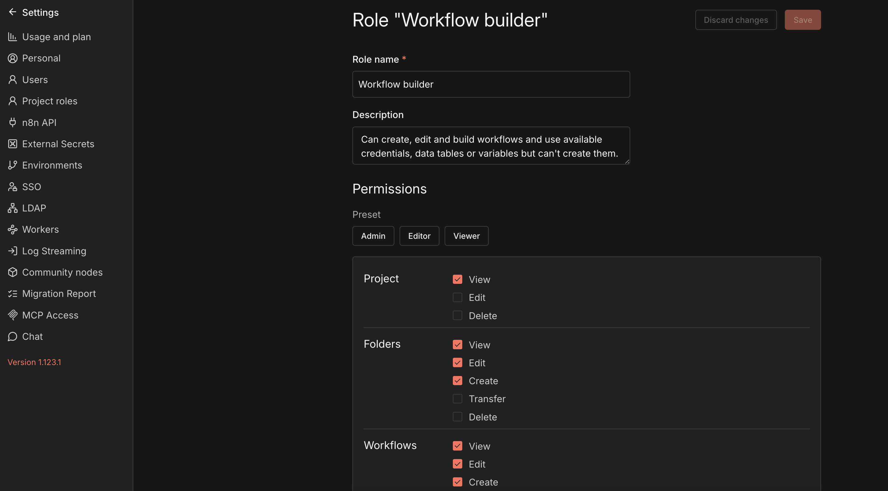
    <figcaption>Project roles is now available in the settings of your n8n Enterprise instance.</figcaption>
</figure>
<br>
**How it works** <br>
1. Go to the new Project roles section (instance admins only).<br>
2. Start from a preset (Admin, Editor, Viewer) or from scratch.<br>
3. Configure CRUD‑style permissions. <br>
4. Save the role. It now becomes available in the project member picker alongside system roles.<br>
5. Assign these roles to project members.<br>

Custom project roles let you assign permissions that match your organization's needs, improving governance and security in a clear, transparent, and manageable way.<br>

Custom project roles is only available on **n8n enterprise**.

 


### User provisioning via SSO <a href="#user-provisioning-via-sso" id="user-provisioning-via-sso"></a>

If you’re using SAML or OIDC, your Identity Provider (Okta, Azure AD, Google Workspace, etc.) can now automatically assign each user’s instance role and project roles when they log in.

When enabled, administrators can map a group or individual on their SSO identity provider to an instance role and one or more project roles.

This allows you to manage access centrally from your IdP with automated onboarding and off-boarding, eliminating manual access updates inside the n8n UI

Learn more in our dedicated documentation pages.

For [OIDC](https://app.gitbook.com/s/wMJrGrimpx3PxCJpUswm/manage-users-and-access/verify-user-identity/use-oidc/set-up-oidc#instance-and-project-access-provisioning) 
For [SAML](https://app.gitbook.com/s/wMJrGrimpx3PxCJpUswm/manage-users-and-access/verify-user-identity/use-saml/set-up-saml#instance-and-project-access-provisioning)

Notes: User provisioning is not real-time and updates apply on the user’s next login.

User provisioning is only available on n8n Enterprise.

 

* The AI Workflow Builder now uses improved internal best-practice instructions, which helps it generate higher quality workflows for users.
* Core updates allow creating data tables from CSV files, configurable workflow statistics, and improved user role provisioning for enterprise, including SSO settings integration.
* Enterprise customers using Single Sign On via SAML or OIDC can now provision the instance role and project role of each user in their organisation from their Identity Provider.
    * See the [new SAML documentation](https://app.gitbook.com/s/wMJrGrimpx3PxCJpUswm/manage-users-and-access/verify-user-identity/use-saml/set-up-saml#instance-and-project-access-provisioning)
    * See the [new OIDC documentation](https://app.gitbook.com/s/wMJrGrimpx3PxCJpUswm/manage-users-and-access/verify-user-identity/use-oidc/set-up-oidc#instance-and-project-access-provisioning)
* The editor features a dismissable callout for scaling mode, CSV download for data tables, custom project roles (Beta), and enhanced data table visibility.
* Additional improvements include Stripe billing meter events, and updates to binary data handling and workflow search.

### Contributors <a href="#contributors" id="contributors"></a>

[mi1os](https://github.com/mi1os)  

For full release details, refer to [Releases](https://github.com/n8n-io/n8n/releases) on GitHub.

## n8n@1.121.3 <a href="#n8n11213" id="n8n11213"></a>

View the [commits](https://github.com/n8n-io/n8n/compare/n8n@1.121.2...n8n@1.121.3) for this version.<br />
**Release date:** 2025-11-26

This release contains bug fixes.

For full release details, refer to [Releases](https://github.com/n8n-io/n8n/releases) on GitHub.


## n8n@1.121.2 <a href="#n8n11212" id="n8n11212"></a>

View the [commits](https://github.com/n8n-io/n8n/compare/n8n@1.121.1...n8n@1.121.2) for this version.<br />

* Fixed an issue with MCP access scope in the core system.
* Updated editor to improve notice background colors for better visibility.

This release also contains bug fixes.
**Release date:** 2025-11-20

For full release details, refer to [Releases](https://github.com/n8n-io/n8n/releases) on GitHub.

## n8n@1.121.1 <a href="#n8n11211" id="n8n11211"></a>

View the [commits](https://github.com/n8n-io/n8n/compare/n8n@1.121.0...n8n@1.121.1) for this version.<br />

* Prepared patch release 1.121.1 by updating version numbers across all packages.
* Added a changelog entry for version 1.121.1 to document the release.

**Release date:** 2025-11-19

For full release details, refer to [Releases](https://github.com/n8n-io/n8n/releases) on GitHub.

## n8n@1.121.0 <a href="#n8n11210" id="n8n11210"></a>

View the [commits](https://github.com/n8n-io/n8n/compare/n8n@1.120.0...n8n@1.121.0) for this version.<br />

**Release date:** 2025-11-18


### Critical security update <a href="#critical-security-update" id="critical-security-update"></a>

This release contains a critical security update. For more information, see [Security Advisory: Security Vulnerability in n8n Versions 1.65-1.120.4](https://blog.n8n.io/security-advisory-20260108/).




### Instance-level MCP connections (beta) <a href="#instance-level-mcp-connections-beta" id="instance-level-mcp-connections-beta"></a>

You can now enable MCP connections at the instance level, giving MCP-compatible AI platforms access to all selected workflows through a single oAuth-secured connection.
	
Once connected, these platforms can discover and interact with your workflows directly from their own interfaces, so you can observe, query, and trigger n8n workflows without switching contexts. As you add new MCP-enabled workflows to your instance, they automatically become available through the same connection without additional setup.

<br><br>
🛠️ How to:
To enable workflows through an instance-level MCP connection, both your instance and each workflow must be opted in. 
- To turn this feature on in your n8n instance, go the settings page for the instance and switch the Enable MCP Access toggle to on.
- To allow access to individual workflows, go to the settings in each workflow and switch the Available in MCP toggle to on.

<br><br>
🧠 Keep in mind:<br>
- To keep access organized and auditable, consider using a workspace or team account when connecting on behalf of an organization.
- All platforms connected to your instance MCP will have access to each of the workflows you have enabled. At this time, you cannot limit access of individual workflows to particular platforms.

<br><br>
This feature simplifies integration and improves visibility across AI platforms that support MCP, helping you use your n8n workflows directly in the tools where you already work and experiment. [Learn more in documentation.](https://app.gitbook.com/s/r7wKI4I1BgdBCuq5Cvcx/connect-to-n8n-mcp-server)
<br> 
<figure>
    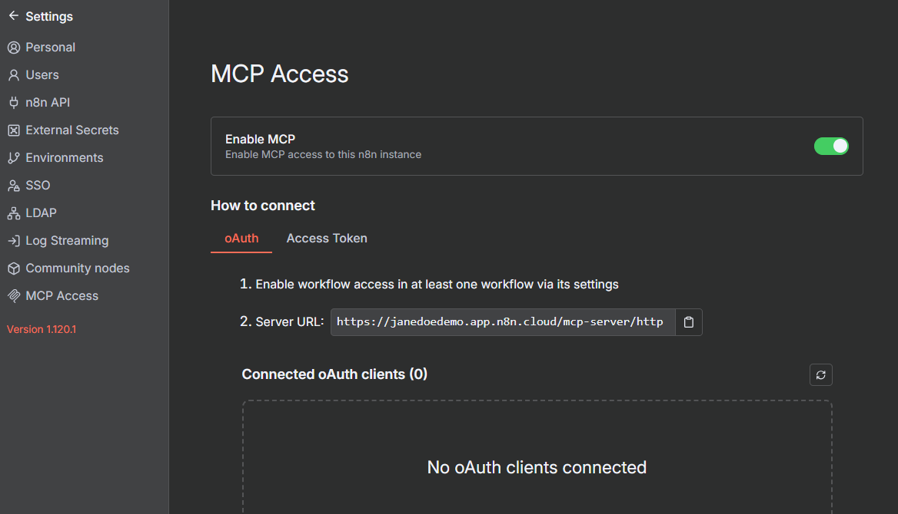
    <figcaption>Enable MCP for an instance in instance settings.</figcaption>
</figure>
<br>
<figure>
    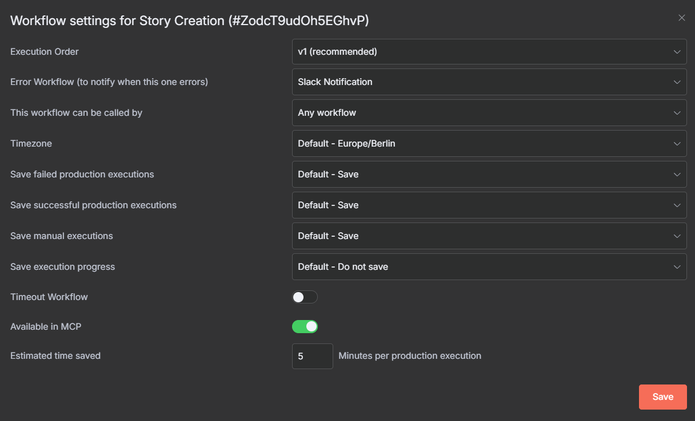
    <figcaption>Enable MCP for each workflow in workflow settings.</figcaption>
</figure>



### Contributors <a href="#contributors" id="contributors"></a>

[vicalca](https://github.com/vicalca)  
[datpp-ct](https://github.com/datpp-ct)  
[cesars-gh](https://github.com/cesars-gh)  
[farzad528](https://github.com/farzad528)  

For full release details, refer to [Releases](https://github.com/n8n-io/n8n/releases) on GitHub.

## n8n@1.120.4 <a href="#n8n11204" id="n8n11204"></a>

View the [commits](https://github.com/n8n-io/n8n/compare/n8n@1.120.3...n8n@1.120.4) for this version.<br />

**Release date:** 2025-11-19


* Prepared for release 1.120.4 by updating version numbers across all core, backend, AI/LLM, frontend, and tooling packages.
* Added a changelog entry for version 1.120.4 to document the release.

For full release details, refer to [Releases](https://github.com/n8n-io/n8n/releases) on GitHub.

## n8n@1.120.2 <a href="#n8n11202" id="n8n11202"></a>

View the [commits](https://github.com/n8n-io/n8n/compare/n8n@1.120.1...n8n@1.120.2) for this version.<br />
**Release date:** 2025-11-14

This release contains bug fixes.

For full release details, refer to [Releases](https://github.com/n8n-io/n8n/releases) on GitHub.


## n8n@1.120.1 <a href="#n8n11201" id="n8n11201"></a>

View the [commits](https://github.com/n8n-io/n8n/compare/n8n@1.120.0...n8n@1.120.1) for this version.<br />
**Release date:** 2025-11-11

This release contains a bug fix.

For full release details, refer to [Releases](https://github.com/n8n-io/n8n/releases) on GitHub.

## n8n@1.120.0 <a href="#n8n11200" id="n8n11200"></a>

View the [commits](https://github.com/n8n-io/n8n/compare/n8n@1.119.0...n8n@1.120.0) for this version.<br />
**Release date:** 2025-11-10

This release contains **security updates** and bug fixes. We recommend all users upgrade promptly to version 1.120 or higher.

### Contributors <a href="#contributors" id="contributors"></a>

[rothenbergt](https://github.com/rothenbergt)  

## n8n@1.119.2 <a href="#n8n11192" id="n8n11192"></a>

View the [commits](https://github.com/n8n-io/n8n/compare/n8n@1.119.1...n8n@1.119.2) for this version.<br />
**Release date:** 2025-11-14

This release contains bug fixes.

For full release details, refer to [Releases](https://github.com/n8n-io/n8n/releases) on GitHub.

## n8n@1.119.1 <a href="#n8n11191" id="n8n11191"></a>

View the [commits](https://github.com/n8n-io/n8n/compare/n8n@1.119.0...n8n@1.119.1) for this version.<br />
**Release date:** 2025-11-10


This release contains a bug fix.

For full release details, refer to [Releases](https://github.com/n8n-io/n8n/releases) on GitHub.


## n8n@1.118.2 <a href="#n8n11182" id="n8n11182"></a>

View the [commits](https://github.com/n8n-io/n8n/compare/n8n@1.118.1...n8n@1.118.2) for this version.<br />
**Release date:** 2025-11-05


This release contains a bug fix.

For full release details, refer to [Releases](https://github.com/n8n-io/n8n/releases) on GitHub.


## n8n@1.119.0 <a href="#n8n11190" id="n8n11190"></a>

View the [commits](https://github.com/n8n-io/n8n/compare/n8n@1.118.0...n8n@1.119.0) for this version.<br />
**Release date:** 2025-11-03


This release includes multiple bug fixes for AI Agent, task runners, editor, and integrations, as well as new features like improved workflow settings, AWS Assume Role credentials, and enhanced security and audit capabilities.


### Guardrails Node <a href="#guardrails-node" id="guardrails-node"></a>
The Guardrails node provides a set of rules and policies that control an AI agent's behavior by filtering its inputs and outputs. This helps safeguard from malicious input and from generating unsafe or undesirable responses. There are two operations:

- Check Text for Violations: Validate text against a set of policies (e.g. NSFW, prompt injection).
- Sanitize Text: Detects and replaces specific data such as PII, URLs, or secrets with placeholders.


The default presets and prompts are adapted from the open-source [guardrails package](https://github.com/openai/openai-guardrails-js) made available by OpenAI.
<br>	
For more info, see [Guardrails documentation](https://app.gitbook.com/s/BKcbOzIWja8NfqKDcqHc/builtin/core-nodes/n8n-nodes-langchain.guardrails)




### OAuth for MCP Client Tool node <a href="#oauth-for-mcp-client-tool-node" id="oauth-for-mcp-client-tool-node"></a>

The MCP Client Tool now supports OAuth authentication, enabling secure connections to APIs that implement delegated access flows. [Learn more](https://app.gitbook.com/s/BKcbOzIWja8NfqKDcqHc/builtin/cluster-nodes/sub-nodes/n8n-nodes-langchain.toolmcp) about the MCP Client Tool node.
<br> 
<figure>
    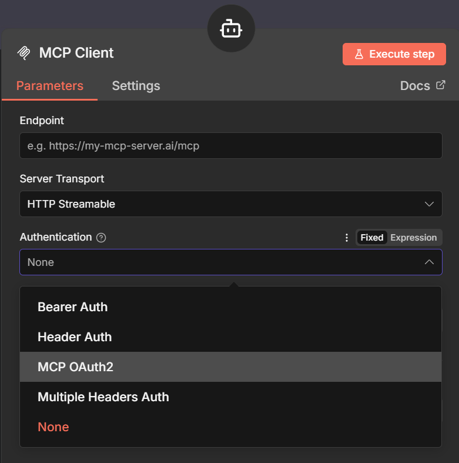
    <figcaption>Authentication options in MCP Client Tool node</figcaption>
</figure>
<br>


### Contributors <a href="#contributors" id="contributors"></a>

[cesars-gh](https://github.com/cesars-gh)  
[ongdisheng](https://github.com/ongdisheng)  

For full release details, refer to [Releases](https://github.com/n8n-io/n8n/releases) on GitHub.


## n8n@1.118.1 <a href="#n8n11181" id="n8n11181"></a>

View the [commits](https://github.com/n8n-io/n8n/compare/n8n@1.118.0...n8n@1.118.1) for this version.<br />
**Release date:** 2025-10-28


This release contains bug fixes.

For full release details, refer to [Releases](https://github.com/n8n-io/n8n/releases) on GitHub.

## n8n@1.117.3 <a href="#n8n11173" id="n8n11173"></a>

View the [commits](https://github.com/n8n-io/n8n/compare/n8n@1.117.2...n8n@1.117.3) for this version.<br />
**Release date:** 2025-10-28


This release contains bug fixes.

For full release details, refer to [Releases](https://github.com/n8n-io/n8n/releases) on GitHub.


## n8n@1.118.0 <a href="#n8n11180" id="n8n11180"></a>

View the [commits](https://github.com/n8n-io/n8n/compare/n8n@1.117.0...n8n@1.118.0) for this version.<br />
**Release date:** 2025-10-27


This release contains bug fixes.

For full release details, refer to [Releases](https://github.com/n8n-io/n8n/releases) on GitHub.


### Project-level variables <a href="#project-level-variables" id="project-level-variables"></a>

You can now create variables at either the global or project level.

- Project-level variables are only visible and usable by members of that project.
- Global variables can be overridden at the project level for more specific configurations.
- The maximum character limit has been increased to 1,000 to support longer values.

This update improves security and flexibility as part of our ongoing effort to isolate data and settings per project.

### Improvements to Environments <a href="#improvements-to-environments" id="improvements-to-environments"></a>

We’ve made several updates to improve reliability, consistency, and control across environments.

- **Projects are now fully synchronized across environments.** When a workflow is pushed within a project, it’s automatically created and synced in all environments where it’s pulled. Moving, renaming, or deleting projects is now reflected everywhere, keeping instances aligned.
- **Improved protection for read-only environments.** Read-only instances now block all changes, including folder moves and workflow ownership updates, ensuring production environments stay stable and isolated.
- **Bug fix: tag mapping synchronization.** Fixed an issue where tag mappings only updated when tags changed. They now sync on every commit for consistent tagging across environments.

### Custom date ranges for Insights <a href="#custom-date-ranges-for-insights" id="custom-date-ranges-for-insights"></a>

You can now define custom date ranges instead of using fixed ones, giving you more control over the data you analyze.

 

## n8n@1.117.2 <a href="#n8n11172" id="n8n11172"></a>

View the [commits](https://github.com/n8n-io/n8n/compare/n8n@1.117.1...n8n@1.117.2) for this version.<br />
**Release date:** 2025-10-27


This release contains bug fixes.

For full release details, refer to [Releases](https://github.com/n8n-io/n8n/releases) on GitHub.

## n8n@1.117.1 <a href="#n8n11171" id="n8n11171"></a>

View the [commits](https://github.com/n8n-io/n8n/compare/n8n@1.117.0...n8n@1.117.1) for this version.<br />
**Release date:** 2025-10-24

This release contains bug fixes.


### AI Workflow Builder is now available to Enterprise Cloud users. <a href="#ai-workflow-builder-is-now-available-to-enterprise-cloud-users" id="ai-workflow-builder-is-now-available-to-enterprise-cloud-users"></a>
AI Workflow Builder turns prompts into workflows. Describe what you want to build, and n8n will generate a draft workflow by adding, configuring, and connecting nodes for you. From there, you can refine and expand the workflow directly in the editor.<br>
<br>
**What’s new:**

- Previously available to Starter and Pro users, AI Workflow Builder is now accessible to Enterprise Cloud users as well, with 1,000 monthly credits.
- Supported on n8n version 1.115+. **If you don’t see the feature yet, open /settings/usage to trigger a license refresh.**
- We’ve fixed a bug and now cloud users on v1.117.1 onwards will have access to a more reliable builder.
- We’re currently working on bringing AI Workflow Builder to self-hosted users as well, including Community, Business, and Enterprise.



For full release details, refer to [Releases](https://github.com/n8n-io/n8n/releases) on GitHub.

## n8n@1.117.0 <a href="#n8n11170" id="n8n11170"></a>

View the [commits](https://github.com/n8n-io/n8n/compare/n8n@1.116.0...n8n@1.117.0) for this version.<br />
**Release date:** 2025-10-21

This release contains bug fixes.

### Contributors <a href="#contributors" id="contributors"></a>

[jackfrancismurphy](https://github.com/jackfrancismurphy)  
[JiriDeJonghe](https://github.com/JiriDeJonghe)  
[ramkrishna2910](https://github.com/ramkrishna2910)  
Oracle and/or its affiliates ([sudarshan12s](https://github.com/sudarshan12s))

For full release details, refer to [Releases](https://github.com/n8n-io/n8n/releases) on GitHub.


## n8n@1.116.2 <a href="#n8n11162" id="n8n11162"></a>

View the [commits](https://github.com/n8n-io/n8n/compare/n8n@1.116.1...n8n@1.116.2) for this version.<br />
**Release date:** 2025-10-21

This release contains a bug fix.


## n8n@1.115.4 <a href="#n8n11154" id="n8n11154"></a>

View the [commits](https://github.com/n8n-io/n8n/compare/n8n@1.115.3...n8n@1.115.4) for this version.<br />
**Release date:** 2025-10-21

This release contains a bug fix.

For full release details, refer to [Releases](https://github.com/n8n-io/n8n/releases) on GitHub.

## n8n@1.116.1 <a href="#n8n11161" id="n8n11161"></a>

View the [commits](https://github.com/n8n-io/n8n/compare/n8n@1.116.0...n8n@1.116.1) for this version.<br />
**Release date:** 2025-10-14

This release contains a bug fix.

For full release details, refer to [Releases](https://github.com/n8n-io/n8n/releases) on GitHub.


## n8n@1.116.0 <a href="#n8n11160" id="n8n11160"></a>

View the [commits](https://github.com/n8n-io/n8n/compare/n8n@1.115.0...n8n@1.116.0) for this version.<br />
**Release date:** 2025-10-13

This release contains bug fixes.


### Data migration tool <a href="#data-migration-tool" id="data-migration-tool"></a>
You can now easily migrate n8n data between different database types. This new tooling currently supports SQLite and Postgres, making the transition to a scaling database choice simpler, allowing you to take your data with you.
<br>
The tooling comes in the form of two new CLI commands, `export:entities` and `import:entities`
<br>
**`Export`**
The new export command lets you export data from your existing n8n database (SQLite / Postgres), producing a set of encrypted files within a compressed directory for you to move around and use with the import commands.

For details, see [Export entities](https://app.gitbook.com/s/jm0ZYRpZIPWge2ZSiDYO/host-n8n/configure-n8n/use-the-command-line#export-entities)
<br>
**`Import`**
The new import command allows you to read from a compressed and encrypted set of files generated from the new export command, and import them in to your new database of choice (SQLite / Postgres) to be used with your n8n instance.

For details, see [Import entities](https://app.gitbook.com/s/jm0ZYRpZIPWge2ZSiDYO/host-n8n/configure-n8n/use-the-command-line#import-entities)



### Contributors <a href="#contributors" id="contributors"></a>

[JHTosas](https://github.com/JHTosas)  
[clesecq](https://github.com/clesecq)  
[Gulianrdgd](https://github.com/Gulianrdgd)  
[tishun](https://github.com/tishun)  

For full release details, refer to [Releases](https://github.com/n8n-io/n8n/releases) on GitHub.


## n8n@1.116.0 <a href="#n8n11160" id="n8n11160"></a>

View the [commits](https://github.com/n8n-io/n8n/compare/n8n@1.115.0...n8n@1.116.0) for this version.<br />
**Release date:** 2025-10-13

This release contains bug fixes.

### Contributors <a href="#contributors" id="contributors"></a>

[JHTosas](https://github.com/JHTosas)  
[clesecq](https://github.com/clesecq)  
[Gulianrdgd](https://github.com/Gulianrdgd)  
[tishun](https://github.com/tishun)  

For full release details, refer to [Releases](https://github.com/n8n-io/n8n/releases) on GitHub.

## n8n@1.115.3 <a href="#n8n11153" id="n8n11153"></a>

View the [commits](https://github.com/n8n-io/n8n/compare/n8n@1.115.2...n8n@1.115.3) for this version.<br />
**Release date:** 2025-10-14

This release contains bug fixes.

For full release details, refer to [Releases](https://github.com/n8n-io/n8n/releases) on GitHub.


## n8n@1.115.2 <a href="#n8n11152" id="n8n11152"></a>

View the [commits](https://github.com/n8n-io/n8n/compare/n8n@1.115.1...n8n@1.115.2) for this version.<br />
**Release date:** 2025-10-10


This release contains bug fixes.

For full release details, refer to [Releases](https://github.com/n8n-io/n8n/releases) on GitHub.


## n8n@1.114.4 <a href="#n8n11144" id="n8n11144"></a>

View the [commits](https://github.com/n8n-io/n8n/compare/n8n@1.114.3...n8n@1.114.4) for this version.<br />
**Release date:** 2025-10-07

This release contains bug fixes.

For full release details, refer to [Releases](https://github.com/n8n-io/n8n/releases) on GitHub.


## n8n@1.115.0 <a href="#n8n11150" id="n8n11150"></a>

View the [commits](https://github.com/n8n-io/n8n/compare/n8n@1.114.0...n8n@1.115.0) for this version.<br />
**Release date:** 2025-10-06


This release contains bug fixes.

### AI Workflow Builder (Beta) <a href="#ai-workflow-builder-beta" id="ai-workflow-builder-beta"></a>

**AI Workflow Builder** turns your natural language prompts into working automations. Describe what you want to build, and n8n will generate a draft workflow by adding and configuring nodes and wiring up the logic for you. From there, you can refine, expand, or adjust the workflow directly in the editor.

This feature helps you move from idea to implementation faster and without losing technical control. It’s especially helpful when starting from a blank canvas, validating an approach, or exploring new nodes and capabilities. Multi-turn interaction lets you iterate in conversation, turning your ideas into structured, production-ready workflows step by step.


Learn more about how we we’re building this feature in our [forum post](https://community.n8n.io/t/ai-powered-workflow-building-coming-soon/196499).

<br>
<video src="/_video/release-notes/AI_Workflow_Builder.webm" controls width="100%"></video>
<br>


**Availability:**  

- This feature is initially going to be available for Cloud users on the 14-day Trial, Starter and Pro plans.
- Availability for Enterprise users on Cloud will follow in a future update.
- We are actively exploring the best way to bring this feature to self-hosted users.

**Rollout timing:** 

- To ensure the smoothest experience for all users, this feature will be rolled out to users on version 1.115.0 over the course of a week so you may not have access to the feature immediately when you upgrade to 1.115.0.

**Credit limits by plan:** This feature will have monthly credit limits [by plan](https://n8n.io/pricing/). 

- Each prompt/interaction with the AI Workflow Builder consumes one credit.
- Trial users have access to 20 credits, Starter plans have 50 per month and Pro plans will have 150 credits per month.
- At this time, there will not be a way to access additional credits within your plan, however we are we are exploring this.

Learn more about AI Workflow Builder in [documentation](https://docs.n8n.io/advanced-ai/ai-workflow-builder/).


### Source Control: Added HTTPS support <a href="#source-control-added-https-support" id="source-control-added-https-support"></a>

You can now connect to Git repositories via HTTPS in addition to SSH, making Source Control usable in environments where SSH is restricted.
<br> 
<figure>
    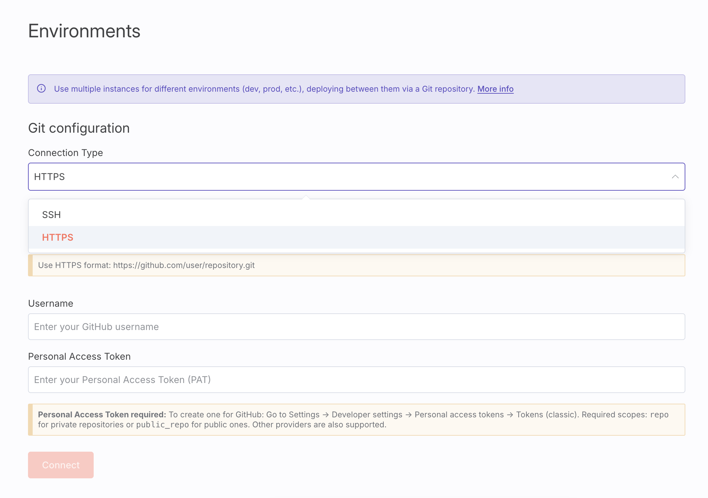
    <figcaption>HTTPS is now supported as a connection type in Environments. </figcaption>
</figure>
<br>

### Contributors <a href="#contributors" id="contributors"></a>

[baileympearson](https://github.com/baileympearson)  
[h40huynh](https://github.com/h40huynh)  
[Ankit-69k](https://github.com/Ankit-69k)  
[francisfontoura](https://github.com/francisfontoura)  
[iocanel](https://github.com/iocanel)  

For full release details, refer to [Releases](https://github.com/n8n-io/n8n/releases) on GitHub.

## n8n@1.114.3 <a href="#n8n11143" id="n8n11143"></a>

View the [commits](https://github.com/n8n-io/n8n/compare/n8n@1.114.2...n8n@1.114.3) for this version.<br />
**Release date:** 2025-10-06


This release contains bug fixes.

## n8n@1.114.2 <a href="#n8n11142" id="n8n11142"></a>

View the [commits](https://github.com/n8n-io/n8n/compare/n8n@1.114.1...n8n@1.114.2) for this version.<br />
**Release date:** 2025-10-02


This release contains bug fixes.

For full release details, refer to [Releases](https://github.com/n8n-io/n8n/releases) on GitHub.

## n8n@1.114.1 <a href="#n8n11141" id="n8n11141"></a>

View the [commits](https://github.com/n8n-io/n8n/compare/n8n@1.114.0...n8n@1.114.1) for this version.<br />
**Release date:** 2025-10-02

This release contains bug fixes.

For full release details, refer to [Releases](https://github.com/n8n-io/n8n/releases) on GitHub.


## n8n@1.114.0 <a href="#n8n11140" id="n8n11140"></a>

View the [commits](https://github.com/n8n-io/n8n/compare/n8n@1.113.0...n8n@1.114.0) for this version.<br />
**Release date:** 2025-09-29


This release contains core updates, editor improvements, project updates, performance improvements, and bug fixes.

### Contributors <a href="#contributors" id="contributors"></a>

[nealzhu3](https://github.com/nealzhu3)  

For full release details, refer to [Releases](https://github.com/n8n-io/n8n/releases) on GitHub.


## n8n@1.113.3 <a href="#n8n11133" id="n8n11133"></a>

View the [commits](https://github.com/n8n-io/n8n/compare/n8n@1.113.2...n8n@1.113.3) for this version.<br />
**Release date:** 2025-09-26

This release contains a bug fix.

For full release details, refer to [Releases](https://github.com/n8n-io/n8n/releases) on GitHub.

## n8n@1.112.6 <a href="#n8n11126" id="n8n11126"></a>

View the [commits](https://github.com/n8n-io/n8n/compare/n8n@1.112.5...n8n@1.112.6) for this version.<br />
**Release date:** 2025-09-26


This release contains a bug fix.

For full release details, refer to [Releases](https://github.com/n8n-io/n8n/releases) on GitHub.


## n8n@1.113.2 <a href="#n8n11132" id="n8n11132"></a>

View the [commits](https://github.com/n8n-io/n8n/compare/n8n@1.113.1...n8n@1.113.2) for this version.<br />
**Release date:** 2025-09-24


This release contains bug fixes.

For full release details, refer to [Releases](https://github.com/n8n-io/n8n/releases) on GitHub.


### Python task runner <a href="#python-task-runner" id="python-task-runner"></a>

This version introduces the **Python task runner** as a beta feature. This feature secures n8n's Python sandbox and enables users to run real Python modules in n8n workflows. The original Pyodide-based implementation will be phased out. 


This is a **breaking change** that replaces Pyodide - see [here](https://docs.n8n.io/integrations/builtin/core-nodes/n8n-nodes-base.code/#python-native-beta) for a list of differences. Any Code node set to the legacy `python` parameter will need to be manually updated to use the new `pythonNative` parameter. Any Code node script set to `python` and relying on Pyodide syntax is likely to need to be manually adjusted to account for breaking changes.

- For self-hosting users, see [here](https://docs.n8n.io/hosting/configuration/task-runners/#setting-up-external-mode) for deployment instructions for task runners going forward and how to install extra dependencies.
- On n8n Cloud, this will be a gradual transition. If in your n8n Cloud instance the Code node offers an option named "Python (Native) (Beta)", then your instance has been transitioned to native Python and you will need to look out for any breaking changes. Imports are disabled for security reasons at this time.

The native Python runner is currently in beta and is subject to change as we find a balance between security and usability. Your feedback is welcome.

 

## n8n@1.112.5 <a href="#n8n11125" id="n8n11125"></a>

View the [commits](https://github.com/n8n-io/n8n/compare/n8n@1.112.4...n8n@1.112.5) for this version.<br />
**Release date:** 2025-09-24


This release contains bug fixes.

For full release details, refer to [Releases](https://github.com/n8n-io/n8n/releases) on GitHub.


## n8n@1.113.1 <a href="#n8n11131" id="n8n11131"></a>

View the [commits](https://github.com/n8n-io/n8n/compare/n8n@1.113.0...n8n@1.113.1) for this version.<br />
**Release date:** 2025-09-23


This release contains bug fixes.


### Data tables <a href="#data-tables" id="data-tables"></a>

We’re excited to introduce **data tables**, bringing built-in data storage to n8n. You can now store and query structured data directly inside the platform, without relying on external databases for many common automation scenarios. Track workflow state between runs, store tokens or session data, keep product or customer reference tables, or stage intermediate results for multi-step processes.


Previously, persisting data meant provisioning and connecting to an external store such as Redis or Google Sheets. That added credential setup, infrastructure overhead, latency, and constant context switching. **Data tables** eliminate that friction and keeps your data easily editable and close to your workflows.


Data tables are available today on all plans. They currently support numbers, strings, and datetimes with JSON support coming soon.  On Cloud, each instance can store up to 50 MB. On self-hosted setups, the default is also 50 MB, but this limit can be adjusted if your infrastructure allows.


<figure>
<a href="https://www.youtube.com/watch?v=ljkiIkt6lZ4">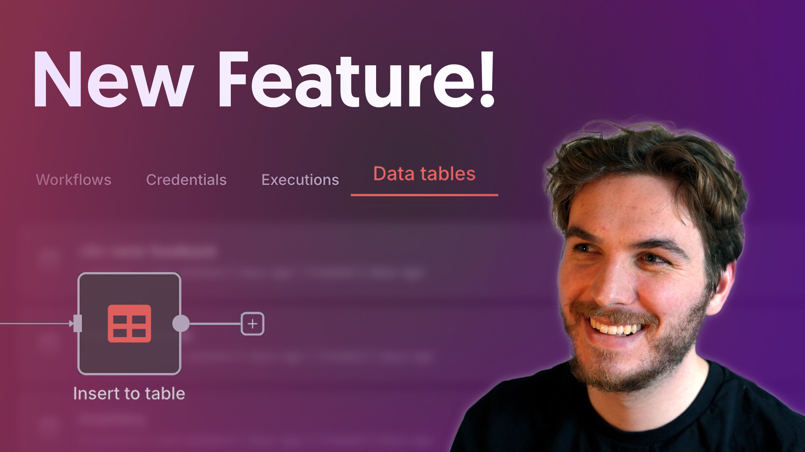</a>
    <figcaption>[Overview of data tables](https://www.youtube.com/watch?v=ljkiIkt6lZ4)</figcaption>
</figure>

🛠️ **How to:**

**Create a data table**

- From the canvas, open the **Create workflow** dropdown and select **Create Data table**.
- Or, go to the **Overview** panel on the left-side navigation bar and open the **Data tables** tab.

**Use a data table in your workflow**

- Add the **Data table node** to your workflow to get, update, insert, upsert, or delete rows.

**Adjust the storage limit** (self-hosted only)

- Change the default 50 MB limit with the environment variable: `N8N_DATA_TABLES_MAX_SIZE_BYTES`. [See configuration docs](https://docs.n8n.io/hosting/configuration/configuration-methods/).

🧠**Keep in mind**

- Data tables don’t currently support foreign keys or default values.
- For now, all data tables are accessible to everyone in a project.  More granular permissions and sharing options are planned.

Learn more about [**data tables**](https://app.gitbook.com/s/rPN1zU5jaYNvwH7RzxqA/work-with-data/data-tables) and the [**Data table node**](https://app.gitbook.com/s/BKcbOzIWja8NfqKDcqHc/builtin/core-nodes/n8n-nodes-base.datatable).

 

For full release details, refer to [Releases](https://github.com/n8n-io/n8n/releases) on GitHub.


## n8n@1.112.4 <a href="#n8n11124" id="n8n11124"></a>

View the [commits](https://github.com/n8n-io/n8n/compare/n8n@1.112.3...n8n@1.112.4) for this version.<br />
**Release date:** 2025-09-23


This release contains an editor improvement.

For full release details, refer to [Releases](https://github.com/n8n-io/n8n/releases) on GitHub.


## n8n@1.113.0 <a href="#n8n11130" id="n8n11130"></a>

View the [commits](https://github.com/n8n-io/n8n/compare/n8n@1.112.0...n8n@1.113.0) for this version.<br />
**Release date:** 2025-09-22


This release contains core updates, editor improvements, a new node, node updates, and bug fixes.

### SSO improvements <a href="#sso-improvements" id="sso-improvements"></a>

We’ve made updates to strengthen Single Sign-On (SSO) reliability and security, especially for enterprise and multi-instance setups.

- OIDC and SAML sync in multi-main setups [version: 1.113.0]: In multi-main deployments, updates to SSO settings are now synchronized across all instances, ensuring consistent login behavior everywhere.
- Enhanced OIDC integration [version 1.111.0]: n8n now supports OIDC providers that enforce state and nonce parameters. These are validated during login, providing smoother and more secure Single Sign-On.

### Filter insights by project <a href="#filter-insights-by-project" id="filter-insights-by-project"></a>

We've added project filtering to insights, enabling more granular reporting and visibility into individual project performance.
<br>
<figure>
    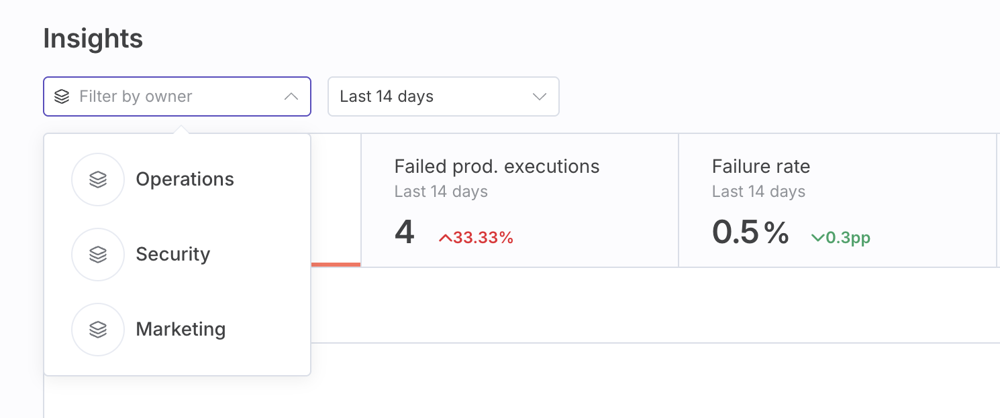
<figcaption>Filter insights</figcaption>
</figure>
<br>

### Contributors <a href="#contributors" id="contributors"></a>

[ongdisheng](https://github.com/ongdisheng)  

For full release details, refer to [Releases](https://github.com/n8n-io/n8n/releases) on GitHub.


## n8n@1.112.3 <a href="#n8n11123" id="n8n11123"></a>

View the [commits](https://github.com/n8n-io/n8n/compare/n8n@1.112.2...n8n@1.112.3) for this version.<br />
**Release date:** 2025-09-19


This release contains a bug fix.

For full release details, refer to [Releases](https://github.com/n8n-io/n8n/releases) on GitHub.

## n8n@1.111.1 <a href="#n8n11111" id="n8n11111"></a>

View the [commits](https://github.com/n8n-io/n8n/compare/n8n@1.111.0...n8n@1.111.1) for this version.<br />
**Release date:** 2025-09-19

This release contains a bug fix.

For full release details, refer to [Releases](https://github.com/n8n-io/n8n/releases) on GitHub.


## n8n@1.110.2 <a href="#n8n11102" id="n8n11102"></a>

View the [commits](https://github.com/n8n-io/n8n/compare/n8n@1.110.1...n8n@1.110.2) for this version.<br />
**Release date:** 2025-09-19

This release contains a bug fix.

For full release details, refer to [Releases](https://github.com/n8n-io/n8n/releases) on GitHub.


## n8n@1.112.2 <a href="#n8n11122" id="n8n11122"></a>

View the [commits](https://github.com/n8n-io/n8n/compare/n8n@1.112.1...n8n@1.112.2) for this version.<br />
**Release date:** 2025-09-18

This release contains a bug fix.

For full release details, refer to [Releases](https://github.com/n8n-io/n8n/releases) on GitHub.


## n8n@1.112.1 <a href="#n8n11121" id="n8n11121"></a>

View the [commits](https://github.com/n8n-io/n8n/compare/n8n@1.112.0...n8n@1.112.1) for this version.<br />
**Release date:** 2025-09-17

This release contains bug fixes.

For full release details, refer to [Releases](https://github.com/n8n-io/n8n/releases) on GitHub.


## n8n@1.112.0 <a href="#n8n11120" id="n8n11120"></a>

View the [commits](https://github.com/n8n-io/n8n/compare/n8n@1.111.0...n8n@1.112.0) for this version.<br />
**Release date:** 2025-09-15


This release contains API improvements, core updates, editor improvements, node updates, and bug fixes.

### Additional API Endpoints versions <a href="#additional-api-endpoints-versions" id="additional-api-endpoints-versions"></a>

We’ve made several updates to the Executions API:

- Execution details: `GET /executions` now includes *status* and *workflow_name* in the response.
- Retry execution endpoint: Added new public API endpoints to retry failed executions.
- Additional filters: You can now filter executions by running or canceled status.

### Enhancements to workflow diff <a href="#enhancements-to-workflow-diff" id="enhancements-to-workflow-diff"></a>

We added a several updates on workflows diffs as well:

- Better view in Code nodes and Stickies: Workflow diffs now highlight changes per line instead of per block, making edits easier to review and understand.
- Enable/Disable sync: You can now enable or disable sync in the viewport, letting you compare a workflow change in one view without affecting the other.
<br>
<figure>
    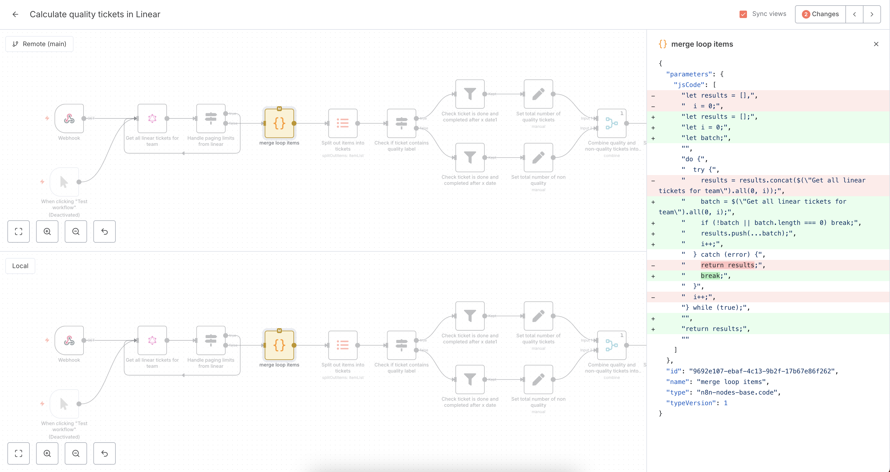
<figcaption>Workflow diff</figcaption>
</figure>
<br>

### Contributors <a href="#contributors" id="contributors"></a>

[GuraaseesSingh](https://github.com/GuraaseesSingh)  
[jabbson](https://github.com/jabbson)  
[ongdisheng](https://github.com/ongdisheng)  

For full release details, refer to [Releases](https://github.com/n8n-io/n8n/releases) on GitHub.


## n8n@1.111.0 <a href="#n8n11110" id="n8n11110"></a>

View the [commits](https://github.com/n8n-io/n8n/compare/n8n@1.110.0...n8n@1.111.0) for this version.<br />
**Release date:** 2025-09-08


This release contains core updates, API improvements, node updates, and bug fixes.

### Contributors <a href="#contributors" id="contributors"></a>

[abellion](https://github.com/abellion)  
[cesars-gh](https://github.com/cesars-gh)  
[durran](https://github.com/durran)  

For full release details, refer to [Releases](https://github.com/n8n-io/n8n/releases) on GitHub.


## n8n@1.110.1 <a href="#n8n11101" id="n8n11101"></a>

View the [commits](https://github.com/n8n-io/n8n/compare/n8n@1.110.0...n8n@1.110.1) for this version.<br />
**Release date:** 2025-09-03


This release contains bug fixes.

For full release details, refer to [Releases](https://github.com/n8n-io/n8n/releases) on GitHub.


## n8n@1.109.2 <a href="#n8n11092" id="n8n11092"></a>

View the [commits](https://github.com/n8n-io/n8n/compare/n8n@1.109.1...n8n@1.109.2) for this version.<br />
**Release date:** 2025-09-03


This release contains bug fixes.

For full release details, refer to [Releases](https://github.com/n8n-io/n8n/releases) on GitHub.


## n8n@1.110.0 <a href="#n8n11100" id="n8n11100"></a>

View the [commits](https://github.com/n8n-io/n8n/compare/n8n@1.109.0...n8n@1.110.0) for this version.<br />
**Release date:** 2025-09-01


This release contains core updates, editor improvements, node updates, performance improvements, and bug fixes.

### Contributors <a href="#contributors" id="contributors"></a>

[heyxmirko](https://github.com/heyxmirko)  

For full release details, refer to [Releases](https://github.com/n8n-io/n8n/releases) on GitHub.


## n8n@1.109.1 <a href="#n8n11091" id="n8n11091"></a>

View the [commits](https://github.com/n8n-io/n8n/compare/n8n@1.109.0...n8n@1.109.1) for this version.<br />
**Release date:** 2025-08-27


This release contains a bug fix.

For full release details, refer to [Releases](https://github.com/n8n-io/n8n/releases) on GitHub.


## n8n@1.108.2 <a href="#n8n11082" id="n8n11082"></a>

View the [commits](https://github.com/n8n-io/n8n/compare/n8n@1.108.1...n8n@1.108.2) for this version.<br />
**Release date:** 2025-08-27


This release contains a bug fix.

For full release details, refer to [Releases](https://github.com/n8n-io/n8n/releases) on GitHub.


## n8n@1.109.0 <a href="#n8n11090" id="n8n11090"></a>

View the [commits](https://github.com/n8n-io/n8n/compare/n8n@1.108.0...n8n@1.109.0) for this version.<br />
**Release date:** 2025-08-25


This release contains core updates, editor improvements, node updates, performance improvements, and bug fixes.

### Contributors <a href="#contributors" id="contributors"></a>

[naXa777](https://github.com/naXa777)  
[prettycode2022](https://github.com/prettycode2022)  
[oppai](https://github.com/oppai)  

For full release details, refer to [Releases](https://github.com/n8n-io/n8n/releases) on GitHub.


## n8n@1.107.4 <a href="#n8n11074" id="n8n11074"></a>

View the [commits](https://github.com/n8n-io/n8n/compare/n8n@1.107.3...n8n@1.107.4) for this version.<br />
**Release date:** 2025-08-20


This release contains a bug fix.

For full release details, refer to [Releases](https://github.com/n8n-io/n8n/releases) on GitHub.

## n8n@1.108.1 <a href="#n8n11081" id="n8n11081"></a>

View the [commits](https://github.com/n8n-io/n8n/compare/n8n@1.108.0...n8n@1.108.1) for this version.<br />
**Release date:** 2025-08-20


This release contains a bug fix.

For full release details, refer to [Releases](https://github.com/n8n-io/n8n/releases) on GitHub.


## n8n@1.107.3 <a href="#n8n11073" id="n8n11073"></a>

View the [commits](https://github.com/n8n-io/n8n/compare/n8n@1.107.2...n8n@1.107.3) for this version.<br />
**Release date:** 2025-08-18

This release contains bug fixes.

For full release details, refer to [Releases](https://github.com/n8n-io/n8n/releases) on GitHub.

## n8n@1.108.0 <a href="#n8n11080" id="n8n11080"></a>

View the [commits](https://github.com/n8n-io/n8n/compare/n8n@1.107.0...n8n@1.108.0) for this version.<br />
**Release date:** 2025-08-18

This release contains a new CLI tool, editor improvements, node updates, performance improvements, and bug fixes.
### Workflow Diff <a href="#workflow-diff" id="workflow-diff"></a>

For teams working across different environments, deployments often involve multiple people making changes at different times. Without a clear view of those changes, it’s easy to miss something important.

[Workflow Diff](https://app.gitbook.com/s/wMJrGrimpx3PxCJpUswm/use-source-control-and-environments/compare-versions) gives you an easy and visual way to review workflow changes before you deploy them between environments.

With it, you can:

- Quickly see what’s been added, changed, or deleted, with clear colour highlights.
- Easily see important settings changes on a workflow.
- Check changes inside each node, and spot connector updates, with a side-by-side view of its settings.
- Get a quick count of all changes to understand the size of a deployment.

<br> 
<figure>
    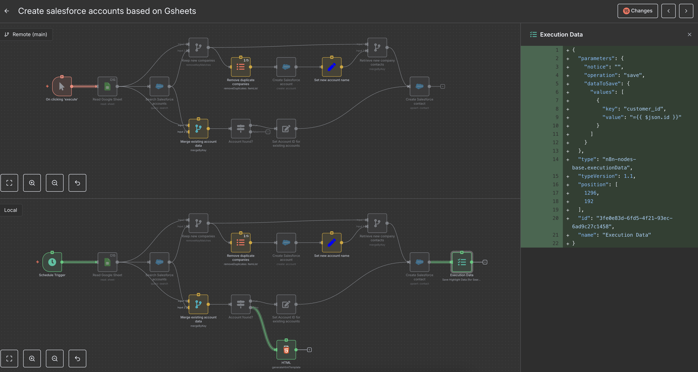
    <figcaption></figcaption>
</figure>
<br> 
<figure>
    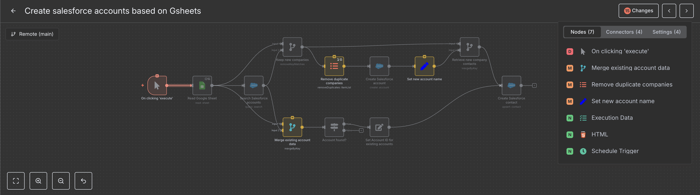
    <figcaption>Workflow Diff</figcaption>
</figure>
<br>
Workflow Diff eases the review and approval of changes before deployment, enabling teams to collaborate on workflows without breaking existing automations or disrupting production. It’s one step further in integrating DevOps best practices in n8n. 

Now available for Enterprise customers using Environments.

### Contributors <a href="#contributors" id="contributors"></a>

[ManuLasker](https://github.com/ManuLasker)  
[EternalDeiwos](https://github.com/EternalDeiwos)  
[jreyesr](https://github.com/jreyesr)  

For full release details, refer to [Releases](https://github.com/n8n-io/n8n/releases) on GitHub.


## n8n@1.107.2 <a href="#n8n11072" id="n8n11072"></a>

View the [commits](https://github.com/n8n-io/n8n/compare/n8n@1.107.1...n8n@1.107.2) for this version.<br />
**Release date:** 2025-08-15


This release contains bug fixes.

For full release details, refer to [Releases](https://github.com/n8n-io/n8n/releases) on GitHub.


## n8n@1.107.1 <a href="#n8n11071" id="n8n11071"></a>

View the [commits](https://github.com/n8n-io/n8n/compare/n8n@1.107.0...n8n@1.107.1) for this version.<br />
**Release date:** 2025-08-14


This release contains bug fixes.

For full release details, refer to [Releases](https://github.com/n8n-io/n8n/releases) on GitHub.


## n8n@1.106.3 <a href="#n8n11063" id="n8n11063"></a>

View the [commits](https://github.com/n8n-io/n8n/compare/n8n@1.106.2...n8n@1.106.3) for this version.<br />
**Release date:** 2025-08-11


This release contains a backported update.

For full release details, refer to [Releases](https://github.com/n8n-io/n8n/releases) on GitHub.


## n8n@1.107.0 <a href="#n8n11070" id="n8n11070"></a>

View the [commits](https://github.com/n8n-io/n8n/compare/n8n@1.106.0...n8n@1.107.0) for this version.<br />
**Release date:** 2025-08-11


This release contains bug fixes.

### Contributors <a href="#contributors" id="contributors"></a>

[Amsal1](https://github.com/Amsal1)  
[andrewzolotukhin](https://github.com/andrewzolotukhin)  
[DMA902](https://github.com/DMA902)  
[fkowal](https://github.com/fkowal)  
[Gulianrdgd](https://github.com/Gulianrdgd)  

For full release details, refer to [Releases](https://github.com/n8n-io/n8n/releases) on GitHub.


## n8n@1.106.2 <a href="#n8n11062" id="n8n11062"></a>

View the [commits](https://github.com/n8n-io/n8n/compare/n8n@1.106.1...n8n@1.106.2) for this version.<br />
**Release date:** 2025-08-08


This release contains bug fixes.

For full release details, refer to [Releases](https://github.com/n8n-io/n8n/releases) on GitHub.


## n8n@1.106.1 <a href="#n8n11061" id="n8n11061"></a>

View the [commits](https://github.com/n8n-io/n8n/compare/n8n@1.106.0...n8n@1.106.1) for this version.<br />
**Release date:** 2025-08-07


This release contains bug fixes.

For full release details, refer to [Releases](https://github.com/n8n-io/n8n/releases) on GitHub.

## n8n@1.105.4 <a href="#n8n11054" id="n8n11054"></a>

View the [commits](https://github.com/n8n-io/n8n/compare/n8n@1.105.3...n8n@1.105.4) for this version.<br />
**Release date:** 2025-08-07


This release contains bug fixes.

For full release details, refer to [Releases](https://github.com/n8n-io/n8n/releases) on GitHub.


## n8n@1.105.3 <a href="#n8n11053" id="n8n11053"></a>

View the [commits](https://github.com/n8n-io/n8n/compare/n8n@1.105.2...n8n@1.105.3) for this version.<br />
**Release date:** 2025-08-05


This release contains bug fixes.

For full release details, refer to [Releases](https://github.com/n8n-io/n8n/releases) on GitHub.


## n8n@1.106.0 <a href="#n8n11060" id="n8n11060"></a>

View the [commits](https://github.com/n8n-io/n8n/compare/n8n@1.105.0...n8n@1.106.0) for this version.<br />
**Release date:** 2025-08-04


This release contains performance improvements, core updates, editor improvements, node updates, a new node, and bug fixes.


### **No more limit of active workflows and new self-hosted Business Plan** <a href="#no-more-limit-of-active-workflows-and-new-self-hosted-business-plan" id="no-more-limit-of-active-workflows-and-new-self-hosted-business-plan"></a>

We have rolled out a new pricing model to make it easier for builders of all sizes to adopt and scale automation with n8n.
<br><br>
_**What’s new**_
<br><br>
**No more limit of active workflows.**

All n8n plans, from Starter to Enterprise, now include unlimited users, workflows, and steps. Our pricing is based on the volume of executions. Meaning you can build and test as many workflows as you want, including complex, data-heavy, or long-running automations, without worrying about quotas. 
<br><br>
**New self-hosted Business Plan for growing teams**

Designed for SMBs and mid-sized companies, the Business Plan includes features such as: 

- 6 shared projects
- SSO, SAML and LDAP
- Different environments
- Global variables
- Version control using Git
- 30 days of Insights

Please note that this plan only includes support from our community forum. For dedicated support we recommend upgrading to our Enterprise plan.
<br><br>

**Enterprise pricing now scales with executions**

Enterprise plans no longer use workflow-based pricing, and is now also based on the volume of executions. 
<br><br>
**_What you need to do_**

To ensure these changes apply to your account, update your n8n instance to the latest version.
<br><br>

[Read the blog](https://blog.n8n.io/build-without-limits-everything-you-need-to-know-about-n8ns-new-pricing/) for full details.
<br><br>

 

### Contributors <a href="#contributors" id="contributors"></a>

[baruchiro](https://github.com/baruchiro)  
[killthekitten](https://github.com/killthekitten)  
[baileympearson](https://github.com/baileympearson)  
[Yingrjimsch](https://github.com/Yingrjimsch)  
[joshualipman123](https://github.com/joshualipman123)  

For full release details, refer to [Releases](https://github.com/n8n-io/n8n/releases) on GitHub.


## n8n@1.105.2 <a href="#n8n11052" id="n8n11052"></a>

View the [commits](https://github.com/n8n-io/n8n/compare/n8n@1.105.1...n8n@1.105.2) for this version.<br />
**Release date:** 2025-08-01


This release contains a bug fix.

For full release details, refer to [Releases](https://github.com/n8n-io/n8n/releases) on GitHub.

## n8n@1.105.1 <a href="#n8n11051" id="n8n11051"></a>

View the [commits](https://github.com/n8n-io/n8n/compare/n8n@1.105.0...n8n@1.105.1) for this version.<br />
**Release date:** 2025-08-01

This release contains bug fixes.

For full release details, refer to [Releases](https://github.com/n8n-io/n8n/releases) on GitHub.

## n8n@1.104.2 <a href="#n8n11042" id="n8n11042"></a>

View the [commits](https://github.com/n8n-io/n8n/compare/n8n@1.104.1...n8n@1.104.2) for this version.<br />
**Release date:** 2025-07-31

This release contains a bug fix.

For full release details, refer to [Releases](https://github.com/n8n-io/n8n/releases) on GitHub.


## n8n@1.105.0 <a href="#n8n11050" id="n8n11050"></a>

View the [commits](https://github.com/n8n-io/n8n/compare/n8n@1.104.0...n8n@1.105.0) for this version.<br />
**Release date:** 2025-07-28

This release contains core updates, editor improvements, node updates, and bug fixes.

### **Respond to Chat node** <a href="#respond-to-chat-node" id="respond-to-chat-node"></a>

With the [**Respond to Chat](https://app.gitbook.com/s/BKcbOzIWja8NfqKDcqHc/builtin/core-nodes/n8n-nodes-langchain.chat) node**, you can now access Human-in-the-Loop functionality natively in n8n Chat.

Enable conversational experiences where you can ask for clarification, request approval before taking further action, and get back intermediate results — all within a single workflow execution.

This unlocks multi-turn interactions that feel more natural and reduce the number of executions required. It is ideal for building interactive AI use cases like conversational forms, branched workflows based on user replies, and step-by-step approvals. 

🛠️ **How to:** 

- Add a **Chat Trigger** node and select **Using Respond Nodes** for the **Response mode**
- Place the **Respond to Chat** node anywhere in your workflow to send a message into the Chat and optionally wait for the user to input a response before continuing execution of the workflow steps.

<br>
<video src="/_video/release-notes/Respond-to-chat.webm" controls width="100%"></video>
<br>


### Contributors <a href="#contributors" id="contributors"></a>

[dana-gill](https://github.com/dana-gill)  

For full release details, refer to [Releases](https://github.com/n8n-io/n8n/releases) on GitHub.


## n8n@1.104.1 <a href="#n8n11041" id="n8n11041"></a>

View the [commits](https://github.com/n8n-io/n8n/compare/n8n@1.104.0...n8n@1.104.1) for this version.<br />
**Release date:** 2025-07-23


This release contains bug fixes.

For full release details, refer to [Releases](https://github.com/n8n-io/n8n/releases) on GitHub.


## n8n@1.103.2 <a href="#n8n11032" id="n8n11032"></a>

View the [commits](https://github.com/n8n-io/n8n/compare/n8n@1.103.1...n8n@1.103.2) for this version.<br />
**Release date:** 2025-07-22


This release contains bug fixes.

For full release details, refer to [Releases](https://github.com/n8n-io/n8n/releases) on GitHub.


## n8n@1.104.0 <a href="#n8n11040" id="n8n11040"></a>

View the [commits](https://github.com/n8n-io/n8n/compare/n8n@1.103.0...n8n@1.104.0) for this version.<br />
**Release date:** 2025-07-21


=======


This release contains core updates, editor improvements, a new node, node updates, and bug fixes.

### Contributors <a href="#contributors" id="contributors"></a>

[nunulk](https://github.com/nunulk)  
[iaptsiauri](https://github.com/iaptsiauri)  
[KGuillaume-chaps](https://github.com/KGuillaume-chaps)  

For full release details, refer to [Releases](https://github.com/n8n-io/n8n/releases) on GitHub.


## n8n@1.101.3 <a href="#n8n11013" id="n8n11013"></a>

View the [commits](https://github.com/n8n-io/n8n/compare/n8n@1.101.2...n8n@1.101.3) for this version.<br />
**Release date:** 2025-07-18

This release contains a bug fix.

For full release details, refer to [Releases](https://github.com/n8n-io/n8n/releases) on GitHub.


## n8n@1.102.4 <a href="#n8n11024" id="n8n11024"></a>

View the [commits](https://github.com/n8n-io/n8n/compare/n8n@1.102.3...n8n@1.102.4) for this version.<br />
**Release date:** 2025-07-17


This release contains a bug fix.

For full release details, refer to [Releases](https://github.com/n8n-io/n8n/releases) on GitHub.

## n8n@1.103.1 <a href="#n8n11031" id="n8n11031"></a>

View the [commits](https://github.com/n8n-io/n8n/compare/n8n@1.103.0...n8n@1.103.1) for this version.<br />
**Release date:** 2025-07-17


This release contains bug fixes.

For full release details, refer to [Releases](https://github.com/n8n-io/n8n/releases) on GitHub.


## n8n@1.102.3 <a href="#n8n11023" id="n8n11023"></a>

View the [commits](https://github.com/n8n-io/n8n/compare/n8n@1.102.2...n8n@1.102.3) for this version.<br />
**Release date:** 2025-07-14


This release contains bug fixes.

For full release details, refer to [Releases](https://github.com/n8n-io/n8n/releases) on GitHub.


## n8n@1.103.0 <a href="#n8n11030" id="n8n11030"></a>

View the [commits](https://github.com/n8n-io/n8n/compare/n8n@1.102.0...n8n@1.103.0) for this version.<br />
**Release date:** 2025-07-14


This release contains core updates, editor improvements, new nodes, node improvements, and bug fixes.

### **Chat streaming** <a href="#chat-streaming" id="chat-streaming"></a>

No more waiting for full responses to load when using the n8n chat interface. **Streaming** now delivers AI-generated text replies word by word so users can read messages as they’re being generated. It feels faster, smoother, and more like what people expect from chat experiences.

Streaming is available in public chat views (hosted or embedded) and can be used in custom apps via webhook.

🛠️ How-to

Configure streaming in the Node Details View of these nodes:

- Chat Trigger node: Options>Add Field>Response Mode>Streaming
- Webhook node: Respond>Streaming
- AI Agent node: Add option> Enable streaming

<br>
<video src="/_video/release-notes/streaming.webm" controls width="100%"></video>
<br>


### Improved instance user list with more visibility <a href="#improved-instance-user-list-with-more-visibility" id="improved-instance-user-list-with-more-visibility"></a>

The instance user list has been updated with a new table layout and additional details to help admins manage access more easily.

You can now:

- See total users and filter by name or email
- View which projects each user has access to
- Whether a user has enabled 2FA and sort based on that
- See the last active date for each user

This makes it easier to audit user activity, identify inactive accounts, and understand how access is distributed across your instance.
<br> 
<figure>
    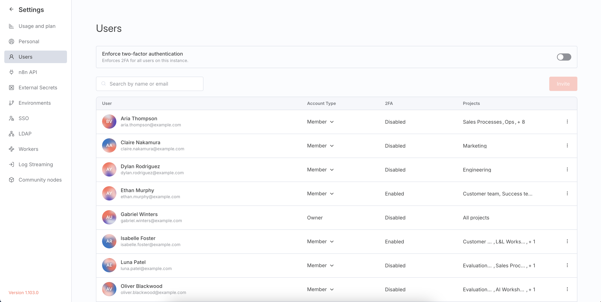
</figure>
<br>


### Webhook HTML responses <a href="#webhook-html-responses" id="webhook-html-responses"></a>

Starting with this release, if your workflow sends an HTML response to a webhook, n8n automatically wraps the content in an `<iframe>`. This is a security mechanism to protect the instance users.

This has the following implications:

- HTML renders in a sandboxed iframe instead of directly in the parent document.
- JavaScript code that attempts to access the top-level window or local storage will fail.
- Authentication headers aren't available in the sandboxed iframe (for example, basic auth). You need to use an alternative approach, like embedding a short-lived access token within the HTML.
- Relative URLs (for example, `<form action="/">`) won't work. Use absolute URLs instead.


### Built-in Metrics for AI Evaluations <a href="#built-in-metrics-for-ai-evaluations" id="built-in-metrics-for-ai-evaluations"></a>

Using evaluations is a best practice for any AI solution, and a must if reliability and predictability are business-critical. With this release, we’ve made it easier to set up evaluations in n8n by introducing a set of built-in metrics. These metrics can review AI responses and assign scores based on factors like correctness, helpfulness, and more.<br><br>


You can run regular evaluations and review scores over time as a way to monitor your AI workflow's performance. You can also compare results across different models to help guide model selection, or run evaluations before and after a prompt change to support data-driven, iterative building.
<br><br>
As with all evaluations in n8n, you’ll need a dataset that includes the inputs you want to test. For some evaluations, the dataset must also include expected outputs (ground truth) to compare against. The evaluation workflow runs each input through the portion you're testing to generate a response. The built-in metric scores each response based on the aspect you're measuring, allowing you to compare results before and after changes or track trends over time in the Evaluations tab. <br><br>

You can still define your own custom metrics, but for common use cases, the built-in options make it much faster to implement. <br><br>

🛠️ **How to:** 

1. Set up your evaluation as described [here](https://app.gitbook.com/s/rPN1zU5jaYNvwH7RzxqA/integrate-ai/test-and-improve-ai-workflows/use-metrics-to-measure-quality#how-it-works), using an **Evaluation** node as the trigger and another with the **Set Metrics** operation.
2. In the **Set Metrics** node, choose a metric from the dropdown list.
3. Define any additional parameters required for your selected metric. In most cases, this includes mapping the dataset columns to the appropriate fields.

📏 **Available built-in metrics:**

- **Correctness (AI-based):** Compares AI workflow-generated responses to expected answers. Another LLM acts as a judge, scoring the responses based on guidance you provide in the prompt.
- **Helpfulness (AI-based):** Evaluates how helpful a response is in relation to a user query, using an LLM and prompt-defined scoring criteria.
- **String Similarity:** Measures how closely the response matches the expected output by comparing strings. Useful for command generation or when output needs to follow a specific structure.
- **Categorization:** Checks whether a response matches an expected label, such as assigning items to the correct category.
- **Tools Used:** Verifies whether the AI agent called the tools you specified in your dataset. 
To enable this, make sure **Return Intermediate Steps** is turned on in your agent so the evaluation can access the tools it actually called.

🧠 Keep in mind

- Registered Community Edition enables analysis of one evaluation in the **Evaluations** tab which allows easy comparison of evaluation runs over time. Pro and Enterprise plans allow unlimited evaluations in the **Evaluations** tab.

<br>
<figure>
    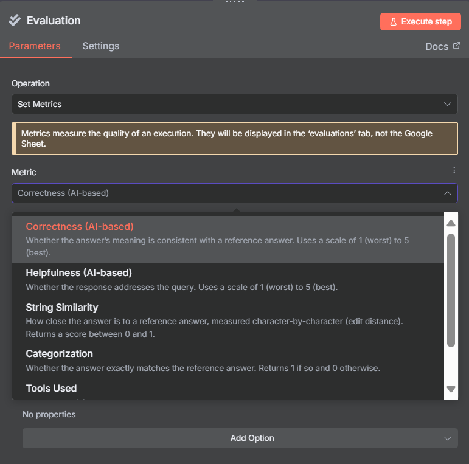
    <figcaption>Built-in Metrics</figcaption>
</figure>
<br>

[Learn more](https://app.gitbook.com/s/rPN1zU5jaYNvwH7RzxqA/integrate-ai/test-and-improve-ai-workflows/understand-why-to-test) about setting up and customizing evaluations.

 

### AI Agent Tool node <a href="#ai-agent-tool-node" id="ai-agent-tool-node"></a>

With the **AI Agent Tool** node we are introducing a simplified pattern for multi-agent orchestration that can be run in a single execution and stay entirely on one canvas. You can now connect multiple **AI Agent Tool** nodes to a primary **AI Agent** node, allowing it to supervise and delegate work across other specialized agents. 

This setup is especially useful for building complex systems that function like real-world teams, where a lead agent assigns parts of a task to specialists. You can even add multiple layers of agents directing other agents, just like you would have in a real multi-tiered organizational structure.  It also helps with prompt management by letting you split long, complex instructions into smaller, focused tasks across multiple agents. While similar orchestration was already possible using sub-workflows, AI Agent Tool nodes are a good choice when you want the interaction to happen within a single execution or prefer to manage and debug everything from a single canvas.

🛠️ **How to:**

- Add an **AI Agent** node to your workflow and click **+** to create a Tools connection.
- Search for and select the **AI Agent Tool** node from the Nodes Panel.
- Name the node clearly so the primary agent can reference it, then add a short description and prompt.
- Connect any LLMs, memory, and tools the agent needs to perform its role.
- Instruct the primary **AI Agent** on when to use the **AI Agent Tool** and to pass along relevant context in its prompt.

🧠 **Keep in mind:**

- The orchestrating agent does not pass full execution context by default. Any necessary context must be included in the prompt.

**AI Agent Tool** nodes makes it easier to build layered, agent-to-agent workflows without relying on sub-workflows, helping you move faster when building and debugging multi-agent systems.

<br>
<figure>
    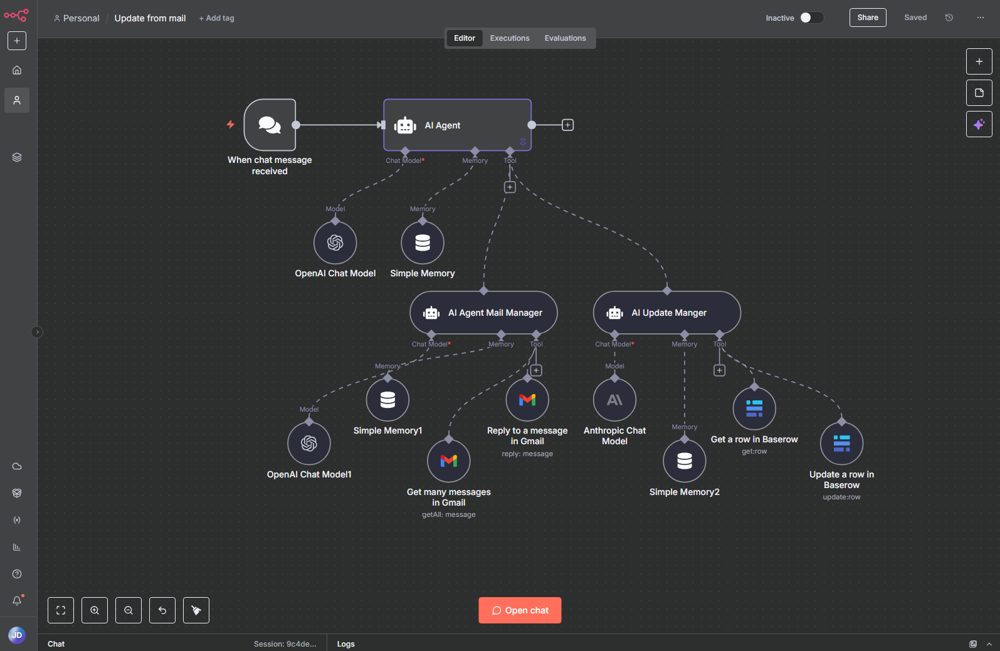
    <figcaption>AI Agent Tool node</figcaption>
</figure>
<br>

### Contributors <a href="#contributors" id="contributors"></a>

[ksg97031](https://github.com/ksg97031)  
[israelshenkar](https://github.com/israelshenkar)  

For full release details, refer to [Releases](https://github.com/n8n-io/n8n/releases) on GitHub.


## n8n@1.102.2 <a href="#n8n11022" id="n8n11022"></a>

View the [commits](https://github.com/n8n-io/n8n/compare/n8n@1.102.1...n8n@1.102.2) for this version.<br />
**Release date:** 2025-07-11


This release contains a bug fix.

For full release details, refer to [Releases](https://github.com/n8n-io/n8n/releases) on GitHub.

## n8n@1.101.2 <a href="#n8n11012" id="n8n11012"></a>

View the [commits](https://github.com/n8n-io/n8n/compare/n8n@1.101.1...n8n@1.101.2) for this version.<br />
**Release date:** 2025-07-11


This release contains a bug fix.

For full release details, refer to [Releases](https://github.com/n8n-io/n8n/releases) on GitHub.


## n8n@1.102.1 <a href="#n8n11021" id="n8n11021"></a>

View the [commits](https://github.com/n8n-io/n8n/compare/n8n@1.102.0...n8n@1.102.1) for this version.<br />
**Release date:** 2025-07-09


This release contains bug fixes.

For full release details, refer to [Releases](https://github.com/n8n-io/n8n/releases) on GitHub.


## n8n@1.102.0 <a href="#n8n11020" id="n8n11020"></a>

View the [commits](https://github.com/n8n-io/n8n/compare/n8n@1.101.0...n8n@1.102.0) for this version.<br />
**Release date:** 2025-07-07


This release contains core updates, editor improvements, new nodes, node updates, and bug fixes.

### Enforce 2FA across your instance <a href="#enforce-2fa-across-your-instance" id="enforce-2fa-across-your-instance"></a>

Enterprise Instance owners can now enforce two-factor authentication (2FA) for all users in their instance.

Once enabled, any user who hasn’t set up 2FA will be redirected to complete the setup before they can continue using n8n. This helps organizations meet internal security policies and ensures stronger protection across the workspace.

This feature is available only on the Enterprise plan.

### Contributors <a href="#contributors" id="contributors"></a>

[marty-sullivan](https://github.com/marty-sullivan)  
[cesars-gh](https://github.com/cesars-gh)  
[dudanogueira](https://github.com/dudanogueira)  

For full release details, refer to [Releases](https://github.com/n8n-io/n8n/releases) on GitHub.

## n8n@1.101.1 <a href="#n8n11011" id="n8n11011"></a>

View the [commits](https://github.com/n8n-io/n8n/compare/n8n@1.101.0...n8n@1.101.1) for this version.<br />
**Release date:** 2025-07-03


This release contains bug fixes.

For full release details, refer to [Releases](https://github.com/n8n-io/n8n/releases) on GitHub.


## n8n@1.101.0 <a href="#n8n11010" id="n8n11010"></a>

View the [commits](https://github.com/n8n-io/n8n/compare/n8n@1.100.0...n8n@1.101.0) for this version.<br />
**Release date:** 2025-06-30


This release contains core updates, editor improvements, node updates, and bug fixes.

### Contributors <a href="#contributors" id="contributors"></a>

[luka-mimi](https://github.com/luka-mimi)  

For full release details, refer to [Releases](https://github.com/n8n-io/n8n/releases) on GitHub.


## n8n@1.100.1 <a href="#n8n11001" id="n8n11001"></a>

View the [commits](https://github.com/n8n-io/n8n/compare/n8n@1.100.0...n8n@1.100.1) for this version.<br />
**Release date:** 2025-06-25


This release contains a bug fix.


For full release details, refer to [Releases](https://github.com/n8n-io/n8n/releases) on GitHub.


## n8n@1.100.0 <a href="#n8n11000" id="n8n11000"></a>

View the [commits](https://github.com/n8n-io/n8n/compare/n8n@1.99.0...n8n@1.100.0) for this version.<br />
**Release date:** 2025-06-23


This release contains core updates, editor improvements, a new node, node updates, and bug fixes.

### Model Selector node <a href="#model-selector-node" id="model-selector-node"></a>

The [Model Selector node](https://app.gitbook.com/s/BKcbOzIWja8NfqKDcqHc/builtin/cluster-nodes/sub-nodes/n8n-nodes-langchain.modelselector) gives you more control when working with multiple LLMs in your workflows.

Use it to determine which connected model should handle a given input, based on conditions like expressions or global variables. This makes it easier to implement model routing strategies, such as switching models based on performance, task type, cost, or availability.

🛠️ **How to:** Connect multiple model nodes to the Model Selector node, then configure routing conditions in the node’s settings.

🧠 **Keep in mind:** 

- Rules are evaluated in order. The first matching rule determines which model is used even if others would also match.
- As a sub-node, expressions behave differently here: they always resolves to the first item rather than resolving for each item in turn.

The Model Selector node is especially useful in evaluation or production scenarios where routing logic between models needs to adapt based on performance, cost, availability, or dataset-specific needs.

<br>
<figure>
    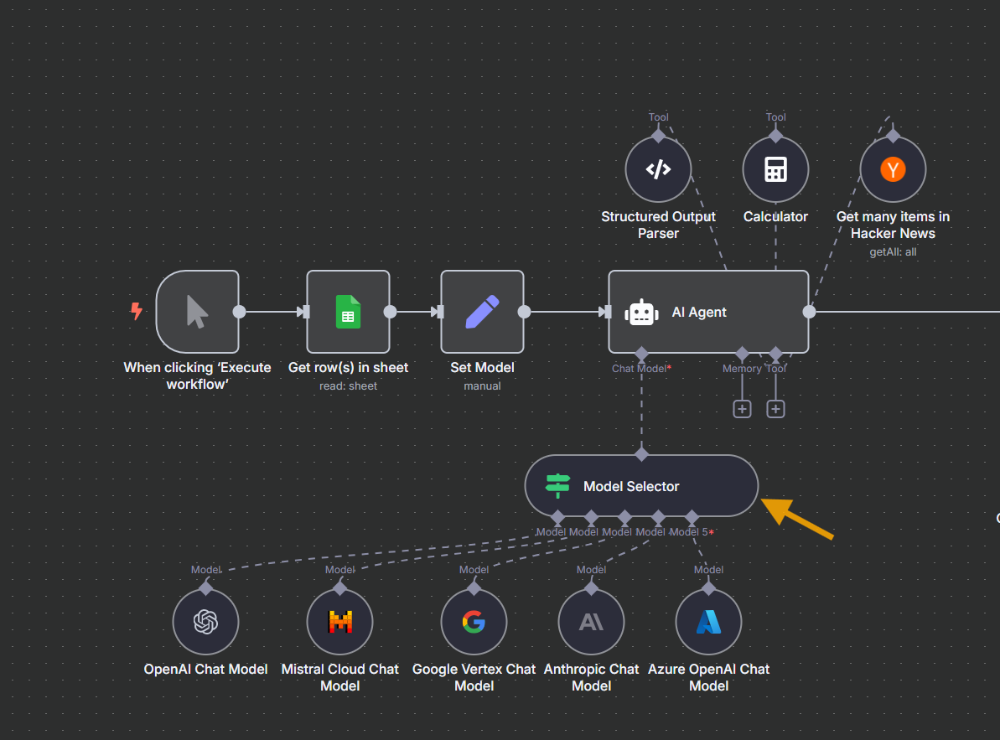
    <figcaption>Model Selector node</figcaption>
</figure>
<br>


### Support for OIDC (OpenID Connect) authentication <a href="#support-for-oidc-openid-connect-authentication" id="support-for-oidc-openid-connect-authentication"></a>

You can now use OIDC (OpenID Connect) as an authentication method for Single Sign-On (SSO).

This gives enterprise teams more flexibility to integrate n8n with their existing identity providers using a widely adopted and easy-to-manage standard. OIDC is now available alongside SAML, giving Enterprises the choice to select what best fits their internal needs.

### Project admins can now commit to Git within environments <a href="#project-admins-can-now-commit-to-git-within-environments" id="project-admins-can-now-commit-to-git-within-environments"></a>

Project admins now have the ability to commit workflow and credential changes directly to Git through the environments feature. This update streamlines the workflow deployment process by giving project-level admins direct control over committing their changes. It also ensures that the those who know their workflows best can review and commit updates themselves, without needing to involve instance-level admins.

[Learn more about source control environments](https://app.gitbook.com/s/wMJrGrimpx3PxCJpUswm/use-source-control-and-environments)


### Contributors <a href="#contributors" id="contributors"></a>

[aliou](https://github.com/aliou)  

For full release details, refer to [Releases](https://github.com/n8n-io/n8n/releases) on GitHub.


## n8n@1.99.1 <a href="#n8n1991" id="n8n1991"></a>

View the [commits](https://github.com/n8n-io/n8n/compare/n8n@1.99.0...n8n@1.99.1) for this version.<br />
**Release date:** 2025-06-19


This release contains bug fixes.

For full release details, refer to [Releases](https://github.com/n8n-io/n8n/releases) on GitHub.


## n8n@1.98.2 <a href="#n8n1982" id="n8n1982"></a>

View the [commits](https://github.com/n8n-io/n8n/compare/n8n@1.98.1...n8n@1.98.2) for this version.<br />
**Release date:** 2025-06-18


This release contains bug fixes.

For full release details, refer to [Releases](https://github.com/n8n-io/n8n/releases) on GitHub.


## n8n@1.99.0 <a href="#n8n1990" id="n8n1990"></a>

View the [commits](https://github.com/n8n-io/n8n/compare/n8n@1.98.0...n8n@1.99.0) for this version.<br />
**Release date:** 2025-06-16

This release contains performance improvements, core updates, editor changes, node updates, and bug fixes.

### Automatically name nodes <a href="#automatically-name-nodes" id="automatically-name-nodes"></a>

Default node names now update automatically based on the resource and operation selected, so you’ll always know what a node does at a glance.

This adds clarity to your canvas and saves time renaming nodes manually.

Don’t worry, automatic naming won’t break references. And, and if you’ve renamed a node yourself, we’ll leave it just the way you wrote it.

<br>
<video src="/_video/release-notes/automatic_node_naming.mp4" controls width="100%"></video>
<br>

### Support for RAG extended with built-in templates <a href="#support-for-rag-extended-with-built-in-templates" id="support-for-rag-extended-with-built-in-templates"></a>

Retrieval-Augmented Generation (RAG) can improve AI responses by providing language models access to data sources with up-to-date, domain-specific, or proprietary knowledge. RAG workflows typically rely on vector stores to manage and search this data efficiently.

To get the benefits of using vector stores, such as returning results based on semantic meaning rather than just keyword matches, you need a way to upload your data to the vector store and a way to query it. 

In n8n, uploading and querying vectors stores happens in two workflows. Now, you have an example to get your started and make implementation easier with the **RAG starter template**. 

- The **Load Data** workflow shows how to add data with the appropriate embedding model, split it into chunks with the [Default Data Loader](https://app.gitbook.com/s/BKcbOzIWja8NfqKDcqHc/builtin/cluster-nodes/sub-nodes/n8n-nodes-langchain.documentdefaultdataloader), and add metadata as desired.
- The **Retriever** workflow for querying data, shows how  agents and vector stores work together to help you define highly relevant results and save tokens using the **Question and Answer** tool.

Enable semantic search and the retrieval of unstructured data  for increased quality and relevance of AI responses. 

🛠️ **How to:** 

- Search for **RAG starter template** in the search bar of the Nodes panel to insert it into your workflow.

Learn more about implementing RAG in n8n [here](https://app.gitbook.com/s/rPN1zU5jaYNvwH7RzxqA/integrate-ai/understand-ai-components/retrieve-relevant-context).
<br>
<figure>
    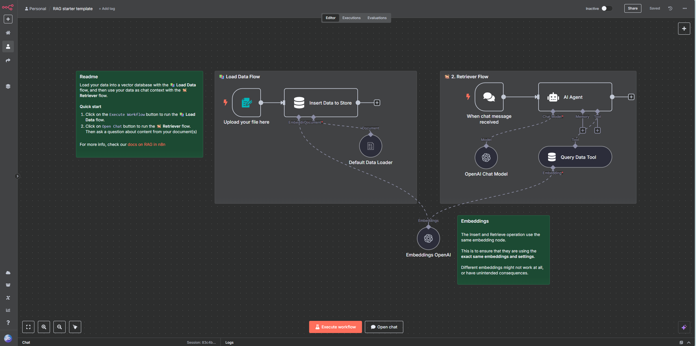
    <figcaption>RAG starter template</figcaption>
</figure>
<br>


For full release details, refer to [Releases](https://github.com/n8n-io/n8n/releases) on GitHub.

## n8n@1.98.1 <a href="#n8n1981" id="n8n1981"></a>

View the [commits](https://github.com/n8n-io/n8n/compare/n8n@1.98.0...n8n@1.98.1) for this version.<br />
**Release date:** 2025-06-12


This release contains a bug fix.

For full release details, refer to [Releases](https://github.com/n8n-io/n8n/releases) on GitHub.


## n8n@1.98.0 <a href="#n8n1980" id="n8n1980"></a>

View the [commits](https://github.com/n8n-io/n8n/compare/n8n@1.97.0...n8n@1.98.0) for this version.<br />
**Release date:** 2025-06-11


This release contains performance improvements, core updates, editor changes, node updates, a new node, and bug fixes.

### Contributors <a href="#contributors" id="contributors"></a>

[luka-mimi](https://github.com/luka-mimi)  
[Alexandero89](https://github.com/Alexandero89)  
[khoazero123](https://github.com/khoazero123)  

For full release details, refer to [Releases](https://github.com/n8n-io/n8n/releases) on GitHub.


## n8n@1.97.1 <a href="#n8n1971" id="n8n1971"></a>

View the [commits](https://github.com/n8n-io/n8n/compare/n8n@1.97.0...n8n@1.97.1) for this version.<br />
**Release date:** 2025-06-04


This release contains backports.

For full release details, refer to [Releases](https://github.com/n8n-io/n8n/releases) on GitHub.

## n8n@1.95.3 <a href="#n8n1953" id="n8n1953"></a>

View the [commits](https://github.com/n8n-io/n8n/compare/n8n@1.95.2...n8n@1.95.3) for this version.<br />
**Release date:** 2025-06-03


This release contains a bug fix.

For full release details, refer to [Releases](https://github.com/n8n-io/n8n/releases) on GitHub.

## n8n@1.97.0 <a href="#n8n1970" id="n8n1970"></a>

View the [commits](https://github.com/n8n-io/n8n/compare/n8n@1.96.0...n8n@1.97.0) for this version.<br />
**Release date:** 2025-06-02

This release contains new features, performance improvements and bug fixes.

### Convert to sub-workflow <a href="#convert-to-sub-workflow" id="convert-to-sub-workflow"></a>

Large, monolithic workflows can slow things down. They’re harder to maintain, tougher to debug, and more difficult to scale. With sub-workflows, you can take a more modular approach, breaking up big workflows into smaller, manageable parts that are easier to reuse, test, understand, and explain.

Until now, creating sub-workflows required copying and pasting nodes manually, setting up a new workflow from scratch, and reconnecting everything by hand. **Convert to sub-workflow** allows you to simplify this process into a single action, so you can spend more time building and less time restructuring.

<br>
<video src="/_video/release-notes/convert_to_sub-workflow.mp4" controls width="100%"></video>
<br>

**How it works**

1. Highlight the nodes you want to convert to a sub-workflow. These must:
    - Be fully connected, meaning no missing steps in between them
    - Start from a single starting node
    - End with a single node
2. Right-click to open the context menu and select **Convert to sub-workflow**
    - Or use the shortcut: `Alt + X`
3. n8n will:
    - Open a new tab containing the selected nodes
    - Preserve all node parameters as-is
    - Replace the selected nodes in the original workflow with a **Call My Sub-workflow** node

*Note*: You will need to manually adjust the field types in the Start and Return nodes in the new sub-workflow.

This makes it easier to keep workflows modular, performant, and easier to maintain.

Learn more about [sub-workflows](https://app.gitbook.com/s/rPN1zU5jaYNvwH7RzxqA/flow-logic/break-workflows-into-smaller-parts).

This release contains performance improvements and bug fixes.


### Contributors <a href="#contributors" id="contributors"></a>

[maatthc](https://github.com/maatthc)  

For full release details, refer to [Releases](https://github.com/n8n-io/n8n/releases) on GitHub.

## n8n@1.96.0 <a href="#n8n1960" id="n8n1960"></a>

View the [commits](https://github.com/n8n-io/n8n/compare/n8n@1.95.0...n8n@1.96.0) for this version.<br />
**Release date:** 2025-06-02


**Build failure**

This release failed to build. Please use `1.97.0` instead.


This release contains API updates, core changes, editor improvements, node updates, and bug fixes.

### API support for assigning users to projects <a href="#api-support-for-assigning-users-to-projects" id="api-support-for-assigning-users-to-projects"></a>

You can now use the API to add and update users within projects. This includes:

- Assigning existing or pending users to a project with a specific role
- Updating a user’s role within a project
- Removing users from one or more projects

This update now allows you to use the API to add users to both the instance and specific projects, removing the need to manually assign them in the UI. 

### Add pending users to project member assignment <a href="#add-pending-users-to-project-member-assignment" id="add-pending-users-to-project-member-assignment"></a>

You can now add **pending users,** those who have been invited but haven't completed sign-up, to projects as members.

This change lets you configure a user's project access upfront, without waiting for them to finish setting up their account. It eliminates the back-and-forth of managing access post-sign-up, ensuring users have the right project roles immediately upon joining.

### Contributors <a href="#contributors" id="contributors"></a>

[matthabermehl](https://github.com/matthabermehl)  
[Stamsy](https://github.com/Stamsy)  

For full release details, refer to [Releases](https://github.com/n8n-io/n8n/releases) on GitHub.

## n8n@1.95.2 <a href="#n8n1952" id="n8n1952"></a>

View the [commits](https://github.com/n8n-io/n8n/compare/n8n@1.95.1...n8n@1.95.2) for this version.<br />
**Release date:** 2025-05-29

This release contains bug fixes.

For full release details, refer to [Releases](https://github.com/n8n-io/n8n/releases) on GitHub.

## n8n@1.95.1 <a href="#n8n1951" id="n8n1951"></a>

View the [commits](https://github.com/n8n-io/n8n/compare/n8n@1.95.0...n8n@1.95.1) for this version.<br />
**Release date:** 2025-05-27

This release contains bug fixes.

For full release details, refer to [Releases](https://github.com/n8n-io/n8n/releases) on GitHub.

## n8n@1.94.1 <a href="#n8n1941" id="n8n1941"></a>

View the [commits](https://github.com/n8n-io/n8n/compare/n8n@1.94.0...n8n@1.94.1) for this version.<br />
**Release date:** 2025-05-27

This release contains bug fixes.

For full release details, refer to [Releases](https://github.com/n8n-io/n8n/releases) on GitHub.

## n8n@1.95.0 <a href="#n8n1950" id="n8n1950"></a>

View the [commits](https://github.com/n8n-io/n8n/compare/n8n@1.94.0...n8n@1.95.0) for this version.<br />
**Release date:** 2025-05-26

This release contains core updates, editor improvements, node updates, and bug fixes.


### Evaluations for AI workflows <a href="#evaluations-for-ai-workflows" id="evaluations-for-ai-workflows"></a>

We’ve added a feature to help you iterate, test, and compare changes to your AI automations before pushing them to production so you can achieve more predictability and make better decisions.<br><br>

When you're building with AI, a small prompt tweak or model swap might improve results with some inputs, while quietly degrading performance with others. But without a way to evaluate performance across many inputs, you’re left guessing whether your AI is actually getting better when you make a change.  <br><br>

By implementing **Evaluations for AI workflows** in n8n, you can assess how your AI performs across a range of inputs by adding a dedicated path in your workflow for running test cases and applying custom metrics to track results. This helps you build viable proof-of-concepts quickly, iterate more effectively, catch regressions early, and make more confident decisions when your AI is in production.<br><br>




<br><br>

#### Evaluation node and tab <a href="#evaluation-node-and-tab" id="evaluation-node-and-tab"></a>

The **Evaluation node** includes several operations that, when used together, enable end-to-end AI evaluation.

<br> 
<figure>
    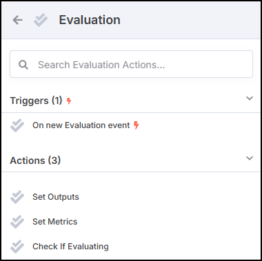
    <figcaption>Evaluation node</figcaption>
</figure>
<br>

Use this node to:

- Run your AI logic against a wide range of test cases in the same execution
- Capture the outputs of those test cases
- Score the results using your own metrics or LLM-as-judge logic
- Isolate a testing path to only include the nodes and logic you want to evaluate <br>

The **Evaluations tab** enables you to review test results in the n8n UI, perfect for comparing runs, spotting regressions, and viewing performance over time.
<br><br>

#### 🛠 How evaluations work <a href="#how-evaluations-work" id="how-evaluations-work"></a>

The evaluation path runs alongside your normal execution logic and only activates when you want—making it ideal for testing and iteration. <br><br>

Get started by selecting an AI workflow you want to evaluate that includes one or more LLM or Agent nodes. <br>

1. Add an **Evaluation** node with the **On new Evaluation event** operation. This node will act as an additional trigger you’ll run only when testing. Configure it to read your dataset from Google Sheets, with each row representing a test input.<br>

    > 💡  Better datasets mean better evaluations. Craft your dataset from a variety of test cases, including edge cases and typical inputs, to get meaningful feedback on how your AI performs. Learn more and access sample datasets [here](https://app.gitbook.com/s/rPN1zU5jaYNvwH7RzxqA/integrate-ai/test-and-improve-ai-workflows/run-quick-evaluations#1-create-a-dataset).

2. Add a second **Evaluation** node using the **Set Outputs** operation after the part of the workflow you're testing—typically after an LLM or Agent node. This captures the response and writes it back to your dataset in Google Sheets.
3. To evaluate output quality, add a third **Evaluation** node with the **Set Metrics** operation at a point after you’ve generated the outputs. You can develop workflow logic, custom calculations, or add an LLM-as-Judge to score the outputs. Map these metrics to your dataset in the node’s parameters. <br>

    > 💡 Well-defined metrics = smarter decisions. Scoring your outputs based on similarity, correctness, or categorization can help you track whether changes are actually improving performance. Learn more and get links to example templates [here](https://app.gitbook.com/s/rPN1zU5jaYNvwH7RzxqA/integrate-ai/test-and-improve-ai-workflows/use-metrics-to-measure-quality#2-add-metrics-to-workflow). 
    
<br>

<figure>
    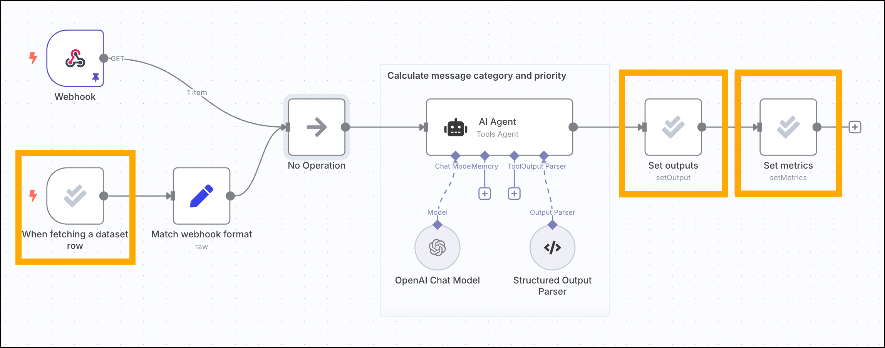
    <figcaption>Evaluation workflow</figcaption>
</figure>
<br>

When the Evaluation trigger node is executed, it runs each input in our dataset through your AI logic. This continues until all test cases are processed, a limit is reached, or you manually stop the execution. Once your evaluation path is set up, you can update your prompt, model, or workflow logic—and re-run the Evaluation trigger node to compare results. If you’ve added metrics, they’ll appear in the Evaluations tab. <br><br>

In some instances, you may want to isolate your testing path to make iteration faster or to avoid executing downstream logic.  In this case, you can add an Evaluation node with the `Check If Evaluating` operation to ensure only the expected nodes run when performing evaluations. <br><br>

#### Things to keep in mind <a href="#things-to-keep-in-mind" id="things-to-keep-in-mind"></a>

Evaluations for AI Workflows are designed to fit  into your development flow, with more enhancements on the way. For now, here are a few things to note:

- Test datasets are currently managed through Google Sheets. You’ll need a Google Sheets credential to run evaluations.
- Each workflow supports one evaluation at a time. If you’d like to test multiple segments, consider splitting them into sub-workflows for more flexibility.
- Community Edition supports one single evaluation. Pro and Enterprise plans allow unlimited evaluations.
- AI Evaluations are not enabled for instances in scaling mode at this time. <br>

You can find details, tips, and common troubleshooting info [here](https://app.gitbook.com/s/rPN1zU5jaYNvwH7RzxqA/integrate-ai/test-and-improve-ai-workflows/fix-common-issues). <br><br>

 👉 Learn more about the AI evaluation strategies and practical implementation techniques. [Watch now](https://www.youtube.com/live/QkciQpotQBQ?feature=shared).

 

### Contributors <a href="#contributors" id="contributors"></a>

[Phiph](https://github.com/Phiph)  
[cesars-gh](https://github.com/cesars-gh)  

For full release details, refer to [Releases](https://github.com/n8n-io/n8n/releases) on GitHub.

## n8n@1.94.0 <a href="#n8n1940" id="n8n1940"></a>

View the [commits](https://github.com/n8n-io/n8n/compare/n8n@1.93.0...n8n@1.94.0) for this version.<br />
**Release date:** 2025-05-19

This release contains editor improvements, an API update, node updates, new nodes, and bug fixes.


### Verified community nodes on Cloud <a href="#verified-community-nodes-on-cloud" id="verified-community-nodes-on-cloud"></a>

We’ve expanded the n8n ecosystem and unlocked a new level of flexibility for all users including those on n8n Cloud! Now you can access a select set of community nodes and partner integrations without leaving the canvas. This means you install and automate with a wider range of integrations without leaving your workspace. The power of the community is now built-in.

This update focuses on three major improvements:

- **Cloud availability**: Community nodes are no longer just for self-hosted users. A select set of nodes is now available on n8n Cloud.
- **Built-in discovery**: You can find and explore these nodes right from the Nodes panel without leaving the editor or searching on npm.
- **Trust and verification**: Nodes that appear in the editor have been manually vetted for quality and security. These verified nodes are marked with a checkmark.

We’re starting with a selection of around 25 nodes, including some of the most-used community-built packages and partner-supported integrations. For this phase, we focused on nodes that don’t include external package dependencies - helping streamline the review process and ensure a smooth rollout.
<br>
<br>

This is just the start. We plan to expand the library gradually, bringing even more verified nodes into the editor along with the powerful and creative use cases they unlock. In time, our criteria will evolve, opening the door to a wider range of contributions while keeping quality and security in focus.
<br>
<br>

Learn more about this update and find out which nodes are already installable from the editor in our [blog](https://blog.n8n.io/community-nodes-available-on-n8n-cloud/) post. 

<br>

 💻 **Use a verified node**

Make sure you're on **n8n version 1.94.0** or later and the instance Owner has enabled verified community nodes. On Cloud, this can be done from the Admin Panel. For self-hosted instances, please refer to [documentation](https://app.gitbook.com/s/jm0ZYRpZIPWge2ZSiDYO/host-n8n/configure-n8n/basic-configuration/use-environment-variables/nodes). In both cases, verified nodes are enabled by default.

- Open the **Nodes panel** from the editor
- Search for the Node. Verified nodes are indicated by a shield 🛡️
- Select the node and click **Install**

<br>
<video src="/_video/release-notes/Community-nodes-node-panel.mp4" controls width="100%"></video>
<br>

Once an Owner installs a node, everyone on the instance can start using it—just drag, drop, and connect like any other node in your workflow.

<br>

🛠️ **Build a node and get it verified**

Want your node to be verified and discoverable from the editor? Here’s how to get involved:

1. Review the [community node verification guidelines](https://app.gitbook.com/s/r7wKI4I1BgdBCuq5Cvcx/create-nodes/build-your-node/reference/verification-guidelines).
2. If you’re building something new, follow the recommendations for [creating nodes](https://app.gitbook.com/s/r7wKI4I1BgdBCuq5Cvcx/create-nodes/overview).
3. Check your design against the [UX guidelines](https://app.gitbook.com/s/r7wKI4I1BgdBCuq5Cvcx/create-nodes/build-your-node/reference/ux-guidelines).
4. [Submit your node](https://app.gitbook.com/s/r7wKI4I1BgdBCuq5Cvcx/create-nodes/deploy-your-node/submit-community-nodes) to npm.
5. Request verification by filling out [this form](https://internal.users.n8n.cloud/form/f0ff9304-f34a-420e-99da-6103a2f8ac5b).

<br>

**Already built a node? Raise your hand!**

If you’ve already published a community node and want it considered for verification, make sure it meets the requirements noted above, then let us know by submitting the interest [form](https://internal.users.n8n.cloud/form/f0ff9304-f34a-420e-99da-6103a2f8ac5b). We’re actively curating the next batch and would love to include your work.

 


### Extended logs view <a href="#extended-logs-view" id="extended-logs-view"></a>

When workflows get complex, debugging can get... clicky. That’s where an extended **Logs View** comes in. Now you can get a clearer path to trace executions, troubleshoot issues, and understand the behavior of a complete workflow — without bouncing between node detail views. 

This update brings a unified, always-accessible panel to the bottom of the canvas, showing you each step of the execution as it happens. Whether you're working with loops, sub-workflows, or AI agents, you’ll see a structured view of everything that ran, in the order it ran—with input, output, and status info right where you need it.

You can jump into node details when you want to dig deeper, or follow a single item through every step it touched. Real-time highlighting shows you which nodes are currently running or have failed, and you’ll see total execution time for any workflow—plus token usage for AI workflows to help monitor performance. And if you're debugging across multiple screens? Just pop the logs out and drag them wherever you’d like.

⚙️**What it does**

- Adds a **Logs view** to the bottom of the canvas that can be opened or collapsed. (Chat also appears here if your workflow uses it).
- Displays a **hierarchical list of nodes** in the order they were executed—including expanded views of sub-workflows.
- Allows you to **click a node in hierarchy** to preview inputs and outputs directly, or jump into the full Node Details view with a link.
- Provides ability to **toggle** input and output data on and off.
- Highlights each node **live as it runs**, showing when it starts, completes, or fails.
- Includes **execution history** view to explore past execution data in a similar way.
- Shows **roll-up stats** like total execution time and total AI tokens used (for AI-enabled workflows).
- Includes a  **“pop out”** button to open the logs as a floating window—perfect for dragging to another screen while debugging.

🛠️**How to**

To access the expanded logs view, click on the Logs bar at the bottom of the canvas. The view is also opens up when you open the chat window on the bottom of the page.

### Contributors <a href="#contributors" id="contributors"></a>

[Stamsy](https://github.com/Stamsy)  
[feelgood-interface](https://github.com/feelgood-interface)  

For full release details, refer to [Releases](https://github.com/n8n-io/n8n/releases) on GitHub.

## n8n@1.93.0 <a href="#n8n1930" id="n8n1930"></a>

View the [commits](https://github.com/n8n-io/n8n/compare/n8n@1.92.0...n8n@1.93.0) for this version.<br />
**Release date:** 2025-05-12

This release contains core updates, editor improvements, new nodes, node updates, and bug fixes.

### Faster ways to open sub-workflows <a href="#faster-ways-to-open-sub-workflows" id="faster-ways-to-open-sub-workflows"></a>

We’ve added several new ways to navigate your multi-workflow automations faster.

From any workflow with a sub-workflow node:

🖱️ Right-click on a sub-workflow node and select `Open sub-workflow` from the context menu

⌨️ Keyboard shortcuts

- **Windows:** `CTRL + SHIFT + O` or `CTRL + Double Click`
- **Mac:** `CMD + SHIFT + O` or `CMD + Double Click`

These options will bring your sub-workflow up in a new tab.

### Archive workflows <a href="#archive-workflows" id="archive-workflows"></a>

If you’ve ever accidentally removed a workflow, you’ll appreciate the new archiving feature. Instead of permanently deleting workflows with the Remove action, workflows are now archived by default. This allows you to recover them if needed.

**How to:**

- **Archive a workflow** - Select **Archive** from the Editor UI menu. It has replaced the **Remove** action.
- **Find archived workflows** - Archived workflows are hidden by default. To find your archived workflows, select the option for **Show archived workflows** in the workflow filter menu.
- **Permanently delete a workflow** - Once a workflow is archived, you can **Delete** it from the  options menu.
- **Recover a workflow** - Select **Unarchive** from the options menu.

**Keep in mind:** 

- Workflows archival requires the same permissions as required previously for removal.
- You cannot select archived workflows as sub-workflows to execute
- Active workflows are deactivated when they are archived
- Archived workflows can not be edited

### Contributors <a href="#contributors" id="contributors"></a>

[LeaDevelop](https://github.com/LeaDevelop)  
[ayhandoslu](https://github.com/ayhandoslu)  
[valentina98](https://github.com/valentina98)  

For full release details, refer to [Releases](https://github.com/n8n-io/n8n/releases) on GitHub.

## n8n@1.92.2 <a href="#n8n1922" id="n8n1922"></a>

View the [commits](https://github.com/n8n-io/n8n/compare/n8n@1.92.1...n8n@1.92.2) for this version.<br />
**Release date:** 2025-05-08

This release contains a bug fix.

For full release details, refer to [Releases](https://github.com/n8n-io/n8n/releases) on GitHub.

## n8n@1.91.3 <a href="#n8n1913" id="n8n1913"></a>

View the [commits](https://github.com/n8n-io/n8n/compare/n8n@1.91.2...n8n@1.91.3) for this version.<br />
**Release date:** 2025-05-08

This release contains a bug fix.

For full release details, refer to [Releases](https://github.com/n8n-io/n8n/releases) on GitHub.

## n8n@1.92.1 <a href="#n8n1921" id="n8n1921"></a>

View the [commits](https://github.com/n8n-io/n8n/compare/n8n@1.92.0...n8n@1.92.1) for this version.<br />
**Release date:** 2025-05-06

This release contains a bug fix.

For full release details, refer to [Releases](https://github.com/n8n-io/n8n/releases) on GitHub.

## n8n@1.92.0 <a href="#n8n1920" id="n8n1920"></a>

View the [commits](https://github.com/n8n-io/n8n/compare/n8n@1.91.0...n8n@1.92.0) for this version.<br />
**Release date:** 2025-05-05

This release contains core updates, editor improvements, node updates, and bug fixes.

### Partial Execution for AI Tools <a href="#partial-execution-for-ai-tools" id="partial-execution-for-ai-tools"></a>

We’ve made it easier to build and iterate on AI agents in n8n. You can now run and test specific tools without having to execute the entire agent workflow.

Partial execution is especially useful when refining or troubleshooting parts of your agent logic. It allows you to test changes incrementally, without triggering full agent runs, reducing unnecessary AI calls, token usage, and downstream activity. This makes iteration faster, more cost-efficient, and more precise when working with complex or multi-step AI workflows.

Partial execution for AI tools is available now for all tools - making it even easier to build, test, and fine-tune AI agents in n8n.

<br>
<video src="/_video/release-notes/AI-agent-partial-execution.mp4" controls width="100%"></video>
<br>

**How to:**

To use this feature you can either:

- Click the **Play** button on the tool you want to execute directly from the canvas view.
- Open the tool’s **Node Details View** and select **"Execute Step"** to run it from there.

If you have previously run the workflow, the input and output will be prefilled with data from the last execution. A pop-up form will open where you can manually fill in the parameters before executing your test.

### Extended logs view <a href="#extended-logs-view" id="extended-logs-view"></a>

When workflows get complex, debugging can get... clicky. That’s where an extended **Logs View** comes in. Now you can get a clearer path to trace executions, troubleshoot issues, and understand the behavior of a complete workflow — without bouncing between node detail views. 

This update brings a unified, always-accessible panel to the bottom of the canvas, showing you each step of the execution as it happens. Whether you're working with loops, sub-workflows, or AI agents, you’ll see a structured view of everything that ran, in the order it ran—with input, output, and status info right where you need it.

You can jump into node details when you want to dig deeper, or follow a single item through every step it touched. Real-time highlighting shows you which nodes are currently running or have failed, and you’ll see total execution time for any workflow—plus token usage for AI workflows to help monitor performance. And if you're debugging across multiple screens? Just pop the logs out and drag them wherever you’d like.

⚙️**What it does**

- Adds a **Logs view** to the bottom of the canvas that can be opened or collapsed. (Chat also appears here if your workflow uses it).
- Displays a **hierarchical list of nodes** in the order they were executed—including expanded views of sub-workflows.
- Allows you to **click a node in hierarchy** to preview inputs and outputs directly, or jump into the full Node Details view with a link.
- Provides ability to **toggle** input and output data on and off.
- Highlights each node **live as it runs**, showing when it starts, completes, or fails.
- Includes **execution history** view to explore past execution data in a similar way.
- Shows **roll-up stats** like total execution time and total AI tokens used (for AI-enabled workflows).
- Includes a  **“pop out”** button to open the logs as a floating window—perfect for dragging to another screen while debugging.

🛠️**How to**

To access the expanded logs view, click on the Logs bar at the bottom of the canvas. The view is also opens up when you open the chat window on the bottom of the page.

### Insights enhancements for Enterprise <a href="#insights-enhancements-for-enterprise" id="insights-enhancements-for-enterprise"></a>

Two weeks after the launch of [Insights](https://app.gitbook.com/s/wMJrGrimpx3PxCJpUswm/observe-and-log/track-usage-with-insights), we’re releasing some enhancements designed for enterprise users.

- **Expanded time ranges**. You can now filter insights over a variety of time periods, from the last 24 hours up to 1 year. Pro users are limited to 7 day and 14 day views.  
- **Hourly granularity**. Drill down into the last 24 hours of production executions with hourly granularity, making it easier to analyze workflows and quickly identify issues.  

These updates provide deeper visibility into workflow history, helping you uncover trends over longer periods and detect problems sooner with more precise reporting.

<br> 
<figure>
    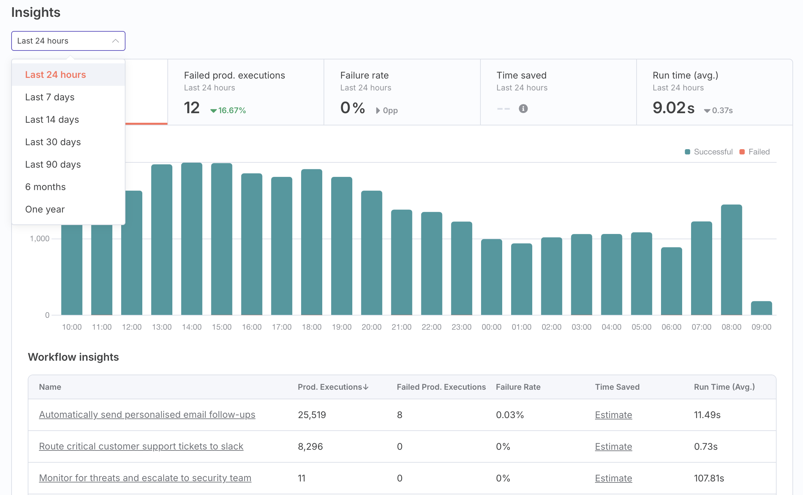
    <figcaption>Filter insights</figcaption>
</figure>
<br>

### Contributors <a href="#contributors" id="contributors"></a>

[Stamsy](https://github.com/Stamsy)  

For full release details, refer to [Releases](https://github.com/n8n-io/n8n/releases) on GitHub.

## n8n@1.91.2 <a href="#n8n1912" id="n8n1912"></a>

View the [commits](https://github.com/n8n-io/n8n/compare/n8n@1.91.1...n8n@1.91.2) for this version.<br />
**Release date:** 2025-05-05

This release contains a bug fix.

For full release details, refer to [Releases](https://github.com/n8n-io/n8n/releases) on GitHub.

## n8n@1.90.3 <a href="#n8n1903" id="n8n1903"></a>

View the [commits](https://github.com/n8n-io/n8n/compare/n8n@1.90.2...n8n@1.90.3) for this version.<br />
**Release date:** 2025-05-05

This release contains a bug fix.

For full release details, refer to [Releases](https://github.com/n8n-io/n8n/releases) on GitHub.

## n8n@1.91.1 <a href="#n8n1911" id="n8n1911"></a>

View the [commits](https://github.com/n8n-io/n8n/compare/n8n@1.91.0...n8n@1.91.1) for this version.<br />
**Release date:** 2025-05-01

This release contains bug fixes.

For full release details, refer to [Releases](https://github.com/n8n-io/n8n/releases) on GitHub.

## n8n@1.91.0 <a href="#n8n1910" id="n8n1910"></a>

View the [commits](https://github.com/n8n-io/n8n/compare/n8n@1.90.0...n8n@1.91.0) for this version.<br />
**Release date:** 2025-04-28

This release contains core updates, editor improvements, node updates, and bug fixes.

### Breadcrumb view from the canvas <a href="#breadcrumb-view-from-the-canvas" id="breadcrumb-view-from-the-canvas"></a>

We’ve added **breadcrumb navigation directly on the canvas**, so you can quickly navigate to any of a workflow’s parent folders right from the canvas.

For full release details, refer to [Releases](https://github.com/n8n-io/n8n/releases) on GitHub.

## n8n@1.90.2 <a href="#n8n1902" id="n8n1902"></a>

View the [commits](https://github.com/n8n-io/n8n/compare/n8n@1.90.1...n8n@1.90.2) for this version.<br />
**Release date:** 2025-04-25

This release contains a bug fix.

For full release details, refer to [Releases](https://github.com/n8n-io/n8n/releases) on GitHub.

## n8n@1.90.1 <a href="#n8n1901" id="n8n1901"></a>

View the [commits](https://github.com/n8n-io/n8n/compare/n8n@1.90.0...n8n@1.90.1) for this version.<br />
**Release date:** 2025-04-22

This release contains a bug fix.

For full release details, refer to [Releases](https://github.com/n8n-io/n8n/releases) on GitHub.

## n8n@1.90.0 <a href="#n8n1900" id="n8n1900"></a>

View the [commits](https://github.com/n8n-io/n8n/compare/n8n@1.89.0...n8n@1.90.0) for this version.<br />
**Release date:** 2025-04-22

This release contains core updates, editor updates, node updates, performance improvements, and bug fixes.

### Extended HTTP Request tool functionality <a href="#extended-http-request-tool-functionality" id="extended-http-request-tool-functionality"></a>
We’ve brought the full power of the HTTP Request node to the HTTP Request tool in AI workflows. That means your AI Agents now have access to all the advanced configuration options—like Pagination, Batching, Timeout, Redirects, Proxy support, and even cURL import.

<br>
<video src="/_video/release-notes/http-request-tool.mp4" controls width="100%"></video>
<br>

This update also includes support for the `$fromAI` function to dynamically generate the right parameters based on the context of your prompt — making API calls smarter, faster, and more flexible than ever.

**How to:**

- Open your AI Agent node in the canvas.
- Click the **‘+’ icon** to add a new tool connection.
- In the **Tools panel**, select HTTP **Request Tool.**
- Configure it just like you would a regular **HTTP Request node** — including advanced options

👉 Learn more about configuring the [HTTP Request tool](https://app.gitbook.com/s/BKcbOzIWja8NfqKDcqHc/builtin/core-nodes/n8n-nodes-base.httprequest).


### Scoped API keys <a href="#scoped-api-keys" id="scoped-api-keys"></a>
Users on the Enterprise plan can now create API keys with specific scopes to control exactly what each key can access.

<figure>
    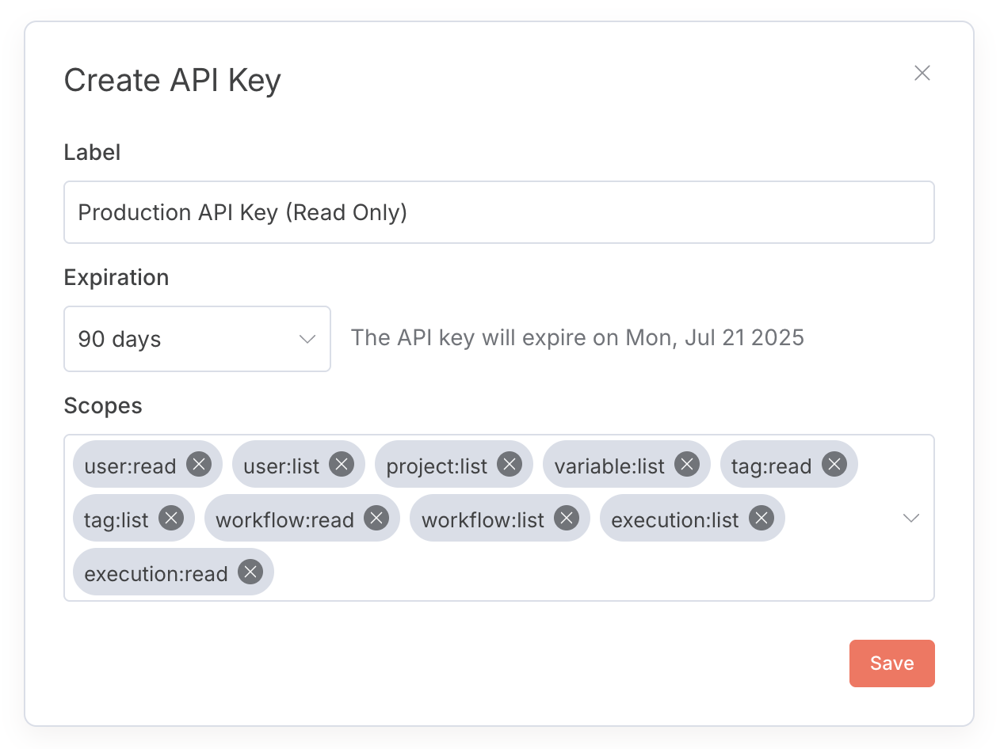
    <figcaption>Scoped API keys</figcaption>
</figure>

Previously, API keys had full read/write access across all endpoints. While sometimes necessary, this level of access can be excessive and too powerful for most use cases.  Scoped API keys allow you to limit access to only the resources and actions a service or user actually needs.

**What’s new**

When creating a new API key, you can now:

- Select whether the key has read, write, or both types of access.  
- Specify which resources the key can interact with.  

Supported scopes include:

- Variables — list, create, delete  
- Security audit — generate reports  
- Projects — list, create, update, delete  
- Executions — list, read, delete  
- Credentials — list, create, update, delete, move  
- Workflows — list, create, update, delete, move, add/remove tags  

Scoped API keys give you more control and security. You can limit access to only what’s needed, making it safer to work with third parties and easier to manage internal API usage.

### Drag and Drop in Folders <a href="#drag-and-drop-in-folders" id="drag-and-drop-in-folders"></a>

Folders just got friendlier. With this release, you can now **drag and drop workflows and folders** — making it even easier to keep things tidy.

Need to reorganize? Just select a workflow or folder and drag it into another folder or breadcrumb location. It’s a small change that makes a big difference when managing a growing collection of workflows.

<br>
<video src="/_video/release-notes/Drag-and-drop-folders.mp4" controls width="100%"></video>
<br>

📁 Folders are available to all [registered](https://app.gitbook.com/s/jm0ZYRpZIPWge2ZSiDYO/host-n8n/community-edition-features#registered-community-edition) users—jump in and get your workspace in order!

### Contributors <a href="#contributors" id="contributors"></a>

[Zordrak](https://github.com/Zordrak)  

For full release details, refer to [Releases](https://github.com/n8n-io/n8n/releases) on GitHub.

## n8n@1.89.2 <a href="#n8n1892" id="n8n1892"></a>

View the [commits](https://github.com/n8n-io/n8n/compare/n8n@1.89.1...n8n@1.89.2) for this version.<br />
**Release date:** 2025-04-16

This release contains a bug fix.

For full release details, refer to [Releases](https://github.com/n8n-io/n8n/releases) on GitHub.

## n8n@1.89.1 <a href="#n8n1891" id="n8n1891"></a>

View the [commits](https://github.com/n8n-io/n8n/compare/n8n@1.89.0...n8n@1.89.1) for this version.<br />
**Release date:** 2025-04-15

This release contains bug fixes.

For full release details, refer to [Releases](https://github.com/n8n-io/n8n/releases) on GitHub.

## n8n@1.89.0 <a href="#n8n1890" id="n8n1890"></a>

View the [commits](https://github.com/n8n-io/n8n/compare/n8n@1.88.0...n8n@1.89.0) for this version.<br />
**Release date:** 2025-04-14

This release contains API updates, core updates, editor updates, a new node, node updates, and bug fixes.


### Insights <a href="#insights" id="insights"></a>

We're rolling out [Insights](https://app.gitbook.com/s/wMJrGrimpx3PxCJpUswm/observe-and-log/track-usage-with-insights), a new dashboard to monitor how your workflows are performing over time. It's designed to give admins (and owners) better visibility of their most important workflow metrics and help troubleshoot potential issues and improvements. <br> 
<br>

In this first release, we’re introducing a summary banner, the insights dashboard, and time saved per execution. <br> <br>

#### 1. Summary banner <a href="#1-summary-banner" id="1-summary-banner"></a>
A new banner on the overview page that gives instance admins and owners a birds eye view of key metrics over the last 7 days.

<figure>
    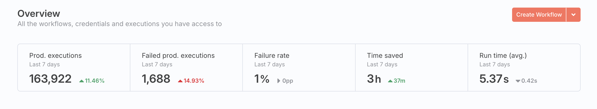
    <figcaption>Insights summary banner</figcaption>
</figure>

Available metrics:

- Total production executions
- Total failed executions
- Failure rate
- Average runtime of all workflows
- Estimated time saved

This overview is designed to help you stay on top of workflow activity at a glance. It is available for all plans and editions. <br> <br>

#### 2. Insights dashboard <a href="#2-insights-dashboard" id="2-insights-dashboard"></a>
On Pro and Enterprise plans, a new dashboard offers a deeper view into workflow performance and activity. 

<figure>
    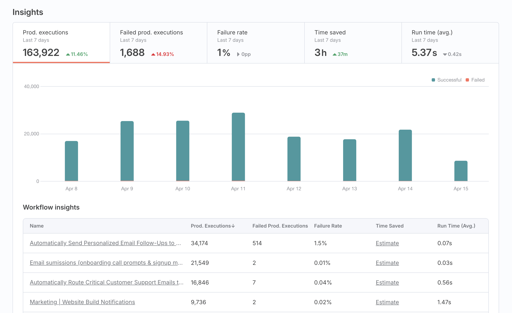
    <figcaption>Insights dashboard</figcaption>
</figure>

The dashboard includes:

- Total production executions over time, including a comparison of successful and failed executions
- Per-workflow breakdowns of key metrics
- Comparisons with previous periods to help spot changes in usage or behavior
- Runtime average and failure rate over time

#### 3. Time saved per execution <a href="#3-time-saved-per-execution" id="3-time-saved-per-execution"></a>
Within workflow settings, you can now assign a “time saved per execution” value to any workflow. This makes it possible to track the impact of your workflows and make it easier to share this visually with other teams and stakeholders.<br><br>

This is just the beginning for Insights: the next phase will introduce more advanced filtering and comparisons, custom date ranges, and additional monitoring capabilities.



### Node updates <a href="#node-updates" id="node-updates"></a>
- We added a credential check for the Salesforce node
- We added SearXNG as a tool for AI agents

You can now search within subfolders, making it easier to find workflows across all folder levels. Just type in the search bar and go. 

For full release details, refer to [Releases](https://github.com/n8n-io/n8n/releases) on GitHub.

## n8n@1.88.0 <a href="#n8n1880" id="n8n1880"></a>

View the [commits](https://github.com/n8n-io/n8n/compare/n8n@1.87.0...n8n@1.88.0) for this version.<br />
**Release date:** 2025-04-10

This release contains new features, new nodes, performance improvements, and bug fixes.


### Model Context Protocol (MCP) nodes <a href="#model-context-protocol-mcp-nodes" id="model-context-protocol-mcp-nodes"></a>
MCP aims to standardise how LLMs like Claude, ChatGPT, or Cursor can interact with tools or integrate data for their agents. Many providers - both established or new - are adopting MCP as a standard way to build agentic systems. It is an easy way to either expose your own app as a server, making capabilities available to a model as tools, or as a client that can call on tools outside of your own system. <br>

While it’s still early in the development process, we want to give you access to our new MCP nodes. This will help us understand your requirements better and will also let us converge on a great general solution quicker. <br>

We are adding two new nodes: 

- a MCP [Server Trigger](https://app.gitbook.com/s/BKcbOzIWja8NfqKDcqHc/builtin/core-nodes/n8n-nodes-langchain.mcptrigger) for any workflow  
- a MCP [Client Tool](https://app.gitbook.com/s/BKcbOzIWja8NfqKDcqHc/builtin/cluster-nodes/sub-nodes/n8n-nodes-langchain.toolmcp) for the AI Agent  

The MCP Server Trigger turns n8n into an MCP server, providing n8n tools to models running outside of n8n. You can run multiple MCP servers from your n8n instance. The MCP Client Tool connects LLMs - and other intelligent agents - to any MCP-enabled service through a single interface. <br>

Max from our DevRel team created an official walkthrough for you to get started: 

<br>

[](https://youtu.be/45WPU7P-1QQ?feature=shared)
<figure>
    <figcaption>[Studio Update #04](https://youtu.be/45WPU7P-1QQ?feature=shared)</figcaption>
</figure>


### MCP Server Trigger <a href="#mcp-server-trigger" id="mcp-server-trigger"></a>
The MCP Server Trigger turns n8n into an MCP server, providing n8n tools to models running outside of n8n. The node acts as an entry point into n8n for MCP clients. It operates by exposing a URL that MCP clients can interact with to access n8n tools. This means your n8n workflows and integrations are now available to models run elsewhere. Pretty neat. 

<figure>
    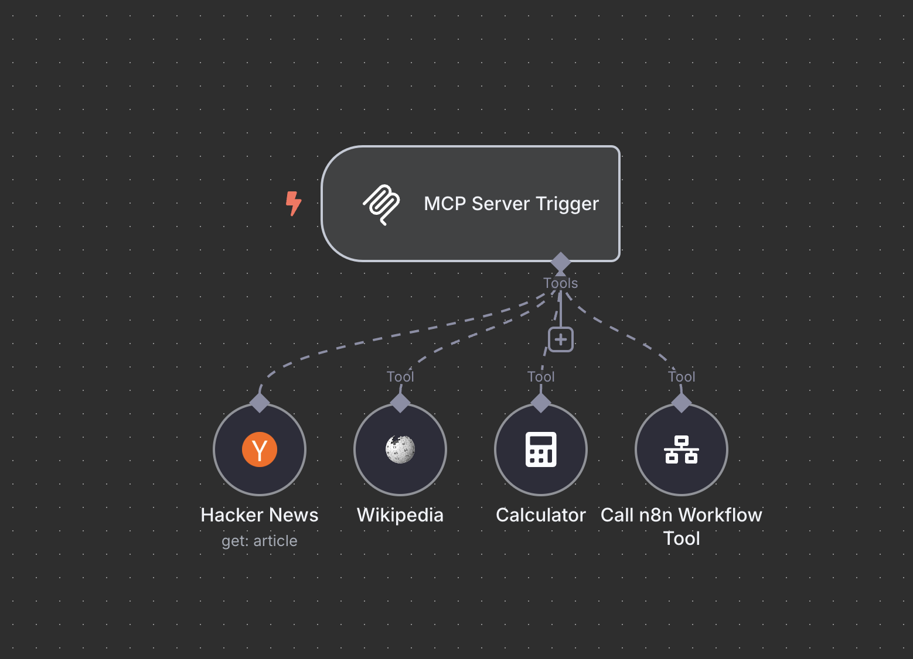
    <figcaption>MCP Server Trigger</figcaption>
</figure>

[Explore the MCP Server Trigger docs](https://app.gitbook.com/s/BKcbOzIWja8NfqKDcqHc/builtin/core-nodes/n8n-nodes-langchain.mcptrigger)

### MCP Client Tool <a href="#mcp-client-tool" id="mcp-client-tool"></a>
The MCP Client Tool node is a MCP client, allowing you to use the tools exposed by an external MCP server. You can connect the MCP Client Tool node to your models to call external tools with n8n agents. In this regard it is similar to using a n8n tool with your AI agent. One advantage is that the MCP Client Tool can access multiple tools on the MCP server at once, keeping your canvas cleaner and easier to understand. 

<figure>
    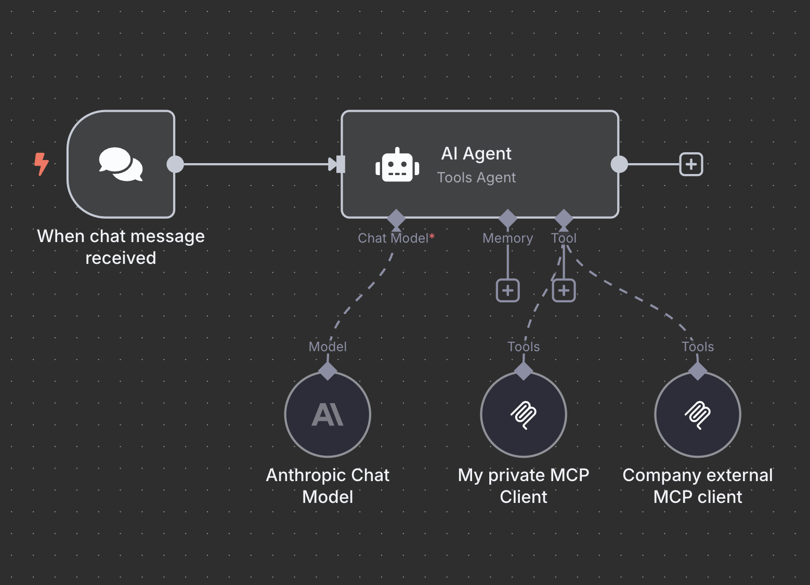
    <figcaption>MCP Client Tools</figcaption>
</figure>

[Explore the MCP Client Tool docs](https://app.gitbook.com/s/BKcbOzIWja8NfqKDcqHc/builtin/cluster-nodes/sub-nodes/n8n-nodes-langchain.toolmcp)



### Node updates <a href="#node-updates" id="node-updates"></a>

- Added a node for Azure Cosmos DB  
- Added a node for Milvus Vector Store  
- Updated the Email Trigger (IMAP) node  

### Contributors <a href="#contributors" id="contributors"></a>

[adina-hub](https://github.com/adina-hub)  
[umanamente](https://github.com/umanamente)  

For full release details, refer to [Releases](https://github.com/n8n-io/n8n/releases) on GitHub.

## n8n@1.87.2 <a href="#n8n1872" id="n8n1872"></a>

View the [commits](https://github.com/n8n-io/n8n/compare/n8n@1.87.1...n8n@1.87.2) for this version.<br />
**Release date:** 2025-04-09

This release contains bug fixes.

For full release details, refer to [Releases](https://github.com/n8n-io/n8n/releases) on GitHub.

## n8n@1.86.1 <a href="#n8n1861" id="n8n1861"></a>

View the [commits](https://github.com/n8n-io/n8n/compare/n8n@1.86.0...n8n@1.86.1) for this version.<br />
**Release date:** 2025-04-09

This release contains a bug fix.

For full release details, refer to [Releases](https://github.com/n8n-io/n8n/releases) on GitHub.

## n8n@1.87.1 <a href="#n8n1871" id="n8n1871"></a>

View the [commits](https://github.com/n8n-io/n8n/compare/n8n@1.87.0...n8n@1.87.1) for this version.<br />
**Release date:** 2025-04-08

This release contains bug fixes.

For full release details, refer to [Releases](https://github.com/n8n-io/n8n/releases) on GitHub.

## n8n@1.87.0 <a href="#n8n1870" id="n8n1870"></a>

View the [commits](https://github.com/n8n-io/n8n/compare/n8n@1.86.0...n8n@1.87.0) for this version.<br />
**Release date:** 2025-04-07

This release contains new nodes, node updates, API updates, core updates, editor updates, and bug fixes.

### Contributors <a href="#contributors" id="contributors"></a>

[cesars-gh](https://github.com/cesars-gh)  
[Stamsy](https://github.com/Stamsy)  
[Pash10g](https://github.com/Pash10g)  

For full release details, refer to [Releases](https://github.com/n8n-io/n8n/releases) on GitHub.

## n8n@1.86.0 <a href="#n8n1860" id="n8n1860"></a>

View the [commits](https://github.com/n8n-io/n8n/compare/n8n@1.85.0...n8n@1.86.0) for this version.<br />
**Release date:** 2025-03-31

This release contains API updates, core updates, editor improvements, node updates, and bug fixes.

### Contributors <a href="#contributors" id="contributors"></a>

[Aijeyomah](https://github.com/Aijeyomah)  
[ownerer](https://github.com/ownerer)  
[ulevitsky](https://github.com/ulevitsky)  

For full release details, refer to [Releases](https://github.com/n8n-io/n8n/releases) on GitHub.

## n8n@1.85.4 <a href="#n8n1854" id="n8n1854"></a>

View the [commits](https://github.com/n8n-io/n8n/compare/n8n@1.85.3...n8n@1.85.4) for this version.<br />
**Release date:** 2025-03-27

This release contains a bug fix.

For full release details, refer to [Releases](https://github.com/n8n-io/n8n/releases) on GitHub.

## n8n@1.84.3 <a href="#n8n1843" id="n8n1843"></a>

View the [commits](https://github.com/n8n-io/n8n/compare/n8n@1.84.2...n8n@1.84.3) for this version.<br />
**Release date:** 2025-03-27

This release contains a bug fix.

For full release details, refer to [Releases](https://github.com/n8n-io/n8n/releases) on GitHub.

## n8n@1.84.2 <a href="#n8n1842" id="n8n1842"></a>

View the [commits](https://github.com/n8n-io/n8n/compare/n8n@1.84.1...n8n@1.84.2) for this version.<br />
**Release date:** 2025-03-26

This release contains a bug fix.

For full release details, refer to [Releases](https://github.com/n8n-io/n8n/releases) on GitHub.

## n8n@1.85.3 <a href="#n8n1853" id="n8n1853"></a>

View the [commits](https://github.com/n8n-io/n8n/compare/n8n@1.85.2...n8n@1.85.3) for this version.<br />
**Release date:** 2025-03-26

This release contains a bug fix.

For full release details, refer to [Releases](https://github.com/n8n-io/n8n/releases) on GitHub.

## n8n@1.85.2 <a href="#n8n1852" id="n8n1852"></a>

View the [commits](https://github.com/n8n-io/n8n/compare/n8n@1.85.1...n8n@1.85.2) for this version.<br />
**Release date:** 2025-03-25

This release contains a bug fix.

For full release details, refer to [Releases](https://github.com/n8n-io/n8n/releases) on GitHub.

## n8n@1.85.1 <a href="#n8n1851" id="n8n1851"></a>

View the [commits](https://github.com/n8n-io/n8n/compare/n8n@1.85.0...n8n@1.85.1) for this version.<br />
**Release date:** 2025-03-25

This release contains bug fixes.

For full release details, refer to [Releases](https://github.com/n8n-io/n8n/releases) on GitHub.

## n8n@1.85.0 <a href="#n8n1850" id="n8n1850"></a>

View the [commits](https://github.com/n8n-io/n8n/compare/n8n@1.84.0...n8n@1.85.0) for this version.<br />
**Release date:** 2025-03-24

This release contains a new node, a new credential, core updates, editor updates, node updates, and bug fixes.

### Folders <a href="#folders" id="folders"></a>
What can we say about folders? Well, they’re super handy for categorizing just about everything and they’re finally available for your n8n workflows. Tidy up your workspace with unlimited folders and nested folders. Search for workflows within folders. It’s one of the ways we’re making it easier to organize your n8n instances more effectively.  

**How to use it:** 

Create and manage folders within your personal space or within projects. You can also create workflows from within a folder. You may need to restart your instance in order to activate folders.

<figure>
    
    <figcaption>It's a folder alright</figcaption>
</figure>
<br>

Folders are available for all [registered](https://app.gitbook.com/s/jm0ZYRpZIPWge2ZSiDYO/host-n8n/community-edition-features#registered-community-edition) users so get started with decluttering your workspace now and look for more features (like drag and drop) to organize your instances soon.

### Enhancements to Form Trigger Node <a href="#enhancements-to-form-trigger-node" id="enhancements-to-form-trigger-node"></a>

Recent updates to the Form Trigger node have made it a more powerful tool for building business solutions. These enhancements provide more flexibility and customization, enabling teams to create visually engaging and highly functional workflows with forms.

- **HTML customization:** Add custom HTML to forms, including embedded images and videos, for richer user experiences.  
- **Custom CSS support**: Apply custom styles to user-facing components to align forms with your brand’s look and feel. Adjust fonts, colors, and spacing for a seamless visual identity.
- **Form previews:** Your form’s description and title will pull into previews of your form when sharing on social media or messaging apps, providing a more polished look.  
- **Hidden fields:** Use query parameters to add hidden fields, allowing you to pass data—such as a referral source—without exposing it to the user.  
- **New responses options:** Respond to user submissions in multiple ways including text, HTML, or a downloadable file (binary format). This enables forms to display rich webpages or deliver digital assets such as dynamically generated invoices or personalized certificates.  

<figure>
    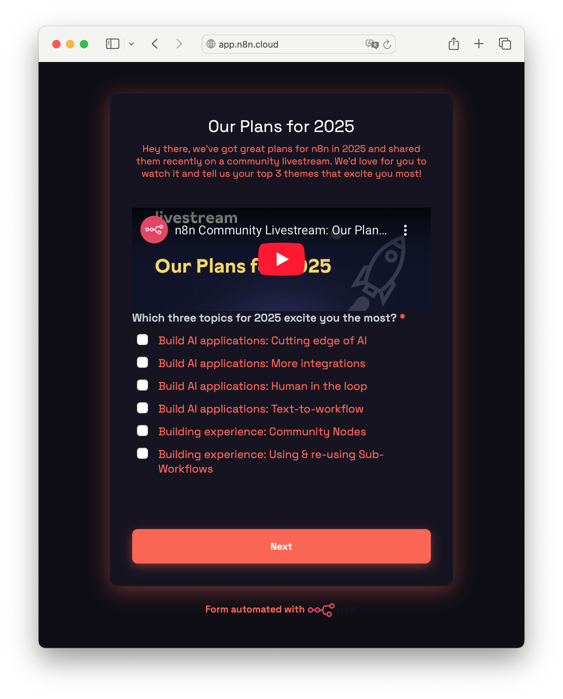
    <figcaption>Form with custom CSS applied</figcaption>
</figure>
<br>

These improvements elevate the Form Trigger node beyond a simple workflow trigger, transforming it into a powerful tool for addressing use cases from data collection and order processing to custom content creation.

### Contributors <a href="#contributors" id="contributors"></a>

[Fank](https://github.com/Fank)  

For full release details, refer to [Releases](https://github.com/n8n-io/n8n/releases) on GitHub.

## n8n@1.84.1 <a href="#n8n1841" id="n8n1841"></a>

View the [commits](https://github.com/n8n-io/n8n/compare/n8n@1.84.0...n8n@1.84.1) for this version.<br />
**Release date:** 2025-03-18

This release contains bug fixes.

For full release details, refer to [Releases](https://github.com/n8n-io/n8n/releases) on GitHub.

## n8n@1.84.0 <a href="#n8n1840" id="n8n1840"></a>

View the [commits](https://github.com/n8n-io/n8n/compare/n8n@1.83.0...n8n@1.84.0) for this version.<br />
**Release date:** 2025-03-17

This release contains a new node, node updates, editor updates, and bug fixes.

### Contributors <a href="#contributors" id="contributors"></a>

[Pash10g](https://github.com/Pash10g)  

For full release details, refer to [Releases](https://github.com/n8n-io/n8n/releases) on GitHub.

## n8n@1.83.2 <a href="#n8n1832" id="n8n1832"></a>

View the [commits](https://github.com/n8n-io/n8n/compare/n8n@1.83.1...n8n@1.83.2) for this version.<br />
**Release date:** 2025-03-14

This release contains bug fixes.

For full release details, refer to [Releases](https://github.com/n8n-io/n8n/releases) on GitHub.

## n8n@1.82.4 <a href="#n8n1824" id="n8n1824"></a>

View the [commits](https://github.com/n8n-io/n8n/compare/n8n@1.82.3...n8n@1.82.4) for this version.<br />
**Release date:** 2025-03-14

This release contains a bug fix.

For full release details, refer to [Releases](https://github.com/n8n-io/n8n/releases) on GitHub.

## n8n@1.82.3 <a href="#n8n1823" id="n8n1823"></a>

View the [commits](https://github.com/n8n-io/n8n/compare/n8n@1.82.2...n8n@1.82.3) for this version.<br />
**Release date:** 2025-03-13

This release contains a bug fix.

For full release details, refer to [Releases](https://github.com/n8n-io/n8n/releases) on GitHub.

## n8n@1.83.1 <a href="#n8n1831" id="n8n1831"></a>

View the [commits](https://github.com/n8n-io/n8n/compare/n8n@1.83.0...n8n@1.83.1) for this version.<br />
**Release date:** 2025-03-12

This release contains bug fixes.

For full release details, refer to [Releases](https://github.com/n8n-io/n8n/releases) on GitHub.

## n8n@1.83.0 <a href="#n8n1830" id="n8n1830"></a>

View the [commits](https://github.com/n8n-io/n8n/compare/n8n@1.82.0...n8n@1.83.0) for this version.<br />
**Release date:** 2025-03-12

This release contains bug fixes and an editor update.

### Schema Preview <a href="#schema-preview" id="schema-preview"></a>

Schema Preview lets you view and work with a node’s expected output without executing it or adding credentials, keeping you in flow while building.

- **See expected node outputs instantly.** View schemas for over 100+ nodes to help you design workflows efficiently without extra steps.  
- **Define workflow logic first, take care of credentials later.** Build your end-to-end workflow without getting sidetracked by credential setup.  
- **Avoid unwanted executions when building.** Prevent unnecessary API calls, unwanted data changes, or potential third-party service costs by viewing outputs without executing nodes.  

**How to use it:**

- Add a node with Schema Preview support to your workflow.
- Open the next node in the sequence - Schema Preview data appears in the Node Editor where you would typically find it in the Schema View.
- Use Schema Preview fields just like other schema data - drag and drop them into parameters and settings as needed.

<br>
<video src="/_video/release-notes/Schema_preview.mp4" controls width="100%"></video>
<br>

Don’t forget to add the required credentials before putting your workflow into production.

### Contributors <a href="#contributors" id="contributors"></a>

[pemontto](https://github.com/pemontto)  
[Haru922](https://github.com/Haru922)  

For full release details, refer to [Releases](https://github.com/n8n-io/n8n/releases) on GitHub.

## n8n@1.82.2 <a href="#n8n1822" id="n8n1822"></a>

View the [commits](https://github.com/n8n-io/n8n/compare/n8n@1.82.1...n8n@1.82.2) for this version.<br />
**Release date:** 2025-03-12

This release contains bug fixes.

For full release details, refer to [Releases](https://github.com/n8n-io/n8n/releases) on GitHub.

## n8n@1.82.1 <a href="#n8n1821" id="n8n1821"></a>

View the [commits](https://github.com/n8n-io/n8n/compare/n8n@1.82.0...n8n@1.82.1) for this version.<br />
**Release date:** 2025-03-04

This release contains bug fixes.

For full release details, refer to [Releases](https://github.com/n8n-io/n8n/releases) on GitHub.

## n8n@1.82.0 <a href="#n8n1820" id="n8n1820"></a>

View the [commits](https://github.com/n8n-io/n8n/compare/n8n@1.81.0...n8n@1.82.0) for this version.<br />
**Release date:** 2025-03-03

This release contains core updates, editor updates, new nodes, node updates, new credentials, credential updates, and bug fixes.

### Tidy up <a href="#tidy-up" id="tidy-up"></a>
Tidy up instantly aligns nodes, centers stickies, untangles connections, and brings structure to your workflows. Whether you're preparing to share a workflow or just want to improve readability, this feature saves you time and makes your logic easier to follow. Clean, well-organized workflows aren't just nicer to look at—they’re also quicker to understand.

**How to:** 

Open the workflow you want to tidy, then choose one of these options:

- Click the **Tidy up** button in the bottom-left corner of the canvas (it looks like a broom 🧹)
- Press **Shift + Alt + T** on your keyboard
- Right-click anywhere on the canvas and select **Tidy up workflow**

Want to tidy up just part of your workflow? Select the specific nodes you want to clean up first - Tidy up will only adjust those, along with any stickies behind them.

<br>
<video src="/_video/release-notes/tidy_up.mp4" controls width="100%"></video>
<br>


### Multiple API keys <a href="#multiple-api-keys" id="multiple-api-keys"></a>
n8n now supports multiple API keys, allowing users to generate and manage separate keys for different workflows or integrations. This improves security by enabling easier key rotation and isolation of credentials. Future updates will introduce more granular controls. <br>

<figure>
    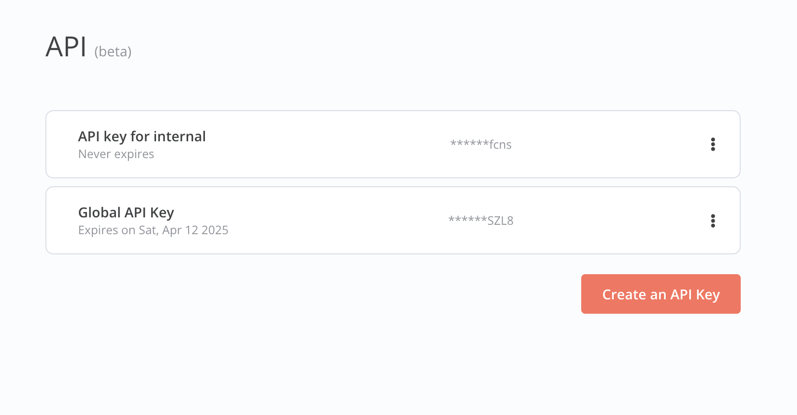
    <figcaption>Multiple API keys</figcaption>
</figure>
<br>

### Contributors <a href="#contributors" id="contributors"></a>

[Rostammahabadi](https://github.com/Rostammahabadi)  
[Lanhild](https://github.com/Lanhild)  
[matthiez](https://github.com/matthiez)  
[feelgood-interface](https://github.com/feelgood-interface)  
[adina-hub](https://github.com/adina-hub)  

For full release details, refer to [Releases](https://github.com/n8n-io/n8n/releases) on GitHub.

## n8n@1.81.4 <a href="#n8n1814" id="n8n1814"></a>

View the [commits](https://github.com/n8n-io/n8n/compare/n8n@1.81.3...n8n@1.81.4) for this version.<br />
**Release date:** 2025-03-03

This release contains a bug fix.

For full release details, refer to [Releases](https://github.com/n8n-io/n8n/releases) on GitHub.

## n8n@1.81.3 <a href="#n8n1813" id="n8n1813"></a>

View the [commits](https://github.com/n8n-io/n8n/compare/n8n@1.81.2...n8n@1.81.3) for this version.<br />
**Release date:** 2025-03-03

This release contains bug fixes.

For full release details, refer to [Releases](https://github.com/n8n-io/n8n/releases) on GitHub.

## n8n@1.81.2 <a href="#n8n1812" id="n8n1812"></a>

View the [commits](https://github.com/n8n-io/n8n/compare/n8n@1.81.1...n8n@1.81.2) for this version.<br />
**Release date:** 2025-02-28

This release contains bug fixes.

For full release details, refer to [Releases](https://github.com/n8n-io/n8n/releases) on GitHub.

## n8n@1.80.5 <a href="#n8n1805" id="n8n1805"></a>

View the [commits](https://github.com/n8n-io/n8n/compare/n8n@1.80.4...n8n@1.80.5) for this version.<br />
**Release date:** 2025-02-28

This release contains a bug fix.

For full release details, refer to [Releases](https://github.com/n8n-io/n8n/releases) on GitHub.

## n8n@1.80.4 <a href="#n8n1804" id="n8n1804"></a>

View the [commits](https://github.com/n8n-io/n8n/compare/n8n@1.80.3...n8n@1.80.4) for this version.<br />
**Release date:** 2025-02-27

This release contains a bug fix.

For full release details, refer to [Releases](https://github.com/n8n-io/n8n/releases) on GitHub.

## n8n@1.81.1 <a href="#n8n1811" id="n8n1811"></a>

View the [commits](https://github.com/n8n-io/n8n/compare/n8n@1.81.0...n8n@1.81.1) for this version.<br />
**Release date:** 2025-02-27

This release contains bug fixes.

For full release details, refer to [Releases](https://github.com/n8n-io/n8n/releases) on GitHub.

## n8n@1.81.0 <a href="#n8n1810" id="n8n1810"></a>

View the [commits](https://github.com/n8n-io/n8n/compare/n8n@1.80.0...n8n@1.81.0) for this version.<br />
**Release date:** 2025-02-24

This release contains bug fixes, a core update, editor improvements, and a node update.

### Improved partial executions <a href="#improved-partial-executions" id="improved-partial-executions"></a>
The new execution engine for partial executions ensures that testing parts of a workflow in the builder closely mirrors production behaviour. This makes iterating with updated run-data faster and more reliable, particularly for complex workflows.

Before, user would test parts of a workflow in the builder that didn't consistently reflect production behaviour, leading to unexpected results during development.

This update aligns workflow execution in the builder with production behavior.

Here is an example for loops:

Before
<br>

<video src="/_video/release-notes/Partial-execution-loop-before.mp4" controls width="100%"></video>
<br>
After
<br>

<video src="/_video/release-notes/Partial-execution-loop-after.mp4" controls width="100%"></video>


For full release details, refer to [Releases](https://github.com/n8n-io/n8n/releases) on GitHub.

## n8n@1.80.3 <a href="#n8n1803" id="n8n1803"></a>

View the [commits](https://github.com/n8n-io/n8n/compare/n8n@1.80.2...n8n@1.80.3) for this version.<br />
**Release date:** 2025-02-21

This release contains a bug fix.

For full release details, refer to [Releases](https://github.com/n8n-io/n8n/releases) on GitHub.

## n8n@1.79.4 <a href="#n8n1794" id="n8n1794"></a>

View the [commits](https://github.com/n8n-io/n8n/compare/n8n@1.79.3...n8n@1.79.4) for this version.<br />
**Release date:** 2025-02-21

This release contains a bug fix.

For full release details, refer to [Releases](https://github.com/n8n-io/n8n/releases) on GitHub.

## n8n@1.80.2 <a href="#n8n1802" id="n8n1802"></a>

View the [commits](https://github.com/n8n-io/n8n/compare/n8n@1.80.1...n8n@1.80.2) for this version.<br />
**Release date:** 2025-02-21

This release contains a bug fix.

For full release details, refer to [Releases](https://github.com/n8n-io/n8n/releases) on GitHub.

## n8n@1.79.3 <a href="#n8n1793" id="n8n1793"></a>

View the [commits](https://github.com/n8n-io/n8n/compare/n8n@1.79.2...n8n@1.79.3) for this version.<br />
**Release date:** 2025-02-21

This release contains a bug fix.

For full release details, refer to [Releases](https://github.com/n8n-io/n8n/releases) on GitHub.

## n8n@1.80.1 <a href="#n8n1801" id="n8n1801"></a>

View the [commits](https://github.com/n8n-io/n8n/compare/n8n@1.80.0...n8n@1.80.1) for this version.<br />
**Release date:** 2025-02-20

This release contains bug fixes.

For full release details, refer to [Releases](https://github.com/n8n-io/n8n/releases) on GitHub.

## n8n@1.79.2 <a href="#n8n1792" id="n8n1792"></a>

View the [commits](https://github.com/n8n-io/n8n/compare/n8n@1.79.1...n8n@1.79.2) for this version.<br />
**Release date:** 2025-02-20

This release contains bug fixes.

For full release details, refer to [Releases](https://github.com/n8n-io/n8n/releases) on GitHub.

## n8n@1.80.0 <a href="#n8n1800" id="n8n1800"></a>

View the [commits](https://github.com/n8n-io/n8n/compare/n8n@1.79.0...n8n@1.80.0) for this version.<br />
**Release date:** 2025-02-17

This release contains bug fixes and an editor improvement.

For full release details, refer to [Releases](https://github.com/n8n-io/n8n/releases) on GitHub.

## n8n@1.75.3 <a href="#n8n1753" id="n8n1753"></a>

View the [commits](https://github.com/n8n-io/n8n/compare/n8n@1.75.2...n8n@1.75.3) for this version.<br />
**Release date:** 2025-02-17

This release contains a bug fix.

For full release details, refer to [Releases](https://github.com/n8n-io/n8n/releases) on GitHub.

## n8n@1.74.4 <a href="#n8n1744" id="n8n1744"></a>

View the [commits](https://github.com/n8n-io/n8n/compare/n8n@1.74.3...n8n@1.74.4) for this version.<br />
**Release date:** 2025-02-17

This release contains a bug fix.

For full release details, refer to [Releases](https://github.com/n8n-io/n8n/releases) on GitHub.

## n8n@1.79.1 <a href="#n8n1791" id="n8n1791"></a>

View the [commits](https://github.com/n8n-io/n8n/compare/n8n@1.79.0...n8n@1.79.1) for this version.<br />
**Release date:** 2025-02-15

This release contains a bug fix.

For full release details, refer to [Releases](https://github.com/n8n-io/n8n/releases) on GitHub.

## n8n@1.78.1 <a href="#n8n1781" id="n8n1781"></a>

View the [commits](https://github.com/n8n-io/n8n/compare/n8n@1.78.0...n8n@1.78.1) for this version.<br />
**Release date:** 2025-02-15

This release contains a bug fix.

For full release details, refer to [Releases](https://github.com/n8n-io/n8n/releases) on GitHub.

## n8n@1.77.4 <a href="#n8n1774" id="n8n1774"></a>

View the [commits](https://github.com/n8n-io/n8n/compare/n8n@1.77.3...n8n@1.77.4) for this version.<br />
**Release date:** 2025-02-15

This release contains a bug fix.

For full release details, refer to [Releases](https://github.com/n8n-io/n8n/releases) on GitHub.

## n8n@1.76.4 <a href="#n8n1764" id="n8n1764"></a>

View the [commits](https://github.com/n8n-io/n8n/compare/n8n@1.76.3...n8n@1.76.4) for this version.<br />
**Release date:** 2025-02-15

This release contains a bug fix.

For full release details, refer to [Releases](https://github.com/n8n-io/n8n/releases) on GitHub.

## n8n@1.79.0 <a href="#n8n1790" id="n8n1790"></a>

View the [commits](https://github.com/n8n-io/n8n/compare/n8n@1.77.0...n8n@1.78.0) for this version.<br />
**Release date:** 2025-02-12

This release contains new features, node updates, and bug fixes.

For full release details, refer to [Releases](https://github.com/n8n-io/n8n/releases) on GitHub.

## n8n@1.77.3 <a href="#n8n1773" id="n8n1773"></a>

View the [commits](https://github.com/n8n-io/n8n/compare/n8n@1.77.2...n8n@1.77.3) for this version.<br />
**Release date:** 2025-02-06

This release contains a bug fix.

For full release details, refer to [Releases](https://github.com/n8n-io/n8n/releases) on GitHub.

## n8n@1.78.0 <a href="#n8n1780" id="n8n1780"></a>

View the [commits](https://github.com/n8n-io/n8n/compare/n8n@1.77.0...n8n@1.78.0) for this version.<br />
**Release date:** 2025-02-05

This release contains new features, node updates, and bug fixes.

### Contributors <a href="#contributors" id="contributors"></a>

[mocanew](https://github.com/mocanew)  
[Timtendo12](https://github.com/Timtendo12)  

For full release details, refer to [Releases](https://github.com/n8n-io/n8n/releases) on GitHub.

## n8n@1.77.2 <a href="#n8n1772" id="n8n1772"></a>

View the [commits](https://github.com/n8n-io/n8n/compare/n8n@1.77.1...n8n@1.77.2) for this version.<br />
**Release date:** 2025-02-04

This release contains bug fixes.

For full release details, refer to [Releases](https://github.com/n8n-io/n8n/releases) on GitHub.

## n8n@1.76.3 <a href="#n8n1763" id="n8n1763"></a>

View the [commits](https://github.com/n8n-io/n8n/compare/n8n@1.76.2...n8n@1.76.3) for this version.<br />
**Release date:** 2025-02-04

This release contains bug fixes.

For full release details, refer to [Releases](https://github.com/n8n-io/n8n/releases) on GitHub.

## n8n@1.77.1 <a href="#n8n1771" id="n8n1771"></a>

View the [commits](https://github.com/n8n-io/n8n/compare/n8n@1.77.0...n8n@1.77.1) for this version.<br />
**Release date:** 2025-02-03

This release contains bug fixes.

For full release details, refer to [Releases](https://github.com/n8n-io/n8n/releases) on GitHub.

## n8n@1.76.2 <a href="#n8n1762" id="n8n1762"></a>

View the [commits](https://github.com/n8n-io/n8n/compare/n8n@1.76.1...n8n@1.76.2) for this version.<br />
**Release date:** 2025-02-03

This release contains bug fixes.

For full release details, refer to [Releases](https://github.com/n8n-io/n8n/releases) on GitHub.

## n8n@1.77.0 <a href="#n8n1770" id="n8n1770"></a>

View the [commits](https://github.com/n8n-io/n8n/compare/n8n@1.76.0...n8n@1.77.0) for this version.<br />
**Release date:** 2025-01-29

This release contains new features, editor updates, new nodes, new credentials, node updates, and bug fixes.

For full release details, refer to [Releases](https://github.com/n8n-io/n8n/releases) on GitHub.

## n8n@1.76.1 <a href="#n8n1761" id="n8n1761"></a>

View the [commits](https://github.com/n8n-io/n8n/compare/n8n@1.76.0...n8n@1.76.1) for this version.<br />
**Release date:** 2025-01-23

This release contains a bug fix.

For full release details, refer to [Releases](https://github.com/n8n-io/n8n/releases) on GitHub.

## n8n@1.76.0 <a href="#n8n1760" id="n8n1760"></a>

View the [commits](https://github.com/n8n-io/n8n/compare/n8n@1.75.0...n8n@1.76.0) for this version.<br />
**Release date:** 2025-01-22

This release contains new features, editor updates, new credentials, node improvements, and bug fixes.

### Contributors <a href="#contributors" id="contributors"></a>

[Stamsy](https://github.com/Stamsy)  
[GKdeVries](https://github.com/GKdeVries)  

For full release details, refer to [Releases](https://github.com/n8n-io/n8n/releases) on GitHub.

## n8n@1.75.2 <a href="#n8n1752" id="n8n1752"></a>

View the [commits](https://github.com/n8n-io/n8n/compare/n8n@1.75.1...n8n@1.75.2) for this version.<br />
**Release date:** 2025-01-17

This release contains a bug fix.

For full release details, refer to [Releases](https://github.com/n8n-io/n8n/releases) on GitHub.

## n8n@1.74.3 <a href="#n8n1743" id="n8n1743"></a>

View the [commits](https://github.com/n8n-io/n8n/compare/n8n@1.74.2...n8n@1.74.3) for this version.<br />
**Release date:** 2025-01-17

This release contains a bug fix.

For full release details, refer to [Releases](https://github.com/n8n-io/n8n/releases) on GitHub.

## n8n@1.75.1 <a href="#n8n1751" id="n8n1751"></a>

View the [commits](https://github.com/n8n-io/n8n/compare/n8n@1.75.0...n8n@1.75.1) for this version.<br />
**Release date:** 2025-01-17

This release contains bug fixes.

For full release details, refer to [Releases](https://github.com/n8n-io/n8n/releases) on GitHub.

## n8n@1.74.2 <a href="#n8n1742" id="n8n1742"></a>

View the [commits](https://github.com/n8n-io/n8n/compare/n8n@1.74.1...n8n@1.74.2) for this version.<br />
**Release date:** 2025-01-17

This release contains bug fixes.

For full release details, refer to [Releases](https://github.com/n8n-io/n8n/releases) on GitHub.

## n8n@1.75.0 <a href="#n8n1750" id="n8n1750"></a>

View the [commits](https://github.com/n8n-io/n8n/compare/n8n@1.74.0...n8n@1.75.0) for this version.<br />
**Release date:** 2025-01-15

This release contains bug fixes and editor updates.

### Improved consistency across environments <a href="#improved-consistency-across-environments" id="improved-consistency-across-environments"></a>
We added new UX and automatic changes improvements resulting in a better consistency between your staging and production instances.

Previously, users faced issues like:  

- Lack of visibility into required credential updates when pulling changes  
- Incomplete synchronization, where changes — such as deletions — weren’t always applied across environments  
- Confusing commit process, making it unclear what was being pushed or pulled  

We addressed these by:

- Clearly indicating required credential updates when pulling changes  
- Ensuring deletions and other modifications sync correctly across environments  
- Improving commit selection to provide better visibility into what’s being pushed  
<br>
<figure>
    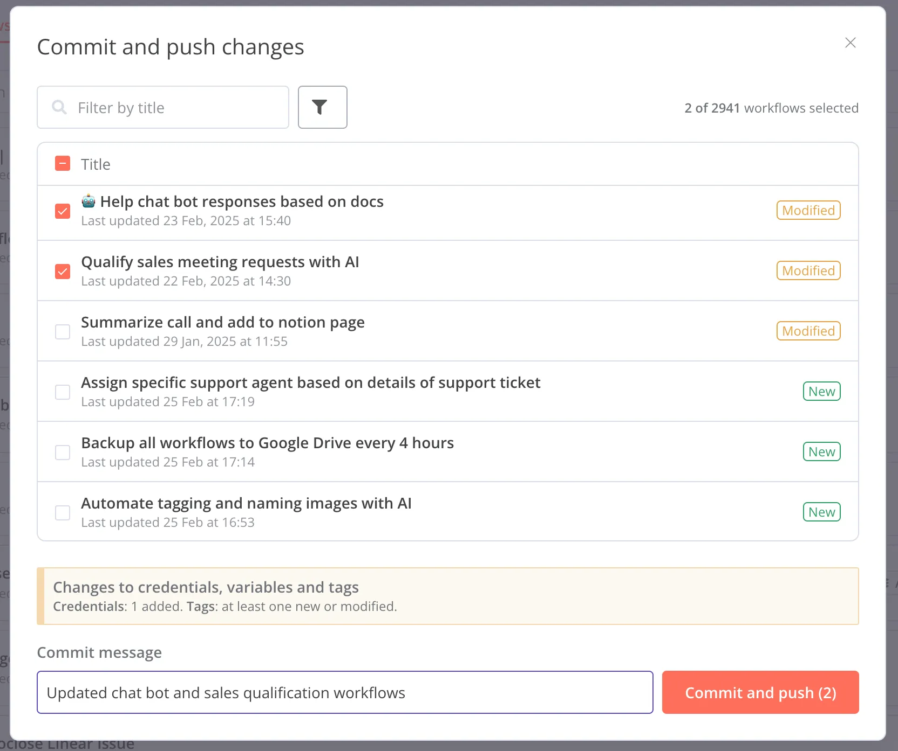
    <figcaption>Commit modal</figcaption>
</figure>
<br>
<figure>
    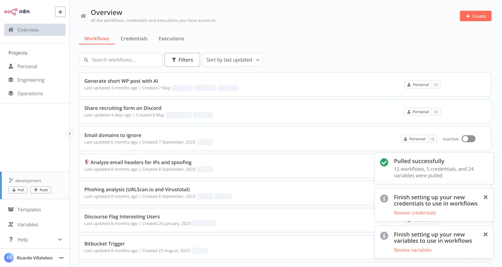
    <figcaption>Pull notification</figcaption>
</figure>
<br>

For full release details, refer to [Releases](https://github.com/n8n-io/n8n/releases) on GitHub.

## n8n@1.74.1 <a href="#n8n1741" id="n8n1741"></a>

View the [commits](https://github.com/n8n-io/n8n/compare/n8n@1.74.0...n8n@1.74.1) for this version.<br />
**Release date:** 2025-01-09

This release contains a bug fix.

For full release details, refer to [Releases](https://github.com/n8n-io/n8n/releases) on GitHub.

## n8n@1.74.0 <a href="#n8n1740" id="n8n1740"></a>

View the [commits](https://github.com/n8n-io/n8n/compare/n8n@1.73.0...n8n@1.74.0) for this version.<br />
**Release date:** 2025-01-08

This release contains new features, a new node, node updates, performance improvements and bug fixes.


### Overhauled Code node editing experience <a href="#overhauled-code-node-editing-experience" id="overhauled-code-node-editing-experience"></a>
We added a ton of new helpers to the Code node, making edits of your code much faster and more comfortable. You get:

- TypeScript autocomplete  
- TypeScript linting  
- TypeScript hover tips  
- Search and replace  
- New keyboard shortcuts based on the VSCode keymap  
- Auto-formatting using prettier (Alt+Shift+F)  
- Remember folded regions and history after refresh  
- Multi cursor  
- Type function in the Code node using JSDoc types  
- Drag and drop for all Code node modes  
- Indentation markers  

We build this on a web worker architecture so you won't have to suffer from performance degradation while typing. <br>
<br>
To get the full picture, check out our Studio update with Max and Elias, where they discuss and demo the new editing experience. 👇 <br>

[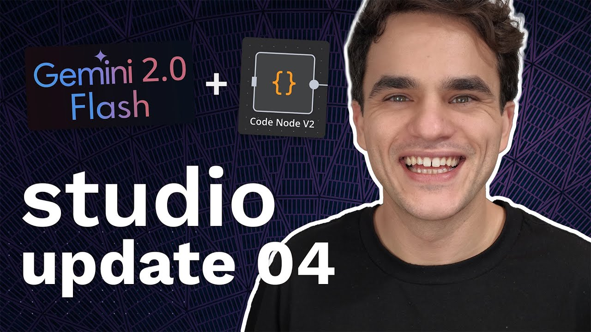](https://youtu.be/De1E58MPaMQ?t=645)
<figure>
    <figcaption>[Studio Update #04](https://youtu.be/De1E58MPaMQ?t=645)</figcaption>
</figure>



### New node: Microsoft Entra ID <a href="#new-node-microsoft-entra-id" id="new-node-microsoft-entra-id"></a>
Microsoft Entra ID (formerly known as Microsoft Azure Active Directory or Azure AD) is used for cloud-based identity and access management. [The new node](https://app.gitbook.com/s/BKcbOzIWja8NfqKDcqHc/builtin/app-nodes/n8n-nodes-base.microsoftentra) supports a wide range of Microsoft Entra ID features, which includes creating, getting, updating, and deleting users and groups, as well as adding users to and removing them from groups. 

### Node updates <a href="#node-updates" id="node-updates"></a>

- [AI Agent](https://app.gitbook.com/s/BKcbOzIWja8NfqKDcqHc/builtin/cluster-nodes/root-nodes/n8n-nodes-langchain.agent): Vector stores can now be directly used as tools for the agent
- [Code](https://app.gitbook.com/s/rPN1zU5jaYNvwH7RzxqA/code-in-n8n/use-built-in-shortcuts): Tons of new speed and convenience features, see above for details  
- [Google Vertex Chat](https://app.gitbook.com/s/BKcbOzIWja8NfqKDcqHc/builtin/cluster-nodes/sub-nodes/n8n-nodes-langchain.lmchatgooglevertex): Added option to specify the GCP region for the Google API credentials  
- [HighLevel](https://app.gitbook.com/s/BKcbOzIWja8NfqKDcqHc/builtin/app-nodes/n8n-nodes-base.highlevel): Added support for calendar items  


We also added a custom [projects](https://app.gitbook.com/s/wMJrGrimpx3PxCJpUswm/manage-users-and-access/set-permissions-and-roles-rbac/organize-work-in-projects) icon selector on top of the available emojis. Pretty!

### Contributors <a href="#contributors" id="contributors"></a>

[igatanasov](https://github.com/igatanasov)  
[Stamsy](https://github.com/Stamsy)  
[feelgood-interface](https://github.com/feelgood-interface)  

For full release details, refer to [Releases](https://github.com/n8n-io/n8n/releases) on GitHub.

## n8n@1.73.1 <a href="#n8n1731" id="n8n1731"></a>

View the [commits](https://github.com/n8n-io/n8n/compare/n8n@1.73.0...n8n@1.73.1) for this version.<br />
**Release date:** 2024-12-19

This release contains a bug fix.

For full release details, refer to [Releases](https://github.com/n8n-io/n8n/releases) on GitHub.

## n8n@1.73.0 <a href="#n8n1730" id="n8n1730"></a>

View the [commits](https://github.com/n8n-io/n8n/compare/n8n@1.72.0...n8n@1.73.0) for this version.<br />
**Release date:** 2024-12-19

This release contains node updates, performance improvements, and bug fixes.

### Node updates <a href="#node-updates" id="node-updates"></a>

- [AI Agent](https://app.gitbook.com/s/BKcbOzIWja8NfqKDcqHc/builtin/cluster-nodes/root-nodes/n8n-nodes-langchain.agent): Updated descriptions for Chat Trigger options
- [Facebook Graph API](https://app.gitbook.com/s/BKcbOzIWja8NfqKDcqHc/builtin/app-nodes/n8n-nodes-base.facebookgraphapi): Updated for API v21.0
- [Gmail](https://app.gitbook.com/s/BKcbOzIWja8NfqKDcqHc/builtin/app-nodes/n8n-nodes-base.gmail): Added two new options for the `Send and wait` operation, free text and custom form  
- [Linear Trigger](https://app.gitbook.com/s/BKcbOzIWja8NfqKDcqHc/builtin/trigger-nodes/n8n-nodes-base.lineartrigger): Added support for admin scope  
- [MailerLite](https://app.gitbook.com/s/BKcbOzIWja8NfqKDcqHc/builtin/app-nodes/n8n-nodes-base.mailerlite): Now supports the new API  
- [Slack](https://app.gitbook.com/s/BKcbOzIWja8NfqKDcqHc/builtin/app-nodes/n8n-nodes-base.slack):  Added two new options for the `Send and wait` operation, free text and custom form  

We also added credential support for [SolarWinds IPAM](https://app.gitbook.com/s/BKcbOzIWja8NfqKDcqHc/builtin/credentials/solarwindsipam) and [SolarWinds Observability](https://app.gitbook.com/s/BKcbOzIWja8NfqKDcqHc/builtin/credentials/solarwindsobservability). 

Last, but not least, we [improved the schema view performance in the node details view by 90%](https://github.com/n8n-io/n8n/pull/12180) and added drag and drop re-ordering to parameters. This comes in very handy in the [If](https://app.gitbook.com/s/BKcbOzIWja8NfqKDcqHc/builtin/core-nodes/n8n-nodes-base.if) or [Edit Fields](https://app.gitbook.com/s/BKcbOzIWja8NfqKDcqHc/builtin/core-nodes/n8n-nodes-base.set) nodes. 

### Contributors <a href="#contributors" id="contributors"></a>

[CodeShakingSheep](https://github.com/CodeShakingSheep)  
[mickaelandrieu](https://github.com/mickaelandrieu)  
[Stamsy](https://github.com/Stamsy)  
[pbdco](https://github.com/pbdco)  

For full release details, refer to [Releases](https://github.com/n8n-io/n8n/releases) on GitHub.


## n8n@1.72.1 <a href="#n8n1721" id="n8n1721"></a>

View the [commits](https://github.com/n8n-io/n8n/compare/n8n@1.72.0...n8n@1.72.1) for this version.<br />
**Release date:** 2024-12-12


This release contains bug fixes.

For full release details, refer to [Releases](https://github.com/n8n-io/n8n/releases) on GitHub.

## n8n@1.71.3 <a href="#n8n1713" id="n8n1713"></a>

View the [commits](https://github.com/n8n-io/n8n/compare/n8n@1.71.2...n8n@1.71.3) for this version.<br />
**Release date:** 2024-12-12


This release contains bug fixes.

For full release details, refer to [Releases](https://github.com/n8n-io/n8n/releases) on GitHub.

## n8n@1.72.0 <a href="#n8n1720" id="n8n1720"></a>

View the [commits](https://github.com/n8n-io/n8n/compare/n8n@1.71.0...n8n@1.72.0) for this version.<br />
**Release date:** 2024-12-11

This release contains node updates, usability improvements, and bug fixes.

### Node updates <a href="#node-updates" id="node-updates"></a>

- [AI Transform](https://app.gitbook.com/s/BKcbOzIWja8NfqKDcqHc/builtin/core-nodes/n8n-nodes-base.aitransform): The `maximum context length` error now retries with reduced payload size
- [Redis](https://app.gitbook.com/s/BKcbOzIWja8NfqKDcqHc/builtin/app-nodes/n8n-nodes-base.redis): Added support for `continue on fail`

### Improved commit modal <a href="#improved-commit-modal" id="improved-commit-modal"></a>

We added filters and text search to the commit modal when working with [Environments](https://app.gitbook.com/s/wMJrGrimpx3PxCJpUswm/use-source-control-and-environments). This will make committing easier as we provide more information and better visibility. Environments are available on the Enterprise plan. 

For full release details, refer to [Releases](https://github.com/n8n-io/n8n/releases) on GitHub.

## n8n@1.71.2 <a href="#n8n1712" id="n8n1712"></a>

View the [commits](https://github.com/n8n-io/n8n/compare/n8n@1.71.1...n8n@1.71.2) for this version.<br />
**Release date:** 2024-12-10


This release contains bug fixes.

For full release details, refer to [Releases](https://github.com/n8n-io/n8n/releases) on GitHub.

## n8n@1.70.4 <a href="#n8n1704" id="n8n1704"></a>

View the [commits](https://github.com/n8n-io/n8n/compare/n8n@1.70.3...n8n@1.70.4) for this version.<br />
**Release date:** 2024-12-10


This release contains bug fixes.

For full release details, refer to [Releases](https://github.com/n8n-io/n8n/releases) on GitHub.

## n8n@1.71.1 <a href="#n8n1711" id="n8n1711"></a>

View the [commits](https://github.com/n8n-io/n8n/compare/n8n@1.71.0...n8n@1.71.1) for this version.<br />
**Release date:** 2024-12-06

This release contains bug fixes.

For full release details, refer to [Releases](https://github.com/n8n-io/n8n/releases) on GitHub.

## n8n@1.70.3 <a href="#n8n1703" id="n8n1703"></a>

View the [commits](https://github.com/n8n-io/n8n/compare/n8n@1.70.2...n8n@1.70.3) for this version.<br />
**Release date:** 2024-12-05

This release contains bug fixes.

For full release details, refer to [Releases](https://github.com/n8n-io/n8n/releases) on GitHub.

## n8n@1.71.0 <a href="#n8n1710" id="n8n1710"></a>

View the [commits](https://github.com/n8n-io/n8n/compare/n8n@1.70.2...n8n@1.71.0) for this version.<br />
**Release date:** 2024-12-04

This release contains node updates, performance improvements, and bug fixes.


### Task runners for the Code node in public beta <a href="#task-runners-for-the-code-node-in-public-beta" id="task-runners-for-the-code-node-in-public-beta"></a>
We're introducing a significant performance upgrade to the Code node with our new Task runner system. This enhancement moves JavaScript code execution to a separate process, improving your workflow execution speed while adding better isolation.

<figure>
    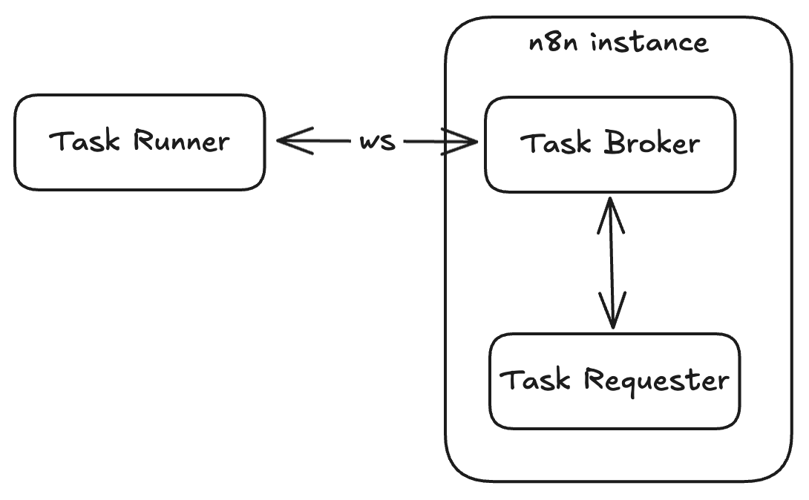
    <figcaption>Task runners overview</figcaption>
</figure>

Our benchmarks show up to 6x improvement in workflow executions using Code nodes - from approximately 6 to 35 executions per second. All these improvements happen under the hood, keeping your Code node experience exactly the same.

The Task runner comes in two modes:

- Internal mode (default): Perfect for getting started, automatically managing task runners as child processes  
- External mode: For advanced hosting scenarios requiring maximum isolation and security

Currently, this feature is opt-in and can be enabled using [environment variables](https://app.gitbook.com/s/jm0ZYRpZIPWge2ZSiDYO/host-n8n/configure-n8n/basic-configuration/use-environment-variables/task-runners). Once stable, it will become the default execution method for Code nodes.

To start using Task runners today, [check out the docs](https://app.gitbook.com/s/jm0ZYRpZIPWge2ZSiDYO/host-n8n/configure-n8n/set-up-task-runners).



### Node updates <a href="#node-updates" id="node-updates"></a>

- [AI Transform node](https://app.gitbook.com/s/BKcbOzIWja8NfqKDcqHc/builtin/core-nodes/n8n-nodes-base.aitransform): We improved the prompt for code generation to transform data
- [Code node](https://app.gitbook.com/s/BKcbOzIWja8NfqKDcqHc/builtin/core-nodes/n8n-nodes-base.code): We added a warning if `pairedItem` is absent or could not be auto mapped  

For full release details, refer to [Releases](https://github.com/n8n-io/n8n/releases) on GitHub.


## n8n@1.70.2 <a href="#n8n1702" id="n8n1702"></a>

View the [commits](https://github.com/n8n-io/n8n/compare/n8n@1.70.1...n8n@1.70.2) for this version.<br />
**Release date:** 2024-12-04

This release contains bug fixes.

For full release details, refer to [Releases](https://github.com/n8n-io/n8n/releases) on GitHub.


## n8n@1.70.1 <a href="#n8n1701" id="n8n1701"></a>

View the [commits](https://github.com/n8n-io/n8n/compare/n8n@1.70.0...n8n@1.70.1) for this version.<br />
**Release date:** 2024-11-29

This release contains bug fixes.

For full release details, refer to [Releases](https://github.com/n8n-io/n8n/releases) on GitHub.

## n8n@1.70.0 <a href="#n8n1700" id="n8n1700"></a>

View the [commits](https://github.com/n8n-io/n8n/compare/n8n@1.69.0...n8n@1.70.0) for this version.<br />
**Release date:** 2024-11-27

This release contains node updates, performance improvements and bug fixes.

### New canvas in beta <a href="#new-canvas-in-beta" id="new-canvas-in-beta"></a>
The new canvas is now the default setting for all users. It should bring significant performance improvements and adds a handy minimap. As it is still a beta version you can still revert to the previous version with the three dot menu.  

We're looking forward to your feedback. Should you encounter a bug, you will find a handy button to create an issue at the bottom of the new canvas as well. 

### Node updates <a href="#node-updates" id="node-updates"></a>
- We added credential support for [Zabbix](https://app.gitbook.com/s/BKcbOzIWja8NfqKDcqHc/builtin/credentials/zabbix) to the HTTP request node  
- We added new OAuth2 credentials for [Microsoft SharePoint](https://app.gitbook.com/s/BKcbOzIWja8NfqKDcqHc/builtin/credentials/microsoft)
- The [Slack node](https://app.gitbook.com/s/BKcbOzIWja8NfqKDcqHc/builtin/app-nodes/n8n-nodes-base.slack#operations) now uses markdown for the approval message when using the `Send and Wait for Approval` operation

### Contributors <a href="#contributors" id="contributors"></a>

[feelgood-interface](https://github.com/feelgood-interface)  
[adina-hub](https://github.com/adina-hub)  

For full release details, refer to [Releases](https://github.com/n8n-io/n8n/releases) on GitHub.


## n8n@1.68.1 <a href="#n8n1681" id="n8n1681"></a>

View the [commits](https://github.com/n8n-io/n8n/compare/n8n@1.68.0...n8n@1.68.1) for this version.<br />
**Release date:** 2024-11-26

This release contains bug fixes.

For full release details, refer to [Releases](https://github.com/n8n-io/n8n/releases) on GitHub.

## n8n@1.69.2 <a href="#n8n1692" id="n8n1692"></a>

View the [commits](https://github.com/n8n-io/n8n/compare/n8n@1.69.1...n8n@1.69.2) for this version.<br />
**Release date:** 2024-11-26


This release contains a bug fix.

For full release details, refer to [Releases](https://github.com/n8n-io/n8n/releases) on GitHub.


## n8n@1.69.1 <a href="#n8n1691" id="n8n1691"></a>

View the [commits](https://github.com/n8n-io/n8n/compare/n8n@1.69.0...n8n@1.69.1) for this version.<br />
**Release date:** 2024-11-25


This release contains bug fixes.

For full release details, refer to [Releases](https://github.com/n8n-io/n8n/releases) on GitHub.


## n8n@1.69.0 <a href="#n8n1690" id="n8n1690"></a>

View the [commits](https://github.com/n8n-io/n8n/compare/n8n@1.68.0...n8n@1.69.0) for this version.<br />
**Release date:** 2024-11-20


This release contains a new feature, node improvements and bug fixes.

### Sub-workflow debugging <a href="#sub-workflow-debugging" id="sub-workflow-debugging"></a>
We made it much easier to debug sub-workflows by improving their accessibility from the parent workflow. 

For full release details, refer to [Releases](https://github.com/n8n-io/n8n/releases) on GitHub.

## n8n@1.68.0 <a href="#n8n1680" id="n8n1680"></a>

View the [commits](https://github.com/n8n-io/n8n/compare/n8n@1.67.1...n8n@1.68.0) for this version.<br />
**Release date:** 2024-11-13


This release contains node updates, performance improvements and many bug fixes.


#### New AI agent canvas chat <a href="#new-ai-agent-canvas-chat" id="new-ai-agent-canvas-chat"></a>

We revamped the chat experience for AI agents on the canvas. A neatly organized view instead of a modal hiding the nodes. You can now see the canvas, chat and logs at the same time when testing your workflow. 
<br /><br />

<video src="/_video/release-notes/AI-chat-on-canvas.mp4" controls width="100%"></video>
<br /><br />



For full release details, refer to [Releases](https://github.com/n8n-io/n8n/releases) on GitHub.

## n8n@1.67.1 <a href="#n8n1671" id="n8n1671"></a>
View the [commits](https://github.com/n8n-io/n8n/compare/n8n@1.67.0...n8n@1.67.1) for this version.<br />
**Release date:** 2024-11-07

This release contains a bug fix.

For full release details, refer to [Releases](https://github.com/n8n-io/n8n/releases) on GitHub.

## n8n@1.67.0 <a href="#n8n1670" id="n8n1670"></a>

View the [commits](https://github.com/n8n-io/n8n/compare/n8n@1.66.0...n8n@1.67.0) for this version.<br />
**Release date:** 2024-11-06

This release contains node updates and bug fixes.

### Node updates <a href="#node-updates" id="node-updates"></a>

- [AI Transform](https://app.gitbook.com/s/BKcbOzIWja8NfqKDcqHc/builtin/core-nodes/n8n-nodes-base.aitransform): Improved usability  
- [Anthropic Chat Model Node](https://app.gitbook.com/s/BKcbOzIWja8NfqKDcqHc/builtin/cluster-nodes/sub-nodes/n8n-nodes-langchain.lmchatanthropic): Added Haiku 3.5 support  
- [Convert to File](https://app.gitbook.com/s/BKcbOzIWja8NfqKDcqHc/builtin/core-nodes/n8n-nodes-base.converttofile): Added delimiter option for writing to CSV  
- [Gmail Trigger](https://app.gitbook.com/s/BKcbOzIWja8NfqKDcqHc/builtin/trigger-nodes/n8n-nodes-base.gmailtrigger): Added option to filter for draft messages  
- [Intercom](https://app.gitbook.com/s/BKcbOzIWja8NfqKDcqHc/builtin/app-nodes/n8n-nodes-base.intercom): Credential can now be used in the HTTP Request node  
- [Rapid7 InsightVM](https://app.gitbook.com/s/BKcbOzIWja8NfqKDcqHc/builtin/credentials/rapid7insightvm): Added credential support  

For full release details, refer to [Releases](https://github.com/n8n-io/n8n/releases) on GitHub.

## n8n@1.66.0 <a href="#n8n1660" id="n8n1660"></a>

View the [commits](https://github.com/n8n-io/n8n/compare/n8n@1.65.2...n8n@1.66.0) for this version.<br />
**Release date:** 2024-10-31

This release contains performance improvements, a node update and bug fixes.

### Node update <a href="#node-update" id="node-update"></a>

- [Anthropic Chat Model](https://app.gitbook.com/s/BKcbOzIWja8NfqKDcqHc/builtin/cluster-nodes/sub-nodes/n8n-nodes-langchain.lmchatanthropic): Added support for claude-3-5-sonnet-20241022  

We made updates to how projects and workflow ownership are displayed making them easier to understand and navigate. 

We further improved the performance logic of partial executions, leading to a smoother and more enjoyable building experience. 

### New n8n canvas alpha <a href="#new-n8n-canvas-alpha" id="new-n8n-canvas-alpha"></a>
We have enabled the alpha version of our new canvas. The canvas is the ‘drawing board’ of the n8n editor, and we’re working on a full rewrite. Your feedback and testing will help us improve it. 
[Read all about it on our community forum](https://community.n8n.io/t/help-us-test-the-new-n8n-canvas-alpha/60070). 


For full release details, refer to [Releases](https://github.com/n8n-io/n8n/releases) on GitHub.

## n8n@1.65.2 <a href="#n8n1652" id="n8n1652"></a>

View the [commits](https://github.com/n8n-io/n8n/compare/n8n@1.65.1...n8n@1.65.2) for this version.<br />
**Release date:** 2024-10-28

This release contains bug fixes.

For full release details, refer to [Releases](https://github.com/n8n-io/n8n/releases) on GitHub.

## n8n@1.64.3 <a href="#n8n1643" id="n8n1643"></a>

View the [commits](https://github.com/n8n-io/n8n/compare/n8n@1.64.2...n8n@1.64.3) for this version.<br />
**Release date:** 2024-10-25

This release contains bug fixes.

For full release details, refer to [Releases](https://github.com/n8n-io/n8n/releases) on GitHub.

## n8n@1.65.1 <a href="#n8n1651" id="n8n1651"></a>

View the [commits](https://github.com/n8n-io/n8n/compare/n8n@1.65.0...n8n@1.65.1) for this version.<br />
**Release date:** 2024-10-25

This release contains bug fixes.

For full release details, refer to [Releases](https://github.com/n8n-io/n8n/releases) on GitHub.

## n8n@1.65.0 <a href="#n8n1650" id="n8n1650"></a>

View the [commits](https://github.com/n8n-io/n8n/compare/n8n@1.64.1...n8n@1.65.0) for this version.<br />
**Release date:** 2024-10-24


**[Breaking change](https://github.com/n8n-io/n8n/blob/master/packages/cli/BREAKING-CHANGES.md)**

What changed?
Queue polling via the environment variable `QUEUE_RECOVERY_INTERVAL` has been removed.

When is action necessary?
If you have set `QUEUE_RECOVERY_INTERVAL`, you can remove it as it no longer has any effect.


This release contains a new features, new nodes, node enhancements, and bug fixes.


### New node: n8n Form <a href="#new-node-n8n-form" id="new-node-n8n-form"></a>
Use the [n8n Form node](https://app.gitbook.com/s/BKcbOzIWja8NfqKDcqHc/builtin/core-nodes/n8n-nodes-base.form) to create user-facing forms with multiple pages. You can add other nodes with custom logic between to process user input. Start the workflow with a [n8n Form Trigger](https://app.gitbook.com/s/BKcbOzIWja8NfqKDcqHc/builtin/core-nodes/n8n-nodes-base.formtrigger). 

<figure>
    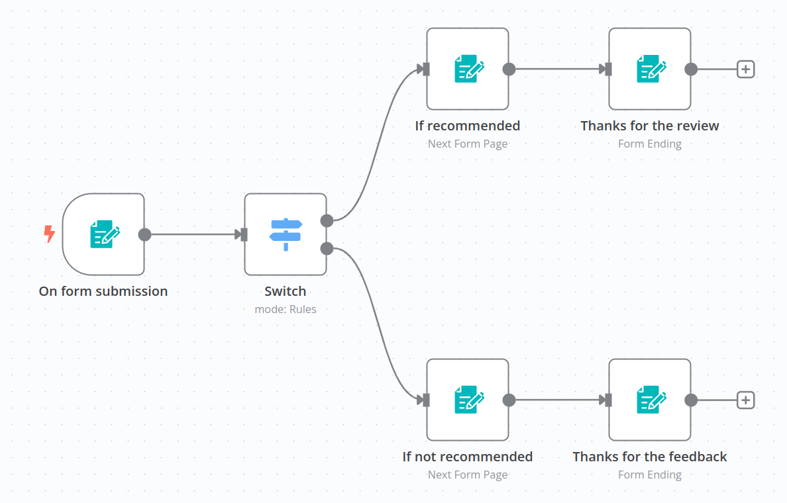
    <figcaption>A multi-page form with branching</figcaption>
</figure>

Additionally you can: 

- Set default selections with query parameters  
- Define the form with a JSON array of objects
- Show a completion screen and redirect to another URL



### Node updates <a href="#node-updates" id="node-updates"></a>
New nodes: 

- [Google Business Profile](https://app.gitbook.com/s/BKcbOzIWja8NfqKDcqHc/builtin/app-nodes/n8n-nodes-base.googlebusinessprofile) and [Google Business Profile Trigger](https://app.gitbook.com/s/BKcbOzIWja8NfqKDcqHc/builtin/trigger-nodes/n8n-nodes-base.googlebusinessprofiletrigger): Use these to integrate Google Business Profile reviews and posts with your workflows  

Enhanced nodes:

- [AI Agent](https://app.gitbook.com/s/BKcbOzIWja8NfqKDcqHc/builtin/cluster-nodes/root-nodes/n8n-nodes-langchain.agent): Removed the requirement to add at least one tool  
- [GitHub](https://app.gitbook.com/s/BKcbOzIWja8NfqKDcqHc/builtin/app-nodes/n8n-nodes-base.github): Added workflows as a resource operation  
- [Structured Output Parser](https://app.gitbook.com/s/BKcbOzIWja8NfqKDcqHc/builtin/cluster-nodes/sub-nodes/n8n-nodes-langchain.outputparserstructured): Added more user-friendly error messages

For additional security, we improved how we handle multi-factor authentication, hardened config file permissions and introduced JWT for the public API. 

For better performance, we improved how partial executions are handled in loops. 

For full release details, refer to [Releases](https://github.com/n8n-io/n8n/releases) on GitHub.

### Contributors <a href="#contributors" id="contributors"></a>

- [Idan Fishman](https://github.com/idanfishman)  

## n8n@1.64.2 <a href="#n8n1642" id="n8n1642"></a>

View the [commits](https://github.com/n8n-io/n8n/compare/n8n@1.64.1...n8n@1.64.2) for this version.<br />
**Release date:** 2024-10-24

This release contains a bug fix.

For full release details, refer to [Releases](https://github.com/n8n-io/n8n/releases) on GitHub.

## n8n@1.64.1 <a href="#n8n1641" id="n8n1641"></a>

View the [commits](https://github.com/n8n-io/n8n/compare/n8n@1.64.0...n8n@1.64.1) for this version.<br />
**Release date:** 2024-10-21

This release contains a bug fix.

For full release details, refer to [Releases](https://github.com/n8n-io/n8n/releases) on GitHub.

## n8n@1.64.0 <a href="#n8n1640" id="n8n1640"></a>

View the [commits](https://github.com/n8n-io/n8n/compare/n8n@1.63.4...n8n@1.64.0) for this version.<br />
**Release date:** 2024-10-16

This release contains a new node, node enhancements, performance improvements and bug fixes.


### Enhanced node: Remove Duplicates <a href="#enhanced-node-remove-duplicates" id="enhanced-node-remove-duplicates"></a>
The [Remove Duplicates node](https://app.gitbook.com/s/BKcbOzIWja8NfqKDcqHc/builtin/core-nodes/n8n-nodes-base.removeduplicates) got a major makeover with the addition of two new operations: 

- Remove Items Processed in Previous Executions: Compare items in the current input to items from previous executions and remove duplicates  
- Clear Deduplication History: Wipe the memory of items from previous executions.

This makes it easier to only process new items from any data source. For example, you can now more easily poll a Google sheet for new entries by `id` or remove duplicate orders from the same customer by comparing their `order date`. The great thing is, you can now do this within **and across** workflow runs.



### New node: Gong <a href="#new-node-gong" id="new-node-gong"></a>
  
The new node for [Gong](https://app.gitbook.com/s/BKcbOzIWja8NfqKDcqHc/builtin/app-nodes/n8n-nodes-base.gong) allows you to get users and calls to process them further in n8n. Very useful for sales related workflows. 

For full release details, refer to [Releases](https://github.com/n8n-io/n8n/releases) on GitHub.

### Contributors <a href="#contributors" id="contributors"></a>

- [Sören Uhrbach](https://github.com/soerenuhrbach)  

## n8n@1.63.4 <a href="#n8n1634" id="n8n1634"></a>

View the [commits](https://github.com/n8n-io/n8n/compare/n8n@1.63.3...n8n@1.63.4) for this version.<br />
**Release date:** 2024-10-15

This release contains a bug fix.

For full release details, refer to [Releases](https://github.com/n8n-io/n8n/releases) on GitHub.

## n8n@1.62.6 <a href="#n8n1626" id="n8n1626"></a>

View the [commits](https://github.com/n8n-io/n8n/compare/n8n@1.62.5...n8n@1.62.6) for this version.<br />
**Release date:** 2024-10-15

This release contains a bug fix.

For full release details, refer to [Releases](https://github.com/n8n-io/n8n/releases) on GitHub.

## n8n@1.63.3 <a href="#n8n1633" id="n8n1633"></a>

View the [commits](https://github.com/n8n-io/n8n/compare/n8n@1.63.2...n8n@1.63.3) for this version.<br />
**Release date:** 2024-10-15

This release contains a bug fix.

For full release details, refer to [Releases](https://github.com/n8n-io/n8n/releases) on GitHub.

## n8n@1.63.2 <a href="#n8n1632" id="n8n1632"></a>

View the [commits](https://github.com/n8n-io/n8n/compare/n8n@1.63.1...n8n@1.63.2) for this version.<br />
**Release date:** 2024-10-11

This release contains a bug fix.

For full release details, refer to [Releases](https://github.com/n8n-io/n8n/releases) on GitHub.

## n8n@1.62.5 <a href="#n8n1625" id="n8n1625"></a>

View the [commits](https://github.com/n8n-io/n8n/compare/n8n@1.62.4...n8n@1.62.5) for this version.<br />
**Release date:** 2024-10-11

This release contains a bug fix.

For full release details, refer to [Releases](https://github.com/n8n-io/n8n/releases) on GitHub.

## n8n@1.63.1 <a href="#n8n1631" id="n8n1631"></a>

View the [commits](https://github.com/n8n-io/n8n/compare/n8n@1.63.0...n8n@1.63.1) for this version.<br />
**Release date:** 2024-10-11

This release contains a bug fix.

For full release details, refer to [Releases](https://github.com/n8n-io/n8n/releases) on GitHub.

## n8n@1.62.4 <a href="#n8n1624" id="n8n1624"></a>

View the [commits](https://github.com/n8n-io/n8n/compare/n8n@1.62.3...n8n@1.62.4) for this version.<br />
**Release date:** 2024-10-11

This release contains a bug fix.

For full release details, refer to [Releases](https://github.com/n8n-io/n8n/releases) on GitHub.

## n8n@1.63.0 <a href="#n8n1630" id="n8n1630"></a>

View the [commits](https://github.com/n8n-io/n8n/compare/n8n@1.62.3...n8n@1.63.0) for this version.<br />
**Release date:** 2024-10-09


**[Breaking change](https://github.com/n8n-io/n8n/blob/master/packages/cli/BREAKING-CHANGES.md)**

What changed?

- The worker server used to bind to IPv6 by default. It now binds to IPv4 by default.  
- The worker server's `/healthz` used to report healthy status based on database and Redis checks. It now reports healthy status regardless of database and Redis status, and the database and Redis checks are part of `/healthz/readiness`.  

When is action necessary?

- If you experience a port conflict error when starting a worker server using its default port, set a different port for the worker server with `QUEUE_HEALTH_CHECK_PORT`.  
- If you are relying on database and Redis checks for worker health status, switch to checking `/healthz/readiness` instead of `/healthz`.


This release contains new features, node enhancements and bug fixes.

### Node updates <a href="#node-updates" id="node-updates"></a>

- [OpenAI](https://app.gitbook.com/s/BKcbOzIWja8NfqKDcqHc/builtin/app-nodes/n8n-nodes-langchain.openai): Added the option to choose between the default memory connector to provide memory to the assistant or to specify a thread ID    
- [Gmail](https://app.gitbook.com/s/BKcbOzIWja8NfqKDcqHc/builtin/app-nodes/n8n-nodes-base.gmail) and [Slack](https://app.gitbook.com/s/BKcbOzIWja8NfqKDcqHc/builtin/app-nodes/n8n-nodes-base.slack): Added custom approval operations to have a human in the loop of a workflow  

We have also optimized the [worker health checks](https://app.gitbook.com/s/jm0ZYRpZIPWge2ZSiDYO/host-n8n/keep-n8n-running/monitor-n8n) (see breaking change above). 

Each credential now has a separate url you can link to. This makes sharing much easier. 


For full release details, refer to [Releases](https://github.com/n8n-io/n8n/releases) on GitHub.

### Contributors <a href="#contributors" id="contributors"></a>

[Pemontto](https://github.com/pemontto)  

## n8n@1.62.3 <a href="#n8n1623" id="n8n1623"></a>

View the [commits](https://github.com/n8n-io/n8n/compare/n8n@1.62.2...n8n@1.62.3) for this version.<br />
**Release date:** 2024-10-08

This release contains bug fixes.

For full release details, refer to [Releases](https://github.com/n8n-io/n8n/releases) on GitHub.

## n8n@1.62.2 <a href="#n8n1622" id="n8n1622"></a>

View the [commits](https://github.com/n8n-io/n8n/compare/n8n@1.62.1...n8n@1.62.2) for this version.<br />
**Release date:** 2024-10-07

This release contains bug fixes.

For full release details, refer to [Releases](https://github.com/n8n-io/n8n/releases) on GitHub.

## n8n@1.62.1 <a href="#n8n1621" id="n8n1621"></a>

View the [commits](https://github.com/n8n-io/n8n/compare/n8n@1.61.0...n8n@1.62.1) for this version.<br />
**Release date:** 2024-10-02

This release contains new features, node enhancements and bug fixes.


**Skipped 1.62.0**

We skipped 1.62.0 and went straight to 1.62.1 with an additional fix.



#### Additional nodes as tools <a href="#additional-nodes-as-tools" id="additional-nodes-as-tools"></a>

We have made additional nodes usable with the [Tools AI Agent node](https://app.gitbook.com/s/BKcbOzIWja8NfqKDcqHc/builtin/cluster-nodes/root-nodes/n8n-nodes-langchain.agent/tools-agent). 
<br /><br />

<video src="/_video/release-notes/nodes-as-tools.mp4" controls width="100%"></video>
<br /><br />
Additionally, we have added a `$fromAI()` placeholder function to use with tools, allowing you to dynamically pass information from the models to the connected tools. This function works similarly to placeholders used elsewhere in n8n. 
<br /><br />
Both of these new features enable you to build even more powerful AI agents by drawing directly from the apps your business uses. This makes integrating LLMs into your business processes even easier than before.



### Node updates <a href="#node-updates" id="node-updates"></a>

- [Google BigQuery](https://app.gitbook.com/s/BKcbOzIWja8NfqKDcqHc/builtin/app-nodes/n8n-nodes-base.googlebigquery): Added option to return numeric values as integers and not strings 
- [HTTP Request](https://app.gitbook.com/s/BKcbOzIWja8NfqKDcqHc/builtin/core-nodes/n8n-nodes-base.httprequest): Added credential support for Sysdig 
- [Invoice Ninja](https://app.gitbook.com/s/BKcbOzIWja8NfqKDcqHc/builtin/app-nodes/n8n-nodes-base.invoiceninja): Additional query params for getAll requests 
- [Question and Answer Chain](https://app.gitbook.com/s/BKcbOzIWja8NfqKDcqHc/builtin/cluster-nodes/root-nodes/n8n-nodes-langchain.chainretrievalqa): Added the option to use a custom prompt 


Drag and drop insertion on cursor position from schema view is now also enabled for code, SQL and Html fields in nodes. 

Customers with an enterprise license can now rate, tag and highlight execution data in the executions view. To use highlighting, add an [Execution Data Node](https://app.gitbook.com/s/BKcbOzIWja8NfqKDcqHc/builtin/core-nodes/n8n-nodes-base.executiondata) (or Code node) to the workflow to set [custom executions data](https://app.gitbook.com/s/rPN1zU5jaYNvwH7RzxqA/understand-workflows/understand-executions/customize-executions-data). 

For full release details, refer to [Releases](https://github.com/n8n-io/n8n/releases) on GitHub.

### Contributors <a href="#contributors" id="contributors"></a>

[Benjamin Roedell](https://github.com/benrobot)  
[CodeShakingSheep](https://github.com/CodeShakingSheep)  
[manuelbcd](https://github.com/manuelbcd)  
[Miguel Prytoluk](https://github.com/mprytoluk)  

## n8n@1.61.0 <a href="#n8n1610" id="n8n1610"></a>

View the [commits](https://github.com/n8n-io/n8n/compare/n8n@1.60.1...n8n@1.61.0) for this version.<br />
**Release date:** 2024-09-25

This release contains new features, node enhancements and bug fixes.

### Node updates <a href="#node-updates" id="node-updates"></a>

- [Brandfetch](https://app.gitbook.com/s/BKcbOzIWja8NfqKDcqHc/builtin/app-nodes/n8n-nodes-base.brandfetch): Updated to use the new API
- [Slack](https://app.gitbook.com/s/BKcbOzIWja8NfqKDcqHc/builtin/app-nodes/n8n-nodes-base.slack): Made adding or removing the workflow link to a message easier

Big datasets now render faster thanks to virtual scrolling and execution annotations are harder to delete.

For full release details, refer to [Releases](https://github.com/n8n-io/n8n/releases) on GitHub.

## n8n@1.59.4 <a href="#n8n1594" id="n8n1594"></a>

View the [commits](https://github.com/n8n-io/n8n/compare/n8n@1.59.3...n8n@1.59.4) for this version.<br />
**Release date:** 2024-09-20

This release contains bug fixes.

For full release details, refer to [Releases](https://github.com/n8n-io/n8n/releases) on GitHub.

## n8n@1.60.1 <a href="#n8n1601" id="n8n1601"></a>

View the [commits](https://github.com/n8n-io/n8n/compare/n8n@1.60.0...n8n@1.60.1) for this version.<br />
**Release date:** 2024-09-20

This release contains bug fixes.

For full release details, refer to [Releases](https://github.com/n8n-io/n8n/releases) on GitHub.

## n8n@1.60.0 <a href="#n8n1600" id="n8n1600"></a>

View the [commits](https://github.com/n8n-io/n8n/compare/n8n@1.59.3...n8n@1.60.0) for this version.<br />
**Release date:** 2024-09-18

This release contains new features, node enhancements and bug fixes.


#### Queue metrics for workers <a href="#queue-metrics-for-workers" id="queue-metrics-for-workers"></a>

You can now [expose and consume metrics from your workers](https://app.gitbook.com/s/jm0ZYRpZIPWge2ZSiDYO/host-n8n/configure-n8n/basic-configuration/configuration-examples/enable-prometheus-metrics). The worker instances have the same metrics available as the main instance(s) and can be configured with [environment variables](https://app.gitbook.com/s/jm0ZYRpZIPWge2ZSiDYO/host-n8n/configure-n8n/basic-configuration/use-environment-variables/endpoints).



You can now customize the maximum file size when uploading files within forms to webhooks. The [environment variable to set](https://app.gitbook.com/s/jm0ZYRpZIPWge2ZSiDYO/host-n8n/configure-n8n/basic-configuration/use-environment-variables/endpoints) for this is `N8N_FORMDATA_FILE_SIZE_MAX`. The default setting is 200MiB.

### Node updates <a href="#node-updates" id="node-updates"></a>
Enhanced nodes:

- [Invoice Ninja](https://app.gitbook.com/s/BKcbOzIWja8NfqKDcqHc/builtin/app-nodes/n8n-nodes-base.invoiceninja): Added actions for bank transactions
- [OpenAI](https://app.gitbook.com/s/BKcbOzIWja8NfqKDcqHc/builtin/app-nodes/n8n-nodes-langchain.openai): Added O1 models to the model select

For full release details, refer to [Releases](https://github.com/n8n-io/n8n/releases) on GitHub.

### Contributors <a href="#contributors" id="contributors"></a>

[CodeShakingSheep](https://github.com/CodeShakingSheep)

## n8n@1.59.3 <a href="#n8n1593" id="n8n1593"></a>

View the [commits](https://github.com/n8n-io/n8n/compare/n8n@1.59.2...n8n@1.59.3) for this version.<br />
**Release date:** 2024-09-18

This release contains a bug fix.

For full release details, refer to [Releases](https://github.com/n8n-io/n8n/releases) on GitHub.

## n8n@1.59.2 <a href="#n8n1592" id="n8n1592"></a>

View the [commits](https://github.com/n8n-io/n8n/compare/n8n@1.59.1...n8n@1.59.2) for this version.<br />
**Release date:** 2024-09-17

This release contains a bug fix.

For full release details, refer to [Releases](https://github.com/n8n-io/n8n/releases) on GitHub.

## n8n@1.59.1 <a href="#n8n1591" id="n8n1591"></a>

View the [commits](https://github.com/n8n-io/n8n/compare/n8n@1.59.0...n8n@1.59.1) for this version.<br />
**Release date:** 2024-09-16

This release contains bug fixes.

For full release details, refer to [Releases](https://github.com/n8n-io/n8n/releases) on GitHub.

## n8n@1.58.2 <a href="#n8n1582" id="n8n1582"></a>

View the [commits](https://github.com/n8n-io/n8n/compare/n8n@1.58.1...n8n@1.58.2) for this version.<br />
**Release date:** 2024-09-12

This release contains bug fixes.

For full release details, refer to [Releases](https://github.com/n8n-io/n8n/releases) on GitHub.

## n8n@1.59.0 <a href="#n8n1590" id="n8n1590"></a>

View the [commits](https://github.com/n8n-io/n8n/compare/n8n@1.58.1...n8n@1.59.0) for this version.<br />
**Release date:** 2024-09-11


**Chat Trigger**

If you are using the Chat Trigger in "Embedded Chat" mode, with authentication turned on, you could see errors connecting to n8n if the authentication on the sending/embedded side is mis-configured.


This release contains bug fixes and feature enhancements.

For full release details, refer to [Releases](https://github.com/n8n-io/n8n/releases) on GitHub.

### Contributors <a href="#contributors" id="contributors"></a>

[oscarpedrero](https://github.com/oscarpedrero)

## n8n@1.58.1 <a href="#n8n1581" id="n8n1581"></a>

View the [commits](https://github.com/n8n-io/n8n/compare/n8n@1.58.0...n8n@1.58.1) for this version.<br />
**Release date:** 2024-09-06

This release contains bug fixes.

For full release details, refer to [Releases](https://github.com/n8n-io/n8n/releases) on GitHub.

## n8n@1.58.0 <a href="#n8n1580" id="n8n1580"></a>

View the [commits](https://github.com/n8n-io/n8n/compare/n8n@1.57.0...n8n@1.58.0) for this version.<br />
**Release date:** 2024-09-05

This release contains new features, bug fixes and feature enhancements.


#### New node: PGVector Vector Store <a href="#new-node-pgvector-vector-store" id="new-node-pgvector-vector-store"></a>

This release adds the PGVector Vector Store node. Use this node to interact with the PGVector tables in your PostgreSQL database. You can insert, get, and retrieve documents from a vector table to provide them to a retriever connected to a chain.




#### See active collaborators on workflows <a href="#see-active-collaborators-on-workflows" id="see-active-collaborators-on-workflows"></a>

We added collaborator avatars back to the workflow canvas. You will see other users who are active on the workflow, preventing you from overriding each other's work.

<figure>
    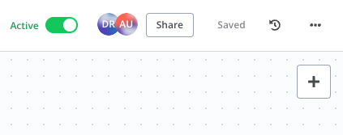
    <figcaption>Collaboration avatars</figcaption>
</figure>



For full release details, refer to [Releases](https://github.com/n8n-io/n8n/releases) on GitHub.

## n8n@1.57.0 <a href="#n8n1570" id="n8n1570"></a>

View the [commits](https://github.com/n8n-io/n8n/compare/n8n@1.56.2...n8n@1.57.0) for this version.<br />
**Release date:** 2024-08-28

This release contains new features and bug fixes.


#### Improved execution queue handling <a href="#improved-execution-queue-handling" id="improved-execution-queue-handling"></a>

We are [exposing new execution queue metrics](https://app.gitbook.com/s/jm0ZYRpZIPWge2ZSiDYO/host-n8n/configure-n8n/basic-configuration/configuration-examples/enable-prometheus-metrics) to give users more visibility of the queue length. This helps to inform decisions on horizontal scaling, based on queue status. We have also made querying executions faster.




#### New credentials for the HTTP Request node <a href="#new-credentials-for-the-http-request-node" id="new-credentials-for-the-http-request-node"></a>

We added credential support for Datadog, Dynatrace, Elastic Security, Filescan, Iris, and Malcore to the HTTP Request node making it easier to use existing credentials.



We also made it easier to select workflows as tools when working with AI agents by implementing a new `workflow selector` parameter type.

For full release details, refer to [Releases](https://github.com/n8n-io/n8n/releases) on GitHub.

### Contributors <a href="#contributors" id="contributors"></a>

[Bram Kn](https://github.com/bramkn)

## n8n@1.56.2 <a href="#n8n1562" id="n8n1562"></a>

View the [commits](https://github.com/n8n-io/n8n/compare/n8n@1.56.1...n8n@1.56.2) for this version.<br />
**Release date:** 2024-08-26

This release contains a bug fix.

For full release details, refer to [Releases](https://github.com/n8n-io/n8n/releases) on GitHub.

## n8n@1.56.1 <a href="#n8n1561" id="n8n1561"></a>

View the [commits](https://github.com/n8n-io/n8n/compare/n8n@1.56.0...n8n@1.56.1) for this version.<br />
**Release date:** 2024-08-23

This release contains bug fixes.

For full release details, refer to [Releases](https://github.com/n8n-io/n8n/releases) on GitHub.

## n8n@1.56.0 <a href="#n8n1560" id="n8n1560"></a>

View the [commits](https://github.com/n8n-io/n8n/compare/n8n@1.55.3...n8n@1.56.0) for this version.<br />
**Release date:** 2024-08-21

This release contains node updates, security and bug fixes.

For full release details, refer to [Releases](https://github.com/n8n-io/n8n/releases) on GitHub.


### Contributors <a href="#contributors" id="contributors"></a>

[CodeShakingSheep](https://github.com/CodeShakingSheep)  
[Oz Weiss](https://github.com/thewizarodofoz)

For full release details, refer to [Releases](https://github.com/n8n-io/n8n/releases) on GitHub.

## n8n@1.55.3 <a href="#n8n1553" id="n8n1553"></a>

View the [commits](https://github.com/n8n-io/n8n/compare/n8n@1.55.2...n8n@1.55.3) for this version.<br />
**Release date:** 2024-08-16

This release contains bug fixes.

For full release details, refer to [Releases](https://github.com/n8n-io/n8n/releases) on GitHub.

## n8n@1.55.2 <a href="#n8n1552" id="n8n1552"></a>

View the [commits](https://github.com/n8n-io/n8n/compare/n8n@1.55.1...n8n@1.55.2) for this version.<br />
**Release date:** 2024-08-16

This release contains bug fixes.

For full release details, refer to [Releases](https://github.com/n8n-io/n8n/releases) on GitHub.

## n8n@1.55.1 <a href="#n8n1551" id="n8n1551"></a>

View the [commits](https://github.com/n8n-io/n8n/compare/n8n@1.55.0...n8n@1.55.1) for this version.<br />
**Release date:** 2024-08-15

This release contains bug fixes.

For full release details, refer to [Releases](https://github.com/n8n-io/n8n/releases) on GitHub.

## n8n@1.54.4 <a href="#n8n1544" id="n8n1544"></a>

View the [commits](https://github.com/n8n-io/n8n/compare/n8n@1.54.3...n8n@1.54.4) for this version.<br />
**Release date:** 2024-08-15

This release contains bug fixes.

For full release details, refer to [Releases](https://github.com/n8n-io/n8n/releases) on GitHub.

## n8n@1.54.3 <a href="#n8n1543" id="n8n1543"></a>

View the [commits](https://github.com/n8n-io/n8n/compare/n8n@1.54.2...n8n@1.54.3) for this version.<br />
**Release date:** 2024-08-15

This release contains bug fixes.

For full release details, refer to [Releases](https://github.com/n8n-io/n8n/releases) on GitHub.

## n8n@1.54.2 <a href="#n8n1542" id="n8n1542"></a>

View the [commits](https://github.com/n8n-io/n8n/compare/n8n@1.54.1...n8n@1.54.2) for this version.<br />
**Release date:** 2024-08-14

This release contains bug fixes.

For full release details, refer to [Releases](https://github.com/n8n-io/n8n/releases) on GitHub.

## n8n@1.55.0 <a href="#n8n1550" id="n8n1550"></a>

View the [commits](https://github.com/n8n-io/n8n/compare/n8n@1.54.1...n8n@1.55.0) for this version.<br />
**Release date:** 2024-08-14


**[Breaking change](https://github.com/n8n-io/n8n/blob/master/packages/cli/BREAKING-CHANGES.md)**

The N8N_BLOCK_FILE_ACCESS_TO_N8N_FILES environment variable now also blocks access to n8n's static cache directory at ~/.cache/n8n/public.

If you are writing to or reading from a file at n8n's static cache directory via a node, e.g. Read/Write Files from Disk, please update your node to use a different path.


This release contains a new feature, a new node, a node update and bug fixes.


#### Override the npm registry <a href="#override-the-npm-registry" id="override-the-npm-registry"></a>

This release adds the option to override the npm registry for installing community packages. This is a paid feature.

We now also prevent npm downloading community packages from a compromised npm registry by explicitly using --registry in all npm install commands.




#### New node: AI Transform <a href="#new-node-ai-transform" id="new-node-ai-transform"></a>

This release adds the [AI Transform node](https://app.gitbook.com/s/BKcbOzIWja8NfqKDcqHc/builtin/core-nodes/n8n-nodes-base.aitransform). Use the AI Transform node to generate code snippets based on your prompt. The AI is context-aware, understanding the workflow’s nodes and their data types. The node is only available on [Cloud plans](https://app.gitbook.com/s/jm0ZYRpZIPWge2ZSiDYO/use-n8n-cloud).




#### New node: Okta <a href="#new-node-okta" id="new-node-okta"></a>

This release adds the [Okta node](https://app.gitbook.com/s/BKcbOzIWja8NfqKDcqHc/builtin/app-nodes/n8n-nodes-base.okta). Use the Okta node to automate work in Okta and integrate Okta with other applications. n8n has built-in support for a wide range of Okta features, which includes creating, updating, and deleting users.



### Node updates <a href="#node-updates" id="node-updates"></a>
Enhanced node:

- [MySQL](https://app.gitbook.com/s/BKcbOzIWja8NfqKDcqHc/builtin/app-nodes/n8n-nodes-base.mysql)


This release also adds the new schema view for the expression editor modal.

For full release details, refer to [Releases](https://github.com/n8n-io/n8n/releases) on GitHub.

## n8n@1.54.1 <a href="#n8n1541" id="n8n1541"></a>

View the [commits](https://github.com/n8n-io/n8n/compare/n8n@1.54.0...n8n@1.54.1) for this version.<br />
**Release date:** 2024-08-13

This release contains a bug fix.

For full release details, refer to [Releases](https://github.com/n8n-io/n8n/releases) on GitHub.

## n8n@1.53.2 <a href="#n8n1532" id="n8n1532"></a>

View the [commits](https://github.com/n8n-io/n8n/compare/n8n@1.53.1...n8n@1.53.2) for this version.<br />
**Release date:** 2024-08-08

This release contains a bug fix.

For full release details, refer to [Releases](https://github.com/n8n-io/n8n/releases) on GitHub.

## n8n@1.54.0 <a href="#n8n1540" id="n8n1540"></a>

View the [commits](https://github.com/n8n-io/n8n/compare/n8n@1.53.1...n8n@1.54.0) for this version.<br />
**Release date:** 2024-08-07

This release contains new features, node enhancements, bug fixes and updates to our API.

### API update <a href="#api-update" id="api-update"></a>
Our [public REST API](https://app.gitbook.com/s/r7wKI4I1BgdBCuq5Cvcx/n8n-api) now supports additional operations:

- Create, delete, and edit roles for users
- Create, read, update and delete projects

Find the details in the [API reference](https://app.gitbook.com/s/r7wKI4I1BgdBCuq5Cvcx/n8n-api/api-reference).

### Contributors <a href="#contributors" id="contributors"></a>

[CodeShakingSheep](https://github.com/CodeShakingSheep)  
[Javier Ferrer González](https://github.com/JavierCane)  
[Mickaël Andrieu](https://github.com/mickaelandrieu)  
[Oz Weiss](https://github.com/thewizarodofoz)  
[Pemontto](https://github.com/pemontto)

For full release details, refer to [Releases](https://github.com/n8n-io/n8n/releases) on GitHub.

## n8n@1.45.2 <a href="#n8n1452" id="n8n1452"></a>

View the [commits](https://github.com/n8n-io/n8n/compare/n8n@1.45.1...n8n@1.45.2) for this version.<br />
**Release date:** 2024-08-06

This release contains a bug fix.

For full release details, refer to [Releases](https://github.com/n8n-io/n8n/releases) on GitHub.

## n8n@1.53.1 <a href="#n8n1531" id="n8n1531"></a>

View the [commits](https://github.com/n8n-io/n8n/compare/n8n@1.53.0...n8n@1.53.1) for this version.<br />
**Release date:** 2024-08-02

This release contains bug fixes.

For full release details, refer to [Releases](https://github.com/n8n-io/n8n/releases) on GitHub.

## n8n@1.53.0 <a href="#n8n1530" id="n8n1530"></a>

View the [commits](https://github.com/n8n-io/n8n/compare/n8n@1.52.2...n8n@1.53.0) for this version.<br />
**Release date:** 2024-07-31

This release contains new features, new nodes, node enhancements, bug fixes and updates to our API.


#### Added Google Cloud Platform Secrets Manager support <a href="#added-google-cloud-platform-secrets-manager-support" id="added-google-cloud-platform-secrets-manager-support"></a>

This release adds [Google Cloud Platform Secrets Manager](https://app.gitbook.com/s/wMJrGrimpx3PxCJpUswm/manage-credentials/use-external-secret-stores) to the list of external secret stores. We already support AWS secrets, Azure Key Vault, Infisical and HashiCorp Vault. External secret stores are available under an enterprise license.




#### New node: Information Extractor <a href="#new-node-information-extractor" id="new-node-information-extractor"></a>

This release adds the [Information Extractor node](https://app.gitbook.com/s/BKcbOzIWja8NfqKDcqHc/builtin/cluster-nodes/root-nodes/n8n-nodes-langchain.information-extractor). The node is specifically tailored for information extraction tasks. It uses Structured Output Parser under the hood, but provides a simpler way to extract information from text in a structured JSON form.




#### New node: Sentiment Analysis <a href="#new-node-sentiment-analysis" id="new-node-sentiment-analysis"></a>

This release adds the [Sentiment Analysis node](https://app.gitbook.com/s/BKcbOzIWja8NfqKDcqHc/builtin/cluster-nodes/root-nodes/n8n-nodes-langchain.sentimentanalysis). The node leverages LLMs to analyze and categorize the sentiment of input text. Users can easily integrate this node into their workflows to perform sentiment analysis on text data. The node is flexible enough to handle various use cases, from basic positive/negative classification to more nuanced sentiment categories.



### Node updates <a href="#node-updates" id="node-updates"></a>
Enhanced nodes:

- [Calendly Trigger](https://app.gitbook.com/s/BKcbOzIWja8NfqKDcqHc/builtin/trigger-nodes/n8n-nodes-base.calendlytrigger)
- [HTTP Request](https://app.gitbook.com/s/BKcbOzIWja8NfqKDcqHc/builtin/core-nodes/n8n-nodes-base.httprequest)
- [n8n Form Trigger](https://app.gitbook.com/s/BKcbOzIWja8NfqKDcqHc/builtin/core-nodes/n8n-nodes-base.formtrigger)
- [Shopify](https://app.gitbook.com/s/BKcbOzIWja8NfqKDcqHc/builtin/app-nodes/n8n-nodes-base.shopify)

### API update <a href="#api-update" id="api-update"></a>
Our [public REST API](https://app.gitbook.com/s/r7wKI4I1BgdBCuq5Cvcx/n8n-api) now supports additional operations:

- Create, read, and delete for variables
- Filtering workflows by project
- Transferring workflows

Find the details in the [API reference](https://app.gitbook.com/s/r7wKI4I1BgdBCuq5Cvcx/n8n-api/api-reference).

### Contributors <a href="#contributors" id="contributors"></a>

[feelgood-interface](https://github.com/feelgood-interface)  
[Oz Weiss](https://github.com/thewizarodofoz)

For full release details, refer to [Releases](https://github.com/n8n-io/n8n/releases) on GitHub.

## n8n@1.52.2 <a href="#n8n1522" id="n8n1522"></a>

View the [commits](https://github.com/n8n-io/n8n/compare/n8n@1.52.1...n8n@1.52.2) for this version.<br />
**Release date:** 2024-07-31

This release contains bug fixes.

For full release details, refer to [Releases](https://github.com/n8n-io/n8n/releases) on GitHub.

## n8n@1.52.1 <a href="#n8n1521" id="n8n1521"></a>

View the [commits](https://github.com/n8n-io/n8n/compare/n8n@1.52.0...n8n@1.52.1) for this version.<br />
**Release date:** 2024-07-26

This release contains bug fixes.

For full release details, refer to [Releases](https://github.com/n8n-io/n8n/releases) on GitHub.

## n8n@1.51.2 <a href="#n8n1512" id="n8n1512"></a>

View the [commits](https://github.com/n8n-io/n8n/compare/n8n@1.51.1...n8n@1.51.2) for this version.<br />
**Release date:** 2024-07-26

This release contains bug fixes.

For full release details, refer to [Releases](https://github.com/n8n-io/n8n/releases) on GitHub.

## n8n@1.52.0 <a href="#n8n1520" id="n8n1520"></a>

View the [commits](https://github.com/n8n-io/n8n/compare/n8n@1.51.1...n8n@1.52.0) for this version.<br />
**Release date:** 2024-07-25



**[Breaking change](https://github.com/n8n-io/n8n/blob/master/packages/cli/BREAKING-CHANGES.md)**

Prometheus metrics enabled via N8N_METRICS_INCLUDE_DEFAULT_METRICS and N8N_METRICS_INCLUDE_API_ENDPOINTS were fixed to include the default n8n_ prefix.

If you are using Prometheus metrics from these categories and are using a non-empty prefix, please update those metrics to match their new prefixed names.



This release contains new features, node enhancements and bug fixes.


#### Added Azure Key Vault support <a href="#added-azure-key-vault-support" id="added-azure-key-vault-support"></a>

This release adds [Azure Key Vault](https://app.gitbook.com/s/wMJrGrimpx3PxCJpUswm/manage-credentials/use-external-secret-stores) to the list of external secret stores. We already support AWS secrets, Infisical and HashiCorp Vault and are working on Google Secrets Manager. External secret stores are available under an enterprise license.



### Node updates <a href="#node-updates" id="node-updates"></a>
Enhanced nodes:

- [Pinecone Vector Store](https://app.gitbook.com/s/BKcbOzIWja8NfqKDcqHc/builtin/cluster-nodes/root-nodes/n8n-nodes-langchain.vectorstorepinecone)
- [Supabase Vector Store](https://app.gitbook.com/s/BKcbOzIWja8NfqKDcqHc/builtin/cluster-nodes/root-nodes/n8n-nodes-langchain.vectorstoresupabase)
- [Send Email](https://app.gitbook.com/s/BKcbOzIWja8NfqKDcqHc/builtin/core-nodes/n8n-nodes-base.sendemail)

Deprecated nodes:

- OpenAI Model: You can use the OpenAI Chat Model instead
- Google Palm Chat Model: You can use Google Vertex or Gemini instead
- Google Palm Model: You can use Google Vertex or Gemini instead


## n8n@1.51.1 <a href="#n8n1511" id="n8n1511"></a>

View the [commits](https://github.com/n8n-io/n8n/compare/n8n@1.51.0...n8n@1.51.1) for this version.<br />
**Release date:** 2024-07-23

This release contains bug fixes.

For full release details, refer to [Releases](https://github.com/n8n-io/n8n/releases) on GitHub.

## n8n@1.50.2 <a href="#n8n1502" id="n8n1502"></a>

View the [commits](https://github.com/n8n-io/n8n/compare/n8n@1.50.1...n8n@1.50.2) for this version.<br />
**Release date:** 2024-07-23

This release contains bug fixes.

For full release details, refer to [Releases](https://github.com/n8n-io/n8n/releases) on GitHub.

## n8n@1.51.0 <a href="#n8n1510" id="n8n1510"></a>

View the [commits](https://github.com/n8n-io/n8n/compare/n8n@1.50.1...n8n@1.51.0) for this version.<br />
**Release date:** 2024-07-18

This release contains new nodes, node enhancements and bug fixes.


#### New node: Text Classifier <a href="#new-node-text-classifier" id="new-node-text-classifier"></a>

This release adds the [Text Classifier node](https://app.gitbook.com/s/BKcbOzIWja8NfqKDcqHc/builtin/cluster-nodes/root-nodes/n8n-nodes-langchain.text-classifier).




#### New node: Postgres Chat Memory <a href="#new-node-postgres-chat-memory" id="new-node-postgres-chat-memory"></a>

This release adds the [Postgres Chat Memory node](https://app.gitbook.com/s/BKcbOzIWja8NfqKDcqHc/builtin/cluster-nodes/sub-nodes/n8n-nodes-langchain.memorypostgreschat).




#### New node: Google Vertex Chat Model <a href="#new-node-google-vertex-chat-model" id="new-node-google-vertex-chat-model"></a>

This release adds the [Google Vertex Chat Model node](https://app.gitbook.com/s/BKcbOzIWja8NfqKDcqHc/builtin/cluster-nodes/sub-nodes/n8n-nodes-langchain.lmchatgooglevertex).



For full release details, refer to [Releases](https://github.com/n8n-io/n8n/releases) on GitHub.

### Node updates <a href="#node-updates" id="node-updates"></a>
- Enhanced nodes: Asana

## n8n@1.50.1 <a href="#n8n1501" id="n8n1501"></a>

View the [commits](https://github.com/n8n-io/n8n/compare/n8n@1.50.0...n8n@1.50.1) for this version.<br />
**Release date:** 2024-07-16

This release contains bug fixes.

For full release details, refer to [Releases](https://github.com/n8n-io/n8n/releases) on GitHub.

## n8n@1.50.0 <a href="#n8n1500" id="n8n1500"></a>

View the [commits](https://github.com/n8n-io/n8n/compare/n8n@1.49.0...n8n@1.50.0) for this version.<br />
**Release date:** 2024-07-10

This release contains node enhancements and bug fixes.

### Node updates <a href="#node-updates" id="node-updates"></a>
- Enhanced nodes: Chat Trigger, Google Cloud Firestore, Qdrant Vector Store, Splunk, Telegram
- Deprecated node: Orbit (product shut down)

### Beta Feature Removal <a href="#beta-feature-removal" id="beta-feature-removal"></a>
The Ask AI beta feature for the HTTP Request node has been removed from this version

### Contributors <a href="#contributors" id="contributors"></a>
[Stanley Yoshinori Takamatsu](https://github.com/stanleytakamatsu)  
[CodeShakingSheep](https://github.com/CodeShakingSheep)  
[jeanpaul](https://github.com/jeanpaul)  
[adrian-martinez-onestic](https://github.com/adrian-martinez-onestic)  
[Malki Davis](https://github.com/mxdavis)


## n8n@1.49.0 <a href="#n8n1490" id="n8n1490"></a>

View the [commits](https://github.com/n8n-io/n8n/compare/n8n@1.48.3...n8n@1.49.0) for this version.<br />
**Release date:** 2024-07-03


This release contains a new node, node enhancements, and bug fixes.

### Node updates <a href="#node-updates" id="node-updates"></a>
- New node added: [Vector Store Tool](https://app.gitbook.com/s/BKcbOzIWja8NfqKDcqHc/builtin/cluster-nodes/sub-nodes/n8n-nodes-langchain.toolvectorstore) for the AI Agent
- Enhanced nodes: Zep Cloud Memory, Copper, Embeddings Cohere, GitHub, Merge, Zammad

For full release details, refer to [Releases](https://github.com/n8n-io/n8n/releases) on GitHub.

### Contributors <a href="#contributors" id="contributors"></a>
[Jochem](https://github.com/jvdweerthof)  
[KhDu](https://github.com/KhDu)  
[Nico Weichbrodt](https://github.com/envy)  
[Pavlo Paliychuk](https://github.com/paul-paliychuk)


## n8n@1.48.3 <a href="#n8n1483" id="n8n1483"></a>

View the [commits](https://github.com/n8n-io/n8n/compare/n8n@1.48.2...n8n@1.48.3) for this version.<br />
**Release date:** 2024-07-03


This release contains bug fixes.

For full release details, refer to [Releases](https://github.com/n8n-io/n8n/releases) on GitHub.

## n8n@1.47.3 <a href="#n8n1473" id="n8n1473"></a>

View the [commits](https://github.com/n8n-io/n8n/compare/n8n@1.47.2...n8n@1.47.3) for this version.<br />
**Release date:** 2024-07-03

This release contains bug fixes.

For full release details, refer to [Releases](https://github.com/n8n-io/n8n/releases) on GitHub.

## n8n@1.48.2 <a href="#n8n1482" id="n8n1482"></a>

View the [commits](https://github.com/n8n-io/n8n/compare/n8n@1.48.1...n8n@1.48.2) for this version.<br />
**Release date:** 2024-07-01

This release contains bug fixes.

For full release details, refer to [Releases](https://github.com/n8n-io/n8n/releases) on GitHub.

## n8n@1.47.2 <a href="#n8n1472" id="n8n1472"></a>

View the [commits](https://github.com/n8n-io/n8n/compare/n8n@1.47.1...n8n@1.47.2) for this version.<br />
**Release date:** 2024-07-01

This release contains bug fixes.

For full release details, refer to [Releases](https://github.com/n8n-io/n8n/releases) on GitHub.

## n8n@1.48.1 <a href="#n8n1481" id="n8n1481"></a>

View the [commits](https://github.com/n8n-io/n8n/compare/n8n@1.48.0...n8n@1.48.1) for this version.<br />
**Release date:** 2024-06-27

This release contains bug fixes.

For full release details, refer to [Releases](https://github.com/n8n-io/n8n/releases) on GitHub.

## n8n@1.48.0 <a href="#n8n1480" id="n8n1480"></a>

View the [commits](https://github.com/n8n-io/n8n/compare/n8n@1.47.1...n8n@1.48.0) for this version.<br />
**Release date:** 2024-06-27


This release contains bug fixes and feature enhancements.

For full release details, refer to [Releases](https://github.com/n8n-io/n8n/releases) on GitHub.

### Contributors <a href="#contributors" id="contributors"></a>

[KubeAl](https://github.com/KubeAl)


## n8n@1.47.1 <a href="#n8n1471" id="n8n1471"></a>

View the [commits](https://github.com/n8n-io/n8n/compare/n8n@1.47.0...n8n@1.47.1) for this version.<br />
**Release date:** 2024-06-26

This is a bug fix release.

For full release details, refer to [Releases](https://github.com/n8n-io/n8n/releases) on GitHub.

## n8n@1.47.0 <a href="#n8n1470" id="n8n1470"></a>

View the [commits](https://github.com/n8n-io/n8n/compare/n8n@1.46.0...n8n@1.47.0) for this version.<br />
**Release date:** 2024-06-20


**Breaking change**

Calling `$(...).last()` (or `(...).first()` or `$(...).all()`) without arguments now returns the last item (or first or all items) of the output that connects two nodes. Previously, it returned the item/items of the first output of that node. Refer to the [breaking changes log](https://github.com/n8n-io/n8n/blob/master/packages/cli/BREAKING-CHANGES.md#1470) for details.


This release contains bug fixes, feature enhancements, a new node, node enhancements and performance improvements.

For full release details, refer to [Releases](https://github.com/n8n-io/n8n/releases) on GitHub.


#### New node: HTTP request tool <a href="#new-node-http-request-tool" id="new-node-http-request-tool"></a>

This release adds the HTTP request tool. You can use it with an AI agent as a tool to collect information from a website or API. Refer to the [HTTP request tool](https://app.gitbook.com/s/BKcbOzIWja8NfqKDcqHc/builtin/core-nodes/n8n-nodes-base.httprequest) for details.



### Contributors <a href="#contributors" id="contributors"></a>

[Daniel](https://github.com/daniel-alba17)  
[ekadin-mtc](https://github.com/ekadin-mtc)  
[Eric Francis](https://github.com/EricFrancis12)  
[Josh Sorenson](https://github.com/joshsorenson)  
Mohammad Alsmadi 
[Nikolai T. Jensen](https://github.com/ch0wm3in)  
[n8n-ninja](https://github.com/n8n-ninja)  
[pebosi](https://github.com/pebosi)  
[Taylor Hoffmann](https://github.com/TaylorHo)

## n8n@1.45.1 <a href="#n8n1451" id="n8n1451"></a>

View the [commits](https://github.com/n8n-io/n8n/compare/n8n@1.45.0...n8n@1.45.1) for this version.<br />
**Release date:** 2024-06-12


This is a bug fix release.

For full release details, refer to [Releases](https://github.com/n8n-io/n8n/releases) on GitHub.

## n8n@1.46.0 <a href="#n8n1460" id="n8n1460"></a>

View the [commits](https://github.com/n8n-io/n8n/compare/n8n@1.45.0...n8n@1.46.0) for this version.<br />
**Release date:** 2024-06-12


This release contains feature enhancements, node enhancements, and bug fixes.

For full release details, refer to [Releases](https://github.com/n8n-io/n8n/releases) on GitHub.

### Contributors <a href="#contributors" id="contributors"></a>

[Jean Khawand](https://github.com/jeankhawand)  
[pemontto](https://github.com/pemontto)  
[Valentin Coppin](https://github.com/valimero)

## n8n@1.44.2 <a href="#n8n1442" id="n8n1442"></a>

View the [commits](https://github.com/n8n-io/n8n/compare/n8n@1.44.1...n8n@1.44.2) for this version.<br />
**Release date:** 2024-06-12


This is a bug fix release.

For full release details, refer to [Releases](https://github.com/n8n-io/n8n/releases) on GitHub.

## n8n@1.42.2 <a href="#n8n1422" id="n8n1422"></a>

View the [commits](https://github.com/n8n-io/n8n/compare/n8n@1.42.1...n8n@1.42.2) for this version.<br />
**Release date:** 2024-06-10

This is a bug fix release.

For full release details, refer to [Releases](https://github.com/n8n-io/n8n/releases) on GitHub.

## n8n@1.45.0 <a href="#n8n1450" id="n8n1450"></a>

View the [commits](https://github.com/n8n-io/n8n/compare/n8n@1.44.1...n8n@1.45.0) for this version.<br />
**Release date:** 2024-06-06


This release contains new features, node enhancements, and bug fixes.


For full release details, refer to [Releases](https://github.com/n8n-io/n8n/releases) on GitHub.

## n8n@1.44.1 <a href="#n8n1441" id="n8n1441"></a>

View the [commits](https://github.com/n8n-io/n8n/compare/n8n@1.44.0...n8n@1.44.1) for this version.<br />
**Release date:** 2024-06-03

This is a bug fix release.

For full release details, refer to [Releases](https://github.com/n8n-io/n8n/releases) on GitHub.

## n8n@1.44.0 <a href="#n8n1440" id="n8n1440"></a>

View the [commits](https://github.com/n8n-io/n8n/compare/n8n@1.43.1...n8n@1.44.0) for this version.<br />
**Release date:** 2024-05-30


This release contains new features, node enhancements, and bug fixes.

For full release details, refer to [Releases](https://github.com/n8n-io/n8n/releases) on GitHub.

## n8n@1.43.1 <a href="#n8n1431" id="n8n1431"></a>

View the [commits](https://github.com/n8n-io/n8n/compare/n8n@1.43.0...n8n@1.43.1) for this version.<br />
**Release date:** 2024-05-28

This is a bug fix release.

For full release details, refer to [Releases](https://github.com/n8n-io/n8n/releases) on GitHub.

## n8n@1.43.0 <a href="#n8n1430" id="n8n1430"></a>

View the [commits](https://github.com/n8n-io/n8n/compare/n8n@1.42.1...n8n@1.43.0) for this version.<br />
**Release date:** 2024-05-22


This release contains new features, node enhancements, and bug fixes.


**Backup recommended**

Although this release doesn't include a breaking change, it is a significant update including database migrations. n8n recommends backing up your data before updating to this version.



**Credential sharing required for manual executions**

Instance owners and admins: you will see changes if you try to manually execute a workflow where the credentials aren't shared with you. Manual workflow executions now use the same permissions checks as production executions, meaning you can't do a manual execution of a workflow if you don't have access to the credentials. Previously, owners and admins could do manual executions without credentials being shared with them. To resolve this, the credential creator needs to [share the credential](https://app.gitbook.com/s/wMJrGrimpx3PxCJpUswm/manage-credentials/share-credentials-securely) with you.



#### New feature: Projects <a href="#new-feature-projects" id="new-feature-projects"></a>

With projects and roles, you can give your team access to collections of workflows and credentials, rather than having to share each workflow and credential individually. Simultaneously, you tighten security by limiting access to people on the relevant team.
<br /><br />
Refer to the [RBAC](https://app.gitbook.com/s/wMJrGrimpx3PxCJpUswm/manage-users-and-access/set-permissions-and-roles-rbac) documentation for information on creating projects and using roles.
<br /><br />
The number of projects and role types vary depending on your plan. Refer to [Pricing](https://n8n.io/pricing/) for details.

<video src="/_video/release-notes/rbac-glimpse.mp4" controls width="100%"></video>




#### New node: Slack Trigger <a href="#new-node-slack-trigger" id="new-node-slack-trigger"></a>

This release adds a trigger node for Slack. Refer to the [Slack Trigger documentation](https://app.gitbook.com/s/BKcbOzIWja8NfqKDcqHc/builtin/trigger-nodes/n8n-nodes-base.slacktrigger) for details.



### Other highlights <a href="#other-highlights" id="other-highlights"></a>

* Improved [memory support for OpenAI assistants](https://app.gitbook.com/s/BKcbOzIWja8NfqKDcqHc/builtin/app-nodes/n8n-nodes-langchain.openai).

### Rolling back to a previous version <a href="#rolling-back-to-a-previous-version" id="rolling-back-to-a-previous-version"></a>

If you update to this version, then decide you need to role back:

Self-hosted n8n:

1. Delete any RBAC projects you created.
2. Revert the database migrations using `n8n db:revert`.

Cloud: contact [help@n8n.io](mailto:help@n8n.io).

### Contributors <a href="#contributors" id="contributors"></a>

[Ayato Hayashi](https://github.com/hayashi-ay)  
[Daniil Zobov](https://github.com/ddzobov)  
[Guilherme Barile](https://github.com/GuilhermeBarile)  
[Romain MARTINEAU](https://github.com/RJiraya)


## n8n@1.42.1 <a href="#n8n1421" id="n8n1421"></a>

View the [commits](https://github.com/n8n-io/n8n/compare/n8n@1.42.0...n8n@1.42.1) for this version.<br />
**Release date:** 2024-05-20


This is a bug fix release.

For full release details, refer to [Releases](https://github.com/n8n-io/n8n/releases) on GitHub.

## n8n@1.41.1 <a href="#n8n1411" id="n8n1411"></a>

View the [commits](https://github.com/n8n-io/n8n/compare/n8n@1.41.0...n8n@1.41.1) for this version.<br />
**Release date:** 2024-05-16


This is a bug fix release.

For full release details, refer to [Releases](https://github.com/n8n-io/n8n/releases) on GitHub.

## n8n@1.42.0 <a href="#n8n1420" id="n8n1420"></a>

View the [commits](https://github.com/n8n-io/n8n/compare/n8n@1.41.0...n8n@1.42.0) for this version.<br />
**Release date:** 2024-05-15


This release contains new features, node enhancements, and bug fixes.

Note that this release removes the AI error debugger. We're working on a new and improved version.


#### New feature: Tools Agent <a href="#new-feature-tools-agent" id="new-feature-tools-agent"></a>

This release adds a new option to the Agent node: the [Tools Agent](https://app.gitbook.com/s/BKcbOzIWja8NfqKDcqHc/builtin/cluster-nodes/root-nodes/n8n-nodes-langchain.agent/tools-agent).

This agent has an enhanced ability to work with tools, and can ensure a standard output format. This is now the recommended default agent.



For full release details, refer to [Releases](https://github.com/n8n-io/n8n/releases) on GitHub.

### Contributors <a href="#contributors" id="contributors"></a>

[Mike Quinlan](https://github.com/mjquinlan2000)  
[guangwu](https://github.com/testwill)

## n8n@1.41.0 <a href="#n8n1410" id="n8n1410"></a>

View the [commits](https://github.com/n8n-io/n8n/compare/n8n@1.40.0...n8n@1.41.0) for this version.<br />
**Release date:** 2024-05-08


This release contains new features, node enhancements, and bug fixes.

Note that this release temporarily disables the AI error helper.

For full release details, refer to [Releases](https://github.com/n8n-io/n8n/releases) on GitHub.

### Contributors <a href="#contributors" id="contributors"></a>

[Florin Lungu](https://github.com/floryn90)

## n8n@1.40.0 <a href="#n8n1400" id="n8n1400"></a>

View the [commits](https://github.com/n8n-io/n8n/compare/n8n@1.39.1...n8n@1.40.0) for this version.<br />
**Release date:** 2024-05-02


**Breaking change**

Please note that this version contains a breaking change for instances using a Postgres database. The default value for the DB_POSTGRESDB_USER environment variable was switched from `root` to `postgres`. Refer to the [breaking changes log](https://github.com/n8n-io/n8n/blob/master/packages/cli/BREAKING-CHANGES.md#1400) for details.


This release contains new features, new nodes, node enhancements, and bug fixes.


#### New feature: Ask AI in the HTTP node <a href="#new-feature-ask-ai-in-the-http-node" id="new-feature-ask-ai-in-the-http-node"></a>

You can now ask AI to help create API requests in the HTTP Request node:

1. In the HTTP Request node, select **Ask AI**.
1. Enter the **Service** and **Request** you want to use. For example, to use the NASA API to get their picture of the day, enter `NASA` in **Service** and `get picture of the day` in **Request**.
1. Check the parameters: the AI tries to fill them out, but you may still need to adjust or correct the configuration.

Self-hosted users need to [enable AI features and provide their own API keys](https://app.gitbook.com/s/jm0ZYRpZIPWge2ZSiDYO/host-n8n/configure-n8n/basic-configuration/use-environment-variables)




#### New node: Groq Chat Model <a href="#new-node-groq-chat-model" id="new-node-groq-chat-model"></a>

This release adds the [Groq Chat Model node](https://app.gitbook.com/s/BKcbOzIWja8NfqKDcqHc/builtin/cluster-nodes/sub-nodes/n8n-nodes-langchain.lmchatgroq).



For full release details, refer to [Releases](https://github.com/n8n-io/n8n/releases) on GitHub.

### Contributors <a href="#contributors" id="contributors"></a>

[Alberto Pasqualetto](https://github.com/albertopasqualetto)  
[Bram Kn](https://github.com/bramkn)  
[CodeShakingSheep](https://github.com/CodeShakingSheep)  
[Nicolas-nwb](https://github.com/Nicolas-nwb)  
[pemontto](https://github.com/pemontto)  
[pengqiseven](https://github.com/pengqiseven)  
[webk](https://github.com/webkp)  
[Yoshino-s](https://github.com/Yoshino-s)


## n8n@1.39.1 <a href="#n8n1391" id="n8n1391"></a>

View the [commits](https://github.com/n8n-io/n8n/compare/n8n@1.39.0...n8n@1.39.1) for this version.<br />
**Release date:** 2024-04-25


This release contains bug fixes.

For full release details, refer to [Releases](https://github.com/n8n-io/n8n/releases) on GitHub.

## n8n@1.38.2 <a href="#n8n1382" id="n8n1382"></a>

View the [commits](https://github.com/n8n-io/n8n/compare/n8n@1.38.1...n8n@1.38.2) for this version.<br />
**Release date:** 2024-04-25


This release contains bug fixes.

For full release details, refer to [Releases](https://github.com/n8n-io/n8n/releases) on GitHub.

## n8n@1.37.4 <a href="#n8n1374" id="n8n1374"></a>

View the [commits](https://github.com/n8n-io/n8n/compare/n8n@1.37.3...n8n@1.37.4) for this version.<br />
**Release date:** 2024-04-25

This release contains bug fixes.

For full release details, refer to [Releases](https://github.com/n8n-io/n8n/releases) on GitHub.

## n8n@1.39.0 <a href="#n8n1390" id="n8n1390"></a>


View the [commits](https://github.com/n8n-io/n8n/compare/n8n@1.38.1...n8n@1.39.0) for this version.<br />
**Release date:** 2024-04-24

This release contains new nodes, node enhancements, and bug fixes.


#### New node: WhatsApp Trigger <a href="#new-node-whatsapp-trigger" id="new-node-whatsapp-trigger"></a>

This release adds the [WhatsApp Trigger node](https://app.gitbook.com/s/BKcbOzIWja8NfqKDcqHc/builtin/trigger-nodes/n8n-nodes-base.whatsapptrigger).




#### Node enhancement: Multiple methods, one Webhook node <a href="#node-enhancement-multiple-methods-one-webhook-node" id="node-enhancement-multiple-methods-one-webhook-node"></a>

The Webhook Trigger node can now handle calls to multiple HTTP methods. Refer to the [Webhook node documentation](https://app.gitbook.com/s/BKcbOzIWja8NfqKDcqHc/builtin/core-nodes/n8n-nodes-base.webhook/common-issues#listen-for-multiple-http-methods) for information on enabling this.



For full release details, refer to [Releases](https://github.com/n8n-io/n8n/releases) on GitHub.

### Contributors <a href="#contributors" id="contributors"></a>

[Bram Kn](https://github.com/bramkn)

## n8n@1.38.1 <a href="#n8n1381" id="n8n1381"></a>


View the [commits](https://github.com/n8n-io/n8n/compare/n8n@1.38.0...n8n@1.38.1) for this version.<br />
**Release date:** 2024-04-18

This release contains bug fixes.

For full release details, refer to [Releases](https://github.com/n8n-io/n8n/releases) on GitHub.

## n8n@1.37.3 <a href="#n8n1373" id="n8n1373"></a>

View the [commits](https://github.com/n8n-io/n8n/compare/n8n@1.37.2...n8n@1.37.3) for this version.<br />
**Release date:** 2024-04-18


This release contains bug fixes.

For full release details, refer to [Releases](https://github.com/n8n-io/n8n/releases) on GitHub.

## n8n@1.38.0 <a href="#n8n1380" id="n8n1380"></a>

View the [commits](https://github.com/n8n-io/n8n/compare/n8n@1.37.2...n8n@1.38.0) for this version.<br />
**Release date:** 2024-04-17

This release contains new nodes, bug fixes, and node enhancements.


#### New node: Google Gemini Chat Model <a href="#new-node-google-gemini-chat-model" id="new-node-google-gemini-chat-model"></a>

This release adds the [Google Gemini Chat Model sub-node](https://app.gitbook.com/s/BKcbOzIWja8NfqKDcqHc/builtin/cluster-nodes/sub-nodes/n8n-nodes-langchain.lmchatgooglegemini).




#### New node: Embeddings Google Gemini <a href="#new-node-embeddings-google-gemini" id="new-node-embeddings-google-gemini"></a>

This release adds the [Google Gemini Embeddings sub-node](https://app.gitbook.com/s/BKcbOzIWja8NfqKDcqHc/builtin/cluster-nodes/sub-nodes/n8n-nodes-langchain.embeddingsgooglegemini).



For full release details, refer to [Releases](https://github.com/n8n-io/n8n/releases) on GitHub.

### Contributors <a href="#contributors" id="contributors"></a>

[Chengyou Liu](https://github.com/cyliu0)  
[Francesco Mannino](https://github.com/manninofrancesco)

## n8n@1.37.2 <a href="#n8n1372" id="n8n1372"></a>

View the [commits](https://github.com/n8n-io/n8n/compare/n8n@1.37.1...n8n@1.37.2) for this version.<br />
**Release date:** 2024-04-17

This release contains bug fixes.

For full release details, refer to [Releases](https://github.com/n8n-io/n8n/releases) on GitHub.

## n8n@1.36.4 <a href="#n8n1364" id="n8n1364"></a>

View the [commits](https://github.com/n8n-io/n8n/compare/n8n@1.36.3...n8n@1.36.4) for this version.<br />
**Release date:** 2024-04-15

This release contains bug fixes.

For full release details, refer to [Releases](https://github.com/n8n-io/n8n/releases) on GitHub.


## n8n@1.36.3 <a href="#n8n1363" id="n8n1363"></a>

View the [commits](https://github.com/n8n-io/n8n/compare/n8n@1.36.2...n8n@1.36.3) for this version.<br />
**Release date:** 2024-04-12

This release contains bug fixes.

For full release details, refer to [Releases](https://github.com/n8n-io/n8n/releases) on GitHub.

## n8n@1.37.1 <a href="#n8n1371" id="n8n1371"></a>

View the [commits](https://github.com/n8n-io/n8n/compare/n8n@1.37.0...n8n@1.37.1) for this version.<br />
**Release date:** 2024-04-11



**Breaking change**

Please note that this version contains a breaking change for self-hosted n8n. It removes the `--file` flag for the `execute` CLI command. If you have scripts relying on the `--file` flag, update them to first import the workflow and then execute it using the `--id` flag. Refer to [CLI commands](https://app.gitbook.com/s/jm0ZYRpZIPWge2ZSiDYO/host-n8n/configure-n8n/use-the-command-line) for more information on CLI options.


This release contains bug fixes.

For full release details, refer to [Releases](https://github.com/n8n-io/n8n/releases) on GitHub.


## n8n@1.36.2 <a href="#n8n1362" id="n8n1362"></a>

View the [commits](https://github.com/n8n-io/n8n/compare/n8n@1.36.1...n8n@1.36.2) for this version.<br />
**Release date:** 2024-04-11

This release contains bug fixes.

For full release details, refer to [Releases](https://github.com/n8n-io/n8n/releases) on GitHub.

## n8n@1.37.0 <a href="#n8n1370" id="n8n1370"></a>

View the [commits](https://github.com/n8n-io/n8n/compare/n8n@1.36.1...n8n@1.37.0) for this version.<br />
**Release date:** 2024-04-10



**Breaking change**

Please note that this version contains a breaking change for self-hosted n8n. It removes the `--file` flag for the `execute` CLI command. If you have scripts relying on the `--file` flag, update them to first import the workflow and then execute it using the `--id` flag. Refer to [CLI commands](https://app.gitbook.com/s/jm0ZYRpZIPWge2ZSiDYO/host-n8n/configure-n8n/use-the-command-line) for more information on CLI options.


This release contains a new node, improvements to error handling and messaging, node enhancements, and bug fixes.


#### New node: JWT <a href="#new-node-jwt" id="new-node-jwt"></a>

This release adds the [JWT core node](https://app.gitbook.com/s/BKcbOzIWja8NfqKDcqHc/builtin/core-nodes/n8n-nodes-base.jwt).



For full release details, refer to [Releases](https://github.com/n8n-io/n8n/releases) on GitHub.

### Contributors <a href="#contributors" id="contributors"></a>

[Miguel Prytoluk](https://github.com/mprytoluk)

## n8n@1.36.1 <a href="#n8n1361" id="n8n1361"></a>

View the [commits](https://github.com/n8n-io/n8n/compare/n8n@1.36.0...n8n@1.36.1) for this version.<br />
**Release date:** 2024-04-04


This release contains bug fixes.

For full release details, refer to [Releases](https://github.com/n8n-io/n8n/releases) on GitHub.

## n8n@1.36.0 <a href="#n8n1360" id="n8n1360"></a>

View the [commits](https://github.com/n8n-io/n8n/compare/n8n@1.35.0...n8n@1.36.0) for this version.<br />
**Release date:** 2024-04-03

This release contains new nodes, enhancements and bug fixes.


#### New node: Salesforce Trigger node <a href="#new-node-salesforce-trigger-node" id="new-node-salesforce-trigger-node"></a>

This release adds the [Salesforce Trigger node](https://app.gitbook.com/s/BKcbOzIWja8NfqKDcqHc/builtin/trigger-nodes/n8n-nodes-base.salesforcetrigger).




#### New node: Twilio Trigger node <a href="#new-node-twilio-trigger-node" id="new-node-twilio-trigger-node"></a>

This release adds the [Twilio Trigger node](https://app.gitbook.com/s/BKcbOzIWja8NfqKDcqHc/builtin/trigger-nodes/n8n-nodes-base.twiliotrigger).



For full release details, refer to [Releases](https://github.com/n8n-io/n8n/releases) on GitHub.

## n8n@1.35.0 <a href="#n8n1350" id="n8n1350"></a>

View the [commits](https://github.com/n8n-io/n8n/compare/n8n@1.34.2...n8n@1.35.0) for this version.<br />
**Release date:** 2024-03-28


This release contains enhancements and bug fixes.

For full release details, refer to [Releases](https://github.com/n8n-io/n8n/releases) on GitHub.

## n8n@1.34.2 <a href="#n8n1342" id="n8n1342"></a>

View the [commits](https://github.com/n8n-io/n8n/compare/n8n@1.34.1...n8n@1.34.2) for this version.<br />
**Release date:** 2024-03-26


This release contains bug fixes.

For full release details, refer to [Releases](https://github.com/n8n-io/n8n/releases) on GitHub.

## n8n@1.34.1 <a href="#n8n1341" id="n8n1341"></a>

View the [commits](https://github.com/n8n-io/n8n/compare/n8n@1.34.0...n8n@1.34.1) for this version.<br />
**Release date:** 2024-03-25


This release contains bug fixes.

For full release details, refer to [Releases](https://github.com/n8n-io/n8n/releases) on GitHub.

## n8n@1.34.0 <a href="#n8n1340" id="n8n1340"></a>

View the [commits](https://github.com/n8n-io/n8n/compare/n8n@1.33.1...n8n@1.34.0) for this version.<br />
**Release date:** 2024-03-20

This release contains new features, new nodes, and bug fixes.


#### New node: Microsoft OneDrive Trigger node <a href="#new-node-microsoft-onedrive-trigger-node" id="new-node-microsoft-onedrive-trigger-node"></a>

This release adds the [Microsoft OneDrive Trigger node](https://app.gitbook.com/s/BKcbOzIWja8NfqKDcqHc/builtin/trigger-nodes/n8n-nodes-base.microsoftonedrivetrigger). You can now trigger workflows on file and folder creation and update events.




#### New data transformation functions <a href="#new-data-transformation-functions" id="new-data-transformation-functions"></a>

This release introduces new data transformation functions:

**String**

```js
toDateTime() //replaces toDate(). toDate() is retained for backwards compatability.
parseJson()
extractUrlPath()
toBoolean()
base64Encode()
base64Decode()
```

**Number**

```js
toDateTime()
toBoolean()
```

**Object**

```js
toJsonString()
```

**Array**

```js
toJsonString()
```

**Date & DateTime**

```js
toDateTime()
toInt()
```

**Boolean**

```js
toInt()
```



### Contributors <a href="#contributors" id="contributors"></a>

[Bram Kn](https://github.com/bramkn)  
[pemontto](https://github.com/pemontto)

## n8n@1.33.1 <a href="#n8n1331" id="n8n1331"></a>

View the [commits](https://github.com/n8n-io/n8n/compare/n8n@1.33.0...n8n@1.33.1) for this version.<br />
**Release date:** 2024-03-15


This release contains bug fixes.

For full release details, refer to [Releases](https://github.com/n8n-io/n8n/releases) on GitHub.

## n8n@1.32.2 <a href="#n8n1322" id="n8n1322"></a>

View the [commits](https://github.com/n8n-io/n8n/compare/n8n@1.32.1...n8n@1.32.2) for this version.<br />
**Release date:** 2024-03-15


This release contains bug fixes.

For full release details, refer to [Releases](https://github.com/n8n-io/n8n/releases) on GitHub.

## n8n@1.33.0 <a href="#n8n1330" id="n8n1330"></a>

View the [commits](https://github.com/n8n-io/n8n/compare/n8n@1.32.1...n8n@1.33.0) for this version.<br />
**Release date:** 2024-03-13

This release contains new features, node enhancements, and bug fixes.


#### Support for Claude 3 <a href="#support-for-claude-3" id="support-for-claude-3"></a>

This release adds support for Claude 3 to the [Anthropic Chat Model](https://app.gitbook.com/s/BKcbOzIWja8NfqKDcqHc/builtin/cluster-nodes/sub-nodes/n8n-nodes-langchain.lmchatanthropic) node.



For full release details, refer to [Releases](https://github.com/n8n-io/n8n/releases) on GitHub.

### Contributors <a href="#contributors" id="contributors"></a>

[gumida](https://github.com/gumida)  
[Ayato Hayashi](https://github.com/hayashi-ay)  
[Jordan](https://github.com/jordanburke)  
[MC Naveen](https://github.com/mcnaveen)

## n8n@1.32.1 <a href="#n8n1321" id="n8n1321"></a>

View the [commits](https://github.com/n8n-io/n8n/compare/n8n@1.32.0...n8n@1.32.1) for this version.<br />
**Release date:** 2024-03-07


This is a bug fix release.

For full release details, refer to [Releases](https://github.com/n8n-io/n8n/releases) on GitHub.

## n8n@1.31.2 <a href="#n8n1312" id="n8n1312"></a>

View the [commits](https://github.com/n8n-io/n8n/compare/n8n@1.31.1...n8n@1.31.2) for this version.<br />
**Release date:** 2024-03-07


This is a bug fix release.

For full release details, refer to [Releases](https://github.com/n8n-io/n8n/releases) on GitHub.

## n8n@1.32.0 <a href="#n8n1320" id="n8n1320"></a>

View the [commits](https://github.com/n8n-io/n8n/compare/n8n@1.31.1...n8n@1.32.0) for this version.<br />
**Release date:** 2024-03-06

This release contains new features, node enhancements, performance improvements, and bug fixes.

For full release details, refer to [Releases](https://github.com/n8n-io/n8n/releases) on GitHub.

## n8n@1.31.1 <a href="#n8n1311" id="n8n1311"></a>

View the [commits](https://github.com/n8n-io/n8n/compare/n8n@1.31.0...n8n@1.31.1) for this version.<br />
**Release date:** 2024-03-06


**Breaking changes**

Please note that this version contains a breaking change. HTTP connections to the editor will fail on domains other than localhost. You can read more about it [here](https://github.com/n8n-io/n8n/blob/master/packages/cli/BREAKING-CHANGES.md#1320).


This is a bug fix release and it contains a breaking change.

For full release details, refer to [Releases](https://github.com/n8n-io/n8n/releases) on GitHub.

## n8n@1.31.0 <a href="#n8n1310" id="n8n1310"></a>

View the [commits](https://github.com/n8n-io/n8n/compare/n8n@1.30.0...n8n@1.31.0) for this version.<br />
**Release date:** 2024-02-28

This release contains new features, new nodes, node enhancements and bug fixes.


#### New nodes: Microsoft Outlook trigger and Ollama embeddings <a href="#new-nodes-microsoft-outlook-trigger-and-ollama-embeddings" id="new-nodes-microsoft-outlook-trigger-and-ollama-embeddings"></a>

This release adds two new nodes.

* [Microsoft Outlook Trigger](https://app.gitbook.com/s/BKcbOzIWja8NfqKDcqHc/builtin/trigger-nodes/n8n-nodes-base.microsoftoutlooktrigger)
* [Ollama Embeddings](https://app.gitbook.com/s/BKcbOzIWja8NfqKDcqHc/builtin/cluster-nodes/sub-nodes/n8n-nodes-langchain.embeddingsollama)



For full release details, refer to [Releases](https://github.com/n8n-io/n8n/releases) on GitHub.


## n8n@1.30.1 <a href="#n8n1301" id="n8n1301"></a>

View the [commits](https://github.com/n8n-io/n8n/compare/n8n@1.30.0...n8n@1.30.1) for this version.<br />
**Release date:** 2024-02-23


This release contains bug fixes.

For full release details, refer to [Releases](https://github.com/n8n-io/n8n/releases) on GitHub.

## n8n@1.30.0 <a href="#n8n1300" id="n8n1300"></a>

View the [commits](https://github.com/n8n-io/n8n/compare/n8n@1.29.1...n8n@1.30.0) for this version.<br />
**Release date:** 2024-02-21


This release contains new features, node enhancements, and bug fixes.

For full release details, refer to [Releases](https://github.com/n8n-io/n8n/releases) on GitHub.

## n8n@1.29.1 <a href="#n8n1291" id="n8n1291"></a>

View the [commits](https://github.com/n8n-io/n8n/compare/n8n@1.29.0...n8n@1.29.1) for this version.<br />
**Release date:** 2024-02-16


This release contains bug fixes.

For full release details, refer to [Releases](https://github.com/n8n-io/n8n/releases) on GitHub.

## n8n@1.29.0 <a href="#n8n1290" id="n8n1290"></a>

View the [commits](https://github.com/n8n-io/n8n/compare/n8n@1.28.0...n8n@1.29.0) for this version.<br />
**Release date:** 2024-02-15

This release contains new features, node enhancements, and bug fixes.

For full release details, refer to [Releases](https://github.com/n8n-io/n8n/releases) on GitHub.

### New features <a href="#new-features" id="new-features"></a>


#### OpenAI node overhaul <a href="#openai-node-overhaul" id="openai-node-overhaul"></a>

This release includes a new version of the [OpenAI node](https://app.gitbook.com/s/BKcbOzIWja8NfqKDcqHc/builtin/app-nodes/n8n-nodes-langchain.openai), adding more operations, including support for working with assistants.



Other highlights:

* Support for AI events in [log streaming](https://app.gitbook.com/s/wMJrGrimpx3PxCJpUswm/observe-and-log/stream-logs-to-external-systems).
* Added support for workflow tags in the [public API](https://app.gitbook.com/s/r7wKI4I1BgdBCuq5Cvcx/n8n-api).

### Contributors <a href="#contributors" id="contributors"></a>

[Bruno Inec](https://github.com/sweenu)  
[Jesús Burgers](https://github.com/jburgers-chakray)

## n8n@1.27.3 <a href="#n8n1273" id="n8n1273"></a>

View the [commits](https://github.com/n8n-io/n8n/compare/n8n@1.27.2...n8n@1.27.3) for this version.<br />
**Release date:** 2024-02-15


This release contains bug fixes.

For full release details, refer to [Releases](https://github.com/n8n-io/n8n/releases) on GitHub.

## n8n@1.28.0 <a href="#n8n1280" id="n8n1280"></a>

View the [commits](https://github.com/n8n-io/n8n/compare/n8n@1.27.2...n8n@1.28.0) for this version.<br />
**Release date:** 2024-02-07


This release contains new features, new nodes, node enhancements and bug fixes.


#### New nodes: Azure OpenAI chat model and embeddings <a href="#new-nodes-azure-openai-chat-model-and-embeddings" id="new-nodes-azure-openai-chat-model-and-embeddings"></a>

This release adds two new nodes to work with [Azure OpenAI](https://azure.microsoft.com/en-gb/products/ai-services/openai-service/) in your advanced AI workflows:

* [Embeddings Azure OpenAI](https://app.gitbook.com/s/BKcbOzIWja8NfqKDcqHc/builtin/cluster-nodes/sub-nodes/n8n-nodes-langchain.embeddingsazureopenai)
* [Azure OpenAI Chat Model](https://app.gitbook.com/s/BKcbOzIWja8NfqKDcqHc/builtin/cluster-nodes/sub-nodes/n8n-nodes-langchain.lmchatazureopenai)



For full release details, refer to [Releases](https://github.com/n8n-io/n8n/releases) on GitHub.

### Contributors <a href="#contributors" id="contributors"></a>

[Andrea Ascari](https://github.com/ascariandrea)

## n8n@1.27.2 <a href="#n8n1272" id="n8n1272"></a>

View the [commits](https://github.com/n8n-io/n8n/compare/n8n@1.27.1...n8n@1.27.2) for this version.<br />
**Release date:** 2024-02-02

This release contains bug fixes.

For full release details, refer to [Releases](https://github.com/n8n-io/n8n/releases) on GitHub.

## n8n@1.27.1 <a href="#n8n1271" id="n8n1271"></a>

View the [commits](https://github.com/n8n-io/n8n/compare/n8n@1.26.0...n8n@1.27.1) for this version.<br />
**Release date:** 2024-01-31

This release contains new features, node enhancements, and bug fixes.

For full release details, refer to [Releases](https://github.com/n8n-io/n8n/releases) on GitHub.

## n8n@1.27.0 <a href="#n8n1270" id="n8n1270"></a>

View the [commits](https://github.com/n8n-io/n8n/compare/n8n@1.26.0...n8n@1.27.0) for this version.<br />
**Release date:** 2024-01-31


**Breaking change**

This release removes `own` mode for self-hosted n8n. You must now use `EXECUTIONS_MODE` and set to either `regular` or `queue`. Refer to [Queue mode](https://app.gitbook.com/s/jm0ZYRpZIPWge2ZSiDYO/host-n8n/configure-n8n/scaling/enable-queue-mode) for information on configuring queue mode.



**Skip this release**

Please upgrade directly to 1.27.1.


This release contains node enhancements and bug fixes.

For full release details, refer to [Releases](https://github.com/n8n-io/n8n/releases) on GitHub.

## n8n@1.26.0 <a href="#n8n1260" id="n8n1260"></a>

View the [commits](https://github.com/n8n-io/n8n/compare/n8n@1.25.1...n8n@1.26.0) for this version.<br />
**Release date:** 2024-01-24

This release contains new features, node enhancements, and bug fixes.

For full release details, refer to [Releases](https://github.com/n8n-io/n8n/releases) on GitHub.

### Contributors <a href="#contributors" id="contributors"></a>

[Daniel Schröder](https://github.com/schroedan)  
[Nihaal Sangha](https://github.com/nihaals)

## n8n@1.25.1 <a href="#n8n1251" id="n8n1251"></a>

View the [commits](https://github.com/n8n-io/n8n/compare/n8n@1.25.0...n8n@1.25.1) for this version.<br />
**Release date:** 2024-01-22

This is a bug fix release.

For full release details, refer to [Releases](https://github.com/n8n-io/n8n/releases) on GitHub.

### Contributors <a href="#contributors" id="contributors"></a>

[Nihaal Sangha](https://github.com/nihaals)

## n8n@1.25.0 <a href="#n8n1250" id="n8n1250"></a>

View the [commits](https://github.com/n8n-io/n8n/compare/n8n@1.24.1...n8n@1.25.0) for this version.<br />
**Release date:** 2024-01-17

This release contains a new node, feature improvements, and bug fixes.


#### New node: Chat Memory Manager <a href="#new-node-chat-memory-manager" id="new-node-chat-memory-manager"></a>

The [Chat Memory Manager](https://app.gitbook.com/s/BKcbOzIWja8NfqKDcqHc/builtin/cluster-nodes/sub-nodes/n8n-nodes-langchain.memorymanager) node replaces the Chat Messages Retriever node. It manages chat message memories within your AI workflows.



For full release details, refer to [Releases](https://github.com/n8n-io/n8n/releases) on GitHub.

## n8n@1.24.1 <a href="#n8n1241" id="n8n1241"></a>

View the [commits](https://github.com/n8n-io/n8n/compare/n8n@1.24.0...n8n@1.24.1) for this version.<br />
**Release date:** 2024-01-16

This is a bug fix release.

For full release details, refer to [Releases](https://github.com/n8n-io/n8n/releases) on GitHub.

## n8n@1.22.6 <a href="#n8n1226" id="n8n1226"></a>

View the [commits](https://github.com/n8n-io/n8n/compare/n8n@1.22.5...n8n@1.22.6) for this version.<br />
**Release date:** 2024-01-10

This is a bug fix release. It includes important fixes for the HTTP Request and monday.com nodes.

For full release details, refer to [Releases](https://github.com/n8n-io/n8n/releases) on GitHub.

## n8n@1.24.0 <a href="#n8n1240" id="n8n1240"></a>

View the [commits](https://github.com/n8n-io/n8n/compare/n8n@1.23.0...n8n@1.24.0) for this version.<br />
**Release date:** 2024-01-10


This release contains new nodes for advanced AI, node enhancements, new features, performance enhancements, and bug fixes.


#### Chat trigger <a href="#chat-trigger" id="chat-trigger"></a>

n8n has created a new [Chat Trigger node](https://app.gitbook.com/s/BKcbOzIWja8NfqKDcqHc/builtin/core-nodes/n8n-nodes-base.compression/n8n-nodes-base.compression). The new node provides a chat interface that you can make publicly available, with customization and authentication options.




#### Mistral Cloud Chat and Embeddings <a href="#mistral-cloud-chat-and-embeddings" id="mistral-cloud-chat-and-embeddings"></a>

This release introduces two new nodes to support [Mistral AI](https://mistral.ai/):

* [Mistral Cloud Chat Model](https://app.gitbook.com/s/BKcbOzIWja8NfqKDcqHc/builtin/cluster-nodes/sub-nodes/n8n-nodes-langchain.lmchatmistralcloud)
* [Embeddings Mistral Cloud](https://app.gitbook.com/s/BKcbOzIWja8NfqKDcqHc/builtin/cluster-nodes/sub-nodes/n8n-nodes-langchain.embeddingsmistralcloud)



### Contributors <a href="#contributors" id="contributors"></a>

[Anush](https://github.com/Anush008)  
[Eric Koleda](https://github.com/ekoleda-codaio)  
[Mason Geloso](https://github.com/MasonGeloso)  
[vacitbaydarman](https://github.com/vacitbaydarman)

## n8n@1.22.5 <a href="#n8n1225" id="n8n1225"></a>

View the [commits](https://github.com/n8n-io/n8n/compare/n8n@1.22.4...n8n@1.22.5) for this version.<br />
**Release date:** 2024-01-09

This is a bug fix release.

For full release details, refer to [Releases](https://github.com/n8n-io/n8n/releases) on GitHub.


## n8n@1.23.0 <a href="#n8n1230" id="n8n1230"></a>

View the [commits](https://github.com/n8n-io/n8n/compare/n8n@1.22.4...n8n@1.23.0) for this version.<br />
**Release date:** 2024-01-03

This release contains new nodes, node enhancements, new features, and bug fixes.


#### New nodes and improved experience for working with files <a href="#new-nodes-and-improved-experience-for-working-with-files" id="new-nodes-and-improved-experience-for-working-with-files"></a>

This release includes a major overhaul of nodes relating to files (binary data).

There are now three key nodes dedicated to handling binary data files:

- [Read/Write Files from Disk](https://app.gitbook.com/s/BKcbOzIWja8NfqKDcqHc/builtin/core-nodes/n8n-nodes-base.readwritefile) to read and write files from/to the machine where n8n is running.
- [Convert to File](https://app.gitbook.com/s/BKcbOzIWja8NfqKDcqHc/builtin/core-nodes/n8n-nodes-base.converttofile) to take input data and output it as a file.
- [Extract From File](https://app.gitbook.com/s/BKcbOzIWja8NfqKDcqHc/builtin/core-nodes/n8n-nodes-base.extractfromfile) to get data from a binary format and convert it to JSON.

n8n has moved support for iCalendar, PDF, and spreadsheet formats into these nodes, and removed the iCalendar, Read PDF, and Spreadsheet File nodes. There are still standalone nodes for [HTML](https://app.gitbook.com/s/BKcbOzIWja8NfqKDcqHc/builtin/core-nodes/n8n-nodes-base.html) and [XML](https://app.gitbook.com/s/BKcbOzIWja8NfqKDcqHc/builtin/core-nodes/n8n-nodes-base.xml).




#### New node: Qdrant vector store <a href="#new-node-qdrant-vector-store" id="new-node-qdrant-vector-store"></a>

This release adds support for [Qdrant](https://qdrant.tech/) with the Qdrant vector store node.

Read n8n's [Qdrant vector store node documentation](https://app.gitbook.com/s/BKcbOzIWja8NfqKDcqHc/builtin/cluster-nodes/root-nodes/n8n-nodes-langchain.vectorstoreqdrant)



### Contributors <a href="#contributors" id="contributors"></a>


[Aaron Gutierrez](https://github.com/aarongut)  
[Advaith Gundu](https://github.com/geodic)  
[Anush](https://github.com/Anush008)  
[Bin](https://github.com/soulhat)  
[Nihaal Sangha](https://github.com/nihaals)


## n8n@1.22.4 <a href="#n8n1224" id="n8n1224"></a>

View the [commits](https://github.com/n8n-io/n8n/compare/n8n@1.22.3...n8n@1.22.4) for this version.<br />
**Release date:** 2024-01-03


This is a bug fix release.

For full release details, refer to [Releases](https://github.com/n8n-io/n8n/releases) on GitHub.

## n8n@1.22.3 <a href="#n8n1223" id="n8n1223"></a>

View the [commits](https://github.com/n8n-io/n8n/compare/n8n@1.22.2...n8n@1.22.3) for this version.<br />
**Release date:** 2023-12-27


**Upgrade directly to 1.22.4**

Due to issues with this release, upgrade directly to 1.22.4.


This is a bug fix release.

For full release details, refer to [Releases](https://github.com/n8n-io/n8n/releases) on GitHub.

## n8n@1.22.2 <a href="#n8n1222" id="n8n1222"></a>

View the [commits](https://github.com/n8n-io/n8n/compare/n8n@1.22.1...n8n@1.22.2) for this version.<br />
**Release date:** 2023-12-27


**Upgrade directly to 1.22.4**

Due to issues with this release, upgrade directly to 1.22.4.


This is a bug fix release.

For full release details, refer to [Releases](https://github.com/n8n-io/n8n/releases) on GitHub.

## n8n@1.22.1 <a href="#n8n1221" id="n8n1221"></a>

View the [commits](https://github.com/n8n-io/n8n/compare/n8n@1.22.0...n8n@1.22.1) for this version.<br />
**Release date:** 2023-12-21

This is a bug fix release.

For full release details, refer to [Releases](https://github.com/n8n-io/n8n/releases) on GitHub.

## n8n@1.22.0 <a href="#n8n1220" id="n8n1220"></a>

View the [commits](https://github.com/n8n-io/n8n/compare/n8n@1.21.1...n8n@1.22.0) for this version.<br />
**Release date:** 2023-12-21

This release contains node enhancements, new features, performance improvements, and bug fixes.

For full release details, refer to [Releases](https://github.com/n8n-io/n8n/releases) on GitHub.

## n8n@1.18.4 <a href="#n8n1184" id="n8n1184"></a>

View the [commits](https://github.com/n8n-io/n8n/compare/n8n@1.18.3...n8n@1.18.4) for this version.<br />
**Release date:** 2023-12-19

This is a bug fix release.

For full release details, refer to [Releases](https://github.com/n8n-io/n8n/releases) on GitHub.

## n8n@1.21.1 <a href="#n8n1211" id="n8n1211"></a>

View the [commits](https://github.com/n8n-io/n8n/compare/n8n@1.20.0...n8n@1.21.1) for this version.<br />
**Release date:** 2023-12-15


This is a bug fix release.

For full release details, refer to [Releases](https://github.com/n8n-io/n8n/releases) on GitHub.


## n8n@1.18.3 <a href="#n8n1183" id="n8n1183"></a>

View the [commits](https://github.com/n8n-io/n8n/compare/n8n@1.18.2...n8n@1.18.3) for this version.<br />
**Release date:** 2023-12-15

This is a bug fix release.

For full release details, refer to [Releases](https://github.com/n8n-io/n8n/releases) on GitHub.

## n8n@1.21.0 <a href="#n8n1210" id="n8n1210"></a>

View the [commits](https://github.com/n8n-io/n8n/compare/n8n@1.20.0...n8n@1.21.0) for this version.<br />
**Release date:** 2023-12-13

This release contains new features and nodes, node enhancements, and bug fixes.


#### New user role: Admin <a href="#new-user-role-admin" id="new-user-role-admin"></a>

This release introduces a third account type: admin. This role is available on pro and enterprise plans. Admins have similar permissions to instance owners.

[Read more about user roles](https://app.gitbook.com/s/wMJrGrimpx3PxCJpUswm/manage-users-and-access/understand-account-types)




#### New data transformation nodes <a href="#new-data-transformation-nodes" id="new-data-transformation-nodes"></a>

This release replaces the Item Lists node with a collection of nodes for data transformation tasks:

* [Aggregate](https://app.gitbook.com/s/BKcbOzIWja8NfqKDcqHc/builtin/core-nodes/n8n-nodes-base.aggregate): take separate items, or portions of them, and group them together into individual items.
* [Limit](https://app.gitbook.com/s/BKcbOzIWja8NfqKDcqHc/builtin/core-nodes/n8n-nodes-base.aggregate): remove items beyond a defined maximum number.
* [Remove Duplicates](https://app.gitbook.com/s/BKcbOzIWja8NfqKDcqHc/builtin/core-nodes/n8n-nodes-base.removeduplicates): identify and delete items that are identical across all fields or a subset of fields.
* [Sort](https://app.gitbook.com/s/BKcbOzIWja8NfqKDcqHc/builtin/core-nodes/n8n-nodes-base.sort): organize lists of in a desired ordering, or generate a random selection.
* [Split Out](https://app.gitbook.com/s/BKcbOzIWja8NfqKDcqHc/builtin/core-nodes/n8n-nodes-base.splitout): separate a single data item containing a list into multiple items.
* [Summarize](https://app.gitbook.com/s/BKcbOzIWja8NfqKDcqHc/builtin/core-nodes/n8n-nodes-base.summarize): aggregate items together, in a manner similar to Excel pivot tables.




#### Increased sharing permissions for owners and admins <a href="#increased-sharing-permissions-for-owners-and-admins" id="increased-sharing-permissions-for-owners-and-admins"></a>

Instance owners and users with the admin role can now see and share all workflows and credentials. They can't view sensitive credential information.



For full release details, refer to [Releases](https://github.com/n8n-io/n8n/releases) on GitHub.

## n8n@1.20.0 <a href="#n8n1200" id="n8n1200"></a>

View the [commits](https://github.com/n8n-io/n8n/compare/n8n@1.19.5...n8n@1.20.0) for this version.<br />
**Release date:** 2023-12-06

This release contains bug fixes, node enhancements, and ongoing new feature work.

For full release details, refer to [Releases](https://github.com/n8n-io/n8n/releases) on GitHub.

### Contributors <a href="#contributors" id="contributors"></a>


[Andrey Starostin](https://github.com/mayorandrew)


## n8n@1.19.5 <a href="#n8n1195" id="n8n1195"></a>

View the [commits](https://github.com/n8n-io/n8n/compare/n8n@1.19.4...n8n@1.19.5) for this version.<br />
**Release date:** 2023-12-05

This is a bug fix release.


**Breaking change**

This release removes the TensorFlow Embeddings node.


For full release details, refer to [Releases](https://github.com/n8n-io/n8n/releases) on GitHub.

## n8n@1.18.2 <a href="#n8n1182" id="n8n1182"></a>

View the [commits](https://github.com/n8n-io/n8n/compare/n8n@1.18.1...n8n@1.18.2) for this version.<br />
**Release date:** 2023-12-05

This is a bug fix release.

For full release details, refer to [Releases](https://github.com/n8n-io/n8n/releases) on GitHub.

## n8n@1.19.4 <a href="#n8n1194" id="n8n1194"></a>

View the [commits](https://github.com/n8n-io/n8n/compare/n8n@1.19.0...n8n@1.19.4) for this version.<br />
**Release date:** 2023-12-01


**Missing ARM v7 support**

This version doesn't support ARM v7. n8n is working on fixing this in future releases.


For full release details, refer to [Releases](https://github.com/n8n-io/n8n/releases) on GitHub.

## n8n@1.19.0 <a href="#n8n1190" id="n8n1190"></a>

View the [commits](https://github.com/n8n-io/n8n/compare/n8n@1.18.0...n8n@1.19.0) for this version.<br />
**Release date:** 2023-11-29


**Upgrade directly to 1.19.4**

Due to issues with this release, upgrade directly to 1.19.4.


This release contains new features, node enhancements, and bug fixes.


#### LangChain general availability <a href="#langchain-general-availability" id="langchain-general-availability"></a>

This release adds LangChain support to the main n8n version. Refer to [LangChain](https://app.gitbook.com/s/rPN1zU5jaYNvwH7RzxqA/integrate-ai) for more information on how to build AI tools in n8n, the new nodes n8n has introduced, and related learning resources.




#### Show avatars of users working on the same workflow <a href="#show-avatars-of-users-working-on-the-same-workflow" id="show-avatars-of-users-working-on-the-same-workflow"></a>

This release improves the experience of users collaborating on workflows. You can now see who else is editing at the same time as you.



## n8n@1.18.1 <a href="#n8n1181" id="n8n1181"></a>

View the [commits](https://github.com/n8n-io/n8n/compare/n8n@1.18.0...n8n@1.18.1) for this version.<br />
**Release date:** 2023-11-30

This is a bug fix release.

For full release details, refer to [Releases](https://github.com/n8n-io/n8n/releases) on GitHub.

## n8n@1.18.0 <a href="#n8n1180" id="n8n1180"></a>

View the [commits](https://github.com/n8n-io/n8n/compare/n8n@1.17.1...n8n@1.18.0) for this version.<br />
**Release date:** 2023-11-22

This release contains new features and bug fixes.


#### Template creator hub <a href="#template-creator-hub" id="template-creator-hub"></a>

Built a template you want to share? This release introduces the n8n Creator hub. Refer to the [creator hub Notion doc](https://www.notion.so/n8n-Creator-hub-7bd2cbe0fce0449198ecb23ff4a2f76f) for more information on this project.




#### Node input and output search filter <a href="#node-input-and-output-search-filter" id="node-input-and-output-search-filter"></a>

Cloud Pro and Enterprise users can now search and filter the input and output data in nodes. Refer to [Data filtering](https://app.gitbook.com/s/rPN1zU5jaYNvwH7RzxqA/work-with-data/filter-out-unwanted-data) for more information.



For full release details, refer to [Releases](https://github.com/n8n-io/n8n/releases) on GitHub.

## n8n@1.17.1 <a href="#n8n1171" id="n8n1171"></a>

View the [commits](https://github.com/n8n-io/n8n/compare/n8n@1.17.0...n8n@1.17.1) for this version.<br />
**Release date:** 2023-11-17

This release contains bug fixes.

For full release details, refer to [Releases](https://github.com/n8n-io/n8n/releases) on GitHub.

## n8n@1.17.0 <a href="#n8n1170" id="n8n1170"></a>

View the [commits](https://github.com/n8n-io/n8n/compare/n8n@1.16.0...n8n@1.17.0) for this version.<br />
**Release date:** 2023-11-15


This release contains node enhancements and bug fixes.


#### Sticky Note Colors <a href="#sticky-note-colors" id="sticky-note-colors"></a>

You can now select background colors for sticky notes.




#### Discord Node Overhaul <a href="#discord-node-overhaul" id="discord-node-overhaul"></a>

An overhaul of the Discord node, improving the UI making it easier to configure, improving error handling, and fixing issues.



For full release details, refer to [Releases](https://github.com/n8n-io/n8n/releases) on GitHub.

### Contributors <a href="#contributors" id="contributors"></a>


[antondollmaier](https://github.com/antondollmaier)  
[teomane](https://github.com/teomane)

## n8n@1.16.0 <a href="#n8n1160" id="n8n1160"></a>

View the [commits](https://github.com/n8n-io/n8n/compare/n8n@1.15.2...n8n@1.16.0) for this version.<br />
**Release date:** 2023-11-08

This release contains node enhancements and bug fixes.

For full release details, refer to [Releases](https://github.com/n8n-io/n8n/releases) on GitHub.

## n8n@1.15.2 <a href="#n8n1152" id="n8n1152"></a>

View the [commits](https://github.com/n8n-io/n8n/compare/n8n@1.15.1...n8n@1.15.2) for this version.<br />
**Release date:** 2023-11-07

This release contains bug fixes.

For full release details, refer to [Releases](https://github.com/n8n-io/n8n/releases) on GitHub.

## n8n@1.15.1 <a href="#n8n1151" id="n8n1151"></a>

View the [commits](https://github.com/n8n-io/n8n/compare/n8n@1.14.2...n8n@1.15.1) for this version.<br />
**Release date:** 2023-11-02


This release contains new features, node enhancements, and bug fixes.


#### Workflow history <a href="#workflow-history" id="workflow-history"></a>

This release introduces workflow history: view and load previous versions of your workflows.

Workflow history is available in Enterprise n8n, and with limited history for Cloud Pro.

Learn more in the [Workflow history](https://app.gitbook.com/s/rPN1zU5jaYNvwH7RzxqA/manage-workflows/view-change-history) documentation.




#### Dark mode <a href="#dark-mode" id="dark-mode"></a>

_Almost_ in time for Halloween: this release introduces dark mode.

To enable dark mode:

1. Select **Settings** > **Personal**.
1. Under **Personalisation**, change **Theme** to **Dark theme**.




#### Optional error output for nodes <a href="#optional-error-output-for-nodes" id="optional-error-output-for-nodes"></a>

All nodes apart from sub-nodes and trigger nodes have a new optional output: **Error**. Use this to add steps to handle node errors.




#### Pagination support added to HTTP Request node <a href="#pagination-support-added-to-http-request-node" id="pagination-support-added-to-http-request-node"></a>

The HTTP Request node now supports an pagination. Read the [node docs](https://app.gitbook.com/s/BKcbOzIWja8NfqKDcqHc/builtin/core-nodes/n8n-nodes-base.httprequest) for information and examples.



For full release details, refer to [Releases](https://github.com/n8n-io/n8n/releases) on GitHub.

### Contributors <a href="#contributors" id="contributors"></a>

[Yoshino-s](https://github.com/Yoshino-s)

## n8n@1.14.2 <a href="#n8n1142" id="n8n1142"></a>

View the [commits](https://github.com/n8n-io/n8n/compare/n8n@1.14.1...n8n@1.14.2) for this version.<br />
**Release date:** 2023-10-26

This release contains bug fixes.

For full release details, refer to [Releases](https://github.com/n8n-io/n8n/releases) on GitHub.

## n8n@1.14.1 <a href="#n8n1141" id="n8n1141"></a>

View the [commits](https://github.com/n8n-io/n8n/compare/n8n@1.14.0...n8n@1.14.1) for this version.<br />
**Release date:** 2023-10-26

This release contains bug fixes.

For full release details, refer to [Releases](https://github.com/n8n-io/n8n/releases) on GitHub.

## n8n@1.14.0 <a href="#n8n1140" id="n8n1140"></a>

View the [commits](https://github.com/n8n-io/n8n/compare/n8n@1.13.0...n8n@1.14.0) for this version.<br />
**Release date:** 2023-10-25

This release contains node enhancements and bug fixes.


#### Switch node supports more outputs <a href="#switch-node-supports-more-outputs" id="switch-node-supports-more-outputs"></a>

The [Switch node](https://app.gitbook.com/s/BKcbOzIWja8NfqKDcqHc/builtin/core-nodes/n8n-nodes-base.switch) now supports an unlimited number of outputs.



For full release details, refer to [Releases](https://github.com/n8n-io/n8n/releases) on GitHub.

## n8n@1.13.0 <a href="#n8n1130" id="n8n1130"></a>

View the [commits](https://github.com/n8n-io/n8n/compare/n8n@1.12.2...n8n@1.13.0) for this version.<br />
**Release date:** 2023-10-25

This release contains new features, feature enhancements, and bug fixes.


**Upgrade directly to 1.14.0**

This release failed to publish to npm. Upgrade directly to 1.14.0.


#### RSS Feed Trigger node <a href="#rss-feed-trigger-node" id="rss-feed-trigger-node"></a>

This releases introduces a new node, the [RSS Feed Trigger](https://app.gitbook.com/s/BKcbOzIWja8NfqKDcqHc/builtin/core-nodes/n8n-nodes-base.rssfeedreadtrigger). Use this node to start a workflow when a new RSS feed item is published.




#### Facebook Lead Ads Trigger node <a href="#facebook-lead-ads-trigger-node" id="facebook-lead-ads-trigger-node"></a>

This releases add another new node, the [Facebook Lead Ads Trigger](https://app.gitbook.com/s/BKcbOzIWja8NfqKDcqHc/builtin/trigger-nodes/n8n-nodes-base.facebookleadadstrigger). Use this node to trigger a workflow when you get a new lead.



For full release details, refer to [Releases](https://github.com/n8n-io/n8n/releases) on GitHub.

## n8n@1.12.2 <a href="#n8n1122" id="n8n1122"></a>

View the [commits](https://github.com/n8n-io/n8n/compare/n8n@1.12.1...n8n@1.12.2) for this version.<br />
**Release date:** 2023-10-24


This release contains bug fixes.

For full release details, refer to [Releases](https://github.com/n8n-io/n8n/releases) on GitHub.

### Contributors <a href="#contributors" id="contributors"></a>

[Burak Akgün](https://github.com/mbakgun)

## n8n@1.12.1 <a href="#n8n1121" id="n8n1121"></a>

View the [commits](https://github.com/n8n-io/n8n/compare/n8n@1.12.0...n8n@1.12.1) for this version.<br />
**Release date:** 2023-10-23


This release contains bug fixes.

For full release details, refer to [Releases](https://github.com/n8n-io/n8n/releases) on GitHub.

### Contributors <a href="#contributors" id="contributors"></a>

[Léo Martinez](https://github.com/martinezleoml)

## n8n@1.11.2 <a href="#n8n1112" id="n8n1112"></a>

View the [commits](https://github.com/n8n-io/n8n/compare/n8n@1.11.1...n8n@1.11.2) for this version.<br />
**Release date:** 2023-10-23

This release contains bug fixes.

For full release details, refer to [Releases](https://github.com/n8n-io/n8n/releases) on GitHub.

### Contributors <a href="#contributors" id="contributors"></a>

[Inga](https://github.com/inga-lovinde)  
[pemontto](https://github.com/pemontto)

## n8n@1.12.0 <a href="#n8n1120" id="n8n1120"></a>

View the [commits](https://github.com/n8n-io/n8n/compare/n8n@1.11.1...n8n@1.12.0) for this version.<br />
**Release date:** 2023-10-18

This release contains new features, node enhancements, and bug fixes.


#### Form Trigger node <a href="#form-trigger-node" id="form-trigger-node"></a>

This releases introduces a new node, the [n8n Form Trigger](https://app.gitbook.com/s/BKcbOzIWja8NfqKDcqHc/builtin/core-nodes/n8n-nodes-base.formtrigger). Use this node to start a workflow based on a user submitting a form. It provides a configurable form interface.



For full release details, refer to [Releases](https://github.com/n8n-io/n8n/releases) on GitHub.

### Contributors <a href="#contributors" id="contributors"></a>

[Damian Karzon](https://github.com/dkarzon)  
[Inga](https://github.com/inga-lovinde)  
[pemontto](https://github.com/pemontto)


## n8n@1.11.1 <a href="#n8n1111" id="n8n1111"></a>

View the [commits](https://github.com/n8n-io/n8n/compare/n8n@1.11.0...n8n@1.11.1) for this version.<br />
**Release date:** 2023-10-13

This release contains bug fixes.

For full release details, refer to [Releases](https://github.com/n8n-io/n8n/releases) on GitHub.

## n8n@1.11.0 <a href="#n8n1110" id="n8n1110"></a>

View the [commits](https://github.com/n8n-io/n8n/compare/n8n@1.10.1...n8n@1.11.0) for this version.<br />
**Release date:** 2023-10-11


This release contains new features and bug fixes.


#### External storage for binary files <a href="#external-storage-for-binary-files" id="external-storage-for-binary-files"></a>

Self-hosted users can now use an external service to store binary data. Learn more in [External storage](https://app.gitbook.com/s/jm0ZYRpZIPWge2ZSiDYO/host-n8n/configure-n8n/scaling/use-external-storage).

If you're using n8n Cloud and are interested in this feature, please [contact n8n](https://n8n-community.typeform.com/to/y9X2YuGa).




#### Item Lists node supports binary data <a href="#item-lists-node-supports-binary-data" id="item-lists-node-supports-binary-data"></a>

The Item Lists node now supports splitting and concatenating binary data inputs. This means you no longer need to use code to split a collection of files into multiple items.



For full release details, refer to [Releases](https://github.com/n8n-io/n8n/releases) on GitHub.

## n8n@1.10.1 <a href="#n8n1101" id="n8n1101"></a>

View the [commits](https://github.com/n8n-io/n8n/compare/n8n@1.10.0...n8n@1.10.1) for this version.<br />
**Release date:** 2023-10-11

This release contains bug fixes.

For full release details, refer to [Releases](https://github.com/n8n-io/n8n/releases) on GitHub.

## n8n@1.9.3 <a href="#n8n193" id="n8n193"></a>

View the [commits](https://github.com/n8n-io/n8n/compare/n8n@1.9.2...n8n@1.9.3) for this version.<br />
**Release date:** 2023-10-10

This release contains bug fixes.

For full release details, refer to [Releases](https://github.com/n8n-io/n8n/releases) on GitHub.

## n8n@1.9.2 <a href="#n8n192" id="n8n192"></a>

View the [commits](https://github.com/n8n-io/n8n/compare/n8n@1.9.1...n8n@1.9.2) for this version.<br />
**Release date:** 2023-10-09

This release contains bug fixes.

For full release details, refer to [Releases](https://github.com/n8n-io/n8n/releases) on GitHub.

## n8n@1.10.0 <a href="#n8n1100" id="n8n1100"></a>

View the [commits](https://github.com/n8n-io/n8n/compare/n8n@1.9.1...n8n@1.10.0) for this version.<br />
**Release date:** 2023-10-05


This release contains bug fixes and preparatory work for new features.

For full release details, refer to [Releases](https://github.com/n8n-io/n8n/releases) on GitHub.


## n8n@1.9.1 <a href="#n8n191" id="n8n191"></a>

View the [commits](https://github.com/n8n-io/n8n/compare/n8n@1.9.0...n8n@1.9.1) for this version.<br />
**Release date:** 2023-10-04

This release contains bug fixes.

For full release details, refer to [Releases](https://github.com/n8n-io/n8n/releases) on GitHub.

## LangChain in n8n (beta) <a href="#langchain-in-n8n-beta" id="langchain-in-n8n-beta"></a>

**Release date:** 2023-10-04

This release introduces support for building with LangChain in n8n.

With n8n's LangChain nodes you can build AI-powered functionality within your workflows. The LangChain nodes are configurable, meaning you can choose your preferred agent, LLM, memory, and other components. Alongside the LangChain nodes, you can connect any n8n node as normal: this means you can integrate your LangChain logic with other data sources and services.

Read more:

* This is a beta release, and not yet available in the main product. Follow the instructions in [Access LangChain in n8n](https://app.gitbook.com/s/rPN1zU5jaYNvwH7RzxqA/integrate-ai) to try it out. Self-hosted and Cloud options are available.
* Learn how LangChain concepts map to n8n nodes in [LangChain concepts in n8n](https://app.gitbook.com/s/rPN1zU5jaYNvwH7RzxqA/integrate-ai).
* Browse n8n's new [Cluster nodes](https://app.gitbook.com/s/BKcbOzIWja8NfqKDcqHc/builtin/cluster-nodes). This is a new set of node types that allows for multiple nodes to work together to configure each other.

## n8n@1.9.0 <a href="#n8n190" id="n8n190"></a>

View the [commits](https://github.com/n8n-io/n8n/compare/n8n@1.8.2...n8n@1.9.0) for this version.<br />
**Release date:** 2023-09-28


This release contains new features, performance improvements, and bug fixes.


#### Tournament <a href="#tournament" id="tournament"></a>

This releases replaces RiotTmpl, the templating language used in expressions, with n8n's own templating language, [Tournament](https://github.com/n8n-io/tournament). You can now use arrow functions in expressions.<br />




#### `N8N_BINARY_DATA_TTL` and `EXECUTIONS_DATA_PRUNE_TIMEOUT` removed <a href="#n8nbinarydatattl-and-executionsdataprunetimeout-removed" id="n8nbinarydatattl-and-executionsdataprunetimeout-removed"></a>

The environment variables `N8N_BINARY_DATA_TTL` and `EXECUTIONS_DATA_PRUNE_TIMEOUT` no longer have any effect and can be removed. Instead of relying on a TTL system for binary data, n8n cleans up binary data together with executions during pruning.



For full release details, refer to [Releases](https://github.com/n8n-io/n8n/releases) on GitHub.

## n8n@1.8.2 <a href="#n8n182" id="n8n182"></a>

View the [commits](https://github.com/n8n-io/n8n/compare/n8n@1.8.1...n8n@1.8.2) for this version.<br />
**Release date:** 2023-09-25


This release contains bug fixes.

For full release details, refer to [Releases](https://github.com/n8n-io/n8n/releases) on GitHub.

## n8n@1.8.1 <a href="#n8n181" id="n8n181"></a>

View the [commits](https://github.com/n8n-io/n8n/compare/n8n@1.8.0...n8n@1.8.1) for this version.<br />
**Release date:** 2023-09-21


This release contains bug fixes.

For full release details, refer to [Releases](https://github.com/n8n-io/n8n/releases) on GitHub.

## n8n@1.8.0 <a href="#n8n180" id="n8n180"></a>

View the [commits](https://github.com/n8n-io/n8n/compare/n8n@1.7.1...n8n@1.8.0) for this version.<br />
**Release date:** 2023-09-20

This release contains node enhancements and bug fixes.

For full release details, refer to [Releases](https://github.com/n8n-io/n8n/releases) on GitHub.

## n8n@1.7.1 <a href="#n8n171" id="n8n171"></a>

View the [commits](https://github.com/n8n-io/n8n/compare/n8n@1.7.0...n8n@1.7.1) for this version.<br />
**Release date:** 2023-09-14


This release contains bug fixes.

For full release details, refer to [Releases](https://github.com/n8n-io/n8n/releases) on GitHub.

## n8n@1.7.0 <a href="#n8n170" id="n8n170"></a>

View the [commits](https://github.com/n8n-io/n8n/compare/n8n@1.6.1...n8n@1.7.0) for this version.<br />
**Release date:** 2023-09-13

This release contains node enhancements and bug fixes.

For full release details, refer to [Releases](https://github.com/n8n-io/n8n/releases) on GitHub.

### Contributors <a href="#contributors" id="contributors"></a>

[Quang-Linh LE](https://github.com/linktohack)  
[MC Naveen](https://github.com/mcnaveen)

## n8n@1.6.1 <a href="#n8n161" id="n8n161"></a>

View the [commits](https://github.com/n8n-io/n8n/compare/n8n@1.6.0...n8n@1.6.1) for this version.<br />
**Release date:** 2023-09-06


This is a bug fix release.

For full release details, refer to [Releases](https://github.com/n8n-io/n8n/releases) on GitHub.

## n8n@1.6.0 <a href="#n8n160" id="n8n160"></a>

View the [commits](https://github.com/n8n-io/n8n/compare/n8n@1.5.1...n8n@1.6.0) for this version.<br />
**Release date:** 2023-09-06

This release contains bug fixes, new features, and node enhancements.


**Upgrade directly to 1.6.1**

Skip this version and upgrade directly to 1.6.1, which contains essential bug fixes.


#### TheHive 5 <a href="#thehive-5" id="thehive-5"></a>

This release introduces support for TheHive API version 5. This uses a new node and credentials:

* [TheHive 5 node](https://app.gitbook.com/s/BKcbOzIWja8NfqKDcqHc/builtin/app-nodes/n8n-nodes-base.thehive5)
* [TheHive 5 Trigger node](https://app.gitbook.com/s/BKcbOzIWja8NfqKDcqHc/builtin/trigger-nodes/n8n-nodes-base.thehive5trigger)
* [TheHive 5 credentials](https://app.gitbook.com/s/BKcbOzIWja8NfqKDcqHc/builtin/credentials/thehive5)

#### `N8N_PERSISTED_BINARY_DATA_TTL` removed <a href="#n8npersistedbinarydatattl-removed" id="n8npersistedbinarydatattl-removed"></a>

The environment variables `N8N_PERSISTED_BINARY_DATA_TTL` no longer has any effect and can be removed. This legacy flag was originally introduced to support ephemeral executions (see [details](https://github.com/n8n-io/n8n/pull/7046)), which are no longer supported.



For full release details, refer to [Releases](https://github.com/n8n-io/n8n/releases) on GitHub.

## n8n@1.5.1 <a href="#n8n151" id="n8n151"></a>

View the [commits](https://github.com/n8n-io/n8n/compare/n8n@1.5.0...n8n@1.5.1) for this version.<br />
**Release date:** 2023-08-31


This is a bug fix release.

For full release details, refer to [Releases](https://github.com/n8n-io/n8n/releases) on GitHub.

## n8n@1.5.0 <a href="#n8n150" id="n8n150"></a>

View the [commits](https://github.com/n8n-io/n8n/compare/n8n@1.4.1...n8n@1.5.0) for this version.<br />
**Release date:** 2023-08-31

This release contains new features, node enhancements, and bug fixes.


**Upgrade directly to 1.5.1**

Skip this version and upgrade directly to 1.5.1, which contains essential bug fixes.

### Highlights <a href="#highlights" id="highlights"></a>


#### External secrets storage for credentials <a href="#external-secrets-storage-for-credentials" id="external-secrets-storage-for-credentials"></a>

Enterprise-tier accounts can now use external secrets vaults to manage credentials in n8n. This allows you to store credential information securely outside your n8n instance. n8n supports Infisical and HashiCorp Vault.

Refer to [External secrets](https://app.gitbook.com/s/wMJrGrimpx3PxCJpUswm/manage-credentials/use-external-secret-stores) for guidance on enabling and using this feature.




#### Two-factor authentication <a href="#two-factor-authentication" id="two-factor-authentication"></a>

n8n now supports two-factor authentication (2FA) for self-hosted instances. n8n is working on bringing support to Cloud. Refer to [Two-factor authentication](https://app.gitbook.com/s/wMJrGrimpx3PxCJpUswm/manage-users-and-access/verify-user-identity/require-two-factor-auth) for guidance on enabling and using it.




#### Debug executions <a href="#debug-executions" id="debug-executions"></a>

Users on a paid n8n plan can now load data from previous executions into their current workflow. This is useful when debugging a failed execution.

Refer to [Debug executions](https://app.gitbook.com/s/rPN1zU5jaYNvwH7RzxqA/understand-workflows/understand-executions/debug-executions) for guidance on using this feature.



For full release details, refer to [Releases](https://github.com/n8n-io/n8n/releases) on GitHub.

## n8n@1.4.1 <a href="#n8n141" id="n8n141"></a>

View the [commits](https://github.com/n8n-io/n8n/compare/n8n@1.4.0...n8n@1.4.1) for this version.<br />
**Release date:** 2023-08-29


This is a bug fix release.

For full release details, refer to [Releases](https://github.com/n8n-io/n8n/releases) on GitHub.

## n8n@1.4.0 <a href="#n8n140" id="n8n140"></a>

View the [commits](https://github.com/n8n-io/n8n/compare/n8n@1.3.1...n8n@1.4.0) for this version.<br />
**Release date:** 2023-08-23

This release contains new features, node enhancements, and bug fixes.

For full release details, refer to [Releases](https://github.com/n8n-io/n8n/releases) on GitHub.

### Contributors <a href="#contributors" id="contributors"></a>

[pemontto](https://github.com/pemontto)

## n8n@1.3.1 <a href="#n8n131" id="n8n131"></a>

View the [commits](https://github.com/n8n-io/n8n/compare/n8n@1.3.0...n8n@1.3.1) for this version.<br />
**Release date:** 2023-08-18

This is a bug fix release.

For full release details, refer to [Releases](https://github.com/n8n-io/n8n/releases) on GitHub.


## n8n@1.3.0 <a href="#n8n130" id="n8n130"></a>

View the [commits](https://github.com/n8n-io/n8n/compare/n8n@1.2.2...n8n@1.3.0) for this version.<br />
**Release date:** 2023-08-16

This release contains new features and bug fixes.

### Highlights <a href="#highlights" id="highlights"></a>


#### Trial feature: AI support in the Code node <a href="#trial-feature-ai-support-in-the-code-node" id="trial-feature-ai-support-in-the-code-node"></a>

This release introduces limited support for using AI to generate code in the Code node. Initially this feature is only available on Cloud, and will gradually be rolled out, starting with about 20% of users.

Learn how to use the feature, including guidance on writing prompts, in [Generate code with ChatGPT](https://app.gitbook.com/s/rPN1zU5jaYNvwH7RzxqA/code-in-n8n/get-coding-help-from-ai).



For full release details, refer to [Releases](https://github.com/n8n-io/n8n/releases) on GitHub.

### Contributors <a href="#contributors" id="contributors"></a>

[Ian Gallagher](https://github.com/craSH)  
[Xavier Calland](https://github.com/xavier-calland)

## n8n@1.2.2 <a href="#n8n122" id="n8n122"></a>

View the [commits](https://github.com/n8n-io/n8n/compare/n8n@1.2.1...n8n@1.2.2) for this version.<br />
**Release date:** 2023-08-14

This is a bug fix release.

For full release details, refer to [Releases](https://github.com/n8n-io/n8n/releases) on GitHub.

## n8n@1.2.1 <a href="#n8n121" id="n8n121"></a>

View the [commits](https://github.com/n8n-io/n8n/compare/n8n@1.2.0...n8n@1.2.1) for this version.<br />
**Release date:** 2023-08-09


This is a bug fix release.

For full release details, refer to [Releases](https://github.com/n8n-io/n8n/releases) on GitHub.

## n8n@1.2.0 <a href="#n8n120" id="n8n120"></a>

View the [commits](https://github.com/n8n-io/n8n/compare/n8n@1.1.1...n8n@1.2.0) for this version.<br />
**Release date:** 2023-08-09

This release contains new features, node enhancements, bug fixes, and performance improvements.


**Upgrade directly to 1.2.1**

When upgrading, skip this release and go directly to 1.2.1.

### Highlights <a href="#highlights" id="highlights"></a>


#### Credential support for SecOps services <a href="#credential-support-for-secops-services" id="credential-support-for-secops-services"></a>

This release introduces support for setting up credentials in n8n for the following services:

* [AlienVault](https://app.gitbook.com/s/BKcbOzIWja8NfqKDcqHc/builtin/credentials/alienvault)
* [Auth0 Management](https://app.gitbook.com/s/BKcbOzIWja8NfqKDcqHc/builtin/credentials/auth0management)
* [Carbon Black API](https://app.gitbook.com/s/BKcbOzIWja8NfqKDcqHc/builtin/credentials/carbonblack)
* [Cisco Meraki API](https://app.gitbook.com/s/BKcbOzIWja8NfqKDcqHc/builtin/credentials/ciscomeraki)
* [Cisco Secure Endpoint](https://app.gitbook.com/s/BKcbOzIWja8NfqKDcqHc/builtin/credentials/ciscosecureendpoint)
* [Cisco Umbrella API](https://app.gitbook.com/s/BKcbOzIWja8NfqKDcqHc/builtin/credentials/ciscoumbrella)
* [CrowdStrike](https://app.gitbook.com/s/BKcbOzIWja8NfqKDcqHc/builtin/credentials/crowdstrike)
* [F5 Big-IP](https://app.gitbook.com/s/BKcbOzIWja8NfqKDcqHc/builtin/credentials/f5bigip)
* [Fortinet FortiGate](https://app.gitbook.com/s/BKcbOzIWja8NfqKDcqHc/builtin/credentials/fortigate)
* [Hybrid Analysis](https://app.gitbook.com/s/BKcbOzIWja8NfqKDcqHc/builtin/credentials/hybridanalysis)
* [Imperva WAF](https://app.gitbook.com/s/BKcbOzIWja8NfqKDcqHc/builtin/credentials/impervawaf)
* [Kibana](https://app.gitbook.com/s/BKcbOzIWja8NfqKDcqHc/builtin/credentials/kibana)
* [Microsoft Entra ID](https://app.gitbook.com/s/BKcbOzIWja8NfqKDcqHc/builtin/credentials/microsoftentra)
* [Mist](https://app.gitbook.com/s/BKcbOzIWja8NfqKDcqHc/builtin/credentials/mist)
* [Okta](https://app.gitbook.com/s/BKcbOzIWja8NfqKDcqHc/builtin/credentials/okta)
* [OpenCTI](https://app.gitbook.com/s/BKcbOzIWja8NfqKDcqHc/builtin/credentials/opencti)
* [QRadar](https://app.gitbook.com/s/BKcbOzIWja8NfqKDcqHc/builtin/credentials/qradar)
* [Qualys](https://app.gitbook.com/s/BKcbOzIWja8NfqKDcqHc/builtin/credentials/qualys)
* [Recorded Future](https://app.gitbook.com/s/BKcbOzIWja8NfqKDcqHc/builtin/credentials/recordedfuture)
* [Sekoia](https://app.gitbook.com/s/BKcbOzIWja8NfqKDcqHc/builtin/credentials/sekoia)
* [Shuffler](https://app.gitbook.com/s/BKcbOzIWja8NfqKDcqHc/builtin/credentials/shuffler)
* [Trellix ePO](https://app.gitbook.com/s/BKcbOzIWja8NfqKDcqHc/builtin/credentials/trellixepo)
* [VirusTotal](https://app.gitbook.com/s/BKcbOzIWja8NfqKDcqHc/builtin/credentials/virustotal)
* [Zscaler ZIA](https://app.gitbook.com/s/BKcbOzIWja8NfqKDcqHc/builtin/credentials/zscalerzia)

This makes it easier to do [Custom operations](https://app.gitbook.com/s/BKcbOzIWja8NfqKDcqHc/builtin/custom-api-actions-for-existing-nodes) with these services, using the [HTTP Request](https://app.gitbook.com/s/BKcbOzIWja8NfqKDcqHc/builtin/core-nodes/n8n-nodes-base.httprequest) node.



For full release details, refer to [Releases](https://github.com/n8n-io/n8n/releases) on GitHub.

## n8n@1.1.1 <a href="#n8n111" id="n8n111"></a>

View the [commits](https://github.com/n8n-io/n8n/compare/n8n@1.1.0...n8n@1.1.1) for this version.<br />
**Release date:** 2023-07-27


This is a bug fix release.


**Breaking changes**

Please note that this version contains breaking changes if upgrading from a `0.x.x` version. For full details, refer to the [n8n v1.0 migration guide](v10-migration-guide.md).

For full release details, refer to [Releases](https://github.com/n8n-io/n8n/releases) on GitHub.

## n8n@1.1.0 <a href="#n8n110" id="n8n110"></a>

View the [commits](https://github.com/n8n-io/n8n/compare/n8n@1.0.5...n8n@1.1.0) for this version.<br />
**Release date:** 2023-07-26

This release contains new features, bug fixes, and node enhancements.


**Breaking changes**

Please note that this version contains breaking changes if upgrading from a `0.x.x` version. For full details, refer to the [n8n v1.0 migration guide](v10-migration-guide.md).

### Highlights <a href="#highlights" id="highlights"></a>


#### Source control and environments <a href="#source-control-and-environments" id="source-control-and-environments"></a>

This release introduces source control and environments for enterprise users.

n8n uses Git-based source control to support environments. Linking your n8n instances to a Git repository lets you create multiple n8n environments, backed by Git branches.

Refer to [Source control and environments](https://app.gitbook.com/s/wMJrGrimpx3PxCJpUswm/use-source-control-and-environments) to learn more about the features and set up your environments.



For full release details, refer to [Releases](https://github.com/n8n-io/n8n/releases) on GitHub.

### Contributors <a href="#contributors" id="contributors"></a>

[Adrián Martínez](https://github.com/adrian-martinez-vdshop)  
[Alberto Pasqualetto](https://github.com/albertopasqualetto)  
[Marten Steketee](https://github.com/Marten-S)  
[perseus-algol](https://github.com/perseus-algol)  
[Sandra Ashipala](https://github.com/sandramsc)  
[ZergRael](https://github.com/ZergRael)

## n8n@1.0.5 <a href="#n8n105" id="n8n105"></a>

View the [commits](https://github.com/n8n-io/n8n/compare/n8n@1.0.4...n8n@1.0.5) for this version.<br />
**Release date:** 2023-07-24


This is a bug fix release.


**Breaking changes**

Please note that this version contains breaking changes if upgrading from a `0.x.x` version. For full details, refer to the [n8n v1.0 migration guide](v10-migration-guide.md).

For full release details, refer to [Releases](https://github.com/n8n-io/n8n/releases) on GitHub.

## n8n@1.0.4 <a href="#n8n104" id="n8n104"></a>

View the [commits](https://github.com/n8n-io/n8n/compare/n8n@1.0.3...n8n@1.0.4) for this version.<br />
**Release date:** 2023-07-19


This is a bug fix release.


**Breaking changes**

Please note that this version contains breaking changes if upgrading from a `0.x.x` version. For full details, refer to the [n8n v1.0 migration guide](v10-migration-guide.md).

For full release details, refer to [Releases](https://github.com/n8n-io/n8n/releases) on GitHub.

### Contributors <a href="#contributors" id="contributors"></a>

[Romain Dunand](https://github.com/airmoi)  
[noctarius aka Christoph Engelbert](https://github.com/noctarius)


## n8n@1.0.3 <a href="#n8n103" id="n8n103"></a>

View the [commits](https://github.com/n8n-io/n8n/compare/n8n@1.0.2...n8n@1.0.3) for this version.<br />
**Release date:** 2023-07-13

This release contains API enhancements and adds support for sending messages to forum threads in the Telegram node.


**Breaking changes**

Please note that this version contains breaking changes if upgrading from a `0.x.x` version. For full details, refer to the [n8n v1.0 migration guide](v10-migration-guide.md).

For full release details, refer to [Releases](https://github.com/n8n-io/n8n/releases) on GitHub.

### Contributors <a href="#contributors" id="contributors"></a>

[Kirill](https://github.com/chrtkv)

## n8n@1.0.2 <a href="#n8n102" id="n8n102"></a>

View the [commits](https://github.com/n8n-io/n8n/compare/n8n@1.0.1...n8n@1.0.2) for this version.<br />
**Release date:** 2023-07-05

This is a bug fix release.


**Breaking changes**

Please note that this version contains breaking changes if upgrading from a `0.x.x` version. For full details, refer to the [n8n v1.0 migration guide](v10-migration-guide.md).

### Contributors <a href="#contributors" id="contributors"></a>

[Romain Dunand](https://github.com/airmoi)

## n8n@1.0.1 <a href="#n8n101" id="n8n101"></a>

View the [commits](https://github.com/n8n-io/n8n/compare/n8n@1.0.0...n8n@1.0.1) for this version.<br />
**Release date:** 2023-07-05


**Breaking changes**

Please note that this version contains breaking changes. For full details, refer to the [n8n v1.0 migration guide](v10-migration-guide.md).

This is n8n's version one release.

For full details, refer to the [n8n v1.0 migration guide](v10-migration-guide.md).

### Highlights <a href="#highlights" id="highlights"></a>


#### Python support <a href="#python-support" id="python-support"></a>

Although JavaScript remains the default language, you can now also select Python as an option in the [Code node](https://app.gitbook.com/s/rPN1zU5jaYNvwH7RzxqA/code-in-n8n/using-the-code-node) and even make use of [many Python modules](https://pyodide.org/en/stable/usage/packages-in-pyodide.html#packages-in-pyodide). Note that Python is unavailable in Code nodes added to a workflow before v1.0.



### Contributors <a href="#contributors" id="contributors"></a>

[Marten Steketee](https://github.com/Marten-S)


