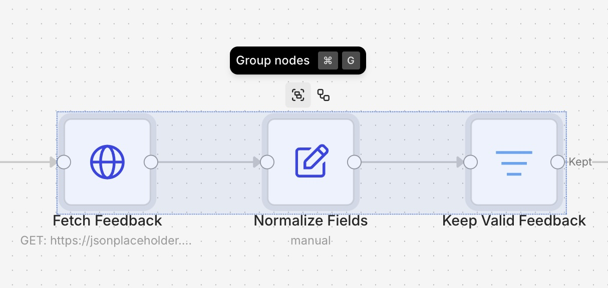

# Changelog

Every n8n release moves the platform forward. The changelog is where we call out the changes that matter most to the technical teams who build on n8n: new capabilities, more control over how your workflows run, and clearer visibility into what they're actually doing. Each entry is tied to the version it shipped in, newest first, and written to stand on its own, so it's easy to share the one update your team has been waiting for.


For complete, version-by-version detail on every release, see the [Releases page](https://github.com/n8n-io/n8n/releases) on GitHub. This changelog covers stable n8n 2.x releases onward; release notes for [1.x](release-notes-1.x.md) and [0.x](release-notes-0.x.md) remain archived.




---

## `n8n 2.30` App-only authentication for Microsoft nodes

**Released:** 2026-07-07

You can now authenticate Microsoft nodes with a [Microsoft Entra Service Principal](https://docs.n8n.io/integrations/builtin/credentials/microsoftentraserviceprincipal), so workflows run as an application instead of a signed-in user. OneDrive and Outlook gained the option in 2.29; Excel 365, Microsoft Teams, and Microsoft To Do follow in 2.30, all sharing a single app-only credential.

Until now, Microsoft automations were tied to a person's OAuth session: when that person left the company or their token expired, the workflow broke. With app-only authentication, the workflow authenticates non-interactively with tenant-level permissions and targets the user, mailbox, drive, or site you specify: read a shared mailbox, process files in any user's drive, or post to Teams channels with nobody logged in. OAuth2 remains the default everywhere, so existing workflows are untouched, and operations that only make sense for a signed-in user are disabled per node with a clear error.

_OneDrive and Outlook support released in 2.29 (2026-06-30)._

### GitHub App authentication

_Released in 2.29 (2026-06-30)._

[GitHub nodes](https://docs.n8n.io/integrations/builtin/app-nodes/n8n-nodes-base.github) can now authenticate as a GitHub App instead of a personal access token. Authentication is JWT-based with standardized private-key handling, so your GitHub automations belong to the organization rather than to whoever created the token, with fine-grained permissions and no PAT to rotate when people move on.

### mTLS authentication for Kafka

The [Kafka credential](https://docs.n8n.io/integrations/builtin/credentials/kafka) now supports mutual TLS: provide a CA certificate, client certificate, and private key (PEM) to connect to brokers that require client-certificate authentication. mTLS applies to the Kafka node, the Kafka Trigger, and the credential test, and n8n validates that certificate and key match before you save.

---

## `n8n 2.29` Insights alerts you when date ranges exceed available data

**Released:** 2026-06-30

When you select a date range in the Insights dashboard, you can now see at a glance whether your data retention policy covers that period. Instead of staring at an empty chart and wondering whether something is broken, an alert banner tells you exactly what is happening with your data coverage.

Three states guide you as you work with custom date ranges:

* **No data in range:** The entire selected period falls outside your retention window, so no executions are available to display.
* **Partial data:** Some executions exist within the range. The alert specifies the earliest available date so you know where your data begins.
* **Complete data:** All executions in the selected range are present. No alert appears.

To use this, open the Insights dashboard, choose a date range with the date range picker, and check the alert banner at the top of the dashboard. If you see a partial or no-data alert, adjust your range to align with the dates your retention policy covers. Note that the alerts reflect your current retention configuration and do not extend how long execution data is stored.

Learn more in the [documentation](<https://docs.n8n.io/administer/observe-and-log/track-usage-with-insights#disable-or-configure-insights-metrics-collection>).


**Availability:** Pro and above.


---

## `n8n 2.29` MCP server updates

**Released:** 2026-06-30

We've shipped a number of updates to the n8n MCP server over the past few weeks. Here's a roundup, with the version each change landed in.

* **Build with custom and community nodes.** You can now use your installed custom and community nodes in the workflows you build, not just the built-in ones (v2.29).
* **Read and change workflow settings.** Workflow settings are now editable through the MCP server, so you can connect an error workflow, set the timezone, or adjust execution options (v2.29).
* **View and restore workflow history.** You can now browse a workflow's version history and restore an earlier version (v2.29).
* **More reliable credential assignment.** Fixed a bug where the server could assign a credential that wasn't valid for a node (v2.28).
* **Look up real field values.** Dynamic fields like Slack channels or Google Sheets tabs now resolve to live values, so nodes are configured with valid selections instead of placeholder IDs (v2.27).
* **Work with tags.** Tags are now supported, so you can filter a workflow search by tag and apply tags when creating or updating workflows (v2.27).
* **Faster, targeted edits.** Workflow updates now change only the nodes that need to change instead of rewriting the whole thing (v2.22).
* **List and choose credentials.** You can now list the credentials on your instance and pick the right one when several could apply, for example among five Gmail credentials (v2.21).

Learn more in the [n8n MCP server documentation](https://docs.n8n.io/connect/connect-to-n8n-mcp-server).

---

## `n8n 2.28` Organize large workflows with Canvas Groups

**Released:** 2026-06-29

You can now organize related nodes into a single named Canvas Group and collapse it for a cleaner view. Group the nodes that handle one part of a workflow, give the group a name, and collapse it to hide the detail until you need it. A large workflow that used to sprawl across the canvas shrinks to a handful of labeled blocks you can read at a glance, so it's faster to find your way around a workflow a teammate built or one you haven't opened in months.

<figure><figcaption><p>Select a connected run of nodes, then group them with the Group nodes button or Ctrl/Cmd + G.</p></figcaption></figure>

To create a group, select a connected run of nodes by dragging a box around them or holding `Ctrl/Cmd` and clicking each one, then press `Ctrl/Cmd` + `G` or select the **Group nodes** icon in the toolbar. n8n creates the group and highlights the name field so you can name it straight away. Collapse or expand a group with its toggle icon, and ungroup it at any time with `Ctrl/Cmd` + `Shift` + `G`, which leaves the nodes on the canvas.

A Canvas Group is saved with the workflow, so anyone who opens it sees the same structure. Whether a group is collapsed or expanded is a personal preference stored in your browser, so your view stays put when you come back without changing what teammates see. A few rules decide which nodes you can combine into one group: triggers stay outside them, the nodes have to form one connected chain, and an AI node keeps its sub-nodes (chat model, memory, and tools) inside the same group.

Learn more in the [Canvas Groups documentation](https://docs.n8n.io/build/understand-workflows/workflow-components/canvas-groups).

### GitHub node: manage the full pull request lifecycle

The [GitHub node](https://docs.n8n.io/integrations/builtin/app-nodes/n8n-nodes-base.github) now has a dedicated Pull Request resource. Create pull requests (including drafts and cross-fork PRs), update, close, and reopen them, read and add comments, fetch diffs and patches, and merge with merge, squash, or rebase. These native operations replace the custom HTTP Request setups that such tasks used to need. Errors are surfaced exactly as GitHub returns them, so failures are easy to diagnose.

### Webhook node: Only Run If

The [Webhook node](https://docs.n8n.io/integrations/builtin/core-nodes/n8n-nodes-base.webhook) gains an expression-based **Only run if** option that rejects requests that don't match a condition before an execution starts. Filter out health checks, retries, or irrelevant events at the door instead of starting a run that immediately exits: fewer no-op executions, less noise in your execution list, and saved execution quota.

---

## `n8n 2.27` Move workflows between instances as packages

**Released:** 2026-06-16

You can now bundle workflows into a portable `.n8np` package and move them between n8n instances through the Public API or a matching set of CLI commands that wrap the same endpoints. Copying workflow JSON by hand always worked for one-off moves. Packages make it repeatable and automatable, carrying a set of workflows along with their credential stubs and a `manifest.json` describing their dependencies in a single file.

Imports are checked up front. If a conflict or an unresolved credential would block the import, n8n stops and lists the issues instead of leaving you half-migrated. For each import you choose whether to bring a workflow in as a new version, fail on the first conflict, or skip ones that already exist. Credentials are matched by ID and their secrets never travel in the package; n8n exports a stub you match on the target instance, or fills in empty placeholders for later.

This makes it easy to promote workflows from development to production, back up and restore an instance, hand a workflow to a teammate without sharing secrets, or migrate between instances.


This feature is in **beta**. The package format and APIs are still under development, and breaking changes may occur without a major version bump.


Learn more in the [n8n Packages documentation](https://docs.n8n.io/build/manage-workflows/n8n-packages).

---

## `n8n 2.25` Web search for AI agents

**Released:** 2026-06-02

Your AI agents can now search the web out of the box. Enable web search from the agent's Advanced panel: where the model provider offers a native search tool, the agent uses it directly, and for providers without one, n8n falls back to Brave Search or a self-hosted SearXNG instance. Until now, giving an agent live web access meant wiring up a community node or an external API by hand; now it's built in, so agents can ground their answers in current information like prices, docs, and news, without extra setup.

### Form Trigger: restrict forms to logged-in users

The [Form Trigger](https://docs.n8n.io/integrations/builtin/core-nodes/n8n-nodes-base.formtrigger) (v2.6) adds an **n8n User Auth** option that gates a form to authenticated users of your instance. Visitors who aren't signed in are redirected to the n8n login, and the trigger outputs the authenticated user's ID, email, and name alongside the submission (with an opt-out). It works with all n8n auth modes and across multi-page forms, which makes it ideal for internal request forms where you need to know reliably who submitted.

### Custom OAuth scopes for Microsoft credentials

The OneDrive, Outlook, and SharePoint OAuth2 credentials now include a **Custom Scopes** toggle. Defaults stay unchanged, but you can grant additional Microsoft Graph permissions or trim scopes down to what your tenant allows, instead of being limited to n8n's default consent set.

---

## `n8n 2.23` Rebuilt Odoo node and Oracle vector search

**Released:** 2026-05-27

The [Odoo node](https://docs.n8n.io/integrations/builtin/app-nodes/n8n-nodes-base.odoo) has been rebuilt as v2, while existing v1 workflows keep working unchanged. The new version supports API-key authentication for Odoo 19+, searchable resource locators so you pick records from a list instead of pasting IDs, and dynamic field mapping on create and update that shows the actual fields of your Odoo instance, with read-only and computed fields hidden so you can't write to what can't be written. Contact, Opportunity, Activity, and Custom resources round out the coverage, and the node selects the right API transport for your Odoo version automatically.

### Oracle Database as a vector store

New [Oracle DB Vector Store](https://docs.n8n.io/integrations/builtin/cluster-nodes/root-nodes/n8n-nodes-langchain.vectorstoreoracledb) and [Oracle ONNX Embedding](https://docs.n8n.io/integrations/builtin/cluster-nodes/sub-nodes/n8n-nodes-langchain.embeddingsoracledb) nodes bring retrieval-augmented generation to data that lives in Oracle. Insert, load, and retrieve documents (including retrieve-as-tool for AI agents) with configurable distance strategies and metadata filtering that supports nested AND/OR conditions. Embeddings are generated by an ONNX model loaded in the database itself, so vectors and source data stay in one place. Requires an ONNX model in the database.

### Complete results from multi-run sub-workflows

When a sub-workflow's last node runs more than once, the [Execute Workflow Trigger](https://docs.n8n.io/integrations/builtin/core-nodes/n8n-nodes-base.executeworkflowtrigger) (v1.2) now returns the items from every run, concatenated per output branch. Previously you only got the final run. Older trigger versions keep their existing behavior and gain an **Items to return** option to opt in.

---

## `n8n 2.22` Connect to MCP servers with less setup

**Released:** 2026-05-19

Connect your agent to select MCP servers without setting up an [MCP Client node](https://app.gitbook.com/s/BKcbOzIWja8NfqKDcqHc/builtin/core-nodes/n8n-nodes-langchain.mcpClient) and credential by hand. Pick a server from the nodes panel, sign in, and it's available to your agent.

Initial coverage includes some of the most-used services in the official MCP registry — Apify, Linear, monday.com, Notion, and PostHog — and we'll expand the list to cover more services soon.

If you need to connect to an MCP server that isn't in the list, you can still use the [MCP Client node](https://app.gitbook.com/s/BKcbOzIWja8NfqKDcqHc/builtin/core-nodes/n8n-nodes-langchain.mcpClient) with manual configuration.


Connect to MCP servers with less setup


### OpenTelemetry custom telemetry tags

You can now attach custom span attributes to OpenTelemetry traces at the node, workflow, and project level, letting you filter and group execution spans by tenant, environment, customer ID, or any other dimension. Attribute values support expressions, so they can pull live data from webhook payloads or API responses at runtime rather than relying on hardcoded values. Configure tags in node or workflow settings when tracing is enabled (`N8N_OTEL_ENABLED=true`).

Learn more in the [documentation](<https://docs.n8n.io/deploy/host-n8n/keep-n8n-running/trace-executions-with-opentelemetry#custom-span-attributes>).


**Availability:** Enterprise.



---

## `n8n 2.21` Verified webhooks across fourteen trigger nodes

**Released:** 2026-05-12

Fourteen trigger nodes now verify the signatures of incoming webhooks, so forged or tampered requests are rejected with a 401 before they ever start an execution: Acuity Scheduling, Asana, Cal.com, Calendly, Customer.io, Figma, Formstack, GitLab, MailerLite, Mautic, Onfleet, Taiga, Trello, and Twilio.

Verification uses each service's own signing mechanism, typically an HMAC signature header, with constant-time comparison and, where the service supports it, replay protection. Signing secrets are generated and registered automatically when n8n creates the webhook and stored with the workflow. Existing webhooks without a stored secret keep working, so nothing breaks on upgrade; new webhooks simply come out more secure by default.

This is part of a broader hardening pass across releases: Netlify verification shipped in 2.20, and AWS SNS, Box, and Microsoft Teams followed in 2.22.

### Jira: OAuth2 authentication

The [Jira node](https://docs.n8n.io/integrations/builtin/app-nodes/n8n-nodes-base.jira) and [Jira Trigger](https://docs.n8n.io/integrations/builtin/trigger-nodes/n8n-nodes-base.jiratrigger) add a **Cloud (OAuth2)** authentication option using Atlassian's OAuth 2.0 authorization code flow (3LO). Connect through auth.atlassian.com with your Atlassian cloud ID resolved and cached automatically. No more creating and rotating API tokens by hand for Jira Cloud.

---

## `n8n 2.20` Microsoft Agent 365 Trigger node

**Released:** 2026-05-05

### Microsoft Agent 365 Trigger node

The [Microsoft Agent 365 Trigger node](https://app.gitbook.com/s/BKcbOzIWja8NfqKDcqHc/builtin/cluster-nodes/root-nodes/n8n-nodes-langchain.microsoftagent365trigger) lets you build n8n agents that show up as members of your team inside Microsoft 365 apps. Once deployed, your agent gets its own identity in your Microsoft tenant, with an email address you can @mention in Teams, send email to, or grant SharePoint permissions to — just like a teammate.

<figure><figcaption><p>A Microsoft Agent 365 Trigger node with a chat model, memory, and tools across<br>Zendesk, Salesforce, PagerDuty, Datadog, and a sub-workflow.</p></figcaption></figure>

You build the agent in n8n using the trigger node: add a system prompt and give it access to tools, MCP servers, and your existing workflows using [sub-workflows as tools](https://app.gitbook.com/s/rPN1zU5jaYNvwH7RzxqA/flow-logic/break-workflows-into-smaller-parts). You then set the agent up on the Microsoft side, which gives it an Entra ID identity with an email address. Microsoft handles identity, lifecycle, security, and compliance (via Entra ID, Purview, and Defender); n8n handles workflow-level governance like RBAC, credential management, and execution logs.

If you already use n8n with Microsoft services through individual nodes (Outlook, Teams, SharePoint, and so on), those workflows continue to work as before. Agent 365 is a new path for teams that want their agents to show up _inside_ Microsoft apps and interact like a member of the team. The node requires a Microsoft 365 tenant.

For the full launch story, see the [n8n blog post](https://blog.n8n.io/deploy-n8n-agents-that-show-up-as-members-of-the-team-inside-microsoft-apps/).

### Insights data duration

Self-hosted instances can now retain insights data for up to 365 days by default, with a configurable maximum of 730 days. Retention is controlled by the new `N8N_INSIGHTS_MAX_AGE_DAYS` environment variable and is no longer tied to license logic. See the [insights docs](https://app.gitbook.com/s/wMJrGrimpx3PxCJpUswm/observe-and-log/track-usage-with-insights).

---

## `n8n 2.19` IdP role mapping and instance bootstrapping (Enterprise)

**Released:** 2026-04-28

### IdP role mapping inside n8n

Instance admins can now define group-to-role mappings inside n8n instead of encoding n8n-specific role logic in the IdP. With JIT provisioning enabled, admins write expressions against SAML attributes or OIDC claims to assign instance and project roles automatically at login. The IdP only needs to send standard group membership data: n8n handles the mapping, and role assignments are re-evaluated on every login, so access stays in sync without IdP changes.

Open **Settings → SSO**, pick **Instance roles via SSO** or **Instance and project roles via SSO** under User role provisioning, switch the mapping card from "Map rules on your IdP" to "Map rules inside n8n", and add expressions using the `$claims` object to match users for each role. Expression-based matching handles non-standard group structures that plain string matching can't reach.


**Availability:** Enterprise and Business.


### Instance bootstrapping

n8n can now be fully configured at startup through environment variables. Owner accounts, SSO (OIDC and SAML), security policies, and log streaming destinations are all applied on first boot, with no manual UI interaction required. Fields managed this way are locked in the UI and re-applied on every restart.

This makes deployment configuration the single source of truth, so you can stand up a fully configured instance from a single Helm chart or Docker Compose file, including SSO and security policy, before any user logs in.


**Availability:** Enterprise.


---

## `n8n 2.18` Favorites

**Released:** 2026-04-21

You can now mark projects, folders, workflows, and data tables as favorites, so the resources you work with every day are one click away instead of a search away.

### Slack Trigger: App Home opens as a dedicated event

The [Slack Trigger](https://docs.n8n.io/integrations/builtin/trigger-nodes/n8n-nodes-base.slacktrigger) now offers **app_home_opened** as a dedicated event option. Previously, reacting to App Home opens meant subscribing to Any Event and filtering downstream, which started an execution for every unrelated Slack event.

### Linear Trigger: webhook signature verification

Linear credentials gain an optional signing secret. When set, the [Linear Trigger](https://docs.n8n.io/integrations/builtin/trigger-nodes/n8n-nodes-base.lineartrigger) verifies each incoming webhook's HMAC-SHA256 signature and validates its timestamp within a 60-second window, rejecting invalid or replayed requests with a 401.

---

## `n8n 2.17` New model providers: Moonshot Kimi and Alibaba Cloud Model Studio

**Released:** 2026-04-13

Two model providers join n8n's AI lineup natively. **Moonshot Kimi** arrives as both a [chat-model sub-node](https://docs.n8n.io/integrations/builtin/cluster-nodes/sub-nodes/n8n-nodes-langchain.lmchatmoonshot) for AI Agents (with a dynamic model list, defaulting to kimi-k2.5) and a [standalone node](https://docs.n8n.io/integrations/builtin/app-nodes/n8n-nodes-langchain.moonshot) with multi-turn chat, tool calling, built-in web search, thinking mode, JSON responses, and image analysis. **[Alibaba Cloud Model Studio](https://docs.n8n.io/integrations/builtin/app-nodes/n8n-nodes-langchain.alibabacloud)** brings the Qwen family: chat with web search and agent-tool support, vision-language image analysis, text-to-image, and text- and image-to-video generation with automatic download of results.

More providers followed in later releases:

### MiniMax

_Released in 2.18 (2026-04-21)._

A [MiniMax chat-model sub-node](https://docs.n8n.io/integrations/builtin/cluster-nodes/sub-nodes/n8n-nodes-langchain.lmchatminimax) (OpenAI-compatible API, default MiniMax-M2.7, with a Hide Thinking option that strips reasoning traces for clean responses) plus a [standalone MiniMax node](https://docs.n8n.io/integrations/builtin/app-nodes/n8n-nodes-langchain.minimax) covering chat, image generation, asynchronous video generation, and text-to-speech with voice, emotion, speed, and pitch controls.

### NVIDIA Nemotron embeddings

_Released in 2.26 (2026-06-09)._

The NVIDIA Nemotron Embeddings node generates embeddings from NeMo Retriever models via build.nvidia.com or a self-hosted NIM, reusing the existing NVIDIA credential. The node automatically sets the right input type per call ("passage" when indexing, "query" when searching), preventing the silent retrieval-quality degradation that mismatched input types cause.

---

## `n8n 2.16` Embedded access and execution data redaction (Enterprise)

**Released:** 2026-04-07

### Token exchange authentication for embedded access

n8n now supports OAuth 2.0 Token Exchange (RFC 8693) as a second authentication mechanism alongside API keys. Two scenarios are covered: seamless iframe embedding, where users see n8n inside another product without a separate login screen, and delegated API access, where a system acts on behalf of a user with full audit attribution.

The embedding system holds an asymmetric private key and signs short-lived JWTs with user identity claims. n8n verifies the signature using the configured public key, just-in-time provisions the user on first encounter, and issues a session cookie or scoped API token depending on the flow. Both subject and actor are preserved in the audit trail, so every action shows both who requested it and who performed it.


**Availability:** Enterprise. Requires an asymmetric key pair configured via `N8N_TOKEN_EXCHANGE_TRUSTED_KEYS`. Uses role-based scoping.


### Execution data redaction

Instance and project admins can now redact execution data. When enabled, sensitive data from production runs is never displayed in the UI, and isn't fetched from the database until a user with the reveal permission explicitly requests it. Manual executions can be left fully visible so developers can keep building and debugging without interruption. Every reveal is logged as an audit event.

Redaction is configured per workflow under **Workflow settings**, and reveal access is granted via project or instance settings to specific users only. See the [execution data redaction docs](https://app.gitbook.com/s/jm0ZYRpZIPWge2ZSiDYO/host-n8n/configure-n8n/security/redact-execution-data).


**Availability:** Enterprise.


### Public API improvements

* **Community packages.** Install, list, update, and uninstall community packages programmatically through new endpoints under `/api/v1/community-packages`. Each operation requires an API key with the matching `communityPackage:*` scope.
* **Insights scope.** A new `insights:read` API key scope, setting up the insights summary endpoint that ships in v2.17.

---

## `n8n 2.15` OpenTelemetry support for workflows

**Released:** 2026-03-30

n8n now emits OpenTelemetry traces for workflow executions. Runs become traces in your existing OpenTelemetry backend, with no sidecars, custom exporters, or timing hacks. Teams already using Jaeger, Datadog, Grafana Tempo, Honeycomb, New Relic, or Splunk see n8n alongside everything else they observe.

Each execution appears as a root trace span with workflow ID, name, execution ID, status, duration, node count, and project info as span attributes. Failed runs surface error details on the span, so you can search and alert on workflow failures from the same tools that watch the rest of your stack.

Enable by pointing n8n at any OTLP-compatible collector. Minimum config is two environment variables:

```
N8N_OTEL_ENABLED=true
N8N_OTEL_EXPORTER_OTLP_ENDPOINT=http://your-collector:4318
```

Standard OTel variables (`OTEL_EXPORTER_OTLP_ENDPOINT`, `OTEL_SERVICE_NAME`) are also respected.

This is the foundational T1 feature. It was extended across later releases: node-level spans (v2.16), workflow version IDs in spans and distributed trace context propagation (v2.18 to v2.19), and AI Agent telemetry (v2.20).


**Availability:** Free, Pro, and Enterprise.


---

## `n8n 2.14` Databricks node

**Released:** 2026-03-24

n8n now connects natively to Databricks. The new node runs SQL with asynchronous polling and chunked results (each row arrives as its own item), manages Unity Catalog objects (catalogs, schemas, tables, volumes, and functions), calls Model Serving endpoints with automatic input detection and validation, interacts with Genie AI, handles file operations up to 5 GiB, and manages Vector Search indexes. Lakehouse data can flow through the same workflows as the rest of your stack, without custom HTTP wiring. Learn more in the [Databricks node documentation](https://docs.n8n.io/integrations/builtin/app-nodes/n8n-nodes-base.databricks).

### Perplexity node v2

The [Perplexity node](https://docs.n8n.io/integrations/builtin/app-nodes/n8n-nodes-langchain.perplexity) moves to v2 with full API coverage while keeping v1 workflows compatible: agent responses with third-party models, tools, and JSON-schema structured outputs; raw search with advanced filters; and embeddings, including contextualized embeddings.

### See what depends on what

Workflow, credential, and data table cards, as well as the data table detail view, now show dependency information, so you can check what relies on a resource before you delete or change it.

---

## `n8n 2.13` Visual diff in version history

**Released:** 2026-03-16

### Visual diff comes to version history

Open version history, click **Compare changes**, pick any two versions, and the canvas renders both side by side with changed nodes highlighted. A change count badge on each version helps you spot significant edits at a glance.

Visual diff is available on Cloud Pro and above.

### Project-scoped external secrets: full team access (Enterprise)

What's new:

* Project admins manage their own vault connections from project settings.
* Project editors can use project-scoped secrets in credentials once the instance admin enables access.
* [Custom roles](https://app.gitbook.com/s/wMJrGrimpx3PxCJpUswm/manage-users-and-access/set-permissions-and-roles-rbac/create-custom-roles) now include five secrets scopes: list, read, create, update, and delete.
* Instance admins/owners no longer need to be project members for secrets to resolve.

**For instance admins:** go to **Settings > External Secrets** and enable the **System Roles** toggle, or use custom roles for more granular control.

**For project admins:** go to **Project Settings > External Secrets** to create and manage project-level connections. Instance-level connections shared with you appear as read-only.

Refer to [External secrets](https://app.gitbook.com/s/wMJrGrimpx3PxCJpUswm/manage-credentials/use-external-secret-stores) for more information.


**Availability:** Enterprise.


### Folder-based filtering in the push and pull dialog (Enterprise)

The push and pull dialogs now include a **Folder** filter alongside Status and Owner. Selecting a folder scopes the list to workflows in that folder and its subfolders, shown as a hierarchical tree with folder-level checkboxes. Text search also matches folder names.


**Availability:** Enterprise. Requires [Environments](https://app.gitbook.com/s/wMJrGrimpx3PxCJpUswm/use-source-control-and-environments/set-up-source-control) configured.


---

## `n8n 2.12` 1Password as an external secrets provider (Enterprise)

**Released:** 2026-03-09

n8n now supports 1Password Connect Server as an [external secrets](https://app.gitbook.com/s/wMJrGrimpx3PxCJpUswm/manage-credentials/use-external-secret-stores) provider, alongside HashiCorp Vault, AWS Secrets Manager, Azure Key Vault, and GCP Secret Manager.

Secrets are fetched at runtime and never stored in n8n: 1Password stays the single source of truth. Multi-field items are available as structured sub-paths: `$secrets.<vault>.<item>.<field>`.

**How to connect:**

1. Deploy a 1Password Connect Server and create an access token scoped to the vaults n8n should read.
2. In n8n, go to **Settings > External Secrets**, select **1Password**, and enter your Connect Server URL and token.

Requires a self-hosted 1Password Connect Server with read-only access.


**Availability:** Enterprise.


---

## `n8n 2.11` Easier credential setup on Cloud

**Released:** 2026-03-02

### Easier credential setup on Cloud

Setting up credentials on n8n Cloud is now much simpler. For supported services, just click the **Connect** button, authenticate with the service, and you're ready to go. Skip the manual setup for Slack, Firecrawl, HubSpot, GitHub, Google Calendar, PagerDuty, Apify, and more.

<figure><figcaption><p>Setting up Slack credentials with managed OAuth</p></figcaption></figure>

Things to keep in mind:

* If you prefer to use your own OAuth configuration, you can still switch to manual setup from the auth mode dropdown at any time.
* This feature is only available on n8n Cloud, where n8n manages the OAuth apps on your behalf.

### Custom roles: Assignments tab (Enterprise)

Instance admins now have a dedicated **Assignments** tab on each [custom role](https://app.gitbook.com/s/wMJrGrimpx3PxCJpUswm/manage-users-and-access/set-permissions-and-roles-rbac/create-custom-roles) showing every user assigned to that role, which project they're in, and a direct link to manage them — no more navigating project by project.

### Project-scoped external secrets: instance admin setup (Enterprise)

Instance admins can now create vault connections scoped to a specific project. Secrets from that connection appear only within that project's credentials, not across the instance. Instance-level connections are unaffected. Refer to [External secrets](https://app.gitbook.com/s/wMJrGrimpx3PxCJpUswm/manage-credentials/use-external-secret-stores) for more information.

### Workflow execute as a separate permission scope (Enterprise)

`workflow:execute` is now a distinct scope in [custom project roles](https://app.gitbook.com/s/wMJrGrimpx3PxCJpUswm/manage-users-and-access/set-permissions-and-roles-rbac/create-custom-roles), separate from editing and publishing. Users can be granted run access without being able to modify the workflow, which is a common compliance requirement for sensitive workflows.


**Availability:** Custom roles and project-scoped external secrets are available on n8n Enterprise.


---

## `n8n 2.8` Personal space policies and finer-grained governance (Enterprise)

**Released:** 2026-02-09 – 2026-02-13 (2.8.0–2.8.3)

### Personal space policies

_Released in 2.8.3 (2026-02-13)._

A new **Security & policies** settings section provides a central place for enforcing security requirements on your instance. In addition to the existing two-factor authentication enforcement, admins can now control what users can do in their personal spaces.

Available policies include:

* **Sharing**: control whether users can share workflows and credentials from their personal space.
* **Workflow publishing**: control whether users can publish workflows from their personal space.

This release builds on recent updates to the permissions model, including [custom project roles](https://app.gitbook.com/s/wMJrGrimpx3PxCJpUswm/manage-users-and-access/set-permissions-and-roles-rbac/create-custom-roles), to better support policy-driven governance.

<figure><figcaption><p>The new Security &#x26; policies settings section</p></figcaption></figure>

### Custom roles: improved discoverability and permission visibility

_Released in 2.8.3 (2026-02-13)._

The project role selector now separates built-in system roles and custom roles into distinct sections, making it easier to find and choose the right role. Hovering over a role shows a summary of its configured permissions, with an option to view the full permission details.

<figure><figcaption><p>System roles and custom roles are now displayed in separate sections</p></figcaption></figure>

### Stronger external secrets validation

_Released in 2.8.0 (2026-02-09)._

n8n now verifies that the current user has access to the referenced vaults before allowing a credential that uses `$secrets...` expressions to be saved. If access is missing, the save operation fails. This prevents secret values from being exposed through guessed secret paths.

### Improved API auditability

_Released in 2.8.0 (2026-02-09)._

API endpoints have been expanded to provide clearer visibility into project membership and credentials:

* `GET /projects/{projectId}/users` returns all members of a project including their assigned role.
* `GET /credentials` returns a paginated list of all credentials across the instance, including the project they belong to.

This makes it easier to audit who has access to which projects and credentials without manually reviewing each one in the UI.

### More granular workflow permissions

_Released in 2.8.0 (2026-02-09)._

Workflow publishing permissions for [custom roles](https://app.gitbook.com/s/wMJrGrimpx3PxCJpUswm/manage-users-and-access/set-permissions-and-roles-rbac/create-custom-roles) have been split into two separate scopes: `workflow:publish` and `workflow:unpublish`. This enables more precise access control in governance scenarios where unpublishing needs to be managed independently.


**Availability:** Personal space policies, custom roles, stronger external secrets validation, and improved API auditability are available on n8n Enterprise.


---

## `n8n 2.6` Human-in-the-loop for AI tool calls

**Released:** 2026-01-26

You can now require explicit human approval before an AI Agent executes specific tools.

Human-in-the-loop (HITL) for AI tool calls enforces review directly at the tool level. A gated tool cannot execute unless a human explicitly approves the action, giving you deterministic control over high-impact operations like deleting records, writing to production systems, or sending high-impact emails. This removes the uncertainty of prompt-based safeguards and insulates you from probabilistic agent behavior.

Because the review step is implemented using standard n8n integrations, approvals are not limited to a single user or interface. Decisions can be routed across people and systems, enforcing approval from the right person using the channels they already work in.

**What you can do:**

* Require explicit human approval for any tool the agent can call, including the MCP Client tool or sub-workflows exposed as tools.
* Apply approval selectively, so some tools execute autonomously while others require review.
* Route approvals across users and channels (for example, send a Slack-initiated action for approval by another user via email).
* Add safety checks for high-impact or potentially destructive operations without complex workflow patterns or brittle prompt logic.

**How to use it:** on the connection from the AI Agent to the tool you want to gate, click the **+** icon and choose **Add human review step**. The Tools panel opens with nodes you can use to handle the review; select one and configure the approver, the message, and the available actions.

Get precise control over where human judgment is required, without limiting what your agent can do. Learn more in the [human-in-the-loop tools docs](https://app.gitbook.com/s/rPN1zU5jaYNvwH7RzxqA/integrate-ai/ai-examples/human-in-the-loop-for-tools).


Human in the loop for AI tool calls


---

## `n8n 2.5` Chat node: human-in-the-loop actions

**Released:** 2026-01-20

The **Chat** node now includes two new actions for human-in-the-loop interactions in agentic workflows:

* **Send a message**: send a message to the user and continue the workflow.
* **Send a message and wait for response**: send a message and pause execution until the user replies. Users can respond with free text in the Chat or by clicking inline approval buttons, as defined in the node's configuration.

These actions can be used as deterministic workflow steps or as tools for an **AI Agent**, enabling multi-turn human interaction within a single execution when using the **Chat Trigger**.

When used as an agent tool, the agent can ask for clarification before proceeding, helping it better interpret user intent and follow instructions. Agents can also send updates during long-running workflows using these actions.

**How to:**

1. Trigger your workflow with the **Chat Trigger** node. In the node parameters, add the _Response Mode_ option and set it to _Using Response Nodes_.
2. Add a **Chat** node later in the workflow, or add it as a tool for an **AI Agent**. Select one of the operations: _Send a message_ or _Send a message and wait for response_.

Keep in mind: if you want an AI Agent to choose between sending a message or waiting for input, add two **Chat** tool nodes, one for each action. For AI Agents triggered by the **Chat Trigger** node, adding **Send a message and wait for response** is recommended so the agent can request clarification when needed.

Learn more in the [Chat node documentation](https://app.gitbook.com/s/BKcbOzIWja8NfqKDcqHc/builtin/core-nodes/n8n-nodes-langchain.chat#operation).


Human in the loop for the Chat node


---

## `n8n 2.4` TLS for Syslog log streaming and credential updates via API

**Released:** 2026-01-12

### TLS support for Syslog log streaming

The Syslog log streaming destination now supports TLS over TCP for encrypted connections. This enables secure log streaming to enterprise SIEM and observability platforms that require encrypted transport. With this release, log streaming is now compatible with a broader range of enterprise SIEM platforms.

### Update credentials via API

n8n's public API now supports updating existing credentials by ID via a new `PATCH /credentials/:id` endpoint. Previously, credentials could only be created through the API, so any changes required deleting and recreating the credential.

When updating, you can either replace all credential data at once (useful for bulk updates) or set `isPartialData: true` to merge changes with existing data. Ideal for automated secret rotation or fixing individual values without losing your configuration.

---

## `n8n 2.2` Finer-grained workflow permissions and richer audit events

**Released:** 2025-12-22

### More granular workflow permissions within Custom Project Roles (Enterprise)

Custom Project Roles allow you to define fine-grained permissions at the project level. With this release, workflow permissions have been further refined by separating workflow editing from workflow publishing.

This change makes it easier to align access controls with internal processes where building workflows and publishing them are handled by different users or teams.

<figure><figcaption><p>Custom Project Roles</p></figcaption></figure>

### Log streaming: more audit events for improved observability

Log streaming now includes additional audit events to improve visibility into operational and security-relevant changes.

This update adds events for manual workflow cancellations and workflow activation/deactivation (publish/unpublish), variable lifecycle events (create/update/delete), and user management actions (including enabling/disabling 2FA).

Workflow settings updates are also logged with the specific parameters that changed (for example, selecting a new error workflow), instead of a generic "updated" event.

---

## `n8n 2.1` Time Saved node

**Released:** 2025-12-16

Previously, teams could only track a single fixed time saved value for each workflow regardless of which path an execution takes. The new Time Saved node enables more precise time savings calculations where different execution paths save different amounts of time.

With this release you can now:

* **Choose fixed value or dynamic time tracking**: use a fixed time saved value for simple workflows, or use one or many Time Saved nodes to calculate savings dynamically based on the actual execution path taken.
* **Configure per-item calculations**: when using the Time Saved node, choose whether to calculate time saved once for all items or multiply by the number of items processed.

<figure><figcaption><p>Time saved node in a workflow</p></figcaption></figure>

n8n automatically totals the time from all Time Saved nodes executed during each workflow run and reports it within the insights dashboard.

<figure><figcaption><p>Total time saved calculation</p></figcaption></figure>
