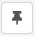

To pin data in a node:

1. Run the node to load data.
2. In the **OUTPUT** view, select **Pin data** . When data pinning is active, the button is disabled and a "This data is pinned" banner is displayed in the **OUTPUT** view.


**Nodes that output binary data**

You can't pin data if the output data includes binary data.

