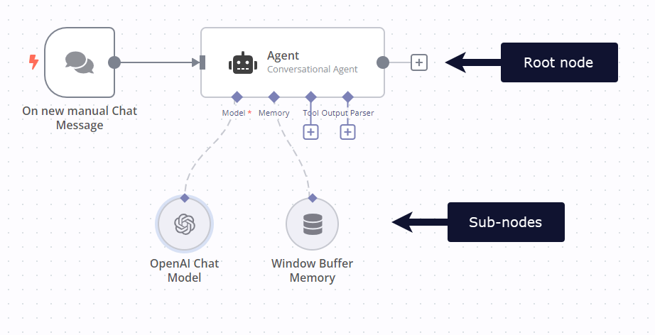

[Cluster nodes](https://app.gitbook.com/s/CxSeOtVxqqhfxMSac0AV/key-concept-glossary#cluster-node-n8n) are node groups that work together to provide functionality in an n8n workflow. Instead of using a single node, you use a [root node](https://app.gitbook.com/s/CxSeOtVxqqhfxMSac0AV/key-concept-glossary#root-node-n8n) and one or more [sub-nodes](https://app.gitbook.com/s/CxSeOtVxqqhfxMSac0AV/key-concept-glossary#sub-node-n8n) that extend the functionality of the node.

