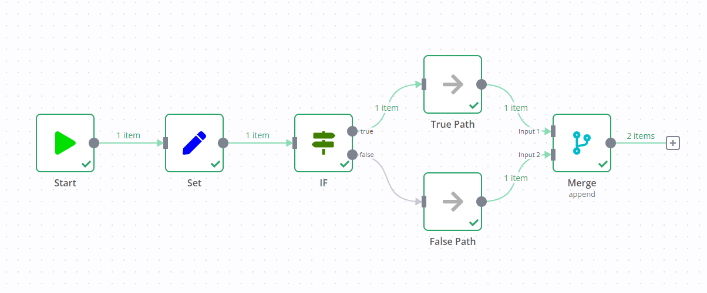


**0.236.0 and below**

n8n removed this execution behavior in n8n 1.0. This section applies to workflows using the **v0 (legacy)** workflow execution order. By default, this is all workflows built before n8n 1.0. You can change the execution order in your [workflow settings](https://app.gitbook.com/s/rPN1zU5jaYNvwH7RzxqA/manage-workflows/configure-workflow-settings).

If you add a Merge node to a workflow containing an If node, it can result in both output data streams of the If node executing.

One data stream triggers the Merge node, which then goes and executes the other data stream.

For example, in the screenshot below there's a workflow containing an Edit Fields node, If node, and Merge node. The standard If node behavior is to execute one data stream (in the screenshot, this is the **true** output). However, due to the Merge node, both data streams execute, despite the If node not sending any data down the **false** data stream.

